## 容器与 bean

### 1) 容器接口

* BeanFactory 接口，典型功能有：
  * getBean

* ApplicationContext 接口，**是 BeanFactory 的子接口。它扩展了 BeanFactory 接口的功能**，如：
  * **国际化**
  * **通配符方式获取一组 Resource 资源**
  * 整合 Environment 环境（能通过它获取各种来源的配置信息）
  * **事件发布与监听，实现组件之间的解耦**

可以看到，我们课上讲的，都是 BeanFactory 提供的基本功能，ApplicationContext 中的扩展功能都没有用到。


#### 演示1 - BeanFactory 与 ApplicationContext 的区别

##### 代码参考 

**com.itheima.a01** 包

#### 收获💡

通过这个示例结合 debug 查看 ApplicationContext 对象的内部结构，学到：

1. 到底什么是 BeanFactory

   - **它是 ApplicationContext 的父接口**
   - 它才是 Spring 的**核心容器**, 主要的 ApplicationContext 实现都【组合】了它的功能，**【组合】是指 ApplicationContext 的一个重要成员变量就是 BeanFactory**
   
2. BeanFactory 能干点啥
   - 表面上只有 getBean
   
   - 实际上控制反转、基本的依赖注入、直至 Bean 的生命周期的各种功能，都由**它的实现类提供**DefaultListableBeanFactory
   
   - ```
     DefaultSingletonBeanRegistry 中存放所有单例对象
     ```
   
   
   
   
   
   - 例子中通过反射查看了它的成员变量 **singletonObjects，内部包含了所有的单例 bean**
   
3. ApplicationContext 比 BeanFactory 多点啥

   * ApplicationContext 组合并扩展了 BeanFactory 的功能
   * 国际化、通配符方式获取一组 Resource 资源、整合 Environment 环境、事件发布与监听
   * 新学一种代码之间解耦途径，事件解耦

建议练习：完成用户注册与发送短信之间的解耦，用事件方式、和 AOP 方式分别实现

> ***注意***
>
> * 如果 jdk > 8, 运行时请添加 --add-opens java.base/java.lang=ALL-UNNAMED，这是因为这些版本的 jdk 默认不允许跨 module 反射
> * 事件发布还可以异步，这个视频中没有展示，请自行查阅 @EnableAsync，@Async 的用法


#### 演示2 - 国际化

```java
public class TestMessageSource {
    public static void main(String[] args) {
        GenericApplicationContext context = new GenericApplicationContext();

        context.registerBean("messageSource", MessageSource.class, () -> {
            ResourceBundleMessageSource ms = new ResourceBundleMessageSource();
            ms.setDefaultEncoding("utf-8");
            ms.setBasename("messages");
            return ms;
        });

        context.refresh();

        System.out.println(context.getMessage("hi", null, Locale.ENGLISH));
        System.out.println(context.getMessage("hi", null, Locale.CHINESE));
        System.out.println(context.getMessage("hi", null, Locale.JAPANESE));
    }
}
```

国际化文件均在 src/resources 目录下

messages.properties（空）

messages_en.properties

```properties
hi=Hello
```

messages_ja.properties

```properties
hi=こんにちは
```

messages_zh.properties

```properties
hi=你好
```

> ***注意***
>
> * ApplicationContext 中 MessageSource bean 的名字固定为 messageSource
> * 使用 SpringBoot 时，国际化文件名固定为 messages
> * 空的 messages.properties 也必须存在


### 2) 容器实现

Spring 的发展历史较为悠久，因此很多资料还在讲解它较旧的实现，这里出于怀旧的原因，把它们都列出来，供大家参考

* DefaultListableBeanFactory，是 BeanFactory 最重要的实现，像**控制反转**和**依赖注入**功能，都是它来实现
* ClassPathXmlApplicationContext，从类路径查找 XML 配置文件，创建容器（旧）
* FileSystemXmlApplicationContext，从磁盘路径查找 XML 配置文件，创建容器（旧）
* XmlWebApplicationContext，传统 SSM 整合时，基于 XML 配置文件的容器（旧）
* AnnotationConfigWebApplicationContext，传统 SSM 整合时，基于 java 配置类的容器（旧）
* AnnotationConfigApplicationContext，Spring boot 中非 web 环境容器（新）
* AnnotationConfigServletWebServerApplicationContext，Spring boot 中 servlet web 环境容器（新）
* AnnotationConfigReactiveWebServerApplicationContext，Spring boot 中 reactive web 环境容器（新）

另外要注意的是，后面这些带有 ApplicationContext 的类都是 ApplicationContext 接口的实现，但它们是**组合**了 DefaultListableBeanFactory 的功能，并非继承而来


#### 演示1 - DefaultListableBeanFactory

##### 代码参考 

**com.itheima.a02.TestBeanFactory**

#### 收获💡

* beanFactory 可以通过 **registerBeanDefinition 注册一个 bean definition 对象**
  
  ```
  BeanFactory 后处理器主要功能，为beanFactory补充了一些 bean 定义
  ```
  
  * 我们平时使用的配置类、xml、组件扫描等方式都是生成 bean definition 对象注册到 beanFactory 当中
  * bean definition 描述了这个 bean 的创建蓝图：scope 是什么、用构造还是工厂创建、初始化销毁方法是什么，等等
  
* **beanFactory 需要手动调用 beanFactory 后处理器对它做增强**
  
  * 例如通过解析 @Bean、@ComponentScan 等注解，来补充一些 bean definition
  
* beanFactory 需要**手动添加 bean 后处理器**，以便对后续 bean 的创建过程提供增强
  * 例如 @Autowired，@Resource **等注解的解析都是 bean 后处理器完成的**
  * bean 后处理的添加顺序会对解析结果有影响，见视频中同时加 @Autowired，@Resource 的例子
  
* beanFactory 需要**手动调用方法来初始化单例**【默认延迟加载】

* beanFactory 需要额外设置才能解析 ${} 与 #{}

```java
public class TestBeanFactory {

    public static void main(String[] args) {
        DefaultListableBeanFactory beanFactory = new DefaultListableBeanFactory();
        // bean 的定义（class, scope, 初始化, 销毁）
        AbstractBeanDefinition beanDefinition =
                BeanDefinitionBuilder.genericBeanDefinition(Config.class).setScope("singleton").getBeanDefinition();
        beanFactory.registerBeanDefinition("config", beanDefinition);

        // 给 BeanFactory 添加一些常用的后处理器[只是在beanfactory中添加bean，并没有与BeanFactory建立联系]
        AnnotationConfigUtils.registerAnnotationConfigProcessors(beanFactory);
        // beanFactory功能很有限，主要靠后处理器增强
        // 【BeanFactory 后处理器主要功能，补充了一些 bean 定义】例如configuration、bean等注解解析的处理器，
        beanFactory.getBeansOfType(BeanFactoryPostProcessor.class).values().forEach(beanFactoryPostProcessor -> {
            beanFactoryPostProcessor.postProcessBeanFactory(beanFactory);
        });

        // Bean 后处理器, 针对 bean 的生命周期的各个阶段提供扩展, 例如 @Autowired @Resource ...
        beanFactory.getBeansOfType(BeanPostProcessor.class).values().stream()
                .sorted(beanFactory.getDependencyComparator())
                .forEach(beanPostProcessor -> {
            System.out.println(">>>>" + beanPostProcessor);
            // 有与BeanFactory建立联系
            beanFactory.addBeanPostProcessor(beanPostProcessor);
        });

        for (String name : beanFactory.getBeanDefinitionNames()) {
            System.out.println(name);
        }

        beanFactory.preInstantiateSingletons(); // 准备好所有单例
        System.out.println(">>>>>>>>>>>>>>>>>>>>>>>>>>>>>>>>>>>> ");
//        System.out.println(beanFactory.getBean(Bean1.class).getBean2());
        System.out.println(beanFactory.getBean(Bean1.class).getInter());
        /*
            学到了什么:
            a. beanFactory 不会做的事
                   1. 不会主动调用 BeanFactory 后处理器
                   2. 不会主动添加 Bean 后处理器
                   3. 不会主动初始化单例
                   4. 不会解析beanFactory 还不会解析 ${ } 与 #{ }
            b. bean 后处理器会有排序的逻辑
         */

        System.out.println("Common:" + (Ordered.LOWEST_PRECEDENCE - 3));
        System.out.println("Autowired:" + (Ordered.LOWEST_PRECEDENCE - 2));
    }


    @Configuration
    static class Config {
        @Bean
        public Bean1 bean1() {
            return new Bean1();
        }

        @Bean
        public Bean2 bean2() {
            return new Bean2();
        }

        @Bean
        public Bean3 bean3() {
            return new Bean3();
        }

        @Bean
        public Bean4 bean4() {
            return new Bean4();
        }
    }

    interface Inter {

    }

    static class Bean3 implements Inter {

    }

    static class Bean4 implements Inter {

    }

    static class Bean1 {
        private static final Logger log = LoggerFactory.getLogger(Bean1.class);

        public Bean1() {
            log.debug("构造 Bean1()");
        }

        @Autowired
        private Bean2 bean2;

        public Bean2 getBean2() {
            return bean2;
        }

        @Autowired
        @Resource(name = "bean4")
        private Inter bean3;

        public Inter getInter() {
            return bean3;
        }
    }

    static class Bean2 {
        private static final Logger log = LoggerFactory.getLogger(Bean2.class);

        public Bean2() {
            log.debug("构造 Bean2()");
        }
    }
}

```

````
好的，我将通过具体的代码示例详细解释如何在 `BeanFactory` 中手动配置解析 `${}` 和 `#{}` 这两种占位符和表达式语言。

### 场景描述

假设我们有一个简单的Spring应用程序，其中包含一些配置参数和一个需要使用这些配置参数的Bean。我们希望通过 `${}` 来引用配置文件中的属性值，并通过 `#{}` 计算表达式。

#### 1. 项目结构

我们假设项目的结构如下：

```
src
 └── main
     ├── java
     │    └── com
     │         └── example
     │              ├── AppConfig.java
     │              └── MyBean.java
     └── resources
          └── application.properties
```

#### 2. 配置文件（application.properties）

首先，我们在 `src/main/resources/application.properties` 文件中定义一些属性：

```properties
app.name=SpringApp
app.version=1.0
app.factor=5
app.multiplier=2
```

#### 3. 创建一个Bean（MyBean.java）

接下来，我们创建一个Bean，在这个Bean中我们将使用 `${}` 和 `#{}` 来解析属性和表达式。

```java
package com.example;

public class MyBean {

    private String appName;
    private String appVersion;
    private int calculatedValue;

    // Setters
    public void setAppName(String appName) {
        this.appName = appName;
    }

    public void setAppVersion(String appVersion) {
        this.appVersion = appVersion;
    }

    public void setCalculatedValue(int calculatedValue) {
        this.calculatedValue = calculatedValue;
    }

    public void printInfo() {
        System.out.println("App Name: " + appName);
        System.out.println("App Version: " + appVersion);
        System.out.println("Calculated Value: " + calculatedValue);
    }
}
```

#### 4. 配置 `BeanFactory` 并解析 `${}` 和 `#{}`

下面是核心部分，展示如何在 `BeanFactory` 中配置解析器来处理 `${}` 和 `#{}`。

```java
package com.example;

import org.springframework.beans.factory.config.PropertyPlaceholderConfigurer;
import org.springframework.beans.factory.support.DefaultListableBeanFactory;
import org.springframework.beans.factory.xml.XmlBeanDefinitionReader;
import org.springframework.core.io.ClassPathResource;
import org.springframework.core.io.Resource;
import org.springframework.context.expression.StandardBeanExpressionResolver;

public class AppConfig {

    public static void main(String[] args) {
        // Step 1: 创建 BeanFactory
        DefaultListableBeanFactory beanFactory = new DefaultListableBeanFactory();

        // Step 2: 读取 XML 配置文件并注册 Bean 定义
        XmlBeanDefinitionReader reader = new XmlBeanDefinitionReader(beanFactory);
        reader.loadBeanDefinitions(new ClassPathResource("beans.xml"));

        // Step 3: 配置 PropertyPlaceholderConfigurer 解析 ${} 占位符
        PropertyPlaceholderConfigurer placeholderConfigurer = new PropertyPlaceholderConfigurer();
        placeholderConfigurer.setLocation(new ClassPathResource("application.properties"));
        placeholderConfigurer.postProcessBeanFactory(beanFactory);

        // Step 4: 配置 StandardBeanExpressionResolver 解析 #{} 表达式
        beanFactory.setBeanExpressionResolver(new StandardBeanExpressionResolver());

        // Step 5: 从 BeanFactory 获取并使用 Bean
        MyBean myBean = (MyBean) beanFactory.getBean("myBean");
        myBean.printInfo();
    }
}
```

#### 5. 配置 `beans.xml`

我们在 `src/main/resources/beans.xml` 文件中定义 `MyBean`，并使用 `${}` 和 `#{}` 进行属性注入。

```xml
<?xml version="1.0" encoding="UTF-8"?>
<beans xmlns="http://www.springframework.org/schema/beans"
       xmlns:xsi="http://www.w3.org/2001/XMLSchema-instance"
       xsi:schemaLocation="http://www.springframework.org/schema/beans
        http://www.springframework.org/schema/beans/spring-beans.xsd">

    <bean id="myBean" class="com.example.MyBean">
        <!-- 使用 ${} 引用配置文件中的属性 -->
        <property name="appName" value="${app.name}" />
        <property name="appVersion" value="${app.version}" />

        <!-- 使用 #{} 计算表达式 -->
        <property name="calculatedValue" value="#{${app.factor} * ${app.multiplier}}" />
    </bean>

</beans>
```

#### 6. 运行效果

当运行 `AppConfig` 的 `main` 方法时，Spring 将会执行以下步骤：

1. **解析Bean定义**：Spring从 `beans.xml` 中读取并注册 `MyBean` 的定义。
2. **解析 `${}` 占位符**：`PropertyPlaceholderConfigurer` 被用来解析 `${}` 占位符，将它们替换为 `application.properties` 文件中的实际值。
3. **解析 `#{}` 表达式**：`StandardBeanExpressionResolver` 被用来解析 `#{}` 表达式，并计算出实际的值。
4. **输出结果**：`MyBean` 的 `printInfo` 方法将输出以下信息：

```
App Name: SpringApp
App Version: 1.0
Calculated Value: 10
```

### 解释

1. **`${app.name}` 和 `${app.version}`**：在XML配置文件中，`appName` 和 `appVersion` 属性的值使用了 `${}` 占位符。`PropertyPlaceholderConfigurer` 从 `application.properties` 中读取对应的值，并将其注入到 `MyBean` 中。

2. **`#{${app.factor} * ${app.multiplier}}`**：这里使用了 `#{}` 表达式语言。首先，`${app.factor}` 和 `${app.multiplier}` 被解析为 `5` 和 `2`，然后 `#{5 * 2}` 被计算为 `10`。最终，`calculatedValue` 被设置为 `10`。

### 结论

通过这个例子，我们详细展示了如何在 `BeanFactory` 中手动配置解析 `${}` 和 `#{}` 占位符和表达式语言。这个过程涉及到使用 `PropertyPlaceholderConfigurer` 来解析属性占位符，以及使用 `StandardBeanExpressionResolver` 来处理Spring表达式语言。这样的配置可以在 `BeanFactory` 中灵活地管理配置和表达式，满足复杂的应用需求。
````


#### 演示2 - 常见 ApplicationContext 实现

##### 代码参考 

**com.itheima.a02.A02**

#### 收获💡

1. 常见的 ApplicationContext 容器实现
2. 内嵌容器、DispatcherServlet 的创建方法、作用


**`BeanPostProcessor` 和 `InstantiationAwareBeanPostProcessor` 是两种重要的接口，它们允许开发者在 Bean 的生命周期中不同的阶段插入自定义逻辑，从而增强或修改 Bean 的行为。**

### 3) Bean 的生命周期

一个受 Spring 管理的 bean，生命周期主要阶段有

1. **创建：根据 bean 的构造方法或者工厂方法来创建 bean 实例对象**
2. **依赖注入：根据 @Autowired，@Value 或其它一些手段，为 bean 的成员变量填充值、建立关系**
3. **初始化：回调各种 Aware 接口，调用对象的各种初始化方法**
4. **销毁：在容器关闭时，会销毁所有单例对象（即调用它们的销毁方法）**
   * prototype 对象也能够销毁，不过需要容器这边主动调用

一些资料会提到，生命周期中还有一类 bean 后处理器：BeanPostProcessor，会在 bean 的初始化的前后，提供一些扩展逻辑。但这种说法是不完整的，见下面的演示1

```java
@FunctionalInterface
public interface BeanFactoryPostProcessor {
    void postProcessBeanFactory(ConfigurableListableBeanFactory var1) throws BeansException;
}
public interface BeanPostProcessor {
    @Nullable
    default Object postProcessBeforeInitialization(Object bean, String beanName) throws BeansException {
        return bean;
    }
    @Nullable
    default Object postProcessAfterInitialization(Object bean, String beanName) throws BeansException {
        return bean;
    } 
}
public interface InstantiationAwareBeanPostProcessor extends BeanPostProcessor {
    @Nullable
    default Object postProcessBeforeInstantiation(Class<?> beanClass, String beanName) throws BeansException {
        return null;
    }
    default boolean postProcessAfterInstantiation(Object bean, String beanName) throws BeansException {
        return true;
    }
    @Nullable
    default PropertyValues postProcessProperties(PropertyValues pvs, Object bean, String beanName) throws BeansException {
        return null;
    }
    /** @deprecated */
    @Deprecated
    @Nullable
    default PropertyValues postProcessPropertyValues(PropertyValues pvs, PropertyDescriptor[] pds, Object bean, String beanName) throws BeansException {
        return pvs;
    }
}

```

【beanfactory创建，创建beanfactoryProcessor，创建类的beandefination，执行beanfactoryProcessor的postProceesFactory（**ConfigurationClassPostProcessor** 实现@componentscan扫描的逻辑：CachingMetadataReaderFactory、读取Anotaionmetadata、读取ClassMetadata）、执行InstantiationAwareBeanPostProcessor的postProcessBeforeInstantiation方法、实例化bean、执行InstantiationAwareBeanPostProcessor的postProcessAfterInstantiation，执行postProcessProperties（@atuwired）、执行依赖注入，执行BeanPostProcessor的postProcessBeforeInitialization、执行aware和InitializingBean，执行init-method，@postconstuct方法进行初始化、执行BeanPostProcessor的postProcessAfterInstantiation【动态代理】】


```
这个流程描述的是 Spring 框架中从 `BeanFactory` 的创建、Bean 的实例化、依赖注入、初始化以及后处理器执行的完整过程。它涵盖了 `BeanFactoryPostProcessor`、`BeanPostProcessor`、`InstantiationAwareBeanPostProcessor`、`@Autowired` 依赖注入、`@PostConstruct` 初始化等关键步骤。不过，在此流程描述中有一些小问题或不清晰的地方，我将进行详细的检查并做出正确的解释。

### 1. **BeanFactory 创建**

`BeanFactory` 是 Spring 中最核心的接口，负责 Bean 的实例化、管理、依赖注入等操作。它是 `ApplicationContext` 的一部分。

- **问题**：描述中提到“创建 `BeanFactory`”。通常情况下，我们不会手动创建 `BeanFactory`，而是通过 `ApplicationContext`（例如 `AnnotationConfigApplicationContext` 或 `ClassPathXmlApplicationContext`）自动创建和管理它。
- **改正**：流程应为 “`ApplicationContext` 初始化 `BeanFactory`”。

### 2. **BeanFactoryPostProcessor 的创建与执行**

`BeanFactoryPostProcessor` 在 `BeanFactory` 完成初始化后、但在 Bean 实例化之前执行。它的作用是修改 Bean 的定义（`BeanDefinition`），例如添加 Bean 定义、修改 Bean 的属性等。

- **问题**：没有明确说明 `BeanFactoryPostProcessor` 是在所有 Bean 实例化之前执行的。
- **改正**：流程应强调 `BeanFactoryPostProcessor` 修改 Bean 定义，是在所有 Bean 实例化之前执行的。`BeanFactoryPostProcessor` 不直接创建 Bean 实例，而是操作 `BeanDefinition`。

### 3. **`BeanDefinition` 创建**

`BeanDefinition` 是 Spring 对 Bean 的抽象描述，包含了 Bean 的类、作用域、依赖关系、初始化方法、销毁方法等信息。`ConfigurationClassPostProcessor` 会解析 `@ComponentScan` 注解，扫描指定包中的组件，将其类解析为 `BeanDefinition`，并注册到 `BeanFactory` 中。

- **问题**：流程中提到“创建类的 `BeanDefinition`”，这里其实是指将类的元数据解析为 `BeanDefinition`，并注册到 `BeanFactory`。
- **改正**：应当说是“通过 `ConfigurationClassPostProcessor` 将类解析为 `BeanDefinition` 并注册到 `BeanFactory` 中”。

### 4. **`BeanFactoryPostProcessor` 的 `postProcessBeanFactory` 执行**

`BeanFactoryPostProcessor` 在 `BeanFactory` 初始化之后、Bean 实例化之前执行。在 `ConfigurationClassPostProcessor` 中，`postProcessBeanFactory` 的具体逻辑是解析 `@ComponentScan` 注解，通过 `CachingMetadataReaderFactory` 来高效读取类的元数据，使用 `AnnotationMetadata` 读取类上的注解，使用 `ClassMetadata` 读取类的名称、继承关系等信息。

- **问题**：描述中将 `postProcessBeanFactory` 和元数据读取的步骤略显混乱。
- **改正**：应该明确流程：“`ConfigurationClassPostProcessor` 在 `postProcessBeanFactory` 方法中，使用 `CachingMetadataReaderFactory` 读取类的元数据，通过 `AnnotationMetadata` 读取注解信息，通过 `ClassMetadata` 读取类的基础信息，生成 `BeanDefinition` 并注册到 `BeanFactory` 中”。

### 5. **`InstantiationAwareBeanPostProcessor` 的 `postProcessBeforeInstantiation` 执行**

`InstantiationAwareBeanPostProcessor` 是 `BeanPostProcessor` 的子接口，它在 Bean 实例化之前和之后都可以插入自定义逻辑。`postProcessBeforeInstantiation` 方法会在实例化 Bean 之前调用，允许开发者返回一个替代的 Bean 实例或代理对象。如果返回的对象不为 `null`，Spring 容器会跳过默认的实例化过程，直接使用这个返回的 Bean。

- **问题**：没有清楚表达 `postProcessBeforeInstantiation` 的作用是用于替代默认的实例化过程。
- **改正**：应该指出“`postProcessBeforeInstantiation` 方法的作用是允许返回一个自定义的 Bean 对象，若返回值不为 `null`，Spring 会跳过正常的实例化逻辑，使用返回的对象”。

### 6. **实例化 Bean**

如果 `postProcessBeforeInstantiation` 没有返回自定义的对象，Spring 会使用构造函数实例化 Bean。这一步是利用反射机制来调用构造函数创建 Bean 实例。

- **问题**：描述没有提到反射机制。
- **改正**：应强调“Spring 使用反射机制调用构造函数创建 Bean 实例”。

### 7. **`postProcessAfterInstantiation` 执行**

在 Bean 实例化完成后，`InstantiationAwareBeanPostProcessor` 的 `postProcessAfterInstantiation` 方法被调用。这一步允许开发者控制 Bean 的后续处理逻辑，返回 `false` 时可以跳过属性注入。

- **问题**：未提到 `postProcessAfterInstantiation` 可以通过返回 `false` 来跳过依赖注入。
- **改正**：应明确“`postProcessAfterInstantiation` 方法可以通过返回 `false` 来跳过依赖注入，允许开发者控制属性填充过程”。

### 8. **属性注入**

依赖注入发生在 Bean 实例化之后，Spring 会通过 `postProcessProperties` 来处理 `@Autowired`、`@Value` 等注解，将依赖的 Bean 注入到目标 Bean 中。

- **问题**：`postProcessProperties` 是处理依赖注入的关键步骤，但描述不够清晰。
- **改正**：应说明“`postProcessProperties` 方法负责处理依赖注入，通过读取 `@Autowired`、`@Value` 注解的字段或方法，将对应的依赖 Bean 注入”。

### 9. **执行 `BeanPostProcessor` 的 `postProcessBeforeInitialization`**

`BeanPostProcessor` 的 `postProcessBeforeInitialization` 方法在依赖注入之后、初始化方法（如 `@PostConstruct`）执行之前被调用。此方法允许开发者对 Bean 进行修改或替换。

- **问题**：这一过程未强调是“在初始化方法执行之前”。
- **改正**：应说明“`postProcessBeforeInitialization` 在初始化方法之前调用，可以用于对 Bean 进行进一步的定制”。

### 10. **执行 Aware 接口和 `InitializingBean`**

如果 Bean 实现了 `Aware` 接口，Spring 会通过相应的 `setXXX` 方法将容器的相关信息（如 `ApplicationContext` 或 `BeanFactory`）注入到 Bean 中。然后，Spring 调用 `InitializingBean` 的 `afterPropertiesSet()` 方法执行自定义的初始化逻辑。

- **问题**：这部分描述较为模糊，应该清楚解释 `Aware` 接口与 `InitializingBean` 的作用。
- **改正**：应详细说明“Spring 会在初始化过程中调用 `Aware` 接口的方法（如 `setApplicationContext`），以便 Bean 获取容器信息。随后，如果 Bean 实现了 `InitializingBean` 接口，会调用 `afterPropertiesSet()` 方法执行自定义的初始化逻辑”。

### 11. **执行初始化方法**

Spring 会执行配置的初始化方法，包括通过 `@PostConstruct` 注解标记的方法，或者通过 `init-method` 指定的初始化方法。

- **问题**：这里的描述略显简单。
- **改正**：应说明“Spring 会在依赖注入完成后，执行 `@PostConstruct` 注解标记的方法或 `init-method` 指定的方法，用于 Bean 的初始化逻辑”。

### 12. **执行 `BeanPostProcessor` 的 `postProcessAfterInitialization`**

在初始化方法完成之后，Spring 会调用 `BeanPostProcessor` 的 `postProcessAfterInitialization` 方法。这一步通常用于为 Bean 增加动态代理或者进行其他增强处理。

- **问题**：描述不够详细，特别是动态代理的作用。
- **改正**：应明确说明“`postProcessAfterInitialization` 通常用于为 Bean 增加 AOP 代理或者其他增强处理，这允许开发者在 Bean 完全初始化后添加横切逻辑”。

---

### **详细总结：完整的 Bean 创建与初始化流程**

1. **创建并初始化 `BeanFactory`**：`ApplicationContext` 会自动初始化 `BeanFactory`，容器开始加载配置类和 Bean 定义。
2. **执行 `BeanFactoryPostProcessor` 的 `postProcessBeanFactory`**：在所有 Bean 实例化之前，Spring 会执行 `BeanFactoryPostProcessor`，用于修改或扩展 Bean 的定义（`BeanDefinition`）。例如，`ConfigurationClassPostProcessor` 解析 `@ComponentScan` 注解，使用 `CachingMetadataReaderFactory` 读取类元数据（`AnnotationMetadata` 和 `ClassMetadata`），然后将解析出的 Bean 注册到容器中。
3. **注册 `BeanPostProcessor`**：Spring 注册所有的 `BeanPostProcessor`，这些处理器将在 Bean 实例化和初始化的不同阶段执行自定义逻辑。
4. **实例化 Bean**：在实例化 Bean 之前，Spring 首先调用 `InstantiationAwareBeanPostProcessor` 的 `postProcessBeforeInstantiation`

 方法。如果返回一个对象，Spring 会跳过实例化逻辑，直接使用该对象。否则，Spring 会通过反射机制实例化 Bean。
5. **执行 `InstantiationAwareBeanPostProcessor` 的 `postProcessAfterInstantiation`**：实例化之后，Spring 会调用 `postProcessAfterInstantiation` 方法，允许开发者决定是否继续进行属性注入。
6. **依赖注入**：Spring 通过 `postProcessProperties` 方法执行依赖注入，处理 `@Autowired`、`@Value` 等注解，注入所需的依赖 Bean。
7. **执行 `BeanPostProcessor` 的 `postProcessBeforeInitialization`**：在初始化之前，Spring 调用 `postProcessBeforeInitialization` 方法，对 Bean 进行进一步修改。
8. **执行 Aware 接口和 `InitializingBean`**：如果 Bean 实现了 `Aware` 接口或 `InitializingBean`，Spring 会分别调用相应的方法来注入容器信息并执行初始化逻辑。
9. **执行初始化方法**：Spring 执行 `@PostConstruct` 注解标记的方法或 `init-method`，完成 Bean 的初始化。
10. **执行 `BeanPostProcessor` 的 `postProcessAfterInitialization`**：在初始化完成后，Spring 调用 `postProcessAfterInitialization` 方法，常用于为 Bean 增加动态代理或其他增强功能。

通过这样详细的讨论，确保理解了 Spring 容器中从 `BeanDefinition` 到完全初始化 Bean 的完整流程。
```

### ImportBeanDefinitionRegistrar的执行时机

```
在 Spring 框架中，ImportBeanDefinitionRegistrar 和 ResourceLoaderAware 都属于特定的扩展点或接口，它们在 Spring 容器初始化的不同阶段执行。下面我来详细解释这两个接口的工作原理以及它们在哪一步被使用。

1. ImportBeanDefinitionRegistrar
ImportBeanDefinitionRegistrar 是一个扩展接口，允许用户在运行时向 Spring 容器手动注册额外的 BeanDefinition。它通常与 @Import 注解一起使用，可以在不使用 XML 配置的情况下，通过 Java 代码动态注册 Bean。ImportBeanDefinitionRegistrar 提供了一种非常灵活的方式来控制 Bean 的定义和注册过程。

工作原理：

当使用 @Import 注解导入某个类（通常是一个配置类）时，如果该类实现了 ImportBeanDefinitionRegistrar 接口，Spring 在解析该配置类时，会调用 ImportBeanDefinitionRegistrar 的 registerBeanDefinitions 方法。
registerBeanDefinitions 方法提供了 BeanDefinitionRegistry，允许开发者手动添加或修改 BeanDefinition。
属于哪一步：

ImportBeanDefinitionRegistrar 在 BeanFactoryPostProcessor 的 postProcessBeanFactory 执行之前 被使用。这是因为 ImportBeanDefinitionRegistrar 的目的是在 Spring 完成基础配置扫描和注解处理后，但在 BeanFactoryPostProcessor 进一步修改 BeanDefinition 之前，添加或修改 BeanDefinition。

所以，可以把 ImportBeanDefiniti
```


### 根据beandefinition反射创建bean

````
通过反射的方式将 `BeanDefinition` 对象实例化为具体的 Bean 对象是 Spring 容器创建 Bean 的核心步骤之一。`BeanDefinition` 本质上是一个 Spring 框架中用来描述 Bean 的元数据结构，它包含了关于 Bean 的类、构造函数、作用域、属性等信息。Spring 使用这些元数据，通过反射机制来实例化 Bean。

### 步骤 1: `BeanDefinition` 对象解析
`BeanDefinition` 是 Spring 中 Bean 的描述信息，它包含以下关键内容：
- **Bean Class**: Bean 的全限定类名，用于确定如何实例化 Bean。
- **Scope**: Bean 的作用域，通常为 `singleton` 或 `prototype`。
- **Property Values**: Bean 的属性列表，这些属性会在 Bean 实例化后进行注入。
- **Constructor Arguments**: 构造函数参数，用于调用构造函数时传入。

### 步骤 2: 实例化 Bean
Spring 容器根据 `BeanDefinition` 中提供的类信息，使用反射机制来实例化 Bean。Spring 使用 `Class.forName()` 方法加载 Bean 的类，然后使用 Java 的反射 API 调用构造函数来创建 Bean 实例。

```java
// 假设你有一个 BeanDefinition，其中包含了要实例化的类名
String className = beanDefinition.getBeanClassName();  // 从BeanDefinition中获取Bean的类名

try {
    // 通过反射加载类
    Class<?> beanClass = Class.forName(className);

    // 使用反射实例化类 (默认使用无参构造函数)
    Object beanInstance = beanClass.getDeclaredConstructor().newInstance();

    // Bean 实例化完成，后续可以进行属性注入和初始化等处理
    return beanInstance;
} catch (ClassNotFoundException | InstantiationException | IllegalAccessException | NoSuchMethodException | InvocationTargetException e) {
    throw new RuntimeException("Failed to create bean instance", e);
}
```

#### 详细解析：
1. **`Class.forName(className)`**: 加载给定类的字节码到 JVM 中，将其封装成 `Class` 对象。
2. **`getDeclaredConstructor().newInstance()`**: 通过反射调用类的无参构造函数实例化对象。Spring 会根据 `BeanDefinition` 中提供的构造函数参数（如果有），调用合适的构造函数。

### 步骤 3: 选择合适的构造函数
如果 `BeanDefinition` 中指定了构造函数参数，Spring 会选择适当的构造函数进行调用，而不是默认的无参构造函数。Spring 使用反射 API 查找与参数匹配的构造函数。

```java
Constructor<?> constructor = beanClass.getConstructor(parameterTypes);
Object beanInstance = constructor.newInstance(constructorArgs);
```

在这里，`parameterTypes` 是构造函数的参数类型数组，`constructorArgs` 是调用构造函数时传递的参数数组。

### 步骤 4: 属性注入
实例化 Bean 后，Spring 会根据 `BeanDefinition` 中的属性定义，为 Bean 注入依赖的属性。通常，Spring 使用 Java 反射中的 `Field` 或者 `Method` API 来完成依赖注入。

```java
// 示例: 通过反射为Bean的属性注入依赖
Field field = beanInstance.getClass().getDeclaredField("propertyName");
field.setAccessible(true);  // 允许访问私有字段
field.set(beanInstance, value);  // 为字段赋值
```

### 步骤 5: 初始化回调
当 Bean 实例化和属性注入完成后，Spring 会检查 Bean 是否实现了特定的接口（如 `InitializingBean`），或者是否有 `@PostConstruct` 注解的方法。如果有，Spring 会调用这些方法来完成初始化过程。

```java
// 示例: 调用实现了 InitializingBean 接口的afterPropertiesSet() 方法
if (beanInstance instanceof InitializingBean) {
    ((InitializingBean) beanInstance).afterPropertiesSet();
}
```

或者，Spring 会通过反射调用带有 `@PostConstruct` 注解的方法：
```java
Method postConstructMethod = beanInstance.getClass().getMethod("postConstructMethodName");
postConstructMethod.invoke(beanInstance);
```

### 步骤 6: 返回 Bean 实例
经过以上步骤，Spring 完成了 Bean 的创建、属性注入和初始化。最后，返回该 Bean 实例，供容器使用。

### 总结
通过反射实例化 Bean 的核心流程是：
1. **解析 `BeanDefinition`**：获取类的全限定名和其他相关信息。
2. **实例化 Bean**：使用反射创建类实例，调用合适的构造函数。
3. **注入属性**：通过反射将属性值注入到实例中。
4. **初始化**：调用初始化方法（如 `afterPropertiesSet` 或 `@PostConstruct`）。
5. **返回实例**：最终返回完成初始化的 Bean 实例。

Spring 使用反射的灵活性使其能够支持复杂的 Bean 生命周期管理，并允许开发者通过配置和注解实现解耦和自动化的依赖注入。
````


### afterPropertiesSet()`、`@PostConstruct` 和 `init-method的区别

````
是的，`afterPropertiesSet()`、`@PostConstruct` 和 `init-method` 都属于**初始化方法**，它们的作用都是在 Bean 完成依赖注入后对 Bean 进行一些自定义的初始化操作。但是，这三种初始化方法在实现方式、调用顺序、灵活性和使用场景上有一些区别。下面我会详细解释它们之间的不同。

### 1. **`afterPropertiesSet()` 方法**

- **来源**：`afterPropertiesSet()` 方法是 Spring 提供的 `InitializingBean` 接口中的一个方法。Bean 如果实现了这个接口，Spring 容器在依赖注入完成后会自动调用该方法。
- **调用时机**：在依赖注入完成之后、执行 `@PostConstruct` 之前调用。
- **使用方式**：通过实现 `InitializingBean` 接口的方式定义，属于一种“接口驱动”的方式。
  
#### **特点**：
- **紧耦合**：Bean 类需要直接实现 `InitializingBean` 接口，导致与 Spring 框架存在耦合。这意味着你的代码依赖于 Spring 的接口，无法在不依赖 Spring 的情况下运行。
- **明确性**：`afterPropertiesSet()` 方法由接口定义，因此很容易查看该类是否需要执行初始化逻辑。
- **优先级较低**：在初始化阶段，这个方法在 `@PostConstruct` 之前执行，但在 `init-method` 之前。

#### 示例：
```java
public class MyBean implements InitializingBean {
    @Override
    public void afterPropertiesSet() throws Exception {
        System.out.println("Initializing using afterPropertiesSet()");
    }
}
```

### 2. **`@PostConstruct` 注解**

- **来源**：`@PostConstruct` 是 JSR-250 标准中的注解，是 Java EE 和 Spring 都支持的一种标准化的初始化方式。
- **调用时机**：在依赖注入完成后调用，比 `afterPropertiesSet()` 更早，比 `init-method` 更晚。
- **使用方式**：只需在一个无参方法上添加 `@PostConstruct` 注解，Spring 会在 Bean 初始化时自动调用该方法。

#### **特点**：
- **解耦**：`@PostConstruct` 是 Java 标准化的注解，它不依赖 Spring，因此 Bean 仍然可以在不使用 Spring 的环境中运行（如 Java EE 容器）。
- **便于维护**：通过注解驱动初始化逻辑，不需要实现任何接口，代码更简洁。
- **优先级较高**：`@PostConstruct` 的方法会在 `afterPropertiesSet()` 之后但在 `init-method` 之前执行。

#### 示例：
```java
@Component
public class MyBean {
    @PostConstruct
    public void init() {
        System.out.println("Initializing using @PostConstruct");
    }
}
```

### 3. **`init-method`**

- **来源**：`init-method` 是 Spring 的 XML 或 Java 配置文件中的一种方式，用于定义初始化方法。它是在 `@Bean` 注解或者 XML 配置中指定的。
- **调用时机**：在 `afterPropertiesSet()` 和 `@PostConstruct` 之后执行。
- **使用方式**：在 Spring 配置文件（XML 或 Java 配置类）中配置的初始化方法。

#### **特点**：
- **灵活性高**：使用 `init-method` 时，你不需要让 Bean 实现任何接口，也不需要在类中添加特定的注解。初始化方法名可以是任意的，不受限制。
- **配置驱动**：可以通过外部配置文件或 Java 配置来定义初始化方法，不需要修改类的代码。
- **优先级最低**：`init-method` 是最后执行的初始化方法，它比 `afterPropertiesSet()` 和 `@PostConstruct` 运行得晚。

#### 示例：
```java
@Configuration
public class AppConfig {
    @Bean(initMethod = "customInit")
    public MyBean myBean() {
        return new MyBean();
    }
}

public class MyBean {
    public void customInit() {
        System.out.println("Initializing using init-method");
    }
}
```

### **调用顺序**
当一个 Bean 依次实现了 `InitializingBean`、使用了 `@PostConstruct`，并在配置文件中定义了 `init-method`，它们的调用顺序如下：

1. **`afterPropertiesSet()`**：通过实现 `InitializingBean` 接口定义的初始化方法。
2. **`@PostConstruct`**：Java 标准注解驱动的初始化方法。
3. **`init-method`**：在 Spring 的配置文件（Java 配置类或 XML 文件）中定义的初始化方法。

### **对比总结**

| **初始化方式**        | **来源**                   | **调用时机**            | **灵活性**              | **耦合度**              |
|-------------------|------------------------|---------------------|---------------------|---------------------|
| `afterPropertiesSet()` | Spring 提供的 `InitializingBean` 接口 | 最早，依赖注入后调用       | 较低，必须实现接口          | 高，与 Spring 耦合         |
| `@PostConstruct`   | Java 标准注解，JSR-250       | 比 `afterPropertiesSet()` 晚，但比 `init-method` 早 | 中，使用注解定义方法        | 低，标准化注解，无需实现接口    |
| `init-method`      | Spring 配置（XML 或 Java 配置）| 最晚，所有初始化方法之后调用   | 高，方法名灵活，通过外部配置指定 | 低，通过配置指定，无需修改类代码  |

### **选择建议**
- **如果你希望解耦 Bean 与 Spring**，建议使用 `@PostConstruct`，因为这是标准化的注解。
- **如果你不想引入注解或修改代码**，而想通过外部配置文件控制初始化逻辑，可以使用 `init-method`。
- **如果你希望使用 Spring 特定的功能，并且愿意让你的类实现 Spring 的接口**，可以使用 `afterPropertiesSet()`。

---

### 总结

虽然 `afterPropertiesSet()`、`@PostConstruct` 和 `init-method` 都用于初始化 Bean，但它们的来源和实现方式不同，调用时机也有所不同。`afterPropertiesSet()` 来自 Spring 的接口，`@PostConstruct` 是 Java 标准注解，而 `init-method` 则是 Spring 配置文件中的一个选项。根据需求的不同，你可以选择最适合的初始化方法。
````


#### 演示1 - bean 生命周期

##### 代码参考 

**com.itheima.a03** 包

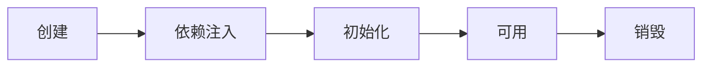

**【创建前后的增强】**

* postProcessBeforeInstantiation
  * **这里返回的对象若不为 null 会替换掉原本的 bean，并且仅会走 postProcessAfterInitialization 流程**
* postProcessAfterInstantiation
  * 这里如果**返回 false 会跳过依赖注入阶段**

**【依赖注入前的增强】**

* postProcessProperties
  * 如 @Autowired、@Value、@Resource 

**[初始化前后的增强]**

* postProcessBeforeInitialization
  * 这里返回的对象会替换掉原本的 bean
  * 如 @PostConstruct、@ConfigurationProperties
* postProcessAfterInitialization 
  * 这里返回的对象会替换掉原本的 bean
  * 如代理增强

**[销毁之前的增强]**

* postProcessBeforeDestruction
  * 如 @PreDestroy 

#### 收获💡

1. Spring bean 生命周期各个阶段
2. 模板设计模式, 指大流程已经固定好了, 通过接口回调（bean 后处理器）在一些关键点前后提供扩展

```
在 Spring 框架中，`BeanPostProcessor` 和 `InstantiationAwareBeanPostProcessor` 是两种重要的接口，它们允许开发者在 Bean 的生命周期中不同的阶段插入自定义逻辑，从而增强或修改 Bean 的行为。

接下来，我将详细解释这些增强方法的工作原理、执行时机及其用途，并结合你列出的增强点进行详细说明。

### 1. **创建前后的增强**

#### `postProcessBeforeInstantiation`
- **方法签名**：
  ```java
  Object postProcessBeforeInstantiation(Class<?> beanClass, String beanName) throws BeansException;
```
- **执行时机**：[在 Bean 实例化（即通过构造函数创建 Bean 实例）之前调用，提供一个机会来返回一个替代的 Bean 实例。]
  
- **核心功能**：
  - 如果这个方法返回的对象不为 `null`，这个返回的对象将**直接替换掉原来的 Bean**。即，Spring 容器不会继续创建原来的 Bean 实例。
  - 此时，Spring 仅会执行 `postProcessAfterInitialization` 方法，而不会执行其他生命周期方法（如属性注入、初始化方法等），这可以让开发者完全掌控 Bean 的创建逻辑。

- **应用场景**：
  你可以在这里直接返回一个已经存在的单例对象，或者返回一个代理对象来替代原来的 Bean，从而完全改变 Bean 的创建逻辑。

  ```java
  @Override
  public Object postProcessBeforeInstantiation(Class<?> beanClass, String beanName) throws BeansException {
      if (beanClass == SomeClass.class) {
          // 返回一个代理对象或完全不同的对象，替代原来的 Bean
          return Proxy.newProxyInstance(beanClass.getClassLoader(), beanClass.getInterfaces(), new CustomInvocationHandler());
      }
      return null;  // 返回 null 表示不替换 Bean，继续走正常创建流程
  }
  ```

#### `postProcessAfterInstantiation`
- **方法签名**：
  ```java
  boolean postProcessAfterInstantiation(Object bean, String beanName) throws BeansException;
  ```
- **执行时机**：在 Bean 实例化之后、依赖注入之前执行。此时，Bean 已经被创建，但是还没有进行属性的填充。

- **核心功能**：
  - 如果该方法返回 `false`，Spring 将跳过该 Bean 的依赖注入阶段（包括注入通过 `@Autowired`、`@Value`、`@Resource` 等注解的属性）。
  - 【这个方法可以用来控制是否允许 Spring 进行依赖注入，从而提供对 Bean 更加精细的控制。】

- **应用场景**：
  如果你需要跳过某些特殊 Bean 的依赖注入过程，可以在此处返回 `false`。例如，对于某些 Bean，你可能希望手动进行依赖注入，而不是让 Spring 自动完成。

  ```java
  @Override
  public boolean postProcessAfterInstantiation(Object bean, String beanName) throws BeansException {
      if (bean instanceof CustomBean) {
          // 跳过依赖注入
          return false;
      }
      return true;  // 允许正常的依赖注入流程
  }
  ```

### 2. **依赖注入前的增强**

#### `postProcessProperties`
- **方法签名**：
  ```java
  PropertyValues postProcessProperties(PropertyValues pvs, Object bean, String beanName) throws BeansException;
  ```
- **执行时机**：在依赖注入之前执行。此时，Bean 已经被实例化，Spring 正准备将配置的属性值注入到该 Bean 中。

- **核心功能**：
  - 该方法允许开发者在依赖注入之前对 Bean 的属性进行增强和修改，例如为某些属性手动注入值，或者拦截 `@Autowired`、`@Value` 等注解的处理过程。
  - 典型的处理器如 `AutowiredAnnotationBeanPostProcessor` 就是在这个阶段对 `@Autowired` 注解进行处理的。

- **应用场景**：
  你可以通过这个方法实现类似于依赖注入的控制。例如，你可以在这个方法中为 Bean 的某些字段手动设置值，而不依赖 Spring 自动的依赖注入逻辑。

  ```java
  @Override
  public PropertyValues postProcessProperties(PropertyValues pvs, Object bean, String beanName) throws BeansException {
      if (bean instanceof CustomBean) {
          // 手动为某个属性注入值
          MutablePropertyValues mpvs = (MutablePropertyValues) pvs;
          mpvs.add("customProperty", "customValue");
      }
      return pvs;  // 返回修改后的属性值
  }
  ```

### 3. **初始化前后的增强**

#### `postProcessBeforeInitialization`
- **方法签名**：
  ```java
  Object postProcessBeforeInitialization(Object bean, String beanName) throws BeansException;
  ```
- **执行时机**：在 Bean 完成属性注入后、调用初始化方法之前执行。

- **核心功能**：
  - 你可以在这个阶段对 Bean 进行任何额外的修改，比如对某些属性进行校验，或者为某些属性设置默认值。
  - 【如果该方法返回的对象不为 `null`，则这个返回的对象将替换原本的 Bean。】

- **应用场景**：
 【 典型的场景包括初始化前对某些 Bean 进行增强、添加初始化前的校验逻辑、处理 `@PostConstruct` 注解等。】

  ```java
  @Override
  public Object postProcessBeforeInitialization(Object bean, String beanName) throws BeansException {
      if (bean instanceof CustomBean) {
          System.out.println("Initializing CustomBean");
          // 你可以在此处为 CustomBean 设置一些默认属性
      }
      return bean;  // 返回修改后的 Bean 实例，或者替换整个 Bean
  }
  ```

#### `postProcessAfterInitialization`
- **方法签名**：
  ```java
  Object postProcessAfterInitialization(Object bean, String beanName) throws BeansException;
  ```
- **执行时机**：在 Bean 完成初始化方法（如 `afterPropertiesSet` 或 `init-method`）之后执行。

- **核心功能**：
  - 这个方法是动态代理、AOP 等增强功能的核心。它允许你在 Bean 完成初始化之后为其创建代理对象、增强其功能。
  - 【返回的对象可以是一个代理对象，或者任何其他增强后的对象，如果返回的对象不为 `null`，它将替换原本的 Bean。】

- **应用场景**：
  通常用来为 Bean 添加 AOP 代理或其他增强功能。例如，可以通过动态代理为 Bean 增加方法调用的日志记录、性能监控等。

  ```java
  @Override
  public Object postProcessAfterInitialization(Object bean, String beanName) throws BeansException {
      if (bean instanceof CustomService) {
          return Proxy.newProxyInstance(
              bean.getClass().getClassLoader(),
              bean.getClass().getInterfaces(),
              (proxy, method, args) -> {
                  System.out.println("Logging before method: " + method.getName());
                  Object result = method.invoke(bean, args);
                  System.out.println("Logging after method: " + method.getName());
                  return result;
              }
          );
      }
      return bean;  // 如果不需要代理，直接返回原来的 Bean
  }
  ```

### 4. **销毁之前的增强**

#### `postProcessBeforeDestruction`
- **方法签名**：
  ```java
  void postProcessBeforeDestruction(Object bean, String beanName) throws BeansException;
  ```
- **执行时机**：在 Bean 被销毁之前调用。此方法允许你在 Bean 被销毁之前执行一些清理操作。

- **核心功能**：
  - 你可以在这个阶段执行诸如资源释放、关闭连接、保存状态等操作，以确保在 Bean 销毁时能够安全地释放所有外部资源。
  - 处理诸如 `@PreDestroy` 注解的场景。

- **应用场景**：
  典型的场景是为某些 Bean 执行销毁前的清理操作，确保资源得到释放。例如，关闭数据库连接、停止线程池等。

  ```java
  @Override
  public void postProcessBeforeDestruction(Object bean, String beanName) throws BeansException {
      if (bean instanceof CustomResource) {
          ((CustomResource) bean).close();
          System.out.println("Cleaning up resources for bean: " + beanName);
      }
  }
  ```

### 总结

1. **创建前后的增强**：通过 `postProcessBeforeInstantiation` 可以完全替换掉原 Bean，`postProcessAfterInstantiation` 则用于控制是否允许 Spring 进行依赖注入。
  
2. **依赖注入前的增强**：通过 `postProcessProperties`，你可以修改 Bean 的属性，甚至手动进行依赖注入或阻止 Spring 的自动注入。

3. **初始化前后的增强**：通过 `postProcessBeforeInitialization` 和 `postProcessAfterInitialization`，你可以对 Bean 进行初始化前后的增强，包括添加代理、日志记录、校验逻辑等。

4. **销毁之前的增强**：通过 `postProcess


```


```java
package com.itheima.a03;

import org.slf4j.Logger;
import org.slf4j.LoggerFactory;
import org.springframework.beans.BeansException;
import org.springframework.beans.PropertyValues;
import org.springframework.beans.factory.config.DestructionAwareBeanPostProcessor;
import org.springframework.beans.factory.config.InstantiationAwareBeanPostProcessor;
import org.springframework.stereotype.Component;

@Component
public class MyBeanPostProcessor implements InstantiationAwareBeanPostProcessor, DestructionAwareBeanPostProcessor {

    private static final Logger log = LoggerFactory.getLogger(MyBeanPostProcessor.class);

    @Override
    public void postProcessBeforeDestruction(Object bean, String beanName) throws BeansException {
        if (beanName.equals("lifeCycleBean"))
            log.debug("<<<<<< 销毁之前执行, 如 @PreDestroy");
    }

    @Override
    public Object postProcessBeforeInstantiation(Class<?> beanClass, String beanName) throws BeansException {
        if (beanName.equals("lifeCycleBean"))
            log.debug("<<<<<< 实例化之前执行, 这里返回的对象会替换掉原本的 bean");
        return null;
    }

    @Override
    public boolean postProcessAfterInstantiation(Object bean, String beanName) throws BeansException {
        if (beanName.equals("lifeCycleBean")) {
            log.debug("<<<<<< 实例化之后执行, 这里如果返回 false 会跳过依赖注入阶段");
//            return false;
        }
        return true;
    }

    @Override
    public PropertyValues postProcessProperties(PropertyValues pvs, Object bean, String beanName) throws BeansException {
        if (beanName.equals("lifeCycleBean"))
            log.debug("<<<<<< 依赖注入阶段执行, 如 @Autowired、@Value、@Resource");
        return pvs;
    }

    @Override
    public Object postProcessBeforeInitialization(Object bean, String beanName) throws BeansException {
        if (beanName.equals("lifeCycleBean"))
            log.debug("<<<<<< 初始化之前执行, 这里返回的对象会替换掉原本的 bean, 如 @PostConstruct、@ConfigurationProperties");
        return bean;
    }

    @Override
    public Object postProcessAfterInitialization(Object bean, String beanName) throws BeansException {
        if (beanName.equals("lifeCycleBean"))
            log.debug("<<<<<< 初始化之后执行, 这里返回的对象会替换掉原本的 bean, 如代理增强");
        return bean;
    }
}

```


#### 演示2 - 模板方法设计模式

##### 关键代码

```java
public class TestMethodTemplate {

    public static void main(String[] args) {
        MyBeanFactory beanFactory = new MyBeanFactory();
        beanFactory.addBeanPostProcessor(bean -> System.out.println("解析 @Autowired"));
        beanFactory.addBeanPostProcessor(bean -> System.out.println("解析 @Resource"));
        beanFactory.getBean();
    }

    // 模板方法  Template Method Pattern
    static class MyBeanFactory {
        public Object getBean() {
            Object bean = new Object();
            System.out.println("构造 " + bean);
            System.out.println("依赖注入 " + bean); // @Autowired, @Resource
            for (BeanPostProcessor processor : processors) {
                processor.inject(bean);
            }
            System.out.println("初始化 " + bean);
            return bean;
        }

        private List<BeanPostProcessor> processors = new ArrayList<>();

        public void addBeanPostProcessor(BeanPostProcessor processor) {
            processors.add(processor);
        }
    }
    
    static interface BeanPostProcessor {
        public void inject(Object bean); // 对依赖注入阶段的扩展
    }
}
```


#### 演示3 - bean 后处理器排序

##### 代码参考 

**com.itheima.a03.TestProcessOrder**

#### 收获💡

1. 实现了 PriorityOrdered 接口的优先级最高
2. 实现了 Ordered 接口与加了 @Order 注解的平级, 按数字升序
3. 其它的排在最后


### 4) Bean 后处理器

#### 演示1 - 后处理器作用

##### 代码参考 

**com.itheima.a04** 包

#### 收获💡

1. @Autowired 等注解的解析属于 bean 生命周期阶段（依赖注入, 初始化）的扩展功能，这些扩展功能由 bean 后处理器来完成
2. 每个后处理器各自增强什么功能
   * AutowiredAnnotationBeanPostProcessor **解析 @Autowired 与 @Value**
   * CommonAnnotationBeanPostProcessor 解析 **@Resource、@PostConstruct、@PreDestroy**
   * ConfigurationPropertiesBindingPostProcessor 解析 @ConfigurationProperties
3. 另外 ContextAnnotationAutowireCandidateResolver 负责获取 @Value 的值，解析 @Qualifier、泛型、@Lazy 等


#### 演示2 - @Autowired bean 后处理器运行分析

##### 代码参考 

**com.itheima.a04.DigInAutowired**

#### 收获💡

1. **AutowiredAnnotationBeanPostProcessor.findAutowiringMetadata [用来获取某个 bean 上加了 @Value @Autowired 的成员变量，方法参数的信息，表示为 InjectionMetadata]**
2. InjectionMetadata 可以完成依赖注入
3. InjectionMetadata 内部根据成员变量，方法参数封装为 DependencyDescriptor 类型
4. 有了 DependencyDescriptor，就可以利用 beanFactory.doResolveDependency 方法进行基于类型的查找

````
你提出了一个非常好的问题。乍看之下，`@Autowired` 注解的处理器 `AutowiredAnnotationBeanPostProcessor` 和 `BeanPostProcessor` 的执行时机之间似乎存在矛盾，因为 `BeanPostProcessor` 在 Bean 的初始化过程中被调用，而依赖注入看起来应在此之前完成。

实际上，`AutowiredAnnotationBeanPostProcessor` 的工作机制与 `BeanPostProcessor` 的执行流程并不冲突。原因在于，`AutowiredAnnotationBeanPostProcessor` 并不仅仅依赖 `postProcessAfterInitialization` 或 `postProcessBeforeInitialization` 来进行依赖注入，而是使用了更早的扩展机制，下面我详细解释一下。

### 1. `AutowiredAnnotationBeanPostProcessor` 的作用
`AutowiredAnnotationBeanPostProcessor` 是 Spring 框架中的一个专用处理器，专门用于处理 `@Autowired` 注解。它的任务是查找 Spring 管理的 Bean 中标注了 `@Autowired` 的字段、方法或构造函数，然后通过依赖注入的方式将其他 Bean 注入到这些字段、方法或构造函数中。

但正如你所说，`BeanPostProcessor` 通常在 Bean 初始化阶段调用，而依赖注入应该发生在 Bean 实例化之后、初始化之前，这种依赖注入的顺序与 Bean 初始化时 `BeanPostProcessor` 参与的顺序确实有所不同。

### 2. Spring 的 Bean 生命周期与 `BeanPostProcessor` 的执行顺序

为了理解这个问题，我们需要回顾 Spring 中 Bean 的生命周期：

1. **实例化（Instantiation）**：Spring 通过构造函数或工厂方法创建 Bean 的实例。
2. **属性注入（Property Population / Dependency Injection）**：在实例化之后，Spring 会通过依赖注入的机制为 Bean 的字段、方法等属性赋值。此时，如果 Bean 上标注了 `@Autowired` 注解，Spring 就会根据上下文找到相应的 Bean，并将其注入。
3. **初始化（Initialization）**：在 Bean 属性注入完成之后，Spring 会调用 Bean 的初始化方法，比如 `InitializingBean` 接口的 `afterPropertiesSet` 方法或 XML/注解配置的 `init-method`。
4. **后置处理器的处理（BeanPostProcessor）**：Spring 在初始化方法调用的前后分别会调用 `BeanPostProcessor` 的 `postProcessBeforeInitialization` 和 `postProcessAfterInitialization` 方法。

### 3. `AutowiredAnnotationBeanPostProcessor` 的执行时机

`AutowiredAnnotationBeanPostProcessor` 实现了 `InstantiationAwareBeanPostProcessor` 接口，这是 `BeanPostProcessor` 的子接口，它提供了更多的扩展点，使得它能够在 Bean 的生命周期中更早地介入。
`InstantiationAwareBeanPostProcessor` 中最重要的两个方法是：
- **`postProcessBeforeInstantiation`**：在 Bean 实例化之前调用。
- **`postProcessAfterInstantiation`**：在 Bean 实例化之后、属性赋值之前调用。

而 `AutowiredAnnotationBeanPostProcessor` 正是利用了 `postProcessProperties` 方法，该方法在 Bean 实例化之后、依赖注入之前被调用。Spring 使用这个机制在 Bean 的属性被设置之前处理 `@Autowired` 注解，从而完成依赖注入。

```java
@Override
public PropertyValues postProcessProperties(PropertyValues pvs, Object bean, String beanName) throws BeansException {
    // 解析 @Autowired 注解，并完成依赖注入
    InjectionMetadata metadata = findAutowiringMetadata(beanName, bean.getClass(), pvs);
    try {
        metadata.inject(bean, beanName, pvs);
    } catch (Throwable ex) {
        throw new BeanCreationException(beanName, "Injection of autowired dependencies failed", ex);
    }
    return pvs;
}
```

这个方法会在依赖注入之前执行，确保 `@Autowired` 注解的依赖能够在其他 BeanPostProcessor 处理之前完成注入。因此，依赖注入实际上发生在 `BeanPostProcessor` 的 `postProcessBeforeInitialization` 之前。

### 4. 为什么 `AutowiredAnnotationBeanPostProcessor` 不冲突？
这就解释了为什么 `AutowiredAnnotationBeanPostProcessor` 并不与 `BeanPostProcessor` 的执行时机冲突。总结如下：
- **`AutowiredAnnotationBeanPostProcessor`** 继承了 `InstantiationAwareBeanPostProcessor`，其核心工作是在属性注入阶段之前进行的，即 Bean 实例化后、依赖注入之前。
- 通过 `postProcessProperties` 方法，`AutowiredAnnotationBeanPostProcessor` 可以在 Bean 初始化之前处理 `@Autowired` 注解，并完成依赖注入。
- 依赖注入完成后，Spring 才会调用 `postProcessBeforeInitialization` 和 `postProcessAfterInitialization` 方法，继续对 Bean 进行初始化。
因此，`AutowiredAnnotationBeanPostProcessor` 不会与 `BeanPostProcessor` 的执行顺序产生冲突，因为它的核心功能在依赖注入阶段已经完成，而 `BeanPostProcessor` 主要作用于 Bean 初始化前后。

### 5. `InstantiationAwareBeanPostProcessor` 的作用
为了更好地理解 `AutowiredAnnotationBeanPostProcessor` 的执行时机，了解 `InstantiationAwareBeanPostProcessor` 的作用非常重要。`InstantiationAwareBeanPostProcessor` 扩展了 `BeanPostProcessor`，增加了更多的回调方法，用于在 Bean 实例化和依赖注入的不同阶段进行处理：
- **`postProcessBeforeInstantiation`**：在 Bean 实例化之前调用。
- **`postProcessAfterInstantiation`**：在 Bean 实例化之后调用，但在属性赋值之前。
- **`postProcessProperties`**：在属性赋值之前，用于处理依赖注入（这就是 `AutowiredAnnotationBeanPostProcessor` 主要使用的方法）。
- **`postProcessBeforeInitialization` 和 `postProcessAfterInitialization`**：这两个方法继承自 `BeanPostProcessor`，分别在初始化方法调用的前后被执行。

### 6. 总结
- `BeanPostProcessor` 是在 Bean 初始化前后调用的，它用于为 Bean 提供初始化后的扩展处理。
- `AutowiredAnnotationBeanPostProcessor` 并不单单依赖 `BeanPostProcessor` 的机制，它实现了 `InstantiationAwareBeanPostProcessor`，能够在依赖注入阶段之前完成 `@Autowired` 注解的处理。
- 因此，依赖注入发生在 `postProcessBeforeInitialization` 之前，并不会与 Bean 的初始化顺序产生冲突。

通过这种机制，Spring 能够确保在 Bean 的初始化过程中的各个阶段都能够灵活地插入自定义逻辑，满足各种复杂的依赖管理和生命周期管理需求。
````


### 5) BeanFactory 后处理器

#### 演示1 - BeanFactory 后处理器的作用

##### 代码参考

**com.itheima.a05** 包

* **ConfigurationClassPostProcessor** 可以解析
  * @ComponentScan
  * @Bean
  * @Import
  * @ImportResource
* MapperScannerConfigurer 可以解析
  * Mapper 接口

#### 收获💡

1. @ComponentScan, @Bean, @Mapper 等注解的解析属于核心容器（即 BeanFactory）的扩展功能
2. 这些扩展功能由不同的 BeanFactory 后处理器来完成，其实主要就是补充了一些 bean 定义


#### 演示2 - 模拟解析 @ComponentScan

##### 代码参考 

**com.itheima.a05.ComponentScanPostProcessor**

#### 收获💡

1. Spring 操作元数据的工具类 CachingMetadataReaderFactory
2. 通过注解元数据（AnnotationMetadata）获取直接或间接标注的注解信息
3. 通过类元数据（ClassMetadata）获取类名，AnnotationBeanNameGenerator 生成 bean 名
4. 解析元数据是基于 ASM 技术

```
1. BeanFactory 后处理器（BeanFactoryPostProcessor）的作用
BeanFactoryPostProcessor 是 Spring 中用于修改 BeanFactory 的一个重要接口，它允许开发者在 BeanFactory 完成初始化之后、但在实际创建 Bean 实例之前，对 BeanFactory 中的 Bean 定义进行修改或扩展。BeanFactoryPostProcessor 的核心功能是为 Bean 的定义提供额外的处理逻辑，这种处理通常涉及到 Bean 的元数据。

BeanFactoryPostProcessor 的常见应用场景包括解析注解、动态注册 Bean 定义、修改现有的 Bean 定义属性等。以下是对 BeanFactory 后处理器的具体演示和详细解释。

2. 演示 1 - BeanFactoryPostProcessor 的作用
ConfigurationClassPostProcessor

在 Spring 框架中，ConfigurationClassPostProcessor 是一个典型的 BeanFactoryPostProcessor 实现，它的主要功能是解析 Spring 的核心注解，如：

@ComponentScan：用于扫描指定包中的组件并注册为 Spring Bean。
@Bean：用于在配置类中显式声明 Bean 的创建方法。
@Import：用于引入其他配置类或 Bean 定义。
@ImportResource：用于引入外部 XML 配置文件。
ConfigurationClassPostProcessor 负责在容器初始化时解析这些注解，并将相应的 Bean 定义注册到 BeanFactory 中。例如，通过 @ComponentScan 注解，Spring 会扫描指定包下的类并将标注了 @Component 的类注册为 Bean。

MapperScannerConfigurer

在使用 MyBatis 框架时，MapperScannerConfigurer 是一个用于自动扫描 Mapper 接口的 BeanFactoryPostProcessor。它会解析 Mapper 接口，并为每个 Mapper 创建一个代理对象，将其注册为 Spring Bean，方便与数据库进行交互。

收获💡

@ComponentScan, @Bean, @Mapper 等注解解析是核心容器（BeanFactory）的扩展功能：
Spring 的核心容器可以通过 BeanFactoryPostProcessor 来扩展功能，动态解析和注册 Bean 定义。
这些注解本身并不直接生成 Bean，而是通过后处理器在 BeanFactory 初始化时为容器增加新的 Bean 定义。
这些扩展功能是通过不同的 BeanFactoryPostProcessor 完成的：
ConfigurationClassPostProcessor 负责解析 Spring 框架中的核心注解。
MapperScannerConfigurer 负责解析 MyBatis 的 Mapper 接口并自动生成代理对象。
3. 演示 2 - 模拟解析 @ComponentScan
ComponentScanPostProcessor

为了深入理解 BeanFactoryPostProcessor 的作用，接下来通过 ComponentScanPostProcessor 模拟实现 @ComponentScan 的解析过程。

假设我们通过自定义的 ComponentScanPostProcessor 来实现组件扫描，并注册 Bean。

核心步骤：

CachingMetadataReaderFactory 操作元数据：
Spring 使用 CachingMetadataReaderFactory 来缓存和读取类的元数据。这个工具类能够高效地读取类的字节码信息，并从中提取注解元数据和类元数据。
它通过 ASM（一个操作 Java 字节码的框架）来读取类的字节码文件，从而快速获取类的注解、类名、继承关系等信息，而无需加载类到内存中。
AnnotationMetadata 提取注解信息：
AnnotationMetadata 是 Spring 用来封装类上所有注解信息的对象。它允许开发者访问类直接或间接标注的注解。
通过 AnnotationMetadata，我们可以确定一个类是否标注了 @Component，并根据这个信息将类注册为 Spring Bean。
ClassMetadata 提取类信息：
ClassMetadata 负责提供类的基本信息，如类名、包名、父类、接口等。
ClassMetadata 在 Bean 名称生成时非常有用。Spring 使用 AnnotationBeanNameGenerator 类来基于类元数据生成默认的 Bean 名称。
ASM 技术：
ASM 是一个用于分析和修改 Java 字节码的框架，Spring 通过 ASM 来读取类的元数据，而无需真正加载类到 JVM 中。这极大提高了 Spring 在处理注解、类元数据时的效率。
使用 ASM 使得 Spring 能够在运行时读取类文件中的字节码信息，并提取出类和注解的详细信息。
收获💡

CachingMetadataReaderFactory 的作用：
CachingMetadataReaderFactory 能高效读取类的字节码并提取元数据，这是 Spring 在进行组件扫描、注解解析时的核心工具。
注解元数据的解析：
AnnotationMetadata 提供了对类上注解信息的访问功能，使得 Spring 可以基于注解来动态决定 Bean 的注册。
通过注解元数据，可以访问直接或间接标注的注解，确定类是否需要被注册为 Bean。
类元数据的解析：
ClassMetadata 提供了类的基础信息，用于生成 Bean 的名称和处理类的继承关系。通过 AnnotationBeanNameGenerator，可以为每个类自动生成唯一的 Bean 名称。
ASM 技术的应用：
ASM 提供了操作字节码的能力，帮助 Spring 高效解析类的元数据，而无需将类加载到 JVM 中。它是注解和类信息解析的基础技术。

```


#### 演示3 - 模拟解析 @Bean

##### 代码参考 

**com.itheima.a05.AtBeanPostProcessor**

#### 收获💡

1. 进一步熟悉注解元数据（AnnotationMetadata）获取方法上注解信息


#### 演示4 - 模拟解析 Mapper 接口

##### 代码参考 

**com.itheima.a05.MapperPostProcessor**

#### 收获💡

1. Mapper 接口被 Spring 管理的本质：实际是被作为 MapperFactoryBean 注册到容器中
2. Spring 的诡异做法，根据接口生成的 BeanDefinition 仅为根据接口名生成 bean 名


### 6) Aware 接口

#### 演示 - Aware 接口及 InitializingBean 接口

##### 代码参考 

**com.itheima.a06** 包

#### 收获💡

1. Aware 接口提供了一种【内置】 的注入手段，例如
   * BeanNameAware 注入 bean 的名字
   * BeanFactoryAware 注入 BeanFactory 容器
   * ApplicationContextAware 注入 ApplicationContext 容器
   * EmbeddedValueResolverAware 注入 ${} 解析器
2. InitializingBean 接口提供了一种【内置】的初始化手段
3. 对比
   * 内置的注入和初始化不受扩展功能的影响，总会被执行
   * 而扩展功能受某些情况影响可能会失效
   * 因此 Spring 框架内部的类常用内置注入和初始化

````
### 1. 模拟解析 `@Bean` 注解的处理

#### **`AtBeanPostProcessor`** - 模拟解析 `@Bean`

在 Spring 中，`@Bean` 注解是用于在 `@Configuration` 类中显式定义 Bean 的注解。Spring 会在容器启动时解析带有 `@Bean` 注解的方法，并将方法的返回值注册为 Bean。

为了更深入了解 Spring 是如何解析 `@Bean` 注解的，我们通过 `AtBeanPostProcessor` 自定义实现了一个模拟解析 `@Bean` 注解的处理器。

##### **代码解析：**

```java
public class AtBeanPostProcessor implements BeanFactoryPostProcessor {

    @Override
    public void postProcessBeanFactory(ConfigurableListableBeanFactory beanFactory) throws BeansException {
        // 使用 Spring 的 Metadata 读取工具类
        CachingMetadataReaderFactory metadataReaderFactory = new CachingMetadataReaderFactory();

        // 模拟从配置类中获取所有方法并检查是否标注了 @Bean
        for (String beanName : beanFactory.getBeanDefinitionNames()) {
            BeanDefinition beanDefinition = beanFactory.getBeanDefinition(beanName);
            if (beanDefinition instanceof RootBeanDefinition) {
                try {
                    // 获取注解元数据，解析方法上的注解信息
                    AnnotationMetadata annotationMetadata = metadataReaderFactory.getMetadataReader(beanDefinition.getBeanClassName()).getAnnotationMetadata();
                    // 检查是否存在 @Bean 注解并进行处理
                    if (annotationMetadata.hasAnnotation(Bean.class.getName())) {
                        System.out.println("@Bean annotation found in: " + beanName);
                        // 模拟处理逻辑：将方法返回值注册为 Bean
                    }
                } catch (Exception e) {
                    throw new BeansException("Failed to process @Bean annotation", e) {};
                }
            }
        }
    }
}
```

#### **收获💡**
1. **`AnnotationMetadata` 提供了对方法级别的注解信息的访问**：
   - `AnnotationMetadata` 允许你获取方法上的注解信息，从而判断哪些方法被标注了 `@Bean`。这种方法使得我们能够动态注册方法返回的 Bean。
   - Spring 使用类似的机制在解析 `@Bean` 注解时，将方法的返回值注册到容器中。
   
2. **使用 ASM 高效读取元数据**：
   - 使用 `CachingMetadataReaderFactory` 结合 ASM 技术来读取类和方法的字节码元数据，而无需真正加载类。
   
---

### 2. 模拟解析 Mapper 接口

#### **`MapperPostProcessor`** - 模拟解析 MyBatis Mapper 接口

在 Spring 中，MyBatis 的 Mapper 接口并不是直接创建实例，而是通过生成代理对象来与数据库交互。为了实现这一点，Spring 通过 `MapperScannerConfigurer` 将 Mapper 接口注册为 Bean，并在运行时生成动态代理。

通过 `MapperPostProcessor`，我们可以模拟 Spring 是如何解析 Mapper 接口，并将其作为 BeanFactory 中的 `MapperFactoryBean`。

##### **代码解析：**

```java
public class MapperPostProcessor implements BeanFactoryPostProcessor {

    @Override
    public void postProcessBeanFactory(ConfigurableListableBeanFactory beanFactory) throws BeansException {
        // 模拟解析 Mapper 接口，将其注册为 MapperFactoryBean
        for (String beanName : beanFactory.getBeanDefinitionNames()) {
            BeanDefinition beanDefinition = beanFactory.getBeanDefinition(beanName);
            if (beanDefinition.getBeanClassName().endsWith("Mapper")) {
                System.out.println("Found Mapper interface: " + beanName);
                // 将 Mapper 接口注册为 MapperFactoryBean
                beanDefinition.setBeanClassName("org.mybatis.spring.mapper.MapperFactoryBean");
                // 设置目标接口
                beanDefinition.getPropertyValues().add("mapperInterface", beanDefinition.getBeanClassName());
            }
        }
    }
}
```

#### **收获💡**

1. **Mapper 接口本质上是被注册为 `MapperFactoryBean`**：
   - MyBatis 的 Mapper 接口本质上并不会被直接实例化为普通 Bean，而是通过 `MapperFactoryBean` 生成的代理对象。
   - `MapperFactoryBean` 是 Spring 用来封装 Mapper 接口的工厂类，用于动态创建数据库操作接口的实现类。

2. **Spring 根据接口生成 `BeanDefinition`**：
   - Spring 仅根据 Mapper 接口的类名生成 Bean 名，并且为每个接口定义一个 `MapperFactoryBean`。这意味着每个 Mapper 接口在 Spring 容器中都通过 `MapperFactoryBean` 来生成。
   
---

### 3. Aware 接口及 `InitializingBean` 接口

#### **`Aware` 接口** - Spring 中的内置注入机制

在 Spring 中，`Aware` 接口提供了一种特殊的注入机制，允许 Bean 在初始化过程中获得对 Spring 容器内部资源的访问权限。通过实现 `Aware` 接口，Bean 可以获取到容器的关键信息，比如 `BeanFactory`、`ApplicationContext` 等。

#### 常见的 `Aware` 接口：

- **`BeanNameAware`**：可以通过该接口获取当前 Bean 的名称。
- **`BeanFactoryAware`**：允许 Bean 获取到 `BeanFactory` 实例，从而可以通过编程的方式操作 BeanFactory 中的 Bean。
- **`ApplicationContextAware`**：允许 Bean 获取到 `ApplicationContext` 实例，从而可以访问应用上下文。
- **`EmbeddedValueResolverAware`**：允许 Bean 获取到 `${}` 表达式解析器，用于解析配置中的占位符。

#### **InitializingBean 接口** - 内置的初始化机制

`InitializingBean` 是 Spring 提供的一个接口，允许 Bean 在依赖注入完成后执行自定义的初始化逻辑。该接口的 `afterPropertiesSet()` 方法会在所有的属性都设置完成后自动被调用。

##### **代码参考：**

```java
public class CustomBean implements BeanNameAware, BeanFactoryAware, ApplicationContextAware, InitializingBean {

    private String beanName;
    private BeanFactory beanFactory;
    private ApplicationContext applicationContext;

    @Override
    public void setBeanName(String name) {
        this.beanName = name;
        System.out.println("Bean name set to: " + beanName);
    }

    @Override
    public void setBeanFactory(BeanFactory beanFactory) throws BeansException {
        this.beanFactory = beanFactory;
        System.out.println("BeanFactory injected into: " + beanName);
    }

    @Override
    public void setApplicationContext(ApplicationContext applicationContext) throws BeansException {
        this.applicationContext = applicationContext;
        System.out.println("ApplicationContext injected into: " + beanName);
    }

    @Override
    public void afterPropertiesSet() throws Exception {
        System.out.println("CustomBean " + beanName + " has been initialized");
    }
}
```

#### **收获💡**

1. **`Aware` 接口提供了一种【内置】的注入手段**：
   - `Aware` 接口用于向 Bean 注入一些核心 Spring 资源，如 Bean 名称、`BeanFactory`、`ApplicationContext`，以及表达式解析器。这种注入方式与依赖注入不同，它提供了对 Spring 容器内部组件的访问。
   - 例如 `ApplicationContextAware` 注入 `ApplicationContext`，允许 Bean 在运行时获取到上下文并与其他 Bean 交互。

2. **`InitializingBean` 提供了一种【内置】的初始化手段**：
   - `InitializingBean` 接口的 `afterPropertiesSet()` 方法提供了 Bean 完成依赖注入后进行自定义初始化的机会。
   - 与 `@PostConstruct` 注解类似，`afterPropertiesSet()` 是一种保证初始化逻辑执行的内置机制。

#### 对比：

- **内置注入与初始化 vs 扩展功能**：
  - 内置的注入机制（如 `Aware` 接口）和初始化机制（如 `InitializingBean`）是 Spring 框架的核心特性。它们的执行不受任何扩展功能（如 `BeanPostProcessor`）的影响，始终会执行。
  - 而扩展功能（如通过 `BeanPostProcessor` 扩展的自定义逻辑）可能会受到某些条件或配置的影响而被禁用或忽略。因此，Spring 框架本身的类和核心功能通常依赖于 `Aware` 和 `InitializingBean` 等内置机制来确保可靠性。

- **实际应用**：
  - Spring 内部很多关键类会实现 `Aware` 接口以获取容器的资源。例如，很多自定义 Bean 可能通过实现 `ApplicationContextAware` 来获取 `ApplicationContext`，以便在需要时与容器交互。

---

### 总结

1. **模拟解析 `@Bean` 和 `Mapper` 接口的过程**：通过自定义 `BeanFactoryPostProcessor`，我们可以模拟 Spring 解析 `@Bean` 注解和 Mapper 接口的过程，并动态注册 Bean 定义。这展示了 Spring 灵活的注解解析机制。
   
2. **`Aware` 接口提供了一种内置的注入机制**：Spring 的 `Aware` 接口让 Bean 能够获得容器的关键资源，确保它们能够与容器交互。这种内置机制比扩展功能更加可靠，适用于 Spring


````


#### 配置类 @Autowired 失效分析

Java 配置类不包含 BeanFactoryPostProcessor 的情况

【**先将postprocessor添加到容器，等到执行到相应的地方时候再进行回调**】

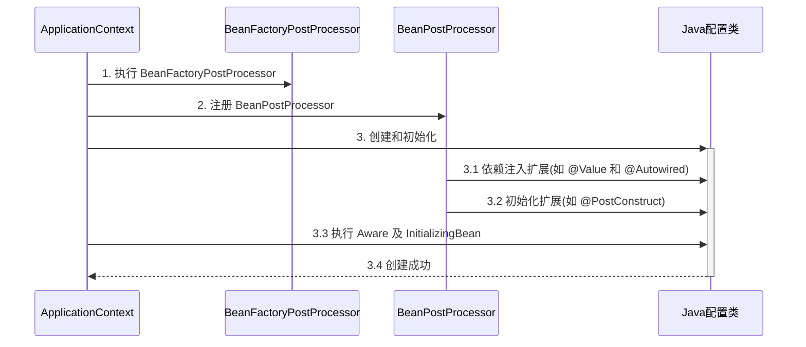

**Java 配置类包含 BeanFactoryPostProcessor 的情况，【// 以bean工厂方法的形式调用，前提是必须先创建类
    @Bean //  ⬅️ 注释或添加 beanFactory 后处理器对应上方两种情况
    public BeanFactoryPostProcessor processor1() {
        return beanFactory -> {
            log.debug("执行 processor1");
        };
    }】因此要创建其中的 BeanFactoryPostProcessor 必须提前创建 Java 配置类，而此时的 BeanPostProcessor 还未准备好，导致 @Autowired 等注解失效**


对应代码

```java
/*
    Aware 接口及 InitializingBean 接口
 */
public class A06 {
    private static final Logger log = LoggerFactory.getLogger(A06.class);

    public static void main(String[] args) {
        /*
            1. Aware 接口用于注入一些与容器相关信息, 例如
                a. BeanNameAware 注入 bean 的名字
                b. BeanFactoryAware 注入 BeanFactory 容器
                c. ApplicationContextAware 注入 ApplicationContext 容器
                d. EmbeddedValueResolverAware ${}

         */
        GenericApplicationContext context = new GenericApplicationContext();
//        context.registerBean("myBean", MyBean.class);
//        context.registerBean("myConfig1", MyConfig1.class);
        context.registerBean("myConfig2", MyConfig2.class);
        context.registerBean(AutowiredAnnotationBeanPostProcessor.class);
        context.registerBean(CommonAnnotationBeanPostProcessor.class);
        context.registerBean(ConfigurationClassPostProcessor.class);

        /*
            2. 有同学说: b、c、d 的功能用 @Autowired 就能实现啊, 为啥还要用 Aware 接口呢
            简单地说:
                a. @Autowired 的解析需要用到 bean 后处理器, 属于扩展功能
                b. 而 Aware 接口属于内置功能, 不加任何扩展, Spring 就能识别
            某些情况下, 扩展功能会失效, 而内置功能不会失效

            例1: 你会发现用 Aware 注入 ApplicationContext 成功, 而 @Autowired 注入 ApplicationContext 失败
         */

        /*
            例2: Java 配置类在添加了 bean 工厂后处理器后,
                你会发现用传统接口方式的注入和初始化仍然成功, 而 @Autowired 和 @PostConstruct 的注入和初始化失败
         */
        // 1.将beanFactory 后处理器注册到容器中（beanFactory 后处理器用于添加beandefiation）,
        // 2.添加bean 后处理器
      	// 3.初始化单例
        context.refresh(); // 1. beanFactory 后处理器,  2. 添加 bean 后处理器, 3. 初始化单例
        context.close();

        /*
            学到了什么
                a. Aware 接口提供了一种【内置】 的注入手段, 可以注入 BeanFactory, ApplicationContext
                b. InitializingBean 接口提供了一种【内置】的初始化手段
                c. 内置的注入和初始化不受扩展功能的影响, 总会被执行, 因此 Spring 框架内部的类常用它们
         */
    }
}


@Configuration
public class MyConfig1 {

    private static final Logger log = LoggerFactory.getLogger(MyConfig1.class);

    @Autowired
    public void setApplicationContext(ApplicationContext applicationContext) {
        log.debug("注入 ApplicationContext");
    }

    @PostConstruct
    public void init() {
        log.debug("初始化");
    }
		// 以bean工厂方法的形式调用，前提是必须先创建类
    @Bean //  ⬅️ 注释或添加 beanFactory 后处理器对应上方两种情况
    public BeanFactoryPostProcessor processor1() {
        return beanFactory -> {
            log.debug("执行 processor1");
        };
    }

}
```

> ***注意***
>
> 解决方法：
>
> * 用[内置依赖注入和初始化取代扩展依赖注入和初始化]
> * 用静态工厂方法代替实例工厂方法，避免工厂对象提前被创建

````
### Java 配置类中 `@Autowired` 失效分析

当我们在 Spring 中使用 `@Configuration` 注解创建 Java 配置类时，有时会遇到 `@Autowired` 等依赖注入注解失效的情况。尤其是在配置类中包含了 `BeanFactoryPostProcessor` 的时候，`@Autowired` 和 `@PostConstruct` 可能无法正常工作。这个问题的原因与 Spring 容器的初始化顺序和 Bean 的生命周期管理有关。

我将通过详细的解释，包括依赖注入的机制、配置类创建的流程，以及 Spring 容器的后处理器执行顺序，帮助你理解 `@Autowired` 失效的原因，并介绍如何解决这一问题。

---

### 1. **Spring 中的依赖注入与后处理器机制**

在 Spring 框架中，依赖注入是由 `BeanPostProcessor` 后处理器完成的。`@Autowired` 注解的工作依赖于 `AutowiredAnnotationBeanPostProcessor` 这个后处理器，而 `@PostConstruct` 则由 `CommonAnnotationBeanPostProcessor` 处理。

当 Spring 容器初始化时，它会先执行一系列的 `BeanFactoryPostProcessor`，这些后处理器主要用于修改 Bean 的定义，比如更改 Bean 的作用域、初始化方法等。接着，Spring 会注册 `BeanPostProcessor`，然后才开始创建和初始化 Bean。

因此，**如果配置类在 `BeanPostProcessor` 注册之前被创建了，`@Autowired` 和 `@PostConstruct` 等注解就无法生效**，因为这些注解依赖的处理器还没有被 Spring 注册。
---
### 2. **为什么 `@Autowired` 在包含 `BeanFactoryPostProcessor` 的配置类中失效？**
如果你的配置类中定义了 `BeanFactoryPostProcessor`，Spring 必须提前创建这个配置类实例，以便执行 `BeanFactoryPostProcessor`。然而，此时 `BeanPostProcessor`（如 `AutowiredAnnotationBeanPostProcessor`）还没有注册到容器中，因此依赖注入和初始化方法（如 `@Autowired` 和 `@PostConstruct`）不会被执行。

#### 普通情况的 Bean 初始化流程

在不涉及 `BeanFactoryPostProcessor` 的情况下，Spring 的执行顺序如下：

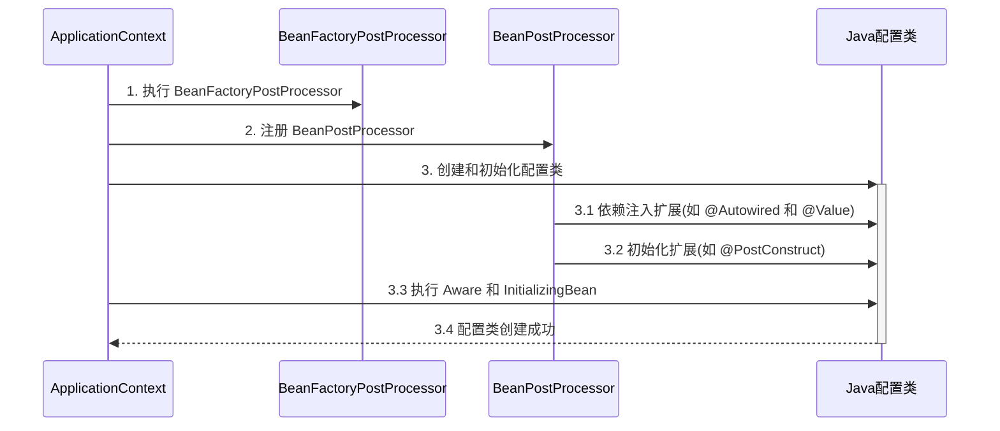

#### 涉及 `BeanFactoryPostProcessor` 的配置类初始化流程

当配置类包含了 `BeanFactoryPostProcessor` 时，情况就变得不同了。Spring 会在 `BeanPostProcessor` 注册之前提前创建配置类，导致依赖注入机制没有生效。

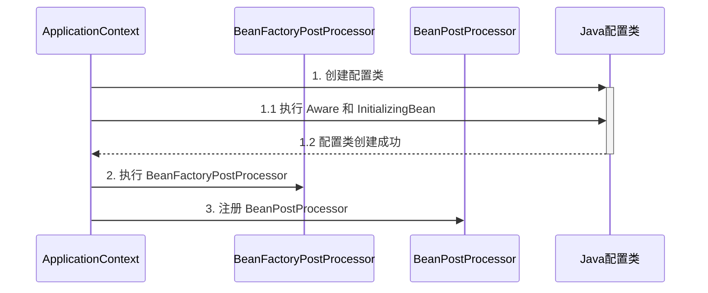

在这种情况下，配置类 `config` 被提前创建，但由于 `BeanPostProcessor` 还没有注册，`@Autowired` 和 `@PostConstruct` 等注解无法正常工作，导致依赖注入失效。

---

### 3. **示例分析**

假设我们有一个 Java 配置类 `MyConfig1`，其中定义了一个 `BeanFactoryPostProcessor`，并且该配置类依赖 `@Autowired` 注入 `ApplicationContext`，并使用 `@PostConstruct` 进行初始化。

```java
@Configuration
public class MyConfig1 {

    private static final Logger log = LoggerFactory.getLogger(MyConfig1.class);

    @Autowired
    public void setApplicationContext(ApplicationContext applicationContext) {
        log.debug("注入 ApplicationContext");
    }

    @PostConstruct
    public void init() {
        log.debug("初始化");
    }

    @Bean
    public BeanFactoryPostProcessor processor1() {
        return beanFactory -> {
            log.debug("执行 processor1");
        };
    }
}
```

#### 输出结果（问题出现）：
```
执行 processor1
```

在这个例子中，虽然 `BeanFactoryPostProcessor` 正常执行了，但由于 `@Autowired` 和 `@PostConstruct` 依赖 `BeanPostProcessor`，而此时 `BeanPostProcessor` 还没有被注册，所以 `setApplicationContext()` 和 `init()` 方法并没有被调用。

---

### 4. **解决方法**

#### 方法 1：使用内置依赖注入和初始化机制

Spring 提供了一些内置的依赖注入机制和初始化机制，如 `ApplicationContextAware` 和 `InitializingBean`，这些机制不依赖 `BeanPostProcessor`，因此不会受注册顺序的影响。

##### 改进后的代码：

```java
@Configuration
public class MyConfig1 implements ApplicationContextAware, InitializingBean {

    private static final Logger log = LoggerFactory.getLogger(MyConfig1.class);
    
    private ApplicationContext applicationContext;

    @Override
    public void setApplicationContext(ApplicationContext applicationContext) {
        this.applicationContext = applicationContext;
        log.debug("注入 ApplicationContext");
    }

    @Override
    public void afterPropertiesSet() throws Exception {
        log.debug("初始化");
    }

    @Bean
    public BeanFactoryPostProcessor processor1() {
        return beanFactory -> {
            log.debug("执行 processor1");
        };
    }
}
```

#### **解释**：
1. **`ApplicationContextAware`**：通过实现 `ApplicationContextAware` 接口，`MyConfig1` 配置类可以在 Bean 初始化时获取到 `ApplicationContext`，而不依赖 `@Autowired` 注解。
2. **`InitializingBean`**：通过实现 `InitializingBean` 接口的 `afterPropertiesSet()` 方法，替代了 `@PostConstruct` 注解来执行初始化逻辑。

这两种机制是 Spring 的核心部分，它们在 Spring 容器初始化过程中始终会被执行，不依赖于 `BeanPostProcessor` 的注册顺序。

---

#### 方法 2：使用静态工厂方法定义 `BeanFactoryPostProcessor`

另一种解决方法是将 `BeanFactoryPostProcessor` 定义为静态工厂方法。通过将 `processor1()` 方法标记为 `static`，Spring 在创建配置类之前就可以执行 `BeanFactoryPostProcessor`，这样可以避免提前实例化配置类，从而确保 `@Autowired` 和 `@PostConstruct` 等注解能够正常工作。

##### 改进后的代码：

```java
@Configuration
public class MyConfig2 {

    private static final Logger log = LoggerFactory.getLogger(MyConfig2.class);

    @Autowired
    private ApplicationContext applicationContext;

    @PostConstruct
    public void init() {
        log.debug("初始化");
    }

    @Bean
    public static BeanFactoryPostProcessor processor1() {
        return beanFactory -> {
            log.debug("执行 processor1");
        };
    }
}
```

#### **解释**：
1. **静态方法**：`processor1()` 方法被定义为静态方法，Spring 可以在创建 `MyConfig2` 实例之前执行这个方法，避免了对 `MyConfig2` 配置类的提前实例化。
2. **依赖注入恢复正常**：由于配置类的实例化没有提前发生，`@Autowired` 和 `@PostConstruct` 注解现在可以正常工作，依赖注入和初始化过程恢复正常。
---
### 5. **总结**
#### 问题总结：
- 在 Spring 中，如果配置类包含了 `BeanFactoryPostProcessor`，Spring 必须在 `BeanPostProcessor` 注册之前提前实例化配置类，这会导致依赖注入注解（如 `@Autowired`）和初始化注解（如 `@PostConstruct`）失效。
#### 解决方案：
1. **使用内置依赖注入和初始化机制**：通过实现 `ApplicationContextAware` 和 `InitializingBean` 接口，确保依赖注入和初始化逻辑不受 `BeanPostProcessor` 注册顺序的影响。
2. **使用静态工厂方法**：将 `BeanFactoryPostProcessor` 定义为静态工厂方法，避免配置类的提前实例化，确保依赖注入机制能够正常工作。
  通过这两种方式，你可以确保即使在配置类中包含了 `BeanFactoryPostProcessor`，`@Autowired` 和 `@PostConstruct` 等注解依然能够正常工作。
````


### 7) 初始化与销毁

#### 演示 - 初始化销毁顺序

##### 代码参考 

**com.itheima.a07** 包

#### 收获💡

Spring 提供了多种初始化手段，除了课堂上讲的 @PostConstruct，@Bean(initMethod) 之外，还可以实现 InitializingBean 接口来进行初始化，如果同一个 bean 用了以上手段声明了 3 个初始化方法，那么它们的执行顺序是

1. @PostConstruct 标注的初始化方法
2. InitializingBean 接口的初始化方法
3. @Bean(initMethod) 指定的初始化方法


与初始化类似，Spring 也提供了多种销毁手段，执行顺序为

1. @PreDestroy 标注的销毁方法
2. DisposableBean 接口的销毁方法
3. @Bean(destroyMethod) 指定的销毁方法


### 8) Scope 

在当前版本的 Spring 和 Spring Boot 程序中，支持五种 Scope

* singleton，容器启动时创建（未设置延迟），容器关闭时销毁
* prototype，每次使用时创建，不会自动销毁，需要调用 DefaultListableBeanFactory.destroyBean(bean) 销毁
* request，每次请求用到此 bean 时创建，请求结束时销毁
* session，每个会话用到此 bean 时创建，会话结束时销毁
* application，web 容器用到此 bean 时创建，容器停止时销毁

有些文章提到有 globalSession 这一 Scope，也是陈旧的说法，目前 Spring 中已废弃


但要注意，如果在 singleton 注入其它 scope 都会有问题，解决方法有

* @Lazy
* @Scope(proxyMode = ScopedProxyMode.TARGET_CLASS)
* ObjectFactory
* ApplicationContext.getBean


#### 演示1 - request, session, application 作用域

##### 代码参考 

**com.itheima.a08** 包

* 打开不同的浏览器, 刷新 http://localhost:8080/test 即可查看效果
* 如果 jdk > 8, 运行时请添加 --add-opens java.base/java.lang=ALL-UNNAMED

#### 收获💡

1. 有几种 scope
2. 在 singleton 中使用其它几种 scope 的方法
3. 其它 scope 的销毁时机
   * 可以将通过 server.servlet.session.timeout=30s 观察 session bean 的销毁
   * ServletContextScope 销毁机制疑似实现有误


#### 分析 - singleton 注入其它 scope 失效

以单例注入多例为例

有一个单例对象 E

```java
@Component
public class E {
    private static final Logger log = LoggerFactory.getLogger(E.class);

    private F f;

    public E() {
        log.info("E()");
    }

    @Autowired
    public void setF(F f) {
        this.f = f;
        log.info("setF(F f) {}", f.getClass());
    }

    public F getF() {
        return f;
    }
}
```

要注入的对象 F 期望是多例

```java
@Component
@Scope("prototype")
public class F {
    private static final Logger log = LoggerFactory.getLogger(F.class);

    public F() {
        log.info("F()");
    }
}
```

测试

```java
E e = context.getBean(E.class);
F f1 = e.getF();
F f2 = e.getF();
System.out.println(f1);
System.out.println(f2);
```

输出

```
com.itheima.demo.cycle.F@6622fc65
com.itheima.demo.cycle.F@6622fc65
```

发现它们是同一个对象，而不是期望的多例对象


对于单例对象来讲，依赖注入仅发生了一次，后续再没有用到多例的 F，因此 E 用的始终是第一次依赖注入的 F

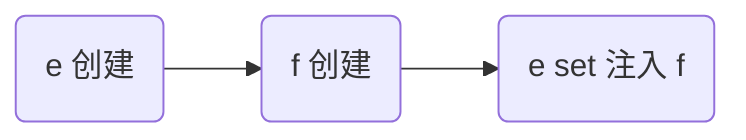

解决

* 仍然使用 @Lazy 生成代理
* 代理对象虽然还是同一个，但当每次**使用代理对象的任意方法**时，由代理创建新的 f 对象

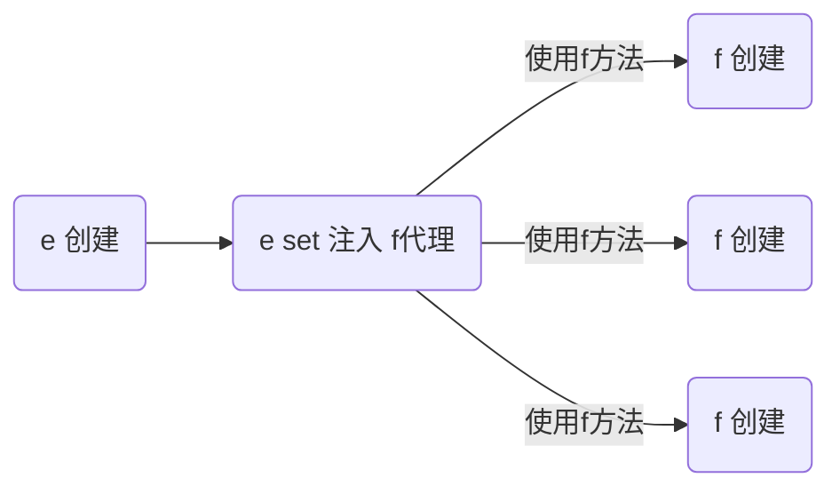

```java
@Component
public class E {

    @Autowired
    @Lazy
    public void setF(F f) {
        this.f = f;
        log.info("setF(F f) {}", f.getClass());
    }

    // ...
}
```

> ***注意***
>
> * @Lazy 加在也可以加在成员变量上，但加在 set 方法上的目的是可以观察输出，加在成员变量上就不行了
> * @Autowired 加在 set 方法的目的类似

输出

```
E: setF(F f) class com.itheima.demo.cycle.F$$EnhancerBySpringCGLIB$$8b54f2bc
F: F()
com.itheima.demo.cycle.F@3a6f2de3
F: F()
com.itheima.demo.cycle.F@56303b57
```

从输出日志可以看到调用 setF 方法时，f 对象的类型是代理类型


#### 演示2 - 4种解决方法

##### 代码参考 

**com.itheima.a08.sub** 包

* 如果 jdk > 8, 运行时请添加 --add-opens java.base/java.lang=ALL-UNNAMED

#### 收获💡

1. 单例注入其它 scope 的四种解决方法
   * @Lazy
   * @Scope(value = "prototype", proxyMode = ScopedProxyMode.TARGET_CLASS)
   * ObjectFactory
   * ApplicationContext
2. 解决方法虽然不同，但理念上殊途同归: 都是推迟其它 scope bean 的获取


````
在 Spring 框架中，默认情况下，依赖注入发生在 Spring 容器启动时，Spring 会将依赖注入到目标 Bean 中。然而，单例 Bean 与多例 Bean 的混合使用可能会引发一些问题，因为单例 Bean 的生命周期与多例 Bean 的生命周期不同。如果一个单例 Bean 中注入了一个多例 Bean，单例 Bean 的依赖注入只会发生一次，导致它始终持有同一个多例 Bean 实例，而不是每次都注入一个新的实例。这就是你描述的单例 Bean `E` 注入多例 Bean `F` 的问题。

### 1. **问题描述**
- **单例 Bean `E`**：只会在 Spring 容器中实例化一次。
- **多例 Bean `F`**：每次请求都会创建一个新的实例。

在你的代码中，`E` 是一个单例，而 `F` 是一个多例。然而，`E` 中的 `F` 被注入后，它始终持有第一次注入的 `F` 实例，因此无论你获取多少次 `F`，它们都是同一个对象。这是因为依赖注入只发生一次，即在 `E` 初始化时注入了 `F`，而不是每次请求时重新注入新的 `F` 实例。

### 2. **问题产生的原因**
对于单例对象 `E` 来说，依赖注入只发生一次。Spring 容器在初始化 `E` 时，会为其注入依赖的 `F` 对象（多例），但由于 `E` 是单例，它在整个应用生命周期中只会使用同一个 `F` 实例，而不会每次调用 `getF()` 方法时重新获取新的 `F` 实例。这就导致了单例对象 `E` 中注入的 `F` 是同一个对象。

### 3. **解决方案**
Spring 提供了四种常见的解决方法，允许你在单例 Bean 中注入一个多例 Bean，并确保每次使用时获取到不同的多例 Bean 实例。这些方案的核心思想是**延迟获取多例 Bean 实例**，确保每次调用时获取到的 `F` 都是一个新的实例。

#### 方案 1：使用 `@Lazy` 生成代理对象
使用 `@Lazy` 注解，Spring 会为 `F` 生成一个代理对象。当你调用 `E` 中 `F` 的方法时，代理对象会负责在每次方法调用时创建新的 `F` 实例。

##### 示例代码：
```java
@Component
public class E {

    private F f;

    @Autowired
    @Lazy
    public void setF(F f) {
        this.f = f;
        log.info("setF(F f) {}", f.getClass());
    }

    public F getF() {
        return f;
    }
}
```

在这个方案中，`@Lazy` 会生成一个代理对象 `F`。当你调用 `F` 的方法时，代理对象会在背后动态创建一个新的 `F` 实例。这确保了每次调用 `getF()` 方法时，获取到的都是一个新的多例 `F` 实例。

##### **优点**：
- 简单易用，只需要加上 `@Lazy` 注解即可实现。
- 代理对象的管理由 Spring 自动完成。

#### 方案 2：使用 `@Scope` 和 `ScopedProxyMode`

你可以通过设置 `@Scope` 的 `proxyMode` 为 `ScopedProxyMode.TARGET_CLASS` 来为多例 Bean 生成一个类代理。当 `E` 使用 `F` 时，Spring 会通过代理机制每次返回一个新的 `F` 实例。

##### 示例代码：
```java
@Component
@Scope(value = "prototype", proxyMode = ScopedProxyMode.TARGET_CLASS)
public class F {
    private static final Logger log = LoggerFactory.getLogger(F.class);

    public F() {
        log.info("F()");
    }
}
```

通过 `proxyMode = ScopedProxyMode.TARGET_CLASS`，Spring 会为 `F` 创建一个代理类。当 `E` 中调用 `F` 的方法时，Spring 会在代理类中为 `F` 动态创建新的实例。

##### **优点**：
- 明确指定 Bean 的作用域和代理模式，使用面向对象的方式控制 Bean 的创建。
- 适合需要为多例 Bean 创建代理的场景。

#### 方案 3：使用 `ObjectFactory`

`ObjectFactory` 是 Spring 提供的一个功能接口，允许你在需要时手动获取一个新的 Bean 实例。通过使用 `ObjectFactory`，你可以在需要的时候创建新的多例对象，而不是在 Bean 初始化时注入。

##### 示例代码：
```java
@Component
public class E {

    private final ObjectFactory<F> fFactory;

    @Autowired
    public E(ObjectFactory<F> fFactory) {
        this.fFactory = fFactory;
    }

    public F getF() {
        return fFactory.getObject();
    }
}
```

`ObjectFactory` 提供了一个 `getObject()` 方法，每次调用该方法都会返回一个新的 `F` 实例。这确保了每次调用 `getF()` 时，返回的都是一个新的 `F` 对象。

##### **优点**：
- 显式控制 Bean 的创建时机，适合需要手动管理多例 Bean 的场景。
- 不需要引入代理机制，性能更优。

#### 方案 4：使用 `ApplicationContext`

你还可以通过注入 `ApplicationContext`，并使用它的 `getBean()` 方法来获取多例 Bean。这样每次调用 `getBean()` 时都会返回一个新的实例。

##### 示例代码：
```java
@Component
public class E {

    private final ApplicationContext applicationContext;

    @Autowired
    public E(ApplicationContext applicationContext) {
        this.applicationContext = applicationContext;
    }

    public F getF() {
        return applicationContext.getBean(F.class);
    }
}
```

通过 `ApplicationContext.getBean(F.class)`，每次调用时，Spring 会创建并返回一个新的 `F` 实例。

##### **优点**：
- 使用 Spring 容器本身的功能获取 Bean，灵活性高。
- 适合复杂场景或需要动态决定 Bean 类型的情况。

### 4. **四种解决方案的比较**

| 解决方案                          | 优点                                      | 缺点                                       |
| -------------------------------- | --------------------------------------- | ---------------------------------------- |
| **@Lazy 生成代理对象**              | 使用简单、Spring 自动管理代理                | 需要代理类，性能略有影响                        |
| **@Scope + ScopedProxyMode**      | 使用清晰，专门针对作用域 Bean 的代理机制       | 需要使用代理机制，代理类引入会略微增加开销            |
| **ObjectFactory**                 | 手动控制实例创建，避免代理机制                 | 显式调用 `getObject()`，增加代码复杂性        |
| **ApplicationContext.getBean()**  | 灵活，可以动态获取任意作用域的 Bean            | 依赖 `ApplicationContext`，增加了容器依赖关系  |

### 5. **设计理念总结**

以上四种解决方案的设计理念都是**延迟获取多例 Bean**，即不在单例 Bean 初始化时注入固定的多例 Bean 实例，而是在每次需要使用多例 Bean 时，通过代理或手动获取的方式创建新的实例。这种延迟获取机制确保了单例 Bean 依赖的多例 Bean 每次调用都是全新的。

---

### 总结

在 Spring 中，将多例 Bean 注入到单例 Bean 中时，默认情况下多例 Bean 只会在依赖注入时创建一次，后续使用时始终是同一个实例。为了保证每次使用时获取到不同的多例实例，可以采用 `@Lazy`、`@Scope(proxyMode)`、`ObjectFactory`、`ApplicationContext` 等方案。它们的核心思想都是**延迟创建多例 Bean 实例**，避免在单例 Bean 初始化时固定绑定一个多例实例。
````


## AOP

AOP 底层实现方式之一是代理，由代理结合通知和目标，提供增强功能

除此以外，aspectj 提供了两种另外的 AOP 底层实现：

* 第一种是通过 ajc 编译器在**编译** class 类文件时，就把通知的增强功能，织入到目标类的字节码中

* 第二种是通过 agent 在**加载**目标类时，修改目标类的字节码，织入增强功能
* 作为对比，之前学习的代理是**运行**时生成新的字节码

简单比较的话：

* aspectj 在编译和加载时，修改目标字节码，性能较高
* aspectj 因为不用代理，能突破一些技术上的限制，例如对构造、对静态方法、对 final 也能增强
* 但 aspectj 侵入性较强，且需要学习新的 aspectj 特有语法，因此没有广泛流行


### 9) AOP 实现之 ajc 编译器

代码参考项目 **demo6_advanced_aspectj_01**

#### 收获💡

1. 编译器也能修改 class 实现增强
2. 编译器增强能突破代理仅能通过方法重写增强的限制：可以对构造方法、静态方法等实现增强

> ***注意***
>
> * 版本选择了 java 8, 因为目前的 aspectj-maven-plugin 1.14.0 最高只支持到 java 16
> * 一定要用 maven 的 compile 来编译, idea 不会调用 ajc 编译器


### 10) AOP 实现之 agent 类加载

代码参考项目 **demo6_advanced_aspectj_02**

#### 收获💡

1. 类加载时可以通过 agent 修改 class 实现增强


### 11) AOP 实现之 proxy

#### 演示1 - jdk 动态代理

```java
public class JdkProxyDemo {

    interface Foo {
        void foo();
    }

    static class Target implements Foo {
        public void foo() {
            System.out.println("target foo");
        }
    }

    public static void main(String[] param) {
        // 目标对象
        Target target = new Target();
        // 代理对象
        Foo proxy = (Foo) Proxy.newProxyInstance(
                Target.class.getClassLoader(), new Class[]{Foo.class},
                (p, method, args) -> {
                    System.out.println("proxy before...");
                    Object result = method.invoke(target, args);
                    System.out.println("proxy after...");
                    return result;
                });
        // 调用代理
        proxy.foo();
    }
}
```

运行结果

```
proxy before...
target foo
proxy after...
```

#### 收获💡

* jdk 动态代理要求目标**必须**实现接口，生成的代理类实现相同接口，因此代理与目标之间是平级兄弟关系


#### 演示2 - cglib 代理

```java
public class CglibProxyDemo {

    static class Target {
        public void foo() {
            System.out.println("target foo");
        }
    }

    public static void main(String[] param) {
        // 目标对象
        Target target = new Target();
        // 代理对象
        Target proxy = (Target) Enhancer.create(Target.class, 
                (MethodInterceptor) (p, method, args, methodProxy) -> {
            System.out.println("proxy before...");
            Object result = methodProxy.invoke(target, args);
            // 另一种调用方法，不需要目标对象实例
//            Object result = methodProxy.invokeSuper(p, args);
            System.out.println("proxy after...");
            return result;
        });
        // 调用代理
        proxy.foo();
    }
}
```

运行结果与 jdk 动态代理相同

#### 收获💡

* cglib 不要求目标实现接口，它生成的代理类是目标的子类，因此代理与目标之间是子父关系
* 限制⛔：根据上述分析 final 类无法被 cglib 增强


### 12) jdk 动态代理进阶

#### 演示1 - 模拟 jdk 动态代理

```java
public class A12 {

    interface Foo {
        void foo();
        int bar();
    }

    static class Target implements Foo {
        public void foo() {
            System.out.println("target foo");
        }

        public int bar() {
            System.out.println("target bar");
            return 100;
        }
    }

    public static void main(String[] param) {
        // ⬇️1. 创建代理，这时传入 InvocationHandler
        Foo proxy = new $Proxy0(new InvocationHandler() {    
            // ⬇️5. 进入 InvocationHandler
            public Object invoke(Object proxy, Method method, Object[] args) throws Throwable{
                // ⬇️6. 功能增强
                System.out.println("before...");
                // ⬇️7. 反射调用目标方法
                return method.invoke(new Target(), args);
            }
        });
        // ⬇️2. 调用代理方法
        proxy.foo();
        proxy.bar();
    }
}
```

模拟代理实现

```java
import java.lang.reflect.InvocationHandler;
import java.lang.reflect.Method;
import java.lang.reflect.Proxy;
import java.lang.reflect.UndeclaredThrowableException;

// ⬇️这就是 jdk 代理类的源码, 秘密都在里面
public class $Proxy0 extends Proxy implements A12.Foo {

    public $Proxy0(InvocationHandler h) {
        super(h);
    }
    // ⬇️3. 进入代理方法
    public void foo() {
        try {
            // ⬇️4. 回调 InvocationHandler
            h.invoke(this, foo, new Object[0]);
        } catch (RuntimeException | Error e) {
            throw e;
        } catch (Throwable e) {
            throw new UndeclaredThrowableException(e);
        }
    }

    @Override
    public int bar() {
        try {
            Object result = h.invoke(this, bar, new Object[0]);
            return (int) result;
        } catch (RuntimeException | Error e) {
            throw e;
        } catch (Throwable e) {
            throw new UndeclaredThrowableException(e);
        }
    }

    static Method foo;
    static Method bar;
    static {
        try {
            foo = A12.Foo.class.getMethod("foo");
            bar = A12.Foo.class.getMethod("bar");
        } catch (NoSuchMethodException e) {
            throw new NoSuchMethodError(e.getMessage());
        }
    }
}
```

#### 收获💡

代理一点都不难，无非就是利用了多态、反射的知识

1. 方法重写可以增强逻辑，只不过这【增强逻辑】千变万化，不能写死在代理内部
2. 【通过接口回调将【增强逻辑】置于代理类之外】
3. 配合接口方法反射（是多态调用），就可以再联动调用目标方法
4. 会用 arthas 的 jad 工具反编译代理类
5. 限制⛔：代理增强是借助多态来实现，因此成员变量、静态方法、final 方法均不能通过代理实现

```
throw 和 throws 的区别
throw:
throw 用于在方法内部显式地抛出一个异常。
当代码遇到 throw 语句时，会立即停止执行，并抛出指定的异常。
例如：
java
复制代码
throw new IllegalArgumentException("Invalid argument");
throws:
throws 用于方法声明中的异常声明部分，表示该方法可能抛出的异常类型。
方法调用者在调用时需要处理这些声明的异常（要么捕获，要么继续声明抛出）。
例如：
java
复制代码
public void myMethod() throws IOException {
    // 可能抛出 IOException
}
总结
throw 是一个实际的操作，用于在方法内部抛出异常。
throws 是一个声明，表明方法可能抛出哪些类型的异常。
```

【asm会动态生成字节码，使用类加载器加载字节码得到Class类对象，调用其构造方法new instance】

#### 演示2 - 方法反射优化

##### 代码参考 

**com.itheima.a12.TestMethodInvoke**

#### 收获💡

1. 前 16 次**反射性能较低【native】**
2. 第 17 次调用会生成代理类，优化为非反射调用【每一次方法都会生成一个代理对象】
3. 会用 arthas 的 jad 工具反编译第 17 次调用生成的代理类

> ***注意***
>
> 运行时请添加 --add-opens java.base/java.lang.reflect=ALL-UNNAMED --add-opens java.base/jdk.internal.reflect=ALL-UNNAMED

```
在 Java 中，反射机制允许我们在运行时动态调用类的方法或访问其字段。然而，反射的性能通常比直接调用方法要低。为了解决这个问题，Java 的 JDK 提供了某些优化机制，以减少反射调用的性能开销。你提到的 "前 16 次反射性能较低，第 17 次调用会生成代理类，优化为非反射调用" 现象，正是这种优化机制的一部分。

### 1. **反射的性能问题**

反射在 Java 中是通过 `java.lang.reflect` 包中的类（如 `Method`、`Field`、`Constructor`）来实现的。反射调用比直接方法调用慢，原因主要包括以下几点：

- **安全检查**：反射调用时，JVM 会进行更多的安全检查，以确保访问权限没有被违规绕过。
- **本地代码调用**：反射的实现涉及本地代码（native code），而不是纯粹的 Java 代码。这种调用方式在性能上略逊于直接调用。
- **缺少优化机会**：Java 的 JIT 编译器无法对反射调用进行常规的优化，因为调用目标在编译期是未知的。

### 2. **Java 的反射优化机制**

为了缓解反射调用的性能问题，JDK 引入了一种称为**方法句柄代理**（Method Handle Proxy）的优化机制。具体来说：

- **前 16 次调用是传统的反射调用**：在前 16 次反射调用中，Java 会按照传统的反射机制工作。这些调用使用 `native` 方法，性能较低，因为每次调用都要经过上述的安全检查和本地代码调用。

- **第 17 次调用生成代理类**：从第 17 次调用开始，JDK 会为这个方法生成一个动态代理类（具体来说，是一个 `MethodAccessor` 的子类）。这个代理类能够绕过反射的常规路径，直接以更高效的方式调用目标方法。这实际上相当于将反射调用转换为一个常规的方法调用，从而大大提高了性能。

### 3. **为什么是第 17 次调用？**

- JDK 内部为了平衡性能和资源消耗，设置了一个阈值，即默认情况下，在某个方法被反射调用 16 次后，JVM 会认为这个方法的反射调用频率较高，因此值得为它生成一个代理类来优化后续的调用。
- 生成代理类后，反射调用变得更像普通的 Java 方法调用，绕过了反射的开销，从而显著提升了性能。

### 4. **生成代理类的机制**

- **字节码生成**：JVM 生成的代理类实际上是一个包含目标方法的直接调用的字节码，它绕过了反射调用的安全检查和本地代码路径。
- **类加载器加载**：JVM 通过类加载器将生成的字节码加载为一个 `Class` 对象，然后创建一个这个代理类的实例，用来替代之前的反射调用。

### 5. **实际应用中的优化**

在实际应用中，如果你知道某个方法会被频繁调用，而你又必须使用反射（例如，处理动态对象，框架开发中常见），你可以通过以下方式来提前触发代理类的生成：

- **预热调用**：提前调用该方法的反射多次（超过 16 次），以便提前生成代理类。
- **缓存优化**：对于反射调用较频繁的方法，可以将生成的 `Method` 对象缓存起来，以减少反射调用的开销。

### 总结

JDK 为了优化反射调用的性能，在第 17 次反射调用时，会为该方法生成一个代理类，后续调用会绕过常规的反射路径，以更高效的方式执行。这种优化机制大大提高了反射调用的效率，使得反射在某些情况下接近于普通方法调用的性能。这对于开发高性能的 Java 应用程序非常重要，尤其是在框架或工具类开发中，需要频繁使用反射的场景。
反射在 Java 中是一种强大的工具，它允许程序在运行时动态地检查和调用类、方法、字段等。然而，这种灵活性带来了额外的性能开销。下面是对反射性能问题的详细解释：

### 1. 安全检查

当使用反射调用方法或访问字段时，JVM 会执行额外的安全检查。这些检查包括：

- **访问控制检查**：反射允许访问私有方法和字段，这通常是通过绕过常规的 Java 访问控制（如 `private`、`protected` 修饰符）来实现的。为了确保这种访问不会导致安全漏洞，JVM 需要在每次反射调用时执行访问权限检查，确认调用者是否有权访问该成员。

- **安全管理器检查**：如果应用程序运行在一个带有安全管理器（Security Manager）的环境中，反射调用会触发安全管理器检查，以防止未授权的代码执行潜在危险的操作。这种检查进一步增加了反射调用的开销。

这些安全检查是在每次反射调用时执行的，而直接调用方法时通常只需在编译期执行一次访问权限检查，因此直接调用的开销较小。

### 2. 本地代码调用

Java 的反射实现依赖于本地代码（Native Code），具体来说，是通过 JNI（Java Native Interface）与底层系统交互。反射的底层实现需要调用 JNI 方法，这与直接调用 Java 方法有显著不同：

- **JNI 调用的开销**：调用 JNI 方法需要将控制权从 Java 虚拟机转移到本地操作系统的代码，然后再转移回来。这种上下文切换的过程会带来一定的开销，尤其是当反射调用频繁时，这种开销变得更加明显。

- **内存和资源管理**：本地代码涉及到操作系统级别的内存管理和资源调度，这些操作比 Java 的内存管理更加复杂和耗时。此外，错误处理和异常管理在本地代码中也更为复杂，这进一步增加了反射的执行时间。

### 3. 缺少优化机会

Java 的即时编译器（JIT 编译器）是一个强大的工具，它能够在运行时优化代码，将字节码编译为高效的机器码，从而提高程序的执行效率。然而，JIT 编译器对反射调用的优化能力有限，原因包括：

- **调用目标的不确定性**：在反射调用中，方法、字段或构造函数的实际调用目标在编译时是不确定的。JIT 编译器在优化时通常依赖于静态类型信息和调用目标的确定性来执行内联、消除边界检查等优化，但反射的动态性使得这些优化难以应用。

- **缺乏内联优化**：内联（Inlining）是 JIT 编译器提高性能的重要手段之一，它将被调用的方法直接嵌入到调用者的方法中，从而减少方法调用的开销。然而，由于反射调用的目标方法是动态确定的，JIT 编译器无法在编译时将其内联，因此每次反射调用都需要完整的调用过程，无法享受内联带来的性能提升。

- **反射元数据处理**：反射调用需要处理大量的元数据（如方法的参数类型、返回类型等），这些元数据在反射调用时必须动态解析和匹配，而这种动态解析和匹配过程对 JIT 编译器来说是无法优化的。

### 总结

反射在 Java 中提供了极大的灵活性，但这种灵活性是以性能为代价的。反射的性能问题主要来源于以下几个方面：

1. **安全检查**：增加了每次反射调用的开销。
2. **本地代码调用**：涉及 JNI 和本地系统资源，增加了调用开销。
3. **缺少优化机会**：JIT 编译器无法对反射调用进行常规优化，导致反射调用比直接调用要慢得多。

尽管如此，Java 的后续版本通过一些优化策略，如方法句柄代理（Method Handle Proxy）和动态代理类生成，部分缓解了反射性能的劣势，但在性能敏感的场景下，仍然建议尽量减少反射的使用。
```


### 13) cglib 代理进阶

#### 演示 - 模拟 cglib 代理

##### 代码参考 

**com.itheima.a13** 包

#### 收获💡

和 jdk 动态代理原理查不多

1. 回调的接口换了一下，InvocationHandler 改成了 MethodInterceptor
2. 调用目标时有所改进，见下面代码片段
   1. method.invoke 是反射调用，必须调用到足够次数才会进行优化
   2. methodProxy.invoke 是不反射调用，它会正常（间接）调用目标对象的方法（Spring 采用）
   3. methodProxy.invokeSuper 也是不反射调用，它会正常（间接）调用代理对象的方法，可以省略目标对象


```java
public class A14Application {
    public static void main(String[] args) throws InvocationTargetException {

        Target target = new Target();
        Proxy proxy = new Proxy();
        
        proxy.setCallbacks(new Callback[]{(MethodInterceptor) (p, m, a, mp) -> {
            System.out.println("proxy before..." + mp.getSignature());
            // ⬇️调用目标方法(三种)
//            Object result = m.invoke(target, a);  // ⬅️反射调用
//            Object result = mp.invoke(target, a); // ⬅️非反射调用, 结合目标用
            Object result = mp.invokeSuper(p, a);   // ⬅️非反射调用, 结合代理用
            System.out.println("proxy after..." + mp.getSignature());
            return result;
        }});
        
        // ⬇️调用代理方法
        proxy.save();
    }
}
```

> ***注意***
>
> * 调用 Object 的方法, 后两种在 jdk >= 9 时都有问题, 需要 --add-opens java.base/java.lang=ALL-UNNAMED


### 14) cglib 避免反射调用

#### 演示 - cglib 如何避免反射

##### 代码参考 

**com.itheima.a13.ProxyFastClass**，**com.itheima.a13.TargetFastClass**

#### 收获💡

1. **当调用 MethodProxy 的 invoke 或 invokeSuper 方法时, 会动态生成两个类**
   * ProxyFastClass 配合代理对象一起使用, 避免反射
   * TargetFastClass 配合目标对象一起使用, 避免反射 (Spring 用的这种)
2. TargetFastClass 记录了 Target 中方法与编号的对应关系
   - save(long) 编号 2
   - save(int) 编号 1
   - save() 编号 0
   - 首先根据方法名和参数个数、类型, 用 switch 和 if 找到这些方法编号
   - 然后再根据编号去调用目标方法, 又用了一大堆 switch 和 if, 但避免了反射
3. ProxyFastClass 记录了 Proxy 中方法与编号的对应关系，不过 Proxy 额外提供了下面几个方法
   * saveSuper(long) 编号 2，不增强，仅是调用 super.save(long)
   * saveSuper(int) 编号 1，不增强, 仅是调用 super.save(int)
   * saveSuper() 编号 0，不增强, 仅是调用 super.save()
   * 查找方式与 TargetFastClass 类似
4. 为什么有这么麻烦的一套东西呢？
   * **避免反射, 提高性能, 代价是一个代理类配两个 FastClass 类, 代理类中还得增加仅调用 super 的一堆方法**
   * 用编号处理方法对应关系比较省内存, 另外, 最初获得方法顺序是不确定的, 这个过程没法固定死


### 15) jdk 和 cglib 在 Spring 中的统一

Spring 中对切点、通知、切面的抽象如下

* 切点：接口 Pointcut，典型实现 AspectJExpressionPointcut
* 通知：典型接口为 MethodInterceptor 代表环绕通知
* 切面：Advisor，包含一个 Advice 通知，PointcutAdvisor 包含一个 Advice 通知和一个 Pointcut

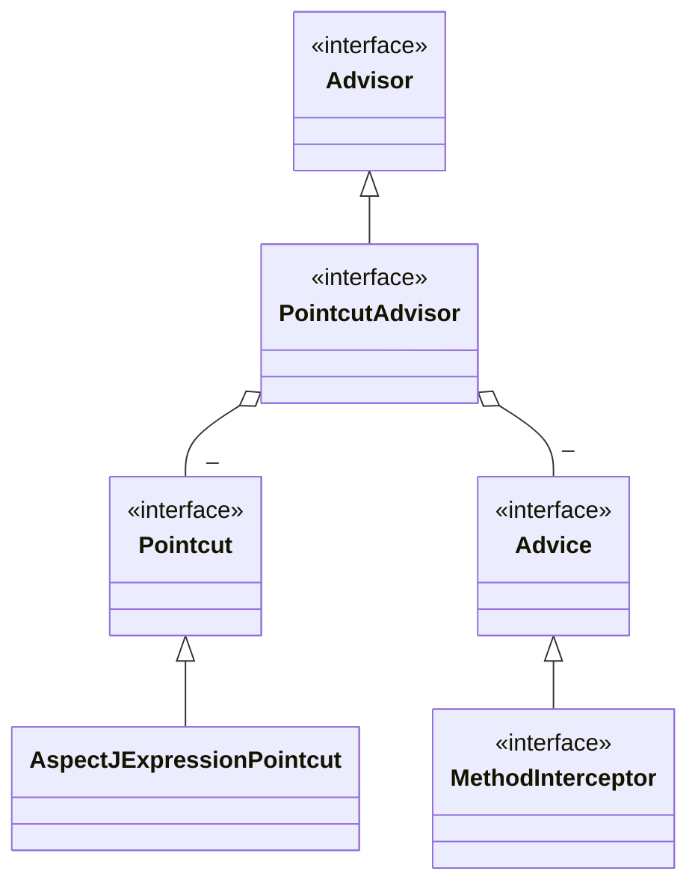

代理相关类图

* AopProxyFactory 根据 proxyTargetClass 等设置选择 AopProxy 实现
* AopProxy 通过 getProxy 创建代理对象
* 图中 Proxy 都实现了 Advised 接口，能够获得关联的切面集合与目标（其实是从 ProxyFactory 取得）
* 调用代理方法时，会借助 ProxyFactory 将通知统一转为环绕通知：MethodInterceptor

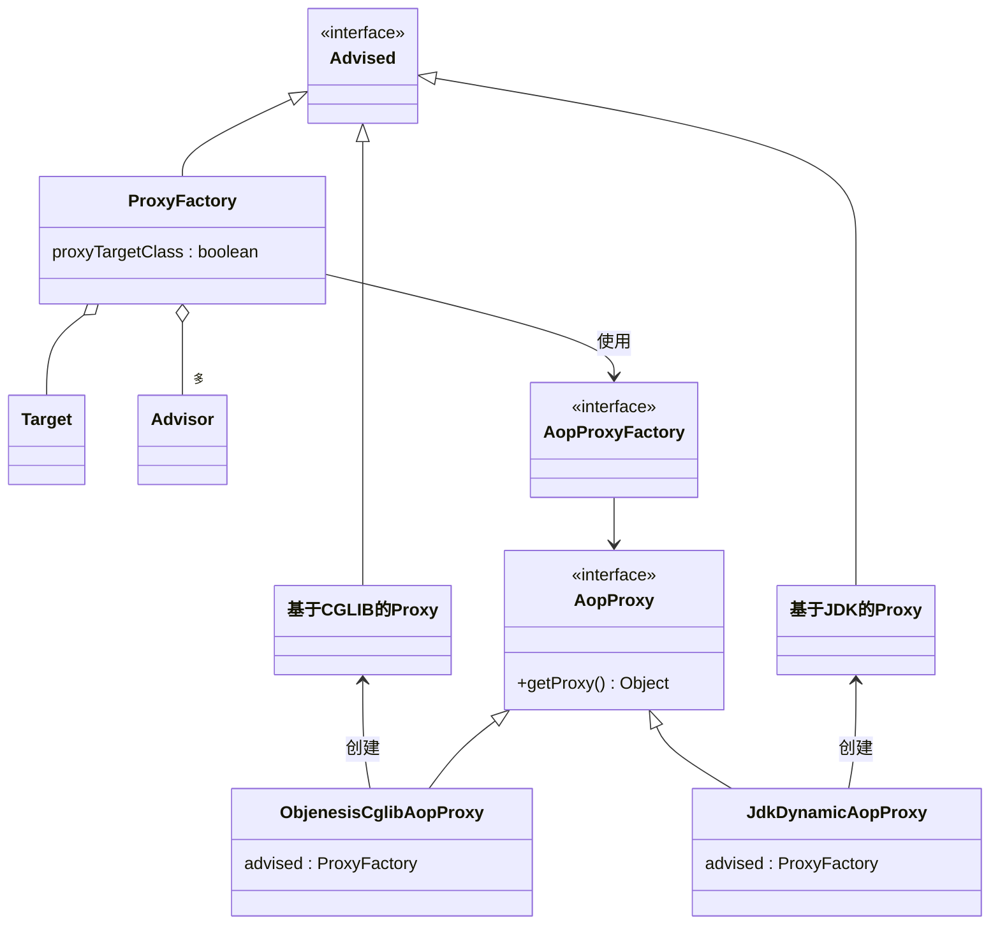


#### 演示 - 底层切点、通知、切面

##### 代码参考

**com.itheima.a15.A15**

#### 收获💡

1. 底层的切点实现
2. 底层的通知实现
2. 底层的切面实现
3. ProxyFactory 用来创建代理
   * 如果指定了接口，且 proxyTargetClass = false，使用 JdkDynamicAopProxy
   * 如果没有指定接口，或者 proxyTargetClass = true，使用 ObjenesisCglibAopProxy
     * 例外：如果目标是接口类型或已经是 Jdk 代理，使用 JdkDynamicAopProxy

> ***注意***
>
> * 要区分本章节提到的 MethodInterceptor，它与之前 cglib 中用的的 MethodInterceptor 是不同的接口


### 16) 切点匹配

#### 演示 - 切点匹配

##### 代码参考

**com.itheima.a16.A16**

#### 收获💡

1. 常见 aspectj 切点用法
2. aspectj 切点的局限性，实际的 @Transactional 切点实现


### 17) 从 @Aspect 到 Advisor

#### 演示1 - 代理创建器

##### 代码参考

**org.springframework.aop.framework.autoproxy** 包

#### 收获💡

1. AnnotationAwareAspectJAutoProxyCreator 的作用
   * 将高级 @Aspect 切面统一为低级 Advisor 切面
   * 在合适的时机创建代理
2. findEligibleAdvisors 找到有【资格】的 Advisors
   * 有【资格】的 Advisor 一部分是低级的, 可以由自己编写, 如本例 A17 中的 advisor3
   * 有【资格】的 Advisor 另一部分是高级的, 由解析 @Aspect 后获得
3. wrapIfNecessary
   * 它内部调用 findEligibleAdvisors, 只要返回集合不空, 则表示需要创建代理
   * 它的调用时机通常在原始对象初始化后执行, 但碰到循环依赖会提前至依赖注入之前执行


#### 演示2 - 代理创建时机

##### 代码参考

**org.springframework.aop.framework.autoproxy.A17_1**

#### 收获💡

1. 代理的创建时机
   * 初始化之后 (无循环依赖时)
   * 实例创建后, 依赖注入前 (有循环依赖时), 并暂存于二级缓存
2. 依赖注入与初始化不应该被增强, 仍应被施加于原始对象


#### 演示3 - @Before 对应的低级通知

##### 代码参考

**org.springframework.aop.framework.autoproxy.A17_2**

#### 收获💡

1. @Before 前置通知会被转换为原始的 AspectJMethodBeforeAdvice 形式, 该对象包含了如下信息
   1. 通知代码从哪儿来
   2. 切点是什么(这里为啥要切点, 后面解释)
   3. 通知对象如何创建, 本例共用同一个 Aspect 对象
2. 类似的还有
   1. AspectJAroundAdvice (环绕通知)
   2. AspectJAfterReturningAdvice
   3. AspectJAfterThrowingAdvice (环绕通知)
   4. AspectJAfterAdvice (环绕通知)


### 18) 静态通知调用

代理对象调用流程如下（以 JDK 动态代理实现为例）

* 从 ProxyFactory 获得 Target 和环绕通知链，根据他俩创建 MethodInvocation，简称 mi
* 首次执行 mi.proceed() 发现有下一个环绕通知，调用它的 invoke(mi)
* 进入环绕通知1，执行前增强，再次调用 mi.proceed() 发现有下一个环绕通知，调用它的 invoke(mi)
* 进入环绕通知2，执行前增强，调用 mi.proceed() 发现没有环绕通知，调用 mi.invokeJoinPoint() 执行目标方法
* 目标方法执行结束，将结果返回给环绕通知2，执行环绕通知2 的后增强
* 环绕通知2继续将结果返回给环绕通知1，执行环绕通知1 的后增强
* 环绕通知1返回最终的结果

图中不同颜色对应一次环绕通知或目标的调用起始至终结

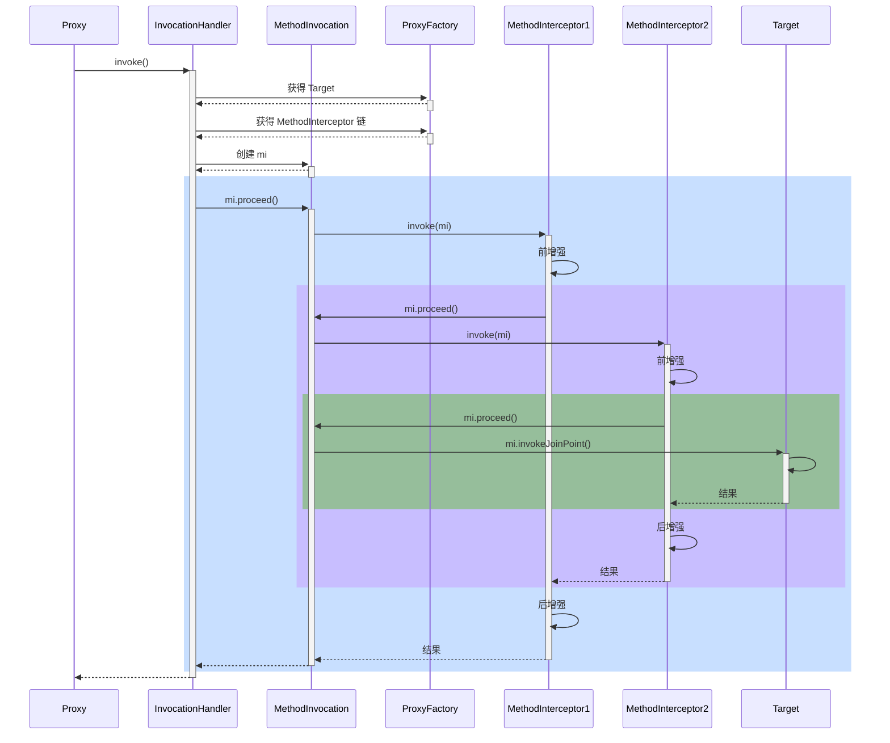


#### 演示1 - 通知调用过程

##### 代码参考

**org.springframework.aop.framework.A18**

#### 收获💡

代理方法执行时会做如下工作

1. 通过 proxyFactory 的 getInterceptorsAndDynamicInterceptionAdvice() 将其他通知统一转换为 MethodInterceptor 环绕通知
      - MethodBeforeAdviceAdapter 将 @Before AspectJMethodBeforeAdvice 适配为 MethodBeforeAdviceInterceptor
      - AfterReturningAdviceAdapter 将 @AfterReturning AspectJAfterReturningAdvice 适配为 AfterReturningAdviceInterceptor
      - 这体现的是适配器设计模式
2. 所谓静态通知，体现在上面方法的 Interceptors 部分，这些通知调用时无需再次检查切点，直接调用即可
3. 结合目标与环绕通知链，创建 MethodInvocation 对象，通过它完成整个调用


#### 演示2 - 模拟 MethodInvocation

##### 代码参考

**org.springframework.aop.framework.A18_1**

#### 收获💡

1. proceed() 方法调用链中下一个环绕通知
2. 每个环绕通知内部继续调用 proceed()
3. 调用到没有更多通知了, 就调用目标方法

MethodInvocation 的编程技巧在实现拦截器、过滤器时能用上


### 19) 动态通知调用

#### 演示 - 带参数绑定的通知方法调用

##### 代码参考

**org.springframework.aop.framework.autoproxy.A19**

#### 收获💡

1. 通过 proxyFactory 的 getInterceptorsAndDynamicInterceptionAdvice() 将其他通知统一转换为 MethodInterceptor 环绕通知
2. 所谓动态通知，体现在上面方法的 DynamicInterceptionAdvice 部分，这些通知调用时因为要为通知方法绑定参数，还需再次利用切点表达式
3. 动态通知调用复杂程度高，性能较低


## WEB

### 20) RequestMappingHandlerMapping 与 RequestMappingHandlerAdapter

RequestMappingHandlerMapping 与 RequestMappingHandlerAdapter 俩是一对，分别用来

* 处理 @RequestMapping 映射
* 调用控制器方法、并处理方法参数与方法返回值

#### 演示1 - DispatcherServlet 初始化

##### 代码参考

**com.itheima.a20** 包

#### 收获💡

1. DispatcherServlet 是在第一次被访问时执行初始化, 也可以通过配置修改为 Tomcat 启动后就初始化
2. 在初始化时会从 Spring 容器中找一些 Web 需要的组件, 如 HandlerMapping、HandlerAdapter 等，并逐一调用它们的初始化
3. RequestMappingHandlerMapping 初始化时，会收集所有 @RequestMapping 映射信息，封装为 Map，其中
   * key 是 RequestMappingInfo 类型，包括请求路径、请求方法等信息
   * value 是 HandlerMethod 类型，包括控制器方法对象、控制器对象
   * 有了这个 Map，就可以在请求到达时，快速完成映射，找到 HandlerMethod 并与匹配的拦截器一起返回给 DispatcherServlet
4. RequestMappingHandlerAdapter 初始化时，会准备 HandlerMethod 调用时需要的各个组件，如：
   * HandlerMethodArgumentResolver 解析控制器方法参数
   * HandlerMethodReturnValueHandler 处理控制器方法返回值


#### 演示2 - 自定义参数与返回值处理器

##### 代码参考

**com.itheima.a20.TokenArgumentResolver** ，**com.itheima.a20.YmlReturnValueHandler**

#### 收获💡

1. 体会参数解析器的作用
2. 体会返回值处理器的作用


### 21) 参数解析器

#### 演示 - 常见参数解析器

##### 代码参考

**com.itheima.a21** 包

#### 收获💡

1. 初步了解 RequestMappingHandlerAdapter 的调用过程
   1. 控制器方法被封装为 HandlerMethod
   2. 准备对象绑定与类型转换
   3. 准备 ModelAndViewContainer 用来存储中间 Model 结果
   4. 解析每个参数值
2. 解析参数依赖的就是各种参数解析器，它们都有两个重要方法
   * supportsParameter 判断是否支持方法参数
   * resolveArgument 解析方法参数
3. 常见参数的解析
   * @RequestParam
   * 省略 @RequestParam
   * @RequestParam(defaultValue)
   * MultipartFile
   * @PathVariable
   * @RequestHeader
   * @CookieValue
   * @Value
   * HttpServletRequest 等
   * @ModelAttribute
   * 省略 @ModelAttribute
   * @RequestBody
4. 组合模式在 Spring 中的体现
5. @RequestParam, @CookieValue 等注解中的参数名、默认值, 都可以写成活的, 即从 ${ } #{ }中获取


### 22) 参数名解析

#### 演示 - 两种方法获取参数名

##### 代码参考

**com.itheima.a22.A22**

#### 收获💡

1. 如果编译时添加了 -parameters 可以生成参数表, 反射时就可以拿到参数名
2. 如果编译时添加了 -g 可以生成调试信息, 但分为两种情况
   * 普通类, 会包含局部变量表, 用 asm 可以拿到参数名
   * 接口, 不会包含局部变量表, 无法获得参数名
     * 这也是 MyBatis 在实现 Mapper 接口时为何要提供 @Param 注解来辅助获得参数名


### 23) 对象绑定与类型转换

#### 底层第一套转换接口与实现

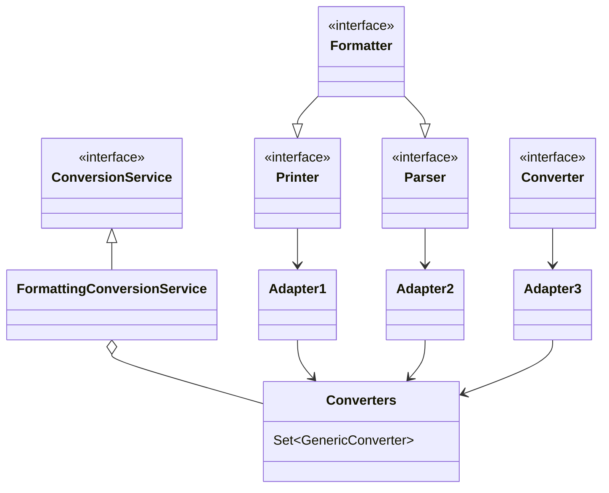

* Printer 把其它类型转为 String
* Parser 把 String 转为其它类型
* Formatter 综合 Printer 与 Parser 功能
* Converter 把类型 S 转为类型 T
* Printer、Parser、Converter 经过适配转换成 GenericConverter 放入 Converters 集合
* FormattingConversionService 利用其它们实现转换


#### 底层第二套转换接口

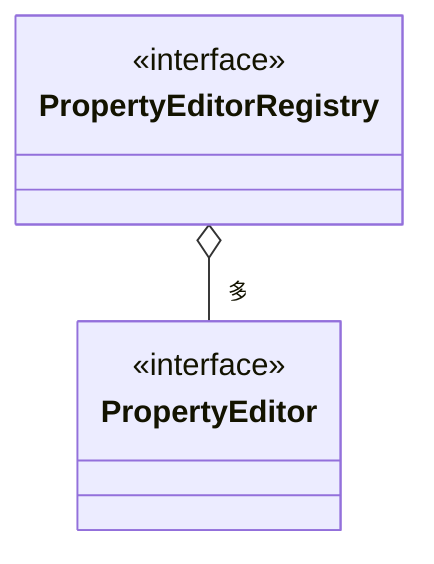

* PropertyEditor 把 String 与其它类型相互转换
* PropertyEditorRegistry 可以注册多个 PropertyEditor 对象
* 与第一套接口直接可以通过 FormatterPropertyEditorAdapter 来进行适配


#### 高层接口与实现

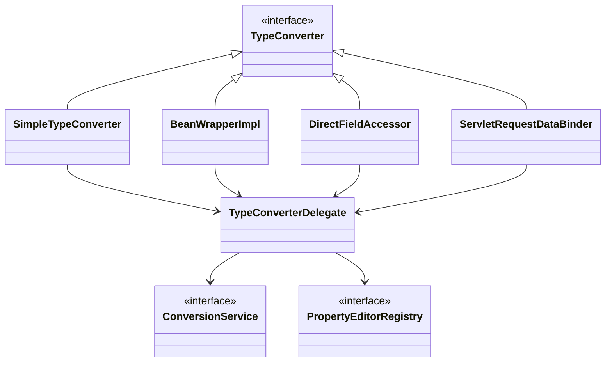

* 它们都实现了 TypeConverter 这个高层转换接口，在转换时，会用到 TypeConverter Delegate 委派ConversionService 与 PropertyEditorRegistry 真正执行转换（Facade 门面模式）
  * 首先看是否有自定义转换器, @InitBinder 添加的即属于这种 (用了适配器模式把 Formatter 转为需要的 PropertyEditor)
  * 再看有没有 ConversionService 转换
  * 再利用默认的 PropertyEditor 转换
  * 最后有一些特殊处理
* SimpleTypeConverter 仅做类型转换
* BeanWrapperImpl 为 bean 的属性赋值，当需要时做类型转换，走 Property
* DirectFieldAccessor 为 bean 的属性赋值，当需要时做类型转换，走 Field
* ServletRequestDataBinder 为 bean 的属性执行绑定，当需要时做类型转换，根据 directFieldAccess 选择走 Property 还是 Field，具备校验与获取校验结果功能


#### 演示1 - 类型转换与数据绑定

##### 代码参考

**com.itheima.a23** 包

#### 收获💡

基本的类型转换与数据绑定用法

* SimpleTypeConverter
* BeanWrapperImpl
* DirectFieldAccessor
* ServletRequestDataBinder


#### 演示2 - 数据绑定工厂

##### 代码参考

**com.itheima.a23.TestServletDataBinderFactory**

#### 收获💡

ServletRequestDataBinderFactory 的用法和扩展点

1. 可以解析控制器的 @InitBinder 标注方法作为扩展点，添加自定义转换器
   * 控制器私有范围
2. 可以通过 ConfigurableWebBindingInitializer 配置 ConversionService 作为扩展点，添加自定义转换器
   * 公共范围
3. 同时加了 @InitBinder 和 ConversionService 的转换优先级
   1. 优先采用 @InitBinder 的转换器
   2. 其次使用 ConversionService 的转换器
   3. 使用默认转换器
   4. 特殊处理（例如有参构造）


#### 演示3 - 获取泛型参数

##### 代码参考

**com.itheima.a23.sub** 包

#### 收获💡

1. java api 获取泛型参数
2. spring api 获取泛型参数


### 24) @ControllerAdvice 之 @InitBinder

#### 演示 - 准备 @InitBinder

**准备 @InitBinder** 在整个 HandlerAdapter 调用过程中所处的位置

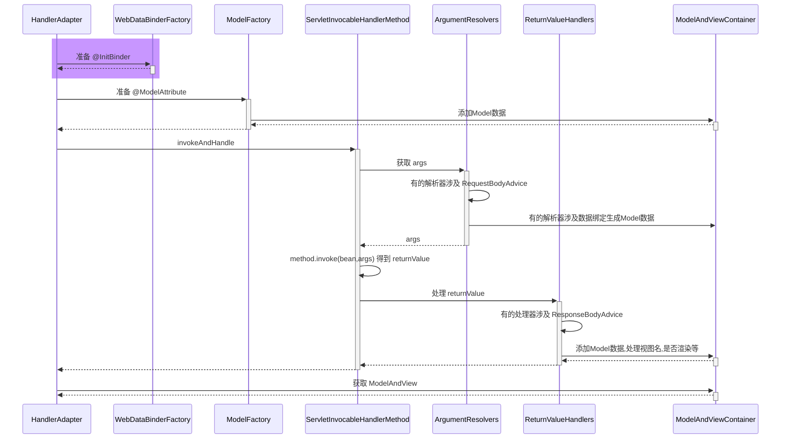

* RequestMappingHandlerAdapter 在图中缩写为 HandlerAdapter
* HandlerMethodArgumentResolverComposite 在图中缩写为 ArgumentResolvers
* HandlerMethodReturnValueHandlerComposite 在图中缩写为 ReturnValueHandlers

#### 收获💡

1. RequestMappingHandlerAdapter 初始化时会解析 @ControllerAdvice 中的 @InitBinder 方法
2. RequestMappingHandlerAdapter 会以类为单位，在该类首次使用时，解析此类的 @InitBinder 方法
3. 以上两种 @InitBinder 的解析结果都会缓存来避免重复解析
4. 控制器方法调用时，会综合利用本类的 @InitBinder 方法和 @ControllerAdvice 中的 @InitBinder 方法创建绑定工厂


### 25) 控制器方法执行流程

#### 图1

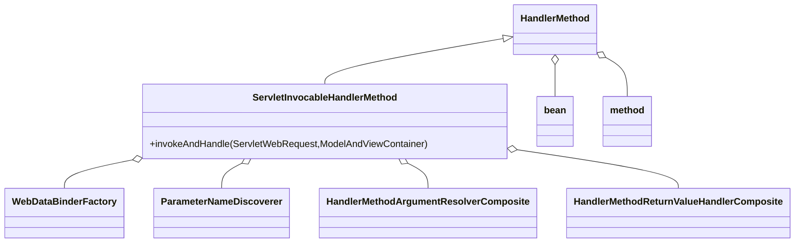

HandlerMethod 需要

* bean 即是哪个 Controller
* method 即是 Controller 中的哪个方法

ServletInvocableHandlerMethod 需要

* WebDataBinderFactory 负责对象绑定、类型转换
* ParameterNameDiscoverer 负责参数名解析
* HandlerMethodArgumentResolverComposite 负责解析参数
* HandlerMethodReturnValueHandlerComposite 负责处理返回值


#### 图2

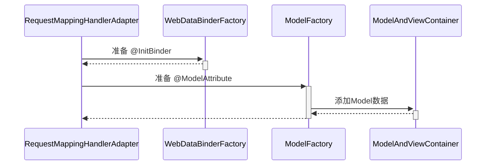

#### 图3

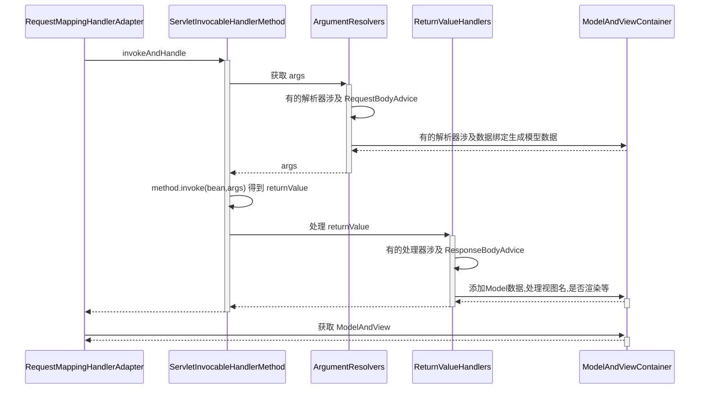


### 26) @ControllerAdvice 之 @ModelAttribute

#### 演示 - 准备 @ModelAttribute

##### 代码参考

**com.itheima.a26** 包

**准备 @ModelAttribute** 在整个 HandlerAdapter 调用过程中所处的位置

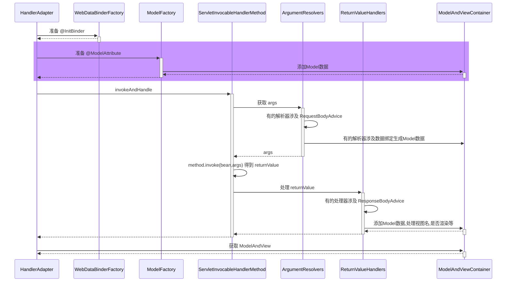

#### 收获💡

1. RequestMappingHandlerAdapter 初始化时会解析 @ControllerAdvice 中的 @ModelAttribute 方法
2. RequestMappingHandlerAdapter 会以类为单位，在该类首次使用时，解析此类的 @ModelAttribute 方法
3. 以上两种 @ModelAttribute 的解析结果都会缓存来避免重复解析
4. 控制器方法调用时，会综合利用本类的 @ModelAttribute 方法和 @ControllerAdvice 中的 @ModelAttribute 方法创建模型工厂


### 27) 返回值处理器

#### 演示 - 常见返回值处理器

##### 代码参考

**com.itheima.a27** 包

#### 收获💡

1. 常见的返回值处理器
   * ModelAndView，分别获取其模型和视图名，放入 ModelAndViewContainer
   * 返回值类型为 String 时，把它当做视图名，放入 ModelAndViewContainer
   * 返回值添加了 @ModelAttribute 注解时，将返回值作为模型，放入 ModelAndViewContainer
     * 此时需找到默认视图名
   * 返回值省略 @ModelAttribute 注解且返回非简单类型时，将返回值作为模型，放入 ModelAndViewContainer
     * 此时需找到默认视图名
   * 返回值类型为 ResponseEntity 时
     * 此时走 MessageConverter，并设置 ModelAndViewContainer.requestHandled 为 true
   * 返回值类型为 HttpHeaders 时
     * 会设置 ModelAndViewContainer.requestHandled 为 true
   * 返回值添加了 @ResponseBody 注解时
     * 此时走 MessageConverter，并设置 ModelAndViewContainer.requestHandled 为 true
2. 组合模式在 Spring 中的体现 + 1


### 28) MessageConverter

#### 演示 - MessageConverter 的作用

##### 代码参考

**com.itheima.a28.A28**

#### 收获💡

1. MessageConverter 的作用
   * @ResponseBody 是返回值处理器解析的
   * 但具体转换工作是 MessageConverter 做的
2. 如何选择 MediaType
   * 首先看 @RequestMapping 上有没有指定
   * 其次看 request 的 Accept 头有没有指定
   * 最后按 MessageConverter 的顺序, 谁能谁先转换


### 29) @ControllerAdvice 之 ResponseBodyAdvice

#### 演示 - ResponseBodyAdvice 增强

##### 代码参考

**com.itheima.a29** 包

**ResponseBodyAdvice 增强** 在整个 HandlerAdapter 调用过程中所处的位置

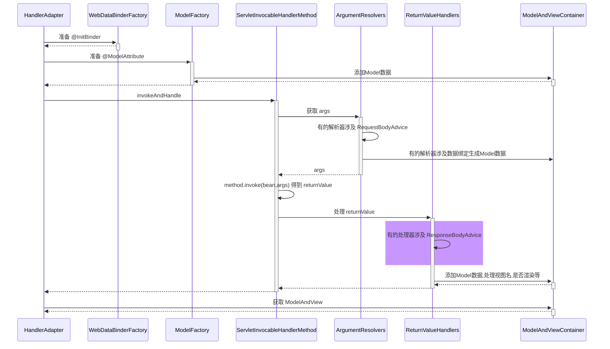

#### 收获💡

1. ResponseBodyAdvice 返回响应体前包装


### 30) 异常解析器

#### 演示 - ExceptionHandlerExceptionResolver

##### 代码参考

**com.itheima.a30.A30**

#### 收获💡

1. 它能够重用参数解析器、返回值处理器，实现组件重用
2. 它能够支持嵌套异常


### 31) @ControllerAdvice 之 @ExceptionHandler

#### 演示 - 准备 @ExceptionHandler

##### 代码参考

**com.itheima.a31** 包

#### 收获💡

1. ExceptionHandlerExceptionResolver 初始化时会解析 @ControllerAdvice 中的 @ExceptionHandler 方法
2. ExceptionHandlerExceptionResolver 会以类为单位，在该类首次处理异常时，解析此类的 @ExceptionHandler 方法
3. 以上两种 @ExceptionHandler 的解析结果都会缓存来避免重复解析


### 32) Tomcat 异常处理

* 我们知道 @ExceptionHandler 只能处理发生在 mvc 流程中的异常，例如控制器内、拦截器内，那么如果是 Filter 出现了异常，如何进行处理呢？

* 在 Spring Boot 中，是这么实现的：
  1. 因为内嵌了 Tomcat 容器，因此可以配置 Tomcat 的错误页面，Filter 与 错误页面之间是通过请求转发跳转的，可以在这里做手脚
  2. 先通过 ErrorPageRegistrarBeanPostProcessor 这个后处理器配置错误页面地址，默认为 `/error` 也可以通过 `${server.error.path}` 进行配置
  3. 当 Filter 发生异常时，不会走 Spring 流程，但会走 Tomcat 的错误处理，于是就希望转发至 `/error` 这个地址
     * 当然，如果没有 @ExceptionHandler，那么最终也会走到 Tomcat 的错误处理
  4. Spring Boot 又提供了一个 BasicErrorController，它就是一个标准 @Controller，@RequestMapping 配置为 `/error`，所以处理异常的职责就又回到了 Spring
  5. 异常信息由于会被 Tomcat 放入 request 作用域，因此 BasicErrorController 里也能获取到
  6. 具体异常信息会由 DefaultErrorAttributes 封装好
  7. BasicErrorController 通过 Accept 头判断需要生成哪种 MediaType 的响应
     * 如果要的不是 text/html，走 MessageConverter 流程
     * 如果需要 text/html，走 mvc 流程，此时又分两种情况
       * 配置了 ErrorViewResolver，根据状态码去找 View
       * 没配置或没找到，用 BeanNameViewResolver 根据一个固定为 error 的名字找到 View，即所谓的 WhitelabelErrorView

> ***评价***
>
> * 一个错误处理搞得这么复杂，就问恶心不？


#### 演示1 - 错误页处理

##### 关键代码

```java
@Bean // ⬅️修改了 Tomcat 服务器默认错误地址, 出错时使用请求转发方式跳转
public ErrorPageRegistrar errorPageRegistrar() {
    return webServerFactory -> webServerFactory.addErrorPages(new ErrorPage("/error"));
}

@Bean // ⬅️TomcatServletWebServerFactory 初始化前用它增强, 注册所有 ErrorPageRegistrar
public ErrorPageRegistrarBeanPostProcessor errorPageRegistrarBeanPostProcessor() {
    return new ErrorPageRegistrarBeanPostProcessor();
}
```

#### 收获💡

1. Tomcat 的错误页处理手段


#### 演示2 - BasicErrorController

##### 关键代码

```java
@Bean // ⬅️ErrorProperties 封装环境键值, ErrorAttributes 控制有哪些错误信息
public BasicErrorController basicErrorController() {
    ErrorProperties errorProperties = new ErrorProperties();
    errorProperties.setIncludeException(true);
    return new BasicErrorController(new DefaultErrorAttributes(), errorProperties);
}

@Bean // ⬅️名称为 error 的视图, 作为 BasicErrorController 的 text/html 响应结果
public View error() {
    return new View() {
        @Override
        public void render(
            Map<String, ?> model, 
            HttpServletRequest request, 
            HttpServletResponse response
        ) throws Exception {
            System.out.println(model);
            response.setContentType("text/html;charset=utf-8");
            response.getWriter().print("""
                    <h3>服务器内部错误</h3>
                    """);
        }
    };
}

@Bean // ⬅️收集容器中所有 View 对象, bean 的名字作为视图名
public ViewResolver viewResolver() {
    return new BeanNameViewResolver();
}
```

#### 收获💡

1. Spring Boot 中 BasicErrorController 如何工作


### 33) BeanNameUrlHandlerMapping 与 SimpleControllerHandlerAdapter

#### 演示 - 本组映射器和适配器

##### 关键代码

```java
@Bean
public BeanNameUrlHandlerMapping beanNameUrlHandlerMapping() {
    return new BeanNameUrlHandlerMapping();
}

@Bean
public SimpleControllerHandlerAdapter simpleControllerHandlerAdapter() {
    return new SimpleControllerHandlerAdapter();
}

@Bean("/c3")
public Controller controller3() {
    return (request, response) -> {
        response.getWriter().print("this is c3");
        return null;
    };
}
```

#### 收获💡

1. BeanNameUrlHandlerMapping，以 / 开头的 bean 的名字会被当作映射路径
2. 这些 bean 本身当作 handler，要求实现 Controller 接口
3. SimpleControllerHandlerAdapter，调用 handler
4. 模拟实现这组映射器和适配器


### 34) RouterFunctionMapping 与 HandlerFunctionAdapter

#### 演示 - 本组映射器和适配器

##### 关键代码

```java
@Bean
public RouterFunctionMapping routerFunctionMapping() {
    return new RouterFunctionMapping();
}

@Bean
public HandlerFunctionAdapter handlerFunctionAdapter() {
    return new HandlerFunctionAdapter();
}

@Bean
public RouterFunction<ServerResponse> r1() {
    //           ⬇️映射条件   ⬇️handler
    return route(GET("/r1"), request -> ok().body("this is r1"));
}
```

#### 收获💡

1. RouterFunctionMapping, 通过 RequestPredicate 条件映射
2. handler 要实现 HandlerFunction 接口
3. HandlerFunctionAdapter, 调用 handler


### 35) SimpleUrlHandlerMapping 与 HttpRequestHandlerAdapter

#### 演示1 - 本组映射器和适配器

##### 代码参考

**org.springframework.boot.autoconfigure.web.servlet.A35**

##### 关键代码

```java
@Bean
public SimpleUrlHandlerMapping simpleUrlHandlerMapping(ApplicationContext context) {
    SimpleUrlHandlerMapping handlerMapping = new SimpleUrlHandlerMapping();
    Map<String, ResourceHttpRequestHandler> map 
        = context.getBeansOfType(ResourceHttpRequestHandler.class);
    handlerMapping.setUrlMap(map);
    return handlerMapping;
}

@Bean
public HttpRequestHandlerAdapter httpRequestHandlerAdapter() {
    return new HttpRequestHandlerAdapter();
}

@Bean("/**")
public ResourceHttpRequestHandler handler1() {
    ResourceHttpRequestHandler handler = new ResourceHttpRequestHandler();
    handler.setLocations(List.of(new ClassPathResource("static/")));
    return handler;
}

@Bean("/img/**")
public ResourceHttpRequestHandler handler2() {
    ResourceHttpRequestHandler handler = new ResourceHttpRequestHandler();
    handler.setLocations(List.of(new ClassPathResource("images/")));
    return handler;
}
```

#### 收获💡

1. SimpleUrlHandlerMapping 不会在初始化时收集映射信息，需要手动收集
2. SimpleUrlHandlerMapping 映射路径
3. ResourceHttpRequestHandler 作为静态资源 handler
4. HttpRequestHandlerAdapter, 调用此 handler


#### 演示2 - 静态资源解析优化

##### 关键代码

```java
@Bean("/**")
public ResourceHttpRequestHandler handler1() {
    ResourceHttpRequestHandler handler = new ResourceHttpRequestHandler();
    handler.setLocations(List.of(new ClassPathResource("static/")));
    handler.setResourceResolvers(List.of(
        	// ⬇️缓存优化
            new CachingResourceResolver(new ConcurrentMapCache("cache1")),
        	// ⬇️压缩优化
            new EncodedResourceResolver(),
        	// ⬇️原始资源解析
            new PathResourceResolver()
    ));
    return handler;
}
```

#### 收获💡

1. 责任链模式体现
2. 压缩文件需要手动生成


#### 演示3 - 欢迎页

##### 关键代码

```java
@Bean
public WelcomePageHandlerMapping welcomePageHandlerMapping(ApplicationContext context) {
    Resource resource = context.getResource("classpath:static/index.html");
    return new WelcomePageHandlerMapping(null, context, resource, "/**");
}

@Bean
public SimpleControllerHandlerAdapter simpleControllerHandlerAdapter() {
    return new SimpleControllerHandlerAdapter();
}
```

#### 收获💡

1. 欢迎页支持静态欢迎页与动态欢迎页
2. WelcomePageHandlerMapping 映射欢迎页（即只映射 '/'）
   * 它内置的 handler ParameterizableViewController 作用是不执行逻辑，仅根据视图名找视图
   * 视图名固定为 forward:index.html
3. SimpleControllerHandlerAdapter, 调用 handler
   * 转发至 /index.html
   * 处理 /index.html 又会走上面的静态资源处理流程


#### 映射器与适配器小结

1. HandlerMapping 负责建立请求与控制器之间的映射关系
   * RequestMappingHandlerMapping (与 @RequestMapping 匹配)
   * WelcomePageHandlerMapping    (/)
   * BeanNameUrlHandlerMapping    (与 bean 的名字匹配 以 / 开头)
   * RouterFunctionMapping        (函数式 RequestPredicate, HandlerFunction)
   * SimpleUrlHandlerMapping      (静态资源 通配符 /** /img/**)
   * 之间也会有顺序问题, boot 中默认顺序如上
2. HandlerAdapter 负责实现对各种各样的 handler 的适配调用
   * RequestMappingHandlerAdapter 处理：@RequestMapping 方法
     * 参数解析器、返回值处理器体现了组合模式
   * SimpleControllerHandlerAdapter 处理：Controller 接口
   * HandlerFunctionAdapter 处理：HandlerFunction 函数式接口
   * HttpRequestHandlerAdapter 处理：HttpRequestHandler 接口 (静态资源处理)
   * 这也是典型适配器模式体现


### 36) mvc 处理流程

当浏览器发送一个请求 `http://localhost:8080/hello` 后，请求到达服务器，其处理流程是：

1. 服务器提供了 DispatcherServlet，它使用的是标准 Servlet 技术

   * 路径：默认映射路径为 `/`，即会匹配到所有请求 URL，可作为请求的统一入口，也被称之为**前控制器**
     * jsp 不会匹配到 DispatcherServlet
     * 其它有路径的 Servlet 匹配优先级也高于 DispatcherServlet
   * 创建：在 Boot 中，由 DispatcherServletAutoConfiguration 这个自动配置类提供 DispatcherServlet 的 bean
   * 初始化：DispatcherServlet 初始化时会优先到容器里寻找各种组件，作为它的成员变量
     * HandlerMapping，初始化时记录映射关系
     * HandlerAdapter，初始化时准备参数解析器、返回值处理器、消息转换器
     * HandlerExceptionResolver，初始化时准备参数解析器、返回值处理器、消息转换器
     * ViewResolver
2. DispatcherServlet 会利用 RequestMappingHandlerMapping 查找控制器方法

   * 例如根据 /hello 路径找到 @RequestMapping("/hello") 对应的控制器方法

   * 控制器方法会被封装为 HandlerMethod 对象，并结合匹配到的拦截器一起返回给 DispatcherServlet 

   * HandlerMethod 和拦截器合在一起称为 HandlerExecutionChain（调用链）对象
3. DispatcherServlet 接下来会：

   1. 调用拦截器的 preHandle 方法
   2. RequestMappingHandlerAdapter 调用 handle 方法，准备数据绑定工厂、模型工厂、ModelAndViewContainer、将 HandlerMethod 完善为 ServletInvocableHandlerMethod
      * @ControllerAdvice 全局增强点1️⃣：补充模型数据
      * @ControllerAdvice 全局增强点2️⃣：补充自定义类型转换器
      * 使用 HandlerMethodArgumentResolver 准备参数
        * @ControllerAdvice 全局增强点3️⃣：RequestBody 增强
      * 调用 ServletInvocableHandlerMethod 
      * 使用 HandlerMethodReturnValueHandler 处理返回值
        * @ControllerAdvice 全局增强点4️⃣：ResponseBody 增强
      * 根据 ModelAndViewContainer 获取 ModelAndView
        * 如果返回的 ModelAndView 为 null，不走第 4 步视图解析及渲染流程
          * 例如，有的返回值处理器调用了 HttpMessageConverter 来将结果转换为 JSON，这时 ModelAndView 就为 null
        * 如果返回的 ModelAndView 不为 null，会在第 4 步走视图解析及渲染流程
   3. 调用拦截器的 postHandle 方法
   4. 处理异常或视图渲染
      * 如果 1~3 出现异常，走 ExceptionHandlerExceptionResolver 处理异常流程
        * @ControllerAdvice 全局增强点5️⃣：@ExceptionHandler 异常处理
      * 正常，走视图解析及渲染流程
   5. 调用拦截器的 afterCompletion 方法


## Boot

### 37) Boot 骨架项目

如果是 linux 环境，用以下命令即可获取 spring boot 的骨架 pom.xml

```shell
curl -G https://start.spring.io/pom.xml -d dependencies=web,mysql,mybatis -o pom.xml
```

也可以使用 Postman 等工具实现

若想获取更多用法，请参考

```shell
curl https://start.spring.io
```


### 38) Boot War项目

步骤1：创建模块，区别在于打包方式选择 war

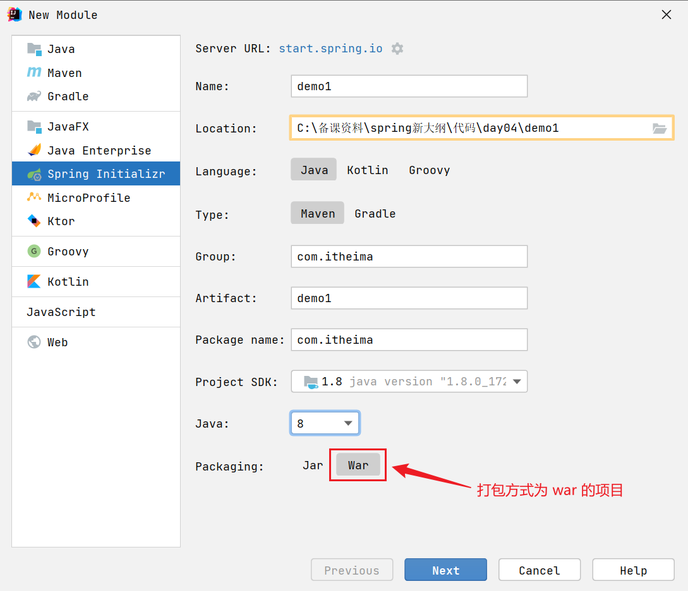

接下来勾选 Spring Web 支持


步骤2：编写控制器

```java
@Controller
public class MyController {

    @RequestMapping("/hello")
    public String abc() {
        System.out.println("进入了控制器");
        return "hello";
    }
}
```

步骤3：编写 jsp 视图，新建 webapp 目录和一个 hello.jsp 文件，注意文件名与控制器方法返回的视图逻辑名一致

```
src
	|- main
		|- java
		|- resources
		|- webapp
			|- hello.jsp
```

步骤4：配置视图路径，打开 application.properties 文件

```properties
spring.mvc.view.prefix=/
spring.mvc.view.suffix=.jsp
```

> 将来 prefix + 控制器方法返回值 + suffix 即为视图完整路径


#### 测试

如果用 mvn 插件 `mvn spring-boot:run` 或 main 方法测试

* 必须添加如下依赖，因为此时用的还是内嵌 tomcat，而内嵌 tomcat 默认不带 jasper（用来解析 jsp）

```xml
<dependency>
    <groupId>org.apache.tomcat.embed</groupId>
    <artifactId>tomcat-embed-jasper</artifactId>
    <scope>provided</scope>
</dependency>
```

也可以使用 Idea 配置 tomcat 来测试，此时用的是外置 tomcat

* 骨架生成的代码中，多了一个 ServletInitializer，它的作用就是配置外置 Tomcat 使用的，在外置 Tomcat 启动后，去调用它创建和运行 SpringApplication


#### 启示

对于 jar 项目，若要支持 jsp，也可以在加入 jasper 依赖的前提下，把 jsp 文件置入 `META-INF/resources` 


### 39) Boot 启动过程

阶段一：SpringApplication 构造

1. 记录 BeanDefinition 源
2. 推断应用类型
3. 记录 ApplicationContext 初始化器
4. 记录监听器
5. 推断主启动类

阶段二：执行 run 方法

1. 得到 SpringApplicationRunListeners，名字取得不好，实际是事件发布器

   * 发布 application starting 事件1️⃣

2. 封装启动 args

3. 准备 Environment 添加命令行参数（*）

4. ConfigurationPropertySources 处理（*）

   * 发布 application environment 已准备事件2️⃣

5. 通过 EnvironmentPostProcessorApplicationListener 进行 env 后处理（*）
   * application.properties，由 StandardConfigDataLocationResolver 解析
   * spring.application.json

6. 绑定 spring.main 到 SpringApplication 对象（*）

7. 打印 banner（*）

8. 创建容器

9. 准备容器

   * 发布 application context 已初始化事件3️⃣

10. 加载 bean 定义

    * 发布 application prepared 事件4️⃣

11. refresh 容器

    * 发布 application started 事件5️⃣

12. 执行 runner

    * 发布 application ready 事件6️⃣

    * 这其中有异常，发布 application failed 事件7️⃣

> 带 * 的有独立的示例

#### 演示 - 启动过程

**com.itheima.a39.A39_1** 对应 SpringApplication 构造

**com.itheima.a39.A39_2** 对应第1步，并演示 7 个事件

**com.itheima.a39.A39_3** 对应第2、8到12步

**org.springframework.boot.Step3**

**org.springframework.boot.Step4**

**org.springframework.boot.Step5**

**org.springframework.boot.Step6**

**org.springframework.boot.Step7**

#### 收获💡

1. SpringApplication 构造方法中所做的操作
   * 可以有多种源用来加载 bean 定义
   * 应用类型推断
   * 添加容器初始化器
   * 添加监听器
   * 演示主类推断
2. 如何读取 spring.factories 中的配置
3. 从配置中获取重要的事件发布器：SpringApplicationRunListeners
4. 容器的创建、初始化器增强、加载 bean 定义等
5. CommandLineRunner、ApplicationRunner 的作用
6. 环境对象
   1. 命令行 PropertySource
   2. ConfigurationPropertySources 规范环境键名称
   3. EnvironmentPostProcessor 后处理增强
      * 由 EventPublishingRunListener 通过监听事件2️⃣来调用
   4. 绑定 spring.main 前缀的 key value 至 SpringApplication
7. Banner 


### 40) Tomcat 内嵌容器

Tomcat 基本结构

```
Server
└───Service
    ├───Connector (协议, 端口)
    └───Engine
        └───Host(虚拟主机 localhost)
            ├───Context1 (应用1, 可以设置虚拟路径, / 即 url 起始路径; 项目磁盘路径, 即 docBase )
            │   │   index.html
            │   └───WEB-INF
            │       │   web.xml (servlet, filter, listener) 3.0
            │       ├───classes (servlet, controller, service ...)
            │       ├───jsp
            │       └───lib (第三方 jar 包)
            └───Context2 (应用2)
                │   index.html
                └───WEB-INF
                        web.xml
```

#### 演示1 - Tomcat 内嵌容器

##### 关键代码

```java
public static void main(String[] args) throws LifecycleException, IOException {
    // 1.创建 Tomcat 对象
    Tomcat tomcat = new Tomcat();
    tomcat.setBaseDir("tomcat");

    // 2.创建项目文件夹, 即 docBase 文件夹
    File docBase = Files.createTempDirectory("boot.").toFile();
    docBase.deleteOnExit();

    // 3.创建 Tomcat 项目, 在 Tomcat 中称为 Context
    Context context = tomcat.addContext("", docBase.getAbsolutePath());

    // 4.编程添加 Servlet
    context.addServletContainerInitializer(new ServletContainerInitializer() {
        @Override
        public void onStartup(Set<Class<?>> c, ServletContext ctx) throws ServletException {
            HelloServlet helloServlet = new HelloServlet();
            ctx.addServlet("aaa", helloServlet).addMapping("/hello");
        }
    }, Collections.emptySet());

    // 5.启动 Tomcat
    tomcat.start();

    // 6.创建连接器, 设置监听端口
    Connector connector = new Connector(new Http11Nio2Protocol());
    connector.setPort(8080);
    tomcat.setConnector(connector);
}
```


#### 演示2 - 集成 Spring 容器

##### 关键代码

```java
WebApplicationContext springContext = getApplicationContext();

// 4.编程添加 Servlet
context.addServletContainerInitializer(new ServletContainerInitializer() {
    @Override
    public void onStartup(Set<Class<?>> c, ServletContext ctx) throws ServletException {
        // ⬇️通过 ServletRegistrationBean 添加 DispatcherServlet 等
        for (ServletRegistrationBean registrationBean : 
             springContext.getBeansOfType(ServletRegistrationBean.class).values()) {
            registrationBean.onStartup(ctx);
        }
    }
}, Collections.emptySet());
```


### 41) Boot 自动配置

#### AopAutoConfiguration

Spring Boot 是利用了自动配置类来简化了 aop 相关配置

* AOP 自动配置类为 `org.springframework.boot.autoconfigure.aop.AopAutoConfiguration`
* 可以通过 `spring.aop.auto=false` 禁用 aop 自动配置
* AOP 自动配置的本质是通过 `@EnableAspectJAutoProxy` 来开启了自动代理，如果在引导类上自己添加了 `@EnableAspectJAutoProxy` 那么以自己添加的为准
* `@EnableAspectJAutoProxy` 的本质是向容器中添加了 `AnnotationAwareAspectJAutoProxyCreator` 这个 bean 后处理器，它能够找到容器中所有切面，并为匹配切点的目标类创建代理，创建代理的工作一般是在 bean 的初始化阶段完成的


#### DataSourceAutoConfiguration

* 对应的自动配置类为：org.springframework.boot.autoconfigure.jdbc.DataSourceAutoConfiguration
* 它内部采用了条件装配，通过检查容器的 bean，以及类路径下的 class，来决定该 @Bean 是否生效

简单说明一下，Spring Boot 支持两大类数据源：

* EmbeddedDatabase - 内嵌数据库连接池
* PooledDataSource - 非内嵌数据库连接池

PooledDataSource 又支持如下数据源

* hikari 提供的 HikariDataSource
* tomcat-jdbc 提供的 DataSource
* dbcp2 提供的 BasicDataSource
* oracle 提供的 PoolDataSourceImpl

如果知道数据源的实现类类型，即指定了 `spring.datasource.type`，理论上可以支持所有数据源，但这样做的一个最大问题是无法订制每种数据源的详细配置（如最大、最小连接数等）


#### MybatisAutoConfiguration

* MyBatis 自动配置类为 `org.mybatis.spring.boot.autoconfigure.MybatisAutoConfiguration`
* 它主要配置了两个 bean
  * SqlSessionFactory - MyBatis 核心对象，用来创建 SqlSession
  * SqlSessionTemplate - SqlSession 的实现，此实现会与当前线程绑定
  * 用 ImportBeanDefinitionRegistrar 的方式扫描所有标注了 @Mapper 注解的接口
  * 用 AutoConfigurationPackages 来确定扫描的包
* 还有一个相关的 bean：MybatisProperties，它会读取配置文件中带 `mybatis.` 前缀的配置项进行定制配置

@MapperScan 注解的作用与 MybatisAutoConfiguration 类似，会注册 MapperScannerConfigurer 有如下区别

* @MapperScan 扫描具体包（当然也可以配置关注哪个注解）
* @MapperScan 如果不指定扫描具体包，则会把引导类范围内，所有接口当做 Mapper 接口
* MybatisAutoConfiguration 关注的是所有标注 @Mapper 注解的接口，会忽略掉非 @Mapper 标注的接口

这里有同学有疑问，之前介绍的都是将具体类交给 Spring 管理，怎么到了 MyBatis 这儿，接口就可以被管理呢？

* 其实并非将接口交给 Spring 管理，而是每个接口会对应一个 MapperFactoryBean，是后者被 Spring 所管理，接口只是作为 MapperFactoryBean 的一个属性来配置


#### TransactionAutoConfiguration

* 事务自动配置类有两个：
  * `org.springframework.boot.autoconfigure.jdbc.DataSourceTransactionManagerAutoConfiguration`
  * `org.springframework.boot.autoconfigure.transaction.TransactionAutoConfiguration`

* 前者配置了 DataSourceTransactionManager 用来执行事务的提交、回滚操作
* 后者功能上对标 @EnableTransactionManagement，包含以下三个 bean
  * BeanFactoryTransactionAttributeSourceAdvisor 事务切面类，包含通知和切点
  * TransactionInterceptor 事务通知类，由它在目标方法调用前后加入事务操作
  * AnnotationTransactionAttributeSource 会解析 @Transactional 及事务属性，也包含了切点功能
* 如果自己配置了 DataSourceTransactionManager 或是在引导类加了 @EnableTransactionManagement，则以自己配置的为准


#### ServletWebServerFactoryAutoConfiguration

* 提供 ServletWebServerFactory


#### DispatcherServletAutoConfiguration

* 提供 DispatcherServlet
* 提供 DispatcherServletRegistrationBean


#### WebMvcAutoConfiguration

* 配置 DispatcherServlet 的各项组件，提供的 bean 见过的有
  * 多项 HandlerMapping
  * 多项 HandlerAdapter
  * HandlerExceptionResolver


#### ErrorMvcAutoConfiguration

* 提供的 bean 有 BasicErrorController


#### MultipartAutoConfiguration

* 它提供了 org.springframework.web.multipart.support.StandardServletMultipartResolver
* 该 bean 用来解析 multipart/form-data 格式的数据


#### HttpEncodingAutoConfiguration

* POST 请求参数如果有中文，无需特殊设置，这是因为 Spring Boot 已经配置了 org.springframework.boot.web.servlet.filter.OrderedCharacterEncodingFilter
* 对应配置 server.servlet.encoding.charset=UTF-8，默认就是 UTF-8
* 当然，它只影响非 json 格式的数据


#### 演示 - 自动配置类原理

##### 关键代码

假设已有第三方的两个自动配置类

```java
@Configuration // ⬅️第三方的配置类
static class AutoConfiguration1 {
    @Bean
    public Bean1 bean1() {
        return new Bean1();
    }
}

@Configuration // ⬅️第三方的配置类
static class AutoConfiguration2 {
    @Bean
    public Bean2 bean2() {
        return new Bean2();
    }
}
```

提供一个配置文件 META-INF/spring.factories，key 为导入器类名，值为多个自动配置类名，用逗号分隔

```properties
MyImportSelector=\
AutoConfiguration1,\
AutoConfiguration2
```

> ***注意***
>
> * 上述配置文件中 MyImportSelector 与 AutoConfiguration1，AutoConfiguration2 为简洁均省略了包名，自己测试时请将包名根据情况补全

引入自动配置

```java
@Configuration // ⬅️本项目的配置类
@Import(MyImportSelector.class)
static class Config { }

static class MyImportSelector implements DeferredImportSelector {
    // ⬇️该方法从 META-INF/spring.factories 读取自动配置类名，返回的 String[] 即为要导入的配置类
    public String[] selectImports(AnnotationMetadata importingClassMetadata) {
        return SpringFactoriesLoader
            .loadFactoryNames(MyImportSelector.class, null).toArray(new String[0]);
    }
}
```

#### 收获💡

1. 自动配置类本质上就是一个配置类而已，只是用 META-INF/spring.factories 管理，与应用配置类解耦
2. @Enable 打头的注解本质是利用了 @Import
3. @Import 配合 DeferredImportSelector 即可实现导入，selectImports 方法的返回值即为要导入的配置类名
4. DeferredImportSelector 的导入会在最后执行，为的是让其它配置优先解析


### 42) 条件装配底层

条件装配的底层是本质上是 @Conditional 与 Condition，这两个注解。引入自动配置类时，期望满足一定条件才能被 Spring 管理，不满足则不管理，怎么做呢？

比如条件是【类路径下必须有 dataSource】这个 bean ，怎么做呢？

首先编写条件判断类，它实现 Condition 接口，编写条件判断逻辑

```java
static class MyCondition1 implements Condition { 
    // ⬇️如果存在 Druid 依赖，条件成立
    public boolean matches(ConditionContext context, AnnotatedTypeMetadata metadata) {
        return ClassUtils.isPresent("com.alibaba.druid.pool.DruidDataSource", null);
    }
}
```

其次，在要导入的自动配置类上添加 `@Conditional(MyCondition1.class)`，将来此类被导入时就会做条件检查

```java
@Configuration // 第三方的配置类
@Conditional(MyCondition1.class) // ⬅️加入条件
static class AutoConfiguration1 {
    @Bean
    public Bean1 bean1() {
        return new Bean1();
    }
}
```

分别测试加入和去除 druid 依赖，观察 bean1 是否存在于容器

```xml
<dependency>
    <groupId>com.alibaba</groupId>
    <artifactId>druid</artifactId>
    <version>1.1.17</version>
</dependency>
```

#### 收获💡

1. 学习一种特殊的 if - else


## 其它

### 43) FactoryBean

#### 演示 - FactoryBean

##### 代码参考

**com.itheima.a43** 包

#### 收获💡

1. 它的作用是用制造创建过程较为复杂的产品, 如 SqlSessionFactory, 但 @Bean 已具备等价功能
2. 使用上较为古怪, 一不留神就会用错
   1. 被 FactoryBean 创建的产品
      * 会认为创建、依赖注入、Aware 接口回调、前初始化这些都是 FactoryBean 的职责, 这些流程都不会走
      * 唯有后初始化的流程会走, 也就是产品可以被代理增强
      * 单例的产品不会存储于 BeanFactory 的 singletonObjects 成员中, 而是另一个 factoryBeanObjectCache 成员中
   2. 按名字去获取时, 拿到的是产品对象, 名字前面加 & 获取的是工厂对象


### 44) @Indexed 原理

真实项目中，只需要加入以下依赖即可

```xml
<dependency>
    <groupId>org.springframework</groupId>
    <artifactId>spring-context-indexer</artifactId>
    <optional>true</optional>
</dependency>
```


#### 演示 - @Indexed

##### 代码参考

**com.itheima.a44** 包

#### 收获💡

1. 在编译时就根据 @Indexed 生成 META-INF/spring.components 文件
2. 扫描时
   * 如果发现 META-INF/spring.components 存在, 以它为准加载 bean definition
   * 否则, 会遍历包下所有 class 资源 (包括 jar 内的)
3. 解决的问题，在编译期就找到 @Component 组件，节省运行期间扫描 @Component 的时间


### 45) 代理进一步理解

#### 演示 - 代理

##### 代码参考

**com.itheima.a45** 包

#### 收获💡

1. spring 代理的设计特点

   * 依赖注入和初始化影响的是原始对象
     * 因此 cglib 不能用 MethodProxy.invokeSuper()

   * 代理与目标是两个对象，二者成员变量并不共用数据

2. static 方法、final 方法、private 方法均无法增强

   * 进一步理解代理增强基于方法重写


### 46) @Value 装配底层

#### 按类型装配的步骤

1. 查看需要的类型是否为 Optional，是，则进行封装（非延迟），否则向下走
2. 查看需要的类型是否为 ObjectFactory 或 ObjectProvider，是，则进行封装（延迟），否则向下走
3. 查看需要的类型（成员或参数）上是否用 @Lazy 修饰，是，则返回代理，否则向下走
4. 解析 @Value 的值
   1. 如果需要的值是字符串，先解析 ${ }，再解析 #{ }
   2. 不是字符串，需要用 TypeConverter 转换
5. 看需要的类型是否为 Stream、Array、Collection、Map，是，则按集合处理，否则向下走
6. 在 BeanFactory 的 resolvableDependencies 中找有没有类型合适的对象注入，没有向下走
7. 在 BeanFactory 及父工厂中找类型匹配的 bean 进行筛选，筛选时会考虑 @Qualifier 及泛型
8. 结果个数为 0 抛出 NoSuchBeanDefinitionException 异常 
9. 如果结果 > 1，再根据 @Primary 进行筛选
10. 如果结果仍 > 1，再根据成员名或变量名进行筛选
11. 结果仍 > 1，抛出 NoUniqueBeanDefinitionException 异常


#### 演示 - @Value 装配过程

##### 代码参考

**com.itheima.a46** 包

#### 收获💡

1. ContextAnnotationAutowireCandidateResolver 作用之一，获取 @Value 的值
2. 了解 ${ } 对应的解析器
3. 了解 #{ } 对应的解析器
4. TypeConvert 的一项体现


### 47) @Autowired 装配底层

#### 演示 - @Autowired 装配过程

##### 代码参考

**com.itheima.a47** 包

#### 收获💡

1. @Autowired 本质上是根据成员变量或方法参数的类型进行装配
2. 如果待装配类型是 Optional，需要根据 Optional 泛型找到 bean，再封装为 Optional 对象装配
3. 如果待装配的类型是 ObjectFactory，需要根据 ObjectFactory 泛型创建 ObjectFactory 对象装配
   * 此方法可以延迟 bean 的获取
4. 如果待装配的成员变量或方法参数上用 @Lazy 标注，会创建代理对象装配
   * 此方法可以延迟真实 bean 的获取
   * 被装配的代理不作为 bean
5. 如果待装配类型是数组，需要获取数组元素类型，根据此类型找到多个 bean 进行装配
6. 如果待装配类型是 Collection 或其子接口，需要获取 Collection 泛型，根据此类型找到多个 bean
7. 如果待装配类型是 ApplicationContext 等特殊类型
   * 会在 BeanFactory 的 resolvableDependencies 成员按类型查找装配
   * resolvableDependencies 是 map 集合，key 是特殊类型，value 是其对应对象
   * 不能直接根据 key 进行查找，而是用 isAssignableFrom 逐一尝试右边类型是否可以被赋值给左边的 key 类型
8. 如果待装配类型有泛型参数
   * 需要利用 ContextAnnotationAutowireCandidateResolver 按泛型参数类型筛选
9. 如果待装配类型有 @Qualifier
   * 需要利用 ContextAnnotationAutowireCandidateResolver 按注解提供的 bean 名称筛选
10. 有 @Primary 标注的 @Component 或 @Bean 的处理
11. 与成员变量名或方法参数名同名 bean 的处理


### 48) 事件监听器

#### 演示 - 事件监听器

##### 代码参考

**com.itheima.a48** 包

#### 收获💡

事件监听器的两种方式

1. 实现 ApplicationListener 接口
   * 根据接口泛型确定事件类型
2. @EventListener 标注监听方法
   * 根据监听器方法参数确定事件类型
   * 解析时机：在 SmartInitializingSingleton（所有单例初始化完成后），解析每个单例 bean


### 49) 事件发布器

#### 演示 - 事件发布器

##### 代码参考

**com.itheima.a49** 包

#### 收获💡

事件发布器模拟实现

1. addApplicationListenerBean 负责收集容器中的监听器
   * 监听器会统一转换为 GenericApplicationListener 对象，以支持判断事件类型
2. multicastEvent 遍历监听器集合，发布事件
   * 发布前先通过 GenericApplicationListener.supportsEventType 判断支持该事件类型才发事件
   * 可以利用线程池进行异步发事件优化
3. 如果发送的事件对象不是 ApplicationEvent 类型，Spring 会把它包装为 PayloadApplicationEvent 并用泛型技术解析事件对象的原始类型
   * 视频中未讲解

