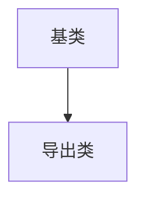

如果我们说另一种语言，那么我们就会发觉一个有些不同的世界。 

# 一.对象导论 

## 每个对象都有一个接口 

类实际上是一个数据类型。 

## 每个对象都提供服务 

对象是服务提供者，这样有助于提高内聚性，高内聚意味着一个类库各方面都组合的很好，良好的面向对象设计中每个对象都很好完成一件事，但不做更多的事。 

## 复用具体实现 

在现有的类中合成新的类（引用其他类）被称为组合【has——a】，组合是动态发生的称为聚合。 

创建新类时，比起继承更应该先考虑组合 

## 继承 



```

## "是一个“与”像一个“关系 

一个导出类完全替代一个基类对象---是一个 

导出类添加新接口，基类无法访问导出类接口---像一个 

## 伴随多态的可互换对象 

面向对象采用后期绑定 

将导出类看作基类被称为向上转型（cast） 

## 容器 

·List 

·Map 

·set 

## 并发编程 

中断对时间性强的任务是必须的 

程序中彼此独立运行的部分称之为线程 

## java与internet 

### web 

#### 1.客户/服务器计算技术 

系统有一个中央信息存储池，可以分发给信息消费者，信息存储池、用于分发信息的软件以及信息驻留的机器或机群被称为服务器，驻留在用户机器上的软件与服务器进行通信，将他们显示在客户机的用户机器上。 

#### 2.web就是一台巨型服务器 

浏览器是一个观察器，它不能执行最简单的计算任务。 

客户端浏览器中运行程序的称做客户端编程。 

#### 3.客户端编程 

服务器-浏览器的交互性由服务器提供。 

浏览器的提交动作由web服务器的通用网关接口传递（cgi）。【服务器cgi-bin目录下】 

客户端编程意味着web浏览器能用来执行任何它可以完成的动作。 

web浏览器就像一个动作受限的操作系统， 

##### 1.插件 

客户端编程迈出的最重要一步就是插件的开发，程序员可以通过下载一段代码并将其插入到浏览器的适当位置。 

##### 2.脚本语言 

插件引发了浏览器脚本语言的开发，通过使用某种脚本语言，可以将客户端程序源码嵌入html中运行。 

##### 3.java 

Java通过applet和Java web start进行客户端编程的。 

applet是用户需要使用客户端软件时，从服务器将客户端软件发给用户。 

##### 4.internet和intranet 

web是最常用的解决客户/服务器问题的方案，intranet（企业内部网）是web技术用于特定公司的信息网络时。 

# 二.一切都是对象 

## 用引用操作对象 

引用是遥控器，对象是电视，一个电视的遥控器可以有好几个。 

## 数据存储的地方 

1.寄存器 最快的存储区，数量极少 

2.栈 位于Ram（随机访问处理器）中，通过堆栈指针分配释放内存，必须知道确切的生命周期，对象引用存储其中。 

3.堆 位于Ram（随机访问处理器）中，不需要知道生命周期，对象本身存储在其中。 

4.常量存储 常量值存储在代码内部 

5.非Ram存储，数据完全存活在程序之外。 

## 特例：基本类型 

不通过new创建，存储在栈中， 

基本类型具有包装器类，可以在堆上创建一个非基本类型对象，用来表示对应的基本类型。 

高精度计算类：BigIntegar(支持任意精度的整数)和BigDecimal（任何精度的定点数）没有对应的基本类型 

## 数组 

创建数组对象相当于创建引用数组 

## 对象的作用域 

```java 
{ 

string s = new String("a string"); 

// end of scope 

} 
```


引用s在作用域终点消失，s指向的对象仍占据内存空间 

## 方法，参数，返回值 

调用方法称为发送消息给对象，面向对象的程序设计称为“向对象发送消息” 

#### 参数列表 

传递的是引用


# 三.操作符

## 赋值

对对象赋值的时候真正操作的是对对象的引用，将一个对象赋值给另一个对象，实际是将引用从一个地方复制到另一个地方。

**别名现象**

```java
class Tank {
  int level;
}
Tank t1 = new Tank();
Tank t2 = new Tank();
t1.level = 9;
t2.level = 47;
print("1: t1.level: " + t1.level +
     ", t2.level: " + t2.level);
//t1.level: 9, t2.level: 47
t1 = t2;
print("1: t1.level: " + t1.level +
     ", t2.level: " + t2.level);
//t1.level: 47, t2.level: 

t1.level = 27;
print("1: t1.level: " + t1.level +
     ", t2.level: " + t2.level);
t1.level: 27, t2.level: 27


```

赋值操作的是对对象的引用，修改t1同时也改变了t2，这是因为t1，t2包含的是相同的引用，它们指向相同的对象，这种现象称之为 **别名现象**


避免别名现象：t1.level = t2.level；

## 测试对象等价性

==比较的是对象的引用，

比较包装类的内容是否相同用equels（）；

比较自己创建类的内容是否相同需要重写equals方法，默认的equals方法比较的是引用

## 直接常量


int i = 0X2f;

直接常量后面的后缀字符标志了它的类型

## 类型转化操作符

**窄化转换**

**拓展转换**


# 四.控制执行流程

## break和continue

break用于强行退出当前循环，continue用于停止当前循环，退回循环的起始处开始下一次循环

while（true）和for（；；）等同

## 标签

java没有goto，break和continue和标签一起使用就是中断当前循环，直到标签所在的地方

**若有多个循环嵌套的话**，不使用break/continue与标签的话没办法一下子跳出所有循环，**这是因为break和continue只能中断当前循环。**

（1）一般的continue会退回最内层循环的开头，并继续执行

（2）带标签的continue会到达标签的位置，并重新进入紧接在标签后面的循环

（3）一般的break只能中断并跳出当前循环

（4）带标签的break会中断并跳出标签所指的循环

## switch

case后面都跟着break，若省略break则会继续执行后面的case


# 五.初始化与清理

## 1.用构造器保证初始化

创建对象时为其分配存储空间，并调用相应的构造器，构造器没有返回值。

## 2.方法重载

想用多种方式创建一个对象时需要多种参数不同的构造器，即方法重载

方法接受较小的基本类型作为参数，如果传入的参数过大，会进行窄化转换。

## 3.以返回值区分重载方法

行不通

## 4.this关键字

**发送消息给对象，编译器暗自把“操作对象的引用”作为第一个参数传递给对象的方法**

**如果想在方法内部获得当前对象的引用——this**

**需要返回当前对象——return this**

当通过this返回当前对象引用时，可在一条语句里对同一对象执行多次操作。

### 4.1 在构造器中调用构造器

**在一个构造器中调用另一个构造器，避免代码重复，使用this**

**为this添加参数列表就是对某个构造器的明确调用**

**可以用this调用一个构造器，不能同时调用两个，而且必须将构造器调用置于最前处**

**除构造器外不能在任何方法中调用构造器**

## 5.static

**static是没有this的方法**，static内部不能调用非静态的方法


# 六.访问权限控制

## 1.代码组织

Java可运行程序是一组可以打包并压缩为一个java文档文件（jar）的.class文件

java源代码文件被称为 **编译单元**，每个编译单元都有后缀名.class，且有一个public类，名称与文件名称相同，

类库（包）是一组编译单元

## 2.包名

package名称的第一部分是类的创建者的反顺序的internet域名

java解释器运行过程：找出环境变量classpath

## 3.包访问权限

包中所有其他类队成员有访问权限，除这个包之外所有类相当于private

## 4.public：接口访问权限

## 5.private：你无法访问

## 6.protected：继承访问权限

protected也提供包访问权限，相同包的其他类可以访问protected元素

## 7.接口和实现

**访问权限控制被称为具体实现的隐藏，将接口和具体实现分离**

## 8.类的访问权限

```java
class Soup1 {
  private Soup1() {
  }
  public static Soup1 makeSoup() {
    return new Soup1();
  }
}
```

将构造器指定为private阻止创建某个类的实例

```java
class Soup2 {
  private Soup2(){}
  private static Soup2 ps1 = new Soup2();
  public static Soup2 access() {
    return ps1;
  }
  public void f() {}
}
```

**单例设计模式** 始终只能创建一个对象，除非通过public方法访问。


# 七.复用类

**复用类的两种方法**：

**1.组合：在新的类中产生现有类的对象**

**2.继承：按照现有类的类型创建新类**

## 1.组合

**将对象引用置于新类中**

每一个非基本类型对象都有一个tostring（）方法

**初始化对象引用位置**：

1.定义对象的地方，这样会在构造器被调用之前初始化。

2.类的构造器中。

3.就要使用这些对象之前，这种方式称为惰性初始化。

## 2.继承

### 1.初始化基类

创建了一个导出类的对象时，该对象包含了一个基类的子对象，子对象与用基类直接创建对象一样，二者区别在后者来自外部，**基类的子对象被包装在导出类对象内部**。

java会自动在导出类构造器中插入对基类构造器的调用。

对象构建过程是从基类向外扩散的，基类在导出类构造器可以访问之前已经完成了初始化。

### 2.带参数的构造器

如果没有默认的基类构造器或者想调用一个带参数的基类构造器，就必须用super()显示调用基类构造器。


## 3.代理-----------继承和组合的中庸之道

使用代理可以拥有更多控制力，可以选择只提供在成员对象中的方法的某个子集。


## 4.清理

类清理时顺序同生成顺序相反，基类仍旧存活


## 5.在继承和组合之间选择

组合和继承都允许在新类中放置子对象，组合显示做，继承隐式做

**组合技术通常用于在新类中使用现有类的功能而非它的接口，即，在新类中嵌入某个对象，让其实现所需的功能，新类的用户看到的只是为新类所定义的接口，而非嵌入对象的接口，需要在新类中嵌入现有类的private对象。**

## 6.protected关键字

对本包或者导出类来说可访问，虽然可以创建protected域，最好创建private成员，使用protected方法控制导出类的访问权限。


## 7.向上转型

为新类提供方法不是继承技术中最重要的方面，最重要的方面是用来表现新类和基类之间的关系。


**空白final**

指被声明为final但又未给定初值的域


### 1.final方法

使用final方法的原因：1.将方法锁定，防止继承类修改含义；2.效率，java早期实现中将方法声明为final就是针对方法的所有调用都转为内嵌调用。

**如果某方法为private，他就不是基类接口的一部分，而是一些隐藏于类中的代码**

### 2.final类

无法继承


### 8.初始化及类的加载

类的加载通常发生在创建类的第一个对象时，或者访问static方法时，初次使用也是static方法初始化之处。


# 八.多态

多态作用是消除类型之间的耦合关系

## 1.绑定

**将一个方法调用同一个方法主体关联起来叫做绑定**

**在程序运行前进行绑定叫前期绑定**

**运行时根据对象的类型进行绑定叫做动态绑定或运行时绑定**（多态）

java中除static和final方法外都是后期绑定

### （1）缺陷：“覆盖”私有方法

只有非private方法才可以被覆盖，在导出类中基于基类的private方法最好采用不同的名字

### （2）缺陷：域与静态方法

只有普通方法调用是多态的，直接访问某个域，这个访问将在编译期间进行，任何域访问操作都由编译期解析，因此不是多态。

如果某个方法是静态的，它的行为就不具有多态性。

## 2.构造器和多态

### （1）构造器调用顺序

（0）发生任何事物之前，将分配给对象的存储空间初始化成二进制的零。

（1）调用基类构造器，**构造基类，从成员到构造器**

（2）按声明顺序调用成员的初始化方法

（3）调用导出类构造器的主体

### （2）继承和清理

因为子对象依赖于其他对象，销毁的顺序应该和初始化顺序相反

### 3.构造器内部的多态方法的行为

在构造器内部调用正在构造的对象的某个动态绑定方法，如果方法所操纵的成员可能还未进行初始化

因此，编写构造器时候用尽可能简单方法使对象初始化，避免调用其他方法

### 4.协变返回类型

导出类的被覆盖方法可以返回基类方法的返回类型的某种导出类型。

### 5.纯继承和拓展

is-a纯替代

is-like-a有着和基类相同的基本接口，还有额外的方法实现其他特性

### 6.向下转型和运行时类型识别（RTTI）


# 九.接口

## 1.抽象类和抽象方法

抽象方法：仅有声明没有方法体

抽象类：包含抽象方法的类


## 2.接口

接口被用来建立类和类之间的协议

接口也可以包含域，这些域隐式的是static和final的

接口中的方法默认是public的


## 3.完全解藕

能够根据所传递参数对象的不同而具有不同行为的方法，被称为策略设计模式，这类方法包含所要设计的算法中固定不变的内容，而策略包含变化的部分，

**适配器设计模式**：适配器的代码将接受你所拥有的接口，并产生你所需要的接口

构造器接受你所拥有的接口Filter，生成你所需要的某个接口的对象或者产生你所需要的接口
 * 完全解藕，将接口从具体实现中解藕使接口可以用于多种不同的实现，代码因此更具有复用性。

 * 就是使某个类不是直接实现接口，这样耦合度高，复用性差，而是让适配器实现接口直接生成对象或者添加改变生成对象，完全解藕。

   代码如下：

```java
package interfaces.classprocessor;


/**
 * 策略设计模式，根据传递参数不同而具有不同行为，processor就是一个策略
 */

public class Apply {
    public static void process(Processor p, Object s) {
        System.out.println("Using Processor " + p.name());
        System.out.println(p.process(s));
    }
//    public static String s = "Disagreement with beliefts is by definition incorrest";
//    public static void main(String [] args){
//        process(new Upcase(),s);
//        process(new Downcase(), s);
//        process(new Splitter(), s);
//    }
}
```


```java
package interfaces.classprocessor;


class Downcase implements Processor {
    @Override
    public String name() {
        return null;
    }

    @Override
    public String process(Object input) {
         return ((String)input).toLowerCase();
     }

}
```


```java
package interfaces.classprocessor;

 public interface Processor {
     public String name();
     Object process(Object input);
}

```


```java
package interfaces.classprocessor;

import interfaces.classprocessor.Processor;

import java.util.Arrays;

class Splitter implements Processor {
    @Override
    public String name() {
        return null;
    }

    @Override
    public String process(Object input) {
        return Arrays.toString(((String)input).split(""));

    }
}
```


```java
ackage interfaces.classprocessor;

import interfaces.classprocessor.Processor;

 class Upcase implements Processor {
     @Override
     public String name() {
         return null;
     }

     @Override
    public String process(Object input) {
        return ((String)input).toUpperCase();

    }
}

```


包filters

```java
package interfaces.filters;

public class BandPass extends Filter {
    double lowCutoff, highCutoff;
    public BandPass(double lowCut, double highCut) {
        lowCutoff = lowCut;
        highCutoff = highCut;
    }
    @Override
    public Waveform process(Waveform input) {
        return input;
    }
}

```


```java
package interfaces.filters;

public class Filter {
    public String name() {
        return getClass().getSimpleName();
    }
    public Waveform process(Waveform input){
        return input;
    }
}

```


```java
package interfaces.filters;


public class HighPass extends Filter {
    double cutoff;
    public HighPass(double cutoff) {
        this.cutoff = cutoff;
    }
    @Override
    public Waveform process(Waveform input) {
        return input;
    }
}
```


```java
package interfaces.filters;

public class LowPass extends Filter {
    double cutoff;
    public LowPass(double cutoff) {
        this.cutoff = cutoff;
    }
    @Override
    public Waveform process(Waveform input) {
        return input;

    }

}

```


```java
package interfaces.filters;

public class Waveform {
    private static long counter;
    private final long id = counter++;
    @Override
    public String toString() {
        return "Waveform " + id;
    }
}

```

```java
package interfaces.interfaceprocessor;

import interfaces.classprocessor.Processor;
import interfaces.filters.Filter;
import interfaces.filters.Waveform;

public class FilterAdapter implements Processor {
    Filter filter;
    public FilterAdapter(Filter filter) {
        this.filter = filter;
    }
    @Override
    public String name() {
        return filter.name();
    }

    @Override
    public Waveform process(Object input) {
        return filter.process((Waveform)input);
    }
}

```

```java
package interfaces.interfaceprocessor;

import interfaces.classprocessor.Apply;
import interfaces.filters.BandPass;
import interfaces.filters.HighPass;
import interfaces.filters.LowPass;
import interfaces.filters.Waveform;

/**
 * 构造器接受你所拥有的接口Filter，生成你所需要的某个接口的对象或者产生你所需要的接口
 * 完全解藕，将接口从具体实现中解藕使接口可以用于多种不同的实现，代码因此更具有复用性。
 * 就是使某个类不是直接实现接口，这样耦合度高，复用性差，而是让适配器实现接口直接生成对象或者添加改变生成对象，完全解藕。
 */

public class FilterProcessor {
    public static void main(String [] args){
        Waveform w = new Waveform();
        Apply.process(new FilterAdapter(new LowPass(1.0)),w);
        Apply.process(new FilterAdapter(new HighPass(2.0)),w);
        Apply.process(
                new FilterAdapter(new BandPass(3.0, 4.0)),w
        );


    }
}

```


## 4.Java中的多重继承

###（1）使用接口的核心原因：

为了能够向上转型为多个基类型

### （2）通过继承来拓展接口

​	通过继承在新接口中组合数个接口，在接口中添加新的方法声明


## 5.适配接口

接口最吸引人的是允许一个接口具有多个不同的表现，体现形式通常是一个接受接口类型的方法。该接口的实现和向该方法传递对象取决于方法的使用者，因此接口的一个常见用法就是策略设计模式，例如scanner类的构造器接受的readable接口，如果你创建了一个类，并想让scanner作用于他，那么就得使它成为readable。


## 6.嵌套接口

接口可以嵌套在类和其他接口中

**类中嵌套接口**可以声明为public，包访问，private，private接口是一种方式，强该接口中方法定义不添加任何类型信息（不允许向上转型），只有一中方法可操纵，将返回值交给有权使用它的对象（相当于set方法），

**接口中嵌套接口**，自动就是public，当实现某个接口时不需要实现嵌套在其内部任何接口，private接口不能在定义其类之外被实现。


## 7.接口与工厂

遵循某个接口的对象的典型方式是工厂方法设计模式，与直接调用构造器不同，在工厂对象上调用的是创建方法，而该工厂对象将生成接口的某个实现的对象，通过这种方式我们将代码与接口完全实现分离，

如果不使用工厂方法，就需需要知道要创建对象的确切类型

而使用额外级别的间接性是为了创建框架


# 十.内部类

**将一个类的定义放在另一个类的定义内部，就是内部类**

**将一些逻辑相关的类组织在一起，并控制内部类的可视性，了解外围类，并能与之通信**

## 1.链接到外部类

生成内部类时，此对象与其外围对象有了一种联系，能访问外围对象的所有成员，所有元素。

当某个外围类对象创建一个内部类对象时，此内部类对象会秘密地捕获一个指向外围类对象的引用，当你访问外围类成员时，就是用引用选择外围类成员，内部类对象只有与其外围类对象相关的情况下才能被创建。

## 2.使用.this与.new

需要生成对外部类对象的引用，可以使用外部类名字后面紧跟原点和this

创建某个内部类对象，外部类对象.new 内部类（）；

## 3.内部类与向上转型

private内部类完全隐藏了实现的细节

## 4.在方法和作用域内部的内部类

原因：（1）实现了某类型的接口，可以创建并返回对其的引用

​			（2）解决复杂问题时创建类辅助解决方案，又不希望此类时公共可用的

在方法作用域内创建完整的类称为局部内部类

## 5.匿名内部类

创建继承自某接口的匿名类对象，通过new表达式返回的引用自动向上转型为对此接口的引用

定义匿名内部类，希望使用一个在其外部定义的对象，必须将此对象设为final

匿名内部类没有构造器，通过实例初始化实现构造器的效果

传入匿名类中，不被直接使用的变量不一定是final

## 6.嵌套类

不需要内部类与外部类有联系，将内部类声明为static，称之为嵌套类

**不能从嵌套类对象中访问非静态的外围类成员**

## 7.接口内部类

想要创建某些公共代码，使其可以被接口所有不同实现所共用

## 8.多层嵌套类中访问外部类成员

被嵌套的类内访问所有嵌入的外围类成员

## 9.为什么需要内部类

**内部类提供了进入外围类的窗口**

**内部类使多重继承解决方案变得完整，内部类允许继承多个非接口类型**

如果只拥有抽象类或具体的类而不是接口，只能使用内部类实现多重继承

## 10.闭包与回调

**闭包是一个可调用的对象，记录了一些创建它的作用域的信息，**可以看出内部类是一个闭包

回调：对象携带一些信息，允许其在稍后某个时刻调用初始的信息

## 11.内部类与控制框架

应用程序框架，运用某个应用程序框架就是继承一个或多个类，并覆盖某些方法，编写代码定制应用程序框架提供的通用解决方案。

设计模式就是将变化的事物与不变的事物分开，模版方法是不变事物，可覆盖的方法就是变化的事物。


 


