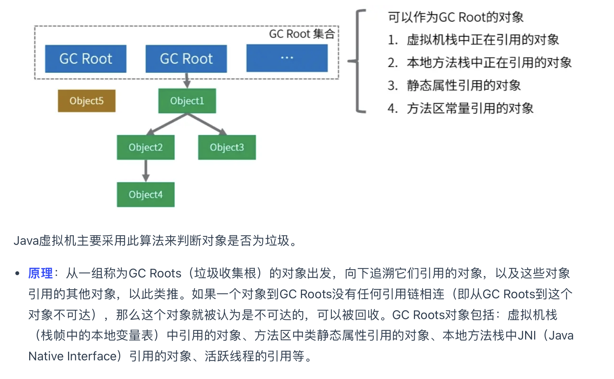

https://mp.weixin.qq.com/s?__biz=MzIwMzY1OTU1NQ%3D%3D&chksm=96ceb9c9a1b930dffce0beed72fe831fba81c4600f97f8f557752042fd40d65f7c0bed1fbf6e&idx=3&mid=2247498117&scene=27&sn=67bbaf7d5e43b54a927a9a52ddb02fcc&utm_campaign=geek_search&utm_content=geek_search&utm_medium=geek_search&utm_source=geek_search&utm_term=geek_search#wechat_redirect


元空间：类加载器、类元信息、常量的引用、字符串常量池

堆：所有静态、实例对象的值存储在这里

native：

直接内存：


字符串常量池：一个存在堆中的hash表（之前是在本地内存，因为 jvm 清理不容易转移到堆），key：字符串，val：String对象，String a = "a",String b = "a"持有相同的引用


Java 的类加载机制是 Java 虚拟机（JVM）在运行时将类的字节码加载到内存中，并对其进行解析和初始化的过程。类加载机制使得 Java 能够在运行时动态地加载类，支持反射等动态特性。下面是对 Java 类加载机制的详细描述：

### 1. **类加载的基本过程**

类加载过程分为以下几个主要阶段：

1. **加载（Loading）**：
   - 在这个阶段，**JVM 根据类的全限定名（如 `com.example.MyClass`）查找对应的字节码文件（通常是 `.class` 文件），并将其加载到内存中。**
   - 加载的结果是一个 `java.lang.Class` 对象，表示在 JVM 中已经存在这个类的表示。

2. **链接（Linking）**：
   链接阶段进一步将类的字节码转换为 JVM 可以直接执行的格式。链接阶段分为三个子阶段：
   
   - **验证（Verification）**：
     - JVM 会验证字节码的正确性，确保它符合 JVM 规范，保证不会出现非法的字节码或危害 JVM 的安全性。这包括验证类文件的结构、符号引用的合法性等。
   
   - **准备（Preparation）**：
     - 在这个阶段，**JVM 会为类的静态变量分配内存，并初始化为默认值**。例如，`int` 类型的变量会被初始化为 `0`，`boolean` 类型的变量会被初始化为 `false`，引用类型的变量会被初始化为 `null`。
   
   - **解析（Resolution）**：
     - 将常量池中的符号引用（如方法、字段等）替换为直接引用。符号引用是以字符串形式描述的方法名、字段名和类名，而直接引用是具体的内存地址或偏移量。

3. **初始化（Initialization）**：
   - 初始化是类加载的最后阶段，也是执行类构造器 `<clinit>` 方法的阶段。**这个方法由编译器自动收集类中的所有静态代码块和静态变量的赋值操作合并而来，按源文件中的顺序执行。**
   - 例如，静态变量的初始化和静态代码块中的代码会在这个阶段被执行。

### 2. **类加载器（ClassLoader）**

Java 的类加载器负责加载类文件。Java 中的类加载器采用了双亲委派机制。每个类加载器在加载一个类时，都会先委托父类加载器尝试加载，如果父类加载器无法加载，再尝试自己加载。这样可以保证类加载的安全性和一致性。

- **Bootstrap ClassLoader**：
  - **根类加载器，由 JVM 自身实现，负责加载核心类库（如 `java.lang.*`、`java.util.*` 等），它不是 Java 中的 `ClassLoader` 子类，而是由本地代码实现的**。

- **Extension ClassLoader**：
  - **扩展类加载器，加载 `JAVA_HOME/lib/ext` 目录下的类库或由 `java.ext.dirs` 系统属性指定的类库。**

- **Application ClassLoader**：
  - **应用程序类加载器，加载应用程序类路径（CLASSPATH）下的类库，是大多数 Java 程序默认的类加载器。**

- **自定义 ClassLoader**：
  - 开发者可以通过继承 `ClassLoader` 类，创建自定义类加载器，以实现特殊的类加载逻辑，如加载加密的类文件或从网络上动态加载类。

### 3. **双亲委派机制**

双亲委派机制是指类加载器在加载类时，先委托其父加载器去尝试加载，只有当父加载器无法加载该类时，子加载器才会自己尝试加载。这样做的好处是：

- **安全性**：防止核心类库被篡改。比如，如果用户定义了一个名为 `java.lang.String` 的类，双亲委派机制可以确保最终加载的是核心类库中的 `String` 类，而不是用户自己定义的类。
- **避免重复加载**：类一旦被加载，便不会重复加载，这也保证了类加载的效率。

### 4. **类的主动引用与被动引用**

类加载可以是主动的，也可以是被动的：

- **主动引用**：会触发类的初始化。包括创建类的实例、访问类的静态变量、调用类的静态方法等。
  - 例如：`MyClass obj = new MyClass();`
  
- **被动引用**：不会触发类的初始化。
  - 例如：访问一个静态常量（`final` 修饰的静态变量）或通过子类引用父类的静态字段时，只有父类会被初始化，而子类不会。

### 5. **类的卸载**

当一个类被 JVM 加载到内存中后，它的生命周期通常会持续到 JVM 关闭。但是，在一些特殊情况下，类可以被卸载（unload）。类的卸载一般通过以下条件来实现：

- **类由自定义的 `ClassLoader` 加载**。
- **该 `ClassLoader` 被垃圾回收**。
- **该类的所有实例都被垃圾回收**。

类卸载通常发生在应用服务器或 JVM 中的某些特殊场景下，比如在热部署应用时。

### 6. **类加载器的作用域**

每个类加载器加载的类，都会放在自己的命名空间中，即便两个类加载器加载了相同的类文件，也会被视为两个不同的类。这就是类加载器在隔离性和安全性方面的重要作用。

### 总结

Java 的类加载机制包括加载、链接和初始化三个主要阶段。类加载由类加载器负责，并通过双亲委派机制确保类加载的安全性和一致性。Java 的类加载机制支持动态加载和链接，这使得 Java 在运行时具备了很强的灵活性和可扩展性。此外，理解类加载机制对掌握 Java 的内存管理、性能调优和动态代理等高级特性至关重要。

在 Java 中，类加载器（ClassLoader）具有自己的命名空间，这意味着由不同类加载器加载的类即使它们来自相同的类文件，也会被视为完全不同的类。这一特性是类加载器在 Java 生态系统中实现隔离性和安全性的关键机制之一。让我们通过几个要点和一个例子来详细解释。

内存泄漏是指程序在运行过程中分配了内存但没有及时释放，从而导致可用内存逐渐减少，最终可能导致内存耗尽，触发 `OutOfMemoryError` 或导致应用程序性能严重下降。即使在像 Java 这样的自动垃圾回收语言中，内存泄漏问题仍然可能发生，通常是由于某些对象被意外地持有，导致它们无法被垃圾回收器回收。下面我将详细讨论常见的内存泄漏源，以及如何通过优化代码来解决这些问题。


## 频繁发生垃圾回收（GC）

当程序频繁发生垃圾回收（GC）时，可能会导致性能下降，特别是当 Full GC 频繁发生时，它会暂停所有应用线程，导致响应时间变长，甚至可能导致系统变得不稳定。以下是一个典型的案例，以及如何分析和优化频繁 GC 的问题。

### **案例背景**

假设你在开发和运维一个大型的电商平台，该平台需要处理大量的用户请求，并且有复杂的业务逻辑和大量的数据处理。你在监控中发现应用程序的垃圾回收频率非常高，Full GC 频繁触发，导致系统响应变慢，偶尔还会出现 `OutOfMemoryError`。

### **1. 现象分析**

通过使用 JVM 的监控工具（如 `jstat`、`jvisualvm`、`GC logs`、`Java Mission Control`）你发现以下情况：
- **年轻代 GC（Young GC）频繁**：年轻代的 GC 频率很高，每几秒钟就会触发一次。
- **老年代 GC（Full GC）频繁**：老年代的 GC 也较为频繁，每分钟触发几次。
- **堆内存接近上限**：堆内存的使用率经常接近上限，导致 Full GC 被频繁触发。
- **响应时间变长**：应用的响应时间随着 GC 的频率增加而显著变长。

### **2. 导致频繁 GC 的可能原因**

### 三大原因：

### 年轻代【1.创造大量短生命周期对象，解决方法：（1）调大年轻代比例（2）池化（3）stringBuilder】

### 老年代【2.内存泄漏 （1）三大源 3.堆空间不足】 

1. **对象创建频繁**：应用程序可能在短时间内创建了大量短生命周期的对象，导致年轻代空间很快被填满，频繁触发 Young GC。

2. **内存泄漏**：某些对象无法被正确地垃圾回收，导致它们一直滞留在老年代，使得老年代空间被逐渐占满，触发 Full GC。

3. **堆空间不足**：JVM 的堆空间配置不足以容纳应用程序所需的内存，导致 GC 频繁发生。

4. **老年代晋升过快**：对象在年轻代存活后，过早地晋升到老年代，而老年代空间不足，导致频繁的 Full GC。

5. **不合理的 GC 策略**：选择的 GC 策略可能不适合当前应用的内存分配和使用模式。

### **3. 优化步骤**

#### **Step 1: 分析 GC 日志**

首先，开启 GC 日志记录（使用 `-XX:+PrintGCDetails -XX:+PrintGCDateStamps -Xloggc:/path/to/gc.log`），并通过分析 GC 日志确定具体的 GC 频率、每次 GC 发生的时间、以及每次 GC 的耗时。

#### **Step 2: 调整堆内存大小**

根据应用的内存使用情况，适当调整堆的大小：

- **增大堆内存**：如果应用的内存需求很大，可以通过调整 `-Xmx`（最大堆内存）和 `-Xms`（初始堆内存）的值来增大堆内存，减缓 GC 频率。例如：
  ```bash
  -Xms4g -Xmx8g
  ```
  这种配置允许 JVM 在启动时分配 4GB 的堆内存，最大可扩展到 8GB。

- **调整年轻代和老年代的比例**：根据内存分配的具体情况，调整年轻代与老年代的内存比例。例如，如果发现对象的生命周期较短，可以适当增加年轻代的内存比例，减少 Young GC 频率：
  ```bash
  -XX:NewRatio=2
  ```
  这表示年轻代占整个堆的 1/3，老年代占 2/3。

#### **Step 3: 检查并解决内存泄漏**

内存泄漏是导致老年代空间被占满的常见原因。使用内存分析工具（如 `VisualVM`、`JProfiler`、`Eclipse MAT`）分析堆内存快照，查找长时间未被回收的对象及其引用链。

- **检查常见泄漏源**：常见的内存泄漏源包括：
  - 缓存未正确清理。
  - 静态集合（如 `HashMap`、`List`）不断增长。
  - 监听器或回调未正确移除。

- **解决内存泄漏**：根据分析结果，修复导致内存泄漏的代码。例如：
  - 使用弱引用（`WeakReference`）来引用缓存对象，防止内存泄漏。
  - 及时移除不再需要的监听器或回调。

#### **Step 4: 优化对象创建和回收**

- **对象池化**：对于创建和销毁频繁的对象（如数据库连接、线程、缓冲区），考虑使用对象池（如 `ThreadPoolExecutor`、`DBCP` 等）来复用对象，减少内存的分配和回收频率。

- **减少短生命周期对象**：分析代码中是否有过多的短生命周期对象被创建。可以通过优化算法和逻辑，减少这些对象的创建。例如，使用 `StringBuilder` 替代字符串的直接拼接，减少中间对象的创建。

#### **Step 5: 选择合适的垃圾回收器**

根据应用的特点选择合适的垃圾回收器：

- **对于低延迟的应用**，如响应时间至关重要的在线交易系统，可以选择 **G1 垃圾回收器**：
  ```bash
  -XX:+UseG1GC
  ```
  G1 GC 适用于具有大量内存的应用程序，并且可以通过参数 `-XX:MaxGCPauseMillis` 设置最大暂停时间。

- **对于吞吐量优先的应用**，如批处理系统，可以选择 **并行 GC（Parallel GC）**：
  ```bash
  -XX:+UseParallelGC
  ```

- **对于高并发应用**，可以选择 **ZGC** 或 **Shenandoah GC**，这些回收器的目标是尽可能减少 GC 暂停时间。

#### **Step 6: 监控和验证**

最后，部署优化后的配置到测试环境或生产环境中，继续监控 GC 日志、响应时间、内存使用情况，确保优化措施有效。

- **观察 GC 日志**：检查 GC 日志中的 Full GC 发生频率是否明显降低，Young GC 是否在可接受的范围内。
- **性能测试**：通过性能测试工具（如 JMeter）模拟真实负载，验证应用的性能是否提高。

### **总结**

优化频繁 GC 的关键在于识别和理解引发频繁 GC 的原因，并通过调整 JVM 配置、优化代码、选择合适的垃圾回收器来减少 GC 的频率和停顿时间。在实际开发中，需要根据应用的具体场景和需求，采用合适的策略来优化内存管理，从而提升应用的性能和稳定性。


### **常见的内存泄漏源**【三大，1.缓存，2.静态集合，3.监听器】方法：1.手动清理，2.使用虚引用，weakhashmap

#### **1. 缓存未正确清理**

**问题描述**：
在应用程序中，缓存是一种常见的技术，用于存储频繁访问的数据，以提高访问速度并减少对外部资源（如数据库）的请求。然而，如果缓存对象没有正确地清理，即使这些对象不再被使用，它们也会一直占用内存，导致内存泄漏。

**常见场景**：
- 应用程序使用 `HashMap`、`ConcurrentHashMap` 等集合类来缓存数据，但是未能在数据过期或不再使用时清除它们。
- 缓存数据的生命周期没有正确管理，导致无用的数据长期占用内存。

**解决方法**：
- **使用弱引用（WeakReference）或软引用（SoftReference）**：
  - **弱引用**：当缓存对象仅通过 `WeakReference` 被引用时，垃圾回收器会在下次 GC 时回收这些对象，无论内存是否紧张。这种方式适合用于那些在缓存中不强制需要持有的对象。
  - **软引用**：软引用对象在内存紧张时会被回收，但如果内存充足则不会被回收，适合用于内存敏感的缓存实现。
  - 示例代码：
    ```java
    Map<String, WeakReference<Data>> cache = new HashMap<>();
    
    public Data getData(String key) {
        WeakReference<Data> ref = cache.get(key);
        Data data = ref != null ? ref.get() : null;
        if (data == null) {
            data = fetchDataFromSource(key); // 从源获取数据
            cache.put(key, new WeakReference<>(data));
        }
        return data;
    }
    ```

- **使用缓存库（如 Google Guava Cache）**：
  - 这种库通常会提供自动清理功能，可以设置缓存对象的过期时间和最大容量，防止缓存无控制增长。

#### **2. 静态集合（如 `HashMap`、`List`）不断增长**

**问题描述**：
静态集合是指那些被 `static` 修饰符修饰的集合对象，这些集合的生命周期与 JVM 相同，除非应用程序重启，否则它们将一直存在。如果静态集合中的对象没有及时清理，或者对象不断被添加到集合中但未移除，会导致内存泄漏。

**常见场景**：
- 静态集合类的使用场景包括全局缓存、注册表、单例模式中的集合等。如果这些集合不断增长且从不移除过期或不再使用的对象，则会发生内存泄漏。

**解决方法**：
- **手动清理无用对象**：在适当的时机（如对象生命周期结束时）手动清理集合中不再需要的对象。
- **使用`WeakHashMap` 处理映射关系**：`WeakHashMap` 允许键被垃圾回收器自动回收，从而避免静态集合导致的内存泄漏。
  - 示例代码：
    ```java
    private static Map<Key, Value> cache = new WeakHashMap<>();
    
    public static void putCache(Key key, Value value) {
        cache.put(key, value);
    }
    ```

- **避免使用不必要的静态变量**：重新评估代码，确保仅在真正需要全局状态时使用静态集合，尽量减少其使用范围。

#### **3. 监听器或回调未正确移除**

**问题描述**：
监听器模式和回调机制常用于事件驱动系统，如 GUI 程序、观察者模式实现等。监听器或回调通常通过注册来订阅事件，但如果这些监听器或回调没有在不需要时取消注册，就会一直保持对对象的引用，导致内存泄漏。

**常见场景**：
- 在 Swing 或 JavaFX 中，组件被添加了大量的事件监听器，如果这些监听器没有在组件销毁时移除，组件即使不再显示也无法被垃圾回收。
- 在观察者模式中，观察者（监听器）没有从被观察者（事件源）中移除，当不再需要监听事件时，导致观察者对象无法被回收。

**解决方法**：
- **手动移除监听器或回调**：在合适的时机（如对象销毁时）手动移除监听器或回调，确保不再持有对对象的引用。
  - 示例代码：
    ```java
    someComponent.addActionListener(listener);
    ...
    someComponent.removeActionListener(listener); // 在对象销毁时移除监听器
    ```

- **使用弱引用来引用监听器**：通过使用 `WeakReference` 来保存监听器，确保在监听器对象没有其他强引用时，它们可以被垃圾回收器回收。
  - 示例代码：
    ```java
    public class Observable {
        private final List<WeakReference<Listener>> listeners = new ArrayList<>();
    
        public void addListener(Listener listener) {
            listeners.add(new WeakReference<>(listener));
        }
    
        public void notifyListeners() {
            for (Iterator<WeakReference<Listener>> it = listeners.iterator(); it.hasNext(); ) {
                Listener listener = it.next().get();
                if (listener == null) {
                    it.remove(); // 自动移除已经被回收的监听器
                } else {
                    listener.onEvent();
                }
            }
        }
    }
    ```

- **使用生命周期管理工具**：在现代框架中（如 Spring、Android），使用生命周期管理工具或机制，确保对象在其生命周期结束时自动解除所有回调或监听器的注册。

### **总结**

内存泄漏是 Java 应用程序中的常见问题，尽管有垃圾回收机制，开发者仍需要关注可能导致内存泄漏的情况，并采取适当的措施防止它们发生。常见的内存泄漏源包括缓存未正确清理、静态集合不断增长、监听器或回调未正确移除等。通过使用弱引用、手动移除不再需要的引用、优化代码结构和使用专门的库和工具，可以有效地防止和解决内存泄漏问题，从而提升应用程序的稳定性和性能。


### 1. **类加载器的命名空间**

**【每个类加载器在加载类时，会在其内部维护一张表，这张表记录了所有它加载的类。这些类在 JVM 中属于这个类加载器的命名空间。】**

- ````
  - 如果两个类加载器分别加载了相同路径下的相同 `.class` 文件，那么这两个类虽然来自同一个类文件，但是由于它们是由不同的类加载器加载的，因此在 JVM 中它们是两个完全不同的类。
  - 换句话说，即便这两个类具有相同的全限定名（即包名加类名，如 `com.example.MyClass`），JVM 仍然会将它们视为不同的类。
  
  ### 2. **类加载器的隔离性**
  
  这种机制的直接结果是**隔离性**。不同的类加载器可以加载具有相同名字的类而互不干扰。这种隔离性使得类加载器可以在一个 JVM 中同时加载不同版本的类，或者在 Web 服务器上同时运行多个相互隔离的应用程序。
  
  - 例如，在一个应用服务器中，不同的应用可能使用不同版本的同一个库。通过使用不同的类加载器加载这些应用程序，就可以在不互相干扰的情况下使用不同版本的类。
  
  ### 3. **类加载器的安全性**
  
  类加载器的命名空间机制也提高了安全性。因为类加载器能够隔离不同的类和资源，使得它们之间不能轻易访问，这防止了恶意代码或有缺陷的代码影响其他类或应用的正常运行。
  
  ### 4. **类加载器中的类冲突**
  
  由于不同类加载器加载的类被视为不同的类，即便它们的类名完全相同，也可能导致类冲突问题。这种类冲突的典型表现是 `ClassCastException`，即尝试将一个类加载器加载的类对象转换为另一个类加载器加载的同名类对象时，JVM 会抛出异常，因为它们是完全不同的类型。
  
  ### 5. **例子说明**
  
  假设有一个类 `com.example.MyClass`，它被两个不同的类加载器加载了两次：
  
  ```java
  ClassLoader classLoader1 = new MyClassLoader();
  ClassLoader classLoader2 = new MyClassLoader();
  
  Class<?> class1 = classLoader1.loadClass("com.example.MyClass");
  Class<?> class2 = classLoader2.loadClass("com.example.MyClass");
  
  // 检查两个类是否相同
  System.out.println(class1 == class2);  // 输出: false
  
  // 尝试进行类型转换
  MyClass obj1 = (MyClass) class1.newInstance();
  MyClass obj2 = (MyClass) class2.newInstance();
  
  // 这行代码会抛出 ClassCastException，因为 class1 和 class2 是不同的类
  MyClass obj3 = (MyClass) obj2;
  ```
  
  在这个例子中，`classLoader1` 和 `classLoader2` 加载了同一个类文件 `com.example.MyClass`，但是由于它们是由不同的类加载器加载的，所以在 JVM 中被视为两个不同的类。因此，`class1` 和 `class2` 是不同的类对象，即使它们的类名和字节码完全相同。由于它们属于不同的类加载器命名空间，所以不能互相转换或互相调用方法。
  
  ### 总结
  
  **类加载器的作用域**指的是，每个类加载器加载的类都在其自身的命名空间内，即便两个类加载器加载了相同的类文件，这些类在 JVM 中也会被视为完全不同的类。这种机制为 Java 提供了强大的隔离性和安全性，使得在同一 JVM 中运行多个相互隔离的应用成为可能，避免了类之间的冲突和干扰。这也是为什么类加载器在 Java 的插件机制、应用服务器、OSGi 等框架中扮演重要角色的原因。
  
  
  ````

  


### 弱引用（Weak Reference）使用场景

#### 1. **`WeakHashMap` 用于缓存设计**

`WeakHashMap` 是 `java.util` 包中的一个特殊的 `Map` 实现，它使用弱引用作为键。如果某个键不再有任何强引用存在，那么在下一次垃圾回收时，这个键值对就会被自动移除。这种机制特别适合用于缓存设计。

- ````
  ##### 示例场景：对象缓存**
  
  假设你有一个应用程序需要缓存一些对象，以提高访问速度，但你又不希望这些缓存对象无限期地占用内存。当某个键不再有强引用时，你希望它所对应的值可以被自动回收。`WeakHashMap` 可以很好地满足这个需求。
  
  ```java
  import java.util.Map;
  import java.util.WeakHashMap;
  
  public class WeakHashMapExample {
      public static void main(String[] args) {
          Map<String, String> cache = new WeakHashMap<>();
          
          String key1 = new String("key1");
          String key2 = new String("key2");
          
          cache.put(key1, "value1");
          cache.put(key2, "value2");
          
          System.out.println("Before GC: " + cache);
          
          key1 = null; // 取消 key1 的强引用
          
          System.gc(); // 强制进行垃圾回收
          
          // 因为 key1 没有强引用，所以它将被从缓存中移除
          System.out.println("After GC: " + cache);
      }
  }
  ```
  
  **输出：**
  
  ```
  Before GC: {key1=value1, key2=value2}
  After GC: {key2=value2}
  ```
  
  在这个例子中，当 `key1` 被设置为 `null` 并且垃圾回收运行后，`WeakHashMap` 会自动移除不再有强引用的键值对。
  
  ##### **适用场景**：
  
  - **缓存设计**：适用于希望缓存中的对象在不再被引用时可以自动回收的场景。典型例子是用于缓存大对象，如图片、数据集等，避免长时间占用内存。
  - **元数据存储**：用于存储对象的元数据，当对象被垃圾回收时，相关元数据也可以自动清理。
  ````

  

#### 2. **防止内存泄漏**

- ````
  在某些情况下，如果你为某些对象注册了事件监听器或回调，并且这些监听器或回调没有被显式移除，它们可能会阻止对象被垃圾回收，从而导致内存泄漏。使用弱引用可以防止这种情况。
  
  ##### **示例场景：事件监听器**
  
  ```java
  import java.lang.ref.WeakReference;
  import java.util.ArrayList;
  import java.util.List;
  
  class EventListener {
      // EventListener的实现
  }
  
  class EventSource {
      private final List<WeakReference<EventListener>> listeners = new ArrayList<>();
      
      public void addListener(EventListener listener) {
          listeners.add(new WeakReference<>(listener));
      }
      
      public void notifyListeners() {
          for (WeakReference<EventListener> ref : listeners) {
              EventListener listener = ref.get();
              if (listener != null) {
                  // 通知监听器
              } else {
                  // 监听器已被垃圾回收，可以从列表中移除
              }
          }
      }
  }
  
  public class WeakReferenceExample {
      public static void main(String[] args) {
          EventSource source = new EventSource();
          EventListener listener = new EventListener();
          
          source.addListener(listener);
          
          // 假设我们在某个时刻不再需要这个监听器
          listener = null; // 取消对监听器的强引用
          
          System.gc(); // 触发垃圾回收
          
          source.notifyListeners(); // 通知监听器，已回收的监听器不会被通知
      }
  }
  ```
  
  在这个例子中，当 `listener` 不再有强引用时，它可以被垃圾回收。`EventSource` 使用弱引用保存监听器，避免了潜在的内存泄漏问题。
  
  ##### **适用场景**：
  
  - **事件监听器**：当你希望监听器或回调在不再被使用时可以被自动回收，避免内存泄漏时使用。
  - **缓存中弱键的使用**：用于在缓存中管理一些生命周期较短的对象，当对象不再被引用时，自动从缓存中清除。
  ````

  

### 虚引用（Phantom Reference）使用场景

#### 1. **清理大型资源**

虚引用在 Java 中通常与 `ReferenceQueue` 一起使用，用于在对象被垃圾回收之前执行清理工作，特别是当需要清理一些非 Java 堆上的资源时，如文件句柄、网络连接、大型内存块等。

````
##### 示例场景：管理直接内存**

`DirectByteBuffer` 是一个使用直接内存的类，它不受 JVM 垃圾回收器的直接管理。当 `DirectByteBuffer` 对象被垃圾回收时，需要显式释放它占用的直接内存。虚引用可以在 `DirectByteBuffer` 对象被回收前，通知程序执行内存释放操作。

```java
import java.lang.ref.PhantomReference;
import java.lang.ref.ReferenceQueue;
import java.nio.ByteBuffer;

public class PhantomReferenceExample {
    private static final ReferenceQueue<ByteBuffer> queue = new ReferenceQueue<>();
    
    public static void main(String[] args) {
        ByteBuffer buffer = ByteBuffer.allocateDirect(1024);
        PhantomReference<ByteBuffer> phantomRef = new PhantomReference<>(buffer, queue);
        
        buffer = null; // 取消强引用
        
        System.gc(); // 触发垃圾回收
        
        // 在这里可以处理缓冲区的清理
        if (queue.poll() != null) {
            System.out.println("Buffer is ready to be cleaned up.");
            // 清理操作，比如释放直接内存
        }
    }
}
```

在这个例子中，当 `buffer` 被垃圾回收时，`phantomRef` 会被加入到 `ReferenceQueue` 中，表示 `buffer` 已准备好被清理。程序可以在检测到该事件后执行内存清理操作。

##### **适用场景**：

- **直接内存管理**：用于管理 `DirectByteBuffer` 等直接内存对象，确保内存被及时释放，防止内存泄漏。
- **大型资源的清理**：例如关闭文件、网络连接、数据库连接等。

#### 2. **监控对象的回收**

虚引用可以用于监控对象的回收情况，在对象被回收之前，可以通过虚引用接收通知。这在一些需要记录对象销毁时间或者需要在对象销毁前做额外操作的场景下非常有用。

##### **示例场景：日志记录**

假设你需要监控某些对象的回收，并在它们被回收前记录日志。

```java
import java.lang.ref.PhantomReference;
import java.lang.ref.ReferenceQueue;

class MyObject {
    @Override
    protected void finalize() throws Throwable {
        super.finalize();
        System.out.println("MyObject is being finalized.");
    }
}

public class PhantomReferenceLoggingExample {
    public static void main(String[] args) {
        ReferenceQueue<MyObject> queue = new ReferenceQueue<>();
        MyObject obj = new MyObject();
        PhantomReference<MyObject> phantomRef = new PhantomReference<>(obj, queue);
        
        obj = null; // 取消强引用
        
        System.gc(); // 触发垃圾回收
        
        // 监控对象回收
        if (queue.poll() != null) {
            System.out.println("MyObject is ready to be garbage collected.");
            // 可以执行日志记录或其他操作
        }
    }
}
```

在这个例子中，虚引用允许你在对象被实际销毁前执行一些日志记录或其他操作。

##### **适用场景**：

- **对象销毁前的操作**：在对象被回收前，执行日志记录、资源回收、性能监控等操作。
- **特殊资源管理**：处理需要在对象回收前做出响应的场景，如数据库连接的关闭、对象池中对象的销毁等。

### 总结

- **弱引用**：用于实现内存敏感的缓存和防止内存泄漏，典型应用包括 `WeakHashMap`、事件监听器等场景。
- **虚引用**：主要用于在对象回收前做出特殊处理，适用于需要对对象的销毁进行监控或执行清理操作的场景，如直接内存管理、日志记录等。

通过合理使用弱引用和虚引用，可以实现更加高效的内存管理，避免内存泄漏，同时确保在对象生命周期结束前完成必要的清理工作。


````


### 2. 元空间（Metaspace）[类加载器、类元信息]

为了解决永久代的上述问题，JDK 8 中引入了元空间（Metaspace），替代了永久代。元空间与永久代的主要区别在于其存储位置和内存管理方式。

#### **元空间的特性**：

- **使用本地内存**：**元空间不再使用堆内存，而是使用本地内存（native memory）**，也就是说，元空间的大小不再受堆内存的限制。元空间的大小可以根据实际需求动态扩展，直到可用的系统内存耗尽。
- **动态扩展**：与永久代不同，元空间的大小可以根据需要动态调整，默认情况下元空间大小是无限的（受限于系统可用的物理内存）。可以通过 `-XX:MetaspaceSize` 和 `-XX:MaxMetaspaceSize` 参数来设置元空间的初始大小和最大大小。
- **垃圾回收改进**：**元空间的垃圾回收主要发生在类加载器被卸载时。当类加载器被卸载时，JVM 会清理与该类加载器相关的类元数据，释放相应的元空间内存。这种方式避免了永久代中常见的内存碎片问题，并减少了不必要的垃圾回收停顿**。

### 5. **元空间的垃圾回收**

元空间的垃圾回收机制与永久代有所不同，它主要依赖于类加载器的生命周期。当一个类加载器被卸载时，与其相关的类元数据和其他资源都会被回收。

- **类加载器卸载**：当一个类加载器不再被引用时，**JVM 会将其卸载，同时清除该加载器加载的所有类元数据。这一过程释放了元空间中的内存，从而避免了内存泄漏。**

当类加载器被卸载时，**由该类加载器加载的类也会被卸载，因此这些类将不再存活。让我们详细解释这个过程**。

- ```
  ### 1. **类与类加载器的关系**
  
  在 Java 中，每个类都是由一个特定的类加载器加载的，类加载器不仅负责加载类的字节码，还负责管理类的生命周期。一个类的生命周期与它的类加载器密切相关：
  
  - **类的加载**：类加载器将类的字节码加载到 JVM 中，**并创建一个 `Class` 对象来表示该类。这个 `Class` 对象由加载它的类加载器持有引用。**
  - **类的生命周期**：只要类加载器存在，类和它的 `Class` 对象也会继续存在。在应用程序中使用该类的实例、调用其静态方法或访问其静态变量时，JVM 都会依赖于 `Class` 对象来管理这些操作。
  
  ### 2. **类加载器的卸载**
  
  类加载器的卸载发生在 JVM 判断一个类加载器不再被引用（没有任何强引用）且它加载的所有类也不再被引用时。通常情况下，这个过程发生在以下场景中：
  
  - **动态模块或插件**：某些 Java 应用程序允许动态加载和卸载模块或插件。在这些场景中，模块或插件中的类通常由自定义类加载器加载。当模块或插件被卸载时，JVM 会尝试卸载与之关联的类加载器。
  
  - **Web 容器中的应用重部署**：在像 Tomcat 这样的 Web 容器中，每个 Web 应用都有自己的类加载器。当 Web 应用被重部署或卸载时，Web 应用的类加载器和它加载的所有类都会被卸载。
  
  ### 3. **类加载器卸载的条件**
  
  类加载器的卸载需要满足以下条件：
  
  1. **类加载器没有强引用**：**类加载器本身必须不再有强引用。也就是说，程序中没有任何代码或对象直接或间接持有对类加载器的引用**。
  
  2. **类没有强引用**：由这个类加载器加载的所有类必须不再有强引用。这意味着程序中没有任何代码或对象持有对这些类的 `Class` 对象、类实例、静态变量、方法或字段的引用。
  
  ### 4. **类加载器卸载的影响**
  
  当类加载器被卸载时：
  
  - **类的 `Class` 对象被回收**：JVM 会将**类加载器加载的所有类的 `Class` 对象从内存中移除，这些类的字节码和元数据也会被清理。**
  - **类实例和静态数据被回收**：与这些类相关的所有实例、静态变量和静态方法也会被回收，前提是它们没有被其他类加载器加载的对象或系统引用。
  
  因此，一旦类加载器被卸载，由它加载的类将不再存活，任何与这些类相关的对象或数据都会被垃圾回收。
  
  ### 5. **特殊情况与注意事项**
  
  - **引用关系**：如果某个类加载器 A 加载的类 B 引用了另一个类加载器 C 加载的类 D，而类加载器 C 被卸载了，类 D 也会被卸载，但这不会影响类加载器 A 和类 B 的存活。
  
  - **防止内存泄漏**：为了确保类加载器能够被正确卸载，开发者必须避免持有对类加载器或其加载类的强引用。例如，Web 容器中，常见的内存泄漏问题可能是由于应用中的静态变量或单例模式持有对类加载器的引用，从而阻止类加载器的卸载。
  
  ### 6. **总结**
  
  - **类的生命周期与类加载器绑定**：类的生命周期与其类加载器的生命周期紧密相连。只要类加载器存在，类及其相关的 `Class` 对象、实例和静态数据都会继续存活。
  
  - **类加载器的卸载意味着类的卸载**：一旦类加载器被 JVM 卸载，它所加载的所有类也会被卸载，这些类的 `Class` 对象和与之相关的实例、静态数据等都会被回收。
  
  - **避免内存泄漏**：正确管理类加载器和类的引用关系，确保在不再需要时，类加载器及其加载的类可以被 JVM 正确卸载，从而避免内存泄漏问题。
  
  ```


## 元空间out of memory【类加载、热部署】

````
元空间（Metaspace）是 JVM 用于存储类的元数据的区域，它从操作系统的本地内存（直接内存）中分配内存。元空间的大小理论上可以无限制增长，受限于系统的可用内存。然而，在某些情况下，元空间的使用可能会达到很大的容量。以下是一些可能导致元空间达到大容量的情况：

### 1. **大量的类加载**

- **动态生成类**：某些框架（如 Hibernate、Spring、Javassist）会在运行时动态生成大量的类。每个生成的类都会占用元空间。例如，ORM 框架可能为每个实体类生成代理类（proxy class）或字节码增强类，这些类需要被加载到元空间中。

- **应用程序本身加载大量类**：如果应用程序本身包含大量的类，或者使用了大量的第三方库，那么这些类在被加载时也会占用元空间。大型企业应用通常会加载成千上万的类，这会导致元空间的使用量显著增加。

### 2. **类的频繁加载和卸载**

- **频繁的类加载/卸载**：在某些环境中，特别是使用自定义类加载器的场景，类可能会频繁地加载和卸载。例如，在一些应用服务器中，每次部署应用程序时，都会创建一个新的类加载器来加载所有的类，而旧的类加载器和类可能会被卸载。这种频繁的加载和卸载会导致元空间使用的波动，并可能在高峰期达到很大的容量。

```
在实际后台开发中，频繁的类加载和卸载现象常见于以下场景：**应用服务器的热部署**、**插件系统**、**多租户系统** 和 **动态生成类的框架**。下面我将详细讲解一个 **Web 应用服务器热部署** 的例子，说明频繁类加载/卸载是如何影响元空间的。

### **场景：Web 应用服务器的热部署**

**背景**：
你正在开发一个大型的企业级 Web 应用程序，该应用程序部署在 Tomcat、Jetty 或类似的 Java Web 应用服务器上。为了方便开发和测试，你启用了 Web 应用的热部署功能。热部署允许你在不重启服务器的情况下，重新部署应用程序，并且服务器会自动加载新的类。

**实际操作**：
每次你对代码进行修改并重新部署应用时，应用服务器会执行以下步骤：
1. **卸载旧应用**：
   - 服务器首先卸载旧版本的应用程序，这涉及到卸载旧应用程序的类加载器。
   - 当类加载器被卸载时，JVM 会尝试回收与之相关的所有类元数据，这些元数据存储在元空间中。

2. **创建新类加载器并加载新类**：
   - 服务器为新的应用程序版本创建一个新的类加载器。
   - 新的类加载器会加载所有与应用程序相关的类（包括用户代码、第三方库、JSP 页面编译生成的类等）。
   - 这些类加载后，其元数据会被存储到元空间中。

**元空间的影响**：
- 每次热部署都会加载大量的类，并释放旧版本类加载器的元数据。由于热部署频繁发生，这种类加载和卸载的频繁操作会导致元空间的使用量不断波动。
- 如果应用程序加载的类很多（例如数千个类），或者热部署发生的频率很高，元空间的使用量可能会在短时间内急剧增加。

**问题**：
- **元空间容量增加**：如果元空间的最大容量设置得过小，或者热部署过于频繁，JVM 可能会面临元空间耗尽的问题，导致 `OutOfMemoryError: Metaspace` 错误。
- **垃圾回收开销**：频繁的类加载和卸载会触发 JVM 对元空间的垃圾回收，增加 Full GC 的频率，导致服务器性能下降。

### **实际案例：企业级 Web 应用的热部署**

**案例描述**：
假设你正在开发一个在线购物平台，该平台部署在 Tomcat 服务器上。这个平台由多个模块组成，如用户管理、商品管理、订单管理等。每个模块都包含大量的 Java 类和 JSP 页面。

**开发中的热部署操作**：
1. 你修改了商品管理模块的几个类，并希望立即看到效果。你通过 IDE 或者命令行工具触发了热部署操作。
2. Tomcat 会首先卸载旧的商品管理模块，包括卸载相关的类加载器和类。
3. 然后，Tomcat 会创建一个新的类加载器，并加载你修改后的商品管理模块及其依赖的所有类。

**元空间使用情况**：
- **第一次热部署**：元空间占用量增加，因为新加载了商品管理模块的类。
- **第二次热部署**：再次增加元空间占用量，而旧的类加载器和类元数据被释放后，元空间使用量会稍微降低，但并不一定完全释放，可能会留下一些未被立即回收的元数据。
- **多次热部署**：随着热部署次数增加，元空间的使用量可能不断攀升，尤其是在每次热部署加载的新类很多的情况下。

**应对措施**：
- **调整元空间大小**：通过 JVM 参数 `-XX:MaxMetaspaceSize` 调整元空间的最大大小，确保它能够容纳频繁热部署带来的元空间波动。
  
- **优化类加载策略**：
  - 如果某些模块不频繁变化，可以避免每次都重新加载这些模块的类。
  - 使用共享类加载器，减少重复加载相同类的情况。

- **监控和分析**：
  - 使用 JVM 监控工具（如 `jvisualvm`、`jstat`、`Java Mission Control`）监控元空间的使用情况，识别出可能导致内存泄漏的类加载器或类。
  - 定期分析 Full GC 的日志，看看是否有类加载器没有被正确卸载，导致元空间不能有效回收。

### **进一步优化：插件系统和动态类加载**

在某些高级场景中，比如使用插件系统或动态字节码增强框架，你可能会在运行时动态加载大量插件或代理类。每个插件通常由一个独立的类加载器加载，插件的频繁加载和卸载会加剧元空间的波动。

**优化策略**：
- **插件隔离**：确保插件的类加载器在插件卸载时能够正确释放，避免类加载器泄漏。
- **类加载缓存**：对于某些常用或不常变化的类，可以使用类加载器缓存，避免重复加载。

**实际开发中的注意事项**：
在开发和调试过程中，特别是在大型企业应用中，频繁热部署和动态类加载操作很常见。理解元空间的工作原理并合理调优，可以避免由于元空间耗尽而导致的应用崩溃和性能问题。

### **总结**

频繁的类加载和卸载，尤其是在热部署和动态加载场景中，会导致 JVM 元空间使用的波动，并可能在高峰期达到较大容量。这不仅可能引发 `OutOfMemoryError`，还会增加垃圾回收的负担。在实际后台开发中，合理调整元空间大小、优化类加载器的使用策略，并监控元空间的使用情况，是确保应用程序稳定运行的重要措施。
```


### 3. **内存泄漏（类加载器泄漏）**

- **类加载器泄漏**：**如果类加载器没有正确地被卸载，那么它所加载的所有类元数据将一直保留在元空间中，无法被回收。这会导致元空间的使用量不断增加，最终可能导致 `OutOfMemoryError`。类加载器泄漏通常发生在某些 Web 应用程序中，例如在应用程序的生命周期中，某些类或对象意外地被持有**，导致类加载器无法被垃圾回收器回收。

### 4. **大量的静态变量和常量池**

- **静态变量**：类的静态变量和常量池的内容也是存储在元空间中的。如果一个类定义了大量的静态变量或常量，特别是那些占用较大内存的变量（如大数组、字符串池等），那么这些数据会增加元空间的使用量。

- **大规模使用常量池**：大量字符串常量或其他类型的常量会存储在常量池中，这些常量池的内容也会占用元空间。

### 5. **使用代理类或字节码增强技术**

- **代理类**：很多框架通过使用代理类（如 JDK 动态代理、CGLIB）来实现功能增强或拦截器模式。这些代理类是在运行时动态生成的，并会被加载到元空间中。

- **字节码增强**：类似地，字节码增强技术（如 ASM、Javassist）在运行时修改类的字节码，并生成新的类，这些类也需要被加载到元空间中。

### 6. **使用大量第三方库**

- **第三方依赖**：如果一个应用程序依赖大量的第三方库，特别是那些包含大量类文件的库，元空间的占用量可能会显著增加。每个库可能包含数百甚至数千个类，这些类加载后会增加元空间的使用。

### 7. **JSP 大量编译为类**

- **JSP 文件**：在 Java Web 应用中，JSP 文件会被编译为 Servlet 类并加载到 JVM 中。如果应用程序中有大量 JSP 页面，并且这些页面频繁地被访问和重新编译，那么 JSP 生成的类将会占用大量的元空间。

### **如何监控和调整元空间的大小**

- **监控元空间**：你可以使用 JVM 的监控工具（如 `jstat`、`jvisualvm`、`Java Mission Control`）来监控元空间的使用情况。了解元空间的使用模式有助于发现潜在的内存泄漏和其他问题。

- **调整元空间大小**：通过设置 `-XX:MaxMetaspaceSize` 参数，可以限制元空间的最大大小。如果应用程序确实需要大量的元空间，你可以适当增加这个参数的值。

- **分析内存泄漏**：如果怀疑元空间出现内存泄漏，可以使用工具（如 `MAT`、`JProfiler`）进行内存分析，查找导致类加载器无法被卸载的根本原因。

### **总结**

元空间的容量可能会因为大量类加载、频繁的类加载和卸载、类加载器泄漏、大量静态变量和常量池、使用代理类和字节码增强、以及大量使用第三方库等原因而显著增加。监控和调整元空间的大小是保障 JVM 稳定性和性能的关键措施。通过合理的元空间配置和及时的内存泄漏分析，可以有效防止元空间达到过大的容量，避免潜在的内存问题。


````




### GC Roots 详细介绍

在 Java 中，垃圾回收（GC）的关键是确定哪些对象是"存活"的。GC Roots（垃圾回收根）是 GC 的起点，它们是一些特别的引用，GC 从这些引用出发，遍历整个对象图，标记所有可达的对象为存活对象。未被标记的对象则会被认为是垃圾，可以被回收。

#### 什么是 GC Roots？

GC Roots 是一组特殊的引用，这些引用直接或间接指向堆中的对象。GC Roots 自身是被认为永久存活的，因此，任何可从 GC Roots 到达的对象也是存活的。

#### 常见的 GC Roots 类型【直接引用、static变量、类加载器、jni对象、所有线程对象】

以下是一些常见的 GC Roots 类型：

1. **虚拟机栈（Java 方法栈）中的引用**：
   - 所有栈帧中局部变量表（Local Variables Table）中引用的对象。这些对象通常是方法中的局部变量和参数。

2. **方法区中的静态变量**：
   - 所有类的静态变量引用的对象。这些变量存储在方法区（或元空间，Metaspace）中。

3. **方法区中的常量引用**：
   - 所有方法区中的常量引用的对象。例如，字符串常量池中的引用。

4. **本地方法栈中的引用**：
   - JNI（Java Native Interface）中引用的对象，通常是通过本地代码引用的对象。

5. **活跃线程**：
   - 所有存活的线程对象。

6. **Java 虚拟机内部的引用**：
   - JVM 为了某些内部处理而持有的引用，例如系统类加载器。

````
#### 如何确定存活对象

Java 的垃圾回收器通过从 GC Roots 出发，使用**可达性分析算法**（Reachability Analysis）来确定哪些对象是存活的。可达性分析算法的基本思想是：

1. **起点**：从 GC Roots 开始。
2. **遍历**：遍历所有从 GC Roots 可达的对象，将其标记为存活对象。
3. **终点**：未被遍历到的对象则是不可达的，可以被回收。

可达性分析通常使用深度优先搜索（DFS）或广度优先搜索（BFS）来遍历对象图。

#### 示例代码

以下是一些示例代码，展示了不同类型的 GC Roots 及其引用的对象：

```java
public class GCRootsExample {
    // 静态变量（方法区中的静态变量）
    private static GCRootsExample staticReference;

    // 常量引用（方法区中的常量引用）
    private static final GCRootsExample constantReference = new GCRootsExample();

    public static void main(String[] args) {
        // 局部变量（虚拟机栈中的引用）
        GCRootsExample localReference = new GCRootsExample();

        // 本地方法栈中的引用（通过 JNI 调用）
        GCRootsExample nativeReference = createNativeReference();

        // 使静态变量引用一个对象
        staticReference = new GCRootsExample();

        System.out.println("GC Roots Example");
    }

    // 模拟通过 JNI 创建的引用
    private static GCRootsExample createNativeReference() {
        return new GCRootsExample();
    }
}
```

在上述代码中，`staticReference` 是一个静态变量，`constantReference` 是一个常量引用，`localReference` 是一个局部变量，而 `nativeReference` 是通过 JNI 调用引用的对象。这些引用在垃圾回收过程中都被视为 GC Roots。

#### 可达性分析的步骤

1. **从 GC Roots 出发**：标记 GC Roots 自身为存活对象。
2. **遍历引用图**：从 GC Roots 开始，遍历所有引用的对象，将它们标记为存活对象。
3. **递归标记**：对每一个被标记为存活的对象，递归遍历它们引用的其他对象，直到遍历完所有可达对象。
4. **标记结束**：遍历完成后，所有未被标记的对象即为不可达对象，可以被垃圾回收。

#### GC Roots 的特殊处理

有些情况下，某些对象虽然没有直接引用 GC Roots，但仍然需要被保留。这通常通过以下机制实现：

1. **引用队列（Reference Queue）**：软引用（SoftReference）、弱引用（WeakReference）、虚引用（PhantomReference）和它们的引用队列。
2. **Finalizer 队列**：Java 对象的 finalize() 方法可以使对象在 GC 后被保留一段时间。
3. **JNI 全局引用**：JNI 全局引用通过全局引用表维护，需要特别处理。

#### JVM 相关配置

在 JVM 中，可以使用一些命令行参数和工具来查看 GC Roots 及其引用的对象：

1. **使用 `jmap` 工具**：

   ```sh
   jmap -histo:live <pid>  // 查看堆中对象的统计信息
   jmap -dump:live,format=b,file=heap.bin <pid>  // 导出堆快照
   ```

2. **使用 `jvisualvm` 工具**：

   - `jvisualvm` 是一个图形化的 JVM 分析工具，可以查看堆内存使用情况、GC Roots 及其引用的对象等信息。

#### 总结

GC Roots 是 Java 垃圾回收的起点，通过从 GC Roots 出发进行可达性分析，可以确定哪些对象是存活的。常见的 GC Roots 包括虚拟机栈中的引用、方法区中的静态变量和常量引用、本地方法栈中的引用等。理解和使用 GC Roots 对于优化 Java 应用程序的内存管理和垃圾回收具有重要意义。通过合理使用 JVM 提供的工具和配置参数，可以有效地监控和管理应用程序的内存使用情况。


````


# 垃圾收集器

### Serial Garbage Collector (串行垃圾回收器) 

概述

Serial Garbage Collector（串行垃圾回收器）是 Java 中最简单、最基本的垃圾回收器。它的设计目标是用于**单处理器环境**或者小型应用程序中。Serial GC 在进行垃圾回收时，使用**单线程来执行所有的垃圾回收任务，因此在回收过程中会暂停所有的应用线程**。

工作原理

Serial GC 将堆内存划分为两个主要区域：新生代和老年代。新生代用于存放新创建的对象，老年代用于存放生命周期较长的对象。

#### 新生代垃圾回收：

#### 复制算法（Copying Algorithm）：

#### 新生代被进一步划分为三个区域：Eden、Survivor from 和 Survivor to。大部分新对象会分配在 Eden 区。

当 Eden 区满时，会触发一次 Minor GC。存活的对象会被复制到 Survivor to 区，清空 Eden 和 Survivor from 区，然后交换 Survivor from 和 Survivor to 区的角色。

#### 老年代垃圾回收：

#### 标记-整理算法（Mark-Compact Algorithm）：

当老年代满时，会触发一次 Major GC 或 Full GC。首先，标记老年代中所有存活的对象，然后将存活对象整理到堆的一端，清理掉未被标记的对象，腾出连续的内存空间。

#### Serial GC 的优缺点

优点：

实现简单：由于使用单线程进行垃圾回收，Serial GC 的实现逻辑非常简单，调试和维护成本较低。
低内存开销：**单线程执行垃圾回收，不需要额外的线程管理开销。**
缺点：

长时间停顿：**在垃圾回收期间，所有应用线程都会被暂停，导致停顿时间较长，特别是对于 Full GC。**
不适合多处理器环境：由于使用单线程进行垃圾回收，无法利用多核处理器的优势。
适用场景

单处理器环境：Serial GC 适用于单处理器环境，在这种环境中，多线程垃圾回收器的并行优势无法体现，反而会引入额外的线程管理开销。
小型应用：如桌面应用或开发测试环境，在这种场景中，停顿时间和吞吐量要求不高。
配置

在 JVM 启动时，可以通过以下参数启用 Serial GC：
-XX:+UseSerialGC

#### Serial GC 的新生代垃圾回收过程

新生代垃圾回收过程（Minor GC）主要涉及以下步骤：

对象分配：新对象大多数会分配在 Eden 区。
触发 Minor GC：当 Eden 区满时，触发 Minor GC。
标记存活对象：遍历新生代中的所有对象，标记存活的对象。
复制存活对象：将存活的对象从 Eden 和 Survivor from 区复制到 Survivor to 区。
清理：清理 Eden 和 Survivor from 区，准备下一次垃圾回收使用。
交换 Survivor 区：交换 Survivor from 和 Survivor to 区的角色。
Serial GC 的老年代垃圾回收过程

老年代垃圾回收过程（Major GC 或 Full GC）主要涉及以下步骤：

标记存活对象：遍历老年代中的所有对象，标记存活的对象。
整理：将存活的对象移动到堆的一端，清理未被标记的对象。
腾出连续空间：整理后的老年代堆内存变得连续，减少内存碎片。

以下是使用 Serial GC 的示例代码：

sh
复制代码
java -XX:+UseSerialGC -Xms512m -Xmx512m -jar your-application.jar

#### 在这段代码中，-XX:+UseSerialGC 启用了 Serial GC，-Xms512m 和 -Xmx512m 设置了 JVM 堆内存的初始和最大值为 512MB。

实际应用中的注意事项

调优：尽管 Serial GC 实现简单，但在实际应用中，仍需根据具体的应用场景进行调优。可以通过调整堆内存大小、垃圾回收频率等参数来优化性能。
监控：使用 JVM 提供的监控工具（如 jvisualvm、jconsole）监控垃圾回收的行为和性能，帮助发现潜在问题并进行优化。
结合应用需求：在选择垃圾回收器时，应结合应用的具体需求和运行环境。例如，对于对停顿时间敏感的大型服务器应用，可能需要选择 G1 GC 或 CMS GC 而不是 Serial GC。

### CMS (Concurrent Mark-Sweep)

#### 概述

CMS (Concurrent Mark-Sweep) 垃圾回收器是 Java 提供的一种**低延迟垃圾回收器，旨在减少垃圾回收对应用程序的停顿时间**。CMS 使用并发回收的方式，**在老年代进行垃圾回收时，尽可能减少对应用线程的干扰**。

#### 工作原理

CMS 垃圾回收器主要针对老年代进行回收，它分为以下几个阶段：

1. **初始标记 (Initial Mark)**：
   - 标记从根节点直接可达的对象。
   - 需要暂停所有应用线程（Stop-the-World, STW），但时间较短。

2. **并发标记 (Concurrent Mark)**：
   - 从初始标记的对象开始，进行对象图的遍历，标记所有可达对象。
   - 这个阶段是并发进行的，不需要暂停应用线程。

3. **重新标记 (Remark)**：
   - 修正并发标记期间发生变化的对象引用。
   - 需要暂停所有应用线程，时间相对较长，但比初始标记阶段短。

4. **并发清除 (Concurrent Sweep)**：
   - 清除所有未被标记的对象，回收内存。
   - 这个阶段是并发进行的，不需要暂停应用线程。

5. **并发重置 (Concurrent Reset)**：
   - 重置 CMS 回收器的数据结构，为下一次垃圾回收做准备。
   - 这个阶段是并发进行的，不需要暂停应用线程。

#### CMS GC 的优缺点

**优点**：

- **低停顿时间**：CMS 的设计目标是**减少垃圾回收的停顿时间**，特别适用于对响应时间要求高的应用。
- **并发执行**：除了初始标记和重新标记阶段，其他阶段都是并发执行的，减少了对应用线程的干扰。

**缺点**：

- **高 CPU 消耗**：由于并发执行垃圾回收，CMS 需要额外的 CPU 资源进行回收工作。
- **内存碎片化**：CMS 使用标记-清除算法，不会整理内存，因此可能会导致内存碎片化，影响内存分配效率。
- **可能出现“Concurrent Mode Failure”**：如果在垃圾回收过程中，老年代内存不足，可能会导致“Concurrent Mode Failure”，进而触发 Full GC，带来长时间停顿。

#### 适用场景

- **对响应时间要求高的应用**：如 Web 服务器、在线交易系统等，需要快速响应用户请求，避免长时间停顿。
- **多处理器环境**：CMS 的并发回收机制可以充分利用多核 CPU 的优势，提高垃圾回收效率。

#### 配置

在 JVM 启动时，可以通过以下参数启用 CMS GC：

```sh
-XX:+UseConcMarkSweepGC
```

其他常用配置参数：

1. **设置老年代和新生代比例**：

   ```sh
   -XX:NewRatio=<ratio>
   ```

   例如，`-XX:NewRatio=3` 表示新生代与老年代的比例为 1:3。

2. **设置 CMS 回收触发的内存使用率**：

   ```sh
   -XX:CMSInitiatingOccupancyFraction=<percent>
   ```

   例如，`-XX:CMSInitiatingOccupancyFraction=70` 表示当老年代使用率达到 70% 时触发 CMS 回收。

3. **禁用类卸载**：

   ```sh
   -XX:-ClassUnloading
   ```

   防止 CMS 在回收过程中卸载类，以减少停顿时间。

4. **启用并发回收失败时的降级模式**：

   ```sh
   -XX:+CMSScavengeBeforeRemark
   ```

   在重新标记之前进行一次 Minor GC，以减少 Full GC 的概率。

#### CMS GC 的新生代垃圾回收过程

新生代的垃圾回收过程（Minor GC）通常使用“复制算法”（Copying Algorithm），主要步骤如下：

1. **对象分配**：新对象大多数会分配在 Eden 区。
2. **触发 Minor GC**：当 Eden 区满时，触发 Minor GC。
3. **标记存活对象**：遍历新生代中的所有对象，标记存活的对象。
4. **复制存活对象**：将存活的对象从 Eden 和 Survivor from 区复制到 Survivor to 区。
5. **清理**：清理 Eden 和 Survivor from 区，准备下一次垃圾回收使用。
6. **交换 Survivor 区**：交换 Survivor from 和 Survivor to 区的角色。

#### CMS GC 的老年代垃圾回收过程

老年代垃圾回收过程（Major GC 或 Full GC）主要步骤如下：

1. **初始标记**：标记从根节点直接可达的对象，需要暂停所有应用线程。
2. **并发标记**：从初始标记的对象开始，进行对象图的遍历，标记所有可达对象，并发进行。
3. **重新标记**：修正并发标记期间发生变化的对象引用，需要暂停所有应用线程。
4. **并发清除**：清除所有未被标记的对象，回收内存，并发进行。
5. **并发重置**：重置 CMS 回收器的数据结构，为下一次垃圾回收做准备，并发进行。

#### 示例代码

以下是使用 CMS GC 的示例代码：

```sh
java -XX:+UseConcMarkSweepGC -Xms2g -Xmx2g -XX:NewRatio=3 -XX:CMSInitiatingOccupancyFraction=70 -XX:+UseCMSInitiatingOccupancyOnly -XX:+CMSScavengeBeforeRemark -jar your-application.jar
```

在这段代码中：

- `-XX:+UseConcMarkSweepGC` 启用了 CMS GC。
- `-Xms2g` 和 `-Xmx2g` 设置了 JVM 堆内存的初始和最大值为 2GB。
- `-XX:NewRatio=3` 设置了新生代与老年代的比例为 1:3。
- `-XX:CMSInitiatingOccupancyFraction=70` 设置了老年代使用率达到 70% 时触发 CMS 回收。
- `-XX:+UseCMSInitiatingOccupancyOnly` 表示仅在达到指定的占用率时触发 CMS 回收。
- `-XX:+CMSScavengeBeforeRemark` 在重新标记之前进行一次 Minor GC，以减少 Full GC 的概率。

### 实际应用中的注意事项

1. **调优**：CMS GC 的性能调优是一个复杂的过程，需要结合应用的具体需求进行调整。可以通过调整堆内存大小、CMS 触发阈值、并发线程数等参数来优化性能。
2. **监控**：使用 JVM 提供的监控工具（如 `jvisualvm`、`jconsole`）监控垃圾回收的行为和性能，帮助发现潜在问题并进行优化。
3. **内存碎片化**：由于 CMS 使用标记-清除算法，可能会导致内存碎片化。可以通过调整内存分配策略和定期触发 Full GC 来缓解内存碎片问题。
4. **结合应用需求**：在选择垃圾回收器时，应结合应用的具体需求和运行环境。例如，对于对停顿时间敏感的大型服务器应用，CMS 是一个很好的选择，但需要注意其内存碎片化和并发回收失败的问题。

CMS（Concurrent Mark-Sweep）垃圾收集器的设计目标是避免或减少 Full GC（Stop-The-World 的垃圾回收）的发生。然而，在某些情况下，CMS 仍然会触发 Full GC。以下是 CMS 可能触发 Full GC 的几种情况：

### 1. **老年代空间不足（Promotion Failure）**

当 CMS 无法在老年代中找到足够的连续空间来容纳从新生代提升的对象时，就会触发 Full GC。这种情况通常称为 **Promotion Failure** 或 **Concurrent Mode Failure**。

- **具体情况**：
  - 新生代发生 Minor GC 时，如果有大量对象存活且无法在 Survivor 区放置，就需要提升到老年代。如果老年代没有足够的连续空间来容纳这些对象，CMS 将无法继续正常工作，从而触发 Full GC 以整理老年代空间。
  
- **优化措施**：
  - 增加老年代的大小。
  - 减少 `CMSInitiatingOccupancyFraction`，让 CMS 更早地开始垃圾回收，留出更多的空间来避免 Promotion Failure。
  - 使用 `-XX:+UseCMSInitiatingOccupancyOnly`，强制 CMS 在老年代达到指定的使用比例时启动回收。

### 2. **老年代的碎片化**

CMS 使用标记-清除算法进行垃圾回收，不会对内存进行压缩整理（不整理内存碎片）。随着时间的推移，老年代中可能会出现内存碎片，即老年代中有足够的空闲空间，但这些空间是碎片化的，无法用于存放大对象。

- **具体情况**：
  - 当老年代的可用空间存在大量碎片，CMS 无法分配新的大对象时，会触发 Full GC，以便压缩老年代内存，清理碎片。
  
- **优化措施**：
  - 调整堆内存大小或老年代比例，减少碎片化的可能性。
  - 使用 G1 垃圾收集器，它可以有效地整理内存碎片。
  - 调整大对象的分配策略，避免频繁创建需要大量连续内存的大对象。

### 3. **永久代（PermGen）或元空间（Metaspace）空间不足**

在 Java 7 及更早的版本中，永久代（PermGen）中存放了类元数据、常量池、方法信息等。当永久代空间不足时，会触发 Full GC。

在 Java 8 及更高版本中，永久代被替换为元空间（Metaspace），但同样，如果元空间不足以加载新的类元数据，也可能会触发 Full GC。

- **具体情况**：
  - 如果 JVM 运行过程中，动态加载了大量的类，并且元空间（或永久代）的大小不足以容纳这些类元数据时，CMS 会触发 Full GC。
  
- **优化措施**：
  - 在 Java 7 及之前的版本中，可以通过 `-XX:MaxPermSize` 参数增加永久代大小。
  - 在 Java 8 及之后的版本中，可以通过 `-XX:MaxMetaspaceSize` 参数增加元空间的大小。
  - 尽量避免频繁动态加载类，或者使用类卸载机制。

### 4. **CMS 失败或无法及时回收**

如果 CMS 在并发标记或清除阶段遇到问题，如回收速度跟不上应用程序的内存分配速度，导致老年代空间不足，CMS 可能会被迫中止，转而进行 Full GC。这种情况通常称为 **Concurrent Mode Failure**。

- **具体情况**：
  - 当 CMS 无法在指定时间内完成垃圾回收，并且老年代空间已经耗尽时，就会触发 Full GC。CMS 可能会因为系统资源不足（如 CPU 不足）或者堆内存占用过高而无法及时完成垃圾回收。
  
- **优化措施**：
  - 调整 CMS 的启动阈值，如 `-XX:CMSInitiatingOccupancyFraction`，让 CMS 更早地开始垃圾回收。
  - 提高 CPU 资源的分配或使用 `-XX:CMSIncrementalMode` 来减少对 CPU 的占用。

### 5. **System.gc() 调用**

手动调用 `System.gc()` 方法或者某些库中调用了 `System.gc()`，会导致 JVM 触发 Full GC。尽管 CMS 可以尝试执行并发回收，但如果老年代空间紧张，JVM 可能会强制执行 Full GC。

- **具体情况**：
  - 当应用程序显式调用 `System.gc()` 或者某些第三方库内部调用了该方法，JVM 可能会触发 Full GC。
  
- **优化措施**：
  - 使用 `-XX:+DisableExplicitGC` 参数禁用 `System.gc()` 的显式调用，避免不必要的 Full GC。

### **总结**

尽管 CMS 是一种并发垃圾收集器，旨在减少 Full GC 的发生，但在老年代空间不足、内存碎片过多、永久代或元空间耗尽、CMS 并发回收失败以及显式调用 `System.gc()` 时，仍然可能触发 Full GC。为了减少 Full GC 的发生，可以通过调整堆内存设置、优化应用程序内存分配策略以及合理配置 CMS 的启动参数来优化垃圾收集过程。


`-XX:+CMSScavengeBeforeRemark` 是一个用于 CMS（Concurrent Mark-Sweep）垃圾收集器的 JVM 参数。它的作用是 **在 CMS 的重新标记（Remark）阶段之前进行一次 Minor GC**。这个选项的目的是通过减少老年代（Old Generation）的压力，从而减少 Full GC 的概率。

### **工作原理及原因分析：**

#### **1. CMS 的工作阶段回顾：**

- **Initial Mark（初始标记）：** 标记从 GC Roots 可直接到达的对象。这一阶段会触发短暂停顿。
- **Concurrent Mark（并发标记）：** 与应用程序线程并发运行，标记从根对象出发可达的对象。
- **Remark（重新标记）：** 对在并发标记阶段发生变化的对象进行重新标记。这一阶段也会触发短暂停顿。
- **Concurrent Sweep（并发清除）：** 清除所有不可达的对象。

#### **2. **CMS 垃圾收集过程中的挑战：**

在 CMS 收集器的运行过程中，**老年代（Old Generation）** 存储了许多长生命周期的对象，特别是在高负载的应用中，老年代的内存可能会迅速填满。如果老年代空间不足，CMS 收集器可能无法有效地回收足够的内存，最终触发 `Full GC`。

#### **3. Minor GC 对老年代的影响：**

- **Minor GC：** 是新生代（Young Generation）的垃圾收集过程。新生代满了会触发 Minor GC，在 Minor GC 时，会将存活下来的对象（经过几次 Survivor 区复制后）提升（Promote）到老年代。
  
  如果在 CMS 的 `Remark` 阶段前没有进行 Minor GC，新生代中存活的对象可能会在 `Remark` 阶段后被提升到老年代，从而增加老年代的内存使用。这在某些情况下，可能会导致老年代过快填满，从而增加 Full GC 的概率。

#### **4. `-XX:+CMSScavengeBeforeRemark` 的作用：**

- **减少老年代压力：** `-XX:+CMSScavengeBeforeRemark` 参数强制在 `Remark` 阶段之前进行一次 Minor GC。这样做的好处是，可以提前将新生代中存活的对象提升到老年代，这时老年代仍然有足够的空间来容纳这些对象。

- **减少重新标记阶段的工作量：** 进行 Minor GC 后，新生代中的垃圾对象被清除掉，这可以减少 CMS 在 `Remark` 阶段需要处理的对象数量，因为新生代中的存活对象已经被提升，减少了对老年代的压力。

- **降低 Full GC 概率：** 通过提前释放新生代中的无用对象，并有效利用老年代的空间，可以降低在 `Remark` 之后老年代突然被填满的风险，从而减少触发 Full GC 的概率。

#### **5. 实际场景中的应用：**

在一些高负载的应用中，例如电商平台、金融交易系统等，频繁的对象创建和销毁会导致老年代的内存迅速增长。如果不进行 Minor GC，就会导致 CMS 在 `Remark` 阶段后，因老年代空间不足而被迫触发 Full GC。

通过使用 `-XX:+CMSScavengeBeforeRemark`，我们可以让 Minor GC 提前发生，将部分存活对象晋升到老年代并清空新生代，这样 `Remark` 之后老年代的可用空间相对充裕，减少了在之后进行 Full GC 的几率。

### **总结：**

`-XX:+CMSScavengeBeforeRemark` 通过在 `Remark` 阶段之前触发一次 Minor GC，提前处理新生代中的对象，从而减少老年代的内存压力。这样可以降低 Full GC 发生的概率，尤其是在内存使用高、负载重的应用中，对系统的稳定性和性能有很大的帮助。

### 总结

CMS (Concurrent Mark-Sweep) 垃圾回收器是一种低延迟垃圾回收器，适用于对响应时间要求高的应用。通过并发回收机制，CMS 能够减少垃圾回收对应用线程的干扰，但需要更多的 CPU 资源进行回收工作。CMS 适用于多处理器环境和对响应时间有较高要求的应用，如 Web 服务器和在线交易系统。通过合理配置和调优，可以充分发挥 CMS 的优势，满足特定应用场景的需求。

````
19、说一下ParallelScavenge？

````

吞吐量（Throughput）和响应时间（Response Time）是衡量计算机系统性能的两个关键指标，但它们关注的方面不同，适用于不同类型的应用场景。

吞吐量和响应时间的定义
**吞吐量（Throughput）：**
**定义：单位时间内系统能够处理的任务数量。**
**关注点：系统的处理能力和效率，通常以每秒处理的请求数（requests per second, RPS）或每秒处理的事务数（transactions per second, TPS）来衡量。**
适用场景：需要处理大量数据或任务的系统，例如批处理系统、大数据处理、日志分析等。
**响应时间（Response Time）：**
**定义：系统对请求做出响应所需的时间，从请求发出到响应返回的时间间隔。**
**关注点：用户体验和系统的快速反应能力，通常以毫秒（ms）或秒（s）为单位。**
**适用场景：对用户交互要求高的系统，例如在线交易系统、实时通信系统、Web 服务器等。**
吞吐量和响应时间的关系
吞吐量和响应时间之间存在一定的关系和权衡。一般情况下，提高系统的吞吐量可能会增加响应时间，反之亦然。

高吞吐量与低响应时间的平衡：
提高吞吐量通常需要增加并行处理能力，可能导致资源争用和等待时间增加，从而影响响应时间。
减少响应时间通常需要减少处理延迟和等待时间，可能会限制并行处理的数量，从而影响吞吐量。
典型的权衡：
批处理系统：这些系统更关注吞吐量，希望在单位时间内处理尽可能多的任务，可以容忍较长的响应时间。
交互式系统：这些系统更关注响应时间，希望用户的每个请求都能迅速得到响应，可以容忍较低的吞吐量。
吞吐量高的应用 vs. 响应时间要求高的应用
**吞吐量要求高的应用：**
**特点：这些应用需要处理大量的请求或数据，关注系统的处理能力和效率，能容忍较长的响应时间。**
示例：
后台批处理系统：如定期的数据分析、统计报告生成等。
大数据处理系统：如Hadoop、Spark集群，用于处理大量的日志、交易数据等。
日志分析系统：如Elasticsearch，用于高效地索引和搜索大量日志数据。
**响应时间要求高的应用：**
**特点：这些应用需要快速响应用户请求，关注用户体验和系统的快速反应能力，通常要求低延迟。**
示例：
在线交易系统：如电子商务网站，需要快速处理用户的购买、支付等操作。
实时通信系统：如聊天应用、视频会议系统，需要低延迟的消息传递和视频传输。
Web 服务器：为用户提供即时响应的Web页面和服务。

### Parallel Scavenge Garbage Collector (并行清除垃圾回收器) 详细介绍

#### 概述

Parallel Scavenge 垃圾回收器，又称为**吞吐量优先垃圾回收器，是 Java 提供的一种主要关注应用程序吞吐量的垃圾回收器。它使用多线程并行进行垃圾回收，以最大化应用程序的吞吐量，适用于后台批处理、大型数据处理等需要高吞吐量的应用场景。**

#### 工作原理

Parallel Scavenge 垃圾回收器专注于新生代垃圾回收，其核心算法是“复制算法”（Copying Algorithm）。堆内存被划分为新生代和老年代，新生代又进一步划分为 Eden 区和两个 Survivor 区。新对象通常分配在 Eden 区，当 Eden 区满时，会触发一次 Minor GC，将存活对象复制到 Survivor 区。

1. **新生代垃圾回收**：
   - **复制算法**：新生代垃圾回收使用复制算法。大部分对象会被分配在 Eden 区，当 Eden 区满时，存活的对象会被复制到 Survivor 区。两个 Survivor 区交替使用。
   - **多线程并行执行**：Parallel Scavenge 使用多线程并行执行新生代垃圾回收，提高垃圾回收效率，减少垃圾回收时间。

2. **老年代垃圾回收**：
   - **标记-整理算法**：老年代垃圾回收使用标记-整理算法。当老年代满时，会触发一次 Major GC 或 Full GC。首先标记所有存活对象，然后将存活对象整理到堆的一端，清理掉未被标记的对象。
   - **多线程并行执行**：Parallel Scavenge 也可以使用多线程并行执行老年代垃圾回收。

#### Parallel Scavenge GC 的优缺点

**优点**：

- **高吞吐量**：**Parallel Scavenge 主要关注应用程序的吞吐量，通过多线程并行执行垃圾回收，最大化 CPU 的利用率，提高应用程序的整体吞吐量。**
- **自动调优**：Parallel Scavenge 提供了自动调优参数，可以根据预设的吞吐量目标自动调整垃圾回收策略，简化了调优过程。

**缺点**：

- **停顿时间不可预测**：**虽然 Parallel Scavenge 的停顿时间较短，但其设计目标是最大化吞吐量，而不是最小化停顿时间。因此，在某些情况下，停顿时间可能会变得不可预测。**
- **适用场景有限**：Parallel Scavenge 更适用于对吞吐量要求高的应用，而不是对响应时间要求高的应用。

#### 适用场景

- **后台批处理系统**：需要高吞吐量，能容忍较长时间停顿的系统，如批量数据处理、日志分析等。
- **大型数据处理应用**：需要处理大量数据，并且对吞吐量有较高要求的应用，如大数据处理系统。

#### 配置

在 JVM 启动时，可以通过以下参数启用 Parallel Scavenge GC：

```sh
-XX:+UseParallelGC
```

其他常用配置参数：

1. **设置最大停顿时间目标**：

   ```sh
   -XX:MaxGCPauseMillis=<N>
   ```

   例如：

   ```sh
   -XX:MaxGCPauseMillis=200
   ```

2. **设置吞吐量目标**：

   ```sh
   -XX:GCTimeRatio=<N>
   ```

   例如：

   ```sh
   -XX:GCTimeRatio=19
   ```

   GCTimeRatio = 1 / (1 + N)，例如，`-XX:GCTimeRatio=19` 表示垃圾回收时间占总时间的 1 / 20，即 5%。

3. **设置并行 GC 线程数**：

   ```sh
   -XX:ParallelGCThreads=<N>
   ```

#### Parallel Scavenge GC 的新生代垃圾回收过程

新生代垃圾回收过程（Minor GC）主要步骤如下：

1. **对象分配**：新对象大多数会分配在 Eden 区。
2. **触发 Minor GC**：当 Eden 区满时，触发 Minor GC。
3. **标记存活对象**：遍历新生代中的所有对象，标记存活的对象。
4. **复制存活对象**：将存活的对象从 Eden 和 Survivor from 区复制到 Survivor to 区。
5. **清理**：清理 Eden 和 Survivor from 区，准备下一次垃圾回收使用。
6. **交换 Survivor 区**：交换 Survivor from 和 Survivor to 区的角色。

#### Parallel Scavenge GC 的老年代垃圾回收过程

老年代垃圾回收过程（Major GC 或 Full GC）主要步骤如下：

1. **标记存活对象**：遍历老年代中的所有对象，标记存活的对象。
2. **整理**：将存活的对象移动到堆的一端，清理未被标记的对象。
3. **腾出连续空间**：整理后的老年代堆内存变得连续，减少内存碎片。

#### 示例代码

以下是使用 Parallel Scavenge GC 的示例代码：

```sh
java -XX:+UseParallelGC -Xms2g -Xmx2g -XX:MaxGCPauseMillis=200 -XX:GCTimeRatio=19 -XX:ParallelGCThreads=8 -jar your-application.jar
```

在这段代码中：

- `-XX:+UseParallelGC` 启用了 Parallel Scavenge GC。
- `-Xms2g` 和 `-Xmx2g` 设置了 JVM 堆内存的初始和最大值为 2GB。
- `-XX:MaxGCPauseMillis=200` 设置了最大垃圾回收停顿时间目标为 200 毫秒。
- `-XX:GCTimeRatio=19` 设置了吞吐量目标，垃圾回收时间占总时间的 5%。
- `-XX:ParallelGCThreads=8` 设置了并行垃圾回收线程数为 8。


### G1垃圾收集器


1.eden suv 2.新生代eden满后标记复制，老年代超过百分之45后，初始标记，并发标记，重新标记，

G1（Garbage First）是面向服务端应用的垃圾收集器，专为具有大堆内存、对低暂停时间有要求的应用而设计。它通过将堆内存划分为多个区域（Region），并使用多种垃圾收集算法，来提供更可预测的垃圾收集性能。以下是 G1 垃圾收集器的详细工作过程。

### **G1垃圾收集过程的关键概念**

1. **堆内存分区（Regions）：**
   - G1 将整个堆内存划分为若干个固定大小的区域（Regions），每个区域可以属于新生代或老年代的一部分。某些大对象（Humongous Objects）可能会占用多个连续的区域。
   - 这些区域大小是动态调整的（默认大小是 1 到 32 MB），G1 根据应用的需求灵活调整区域的用途。

2. **年轻代收集（Young GC）：**
   - 新生代区域包含 Eden 区和 Survivor 区。年轻代垃圾收集即 Young GC 主要负责回收这些区域。
   - 复制算法用于 Young GC，Eden 区的存活对象被复制到 Survivor 区，非存活对象被直接回收。

3. **混合回收（Mixed GC）：**
   - 混合回收是 G1 的一个独特特性，在回收老年代时，同时回收部分新生代区域。G1 的混合回收有助于控制老年代的增长，并减少 Full GC 的发生。

4. **并发标记周期（Concurrent Marking Cycle）：**
   - G1 定期对老年代进行并发标记，标记存活的对象，以确定垃圾量最多的区域。这些标记是并发执行的，尽量不影响应用的正常运行。

### **G1垃圾收集的各个阶段**

G1 垃圾收集的整个过程可以分为以下几个主要阶段：

#### **1. 年轻代收集（Young GC）**

- **触发条件：** 当 Eden 区满时，触发 Young GC。
- **工作流程：**
  1. **对象复制：** G1 将 Eden 区中的存活对象复制到 Survivor 区。
  2. **回收：** 清除 Eden 区和旧的 Survivor 区中的垃圾对象，腾出空间用于新的对象分配。
  3. **晋升：** 若 Survivor 区存放不下这些对象或它们经过多次垃圾收集，部分对象会被提升到老年代。
- **停顿时间：** Young GC 是一个完全 Stop-The-World 的操作，尽管如此，G1 通过较快的复制算法来减少停顿时间。

#### **2. 并发标记周期（Concurrent Marking Cycle）**

- **触发条件：** 通常在老年代的使用量达到一定阈值（默认约为老年代 45% 时）触发，并不需要等老年代满了再启动。
- **工作流程：**
  1. **初始标记（Initial Mark）：** 在这里，标记与 GC Roots 直接关联的对象。这个阶段会暂停应用线程（STW），但因为只标记 GC Roots，时间很短。
  2. **根区域扫描（Root Region Scanning）：** 在应用线程运行期间，并发扫描之前标记的存活对象，以及新生代中的对象，并标记它们的引用对象。
  3. **并发标记（Concurrent Marking）：** 并发进行，从 GC Roots 开始，标记整个堆中的所有存活对象。这一阶段与应用程序并发运行，不会导致停顿。
  4. **重新标记（Remark）：** 再次短暂停止应用线程，标记那些在并发标记阶段因应用程序运行而改变的对象引用。这一步可以通过多线程并行完成。
  5. **清理阶段（Cleanup）：** 清理未被标记为存活的对象，并将其所在的区域视为可回收区域。这一阶段包括并发部分和 STW 部分。

- **目的：** 标记老年代的存活对象，确定垃圾最多的区域，为后续的 Mixed GC 做准备。

#### **3. 混合回收（Mixed GC）**

- **触发条件：** 通常在并发标记周期完成后，开始进行混合回收。
- **工作流程：**
  1. **老年代回收：** 回收垃圾比例最高的老年代区域。
  2. **年轻代回收：** 同时回收部分年轻代区域（Eden 区和 Survivor 区）。
  3. **晋升：** 存活对象可能被晋升到其他区域（如老年代或 Survivor 区）。
  
- **停顿时间：** 混合回收是 Stop-The-World 操作，停顿时间可控，用户可以通过设置参数 `-XX:MaxGCPauseMillis` 来控制目标暂停时间。

#### **4. Full GC**

- **触发条件：** 在极端情况下，如老年代区域被大量占用、混合回收无法有效回收内存，或者堆内存碎片过多无法分配新的对象时，G1 可能触发 Full GC。
- **工作流程：**
  1. **STW 清理：** G1 会停止所有应用线程，并对整个堆进行标记、清理和压缩。
  2. **内存整理：** Full GC 会对堆内存进行全局的整理，压缩内存以消除碎片。
  
- **停顿时间：** Full GC 是最为耗时的操作，可能导致较长时间的停顿。G1 设计的目标之一就是尽量避免 Full GC 的发生。

### **G1 参数调优**

G1 提供了丰富的调优参数来满足不同应用的需求。例如：

- **`-XX:MaxGCPauseMillis=n`**：设定垃圾收集的目标最大停顿时间（毫秒）。
- **`-XX:G1HeapRegionSize=n`**：设定堆区域大小（Region Size），默认值会根据堆大小自动计算。
- **`-XX:InitiatingHeapOccupancyPercent=n`**：设定触发并发标记的堆占用率阈值，默认是 45%。

通过这些参数，用户可以根据具体应用的需求，对 G1 垃圾收集器进行调优，以达到预期的性能目标。

### **总结**

G1 垃圾收集器通过分区、并发标记、混合回收等一系列复杂的过程，实现了对大堆内存的高效管理和低停顿时间的目标。它的设计使其在处理大堆内存、复杂对象模型和高并发应用时表现出色，能够更好地满足现代应用对垃圾收集的性能需求。


##### 1. **减少老年代的垃圾堆积压力**

在 G1 中，老年代通常会存储生命周期较长的对象，而新生代中的对象大多是短生命周期的临时对象。随着应用程序的运行，老年代中逐渐会积累大量存活的对象。如果只在老年代满了之后才进行回收，可能会导致老年代压力过大，甚至触发 Full GC（会导致较长的停顿时间）。

通过 **混合回收**，G1 可以在回收老年代的同时，清理新生代的一部分区域。这样做可以减缓老年代的增长速度，减少老年代的垃圾堆积压力，从而推迟或避免 Full GC 的触发。

##### 2. **优化整体垃圾回收效率**

混合回收时，G1 会选择一些垃圾比例较高的区域进行回收，而不仅仅是老年代中的区域。这种选择是基于 G1 的“垃圾优先”策略，通过优先回收垃圾最多的区域来提升回收效率。

因为新生代中通常会有更多短生命周期的对象（即更多的垃圾），将它们一起回收可以显著减少整个堆中的垃圾数量，提高整体回收效率。而如果只单独回收老年代，可能会错失及时清理新生代垃圾的机会，导致新生代增长过快，增加系统的内存压力。

##### 3. **减少新生代对象对老年代的引用**

在垃圾回收过程中，新生代的存活对象可能会引用老年代中的对象。这些跨代引用增加了老年代对象的可达性，使得老年代的标记和清理过程变得更加复杂。

通过混合回收，G1 能够及时回收新生代中的对象，从而减少对老年代对象的引用。这样可以降低老年代中需要处理的引用关系的复杂性，从而加快老年代的回收速度，减少暂停时间。

##### 4. **平衡暂停时间和吞吐量**

G1 垃圾收集器的一个重要设计目标是提供**可预测的暂停时间**，即在垃圾回收时，尽量将应用程序的停顿控制在一个可接受的范围内。

- **混合回收** 有助于平衡暂停时间和吞吐量。G1 可以通过回收一部分新生代区域来减少老年代对象的数量，从而减少垃圾回收所需的时间。同时，G1 可以根据用户设置的最大暂停时间（`-XX:MaxGCPauseMillis`），动态调整每次混合回收的工作量，以达到更好的暂停时间控制。
- 如果仅仅在老年代满了之后才进行回收，老年代中可能堆积了大量对象，这会导致垃圾回收的暂停时间过长。而混合回收通过及时处理部分新生代对象，能够有效降低老年代的负载，避免长时间的停顿。


## 打破双亲委派

你的问题很有道理。通常情况下，如果自定义的类与 JDK 的类名称相同但在不同的包中，是不需要绕过双亲委派模型的。Java 的类加载是基于**全限定类名**（即包括包名的类名）进行的，因此即使类名相同，只要包名不同，Java 虚拟机会将它们视为不同的类，并不会发生冲突。

#### **为什么通常不需要绕过双亲委派模型？**

1. **类的全限定名不同**：在 Java 中，类是通过全限定名（包名+类名）唯一标识的。例如，`java.lang.String` 和 `com.example.String` 是两个不同的类，即使它们的类名相同，它们也会被视为完全不同的两个类。因此，通常情况下，即使用户定义了一个与 JDK 类同名的类，只要包名不同，类加载器就会正确区分它们。

2. **双亲委派的工作机制**：双亲委派模型会确保核心类库（如 `java.lang.String`）优先由上层加载器加载，这样可以避免自定义类加载器加载同名的系统类造成的冲突。然而，对于自定义的类，双亲委派机制会将其加载请求逐级向上委派，但如果上层加载器找不到该类（因为包名不同），最终由自定义类加载器加载。

#### **什么时候需要绕过双亲委派模型？**

尽管大多数情况下自定义类不会与 JDK 类产生冲突，但在以下特定场景中，可能需要绕过双亲委派模型：

1. **同名同包的类**：如果自定义的类不仅与 JDK 的类同名，而且包名也相同（例如你自己定义了一个 `java.lang.String`），根据双亲委派模型，JVM 会优先使用父类加载器加载 `java.lang.String`。在这种情况下，除非打破双亲委派模型，否则你的自定义类将不会被加载。

2. **插件隔离和定制加载**：在插件系统（如 IDE、Web 服务器、应用服务器）中，不同插件可能需要加载同名但不同版本的类。为了避免类冲突，插件系统通常会使用自定义的类加载器，并绕过双亲委派模型来加载插件内的类。这可以确保不同插件中的类相互隔离，避免干扰。

3. **类热替换**：在某些应用场景下，如热部署、类重定义（热加载）等，可能需要重新加载一个类，并且希望覆盖已经加载的类版本。此时，打破双亲委派机制可以确保新的类版本被加载，而不是总是使用原有的类版本。

#### **举例说明**

假设我们有一个插件系统，允许用户定义自己的 `String` 类：

- 用户可能定义了一个 `com.example.String` 类，它与 JDK 中的 `java.lang.String` 类功能类似，但有额外的自定义功能。这个类在大多数情况下不会引发问题，因为它在不同的包下，双亲委派模型会正常工作。

然而，如果用户定义了一个 `java.lang.String` 类并希望替换 JDK 的 `String` 类：

- 在这种情况下，根据双亲委派模型，`java.lang.String` 类的加载请求会首先被委派给 `Bootstrap ClassLoader`，它会加载系统的 `String` 类，而不会加载用户自定义的 `String` 类。为了加载自定义的 `java.lang.String`，必须绕过双亲委派机制，这样自定义类加载器才能优先加载这个类。

#### **如何绕过双亲委派模型？**

假如你确实需要加载一个与 JDK 类名和包名完全相同的自定义类，可以通过创建自定义类加载器并重写 `loadClass` 方法来实现。

```java
public class CustomClassLoader extends ClassLoader {

    @Override
    public Class<?> loadClass(String name) throws ClassNotFoundException {
        // 如果类名是我们想要覆盖的类，则跳过父加载器，直接加载
        if ("java.lang.String".equals(name)) {
            return findClass(name);
        }
        // 否则使用父类加载器
        return super.loadClass(name);
    }

    @Override
    protected Class<?> findClass(String name) throws ClassNotFoundException {
        // 自定义加载逻辑，例如从文件系统或网络加载类字节码
        byte[] classData = loadClassData(name);
        if (classData == null) {
            throw new ClassNotFoundException(name);
        }
        return defineClass(name, classData, 0, classData.length);
    }

    private byte[] loadClassData(String className) {
        // 模拟加载类的字节码
        return null; // 这里返回类的字节码
    }
}
```

在上述代码中，如果你定义了一个 `java.lang.String` 类，这个类将由 `CustomClassLoader` 加载，而不是由 `Bootstrap ClassLoader` 加载。

### **总结**

- **通常情况下，不同包名的类不会冲突**：即使类名相同，只要包名不同，Java 虚拟机会将它们视为不同的类，不需要绕过双亲委派模型。
- **打破双亲委派模型是为了特殊需求**：例如在同包名同类名的情况下，或者在插件系统中需要隔离加载时，可能需要绕过双亲委派模型。

在开发过程中，必须明确打破双亲委派的目的，并慎重选择实现方式，以避免带来不必要的复杂性和潜在的安全隐患。

#### **1. 插件隔离和定制加载**

#### **场景背景：**
在大型软件系统（如 IDE、Web 服务器、应用服务器）中，经常需要通过插件的方式来扩展功能。这些插件可能由不同的开发团队编写，或者来自第三方供应商。这就带来了一个问题：不同插件可能依赖于不同版本的同一个库，甚至可能包含同名的类。

#### **问题：**
假设我们有两个插件 `PluginA` 和 `PluginB`，它们都依赖于 `com.example.Utility` 这个类，但 `PluginA` 使用的是旧版本的 `Utility` 类，而 `PluginB` 使用的是新版本的 `Utility` 类。如果我们按照传统的双亲委派模型，`PluginA` 和 `PluginB` 在加载 `Utility` 类时，会优先委派给父加载器（通常是系统类加载器），这会导致这两个插件实际上共享同一个 `Utility` 类版本。这可能会导致：
- **版本冲突**：`PluginA` 期望的功能在新版本中可能被修改或移除，从而导致运行时错误。
- **类冲突**：两个插件中的类可能产生意料之外的冲突。

#### **解决方法：插件隔离和定制加载**
为了避免这些问题，我们可以为每个插件创建独立的类加载器，并打破双亲委派模型，使得每个插件在加载它们的类时，不再优先向上委派，而是优先在自己的类路径下寻找类。

##### **实现方法：**
1. **独立的类加载器**：为每个插件创建一个独立的类加载器，该类加载器首先加载插件自己的类和依赖，而不是委派给父类加载器。
2. **绕过双亲委派**：通过自定义类加载器，打破双亲委派机制，优先加载插件自己的类。

```java
public class PluginClassLoader extends ClassLoader {
    private String pluginDirectory;

    public PluginClassLoader(String pluginDirectory, ClassLoader parent) {
        super(parent);
        this.pluginDirectory = pluginDirectory;
    }

    @Override
    public Class<?> loadClass(String name, boolean resolve) throws ClassNotFoundException {
        // 优先从插件目录加载类
        try {
            byte[] classData = loadClassData(name);
            if (classData != null) {
                Class<?> clazz = defineClass(name, classData, 0, classData.length);
                if (resolve) {
                    resolveClass(clazz);
                }
                return clazz;
            }
        } catch (IOException e) {
            e.printStackTrace();
        }
        // 如果找不到，再交给父类加载器加载
        return super.loadClass(name, resolve);
    }

    private byte[] loadClassData(String className) throws IOException {
        String fileName = pluginDirectory + className.replace('.', '/') + ".class";
        try (InputStream input = new FileInputStream(fileName)) {
            return input.readAllBytes();
        }
    }
}
```

- **解释**：上面的 `PluginClassLoader` 类首先尝试从插件目录加载类，如果找到类文件，就直接加载并返回，而不委派给父类加载器。这样，`PluginA` 和 `PluginB` 可以各自加载自己版本的 `com.example.Utility` 类，避免了类冲突和版本冲突。

#### **2. 类热替换（热部署、热加载）**

#### **场景背景：**
在开发和运维中，可能会遇到需要在不重启应用的情况下，更新或替换某些类的场景。这种需求在开发环境中尤其常见，例如在 IDE 中修改代码后不需要重新启动应用，就能立即看到效果。这种能力称为**热部署**或**热加载**。

#### **问题：**
在传统的双亲委派模型下，一旦某个类被加载，除非 JVM 被重启**，否则类加载器不会再次加载这个类。如果你希望替换一个已经加载的类，例如为了修复 Bug 或者更新功能，双亲委派模型就会阻碍这一过程，因为它会导致类加载器总是使用已经加载的版本，而不会重新加载。**

#### **解决方法：类热替换**
为了实现类的热替换，需要打破双亲委派模型，使用自定义类加载器来实现类的重新加载。

##### **实现方法：**
1. **每次加载新版本的类**：**通过自定义类加载器，每次需要加载或替换类时都创建一个新的类加载器实例。这样，即使类名相同，由于它们是由不同的类加载器加载的，因此 JVM 会认为它们是不同的类**。

```java
public class HotSwapClassLoader extends ClassLoader {
    private String classPath;

    public HotSwapClassLoader(String classPath, ClassLoader parent) {
        super(parent);
        this.classPath = classPath;
    }

    @Override
    public Class<?> loadClass(String name) throws ClassNotFoundException {
        if (!name.startsWith("com.example")) {
            return super.loadClass(name);
        }
        try {
            byte[] classData = loadClassData(name);
            return defineClass(name, classData, 0, classData.length);
        } catch (IOException e) {
            e.printStackTrace();
            return super.loadClass(name);
        }
    }

    private byte[] loadClassData(String className) throws IOException {
        String fileName = classPath + className.replace('.', '/') + ".class";
        try (InputStream input = new FileInputStream(fileName)) {
            return input.readAllBytes();
        }
    }
}
```

- **解释**：`HotSwapClassLoader` 允许在运行时重新加载 `com.example` 包中的类。每次热替换操作时，使用一个新的 `HotSwapClassLoader` 实例加载新的类版本。由于新的类加载器加载了新的类，因此 JVM 会将其视为一个新的类，而不是已经加载的类版本。

##### **实际应用：**
- **IDE 热替换**：例如 Eclipse IDE 使用类似的机制，在开发过程中，当你修改了代码并保存时，IDE 会重新加载修改的类并替换正在运行的版本，而无需重新启动整个应用。
- **应用服务器的热部署**：如 Tomcat 服务器，可以在不重启整个服务器的情况下，更新应用中的某些类（例如 JSP 文件、Servlet），通过热部署机制实现这一点。

### **总结**

- **插件隔离和定制加载**：在复杂的插件系统中，不同插件可能依赖于同名但不同版本的类，通过打破双亲委派模型，使用独立的类加载器可以确保不同插件的类相互隔离，避免冲突。
- **类热替换**：在开发或运维中，需要在不重启应用的情况下更新或替换某些类，通过打破双亲委派模型，并使用新的类加载器加载类的最新版本，可以实现类的热替换。

这些机制允许 Java 应用程序在更复杂的场景下运行，满足动态加载、更新和模块化的需求。


### 字符串常量池

字符串常量池的底层数据结构是由JVM实现的，在不同的JVM版本中可能有所不同。然而，总的来说，字符串常量池的实现可以看作是一种**哈希表（Hash Table）**，因为哈希表的特性使得查找效率非常高，非常适合用来存储和查找字符串字面量。

### 关键特性

1. **键值对存储**：
   - 字符串常量池可以看作是一个哈希表，**字符串内容作为键**，其引用作为值。当一个新的字符串字面量被添加到常量池时，JVM首先会通过哈希值快速查找常量池中是否存在相同的字符串。
2. **唯一性**：
   - 常量池确保每个字符串值在池中只存储一次。如果常量池中已经存在一个具有相同值的字符串，则直接返回该字符串的引用，而不是创建新的对象。
3. **自动垃圾回收**：
   - 自JDK 7之后，字符串常量池被放入了堆中，因此常量池中的字符串对象会和普通的堆内存对象一样受到垃圾回收机制的管理。尽管常量池中的字符串不易被回收，但如果字符串不再被引用，则可以在合适的时间被回收。

```
字符串常量池（String Constant Pool）是Java中用于优化和管理字符串对象的特殊内存区域。它的主要目的是减少重复的字符串对象，从而节省内存，并加快字符串的处理速度。

### 字符串常量池的原理

- **什么是字符串常量池**：它是JVM内部的一块特殊内存区域，用来存储字符串字面量（如`"abc"`）和运行时通过某些方法生成的字符串（如`String.intern()`）。
  
- **保存在哪**：字符串常量池通常位于**方法区（Method Area）**内。在JDK 7及更早版本中，方法区是堆（Heap）的一部分。自JDK 8起，方法区被移到了**堆外的元空间（Metaspace）**，但字符串常量池仍然是方法区的一部分。这意味着，JDK 8之后的字符串常量池被从永久代移到了堆中。

### 字符串常量池的工作机制

1. **字符串字面量的存储**：
   - 当你在代码中直接使用字符串字面量（例如`String s = "abc";`），JVM首先会检查字符串常量池中是否已经存在该字符串。如果存在，则返回池中的引用；如果不存在，JVM会在常量池中创建这个字符串并返回引用。
   - 这种机制避免了创建大量相同内容的字符串对象，节省了内存。

2. **`new String()`与常量池的关系**：
   - 当你使用`new String("abc")`时，JVM会在**堆内存**中创建一个新的字符串对象，即使`"abc"`已经存在于字符串常量池中。这个新创建的对象与常量池中的对象是不同的。
   - 如果之前`"abc"`字面量还不存在于常量池中，JVM会先在常量池中创建`"abc"`，然后在堆内创建一个新的`String`对象。

3. **`intern()`方法**：
   - `intern()`是`String`类的一个方法，允许你手动将字符串添加到常量池。如果调用一个字符串的`intern()`方法，JVM会检查常量池中是否存在相同的字符串。如果存在，返回池中的引用；如果不存在，则将该字符串添加到常量池并返回引用。

### 字符串常量池的作用

1. **内存节省**：通过将相同的字符串值存储在常量池中，避免了在堆中创建大量重复的字符串对象，减少了内存消耗。
   
2. **提高性能**：由于相同的字符串只会在常量池中存储一次，当需要频繁比较字符串时，直接比较引用（地址）而非内容
```

