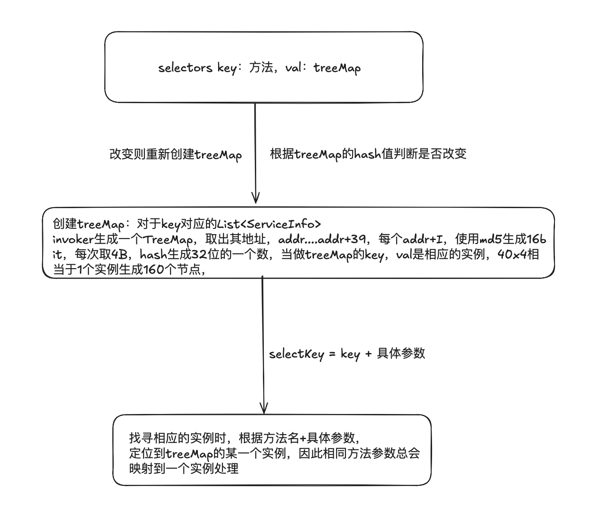
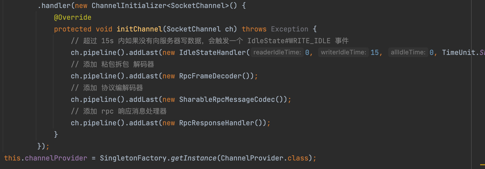
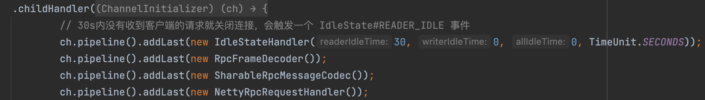
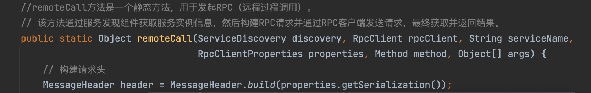
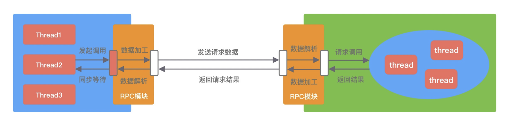
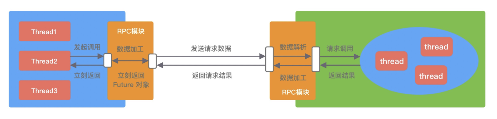
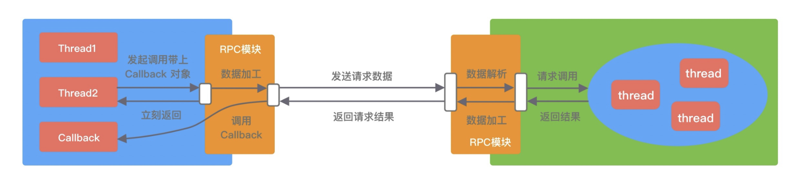
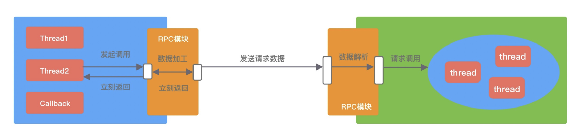
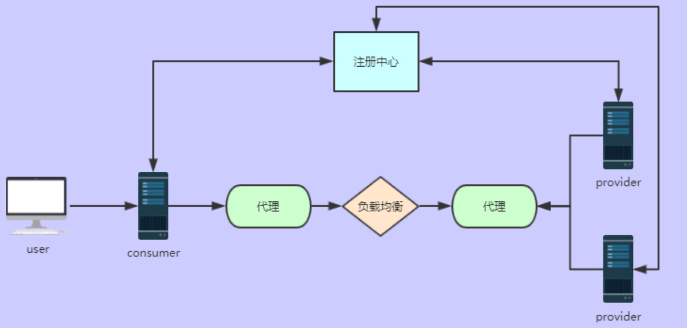
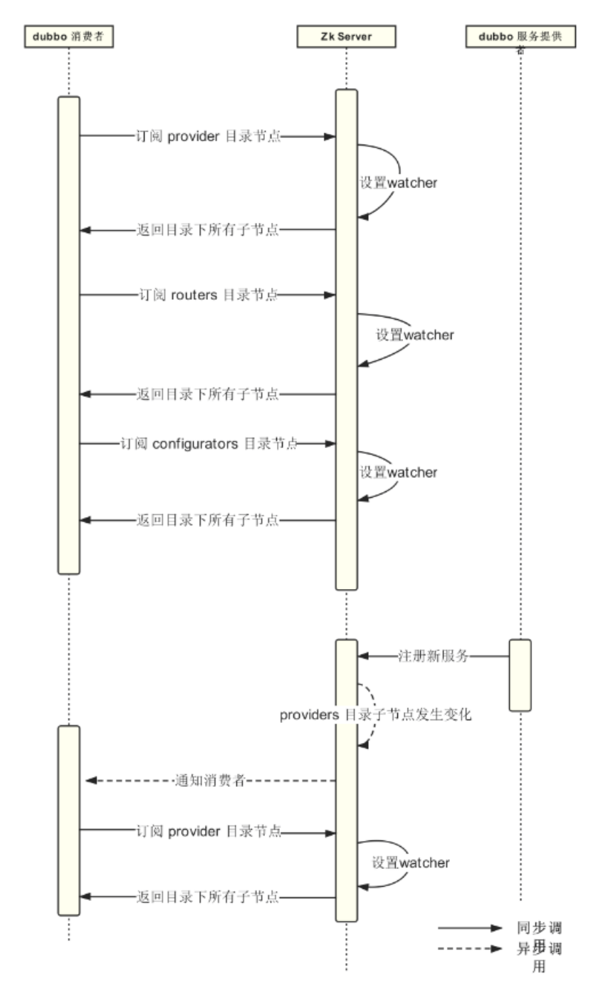

1.负载均衡实现优缺点，trpc的

2.序列化算法优缺点

3.动态代理

4.大量redis写操作如何抗的住


https://mp.weixin.qq.com/s?__biz=MjM5MDE0Mjc4MA%3D%3D&chksm=bdbec6368ac94f20a4bc7b7ca477b73dadb587d40cc4d30907e9a68f6c25d8dde1fe6a216337&idx=2&mid=2651012709&scene=27&sn=520d66662328a7b4dbb2c7a93e7f17ff&utm_campaign=geek_search&utm_content=geek_search&utm_medium=geek_search&utm_source=geek_search&utm_term=geek_search#wechat_redirect


### eventloop如何执行handler的

```
在 Netty 中，`EventLoop` 是负责执行 I/O 事件的线程组，而 `SimpleChannelInboundHandler` 是专门用来处理 I/O 事件的处理器。您提到的 `NettyRpcRequestHandler` 是继承自 `SimpleChannelInboundHandler`，并且其中的 `channelRead0` 方法处理了 `RpcMessage` 类型的消息。那么，问题是：是否 `EventLoop` 执行了该 `handler`？

答案是 **是的**，但这里有一些细节值得注意。

### 1. **EventLoop 和 ChannelHandler 的关系**：
- **EventLoop** 是 Netty 中负责处理 I/O 事件的线程，它处理每个 `Channel` 上的事件，并且事件处理是串行的（每个 `Channel` 对应的事件由单一的 `EventLoop` 处理）。
- 当 Netty 收到数据并解析成 `RpcMessage` 后，它会将该消息传递给 `ChannelPipeline`，然后由 `NettyRpcRequestHandler` 的 `channelRead0` 进行处理。
- **EventLoop 负责调用 `handler` 的方法**，例如 `channelRead0`，并在 `handler` 方法内部执行用户定义的逻辑。

### 2. **线程池的使用**：
在 `NettyRpcRequestHandler` 中，您使用了一个线程池 `threadPool` 来处理 RPC 请求。虽然 `EventLoop` 是执行 `channelRead0` 方法的，但在该方法中，您通过线程池将请求的处理任务分发给线程池中的线程来执行，而不是让 `EventLoop` 线程直接处理耗时的逻辑。

这样做的好处是：
- **避免阻塞 `EventLoop`**：Netty 的 `EventLoop` 线程主要负责处理 I/O 事件，如果直接在 `EventLoop` 中执行复杂或耗时的任务，可能会阻塞其他 I/O 事件的处理，导致性能问题。通过使用线程池来处理业务逻辑，可以避免阻塞 `EventLoop`，保持 Netty 的高性能。
  
- **并发处理请求**：通过线程池，可以并发地处理多个请求，而不必让所有请求排队等待 `EventLoop` 逐一处理。

### 3. **执行流程**：
- 当 `Netty` 收到一条消息（`RpcMessage`）时，`EventLoop` 线程会调用 `channelRead0` 方法。
- 在 `channelRead0` 中，您将具体的 RPC 处理任务提交给线程池 `threadPool`，线程池中的线程负责执行这个任务。
- 提交任务后，`EventLoop` 线程可以继续处理其他 I/O 事件，而不会被当前 RPC 请求的处理阻塞。

### 4. **IdleStateEvent 的处理**：
对于 `IdleStateEvent`（空闲状态检测事件），也是由 `EventLoop` 线程直接触发的。如果 `IdleStateHandler` 检测到空闲状态，它会生成一个 `IdleStateEvent`，然后传递到 `NettyRpcRequestHandler` 中的 `userEventTriggered` 方法进行处理。

### 总结：
是的，**`EventLoop` 负责执行这个 `handler`**，但您在 `handler` 中通过线程池分发任务，从而避免阻塞 `EventLoop`，保证了 Netty 的高并发和高性能。

如果您需要进一步了解 `EventLoop` 和 `ChannelHandler` 的工作机制或有其他问题，请继续告诉我！
```


### RPC和springcloud

```
关于SpringCloud远程调用采用HTTP而非RPC。

1、首先SpringCloud开启Web服务依赖于内部封装的Tomcat容器，而今信息飞速发展，适应大流量的微服务，采用Tomcat处理HTTP请求，开发者编写Json作为资源传输，服务器做出相应的响应，可以更加的灵活处理业务数据，而HTTP协议是跨平台的，符合微服务B/C数据交互的方式，可以的一套服务器对应移动H5、App、小程序提供服务。

2、RPC基于TCP协议，客服端与服务端需要进行三次握手完成可靠连接，第四步进行数据传输。因为TCP是数据传输层，传输协议需要服务器统一编写，进行二进制传输，依赖序列化和反序列化规则，对于大部分应用需要灵活变动数据则不适用，RPC常用于Socket连接或一些基本不变动的传输格式数据，减少数据变动带来的开发成本

建立Socket连接至少需要一对套接字，其中一个运行于客户端，称为ClientSocket ，另一个运行于服务器端，称为ServerSocket ，套接字之间的连接过程分为三个步骤：服务器监听，客户端请求，连接确认。

一个简单HTTP请求处理

在Web应用中，浏览器请求一个URL，服务器就把生成的HTML网页发送给浏览器，而浏览器和服务器之间的传输协议是HTTP,那么接下来我们看下如何用Java来实现一个简单的HTTP服务器。


RPC

RPC(Remote Procedure Call：远程过程调用)：是一种进程间通信方式，是一种技术的思想，而不是规范。它允许程序调用另一个地址空间（通常是共享网络的另一台机器上）的过程或函数，而不用程序员显式编码这个远程调用的细节。即程序员无论是调用本地的还是远程的函数，本质上编写的调用代码基本相同。

通俗的说法就是：比如说现在有两台服务器A和B，一个应用部署在A服务器上，另一个应用部署在B服务器上，如果A应用想要调用B应用提供的方法，由于他们不在一台机器下，也就是说它们不在一个JVM内存空间中，是无法直接调用的，需要通过网络进行调用，那这个调用过程就叫做RPC。


RPC两个核心模块：通讯，序列化。

注意：无论是何种类型的数据，最终都需要序列化转换成二进制流在网络上进行传输，数据的发送方需要将对象序列化转换为二进制流，而数据的接收方则需要把二进制流反序列化为对象。
Restful（HTTP）

Restful 指的是一组架构约束条件和原则。" 如果一个架构符合 Restful 的约束条件和原则，就称它为 Restful 架构。隐藏在 Restful 背后的理念就是使用 Web的现有特征和能力，更好地使用现有 Web 标准中的一些准则和约束。

虽然 Restful 本身受 Web技术的影响很深， 但是理论上 Restful 架构风格并不是绑定在 HTTP 上，只不过目前 HTTP 是唯一与 Restful 相关的实例。所以我们这里描述的 Restful 也是通过 HTTP 实现的 Restful。

RPC和HTTP的区别

首先，两者十分相似，有请求有响应。

不同：

RPC需要满足像调用本地服务一样调用远程服务，也就是对调用过程在API层面进行封装。
Http协议没有这样的要求，因此请求、响应等细节需要我们自己去实现。
优点

RPC更加透明，对用户方便。
HTTP方式更加灵活，没有规定API和语言，跨语言，跨平台。
缺点

RPC需要在API层面进行封装，限制了开发的语言环境。
选择

速度方面：RPC速度比HTTP快，底层都是TCP，HTTP消息往往比较臃肿，但是可以采用gzip压缩。
难度方面：RPC实现有点儿复杂，HTTP相对比较简单。
灵活性方面：HTTP更灵活，不需要关系实现的细节，可以跨平台，跨语言。
未来发展方向

微服务，强调独立，自治，灵活。RPC限制较多，因此微服务框架中，一般都会采用基于HTTP的rest风格服务。
```


# 序列化

#### 1.性能【时空，空间大小决定消耗带宽】

#### 2.调试可维护性【可读性】

#### 3.跨平台

#### 4.安全

#### 5.向后兼容【proto】

https://mp.weixin.qq.com/s?__biz=MzUzMTA2NTU2Ng%3D%3D&chksm=fa497bf2cd3ef2e47851b447801ec54bb8be29c81cdf450df2a257b3a2d4d97e264f9ca8586e&idx=1&mid=2247484483&scene=27&sn=b58e64b13743d3f40b8c9c3ee7ec885e&utm_campaign=geek_search&utm_content=geek_search&utm_medium=geek_search&utm_source=geek_search&utm_term=geek_search#wechat_redirect

### 二二三：[两种重试，两种心跳，三种缓存

https://juejin.cn/post/7115642653718347783?searchId=20240921103108A81342B7754CA9F70F4D

# 序列化算法对比：Kryo、Protostuff、Hessian、JDK、JSON

#### 1. Kryo

**优点**:

- **高性能**：Kryo 的序列化和反序列化速度非常快，比 JDK 自带的序列化机制快得多。
- **紧凑的序列化格式**：【生成的二进制数据较小，适合网络传输和存储。】
- **灵活性**：支持【自定义序列化器】，可以根据需求进行调整。
- **易用性**：API 简单直观，易于上手。

**缺点**:
- **类注册的维护**：需要在应用启动时进行类注册，如果类层次结构复杂，注册过程可能较繁琐。
- **不支持跨语言**：Kryo 主要用于 Java 生态系统，不适用于需要跨语言互操作的场景。
- **不适合长生命周期的对象**：由于 Kryo 序列化数据格式紧凑，反序列化时的兼容性维护可能比较复杂。

#### 2. Protostuff

**优点**:
- **高性能**：与 Kryo 类似，Protostuff 的序列化和反序列化速度非常快。
- **无需 .proto 文件**：Protostuff 可以直接对 Java POJO 进行序列化和反序列化，而不需要预先定义 .proto 文件和生成类文件。
- **多种格式支持**：除了二进制格式，Protostuff 还支持 JSON、XML、YAML 等多种序列化格式。

**缺点**:
- **类注册**：尽管不需要 .proto 文件，但仍然需要进行**类注册**，这增加了一定的维护成本。
- **不支持跨语言**：Protostuff 主要用于 Java 生态系统，不适用于需要跨语言互操作的场景。

#### 3. Hessian

**优点**:

- **高效的二进制协议**：相比于文本协议（如 JSON 和 XML），Hessian 使用二进制格式，具有更高的传输效率和更小的消息体积。
- **跨语言支持**：Hessian 支持多种编程语言，包括 Java、Python、C#、PHP 等，提供了良好的互操作性。
- **简单易用**：Hessian 的 API 设计简单直观，易于集成和使用。
- **内置 RPC 支持**：Hessian 不仅提供序列化和反序列化功能，**还内置了 RPC 支持，方便实现分布式系统的远程调用。**

**缺点**:
- **协议封闭**：Hessian 是一种专有协议，虽然开源，但其设计和实现由 Caucho 控制。
- **文档和社区支持**：相比其他流行的序列化和 RPC 框架，如 Protobuf 和 gRPC，Hessian 的文档和社区支持较少。

#### 4.JDK 自带序列化

**优点**:
- **内置支持**：无需引入外部库，JDK 自带的序列化机制可以直接使用。
- **简单易用**：对于 Java 开发者来说，使用 `java.io.Serializable` 接口非常方便。

**缺点**:

- **性能较低**：**JDK 自带的序列化机制性能较差，序列化和反序列化速度慢。**
- **序列化数据格式大**：**生成的序列化数据较大，不适合高效网络传输和存储。**
- **不支持跨语言**：JDK 自带的序列化机制仅适用于 Java，不支持跨语言互操作。
- **向后兼容性差**：**类结构发生变化时，反序列化可能失败，向后兼容性较差。**

~~~java
### 2. ObjectInputStream 和 ObjectOutputStream 的工作原理**

`ObjectOutputStream` 和 `ObjectInputStream` 是专门为处理对象序列化和反序列化而设计的流。

#### **2.1 ObjectOutputStream**

- 当你调用 `ObjectOutputStream.writeObject(Object obj)` 时，Java 将对象 `obj` 转换为字节流。这个字节流不仅包含对象数据本身，还包含了对象的类型信息和对象的引用关系。
- 在这个过程中，Java 序列化机制会为每个对象生成一个唯一的标识符，并将这个标识符和对象数据写入字节流中。
- **如果同一个对象被多次写入流中，Java 会检测到这是同一个对象，并且只序列化一次，后续只写入一个引用标识符**。

#### **2.2 ObjectInputStream**

- 当你调用 `ObjectInputStream.readObject()` 时，Java 从输入流中读取字节数据，并根据数据流中的标识符和类型信息重建对象。
- `ObjectInputStream` 解析流时，能够根据序列化过程中插入的标识符，准确识别对象的开始和结束。
- 这就意味着，`ObjectInputStream` **不需要额外的边界标记或者分隔符就能正确地读取一个完整的对象**。

### **3. 为什么不会出现粘包和半包问题**【会出现，因为object只是body，整个消息都是以header+body进行传输的，head+body会出现粘包】


1. - ```
     粘包** 和 **半包** 是基于字节流通信的常见问题，特别是在 TCP 协议中：
     
     - **粘包**：多个数据包在接收端被一次性读取，导致多个数据包内容粘在一起。
     - **半包**：一个数据包被分成了多个部分发送，接收端一次性读取不到完整的数据包。
     
     在普通的字节流处理中，如果没有分隔符或者明确的包长信息，接收端可能无法确定一个数据包的开始和结束，导致粘包和半包问题。
     
     **然而，使用 `ObjectInputStream` 和 `ObjectOutputStream` 时，这些问题不会发生**，原因在于：
     
     1. **对象边界的标记**：
        - Java 的序列化机制在序列化对象时，会在对象数据前后插入【【【特定的标记和元数据。这些标记和元数据包括对象的类信息、对象的字段信息以及对象的引用关系等。】】】】
        - 这些信息确保了 `ObjectInputStream` 在读取时能够识别出一个对象的完整边界，即使底层的传输协议将字节流进行了分段传输（如半包情况），`ObjectInputStream` 也能通过这些标记和元数据将对象重新组装起来。
     2. **流的完整性**：
        - `ObjectInputStream` 处理对象流时，会一直读取字节流，【【【【直到收集到足够的信息来重建一个完整的对象。如果底层传输是分段的（如 TCP 的半包），`ObjectInputStream` 会继续读取字节流，直到完整的对象数据被收集完毕。】】】】
        - 对于粘包的情况，由于每个对象都有明确的边界标记，`ObjectInputStream` 可以在读取一个对象后继续读取下一个对象，而不会混淆多个对象的数据。
     3. **类信息的存储**：
        - Java 序列化不仅保存对象的数据，还保存了对象的类信息（如类的名称、类的版本信息等）。这确保了在反序列化时，`ObjectInputStream` 知道如何正确地解析字节流，并将其转换回原始对象。
     ```

     

### **1. 序列化过程中对象的唯一标识符**

#### **1.1 对象的唯一标识符**

在 Java 序列化过程中，每个被序列化的对象都有一个唯一的标识符（Object Handle），用于标识该对象。这种机制类似于在内存中给每个对象分配一个唯一的引用地址。这个标识符在序列化期间是唯一的，确保每个对象即使被多次引用，也能被正确识别。

#### **1.2 序列化过程的工作原理**

- ```
  - **初次序列化**：当一个对象第一次被写入到 `ObjectOutputStream` 时，Java 会为这个对象生成一个唯一的标识符（Object Handle）。这个标识符会与对象的实际数据一起写入到输出流中。包括：
    - 对象的类信息（包括类名、`serialVersionUID` 等）。
    - 对象的字段值。
    - 其他相关的元数据。
  - **Object Stream Table**：在 `ObjectOutputStream` 内部维护了一个表（通常称为“Object Stream Table”或“Handle Table”），用来记录每个对象与其标识符的映射关系。这个表记录了所有已经被序列化的对象的引用，这样可以防止同一个对象被重复序列化
  ```

### **2. 多次序列化相同对象的处理**【一个stream中】

#### **引用相同对象的优化**

- ```
  - **引用的检测**：当一个对象再次被写入 `ObjectOutputStream` 时，Java 会首先检查这个对象是否已经被序列化（通过查找 Object Stream Table）。如果已经被序列化过，Java 并不会再次序列化这个对象，而是仅仅写入一个引用标识符。这个引用标识符指向该对象的第一次序列化位置。
  - **减少冗余**：这种机制极大地减少了冗余数据的传输量。例如，当一个复杂对象引用了某个子对象多次（甚至是自引用时），Java 的序列化机制只会将这个子对象序列化一次。其余的地方都只写入一个引用标识符，指向已经序列化的那个子对象。
  ```
~~~


#### 5. JSON

**优点**:

- **人类可读性**：JSON 是一种文本格式，容易阅读和调试。
- **广泛支持**：几乎所有编程语言都支持 JSON，是一种通用的序列化格式。
- **跨语言支持**：JSON 可以在不同编程语言之间进行数据交换，具有良好的互操作性。
- **简单易用**：JSON 的结构简单，易于理解和使用。

**缺点**:
- **性能较低**：相比于二进制序列化格式（如 Kryo 和 Protostuff），JSON 的序列化和反序列化速度较慢。
- **数据格式较大**：由于是**文本格式**，JSON 生成的数据较大，不适合高效网络传输和存储。
- **类型信息缺失**：JSON 仅支持基本数据类型，复杂类型（如日期、二进制数据等）需要额外处理。

### 总结对比表

| 序列化库   | 性能 | 数据大小 | 跨语言支持 | 易用性   | 特点                 |
| ---------- | ---- | -------- | ---------- | -------- | -------------------- |
| Kryo       | 高   | 小       | 否         | 较简单   | 高性能、高灵活性     |
| Protostuff | 高   | 小       | 否         | 较简单   | 无需 .proto 文件     |
| Hessian    | 较高 | 小       | 是         | 简单     | 内置 RPC 支持        |
| JDK        | 低   | 大       | 否         | 简单     | 内置支持，无需外部库 |
| JSON       | 低   | 大       | 是         | 非常简单 | 人类可读，广泛支持   |

通过以上对比，可以看到不同的序列化库在性能、数据大小、跨语言支持、易用性等方面各有优劣。开发者可以根据具体需求选择合适的序列化库。在高性能和紧凑数据格式需求较高的场景中，Kryo 和 Protostuff 是不错的选择；在需要跨语言支持的场景中，Hessian 和 JSON 是更好的选择；而在需要简单易用且无需引入外部库的场景中，JDK 自带的序列化机制仍然具有一定的优势。


## 1.JDK序列化


JDK 自带的序列化机制，即 `java.io.Serializable`，主要设计目标是为了在 Java 应用程序之间进行对象的持久化和传输。它在跨语言调用方面存在局限性，原因如下：

### 1. 序列化格式

**Java 特定格式**：JDK 序列化使用 Java 专有的二进制格式。这种格式是 Java 特有的，设计上并未考虑其他语言的兼容性。其他编程语言无法直接理解或解析这种格式，因为它包含了特定于 Java 的类信息、字段描述、方法等。

### 2. Java 类的依赖

**Java 类元数据**：JDK 序列化包含了类的元数据（如类名、字段类型、字段名等）。这种元数据在其他编程语言中无法直接使用或解析。例如，一个序列化后的 Java 对象包含了具体的 Java 类名，而其他语言无法识别这些类。

### 3. 序列化和反序列化的机制

**类加载机制**：JDK 序列化在反序列化时依赖 Java 的类加载机制，要求类在反序列化时必须存在。这意味着，反序列化过程需要找到与序列化时完全相同的 Java 类，其他语言无法提供这样的类加载机制。

### 4. 版本控制和兼容性

**字段的默认处理**：Java 的序列化机制处理字段的方式可能与其他语言不兼容。比如，`serialVersionUID` 用于版本控制，以确保类的序列化和反序列化的兼容性。这种机制在其他语言中并不存在，导致版本控制上的问题。

### 5. 序列化对象中的特定特性

**Java 特有特性**：Java 对象可能包含 Java 特有的特性，如 `transient` 关键字字段（不序列化）、静态字段、方法引用等。这些特性在其他编程语言中不存在或不兼容，导致直接解析 Java 序列化数据变得困难。


## 2.Protobuf 详细介绍

#### 1. 什么是 Protobuf？

Protobuf，全称 Protocol Buffers，是由 Google 开发的一种高效的序列化工具。它是语言中立、平台中立、可扩展的，广泛用于数据存储、通信协议等场景。Protobuf 的核心在于其高效的二进制格式，使得数据传输和存储更加紧凑和快速。

#### 2. Protobuf 的特点

1. **高效**：二进制格式比文本格式（如 XML、JSON）更加紧凑，序列化和反序列化速度更快。
2. **跨语言支持**：支持多种编程语言，包括 Java、C++、Python、Go 等。
3. **向后兼容**：**通过添加新的字段和保持旧的字段不变，确保新旧版本的兼容性。**
4. **可扩展**：支持嵌套消息、枚举和扩展字段，适应复杂数据结构的需求。

#### 3. Protobuf 的基本使用

##### 1. 定义 `.proto` 文件

首先，我们需要定义一个 `.proto` 文件，用于描述数据结构。例如，我们定义一个 `person.proto` 文件：

```proto
syntax = "proto3";

package tutorial;

message Person {
    int32 id = 1;
    string name = 2;
    string email = 3;
}
```

- `syntax = "proto3";` 指定使用 Protobuf 的版本。
- `package tutorial;` 指定包名。
- `message Person { ... }` 定义一个名为 `Person` 的消息类型。
- `int32 id = 1;` 定义一个字段，类型为 `int32`，字段名为 `id`，序号为 1。

##### 2. 编译 `.proto` 文件

使用 `protoc` 工具将 `.proto` 文件编译生成相应语言的代码。

```bash
protoc --java_out=. person.proto
```

这将生成一个 `Person.java` 文件。

##### 3. 使用生成的代码

在 Java 中使用生成的代码进行序列化和反序列化：

```java
import tutorial.PersonOuterClass.Person;

public class ProtobufExample {
    public static void main(String[] args) {
        // 创建一个 Person 对象
        Person person = Person.newBuilder()
                .setId(1)
                .setName("John Doe")
                .setEmail("johndoe@example.com")
                .build();

        // 序列化
        byte[] serializedData = person.toByteArray();

        // 反序列化
        try {
            Person deserializedPerson = Person.parseFrom(serializedData);
            System.out.println("Deserialized Person: " + deserializedPerson);
        } catch (Exception e) {
            e.printStackTrace();
        }
    }
}
```

### Protobuf 的进阶使用

#### 1. 嵌套消息

Protobuf 支持消息的嵌套，可以在一个消息中定义另一个消息：

```proto
message AddressBook {
    repeated Person people = 1;
}

message Person {
    int32 id = 1;
    string name = 2;
    string email = 3;
}
```

#### 2. 枚举

Protobuf 支持枚举类型：

```proto
message Person {
    int32 id = 1;
    string name = 2;
    string email = 3;
    Gender gender = 4;
}

enum Gender {
    MALE = 0;
    FEMALE = 1;
}
```

#### 3. 向后兼容性

Protobuf 通过字段编号（tag numbers）来识别字段，这使得添加新的字段变得容易：

```proto
message Person {
    int32 id = 1;
    string name = 2;
    string email = 3;
    string phone = 4;  // 新添加的字段
}
```

旧版本的应用程序会忽略新添加的字段，新版本的应用程序可以识别并使用这些字段。

#### 4. 选择字段（oneof）

Protobuf 支持 `oneof` 语法，允许同一时间只设置一个字段：

```proto
message Person {
    int32 id = 1;
    string name = 2;
    string email = 3;
    oneof contact {
        string phone = 4;
        string address = 5;
    }
}
```

#### 5. 扩展

Protobuf 支持消息的扩展：

```proto
syntax = "proto2";

message Foo {
    extensions 100 to 199;
}

extend Foo {
    optional int32 bar = 126;
}
```

### Protobuf 的应用场景

1. **RPC（远程过程调用）**：使用 Protobuf 进行高效的数据传输。
2. **数据存储**：将结构化数据以紧凑的二进制格式存储。
3. **配置文件**：使用 Protobuf 定义和解析配置文件。
4. **消息队列**：在消息队列系统中传输结构化数据。

### 总结

Protobuf 是一个强大的序列化工具，提供了高效的二进制格式，支持多种编程语言，具有向后兼容性和可扩展性。通过理解和掌握 Protobuf，可以在后端开发中实现高效的数据传输和存储，提升系统的性能和可维护性。无论是在 RPC、数据存储、配置文件解析还是消息队列中，Protobuf 都提供了强大的支持，是现代分布式系统和微服务架构中不可或缺的工具。

````
在 Protobuf 中，如果你需要在 `name` 和 `id` 之间插入一个字段，虽然字段的顺序在 Protobuf 的底层存储中并不重要（字段是通过编号而非顺序标识的），但在你明确希望“逻辑顺序”中插入字段时，以下是一些关键的考虑和解决方案：

### 情景描述

假设当前的 Protobuf 消息定义如下：

```proto
message Person {
    string name = 1;
    int32 id = 2;
}
```

你希望在 `name` 和 `id` 之间插入一个新的字段，比如 `age`。

### 解决方案

1. **不要更改现有字段的编号**
   - Protobuf 的核心规则之一是，**不要更改已发布的字段编号**。因此，虽然你想在逻辑上插入一个字段，但在编号上，你不能重新编号现有的 `id` 字段（即你不能把 `id` 字段的编号从 `2` 改成 `3`，然后给 `age` 编号 `2`）。如果你这样做，现有使用旧编号的代码会解析错误，导致数据不一致。

2. **在逻辑顺序中插入新字段，但编号保持唯一**
   - 在 Protobuf 中，字段的顺序只是对开发者和代码的可读性而言有意义，Protobuf 实际上是通过字段编号来识别字段的。因此，你可以插入一个新字段 `age`，但必须确保它有一个唯一的编号，且不要改变现有字段的编号。
   
   例如，插入 `age`，可以这样定义：

   ```proto
   message Person {
       string name = 1;
       int32 age = 3;   // 插入新字段，使用编号3
       int32 id = 2;
   }
   ```

   在这个例子中，虽然你在代码中“逻辑上”把 `age` 放在 `name` 和 `id` 之间，但在 Protobuf 中，`age` 的编号为 `3`，不影响现有的编号。

3. **确保兼容性**
   - **向后兼容**：如果你这样插入了一个新的字段，老版本的系统依然能够正常解析新版本的消息。旧系统会忽略 `age` 字段，因为它不认识 `age`（字段 `3`），因此兼容性不会被破坏。
   - **向前兼容**：新系统能够解析旧的消息，因为 `age` 是一个可选字段（在 `proto3` 中，所有字段默认是可选的），因此即使老系统没有这个字段，新系统依然能正常处理消息。

4. **使用默认值**
   - 在 `proto3` 中，所有的字段默认是可选的，因此没有必要为新字段指定 `optional` 关键字。如果你希望确保新字段有一个默认值，可以在你的业务逻辑中为 `age` 设置一个默认值（如 `0` 表示未指定年龄）。

5. **字段编号的规划**
   - 如果你希望将来继续在消息中插入新的字段，可以为未来的字段预留一些编号。比如你可以选择跳过几个字段编号（如 `10` 之后开始），为未来的扩展留出空间。

### 示例：插入新字段的最佳实践

假设你有如下的初始定义：

```proto
message Person {
    string name = 1;
    int32 id = 2;
}
```

现在，你想在 `name` 和 `id` 之间插入一个 `age` 字段：

```proto
message Person {
    string name = 1;
    int32 age = 3;    // 插入新字段，编号为3，确保现有字段编号不变
    int32 id = 2;
}
```

在这个例子中，`age` 的编号为 `3`，它逻辑上位于 `name` 和 `id` 之间，但不会破坏原有消息的解析逻辑。

### 重要注意事项

- **不要改变现有字段的编号**。Protobuf 使用字段编号来标识数据，因此改变现有字段编号会导致已有系统解析失败。
- **不要删除字段**。即使你不再使用某个字段，也不要将其从消息中删除。你可以标记它为“已废弃”或重命名为 `unused_field`，以避免使用它，同时保留编号。
- **字段编号是持久的**。一旦定义了一个字段编号，最好不要重复使用它。如果你删除了一个字段，应该将它的编号永久留空，以免未来误用导致解析错误。

### 总结

在 Protobuf 中，“逻辑上”插入字段是可以的，但必须确保**字段编号的唯一性和不变性**。你可以在 `name` 和 `id` 之间插入 `age` 字段，编号为 `3`，这样不会影响现有系统的解析。同时，老版本系统依然能够兼容新版本的消息，忽略它们不认识的字段。
````


### 编号

````
在 **Protostuff** 和 **Protobuf** 中，字段编号是通过标记每个字段来唯一标识的，它决定了数据的序列化和反序列化顺序。字段编号确保了在不同语言或不同版本中数据能够被正确解析和处理，而不仅仅是依赖字段的物理顺序。

### 字段编号的体现方式

**字段编号** 是 Protobuf 和 Protostuff 中的一个核心概念。每个字段都被分配一个唯一的编号，序列化时，消息的数据结构根据这个编号生成数据包，反序列化时，解析数据包时会依赖这些编号来正确地解析消息中的数据，而不是依赖字段的顺序。

### 在 Protobuf 中定义字段编号

在 Protobuf 中，字段编号是显式定义的，通常在 `.proto` 文件中写明。每个字段都带有唯一的编号，格式如下：

```proto
message Person {
    string name = 1; // 字段名 = 字段编号
    int32 id = 2;    // 字段名 = 字段编号
}
```

上面的 Protobuf 定义中，`name` 字段被分配编号 `1`，`id` 字段被分配编号 `2`。在序列化时，Protobuf 会根据字段编号将每个字段的值编码为紧凑的二进制格式。

### 在 Protostuff 中的字段编号

Protostuff 是基于 Protobuf 序列化格式的 Java 库，尽管它不需要显式的 `.proto` 文件，但 Protostuff 仍然会在序列化对象时为字段分配隐式的编号，通常是基于字段的声明顺序。

例如：

```java
public class Person {
    String name;
    int age;  // 新字段
    int id;
}
```

在这个类中，`name` 字段会自动被赋予一个编号，假设为 `1`，`age` 被赋予编号 `2`，`id` 被赋予编号 `3`。在 Protostuff 生成的二进制格式中，字段会按编号进行序列化和反序列化。

### 字段编号的作用

1. **唯一标识字段**：字段编号用于唯一标识消息中的每个字段，而不是依赖字段的物理顺序。这意味着即使字段顺序发生变化，只要字段编号保持不变，数据仍然可以被正确解析。
  
2. **高效解析**：Protostuff 和 Protobuf 都使用紧凑的二进制编码格式，字段编号使得解析器可以快速定位和读取每个字段的数据，避免逐个解析字段名称的开销。

3. **向后兼容性**：在向现有的消息类型中添加新字段时，必须确保新字段的编号不与已有字段冲突。旧版本的代码会忽略它不认识的字段，因此字段编号帮助保持消息的向后兼容性。

4. **字段的默认值**：在 Protostuff 和 Protobuf 中，如果某个字段缺失（例如，旧版本的消息没有新字段），反序列化时会使用字段的默认值。因此，可以安全地为新字段提供默认值。

### 字段编号的影响

- **编号必须唯一**：每个字段的编号必须唯一，且在整个消息定义中不得重复。比如，如果 `name` 字段使用了编号 `1`，其他字段就不能再使用 `1` 作为编号。
  
- **编号的可用范围**：字段编号可以在 1 到 536,870,911 之间选择（推荐使用 1 到 15 的编号作为高效的紧凑字段编码，编号从 16 开始会使用更多字节进行存储）。

### 编号的显式体现

尽管 Protostuff 不像 Protobuf 那样需要显式指定字段编号，但你可以通过 Protostuff 的 `.proto` 文件格式定义来控制字段编号。在更复杂的场景中，使用 `.proto` 文件明确指定字段编号能让你在 Java 项目中确保跨语言兼容性。

例如，如果你使用 Protostuff 和 Protobuf 的 `.proto` 文件，定义可以如下：

```proto
message Person {
    string name = 1;
    int32 age = 3; // 插入了新字段，编号为3
    int32 id = 2;
}
```

在这种情况下，`name` 字段的编号为 `1`，`age` 字段的编号为 `3`，而 `id` 字段编号保持不变，为 `2`。这样可以确保兼容性，特别是在已有数据和新数据之间的兼容。

### 编号如何在序列化数据中体现

在 Protobuf（以及 Protostuff）序列化为二进制数据时，每个字段的编号都会与字段的值一起被序列化。当解析二进制数据时，字段编号帮助识别字段并将其映射回 Java 对象或其他语言中的相应字段。

例如，假设我们有以下消息：

```proto
message Person {
    string name = 1;
    int32 age = 3;
    int32 id = 2;
}
```

序列化为二进制数据时，`name` 被赋予编号 `1`，`id` 被赋予编号 `2`，`age` 被赋予编号 `3`。序列化后的数据可能如下：

```
<字段编号1><字段值name>
<字段编号2><字段值id>
<字段编号3><字段值age>
```

当 Protostuff 或 Protobuf 解析数据时，它将基于字段编号还原相应的字段和数据。

### 总结

- 在 **Protostuff** 和 **Protobuf** 中，**字段编号** 是唯一标识每个字段的关键。字段编号决定了字段的存储和解析方式，而不是字段的物理顺序。
- 插入新字段时，确保为新字段分配一个唯一的编号，且不能与已有字段冲突。
- 字段编号保持不变有助于保持消息的兼容性，并且不会因为顺序变化而影响数据解析。

通过正确管理字段编号，可以确保在 Protostuff 和 Protobuf 序列化中保持数据的一致性和兼容性。
````


## 3.Protostuff 

Protostuff 是一个基于 Protocol Buffers（Protobuf）的序列化库，**专为 Java 设计**。它提供了一种高效的二进制序列化方式，并支持多种序列化格式。Protostuff 可以在没有 `.proto` 文件的情况下进行操作，并提供了一些额外的功能，使其在某些场景下比 Protobuf 更加灵活和强大。

### 特点

1. **高性能**：Protostuff 在序列化和反序列化性能上与 Protobuf 相当，并在某些场景下更为高效。
2. **无需 `.proto` 文件**：Protostuff 允许直接对 Java POJO（Plain Old Java Object）进行序列化和反序列化，无需预先定义 `.proto` 文件和生成类文件。
3. **多种格式支持**：除了二进制格式，**Protostuff 还支持 JSON、XML、YAML 等多种序列化格式**。
4. **支持 Schema 动态生成**：通过 `RuntimeSchema`，**可以在运行时动态生成 Schema**，无需预先定义。
5. **兼容性**：Protostuff 与 Protobuf 完全兼容，可以在 Protobuf 的基础上进行扩展和使用。

```
获取 Schema：RuntimeSchema.getSchema(User.class) 方法用于获取 User 类的 Schema。Schema 是 Protostuff 用来描述对象结构的。
创建【 LinkedBuffer：LinkedBuffer 是 Protostuff 中用于临时存储序列化数据的缓冲区。】LinkedBuffer.allocate(LinkedBuffer.DEFAULT_BUFFER_SIZE) 用于创建一个默认大小的缓冲区。
序列化：
ProtostuffIOUtil.toByteArray(user, schema, buffer) 方法用于将 User 对象序列化为字节数组。它使用 User 类的 Schema 和缓冲区进行序列化。
反序列化：
ProtostuffIOUtil.mergeFrom(serializedData, deserializedUser, schema) 方法用于将字节数组反序列化为 User 对象。它使用字节数组、目标对象和 Schema 进行反序列化。
清理缓冲区：buffer.clear() 用于清理缓冲区，释放资源。
```

序列化过程中使用缓冲区是为了提高性能、优化内存管理，并确保数据在网络或磁盘等介质上传输时的有效性和完整性。以下是详细的原因：

### **1. 提高性能**

- **减少系统调用次数**：
  - 序列化过程中，数据需要从内存写入到某个输出目标（如文件、网络套接字等）。**每次写入操作通常涉及系统调用，这些调用相对昂贵。如果每序列化一个数据就直接执行一次写操作，会导致大量的系统调用，降低整体性能**。
  - 通过使用缓冲区，可以将**多个序列化的数据暂时存储在内存中，等到缓冲区满时或序列化操作完成后再统一写入**。这减少了系统调用的次数，提升了性能。
- **减少 I/O 操作**：
  - 直接对输出目标进行写操作可能会引发频繁的 I/O 操作，这在处理大量数据时会显著降低速度。缓冲区的存在使得程序可以累积一定量的数据后再进行一次性写入，从而减少了 I/O 操作的次数，提高了整体效率。

### **2. 优化内存管理**

- **分段处理大数据**：
  - 序列化大型对象时，直接处理整个对象可能会导致内存不足或内存碎片问题。缓冲区可以分段处理数据，避免一次性分配过多内存。
  - 通过将数据分片存入缓冲区，序列化过程可以更加灵活，避免占用过多的内存资源，减少内存压力。
- **提高内存使用效率**：
  - 使用缓冲区可以更好地管理内存，使数据的序列化和传输更加高效。缓冲区能够聚合数据，避免频繁的内存分配和释放，从而减少内存碎片化问题。

### **3. 确保数据完整性**

- **防止数据丢失**：
  - 在网络传输或写入磁盘的过程中，直接将每个数据片段单独写入可能导致数据不完整或丢失。缓冲区可以确保所有数据在传输前被完整地组装好，从而降低数据丢失的风险。
  - 特别是在网络传输中，缓冲区可以积累足够的数据量后再发送，从而减少因为网络抖动或延迟导致的数据丢失或传输失败。
- **数据一致性**：
  - 序列化时，缓冲区可以确保在写入输出目标之前，数据被完整地序列化和组装。这样可以保证序列化过程中的数据一致性，避免因为部分数据写入失败导致的数据不完整或不一致问题。

### **4. 支持复杂数据结构**

- 处理复杂对象图

  ：

  - 序列化不仅仅是处理简单的基本数据类型，很多时候需要处理复杂的对象图（如嵌套对象、循环引用等）。缓冲区可以有效地管理这些复杂结构，确保它们被正确地序列化和组织。
  - 通过缓冲区，序列化框架能够更好地跟踪和管理对象引用，确保复杂的数据结构在序列化和反序列化过程中保持一致。

### **5. 提高序列化框架的灵活性**

- 支持增量序列化

  ：

  - 某些场景下，序列化操作可能是逐步完成的（如流式处理、逐步构建数据）。缓冲区能够支持这种增量序列化，使得数据可以部分序列化、部分传输，而不必等待整个对象完全构建。
  - 这对于处理大型数据集或流数据（如实时数据流）非常有用，能够减少延迟，提升实时性。

### **6. 减少序列化开销**

- 缓冲区复用

  - 序列化过程中，频繁的内存分配和释放会增加性能开销。使用缓冲区可以减少这些开销，特别是通过复用缓冲区，避免不必要的内存操作。
- 例如，在高频率的序列化操作中，预先分配的缓冲区可以在每次序列化过程中重复使用，减少了内存管理的开销，提升了整体性能。

### **总结**

序列化过程中使用缓冲区的主要原因包括：

1. **提高性能**：通过减少系统调用次数和I/O操作，提高序列化和传输的效率。
2. **优化内存管理**：通过分段处理和内存复用，减少内存消耗和内存碎片。
3. **确保数据完整性**：避免数据丢失，确保序列化后的数据完整且一致。
4. **支持复杂数据结构**：帮助管理和序列化复杂的对象图，确保数据结构的正确性。
5. **提高序列化框架的灵活性**：支持增量序列化和流式处理，提高系统的实时性和响应速度。
6. **减少序列化开销**：通过复用缓冲区减少内存操作的开销，提升系统整体性能。

### **1. `LinkedBuffer` 的基本概念**

`LinkedBuffer` 是 Protostuff 序列化库中用于管理字节数组的一个缓冲区。它是一个高效的、动态扩展的缓冲区，用于在序列化过程中暂存数据。

- **缓冲区的作用**：在序列化过程中，数据需要暂时存储在一个缓冲区中，然后再输出为最终的字节数组。`LinkedBuffer` 就是用于这个目的的缓冲区，它可以动态地增长，以适应不同大小的数据。
- **动态扩展**：`LinkedBuffer` 可以根据数据量的大小进行动态扩展，而不像固定大小的缓冲区那样容易导致内存浪费或溢出。

### **2. `BUFFER` 的具体作用**

在 `ProtostuffSerialization` 类中，`BUFFER` 作为一个成员变量提前分配了一个默认大小的缓冲区 (`LinkedBuffer.DEFAULT_BUFFER_SIZE`)。这个缓冲区在序列化时被用来暂存数据，以减少内存的频繁分配和回收，提高序列化的性能。

- **减少内存分配开销**：
  - 在序列化操作中，【**如果每次序列化都重新分配一个新的缓冲区，会带来额外的内存分配和回收的开销**】。这种频繁的内存分配和回收会导致性能下降，尤其是在高并发环境中。
  - 通过提前分配 `BUFFER`，**这个缓冲区可以在多次序列化操作中重复使用，从而减少了内存分配的频率**，提高了系统的整体性能。
- **缓冲区的复用**：
  - 在序列化结束后，通过调用 `BUFFER.clear()` 方法来重置缓冲区，使其可以在下一次序列化时重新使用。
  - 这种缓冲区复用的方式不仅节省了内存资源，还减少了垃圾回收的压力，因为减少了不必要的对象创建和销毁。
- **提高序列化效率**：
  - `LinkedBuffer` 内部使用了一种链表结构来存储数据块，这种结构使得它能够高效地处理大数据量的序列化操作。
  - `BUFFER` 的使用使得序列化过程中数据的写入和读取变得更加高效，尤其是在需要处理大量数据时，能够显著提高序列化的效率。

### **3. `BUFFER` 的生命周期**

- **创建**：`BUFFER` 在 `ProtostuffSerialization` 对象创建时就被初始化。这意味着在整个 `ProtostuffSerialization` 对象的生命周期内，这个 `LinkedBuffer` 都可以被复用。
- **使用**：在每次调用 `serialize()` 方法时，`BUFFER` 都会被用来暂存序列化数据。`ProtostuffIOUtil.toByteArray()` 方法会使用这个缓冲区来构建最终的字节数组。
- **重置**：每次序列化操作完成后，`BUFFER.clear()` 方法会重置缓冲区，使其准备好用于下一次序列化。这一步非常关键，确保了缓冲区中的数据不会在下次序列化时产生冲突。

### **4. `BUFFER` 的大小选择**

- `LinkedBuffer.DEFAULT_BUFFER_SIZE` 是 Protostuff 提供的默认缓冲区大小。这个大小经过优化，适合大多数情况下的序列化操作。
- 如果序列化的数据量很大，`LinkedBuffer` 会自动扩展以容纳更多的数据。但在大多数情况下，这个默认大小已经足够使用。


## 4.kryo

1.体积较小，速度较快

2.不支持跨平台，跨语言

3.易读性

4.安全性较好

```
1. Kryo 的类注册机制
【Kryo 在序列化和反序列化对象时，需要知道对象的类型信息】。默认情况下，Kryo 会在每次序列化时将类的全限定名写入到序列化数据中，并在反序列化时根据这个全限定名加载类。这种方式虽然通用，但效率较低，因为类的全限定名比较长，会增加序列化数据的大小，并且在反序列化时还需要解析和加载类。

为了提高性能，Kryo 提供了【类注册机制】。通过类注册，可以为每个类分配一个唯一的编号，并在序列化时只写入这个编号，而不是类的全限定名。反序列化时，根据编号找到对应的类，从而避免了写入和解析类名的开销。

2. 类注册的好处
减少序列化数据的大小：由于只需要写入一个短编号，而不是长的类名，序列化数据会变得更小。
加快序列化和反序列化速度：写入和读取一个编号比写入和读取一个类名要快得多，同时还避免了在反序列化时解析类名的开销。
一致性和兼容性：在分布式系统中，确保所有节点对同一个类使用相同的编号，可以避免因为类名差异带来的问题。
3. 【为什么在 ThreadLocal 的初始化中注册类】
Kryo 实例不是线程安全的，因此在多线程环境下，每个线程都需要有自己的 Kryo 实例。ThreadLocal 提供了一种简单的方法，为每个线程创建和管理一个独立的 Kryo 实例。在 ThreadLocal 的初始化中注册类有以下几个好处：

避免重复注册：【每个线程在第一次访问 ThreadLocal 时，会创建一个新的 Kryo 实例，并进行类注册。这样可以确保每个 Kryo 实例只进行一次类注册，避免了重复注册的开销。】
简化代码：通过 ThreadLocal 的初始化块，可以将类注册逻辑集中在一起，使代码更加清晰和易于维护。
提高性能：类注册是一个相对耗时的操作，通过在 ThreadLocal 的初始化中进行类注册，可以确保这个操作只进行一次，而不是在每次序列化或反序列化时进行。
```

Kryo 在序列化和反序列化时通过类注册机制来优化性能，这种机制的核心在于“类注册表”或“类映射表”，这个表格存储了类和编号之间的映射关系。以下是Kryo如何在反序列化时根据编号找到对应类的详细解释：

### **1. 类注册机制**

- **类注册表**：在使用 Kryo 进行序列化时，用户可以提前将需要序列化的类注册到 Kryo 对象中。每个类都会被分配一个唯一的编号，Kryo 会将这个类与编号之间的映射关系存储在内部的注册表中。
  
  例如：
  ```java
  Kryo kryo = new Kryo();
  kryo.register(MyClass.class, 1);
  kryo.register(AnotherClass.class, 2);
  ```

  在上面的例子中，`MyClass` 被分配编号 `1`，`AnotherClass` 被分配编号 `2`。Kryo 会将这个映射关系存储在内部的数据结构中（通常是一个 `Map`）。

### **2. 序列化过程**

- **写入编号**：当需要序列化一个对象时，Kryo 首先查找该对象的类是否已经注册过。如果已经注册，Kryo 就会将对应的编号（而不是类的全限定名）写入到序列化数据流中。这样可以显著减少序列化数据的体积，因为编号比类的全限定名要短得多。

### **3. 反序列化过程**

- **读取编号**：在反序列化时，Kryo 首先从数据流中读取编号。

- **查找类**：Kryo 使用这个编号在内部的类注册表中查找对应的类。因为每个编号在注册时都被唯一地映射到一个类，所以 Kryo 可以快速找到这个类的定义。

- **实例化对象**：一旦找到类的定义，Kryo 就可以使用这个类进行对象的反序列化，创建出与序列化时一致的对象实例。

### **4. 为什么Kryo可以在反序列化时根据编号找到对应的类？**

这依赖于以下几个关键点：

1. **唯一性**：在类注册时，Kryo 为每个类分配一个唯一的编号。这个编号和类之间的映射关系是固定的，确保了在反序列化时能准确找到类。

2. **内部映射表**：Kryo 维护一个内部的映射表（通常是一个哈希表或数组），这个表将编号映射到具体的类。这使得根据编号查找类的过程非常高效。

3. **一致性**：在整个序列化和反序列化过程中，编号和类的对应关系保持一致。只要序列化和反序列化都使用相同的 Kryo 实例或配置了相同的类注册顺序，Kryo 就能够正确地根据编号找到类。

4. **避免名称解析**：通过使用编号而不是类的全限定名，Kryo 在反序列化时避免了对类名的解析和加载。这不仅减少了数据的大小，还加快了反序列化的速度。

### **5. 注意事项**

- **注册顺序**：如果在不同的 Kryo 实例中使用不同的注册顺序，可能会导致编号不一致，从而在反序列化时出现错误。因此，确保注册顺序一致是非常重要的。

- **编号冲突**：每个编号必须是唯一的，重复使用编号会导致序列化/反序列化过程中的混淆和错误。

### **总结**

Kryo 可以在反序列化时根据编号找到对应的类，是因为它在类注册阶段为每个类分配了一个唯一的编号，并在内部维护了一个类与编号之间的映射表。在序列化过程中，Kryo 只写入编号，节省了空间；在反序列化时，Kryo 通过编号快速查找到对应的类，从而实现高效的对象反序列化。


## Hessian

**Hessian 更加高效**：Hessian **使用紧凑的二进制格式，序列化后的数据比 JDK 的原生序列化更为紧凑，占用更少的字节**。这意味着在网络传输时，Hessian 的数据传输速度更快，序列化和反序列化的效率更高。


### map《类名-》序列化器》

#### 1.因为属性遮蔽问题，反序列化为子类型，同名属性值无法正常赋值。

```
我理解这部分可能有些复杂，我重新简化并详细解释。

### 问题背景：

当你将父类的数据反序列化为子类时，可能会遇到**同名属性的值没有正确赋值**的问题。这个问题发生的原因主要是 Java 序列化机制如何处理**继承**和**字段名相同**的情况。

### 什么是序列化和反序列化？

- **序列化**：是将对象转换为字节流，方便存储或传输。
- **反序列化**：是从字节流中恢复对象，将字节流重新转换为对象。

### 同名属性问题（属性遮蔽问题）

1. **属性遮蔽**：
   - 在 Java 中，如果父类和子类有相同名称的属性，Java 会认为它们是**不同的属性**，即便它们的名字相同，实质上是属于两个类的不同字段。
   - 比如父类有一个 `name` 字段，子类也有一个同样叫 `name` 的字段。虽然它们名字一样，但父类的 `name` 和子类的 `name` 被视为**两个独立的字段**。

   **例子**：
   ```java
   class Parent {
       public String name;
   }

   class Child extends Parent {
       public String name;
   }
```
   在这个例子中，`Parent` 类和 `Child` 类都有一个 `name` 字段。

2. **问题**：
   - 如果我们序列化了 `Parent` 类的对象，其中 `name` 字段值为 "Alice"。
   - 当我们反序列化为 `Child` 类的对象时，Java 会试图恢复 `Parent` 类的 `name` 字段。但由于 `Child` 类也有一个自己的 `name` 字段，Java 并不会将 `Parent` 的 `name` 值自动赋给 `Child` 的 `name`。

   结果是：**子类 `Child` 的 `name` 属性可能没有被正确赋值**，因为它和父类 `Parent` 的 `name` 字段被视为两个独立的字段。

### 解决方法

1. **避免同名字段**：
   - 最好的办法是不要让父类和子类有相同名称的字段。不同类中的字段尽量用不同的名字，这样就不会有冲突。

2. **自定义反序列化逻辑**：
   - 如果必须要使用相同的字段名，可以通过自定义反序列化方法来手动处理这个问题。在子类中实现一个 `readObject` 方法，手动从父类中读取字段值，然后赋值给子类的字段。

   **代码示例**：
   ```java
   class Parent implements Serializable {
       public String name;
   }
   
   class Child extends Parent {
       public String name;
   
       private void readObject(ObjectInputStream ois) throws IOException, ClassNotFoundException {
           // 先按照默认规则反序列化
           ois.defaultReadObject(); 
           // 然后手动将父类的 name 值赋给子类的 name
           this.name = super.name;  // 父类的 name 赋给子类
       }
   }
   ```
   这样，当我们反序列化 `Child` 类时，父类的 `name` 值会被正确赋值到子类的 `name` 字段。

### 总结

如果父类和子类有相同的字段名，Java 序列化机制无法自动处理这个冲突。通过避免同名字段或自定义反序列化方法，可以确保字段值正确赋值到子类。如果还有不清楚的地方，可以给我举一个具体的例子，我来帮你分析。
```

#### 增加枚举类型，反序列化不能正常读取

- 原因：枚举类型序列化结果中，枚举属性对应的值是枚举名。反序列化时，通过枚举类类名+枚举名反射生成枚举对象。枚举名找不到就会报错。

#### 1. 属性增加的反序列化兼容性

Hessian 通过属性名来寻找对应的字段。如果反序列化过程中发现某个属性在类中不存在，那么 Hessian 并不会抛出异常，而是跳过这个属性，使用默认的 `NullFieldDeserializer` 来处理它

- ```
  当你在 Java 类中**增加了一个属性**，并且反序列化时仍然可以正常运行，这是因为 Hessian 的反序列化机制允许类的属性与序列化的数据之间存在一定的差异。
  
  - **反序列化过程**：在反序列化过程中，Hessian 会根据序列化时的数据格式来填充对象。反序列化时首先通过类名加载对应的类，并为该类生成一个反序列化器。这个反序列化器会根据当前类的定义，对应地存储各个属性和它们的反序列化逻辑。
  - **属性匹配**：在反序列化时，Hessian 通过属性名来寻找对应的字段。如果反序列化过程中发现某个属性在类中不存在，那么 Hessian 并不会抛出异常，而是跳过这个属性，使用默认的 `NullFieldDeserializer` 来处理它，意味着它只会读取这个字段但不对对象执行赋值操作。这就是为什么当你增加新的属性时，反序列化依然能正常工作，因为序列化数据中没有这个新增的属性，Hessian 只是不会为此字段执行赋值。
```

  

#### 2. 更改属性类型的反序列化兼容性

- ```
  当序列化和反序列化双方都使用**对象类型**（如 `Integer`、`String` 等引用类型），更改属性的类型可以在某些情况下正常工作。如果序列化方不传输该属性的数据，序列化结果是 `'N'`，表示该值为 `null`。在反序列化时，Hessian 会把 `null` 值赋给对应的属性，不影响程序正常运行。这种情况发生的原因如下：
  
  - **对象类型的处理**：对于对象类型的字段，Hessian 可以容忍一些不匹配的情况。如果序列化时某个字段未被赋值（比如是 `null`），反序列化时，Hessian 会根据其传输的 `null` 值进行处理，不会因此抛出错误。因此，引用类型之间的兼容性相对较强。
  ```

  

### 3. 基本类型与对象类型的不兼容

- ```
  当一方使用**基本类型**（如 `int`、`double` 等），另一方使用对象类型（如 `Integer`、`Double` 等），并且在序列化和反序列化时更改了属性类型，Hessian 的反序列化就可能出现问题。原因主要有以下几点：
  
  - **基本类型的范围约束**：Hessian 在序列化基本类型时，依赖于这些类型的固有内存结构和值域（value range）。基本类型（如 `int`）有固定的值域，并且它们在序列化时没有 `null` 值的概念。因此，Hessian 在序列化基本类型时会直接使用具体的值而非对象。由于基本类型没有 `null` 概念，反序列化时如果接收到与基本类型不匹配的对象类型或不符合值域范围的数据，可能会导致反序列化失败。
  - **不同类型间的不兼容**：基本类型和对象类型之间存在明显的差异。举个例子，`int` 不能存储 `null`，而 `Integer` 可以。在序列化 `int` 时，Hessian 会直接使用一个数值，而在反序列化为 `Integer` 时，如果遇到数值，则可以正确解析。但如果反序列化时期望是基本类型（如 `int`），但序列化时却传递了 `null`，则会导致异常。
  - **Hessian 不同类型的处理**：Hessian 使用不同的序列化器和反序列化器来处理基本类型和对象类型。例如，`int` 和 `Integer` 是不同的序列化方式。基本类型的序列化比较直接，而对象类型的序列化需要额外处理 `null` 值。当基本类型和对象类型混用时，反序列化时会因为类型的不匹配而失败。
  ```

  

### 总结

- 当你增加属性时，反序列化依然能够正常工作，因为 Hessian 的反序列化机制允许忽略不存在的属性。反序列化器根据序列化的数据和当前类中的属性进行匹配，找不到对应的属性时，它不会报错。
- 对于对象类型，属性的更改不会直接导致反序列化失败，尤其是在数据缺失的情况下，Hessian 能够处理 `null` 值，并允许一定的类型变化。
- 基本类型与对象类型之间的差异会导致不兼容。Hessian 在处理基本类型时更加严格，因为基本类型没有 `null` 的概念，且不同类型有各自的值域范围。一旦类型发生变化，Hessian 无法正确解析基本类型的值，导致序列化或反序列化失败。


在 Java 类中，如果你在现有类的字段中间**新增字段**（而不是新增在类的末尾），比如你在 `name` 字段之前增加了 `address` 字段，Hessian 反序列化通常**不会有问题**，具体原因如下：

### Hessian 的序列化机制

Hessian 序列化机制是基于字段**名称**而不是字段在类中的**位置**。也就是说，Hessian 不关心类中字段的声明顺序，而是根据字段名来识别字段。因此，无论你将 `address` 字段新增在 `name` 前面或后面，Hessian 在反序列化过程中都会通过字段名来匹配并赋值给相应的字段。

```


具体类结构
假设你有以下类：

java
复制代码
class MyClass implements Serializable {
    private String address;  // 新增字段
    private String name;
    private int age;

    // getters and setters
}
在这个类中，你在 name 字段之前新增了 address 字段。

分析：
反序列化的字段匹配：

Hessian 反序列化时，通过字段名来进行属性的映射，而不是依赖字段声明的顺序。因此，无论你把 address 字段放在 name 之前还是之后，Hessian 都可以根据数据中的字段名来正确匹配相应的值。
增加字段的兼容性：

当新增 address 字段时，如果在之前的序列化数据中并没有 address 字段，反序列化时，Hessian 会忽略这个字段，并为它分配默认值（即 null）。
对于其他字段（如 name 和 age），Hessian 会正常赋值，因为序列化数据中有它们的值。
反序列化时默认值处理：

假设你从旧版本的序列化数据（没有 address 字段的版本）反序列化到当前类，address 字段将被赋值为 null，而 name 和 age 将根据旧版数据正确恢复。
字段顺序的无关性：

Hessian 处理字段时，不会依赖字段在类中的声明顺序，而是根据字段名来解析和赋值。因此，你新增字段放在任何位置都不会影响反序列化的兼容性。
可能的问题场景
虽然在字段中间增加字段不会影响 Hessian 的正常反序列化，但以下情况可能会产生问题：

不同类型的字段：如果你将某个字段的类型从一个类型（如 String）更改为另一个不兼容的类型（如 int），Hessian 可能无法正确处理这种类型变化，导致反序列化失败。

版本控制：尽管 Hessian 具有较好的兼容性，如果类的字段变化非常复杂，比如新增了很多字段或进行了大量的字段删除和类型修改，最好使用 serialVersionUID 来进行版本控制，以确保序列化和反序列化的一致性。
```


### Prostuff

### Kryo数据类的字段增、减，序列化和反序列化时无法兼容，而Hessian则兼容，Protostuff是只能在末尾添加新字段才兼容

````
在使用不同的序列化框架（如 Kryo、Hessian、Protostuff）时，类的字段增减在序列化和反序列化中的兼容性问题是常见的。每个序列化框架在处理字段增减时的行为不尽相同。接下来，我将详细解释如何在 **Protostuff** 中处理字段新增后的反序列化，尤其是在你提到的约束下：**只能在末尾添加新字段时才兼容**。

### 新增字段在 Protostuff 中的兼容性

在 **Protostuff** 中，如果你在类的末尾新增字段，它依然可以保证向后兼容性，并正常进行反序列化。这是因为 Protostuff 基于 `Schema` 来进行序列化，并为每个字段分配了一个字段编号。当你在类的末尾新增字段时，Protostuff 生成的序列化数据可以保留原有字段的编号和顺序，因此反序列化时不会因为新增字段而失败。

然而，**如果你在类的中间新增字段（而非末尾）**，Protostuff 可能无法正确反序列化旧的序列化数据。为了保证兼容性，在 Protostuff 中你应该尽量在类的末尾新增字段。

### 场景描述

假设你有如下的类：

```java
class MyClass implements Serializable {
    private String name;
    private int age;

    // getters and setters
}
```

现在，你想在类中新增一个字段 `address`：

```java
class MyClass implements Serializable {
    private String address;  // 新增字段
    private String name;
    private int age;

    // getters and setters
}
```

### 如何处理新增字段后的反序列化

在 Protostuff 中，为了保证反序列化的兼容性，建议遵循以下步骤：

1. **保持类的字段顺序不变**：如果你在类中新增字段，尽量将新增字段放在**类的末尾**，而不是中间或开头。Protostuff 依赖字段编号，如果你在类的中间添加字段，可能导致编号发生变化，从而破坏反序列化的兼容性。

2. **序列化和反序列化流程**：即便你在类的末尾新增了字段，旧的序列化数据依然可以被反序列化，新增的字段会被赋予默认值（如 `null`）。

#### 步骤 1：旧类的序列化

在旧版类中，序列化数据时，只有 `name` 和 `age` 字段：

```java
MyClass obj = new MyClass();
obj.setName("John");
obj.setAge(30);

// 序列化旧类
Schema<MyClass> schema = RuntimeSchema.getSchema(MyClass.class);
LinkedBuffer buffer = LinkedBuffer.allocate(512);
byte[] serializedData = ProtostuffIOUtil.toByteArray(obj, schema, buffer);
```

这里我们将旧版 `MyClass` 对象序列化为了二进制数据，序列化数据中只包含 `name` 和 `age` 字段。

#### 步骤 2：新版类的反序列化

现在我们引入一个新的字段 `address`，并且确保它是**新增在类的末尾**。

```java
class MyClass implements Serializable {
    private String name;
    private int age;
    private String address;  // 新增字段

    // getters and setters
}
```

然后反序列化时，即使旧的序列化数据没有 `address` 字段，`Protostuff` 仍然可以正确处理反序列化：

```java
// 假设 serializedData 是之前序列化的旧版数据
MyClass deserializedObj = schema.newMessage();
ProtostuffIOUtil.mergeFrom(serializedData, deserializedObj, schema);

System.out.println(deserializedObj.getName());  // 输出: John
System.out.println(deserializedObj.getAge());   // 输出: 30
System.out.println(deserializedObj.getAddress()); // 输出: null
```

这里可以看到，即使 `serializedData` 是旧版本的序列化数据，`Protostuff` 依然能够正确恢复 `name` 和 `age` 字段，而新增的 `address` 字段则会被赋予默认值 `null`。

### Protostuff 的编号机制

Protostuff 是基于 `Schema` 的字段编号机制来进行序列化的。当你在类中新增字段时，**如果字段新增在末尾**，Protostuff 会自动为它分配新的编号，而之前的字段编号不会受到影响。因此，反序列化时旧的字段能够正常匹配，而新增的字段由于序列化数据中没有相应的数据，将被赋予默认值。

然而，如果你在**类的中间**新增字段，Protostuff 可能会为该字段分配与旧字段冲突的编号，导致反序列化时数据无法正确匹配。因此，**为了确保兼容性，新增字段应放在类的末尾**。

### 总结

- **Protostuff 在新增字段后的反序列化兼容性**：Protostuff 在字段新增时，能够保持一定的向后兼容性。如果在类的末尾新增字段，旧的序列化数据可以正常反序列化，并为新增字段赋予默认值。
- **新增字段的最佳位置**：为了避免反序列化时出现字段编号冲突，确保新增字段放在类的末尾。如果你在类的中间新增字段，Protostuff 的反序列化兼容性可能会被破坏，导致数据无法正确匹配。
- **编号机制的核心作用**：Protostuff 依赖字段的编号而不是字段顺序，因此在新增字段时，编号是否与旧版兼容非常重要。在末尾新增字段可以确保编号不受影响，从而保持兼容性。

因此，在使用 Protostuff 进行序列化和反序列化时，遵循新增字段应放在末尾的原则，可以避免兼容性问题。
````


#### 反序列化时类找不到会报错

```
在使用 `Hessian` 和 `Protostuff` 进行序列化和反序列化时，如果反序列化过程中**类找不到**，会导致不同的问题。以下是对两种序列化方式在这种情况下的详细解释：

### 1. **Hessian 反序列化时类找不到**

当 `Hessian` 在反序列化过程中**找不到类**时，会产生问题，具体表现为：

#### **问题原因**：
- `Hessian` 使用反射机制来加载和实例化类。如果反序列化时所需的类在类路径中找不到，`Hessian` 无法正确恢复该对象。
- `Hessian` 依赖类的全限定名（即 `package` 和类名的组合）来识别类，因此，反序列化时，类必须存在并且可以通过当前的类加载器加载。

#### **具体的异常**：
- 如果反序列化时类找不到，`Hessian` 会抛出类似于 `java.lang.ClassNotFoundException` 或 `HessianRuntimeException` 的异常。此时，反序列化过程无法继续。

#### **解决方法**：
- 确保序列化和反序列化使用的类在同一个类路径下，保持类的一致性。
- 如果类路径发生了变化，比如类被移动或包名更改，反序列化会失败。为了解决这个问题，保持类的路径和包名不变非常重要。

### 2. **Protostuff 反序列化时类找不到**

`Protostuff` 在处理**类找不到**的情况时，其行为可能略有不同，因为 `Protostuff` 是基于 Protocol Buffers 进行扩展的。

#### **问题原因**：
- **使用 `Schema`**：`Protostuff` 依赖 `Schema` 来定义类的结构。如果类在反序列化时找不到，而 `Protostuff` 无法生成或者获取相应的 `Schema`，反序列化同样会失败。
- `Protostuff` 需要类的字节码来生成 `Schema`，因此，反序列化时类必须在类路径中存在。如果找不到类或类路径不正确，`Protostuff` 无法生成对象。

#### **具体的异常**：
- 当类找不到时，`Protostuff` 可能会抛出 `ClassNotFoundException` 或与 `Schema` 生成相关的异常，如 `RuntimeSchema.getSchema()` 抛出的异常。

#### **解决方法**：
- 同样，确保序列化和反序列化使用的类在相同的类路径下，并且没有发生类的包名或路径变更。
- `Protostuff` 在大多数情况下比 `Hessian` 更灵活，但依然要求类的定义和结构在序列化和反序列化时保持一致，尤其是在使用 `RuntimeSchema` 的时候。

### 3. **Hessian 与 Protostuff 的对比**：

- **Hessian**：对类的依赖较强，需要类名、包路径、类加载器等信息保持一致。如果找不到类，反序列化会失败。
- **Protostuff**：通过 `Schema` 进行序列化和反序列化，虽然比 `Hessian` 更灵活，但如果类不存在或 `Schema` 无法生成，反序列化同样会失败。

### 总结

- **Hessian**：如果在反序列化时找不到类，反序列化会失败，并抛出 `ClassNotFoundException` 相关的异常。Hessian 依赖类的全限定名（类名+包名）进行反射和加载，因此类路径必须一致。
- **Protostuff**：虽然比 Hessian 稍微灵活，但如果类在反序列化时找不到，也会导致反序列化失败。它依赖于 `Schema` 来解析对象结构，因此如果类不存在或 `Schema` 无法生成，会抛出相关的异常。

在任何情况下，如果类路径或包名发生变动，反序列化都会出现问题。保持类的一致性、确保类路径和包名不变，或者采用严格的版本控制是解决这种问题的关键。
```


# **半包与粘包问题**

### 1.3 现象分析

粘包

* 现象，发送 abc def，接收 abcdef
* 原因
  * 应用层：接收方 ByteBuf 设置太大（Netty 默认 1024）
  * 滑动窗口：假设发送方 256 bytes 表示一个完整报文，但由于接收方处理不及时且窗口大小足够大，这 256 bytes 字节就会缓冲在接收方的滑动窗口中，当滑动窗口中缓冲了多个报文就会粘包
  * Nagle 算法：会造成粘包

半包

* 现象，发送 abcdef，接收 abc def
* 原因
  * 应用层：接收方 ByteBuf 小于实际发送数据量
  * 滑动窗口：假设接收方的窗口只剩了 128 bytes，发送方的报文大小是 256 bytes，这时放不下了，只能先发送前 128 bytes，等待 ack 后才能发送剩余部分，这就造成了半包
  * MSS 限制：当发送的数据超过 MSS 限制后，会将数据切分发送，就会造成半包


本质是因为 TCP 是流式协议，消息无边界


> 滑动窗口
>
> * TCP 以一个段（segment）为单位，每发送一个段就需要进行一次确认应答（ack）处理，但如果这么做，缺点是包的往返时间越长性能就越差
>
>   
>
> 
>
> * 为了解决此问题，引入了窗口概念，窗口大小即决定了无需等待应答而可以继续发送的数据最大值
>
>   
>
> * 窗口实际就起到一个缓冲区的作用，同时也能起到流量控制的作用
>
>   * 图中深色的部分即要发送的数据，高亮的部分即窗口
>   * 窗口内的数据才允许被发送，当应答未到达前，窗口必须停止滑动
>   * 如果 1001~2000 这个段的数据 ack 回来了，窗口就可以向前滑动
>   * 接收方也会维护一个窗口，只有落在窗口内的数据才能允许接收


>  MSS 限制
>
>  * 链路层对一次能够发送的最大数据有限制，这个限制称之为 MTU（maximum transmission unit），不同的链路设备的 MTU 值也有所不同，例如
>
>   * 以太网的 MTU 是 1500
>   * FDDI（光纤分布式数据接口）的 MTU 是 4352
>   * 本地回环地址的 MTU 是 65535 - 本地测试不走网卡
>
>  * MSS 是最大段长度（maximum segment size），它是 MTU 刨去 tcp 头和 ip 头后剩余能够作为数据传输的字节数
>
>   * ipv4 tcp 头占用 20 bytes，ip 头占用 20 bytes，因此以太网 MSS 的值为 1500 - 40 = 1460
>   * TCP 在传递大量数据时，会按照 MSS 大小将数据进行分割发送
>   * MSS 的值在三次握手时通知对方自己 MSS 的值，然后在两者之间选择一个小值作为 MSS
>
>   </svg>" style="zoom:50%;" />


> Nagle 算法
>
> * 即使发送一个字节，也需要加入 tcp 头和 ip 头，也就是总字节数会使用 41 bytes，非常不经济。因此为了提高网络利用率，tcp 希望尽可能发送足够大的数据，这就是 Nagle 算法产生的缘由
> * 该算法是指发送端即使还有应该发送的数据，但如果这部分数据很少的话，则进行延迟发送
>   * 如果 SO_SNDBUF 的数据达到 MSS，则需要发送
>   * 如果 SO_SNDBUF 中含有 FIN（表示需要连接关闭）这时将剩余数据发送，再关闭
>   * 如果 TCP_NODELAY = true，则需要发送
>   * 已发送的数据都收到 ack 时，则需要发送
>   * 上述条件不满足，但发生超时（一般为 200ms）则需要发送
>   * 除上述情况，延迟发送


### 1.4 解决方案

1. 短链接，发一个包建立一次连接，这样连接建立到连接断开之间就是消息的边界，缺点效率太低
2. 每一条消息采用固定长度，缺点浪费空间
3. 每一条消息采用分隔符，例如 \n，缺点需要转义
4. 每一条消息分为 head 和 body，head 中包含 body 的长度


# Server和client的理解

半包和粘包问题通常出现在基于字节流的网络传输中，特别是在使用 TCP 协议的情况下：

- **半包**：数据包被拆分成多个部分传输，接收方一次性读取不到完整的数据包。
- **粘包**：多个数据包被合并在一起发送或接收，接收方在一次读取操作中可能会读到多个包的内容。

在序列化传输过程中，如果接收方不能确定数据包的边界，就可能会出现半包或粘包问题。因此，某些序列化格式需要额外的协议或处理机制来解决这些问题。

#### **2. Kryo**

- **特点**：Kryo 是一种高效的序列化框架，主要用于 Java 对象的高性能序列化和反序列化。
- **半包与粘包问题**：需要解决。Kryo 本身是基于字节流的序列化机制，虽然它序列化的性能较高，但它没有内置解决粘包和半包问题的机制。需要在应用层自行处理数据包的边界问题，通常通过自定义协议或在数据包前加上长度字段来解决。

#### **3. Protostuff**

- **特点**：Protostuff 是基于 Google Protocol Buffers 的序列化框架，具有高效、紧凑等特点。
- **半包与粘包问题**：需要解决。Protostuff 序列化结果也是字节流形式，本身没有内置的包边界处理机制。与 Kryo 类似，需要额外处理包的边界问题。

#### **4. Hessian**

- **特点**：Hessian 是一种轻量级的远程通信序列化框架，支持跨语言的对象传输，特别适合网络传输。
- **半包与粘包问题**：需要解决。Hessian 序列化的结果也是字节流形式，因此也可能面临半包和粘包问题，需要在传输层或应用层处理数据包的边界。

#### **5. JSON**

- **特点**：JSON 是一种文本格式的序列化方式，易于阅读和调试，广泛用于 Web 服务中。
- **半包与粘包问题**：需要解决。JSON 本身是文本格式，可以直接通过解析器处理对象边界。然而，粘包和半包问题依然存在，尤其是在网络传输时。如果多个 JSON 对象被传输，没有明确的分隔符或长度字段，接收方可能无法准确确定对象边界。因此，需要通过协议层或自定义分隔符来解决这些问题。

 

# 负载均衡策略

## 1.一致性hash算法【服务节点添加和删除只需要改变很少，相同参数的方法总会分配给一个实例】



```
你的问题涉及到一致性哈希算法中关于如何确保请求能够正确地映射到具体实例的问题。我们来详细解释这一过程以及为什么这种设计不会导致请求哈希不到具体实例的情况。

### 1. **构造虚拟节点时的哈希操作**
在构造虚拟节点（即生成哈希环）时，代码会根据服务实例的地址（如IP地址或主机名）和一个递增的整数 `i`，对每个服务实例生成多个虚拟节点。这些虚拟节点是通过对服务实例的地址加上整数 `i` 的组合进行 MD5 哈希计算而来的。每个虚拟节点的哈希值被映射到哈希环上的不同位置。

具体来说：

- 对于每个服务实例（`ServiceInfo`），通过 `addr + i` 生成哈希值，这里 `i` 是递增的整数，用来生成多个不同的哈希值。
- 每个服务实例可以生成多个虚拟节点，默认生成160个虚拟节点（通过 `replicaNumber / 4` 和每次生成4个哈希值来实现）。

这使得每个服务实例在哈希环上有多个位置，从而保证哈希值在环上分布的均匀性，避免出现负载集中在某些节点上的情况。

### 2. **请求时的哈希操作**
当实际请求到来时，系统会根据方法名和具体参数生成一个唯一的 `selectKey`，然后对这个 `selectKey` 进行哈希运算，以确定它在哈希环上的位置。

- `selectKey = key + 具体参数`：这里的 `key` 是由方法的全限定名（如 `com.example.MyService.myMethod`）和具体参数值组合而成的。
- 生成的哈希值会用于在哈希环上找到对应的虚拟节点。

### 3. **为什么这种设计不会导致哈希不到具体实例**
为了理解为什么这种设计不会导致哈希不到具体实例，关键点在于虚拟节点的数量和分布。

1. **虚拟节点的覆盖性**：
   - 每个服务实例在哈希环上对应多个虚拟节点（在默认情况下是160个虚拟节点）。
   - 这些虚拟节点在哈希环上均匀分布，确保哈希环上的每个位置都能找到一个对应的虚拟节点。

2. **TreeMap 的 `ceilingEntry` 方法**：
   - 当 `selectKey` 生成的哈希值用于查找对应的服务实例时，`TreeMap` 的 `ceilingEntry` 方法会返回哈希环上第一个大于或等于该哈希值的虚拟节点。如果没有大于或等于的节点，它会返回哈希环的第一个节点。
   - 这样，即使 `selectKey` 的哈希值没有精确命中某个虚拟节点，它也会被映射到环上的下一个可用虚拟节点。

3. **一致性和负载均衡**：
   - 由于虚拟节点的存在和 `ceilingEntry` 的查找方式，所有的请求（无论 `selectKey` 如何变化）都会被映射到哈希环上的某个服务实例。这确保了系统的负载均衡和请求的一致性。

### 总结
在一致性哈希算法中，虽然请求时使用的是 `方法名 + 具体参数` 生成的哈希值，但由于哈希环上的虚拟节点覆盖整个哈希空间，且通过 `ceilingEntry` 查找，所有请求都能正确映射到具体的服务实例。这种设计不会导致请求找不到具体实例的情况，并且保证了负载的均衡分布和请求的一致性。
```

### 2.随机算法

### 3.加权随机算法

### 4.轮询算法

### 5.加权轮询算法

### 6.最少连接数算法


# Server和client的理解

**client将被注解的接口替换为代理类，在remoteCall方法中按照服务发现的负载均衡策略【通过yml配置的RandomLoadBalance在RpcClientAutoConfiguration文件的zookeeperServiceDiscovery方法被注入】选一个ip调用**

**而服务端在postProcessAfterInitialization中调用ZookeeperServiceRegistry【通过yml配置的在RpcServerAutoConfiguration文件的RpcServerBeanPostProcessor方法被注入】的注册方法向zookeeper注册**

### 

### 在RPC框架中，**Server**和**Provider**的关系可以理解为以下几点：

1. ```
   1. 定义与职责**：
      - **Server**：是指运行并提供实际服务处理逻辑的服务器。它负责接收客户端的请求，处理请求逻辑并返回结果。Server可以包含多个服务实例，每个实例实现一个或多个服务接口。
      - **Provider**：是指服务提供者，即具体实现服务接口的组件或实例。Provider定义了服务的业务逻辑，并由Server托管和运行。
   2. **角色关系**：
      - **Provider**作为服务的实现者**，被**Server**所管理和运行**。Server可以被看作Provider的宿主，Provider在Server的环境中运行并对外提供服务。
      - **Server注册Provider**到注册中心（如Zookeeper），供客户端发现和调用。
   3. **运行流程**：
      - **Provider**在启动时通过注解（如`@RpcService`）声明自己提供的服务。
      - **Server**在启动时扫描所有Provider，将其注册到服务注册中心，并准备好处理来自客户端的远程调用请求。
      - 客户端通过服务注册中心发现可用的Provider，并通过Server进行远程调用
   
   
   ```
   
   

### 如果某个service有多个实例，client基于负载均衡选择了一个实例，这个实例上有nettyserver吗，nettyserver中缓存了什么？

```
在分布式服务架构中，特别是使用Netty作为底层通信框架的Dubbo系统中，NettyServer在服务实例上扮演着重要角色。下面我们详细讨论如果某个服务有多个实例，客户端基于负载均衡选择了一个实例时，这个实例上NettyServer的存在及其缓存内容。

### NettyServer的存在

当客户端（Consumer）基于负载均衡策略选择了一个服务实例（Provider）进行调用时，这个服务实例上通常会运行一个NettyServer。NettyServer负责接收客户端的请求，并将请求交给本地的服务实现进行处理。

### 实际示例

假设客户端通过负载均衡选择了一个服务实例，该实例运行在`host1:port1`上，并且该实例上运行了一个NettyServer。

1. **客户端请求**：客户端通过NettyClient与`host1:port1`的NettyServer建立连接。
2. **请求处理**：NettyServer接收到请求后，通过缓存获取具体的服务实现对象，并处理请求。
3. **响应返回**：处理完请求后，NettyServer将结果返回给客户端。
```


### 模块关系和依赖分析


```
1. 父子关系**：
   - `consumer` 和 `provider` 模块都继承自父 POM `wxy-rpc`。父 POM 中可能包含一些共有的依赖和插件配置，便于统一管理和简化配置。
2. **API 依赖**：
   - `consumer` 和 `provider` 模块都依赖于 `provider-api` 模块。`provider-api` 模块定义了服务接口，确保客户端和服务端在接口层面保持一致。
3. **Spring Boot Starter**：
   - `consumer` 模块依赖于 `rpc-client-spring-boot-starter`，用于引入和配置 RPC 客户端。
   - `provider` 模块依赖于 `rpc-server-spring-boot-starter`，用于引入和配置 RPC 服务器。
4. **RPC 通信**：
   - `rpc-client-spring-boot-starter` 和 `rpc-server-spring-boot-starter` 模块分别为客户端和服务器端提供了必要的依赖和自动配置，简化了 RPC 框架的集成和使用。
   - `rpc-framework-core` 模块（间接通过 `starter` 模块引入）提供了核心功能，如序列化、反序列化、网络传输等。
5. **测试和性能测试**：
   - `consumer` 模块引入了 JUnit 和 JMH 依赖，用于单元测试和性能测试，确保代码质量和性能。

### 总结

- **模块化设计**：项目通过多个模块进行功能划分，每个模块负责特定的功能，使项目结构清晰，便于维护和扩展。
- **依赖管理**：通过父子 POM 结构统一管理依赖，简化了配置，避免了重复配置。
- **API 共享**：`provider-api` 模块作为公共接口模块，确保客户端和服务端在接口层面保持一致。
- **Spring Boot Starter**：使用 `rpc-client-spring-boot-starter` 和 `rpc-server-spring-boot-starter` 模块，简化了 RPC 客户端和服务器的集成和配置，提高了开发效率。

这种模块化和依赖管理的设计，既保证了项目的灵活性和可扩展性，又提高了开发效率和代码质量。
```


在分布式系统中，不同服务之间的通信是核心功能之一。传统的方式主要是通过HTTP请求调用，开发者需要维护服务端的服务列表等信息。然而，这种方式存在显著的问题，如耦合严重、手动维护工作量大等。为了更好地解耦客户端和服务端，实现服务的动态管理，注册中心的概念应运而生。

### 注册中心的角色与功能

**注册中心**在分布式系统中扮演着服务注册和发现的关键角色。主要功能如下：

1. **服务注册**：服务端节点上线后，将自身信息（如服务名、IP地址、端口等）注册到注册中心。
2. **服务发现**：客户端需要调用服务时，从注册中心查询可用的服务列表，并通过负载均衡算法选择一个服务节点进行调用。
3. **动态管理**：注册中心能够动态管理**服务节点的上下线状态，支持服务配置的动态更新，并推送更新后的配置到相关节点。**

### 服务下线的感知与处理

服务下线时需要从注册中心移除元数据，以确保系统的稳定性和可靠性。以下是实现服务优雅下线的方法：

### 获取服务下线的信息的方式

#### 1. 主动通知

**节点在正常下线时，主动向注册中心发送下线请求，注册中心收到请求后移除该节点的元数据信息。这种方式能够及时准确地更新注册中心的服务列表。**【unregister】

#### 2. 心跳检测

为了应对节点异常退出的情况（如断网、进程崩溃等），需要引入心跳检测机制。这可以由节点或注册中心来实现：

- **节点负责心跳**：节点定期向注册中心发送心跳信号，表明自己处于正常工作状态。
- **注册中心负责心跳**：注册中心定期向节点发送心跳包，如果连续多次（如3次）没有收到节点的回应，则认为该节点已经下线，并移除其元数据信息。

心跳检测确保了即使在节点异常退出的情况下，注册中心也能及时感知并更新服务列表，避免调用失败的问题。


# 两种心跳

### 第一种心跳检测：客户端和服务端都会给zookper发心跳，60秒内没收到认为已失效

```
在 Zookeeper 中，**服务端（Server）** 和 **客户端（Client）** 都与 Zookeeper 建立了会话，并且都会向 Zookeeper 发送心跳消息，以维持会话的有效性。

### 1. 服务端（Server）
当你在 Zookeeper 中注册一个服务（如通过 `ZookeeperServiceRegistry` 类注册服务），服务端作为一个 Zookeeper 客户端，会与 Zookeeper 服务器保持一个会话。为了保持这个会话的活跃状态，服务端需要定期向 Zookeeper 发送心跳消息。这种心跳消息的作用是告知 Zookeeper 服务器，服务端仍然在线且健康。如果服务端长时间没有发送心跳消息，Zookeeper 会认为服务端已经下线，并自动清除相关的临时节点（如果服务是通过临时节点注册的）。

### 2. 客户端（Client）
客户端在向 Zookeeper 请求服务或进行服务发现时，也会与 Zookeeper 服务器建立会话。例如，当客户端通过 Zookeeper 来发现服务时，客户端也是一个 Zookeeper 的客户端，同样需要定期发送心跳消息以维持会话的有效性。

- 如果客户端使用临时节点来注册自己（如在某些负载均衡或选主的场景中），则一旦客户端的会话失效，Zookeeper 会自动删除这些临时节点。
- 在服务发现的过程中，客户端通常会监听 Zookeeper 节点的变化，这样当服务的状态（例如下线或新服务的上线）发生变化时，客户端能够及时感知并做出相应处理。

### 结论
- **服务端**：作为 Zookeeper 的一个客户端，它需要向 Zookeeper 发送心跳消息，以保持服务注册的有效性。
- **客户端**：在服务发现或请求服务时，它也会向 Zookeeper 发送心跳消息，以维持与 Zookeeper 的会话有效性。

因此，**服务端和客户端都会向 Zookeeper 发送心跳消息**，这是 Zookeeper 机制的基础，确保在分布式系统中所有参与的节点都能够正确维持状态并及时响应变化。
在你提供的 `ZookeeperServiceRegistry` 代码中，服务的注册和注销是通过 Apache Curator 框架来与 Zookeeper 进行交互的。具体来说，当服务注册到 Zookeeper 中时，Zookeeper 会通过其内部机制来管理服务实例的状态。如果一个服务实例下线或不可用，Zookeeper 可以通过几种方式检测到并通知相关客户端。

### Zookeeper 获取服务下线信息的机制

1. **会话超时检测**：
   - Zookeeper 使用会话机制来管理客户端与服务器之间的连接。每个客户端连接到 Zookeeper 服务器时，会创建一个会话，并设定一个会话超时时间。
   - 在你的代码中，`SESSION_TIMEOUT` 被设置为 60 秒，这意味着如果客户端在 60 秒内未与 Zookeeper 服务器进行通信（例如心跳检测失败），Zookeeper 会认为客户端已经下线或失效，并自动将其从注册的服务列表中移除。
   - 一旦检测到会话超时，Zookeeper 会自动触发服务实例的删除操作，这样服务消费者就可以及时获得该服务实例下线的信息。

2. **节点监控（Watchers）**：
   - Zookeeper 允许客户端在特定的 ZNode（Zookeeper 节点）上设置监视器（Watcher）。当这些节点发生变化时（例如节点被删除或子节点发生变化），Zookeeper 会通知设置了监视器的客户端。
   - 在服务发现的场景中，服务消费者通常会在服务注册的 ZNode 上设置监视器，以便实时监听服务节点的变化。如果某个服务节点下线，Zookeeper 会触发事件，通知相关的客户端。

3. **临时节点（Ephemeral Nodes）**：
   - 在 Zookeeper 中，临时节点是与客户端会话关联的。当客户端会话结束（例如客户端断开连接或会话超时）时，临时节点会自动被 Zookeeper 删除。
   - 在服务注册的实现中，服务实例可以注册为 Zookeeper 的临时节点。如果服务实例因会话失效而下线，对应的临时节点会被自动删除，Zookeeper 中的服务消费者可以通过监听这些节点的删除事件来感知服务下线。

### 总结

在 `ZookeeperServiceRegistry` 中，当服务下线时，Zookeeper 通过会话超时检测机制来自动感知到客户端的断开连接，并将该服务实例从 Zookeeper 的服务列表中移除。同时，Zookeeper 提供的 Watchers 和临时节点机制可以帮助服务消费者及时感知服务下线的情况，从而确保系统的可靠性和可用性。
```

### 第二种心跳检测：Netty通信时的心跳机制如何实现的？

#### 1. 使用`IdleStateHandler`

心跳机制主要通过Netty的`IdleStateHandler`来实现。`IdleStateHandler`是Netty提供的一个处理器，用于检测读写空闲状态。当通道在指定时间内没有读写操作时，会触发相应的事件

1. **客户端初始化**：客户端通过`IdleStateHandler`检测写空闲时间，如果30秒内没有写操作，则发送心跳包。



1. **服务器初始化**：服务器通过`IdleStateHandler`检测读空闲时间，如果60秒内没有读操作，则认为连接可能断开




1. **客户端**：
   - 使用 `IdleStateHandler` 设置了写空闲时间为 15 秒，即如果 15 秒内没有向服务器发送数据，会触发 `IdleStateEvent` 的 `WRITER_IDLE` 事件。
   - 在 `userEventTriggered` 方法中，当检测到 `WRITER_IDLE` 事件时，客户端会发送一个心跳消息到服务器。
2. **服务器**：
   - 使用 `IdleStateHandler` 设置了读空闲时间为 30 秒，即如果 30 秒内没有收到客户端的数据，会触发 `IdleStateEvent` 的 `READER_IDLE` 事件。
   - 在 `userEventTriggered` 方法中，当检测到 `READER_IDLE` 事件时，服务器可以采取相应的操作，比如关闭连接。

### 连接是否会一直保持

- **如果心跳正常发送并接收**：
  - 客户端每 15 秒发送一次心跳消息，服务器每 30 秒检查一次读空闲状态。
  - 如果服务器能在 30 秒内接收到客户端的心跳消息，则不会触发 `READER_IDLE` 事件，连接会保持活跃状态。
- **如果心跳消息未能正常发送或接收**：
  - 如果客户端由于网络问题或其他原因未能在 15 秒内发送心跳消息，或者服务器未能在 30 秒内接收到心跳消息，则会触发相应的空闲事件。
  - 服务器在检测到 `READER_IDLE` 事件后，可以关闭连接，认为客户端已断开。


### 将服务下线信息通知给客户端的方式

###### **功能**：

- **通知机制**确保客户端能够及时感知到服务状态的变化，并做出相应的调整。这避免了客户端使用无效服务实例，提高了系统的可靠性和可用性。

###### **实现**：

1. ###### **长轮询（Long Polling）**：

   - 客户端持续向注册中心发送请求，并在服务列表有变化时，注册中心立即响应这些请求。
   - 这种方式较为简单，但可能带来较高的网络开销。

2. ###### **推送（Push）**：【批量通知、减少通知频率】

   - 注册中心主动向客户端推送服务状态的变化。
   - 例如，Eureka注册中心可以通过HTTP长连接向客户端推送变化。

3. ###### **事件驱动（Event-Driven）**：【优化心跳检测机制】

   - 注册中心基于事件机制，当服务列表变化时，触发相应事件，通知订阅的客户端。
   - **Zookeeper的Watch机制就是一种事件驱动的方式，客户端可以注册Watcher，当服务状态变化时，Zookeeper会通知客户端**。

### 如果你的系统中服务实例频繁上下线，如何优化通知机制？

```
1. 批量通知【推送】
概念：

批量通知是指将多次服务状态变化的通知合并为一次，减少通知的次数，从而降低网络开销。
实现：

合并通知：【在一定时间窗口内（例如1秒）】，将所有的服务状态变化合并成一个通知包，然后一次性发送给客户端。
延迟发送：注册中心可以设置一个短暂的延迟时间，在该时间内积累所有的变化，然后一次性推送给客户端。
优点：

减少了网络请求的次数和系统处理的频率，从而降低了网络和系统的负载。
缺点：

会引入一定的延迟，特别是对于实时性要求较高的场景，需要权衡批量通知的时间窗口。
2. 减少通知频率【推送】
概念：

减少通知频率是指通过控制通知的频率来降低网络和系统的负载。例如，不是每次服务状态变化都通知，而是在一定的时间间隔内进行通知。
实现：

设置通知间隔：在注册中心设置通知间隔，例如每10秒钟通知一次。这样可以将频繁的状态变化合并在一起进行通知。
限流机制：对通知进行限流控制，例如在高峰期对通知频率进行限制，以平衡系统负载。
优点：

有效控制了通知的频率，减少了网络流量和系统开销。
缺点：

可能导致服务状态变化不能及时传递，适用于对实时性要求不高的场景。
3. 优化心跳检测机制
概念：

优化心跳检测机制可以更高效地检测服务实例的状态，减少不必要的通知和网络开销。
实现：

【心跳检测频率调整】：根据服务的重要性和稳定性，动态调整心跳检测的频率。例如，对于关键服务可以提高心跳频率，而对于非关键服务可以降低心跳频率。
智能心跳机制：使用智能算法根据网络和系统的负载情况调整心跳检测的频率，避免在高负载时进行频繁的心跳检测。
分层心跳检测：将心跳检测分为不同层次，例如本地检测和远程检测结合使用，本地检测失败后再进行远程检测，从而减少远程心跳检测的频率。
优点：

提高了心跳检测的效率，减少了不必要的网络开销。
缺点：

实现较为复杂，需要考虑多种情况下的心跳检测策略。
4. 使用一致性协议优化通知机制
概念：

一致性协议如Raft或Paxos可以帮助确保服务状态的一致性，从而减少重复通知和网络开销。
实现：

状态同步：通过一致性协议将服务状态同步到多个节点，减少单点通知的压力。
变化聚合：在多个节点中聚合状态变化信息，然后通过一致性协议进行一次性通知。
优点：

提高了系统的可靠性和一致性，减少了不必要的重复通知。
缺点：

增加了实现复杂性，需要理解和实现一致性协议。
5. 事件驱动机制
概念：

事件驱动机制通过事件触发的方式通知客户端服务状态的变化。
实现：

事件订阅：【客户端订阅服务状态变化事件，注册中心在服务状态发生变化时触发相应的事件通知客户端。】
消息队列：使用消息队列（如Kafka、RabbitMQ）来传递服务状态变化事件，客户端通过订阅队列来获取变化信息。
优点：

提高了通知的实时性和效率，减少了网络开销。
缺点：

需要引入和维护额外的消息队列组件，增加了系统的复杂性。
6. 健康检查缓存【长轮询】
概念：

在客户端本地缓存健康检查结果，减少频繁的远程请求。
实现：

本地缓存：客户端定期从注册中心拉取服务状态并缓存，减少对注册中心的频繁访问。
缓存失效：设置合理的缓存失效时间，在缓存有效期内直接使用本地缓存的服务状态，过期后再从注册中心获取最新状态。
优点：

大幅减少了对注册中心的访问频率和网络开销。
缺点：

可能存在短暂的状态不一致，需要合理设置缓存失效时间。
通过以上优化方法，可以有效减少服务实例频繁上下线带来的网络开销和系统负担，提高系统的稳定性和可靠性。这些方法各有优缺点，具体选择需要根据实际的应用场景进行权衡和优化。
```


### 解耦客户端与服务端

通过注册中心，客户端与服务端之间的关系得到了很好的解耦：

- **客户端不需要知道所有服务端的信息**，只需从注册中心获取服务列表即可。
- **服务端可以随时上线和下线**，不需要通知每一个客户端。
- **服务配置可以动态更新**，并实时推送到相关节点，无需重启服务。

### 实现方式

本项目目前采用了Zookeeper作为注册中心，后续可以考虑引入其他注册中心实现，如Nacos、Redis等。Zookeeper提供了可靠的分布式协调服务，具备强一致性和高可用性，是实现服务注册与发现的经典选择。

# 两种重试

### 1.客户端连接zookeeper失败的自动重试

**指的是客户端连接服务器失败的自动重试，采用指数退避算法**

````
`ExponentialBackoffRetry` 是 Apache Curator 库中提供的一种用于处理重试逻辑的策略，特别是在与 ZooKeeper 这样的分布式系统通信时。它的核心思想是采用指数退避算法（Exponential Backoff Algorithm）来控制重试的间隔时间。

### ExponentialBackoffRetry 的工作原理

`ExponentialBackoffRetry` 的重试策略可以分为以下几个关键步骤：

1. **初始等待时间 (`baseSleepTimeMs`)**：
   - 每次重试之前，客户端会等待一段时间，这个时间从 `baseSleepTimeMs` 开始。
   - 例如，如果 `baseSleepTimeMs` 设置为 1000 毫秒（1 秒），那么第一次重试会等待 1 秒。

2. **指数增长的等待时间**：
   - 如果第一次重试失败，下一次重试的等待时间会成倍增加。
   - 例如，第二次重试会等待 `2 * baseSleepTimeMs` 的时间，第三次重试会等待 `4 * baseSleepTimeMs`，依此类推。这个增长模式是指数级的。

3. **最大重试次数 (`maxRetries`)**：
   - 重试次数是有限的【，由 `maxRetries` 参数决定。超过最大重试次数后，如果仍然失败，客户端会放弃重试，并抛出异常。】
   - 例如，如果 `maxRetries` 设置为 5，客户端最多会进行 5 次尝试（初始尝试和 4 次重试）。

4. **退避策略的优点**：
   - **减少冲击**：当多个客户端同时重试连接时，指数退避可以减少网络和服务器的冲击，避免“重试风暴”。
   - **提高成功率**：每次重试之间的间隔越来越长，给了系统更多的时间来恢复或解决暂时性问题，提高了最终成功连接的几率。

### 代码示例

假设你创建了一个 `ExponentialBackoffRetry` 实例并应用于 Curator 框架：

```java
int baseSleepTimeMs = 1000;  // 初始等待时间为1秒
int maxRetries = 5;          // 最大重试次数为5

ExponentialBackoffRetry retryPolicy = new ExponentialBackoffRetry(baseSleepTimeMs, maxRetries);

CuratorFramework client = CuratorFrameworkFactory.newClient(zookeeperConnectionString, retryPolicy);
client.start();
```

在这个例子中，客户端在连接失败后，会进行最多 5 次重试，初始重试间隔为 1 秒。如果第一次重试失败，下一次重试会在 2 秒后进行，再下一次则是在 4 秒后，依次类推。

### 总结

`ExponentialBackoffRetry` 提供了一种通过指数级增加重试间隔的方式，帮助系统在面对暂时性故障时，提高重试成功的概率，同时避免给服务器造成过大的压力。这种策略非常适合用于分布式系统和不稳定的网络环境中，通过合理的退避机制来应对频繁的连接失败问题。
````


## 2.client发请求的重试

待实现


在 Zookeeper 中，服务实例的信息通常存储在**以服务名称为路径的 `znode` 下**。**每个实例的信息以序列化的 JSON 格式存储在相应的 `znode` 中**

在 Zookeeper 中，**数据是以树状结构存储的。每个节点称为 `znode`，这些 `znode` 可以存储数据以及其他 `znode`**。服务发现框架（例如 Curator 的 `ServiceDiscovery`）会使用这种树状结构来存储服务实例的信息。

以下是一个常见的 Zookeeper 服务注册结构示例以及它的存储格式：

### Zookeeper 服务节点结构

假设有一个服务注册路径 `/services`，并且在这个路径下注册了两个服务 `example-service` 和 `another-service`。每个服务可能有多个实例。

```
bash
复制代码
/services
    /example-service
        /instance1
        /instance2
    /another-service
        /instance1
```

### 具体存储格式

1. **根路径**：通常会有一个根路径作为所有服务的统一前缀，例如 `/services`。
2. **服务路径**：每个具体的服务在根路径下会有一个子节点，例如 `/services/example-service`。
3. **实例路径**：每个服务实例作为服务路径下的子节点，例如 `/services/example-service/instance1`。

### 服务实例节点数据【临时节点】

**在 Zookeeper 中，临时节点的有效时间是由客户端的会话时间（Session Timeout）决定的。具体来说，临时节点的有效时间与客户端的会话保持存活的时间相同。**【等于心跳检测时间】

服务实例的信息（例如 IP 地址、端口、服务名称等）会作为节点数据存储在对应的 `znode` 中。以下是一个 JSON 格式的服务实例数据示例：

```
json
复制代码
{
  "name": "example-service",
  "id": "instance1",
  "address": "192.168.1.100",
  "port": 8080,
  "sslPort": null,
  "payload": {
    "serviceName": "example-service",
    "address": "192.168.1.100",
    "port": 8080,
    "version": "1.0.0"
  },
  "registrationTimeUTC": 1622547801234,
  "serviceType": "DYNAMIC",
  "uriSpec": null
}
```

### 完整的结构示例

假设我们有两个服务 `example-service` 和 `another-service`，它们在 Zookeeper 中的存储结构如下：

```
bash
复制代码
/services
    /example-service
        /instance1  (数据为 ServiceInstance 对象的序列化结果)
        /instance2  (数据为 ServiceInstance 对象的序列化结果)
    /another-service
        /instance1  (数据为 ServiceInstance 对象的序列化结果)
```


# 三个缓存

## 1.channel连接复用在  client 存在hashMap中，key是地址，val是相应channel

解决了每次请求客户端都要重新与服务端建立 netty 连接，非常耗时，增加心跳检查机制，保持长连接，复用 channel 连接；

- 长连接：避免了每次调用新建TCP连接，提高了调用的响应速度；
- Channel 连接复用：避免重复连接服务端；
- 多路复用：单个TCP连接可交替传输多个请求和响应的消息，降低了连接的等待闲置时间，从而减少了同样并发数下的网络连接数，提高了系统吞吐量。

具体实现代码在

`com.wxy.rpc.client.transport.netty.NettyRpcClient`，`com.wxy.rpc.client.transport.netty.ChannelProvider` 和 `com.wxy.rpc.server.transport.netty.NettyRpcRequestHandler`三个类中

## 2.一个位于客户端，key：服务名称 val：服务实例的list；

- **`ZookeeperServiceDiscovery` 的 `serviceMap`**：
  - **存在于客户端**：用于从 Zookeeper 获取并缓存服务实例信息，提供服务发现和负载均衡功能。

## 3.一个位于服务端，key：服务名称，val：bean

- **`LocalServiceCache` 的 `serviceMap`**：
  - **存在于服务端**：用于缓存本地服务实例对象，以便在处理客户端请求时快速访问和调用服务实例。

通过在客户端和服务端分别维护不同的 `serviceMap`，可以确保服务发现和服务调用的高效性和可靠性。客户端主要负责发现可用的服务实例，服务端主要负责管理本地的服务实例对象。

`ZookeeperServiceDiscovery` 和 `LocalServiceCache` 的 `serviceMap` 分别存在于客户端和服务端，并且它们的作用和管理方式有所不同。以下是详细的解释：


### `ZookeeperServiceDiscovery` 的 `serviceMap`，存在客户端,保存方法对应的一堆ip地址

#### 存在于客户端

- **目的**：
  - 客户端通过 `ZookeeperServiceDiscovery` 从 Zookeeper 中获取服务实例信息，并将这些信息缓存到本地，以便在进行远程调用时使用。
  - 主要用于服务发现和负载均衡，确保客户端可以找到可用的服务实例。
- **作用**：
  - 缓存从 Zookeeper 获取到的服务实例信息，在 Zookeeper 不可用时依然能够提供服务。
  - 提供服务发现功能，选择合适的服务实例进行远程调用。
- **管理方式**：
  - 通过 `ServiceCacheListener` 监听 Zookeeper 中服务实例的变化，实时更新本地缓存。

**服务缓存是在第一次调用`getServices`方法时加载的**，客户端的缓存是在需要访问某个服务但本地缓存中没有该服务的信息时构建的。具体来说，缓存的构建发生在`getServices`方法中。当方法检测到本地缓存中没有指定服务的缓存时，会构建并启动一个新的`ServiceCache`对象来监听服务变化，并将服务信息缓存到本地

### `LocalServiceCache` 的 `serviceMap`，存在服务端，保存最后注册的sayHello()的bean

#### 存在于服务端

- **目的**：
  - 服务端将提供的服务实体类缓存到本地，以便在处理客户端请求时快速访问和调用服务实例。
  - 主要用于本地服务的管理和快速访问，确保服务端能够高效地处理来自客户端的请求。
- **作用**：
  - 缓存本地服务实例对象，在处理 RPC 请求时快速获取服务实例对象，以便调用相应的服务方法。
  - 提供服务注册功能，将本地服务实例注册到服务缓存中。
- **管理方式**：
  - 在服务注册时，将服务实例对象缓存到本地。
  - 在服务注销时，从本地缓存中移除服务实例对象。

#### 3. 多个主机的处理

当多个主机启动并注册同一个服务时：

- 每个主机会调用 `LocalServiceCache.addService` 方法。
- 因为 `serviceMap` 是一个 `ConcurrentHashMap`，每次调用 `addService` 都会覆盖之前的同名服务。

**因此，`LocalServiceCache` 最终只会缓存最后一次调用 `addService` 的那个服务实例，即最后一个启动的主机的服务实例**


```
HelloService service = getProxyService(HelloService.class);
System.out.println(service.sayHello("zhangsan"));
```

这段代码通过 JDK 动态代理为 `HelloService` 接口创建了一个代理对象，并在代理对象的方法被调用时，将方法调用转换为 `RpcRequestMessage` 消息对象发送到服务器，实现了客户端对远程服务的调用。


# 服务注册实现原理

`RpcBeanDefinitionRegistrar` 和 `RpcServerBeanPostProcessor` 都是为了支持自定义 RPC 服务的注册和启动，但是它们在整个过程中扮演了不同的角色，并且处理了不同的方面。让我们详细解释它们各自的职责及其相互关系。

在 Spring 中，`RpcBeanDefinitionRegistrar` 和 `RpcServerBeanPostProcessor` 是与 Bean 生命周期相关的两个关键组件，分别在不同的阶段执行。以下是它们在 Bean 生命周期中的具体执行阶段：

### 1. `RpcBeanDefinitionRegistrar`

- **执行阶段：Bean 定义注册阶段**  
  `RpcBeanDefinitionRegistrar` 是一个实现了 `ImportBeanDefinitionRegistrar` 接口的类，它的主要作用是在 Bean 定义注册阶段向 Spring 容器中动态注册 Bean 定义。
  
- **具体流程**：
  - 当 Spring 扫描到 `@Import` 注解时，会调用实现了 `ImportBeanDefinitionRegistrar` 的类。
  - 在 `registerBeanDefinitions()` 方法中，**可以手动向容器中注册 Bean 定义。这是在 Spring 容器实际实例化 Bean 之前的阶段。**
  - 由于这个阶段发生在实例化之前，因此 `RpcBeanDefinitionRegistrar` 可以用于动态地添加新的 Bean 定义或修改现有的 Bean 定义。

### 2. `RpcServerBeanPostProcessor`

- **执行阶段：Bean 初始化阶段**  
  `RpcServerBeanPostProcessor` 是一个实现了 `BeanPostProcessor` 接口的类，它的主要作用是在 Bean 初始化阶段执行一些额外的操作。
  
- **具体流程**：
  - 在 **Spring 容器实例化 Bean 之后，执行** `BeanPostProcessor` 的 `postProcessBeforeInitialization` 和 `postProcessAfterInitialization` 方法。
  - `postProcessBeforeInitialization` 在 Bean 的 `@PostConstruct` 或自定义初始化方法之前执行。
  - `postProcessAfterInitialization` 在 Bean 的初始化方法之后执行。
  - 这意味着 `RpcServerBeanPostProcessor` 的逻辑是在 **Bean 被创建（实例化）并注入依赖之后、完全初始化之前和之后的阶段执行的。**

### 结论

- **`RpcBeanDefinitionRegistrar`**：在 Bean 的定义阶段执行，主要用于向容器注册或修改 Bean 定义。这是在 Bean 实例化之前的阶段。
  
- **`RpcServerBeanPostProcessor`**：在 Bean 的初始化阶段执行，主要用于在 Bean 实例化和依赖注入之后，但在 Bean 完全准备好之前和之后执行额外的处理逻辑。

### 相关的 Spring Bean 生命周期阶段

- **实例化**：创建 Bean 的实例。
- **依赖注入**：注入需要的依赖（通过构造函数、字段或 setter 方法）。
- **初始化**：**执行 `@PostConstruct` 注解的方法或 `InitializingBean` 接口的 `afterPropertiesSet` 方法，或者指定的初始化方法**。
- **销毁**：当容器关闭时，调用 `@PreDestroy` 注解的方法或 `DisposableBean` 接口的 `destroy` 方法，或者指定的销毁方法。

````
### RpcBeanDefinitionRegistrar 类

#### 主要职责

`RpcBeanDefinitionRegistrar` 类的主要职责是自定义 Bean 定义的注册。它实现了 `ImportBeanDefinitionRegistrar` 接口，用于在 Spring 的配置过程中【动态地注册 Bean】。

#### 具体功能

1. **注入 `ResourceLoader`**：
   - 实现 `ResourceLoaderAware` 接口，用于获取 `ResourceLoader`，以便在需要时加载资源。
2. **注册 Bean 定义**：
   - 在 `registerBeanDefinitions` 方法中，根据注解元数据（`AnnotationMetadata`）获取 `RpcComponentScan` 注解的属性。
   - 提取 `basePackages` 属性，用于指定
   - 创建并配置一个 `RpcClassPathBeanDefinitionScanner` 实例，该实例负责扫描指定包路径中的所有类，找出标注了 `@RpcService` 注解的类并注册相应的 Bean 定义。

### RpcServerBeanPostProcessor 类

#### 主要职责

`RpcServerBeanPostProcessor` 类的主要职责是在 Spring 容器启动时，处理标注了 `@RpcService` 注解的 Bean，并将这些 Bean 注册到 RPC 服务注册中心，同时启动 RPC 服务器。

#### 具体功能

1. **Bean 后处理**：
   - 实现【 `BeanPostProcessor` 接口】，在 `postProcessAfterInitialization` 方法中，处理所有初始化后的 Bean。
   - 检查 Bean 是否被 `@RpcService` 注解标注，如果是，则进行远程服务注册和本地服务缓存注册。
2. **RPC 服务器启动**：
   - 实现 `CommandLineRunner` 接口，在 `run` 方法中，确保 RPC 服务器在应用启动时自动启动。
   - 在应用关闭时，通过 JVM 的关闭钩子（`Shutdown Hook`），进行服务注销和资源清理。

### 两者的关系

#### 共同目标

两个类的共同目标是实现自定义的 RPC 服务注册和启动，以便使得服务能够通过 RPC 框架进行通信。

#### 不同职责

- **`RpcBeanDefinitionRegistrar`**：
  - **负责扫描并注册标注了 `@RpcService` 注解的类的 Bean 定义**。它在 Spring 容器启动过程中，【基于注解元数据动态注册 Bean 定义，确保这些类可以作为 Spring Bean 被管理。】
  - 简而言之，`RpcBeanDefinitionRegistrar` 是在扫描阶段工作，确保所有的 `@RpcService` 注解的类都能被 Spring
- **`RpcServerBeanPostProcessor`**：
  - **负责处理已经初始化的 Bean。【它在每个 Bean 初始化后，检查是否标注了 `@RpcService` 注解】。如果是，则将这些 Bean 注册到 RPC 服务注册中心，并将它们添加到本地服务缓存中**。
  - 同时，它还负责在应用启动时启动 RPC 服务器，并在应用关闭时执行服务注销和资源清理。
  - 简而言之，`RpcServerBeanPostProcessor` 是在运行时工作，确保所有标注了 `@RpcService` 的 Bean 都能够注册和暴露服务，并启动 RPC 服务器。

### 总结

- **`RpcBeanDefinitionRegistrar`**：在 Spring 容器启动过程中扫描并注册 `@RpcService` 注解的 Bean 定义。
- **`RpcServerBeanPostProcessor`**：在 Spring 容器启动后处理这些 Bean，进行服务注册和启动 RPC 服务器。

这两个类相互配合，前者负责发现和注册服务，后者负责实际的服务注册、缓存和服务器启动，确保整个 RPC 服务能够在 Spring 容器中无缝运作。

```
// 进行远程服务注册
serviceRegistry.register(serviceInfo);
// 进行本地服务缓存注册
LocalServiceCache.addService(serviceName, bean);
```
````


## `@RpcService` 和 `@RpcReference`

```
@RpcService` 和 `@RpcReference` 都使用 `BeanPostProcessor` 进行处理，但它们的作用和处理逻辑不同，因此不需要都通过 `BeanDefinitionRegistrar` 来处理。

### `@RpcService` 和 `BeanDefinitionRegistrar`

`@RpcService` 注解用于标注服务提供者，需要在服务端进行注册和发布。为了确保所有标注了 `@RpcService` 的类都能被 Spring 容器识别并注册，需要通过 `BeanDefinitionRegistrar` 扫描并注册这些类的 Bean 定义。

#### 原因

- **注册服务**：`@RpcService` 标注的类需要注册为 Spring 的 Bean，以便能够被注入和管理。
- **自动配置**：通过 `BeanDefinitionRegistrar`，可以自动扫描和注册这些类，而无需手动配置每个服务类。

### `@RpcReference` 和 `BeanPostProcessor`

`@RpcReference` 注解用于客户端，标注需要远程调用的属性。处理 `@RpcReference` 注解的目的是将远程调用的代理对象注入到标注的属性中，这个过程只需要在 Spring 容器初始化过程中进行属性的后处理即可，不需要注册新的 Bean 定义。

#### 原因

- **属性注入**：`@RpcReference` 注解的作用是注入远程代理对象，而不是注册新的 Bean。
- **后处理阶段**：在 Spring 容器完成 Bean 初始化后，通过 `BeanPostProcessor` 可以对所有 Bean 进行后处理，此时注入代理对象。
```

### 详细解释

#### `@RpcService` 的处理流程

1. **扫描和注册**：通过 `BeanDefinitionRegistrar` 扫描所有标注了 `@RpcService` 的类，并将这些类注册为 Spring 的 Bean 定义。
2. **初始化和注册服务**：在 Spring 容器初始化过程中，通过 `BeanPostProcessor` 对这些服务类进行处理，完成远程服务注册和本地缓存。

#### `@RpcReference` 的处理流程

1. **扫描注解**：Spring 容器初始化过程中，`BeanPostProcessor` 会扫描所有 Bean 的属性，查找标注了 `@RpcReference` 的属性。
2. **注入代理对象**：对于标注了 `@RpcReference` 的属性，通过 `ClientStubProxyFactory` 创建代理对象，并注入到属性中。


### 那provider为什么不采用将类标注为bean以及标注为@RpcService的方法注册到容器中呢？

将服务提供者类（Provider）标注为Spring Bean并同时标注为`@RpcService`，理论上是可以的，但这在实际实现中有一些问题和挑战。下面是详细解释：

### 原因分析

1. **职责分离和关注点分离**:
   - `@RpcService`注解主要是用来标记该类为一个RPC服务提供者，并包含一些特定的元数据（如接口类型等）。
   - 将类标注为Spring Bean（如使用`@Component`、`@Service`等注解）是为了将类注册到Spring的IOC容器中，以便Spring进行管理和依赖注入。
   - 将两者结合起来会使得单个注解承担多个职责，不符合单一职责原则。这样做会使得注解变得复杂且不易维护。


# 自动配置实现zookeeper、server【netty/http】、postProcessor等bean的导入

### **1. `RpcServerAutoConfiguration` 何时被加载**

`RpcServerAutoConfiguration` 是一个 Spring Boot 自动配置类，它的加载通常发生在 Spring Boot 应用程序启动期间。在 Spring Boot 中，自动配置类通常通过以下几种方式被加载：

1. **自动配置的激活**：
   - Spring Boot **【自动配置类通常通过 `@EnableAutoConfiguration`** 或 `@SpringBootApplication` 注解进行激活。】
   - 这些注解**会扫描【类路径上的 `META-INF/spring.factories` 文件】，自动配置类会在这个文件中被列出，然后 Spring Boot 会根据这个文件中的配置加载相应的自动配置类**。

2. **条件注解的评估**：
   - `RpcServerAutoConfiguration` **类中包含多个条件注解**，如 `@ConditionalOnMissingBean`、`@ConditionalOnProperty` 等。在 Spring Boot 加载这个自动配置类时，**会先评估这些条件，只有在满足条件的情况下，相关的 `Bean` 才会被实例化并加载到 Spring 应用上下文中。**

3. **加载顺序**：
   - 自动配置类通常在 Spring Boot 应用启动的早期阶段被加载，因为它们负责配置应用程序的许多核心组件。具体来说，`RpcServerAutoConfiguration` 会在 Spring 容器创建并扫描到 `META-INF/spring.factories` 中列出的自动配置类时被加载。

### **2. `@EnableConfigurationProperties(RpcServerProperties.class)` 的含义**

`@EnableConfigurationProperties(RpcServerProperties.class)` **是一个用于启用 Spring Boot 配置属性绑定的注解。它的主要功能是将外部配置文件（如 `application.yml` 或 `application.properties`）中的配置属性绑定到指定的配置类中（在这里是 `RpcServerProperties` 类）。**

#### **具体作用**：

1. **启用配置属性绑定**：

   - `@EnableConfigurationProperties` 注解的作用是告诉 Spring Boot 容器启用对某个配置属性类的支持。在这个例子中，它启用了对 `RpcServerProperties` 类的支持。
   - 通过这个注解，Spring Boot 会自动将 `application.yml` 或 `application.properties` 文件中以 `rpc.server` 为前缀的属性值绑定到 `RpcServerProperties` 类的字段中。

2. **将配置类注册为 Spring Bean**：

   - `@EnableConfigurationProperties` 会将 `RpcServerProperties` 类注册为一个 Spring Bean，意味着你可以在其他地方通过 `@Autowired` 注入该类的实例。

3. **绑定外部属性**：

   - 假设你的 `application.yml` 文件中有如下配置：

     ```yaml
     rpc:
       server:
         address: 192.168.1.100
         port: 9090
         appName: myApp
         registry: nacos
         transport: http
         registryAddr: 192.168.1.200:8848
     ```

   - Spring Boot 会自动将这些属性值注入到 `RpcServerProperties` 类的对应字段中，如 `address`、`port` 等。

### **总结**

- **`RpcServerAutoConfiguration`** 是一个自动配置类，它会在 Spring Boot 应用启动时根据 `META-INF/spring.factories` 文件中的配置自动加载，并在满足条件的情况下初始化相关的 Bean。

- **`@EnableConfigurationProperties(RpcServerProperties.class)`** 通过启用 `RpcServerProperties` 配置类，确保外部配置文件中的属性能够正确绑定到该类的字段中，并将 `RpcServerProperties` 注册为一个 Spring Bean，供其他组件使用。

这种配置方式使得 Spring Boot 应用程序能够通过外部配置灵活地控制应用行为，并且使得配置管理更加简单和集中。

### 1. 依赖配置

```
xml
复制代码
<dependency>
    <groupId>com.wxy.rpc</groupId>
    <artifactId>rpc-framework-core</artifactId>
    <optional>true</optional>
    <version>${rpc.version}</version>
</dependency>
```

- **`<groupId>`**: 依赖的组织标识符，表示依赖库所属的组织或公司。在这个例子中是 `com.wxy.rpc`。
- **`<artifactId>`**: 依赖的具体模块名称。在这个例子中是 `rpc-framework-core`，表示这是 RPC 框架的核心库。
- **`<optional>`**: 标识该依赖是可选的，值为 `true` 表示该依赖是可选的。
- **`<version>`**: 依赖的版本号。`${rpc.version}` 是一个 Maven 属性，通常在 `pom.xml` 文件的 `properties` 部分定义，表示该依赖的具体版本。

### 2. 可选依赖 (`<optional>true</optional>`)

````
将依赖设置为可选依赖 (`<optional>true>`) 的主要作用和好处如下：

- **减少传递依赖**:
  - 当一个依赖被标记为可选时，它不会被传递给使用这个项目的其他项目。也就是说，如果项目 A 依赖项目 B，并且项目 B 将 `rpc-framework-core` 作为可选依赖，那么项目 A 将不会自动继承 `rpc-framework-core` 依赖。
- **提高模块化和扩展性**:
  - 通过将依赖标记为可选，项目可以更灵活地管理依赖关系，使得项目在不同环境下更易于扩展。例如，如果有多个模块可能使用不同的 RPC 框架，那么可以根据实际需要在具体项目中选择性地引入 `rpc-framework-core` 而不会强制引入。
- **降低耦合**:
  - 可选依赖减少了项目之间的耦合度，使得项目更加模块化，依赖管理更加清晰。

### 3. 示例场景

考虑一个实际场景，比如你在开发一个可以使用多种通信协议的微服务框架。你可以定义不同的 starter 来引入所需的核心依赖：

#### 1. RPC Starter 的定义

`rpc-starter` 模块定义了必要的依赖：

```
xml
复制代码
<dependencies>
    <dependency>
        <groupId>com.wxy.rpc</groupId>
        <artifactId>rpc-framework-core</artifactId>
        <version>${rpc.version}</version>
    </dependency>
    <!-- 其他必要的依赖 -->
</dependencies>
```

#### 2. 在主项目中引入 Starter

在主项目中，你可以选择性地引入 `rpc-starter`，这样 `rpc-framework-core` 依赖将被传递到你的项目中：

```
xml
复制代码
<dependencies>
    <dependency>
        <groupId>com.wxy.rpc</groupId>
        <artifactId>rpc-starter</artifactId>
        <version>${rpc.version}</version>
    </dependency>
</dependencies>
```

通过这种方式，`rpc-framework-core` 作为可选依赖仅在 `rpc-starter` 被引入时才会被包含到项目中，增加了项目的灵活性和可扩展性。

### 总结

将 `rpc-framework-core` 设置为可选依赖 (`<optional>true>`) 可以实现以下几点：

1. **减少传递依赖**：防止依赖传递给其他项目，减少不必要的依赖关系。
2. **提高模块化和扩展性**：允许项目根据需要选择性地引入依赖，使项目结构更灵活。
3. **降低耦合**：减少项目之间的耦合度，使依赖管理更加清晰和简单。

这种方式在开发复杂系统时尤其有用，可以让你根据实际需求更灵活地管理依赖关系。


````


### 两者的关系

- **依赖关系**：`rpc-server-spring-boot-starter` 依赖于 `rpc-server-spring-boot`。`rpc-server-spring-boot-starter` 中引入了 `rpc-server-spring-boot`，以便在自动配置过程中使用其提供的实现。
- **职责分离**：`rpc-server-spring-boot` 负责实现具体的 RPC 服务器功能，而 `rpc-server-spring-boot-starter` 负责简化这些功能的集成和配置。
- **协同工作**：通过将 `rpc-server-spring-boot` 和 `rpc-server-spring-boot-starter` 分开，项目可以实现更好的模块化和职责分离。`rpc-server-spring-boot-starter` 提供一个简化的接口，使得开发者可以快速上手和使用 RPC 服务器，而 `rpc-server-spring-boot` 则可以专注于核心功能的开发和优化。

### 总结

- **`rpc-server-spring-boot-starter`**：简化和自动化 RPC 服务器的集成和配置，提供预定义的依赖和自动配置。
- **`rpc-server-spring-boot`**：实现具体的 RPC 服务器功能，包含核心逻辑和实现细节。

通过这种职责分离和模块化设计，开发者可以更容易地使用和扩展 RPC 服务器功能，同时保持代码的清晰和可维护性。


如果 `rpc-client-spring-boot-starter` 中的 `rpc-framework-core` 不是可选的，并且是必需的依赖，那么它会被 Maven 作为强制依赖自动传递给所有依赖 `rpc-client-spring-boot-starter` 的项目。这意味着任何依赖 `rpc-client-spring-boot-starter` 的项目（如 `consumer`）都会自动引入 `rpc-framework-core` 及其依赖项。

### 为什么还要在 `rpc-client-spring-boot` 中标记为可选依赖？

虽然 `rpc-client-spring-boot-starter` 中的 `rpc-framework-core` 是必需的，并且不是可选的，但在 `rpc-client-spring-boot` 中将 `rpc-framework-core` 标记为可选依赖有其特定的原因和用途：

1. **模块分离**：
   - `rpc-client-spring-boot` 是一个整合模块，它可能只是整合了 `rpc-framework-core`，并为其提供了 Spring Boot 的配置支持。但是，它可能不希望 `rpc-framework-core` 自动传递给其他依赖 `rpc-client-spring-boot` 的模块。
   - `rpc-client-spring-boot` 模块可以用于不同场景下的组合，可能在某些情况下，某些上游模块并不需要 `rpc-framework-core`，所以将其标记为可选依赖可以防止不必要的传递依赖。

2. **扩展性与灵活性**：
   - 标记为可选依赖是为了增加使用者的选择自由度。比如，在某些使用场景下，`rpc-client-spring-boot` 模块可能会被组合在其他复杂项目中，开发者希望手动管理哪些模块需要 `rpc-framework-core`，哪些模块不需要。

3. **Starter 模块的设计**：
   - 在 Spring Boot 的生态中，`Starter` 模块通常是提供开箱即用的功能，并且会包括所有必要的依赖。因此，在 `rpc-client-spring-boot-starter` 中，`rpc-framework-core` 是必需的，这是因为 `Starter` 模块的设计目标就是让开发者通过简单引入 `Starter` 依赖来获得完整的功能。
   - 通过 `rpc-client-spring-boot-starter` 这个 Starter 模块，开发者可以获得 `rpc-client-spring-boot` 和 `rpc-framework-core` 的完整功能，而不需要单独手动引入 `rpc-framework-core`。

### 总结

- **`rpc-client-spring-boot` 中的 `rpc-framework-core` 可选依赖**：目的是防止自动传递给上游模块，从而增强模块组合的灵活性和扩展性。
- **`rpc-client-spring-boot-starter` 中的 `rpc-framework-core` 必需依赖**：目的是确保使用 `Starter` 时，可以自动获得 `rpc-framework-core` 的功能，从而实现开箱即用的目的。

这种设计模式在大型项目中很常见，可以确保在不同场景下使用相同模块时能够灵活处理依赖管理。


### 谁会与Zookeeper建立连接？【服务端、客户端都会】

1. **服务端**：
   - 服务端在启动时，会通过`ZookeeperServiceRegistry`与Zookeeper建立连接，并将自身的服务信息注册到Zookeeper中。
   - 服务端需要在服务启动时将自身的信息（例如服务名称、地址、端口等）注册到Zookeeper，以便客户端可以通过Zookeeper发现并访问该服务。
2. **客户端**：
   - 客户端在启动时，也会通过`ZookeeperServiceRegistry`与Zookeeper建立连接，以便查询和获取服务端的服务信息。
   - 客户端需要从Zookeeper获取服务列表，以便根据负载均衡策略选择合适的服务节点进行调用。


无论是服务端还是客户端，只要它们使用 `CuratorFramework` 与 Zookeeper 建立连接并进行通信，当连接状态发生变化时，`stateChanged` 方法都会被触发。因此，`stateChanged` 方法的触发条件是**客户端与 Zookeeper 的连接状态发生变化**。


### 当服务提供者下线时，就无法提供服务了，但客户端连不上zookeeper还可以用本地缓存的服务

从日志中可以看出，当 provider（服务提供者）下线后，consumer（服务消费者）在尝试访问服务时出现了异常。这是因为 `ZookeeperServiceDiscovery` 在 Zookeeper 中没有找到相应的服务实例，因此抛出了 `RpcException`。

### 具体问题

1. 服务下线通知

   ：

   - 日志显示在 2024-07-14 11:03:46.597 服务 `HelloService-1.0` 的缓存变更事件被触发，当前服务实例数为 0。

2. 服务不可用

   ：

   - 随后，客户端收到断开连接的通知，并且在 2024-07-14 11:03:50.830 发生了请求处理失败的异常。

### 详细解释

#### 1. 服务下线通知机制

当 Zookeeper 中的服务下线时，客户端通过 `ServiceCacheListener` 监听到服务的变更事件，并更新本地缓存。以下代码片段展示了 `ServiceCacheListener` 的工作原理：

```
java
复制代码
serviceCache.addListener(new ServiceCacheListener() {
    @Override
    public void cacheChanged() {
        log.info("The service [{}] cache has changed. The current number of service samples is {}.",
                serviceName, serviceCache.getInstances().size());
        serviceMap.put(serviceName, serviceCache.getInstances().stream()
                .map(ServiceInstance::getPayload)
                .collect(Collectors.toList()));
    }

    @Override
    public void stateChanged(CuratorFramework client, ConnectionState newState) {
        log.info("The client {} connection status has changed. The current status is: {}.",
                client, newState);
    }
});
```

#### 2. 服务不可用处理

当客户端尝试调用一个已经下线的服务时，由于本地缓存中没有该服务的可用实例，会抛出 `RpcException`。以下是 `RemoteMethodCall` 类中的相关代码：

```
java
复制代码
public Object remoteCall(RpcRequest request) {
    ServiceInfo serviceInfo = serviceDiscovery.discover(request);
    if (serviceInfo == null) {
        throw new RpcException("The service [" + request.getServiceName() + "] was not found in the remote registry center.");
    }
    // 进行远程调用的其他逻辑...
}
```

### 解决方案与优化

#### 1. 增加缓存策略

在 `ZookeeperServiceDiscovery` 类中，可以增加短期缓存策略，在服务下线后允许短时间内继续使用缓存数据：

```
java
复制代码
private static final long CACHE_EXPIRATION_TIME = 60 * 1000; // 1 minute
private final Map<String, Long> serviceExpirationMap = new ConcurrentHashMap<>();

@Override
public List<ServiceInfo> getServices(String serviceName) throws Exception {
    long currentTime = System.currentTimeMillis();
    if (serviceMap.containsKey(serviceName) && serviceExpirationMap.get(serviceName) > currentTime) {
        return serviceMap.get(serviceName);
    }
    // 原有的获取服务列表逻辑...
    serviceExpirationMap.put(serviceName, currentTime + CACHE_EXPIRATION_TIME);
    return serviceMap.get(serviceName);
}
```

#### 2. 【服务降级处理】

在 `RpcClientBeanPostProcessor` 类中，**为每个 RPC 服务增加降级处理逻辑，在服务不可用时提供默认响应或本地降级服务：**

```
java
复制代码
public Object postProcessAfterInitialization(Object bean, String beanName) throws BeansException {
    Field[] fields = bean.getClass().getDeclaredFields();
    for (Field field : fields) {
        if (field.isAnnotationPresent(RpcReference.class)) {
            RpcReference rpcReference = field.getAnnotation(RpcReference.class);
            Class<?> clazz = field.getType();
            try {
                Object proxy = proxyFactory.getProxy(clazz, rpcReference.version());
                field.setAccessible(true);
                field.set(bean, proxy);
            } catch (Exception e) {
                // 提供降级服务
                Object fallbackInstance = createFallbackInstance(clazz);
                field.set(bean, fallbackInstance);
            }
        }
    }
    return bean;
}

private Object createFallbackInstance(Class<?> clazz) {
    return Proxy.newProxyInstance(clazz.getClassLoader(), new Class<?>[]{clazz}, (proxy, method, args) -> {
        // 提供默认的降级响应
        return "Fallback response";
    });
}
```

### 总结

通过优化缓存策略和增加服务降级处理，可以在一定程度上解决服务提供者下线导致的服务不可用问题，提升系统的鲁棒性和容错性。在实际开发中，需要根据具体需求和场景进行调整和优化。


### 如果一个正在被客户端请求的服务提供方准备下线，有什么方法能保证客户端这次能正常通信？

当一个正在被客户端请求的服务提供方准备下线时，为了保证客户端此次请求能正常通信，可以采取以下几种方法来确保服务的平滑下线（graceful shutdown）。这些方法包括：

1. **延迟关闭服务**：**等待一段时间，确保当前请求处理完成后再关闭服务。**
2. **通知负载均衡器**：**在服务下线之前，先通知负载均衡器停止将新的请求路由到该服务实例。**
3. **使用健康检查和撤销注册**：在下线前更新健康检查状态，并在服务完成当前处理后撤销注册。
4. **保持连接存活**：确保正在进行的连接在服务关闭之前都能完成

### 客户端配置的策略放在consumer的application.yml中

```
rpc:
  client:
    load-balance: random
    serialization: PROTOSTUFF
    transport: netty
    registry: zookeeper
    registry-addr: 127.0.0.1:2181
    timeout: 5000
```

在代理时策略放入请求的消息头



### 服务端配置的策略放在provider的application.yml中

```
rpc.server.app-name=provider-1
rpc.server.port=9991
rpc.server.registry=zookeeper
rpc.server.registry-addr=127.0.0.1:2181
rpc.server.transport=netty
# 设置指定包下的日志显示级别 INFO/DEBUG/WARNING/OFF
logging.level.com.hzp.rpc=info
```


# 同步异步调用

## 同步等待结果改成异步回调

要将等待响应结果的部分**改为异步，可以通过使用 `Netty` 的 `Promise` 结合回调机制来实现**。这样，在发送请求之后，**不会阻塞当前线程等待结果，而是立即返回，并在结果到达时通过回调通知处理。**

下面是如何修改代码以实现异步等待响应的过程：

### 原始代码（同步等待）

```java
if (timeout == null || timeout <= 0) {
    promise.await();
} else {
    boolean success = promise.await(requestMetadata.getTimeout(), TimeUnit.MILLISECONDS);
    if (!success) {
        promise.setFailure(new TimeoutException(String.format("The Remote procedure call exceeded the " +
                "specified timeout of %dms.", timeout)));
    }
}
if (promise.isSuccess()) {
    return promise.getNow();
} else {
    throw new RpcException(promise.cause());
}
```

### 修改后的代码（异步等待）

```java
// 创建 promise 来接受结果，指定执行完成通知的线程
Promise<RpcMessage> promise = new DefaultPromise<>(channel.eventLoop());

// 获取请求的序列号 ID 并存入未处理请求集合
int sequenceId = requestMetadata.getRpcMessage().getHeader().getSequenceId();
RpcResponseHandler.UNPROCESSED_RPC_RESPONSES.put(sequenceId, promise);

// 发送数据并监听发送状态
channel.writeAndFlush(requestMetadata.getRpcMessage()).addListener((ChannelFutureListener) future -> {
    if (future.isSuccess()) {
        log.debug("The client sent the message successfully, msg: [{}].", requestMetadata);
    } else {
        future.channel().close();
        promise.setFailure(future.cause());
        log.error("The client failed to send the message.", future.cause());
    }
});

// 设置异步回调，当响应到达时处理结果
promise.addListener(f -> {
    if (f.isSuccess()) {
        // 成功处理响应
        RpcMessage responseMessage = (RpcMessage) f.get();
        handleRpcResponse(responseMessage);  // 这里是你定义的处理响应的方法
    } else {
        // 处理失败
        Throwable cause = f.cause();
        handleFailure(cause);  // 这里是你定义的处理失败的方法
    }
});

// 异步处理，直接返回 null 或其他值，并在回调中处理
return null;
```

### 关键点说明

1. **异步回调处理**：使用 `Promise` 的 `addListener` 方法来添加一个异步回调，当 `Promise` 完成时会调用这个回调。在这个回调中处理成功的响应或处理失败的情况。

2. **立即返回**：在异步模式下，发送请求后可以立即返回，不需要阻塞线程等待结果。

3. **响应处理**：当响应到达时，通过回调函数 `handleRpcResponse` 来处理成功的响应。如果发生错误，通过 `handleFailure` 来处理失败。

### 优点

- **非阻塞**：通过异步方式处理响应，避免阻塞当前线程，提高了系统的并发性能。
- **灵活性**：可以根据实际业务需要，自定义响应到达时的处理逻辑。

通过这种方式，整个请求-响应流程变为完全异步操作，既避免了阻塞又保持了响应处理的灵活性。

### Promise 的用法和原理

#### **Promise 的定义**

在 Netty 中，`Promise` 是一种高级的并发工具，它扩展了 `Future` 接口，允许主动设置计算的结果或失败原因。`Promise` 表示一个未来的结果，与 `Future` 不同的是，`Promise` 提供了手动设置结果的方法，并且可以多次监听结果的到达。

#### **Promise 的基本用法**

1. **创建 Promise**：
   - 通过 `channel.eventLoop().newPromise()` 方法创建一个新的 `Promise` 实例。
   - `Promise` 绑定到 `EventLoop`，以确保回调的执行在线程安全的环境中。

   ```java
   Promise<RpcMessage> promise = new DefaultPromise<>(channel.eventLoop());
   ```

2. **设置结果**：
   - `Promise` 提供 `setSuccess()` 和 `setFailure()` 方法，供异步操作完成后手动设置结果。
   - 一旦结果被设置，所有等待该结果的线程都会被唤醒。

   ```java
   promise.setSuccess(responseMessage);
   ```

3. **等待结果**：
   - 和 `Future` 类似，`Promise` 可以使用 `await()` 等待结果的完成。
   - 如果 `Promise` 设置了回调监听器，那么在结果完成时，回调会自动触发。

   ```java
   promise.await();  // 阻塞等待
   ```

4. **添加回调**：
   - 可以通过 `addListener()` 方法向 `Promise` 添加监听器，当结果可用时触发回调。

   ```java
   promise.addListener(future -> {
       if (future.isSuccess()) {
           RpcMessage response = future.getNow();
           handleResponse(response);
       } else {
           Throwable cause = future.cause();
           handleFailure(cause);
       }
   });
   ```

#### **Promise 的原理**

`Promise` 的原理基于以下几点：

- **可写的 Future**：`Promise` 是 `Future` 的一个子接口，它不仅可以查询异步操作的结果，还可以手动设置这个结果。这使得 `Promise` 成为一种 "可写的 Future"。
  
- **线程安全**：`Promise` 的实现是线程安全的，支持多线程访问。当一个 `Promise` 被设置（`setSuccess()` 或 `setFailure()`）时，所有等待该结果的线程都会被正确唤醒。

- **事件驱动模型**：`Promise` 结合了 Netty 的事件驱动模型，依赖 `EventLoop` 来执行回调。这意味着回调函数会在绑定的 `EventLoop` 中被调用，避免了线程安全问题。

- **状态管理**：`Promise` 内部维护了一个状态机，表示 `Promise` 的当前状态（未完成、成功或失败）。当状态发生变化时，`Promise` 会触发相应的逻辑，如唤醒等待线程或调用回调函数。

### **Promise 和 Future 的关系**【可写future，有回调机制的future】

#### **Future 的基本概念**

`Future` 是 Java 并发框架中的一种抽象，用于表示一个尚未完成但可能在未来某个时间完成的任务的结果。它提供了一些方法来检查任务是否完成、获取任务的结果、取消任务等。

- **`get()`**：阻塞直到任务完成，并返回结果。
- **`isDone()`**：检查任务是否已经完成。
- **`isCancelled()`**：检查任务是否被取消。

#### **Promise 和 Future 的区别**

1. **结果设置**：
   - `Future` 是只读的，通常由 `ExecutorService` 等框架来设置结果，用户只能读取结果。
   - `Promise` 是可写的，它不仅可以像 `Future` 那样获取结果，还可以手动设置结果。这使得 `Promise` 更加灵活，可以主动控制异步任务的完成。

2. **回调机制**：
   - `Future` 没有内置的回调机制。使用 `Future` 的场景下，通常需要手动轮询或阻塞等待任务的完成。
   - `Promise` 支持回调机制，允许在结果完成时触发回调。这种非阻塞的处理方式更适合事件驱动的编程模型。

3. **状态查询**：
   - `Future` 提供了一些状态查询的方法，如 `isDone()` 和 `isCancelled()`，但不能主动改变任务的状态。
   - `Promise` 允许主动设置成功或失败状态，这使得它可以用来协调更复杂的异步逻辑。

### **总结**

- **Promise 是 Netty 中的一种高级抽象，它扩展了 Future 的功能**，不仅可以表示未来的结果，还允许主动设置结果，并通过回调机制处理异步操作的完成。
- **Future 是一种只读的接口**，用户通常只能等待或获取结果，而 **Promise 则提供了更多的控制权**，可以主动控制异步操作的状态，这使得 Promise 在复杂的异步场景中非常有用。

通过使用 `Promise`，我们可以更灵活地处理异步任务，使代码更加简洁和易于维护，尤其是在事件驱动编程模型中，`Promise` 的回调机制使得处理异步结果更加自然和高效。

### Future和CompletableFuture

````
### Future 和 CompletableFuture 的使用和原理

在 Java 中，`Future` 和 `CompletableFuture` 是用来处理异步任务的工具。它们在并发编程中非常重要，提供了处理异步计算结果的能力。下面是对它们的详细解释。

### 1. **Future 的使用和原理**

#### **Future 的基本概念**

`Future` 是 Java 5 引入的接口，用于表示一个可能在将来某个时间点完成的异步计算。它提供了一个表示任务结果的句柄，可以用来获取异步操作的结果，检查任务是否完成，或者取消任务。

#### **Future 的基本使用**

通常，`Future` 与 `ExecutorService` 一起使用：

```java
ExecutorService executor = Executors.newFixedThreadPool(2);

Callable<Integer> task = () -> {
    Thread.sleep(1000);
    return 123;
};

Future<Integer> future = executor.submit(task);

// 异步任务正在执行，此时可以做其他事情
System.out.println("Task is running...");

// 获取任务的结果，这里会阻塞，直到结果返回
Integer result = future.get();
System.out.println("Task completed with result: " + result);

executor.shutdown();
```

在这个例子中：

- `submit` 方法提交了一个 `Callable` 任务，并返回一个 `Future` 对象。
- 调用 `future.get()` 会阻塞当前线程，直到任务完成并返回结果。
- 可以使用 `future.isDone()` 来检查任务是否完成。

#### **Future 的局限性**

1. **无法直接响应任务的完成**：`Future` 不支持回调机制，因此你必须手动调用 `get()` 方法，才能知道任务是否完成。
2. **无法组合多个 Future**：`Future` 无法直接组合多个异步任务的结果，这使得处理复杂的异步依赖关系变得困难。
3. **阻塞等待**：`get()` 方法会阻塞直到任务完成，如果你只想在任务完成时做一些事情，这种阻塞可能会浪费资源。

### 2. **CompletableFuture 的使用和原理**

#### **CompletableFuture 的基本概念**

`CompletableFuture` 是 Java 8 引入的类，扩展了 `Future` 的功能。它不仅支持异步任务的执行和结果处理，还支持回调机制、任务组合、异常处理等功能。`CompletableFuture` 是一个更强大的工具，允许我们构建复杂的异步操作流。

#### **CompletableFuture 的基本使用**

1. **创建异步任务**：

```java
CompletableFuture<Integer> future = CompletableFuture.supplyAsync(() -> {
    try {
        Thread.sleep(1000);
    } catch (InterruptedException e) {
        e.printStackTrace();
    }
    return 42;
});

// 非阻塞地等待结果
future.thenAccept(result -> System.out.println("Result: " + result));

// 主线程可以继续做其他事情
System.out.println("Task is running...");
```

在这个例子中：

- `supplyAsync()` 方法异步执行一个任务，并返回一个 `CompletableFuture` 对象。
- `thenAccept()` 是一个回调方法，当异步任务完成时会自动触发，不会阻塞主线程。

2. **任务组合**：

```java
CompletableFuture<Integer> future1 = CompletableFuture.supplyAsync(() -> 2);
CompletableFuture<Integer> future2 = CompletableFuture.supplyAsync(() -> 3);

CompletableFuture<Integer> combinedFuture = future1.thenCombine(future2, Integer::sum);
combinedFuture.thenAccept(result -> System.out.println("Combined result: " + result));
```

- `thenCombine()` 方法将两个 `CompletableFuture` 的结果进行组合，并返回一个新的 `CompletableFuture`。

3. **异常处理**：

```java
CompletableFuture<Integer> future = CompletableFuture.supplyAsync(() -> {
    if (Math.random() > 0.5) {
        throw new RuntimeException("Failed!");
    }
    return 42;
});

future.exceptionally(ex -> {
    System.out.println("Error: " + ex.getMessage());
    return 0;
}).thenAccept(result -> System.out.println("Result: " + result));
```

- `exceptionally()` 方法允许我们处理计算过程中发生的异常，并提供一个默认值来代替异常结果。

#### **CompletableFuture 的原理**

`CompletableFuture` 基于事件驱动模型和异步任务链，允许在任务完成时触发相应的回调操作。它通过 `ForkJoinPool` 线程池来执行任务，这个线程池是一个轻量级的并行计算框架，适合用于高并发的小任务。

- **任务链**：`CompletableFuture` 支持将多个异步任务通过链式调用组合在一起，每个任务的结果都可以被下一个任务使用。
- **非阻塞回调**：当任务完成时，`CompletableFuture` 可以通过回调机制非阻塞地处理结果，避免传统的阻塞等待。
- **任务组合和依赖**：`CompletableFuture` 提供了 `thenCombine`、`thenCompose` 等方法来处理复杂的异步任务依赖，这在构建复杂的异步工作流时非常有用。

### 总结

- **`Future`** 是 Java 中处理异步任务的基础工具，但它存在一些局限性，如无法处理回调、任务组合和阻塞等待等问题。
- **`CompletableFuture`** 是 Java 8 引入的更高级的工具，扩展了 `Future` 的功能，支持回调机制、任务组合、异常处理等，使得编写异步代码更加简洁和强大。

`CompletableFuture` 通过结合异步任务和回调机制，提供了更灵活的异步处理方式，是现代 Java 并发编程的一个重要工具。
````

## 同步-》异步

~~~java
要实现上述异步调用逻辑，可以考虑使用 Java 中的 `CompletableFuture` 结合 Netty 的异步 I/O 操作。下面是一个示例代码，实现了在 Netty 中使用 `CompletableFuture` 进行异步 RPC 调用：

```java
import io.netty.channel.Channel;
import io.netty.channel.ChannelFutureListener;
import io.netty.util.concurrent.Promise;
import java.util.concurrent.CompletableFuture;
import java.util.concurrent.ConcurrentHashMap;
import java.util.concurrent.TimeUnit;
import java.util.concurrent.TimeoutException;

public class RpcClient {

    // 存储未处理的请求，key 为请求的序列号 ID，value 为对应的 Promise 对象
    private static final ConcurrentHashMap<Integer, CompletableFuture<Object>> UNPROCESSED_RPC_RESPONSES = new ConcurrentHashMap<>();

    public CompletableFuture<Object> sendAsync(Channel channel, RequestMetadata requestMetadata) {
        if (channel.isActive()) {
            // 创建 CompletableFuture 来接受结果
            CompletableFuture<Object> futureResult = new CompletableFuture<>();
            // 获取请求的序列号 ID
            int sequenceId = requestMetadata.getRpcMessage().getHeader().getSequenceId();
            // 存入未处理的请求
            UNPROCESSED_RPC_RESPONSES.put(sequenceId, futureResult);

            // 发送数据并监听发送状态
            channel.writeAndFlush(requestMetadata.getRpcMessage()).addListener((ChannelFutureListener) future -> {
                if (future.isSuccess()) {
                    log.debug("The client sent the message successfully, msg: [{}].", requestMetadata);
                } else {
                    future.channel().close();
                    CompletableFuture<Object> responseFuture = UNPROCESSED_RPC_RESPONSES.remove(sequenceId);
                    if (responseFuture != null) {
                        responseFuture.completeExceptionally(future.cause());
                    }
                    log.error("The client sent the message failed.", future.cause());
                }
            });

            Integer timeout = requestMetadata.getTimeout();

            // 异步处理超时
            if (timeout != null && timeout > 0) {
                channel.eventLoop().schedule(() -> {
                    CompletableFuture<Object> responseFuture = UNPROCESSED_RPC_RESPONSES.remove(sequenceId);
                    if (responseFuture != null && !responseFuture.isDone()) {
                        responseFuture.completeExceptionally(
                            new TimeoutException(String.format("The Remote procedure call exceeded the specified timeout of %dms.", timeout)));
                    }
                }, timeout, TimeUnit.MILLISECONDS);
            }

            return futureResult;
        } else {
            throw new IllegalStateException("The channel is inactive.");
        }
    }

    // 回调处理器，通常由 Netty 的事件循环线程触发
    public void handleResponse(int sequenceId, Object response) {
        CompletableFuture<Object> futureResult = UNPROCESSED_RPC_RESPONSES.remove(sequenceId);
        if (futureResult != null) {
            futureResult.complete(response);
        } else {
            log.warn("Received response for unknown sequence ID: {}", sequenceId);
        }
    }
}
```

### 代码详解：

1. **sendAsync 方法**：
   - `CompletableFuture<Object>` 用于接收异步调用的结果。
   - 使用请求的序列号 `sequenceId` 作为键，将 `CompletableFuture<Object>` 存入 `UNPROCESSED_RPC_RESPONSES` 中，以便在响应到达时能够完成该 Future。
   - 发送数据并注册监听器 `ChannelFutureListener`，监听消息发送的结果。如果发送失败，则完成 `CompletableFuture`，并移除未处理的请求。

2. **超时处理**：
   - 如果指定了超时时间，使用 Netty 的 `eventLoop` 线程池调度任务，等待指定时间后检查 `CompletableFuture` 是否已经完成。如果未完成，设置 `CompletableFuture` 的异常状态，并移除未处理的请求。

3. **handleResponse 方法**：
   - 在接收到服务端响应时，由 Netty 的事件循环线程调用此方法。
   - 通过 `sequenceId` 获取对应的 `CompletableFuture`，并将响应结果传递给它，以完成异步操作。

### **回调机制和异步处理**：
- 通过 `ChannelFutureListener` 注册一个回调函数，监听消息的发送状态。
- 使用 `CompletableFuture` 可以让调用方以异步方式处理 RPC 调用结果，而无需阻塞等待。

### **如何使用**：

```java
public static void main(String[] args) {
    Channel channel = ... // 获取或创建 Netty Channel
    RequestMetadata requestMetadata = ... // 创建 RPC 请求

    RpcClient rpcClient = new RpcClient();
    CompletableFuture<Object> futureResult = rpcClient.sendAsync(channel, requestMetadata);

    // 异步处理结果
    futureResult.whenComplete((result, exception) -> {
        if (exception != null) {
            // 处理异常
            System.err.println("RPC call failed: " + exception.getMessage());
        } else {
            // 处理成功结果
            System.out.println("RPC call succeeded: " + result);
        }
    });
}
```

通过这种方式，`sendAsync` 方法将立即返回一个 `CompletableFuture`，调用方可以选择异步处理结果或以阻塞方式等待结果，并可以通过回调机制处理成功或失败的情况。这样实现了更灵活的 RPC 调用处理机制。
~~~


## 回调函数原理【都需要另一个线程执行回调函数】

````
`CompletableFuture` 的回调函数，例如 `whenComplete`，确实是由系统自动调用的。这是因为 `CompletableFuture` 是一个异步编程模型，它在内部实现了一套机制来自动触发回调函数。当 `CompletableFuture` 被完成（either 成功或失败）时，这些回调函数会自动执行。

### 回调函数的工作机制

1. **线程池的使用**：
   - 当你使用 `CompletableFuture` 时，默认情况下，它会使用 `ForkJoinPool.commonPool()` 线程池来处理异步任务。这个线程池背后是由多个线程组成的，并行地处理异步任务。
   - 当你注册了一个回调函数，例如 `whenComplete`，这个回调不会立即执行，而是会被 `CompletableFuture` 内部保存起来。当异步操作完成后，这些回调会被提交到线程池中，由线程池中的某个线程执行。

2. **内部状态管理**：
   - `CompletableFuture` 维护着内部的状态，标识当前的操作是未完成、已完成还是异常完成。
   - 当你调用 `complete` 或 `completeExceptionally` 方法时，它会将 `CompletableFuture` 的状态更新为“已完成”或“异常完成”。
   - 这时，`CompletableFuture` 会检查是否有任何回调函数与其关联。如果有，它会将这些回调函数提交到线程池中，由线程池来调度执行。

3. **异步回调的执行**：
   - 假设你有一个回调函数注册到一个 `CompletableFuture` 上，当这个 `CompletableFuture` 完成时，系统会从线程池中获取一个空闲线程来执行这个回调函数。
   - 你无需手动启动线程或调用回调函数，因为这一切都由 `CompletableFuture` 的内部机制处理。线程池管理线程的创建、调度和执行，确保回调函数在适当的时间被调用。

### 代码示例

以下是一个简单的代码示例来说明这个过程：

```java
import java.util.concurrent.CompletableFuture;
import java.util.concurrent.ForkJoinPool;

public class CompletableFutureExample {

    public static void main(String[] args) {
        // 创建一个异步任务
        CompletableFuture<String> future = CompletableFuture.supplyAsync(() -> {
            // 模拟耗时操作
            try {
                Thread.sleep(1000);
            } catch (InterruptedException e) {
                e.printStackTrace();
            }
            return "Hello, World!";
        });

        // 注册回调函数
        future.whenComplete((result, exception) -> {
            if (exception != null) {
                System.err.println("Failed: " + exception.getMessage());
            } else {
                System.out.println("Completed: " + result);
            }
        });

        // 主线程等待异步任务完成
        System.out.println("Main thread is doing other work...");
        future.join(); // 等待异步任务完成
    }
}
```

### 解释：

1. **异步任务的执行**：`supplyAsync` 方法会将任务提交给 `ForkJoinPool.commonPool()`，这个任务会在后台的某个线程中执行，不会阻塞主线程。

2. **回调函数的注册**：`whenComplete` 方法注册了一个回调函数，这个回调函数会在 `CompletableFuture` 完成时执行。

3. **回调函数的执行**：
   - 当异步任务完成时，`CompletableFuture` 会自动检查它是否有回调函数。如果有，它会将这个回调提交给线程池中的某个线程来执行。
   - 这时，线程池中的线程会从队列中获取这个任务并执行，【也就是调用 `whenComplete` 注册的回调函数。】

4. **主线程的工作**：在 `CompletableFuture` 进行异步操作的同时，主线程可以继续执行其他工作，直到 `future.join()` 等待异步操作完成。

### 总结

- `CompletableFuture` 的回调函数是依赖于线程池来执行的，线程池中的线程会自动调度这些回调。
- 当你注册一个回调函数时，它会被 `CompletableFuture` 内部保存，当异步操作完成后，这些回调会自动提交给线程池中的线程来执行。
- 因此，你不需要手动管理线程或直接调用回调函数，这些都由 `CompletableFuture` 和线程池自动处理。

这一切使得 `CompletableFuture` 能够支持非常灵活和强大的异步编程模型，而不需要开发者手动管理复杂的线程调度。
````

## promise回调函数原理

```
romise 的基本概念
在 Netty 中，Promise 是一个接口，继承了 Future 接口。它提供了以下几个关键功能：

异步结果的表示：Promise 可以表示一个还未完成的异步操作的结果。
结果的设置：可以手动设置异步操作的结果（成功或失败）。
回调机制：当 Promise 被设置为完成状态时，可以触发相关的回调函数。
回调函数的执行原理
1. Promise 的创建与初始化

当你在 Netty 中创建一个 Promise 时，它通常与一个 EventLoop 关联，这个 EventLoop 是 Netty 的事件循环，负责处理 I/O 操作和任务的执行。

java
复制代码
EventLoop eventLoop = ...; // 获取 EventLoop
Promise<Object> promise = new DefaultPromise<>(eventLoop);
在上面的代码中，promise 被创建并与 eventLoop 关联，这意味着与这个 Promise 相关的回调函数将由这个 EventLoop 来执行。

2. 设置结果与回调触发

当异步操作完成时，Netty 中的代码会调用 Promise 的 setSuccess() 或 setFailure() 方法来设置操作的结果。这会触发 Promise 的完成逻辑。

java
复制代码
promise.setSuccess(result); // 设置异步操作的结果
一旦 Promise 被设置为完成状态，Netty 会检查是否有任何回调函数注册在这个 Promise 上。如果有，这些回调函数将被提交给与 Promise 关联的 EventLoop 执行。

3. 回调函数的注册

【你可以使用 addListener() 方法为 Promise 注册回调函数。当 Promise 完成时，这些回调函数会被触发。】

java
复制代码
promise.addListener(future -> {
    if (future.isSuccess()) {
        System.out.println("Operation completed successfully.");
    } else {
        System.err.println("Operation failed: " + future.cause());
    }
});
4. 回调函数的执行

事件循环调度：当 Promise 完成时，Netty 会将回调函数提交给 EventLoop 的任务队列。EventLoop 是 Netty 中的单线程事件循环，负责处理所有 I/O 事件和任务调度。
任务执行：EventLoop 会依次从任务队列中获取任务（包括回调函数）并执行。由于 EventLoop 是单线程执行的，所有任务（包括回调函数）都将在同一线程中依次执行，这避免了多线程并发问题。
```


成熟的RPC框架通常提供四种调用方式：同步调用（Sync）、异步调用（Future）、回调调用（Callback）和单向调用（Oneway）。不同的调用方式适用于不同的业务场景，并影响系统的性能和吞吐量。

### 1. 同步调用（Sync）



**概念**：

- 客户端线程发起RPC调用后，会一直阻塞等待，直到服务端返回结果或者超时。
- 虽然是同步调用，但在RPC框架内部，实际处理是异步的，即客户端线程和服务端线程并不是同一个线程。

**优点**：

- 简单易用，适用于需要立即获得结果的场景。
- 易于理解和调试。

**缺点**：

- 阻塞等待，可能导致资源浪费，影响系统性能。

### 2. 异步调用（Future）



**概念**：

- 客户端发起调用后不会阻塞等待，而是立即返回一个`Future`对象，客户端可以在后续自行决定何时获取结果。
- 获取结果时会阻塞等待，直到结果返回。

**优点**：

- 提高系统并发性能，避免了阻塞等待。
- 适用于需要并行处理多个RPC请求的场景。

**缺点**：

- 需要客户端自行管理`Future`对象，增加了代码复杂度。

### 3. 回调调用（Callback）



**概念**：

- 客户端发起调用时，传递一个`Callback`对象，RPC框架在收到结果或超时时执行相应的回调。
- 回调一般包含`onResponse`和`onException`方法，分别处理成功和异常情况。

**优点**：

- 非阻塞，适用于高并发场景。
- 可以灵活处理响应结果和异常。

**缺点**：

- 代码复杂度较高，容易导致回调地狱（Callback Hell）。

```
问题1：在什么场景下选择Future异步调用？

答：当需要处理多个并发请求，并且客户端在某些情况下可以延迟获取结果时，可以选择Future异步调用。这种方式适合批量数据处理、并发请求聚合等场景。
问题2：Callback回调调用的优势和挑战是什么？

答：优势在于完全非阻塞调用，客户端可以在结果返回时立即处理，提高系统响应速度。挑战在于代码复杂度高，容易陷入回调地狱，需设计合理的回调结构来避免这种问题。
问题3：如何避免Callback地狱？

答：可以使用Promise模式、CompletableFuture等工具来链式处理回调，或使用异步编程框架如RxJava、Vert.x来管理异步流程，减少代码嵌套复杂度。Promise通过链式调用（chaining）then和catch方法，将多层嵌套的回调转变为更为线性和扁平的结构，使代码更容易阅读和维护
```


### 4. 单向调用（Oneway）



**概念**：

- 客户端发起请求后直接返回，不等待任何响应结果。

**优点**：

- 最简单的调用方式，无需等待，适用于不关心结果的场景。

**缺点**：

- 无法获取调用结果，适用于日志记录、统计等无需响应的场景。

### 总结

每种RPC调用方式都有其优缺点，选择合适的调用方式需要根据具体业务场景权衡：

- **Sync同步调用**：适用于需要立即获取结果的场景，简单易用。
- **Future异步调用**：适用于需要并行处理的高并发场景，提高系统性能。
- **Callback回调调用**：适用于高并发场景，可以灵活处理结果和异常。
- **Oneway单向调用**：适用于不关心结果的场景，简单高效。


## 两种代理方式

#### 使用 JDK 动态代理的情况：

- **目标类是接口**：如果目标类实现了一个或多个接口，优先选择 JDK 动态代理。
- **原因**：JDK 动态代理只需要接口，代理对象是目标接口的实现类，这对于接口代理是最直接和高效的方式。

#### 使用 CGLIB 动态代理的情况：

- **目标类不是接口**：如果目标类没有实现任何接口，那么需要使用 CGLIB 动态代理。
- **原因**：CGLIB 通过生成目标类的子类来创建代理对象，因此即使目标类没有接口也可以进行代理。

### 1. JDK 动态代理的基本原理

JDK 动态代理依赖于 Java 的反射机制，可以在运行时动态创建代理类。它的代理对象必须实现一个或多个接口，通过实现 `InvocationHandler` 接口来定义代理类的行为。

### 2. 性能和内存消耗

- **JDK 动态代理**：对于接口代理，JDK 动态代理比 CGLIB 代理性能更好，因为它直接使用反射机制，不需要额外的字节码生成和类加载。
- **CGLIB 动态代理**：CGLIB 代理通过生成目标类的子类来实现代理，【这涉及到生成字节码并加载到 JVM 中，这比 JDK 动态代理的内存开销和性能消耗更大。】

### 3. 兼容性

- **JDK 动态代理**：能够在所有的 JDK 版本中运行，因为它是 JDK 标准库的一部分。
- **CGLIB 动态代理**：需要额外的库（如 CGLIB），并且某些环境中可能不兼容。

### 4. 代理对象的类型

- **接口代理**：JDK 动态代理只能代理接口，无法代理普通类。
- **类代理**：【CGLIB 动态代理可以代理普通类，但不能代理 `final` 类和 `final` 方法。】

JDK 动态代理和 CGLIB 代理在实现机制上有本质的不同，这导致它们的性能和内存开销有所差异。下面详细解释为什么 JDK 动态代理不需要生成代理类的字节码文件，以及为什么说它不需要额外的字节码生成和类加载。

### 1. **JDK 动态代理的工作原理**
- **基于接口**：JDK 动态代理仅能代理实现了接口的类。代理对象是通过 `java.lang.reflect.Proxy` 类和 `InvocationHandler` 接口来创建的。
- **运行时生成代理类**：当调用 `Proxy.newProxyInstance()` 方法时，**JDK 会在运行时生成一个代理类。这个代理类实现了目标对象的接口，并将所有方法调用委托给 `InvocationHandler` 中的 `invoke()` 方法。**
- **直接使用反射**：JDK 动态代理通过反射机制在运行时处理方法调用，**而不是提前生成字节码并将其保存为类文件**。这意味着，JDK 动态代理不需要在磁盘上生成代理类的字节码文件，也不需要手动加载这些类。

### 2. **为什么 JDK 动态代理不需要生成代理类的字节码文件？**
- **动态生成与加载**：JDK 动态代理在运行时通过反射动态生成代理类，并将其直接加载到内存中。这是一个内存中的操作，没有物理的字节码文件生成。生成的代理类是匿名的，JVM 自动管理其生命周期。
- **不持久化到磁盘**：JDK 动态代理生成的类仅存在于内存中，不会持久化到磁盘上，因此没有生成字节码文件的过程。

### 3. **CGLIB 动态代理的工作原理**
- **基于子类**：CGLIB 代理通过生成目标类的子类来实现代理。这使得它可以代理没有接口的类。
- **生成字节码文件**：**CGLIB 使用 ASM 库直接生成字节码来创建目标类的子类**。**这些字节码在生成后可以加载到 JVM 中，但这个过程涉及到实际的字节码生成和类加载。**
- **额外的字节码生成和类加载**：因为 CGLIB 需要为每个被代理的类生成一个新的子类（字节码），这些子类需要通过 JVM 类加载机制加载到内存中，因此相对于 JDK 动态代理，CGLIB 的开销更大。

### 4. **总结**
- **JDK 动态代理**：主要是通过反射在运行时动态生成代理类，这些代理类在内存中直接生成和使用，不涉及持久化的字节码文件生成和额外的类加载。
- **CGLIB 动态代理**：需要生成目标类的子类字节码，并通过 JVM 加载这些字节码，这增加了内存开销和性能消耗。

因此，JDK 动态代理的实现更加轻量级，适合只需要代理接口的场景，而 CGLIB 动态代理则适合需要代理没有接口的类，但其开销相对更大。


## Netty、Http、Socket对比【1.高级功能：io多路复用，主从多线程模型、半包粘包、零拷贝、心跳、2.时空3.】

### 选择通信协议的考虑因素

1. **性能需求**：
   - 高性能、高并发场景：选择 Netty 或 Socket。
   - 一般性能需求：选择 HTTP。
2. **开发难度和成本**：
   - 快速开发和维护：选择 HTTP，利用成熟的框架和工具。
   - 灵活定制和优化：选择 Netty 或 Socket，但需要更多开发资源。
3. **兼容性和扩展性**：
   - 跨平台和跨语言通信：选择 HTTP。
   - 专有协议和高灵活性需求：选择 Netty 或 Socket。
4. **应用场景**：
   - Web 应用和 API 服务：选择 HTTP。
   - 实时通信和高频数据传输：选择 Netty 或 Socket。

### Netty

**优点**：

- **高性能**：Netty 是一个基于 **NIO（非阻塞 I/O）框架**，能够处理高并发和大吞吐量的网络应用。
- **可定制性**：Netty 提供了丰富的 API，可以灵活地定制通信协议和处理逻辑。
- **异步和事件驱动**：Netty 基于异步和事件驱动模型，可以实现高效的非阻塞通信。
- **支持多种协议**：Netty 支持 HTTP、WebSocket、TCP、UDP 等多种协议，具有很高的灵活性。

**缺点**：

- **学习曲线陡峭**：Netty 的 API 较为复杂，需要一定的学习成本。
- **开发难度较高**：由于其高度的可定制性，需要开发者具备较高的网络编程和并发编程的能力。

**适用场景**：

- 高性能、高并发的网络应用，例如即时通讯系统、游戏服务器、金融交易系统等。
- 需要自定义通信协议的场景，例如专有协议的 RPC 框架。
- 需要高效处理大数据量传输的场景，例如视频流媒体服务器。

### HTTP

**优点**：

- **普及度高**：HTTP 是 Web 应用的基础协议，几乎所有的编程语言和平台都原生支持 HTTP。
- **易于使用**：HTTP 协议相对简单，基于请求-响应模型，开发和调试都较为容易。
- **跨平台**：由于 HTTP 是一个通用协议，可以在不同平台和语言之间进行通信。
- **丰富的生态系统**：HTTP 有大量成熟的框架和工具支持，例如 Spring、Flask、Django 等。

**缺点**：

- **性能较低**：HTTP **基于文本协议，解析和传输效率较低，性能不如二进制协议。**
- **开销较大**：HTTP **请求和响应包含较多的头部信息，对于频繁的小数据传输，开销较大。**

**适用场景**：

- Web 应用和 API 接口，例如 RESTful 服务、微服务通信等。
- 需要跨平台和跨语言通信的场景，例如前后端分离的 Web 应用。
- 对性能要求不高，但需要良好兼容性和可扩展性的场景。

### Socket（TCP/UDP）【半包、粘包问题没有解决，】

**优点**：

- **高性能**：Socket 直接基于操作系统的网络接口，性能较高。
- **灵活性高**：Socket 编程可以完全控制网络通信的细节，适用于需要特殊处理的场景。
- **适用于低延迟通信**：尤其是基于 UDP 的 Socket 通信，适合实时性要求高的场景。

**缺点**：

- **开发复杂**：Socket 编程需要处理很多底层细节，例如连接管理、数据帧处理、错误处理等。
- **协议解析工作量大**：【**使用 Socket 通信需要自行定义和解析通信协议，增加了开发工作量。**】

**适用场景**：

- 实时性要求高的应用，例如在线游戏、实时音视频通信等。
- 需要传输大数据量的场景，例如文件传输、流媒体传输等。
- 特殊协议和应用的场景，例如自定义的物联网通信协议。

是的，你的代码实现的 `SocketRpcServer` 使用了基于 `Socket` 的通信模型，**每个客户端请求都分配一个线程进行处理**。这种方式在简单的网络通信场景中非常常见，尤其是在需要处理并发请求时。

1. **Socket 连接的处理**：
   - 服务器通过 `ServerSocket` 来监听客户端的连接请求。当有客户端发起连接时，服务器会调用 `accept()` 方法来接收该连接。`accept()` 方法是一个阻塞操作，它会一直等待，直到有新的客户端连接进来。
   - 每当一个新的客户端连接进来，服务器就会为该连接创建一个 `Socket` 对象。然后，服务器会将这个 `Socket` 对象传递给一个新的线程（从线程池中获取）来处理请求。

2. **线程池的作用**：
   - 你使用了 `ThreadPoolExecutor` 来管理线程。线程池的作用是控制线程的数量，避免由于大量并发请求导致服务器创建过多线程，从而耗尽系统资源。
   - 线程池的配置中，核心线程数和最大线程数都是 `cpuNum * 2`，这意味着服务器可以同时处理 `cpuNum * 2` 个连接请求。如果有更多的请求进来，且线程池中没有空闲线程，那么请求将被放入阻塞队列中等待处理。

3. **没有请求时的情况**：
   - **当没有客户端请求连接时，`accept()` 方法会一直阻塞在那等待连接请求。服务器不会创建新的线程，也不会消耗过多的 CPU 资源。**
   - 线程池中的线程会保持空闲状态，如果在一定时间（60秒，`keepAliveTime`）内没有新的任务，这些线程将被终止。

```
### Socket 的无协议与自定义协议的优缺点

#### **无协议的优缺点**

**优点**：
1. **简单易用**：无协议的 Socket 通信方式是最基本的网络通信方式，开发者可以直接发送和接收数据，不需要考虑复杂的协议解析和构建过程。
2. **灵活性高**：由于没有固定的协议，开发者可以自由定义数据的格式和内容，适合于简单的点对点通信或者实验性项目。
3. **开发成本低**：无协议通信的实现较为简单，开发成本和维护成本较低，适合快速构建原型或者小规模的应用。

**缺点**：
1. **数据解析复杂**：由于没有标准的协议来定义数据的结构，接收方需要自己解析数据，这可能会导致错误的解析和数据处理，尤其是在数据格式复杂或多变的情况下。
2. **不适合复杂场景**：在复杂的分布式系统中，无协议通信可能会导致难以管理的数据传输，缺少结构化的数据传输可能导致系统间的耦合度增加，降低扩展性和维护性。
3. **缺乏标准化**：无协议通信没有标准化的规范，可能导致不同系统间的通信难以互操作，尤其是在跨平台或跨语言的场景下。

#### **自定义协议的优缺点**

**优点**：
1. **结构化数据**：自定义协议允许开发者设计结构化的数据传输格式，使得数据的发送和接收更有条理，便于解析和处理。
2. **性能优化**：可以根据具体的业务场景优化协议，减少数据的冗余和传输开销，从而提高通信效率。
3. **安全性**：自定义协议可以加入特定的安全措施，如加密、签名等，增强数据传输的安全性，防止数据篡改和窃取。

**缺点**：
1. **开发复杂度高**：设计和实现自定义协议需要考虑很多细节，如数据的序列化与反序列化、协议的版本管理、错误处理等，增加了开发和维护的复杂度。
2. **兼容性问题**：自定义协议通常是为特定的系统设计的，在跨平台或跨语言的场景下，可能需要额外的适配工作，增加了系统的耦合度。
3. **调试和维护难度大**：自定义协议的错误通常难以调试，尤其是在分布式系统中，一旦发生协议不兼容或数据解析错误，排查问题的过程可能非常复杂。

### Socket 用的序列化算法

在你的代码示例中，Socket 通过 `ObjectOutputStream` 和 `ObjectInputStream` 进行数据的序列化和反序列化。这些流类使用了 Java 的内置序列化机制。

**Java 内置序列化机制的特点**：

- **Java 序列化**：Java 的内置序列化机制是通过 `Serializable` 接口实现的。任何实现了 `Serializable` 接口的对象都可以被 `ObjectOutputStream` 序列化为字节流，并通过网络传输，接收方可以使用 `ObjectInputStream` 反序列化该字节流为对象。

- **优点**：
  1. **方便**：Java 序列化机制自动处理对象的序列化和反序列化，无需手动编写序列化代码，适合快速开发和调试。
  2. **对象图的支持**：Java 序列化可以处理复杂的对象图，包括对象间的相互引用和循环引用。

- **缺点**：
  1. **效率低**：Java 序列化生成的字节流包含大量的元数据，导致序列化后的数据体积较大，传输效率低。
  2. **跨语言兼容性差**：Java 序列化机制仅适用于 Java 环境，在需要与其他语言通信时无法直接使用。
  3. **安全性问题**：反序列化过程中可能会导致安全漏洞（如反序列化攻击），特别是在接收未经信任的数据时。

### 总结

在项目中，Socket 的无协议方式提供了最大的灵活性，但对于复杂场景来说，使用自定义协议可以提高系统的可维护性和安全性。对于数据序列化，使用 Java 内置的序列化机制虽然方便，但在高性能场景或者跨语言通信中可能需要考虑其他更高效的序列化方式，如 JSON、Protobuf 或 Kryo。

```

## Socket的阻塞和线程的阻塞有什么不同

#### Socket的阻塞

#### 概念

Socket的阻塞通常指的是网络编程中的I/O操作，比如在服务器或客户端等待数据的到来时的行为。Socket阻塞意味着当前线程在等待I/O操作完成之前不会继续执行。

#### 线程的阻塞

#### 概念

线程的阻塞通常是指在多线程编程中，线程由于某些条件未满足而进入等待状态，直到条件满足或被其他线程唤醒。

#### 主要区别

1. **应用场景不同**：
   - **Socket阻塞**：主要用于网络I/O操作，等待网络数据的到达、发送和连接的建立。
   - **线程阻塞**：主要用于多线程同步，等待锁、条件变量或特定事件的发生。
2. **阻塞的触发条件不同**：
   - **Socket阻塞**：阻塞条件是网络I/O操作，例如读取数据时等待数据到达。
   - **线程阻塞**：阻塞条件是线程间的同步机制，例如等待锁或条件变量。
3. **阻塞的解除条件不同**：
   - **Socket阻塞**：当网络数据到达、发送缓冲区有空间或连接建立成功时，阻塞解除。
   - **线程阻塞**：当锁被释放、条件变量被满足或被其他线程唤醒时，阻塞解除。

## socket是同步阻塞式的

### **没有请求时会怎么样？**

```
- **服务器端的状态**：如果没有客户端连接请求，`ServerSocket` 的 `accept()` 方法会阻塞在等待连接的状态。这时，服务器会继续运行，但不会消耗过多的资源，因为没有新的线程被创建。
- **线程池中的线程**：如果线程池中的线程处理完了任务，并且在 `keepAliveTime`（60秒）内没有新的任务，这些线程会被回收以节省资源。线程池本身也会进入空闲状态，等待新的任务到来。
```


### **客户端建立连接但不发送数据的情况**

- ```
  在 TCP 协议中，连接的建立和数据的传输是两个独立的过程。客户端可以在成功与服务器建立连接后，保持连接打开但不发送任何数据。这种情况可能会因为以下几种原因出现：
  
  - **客户端程序有 bug**：客户端在连接后因为某些原因没有发送数据。
  - **恶意行为**：攻击者可能试图通过大量建立连接但不发送数据的方式占用服务器的资源，导致拒绝服务（DoS 攻击）。
  - **网络问题**：客户端的网络出现问题，导致数据无法发送，但连接仍保持打开
  ```

#### **`Socket` 在这种情况下的行为**

- **服务器端的 `accept()` 方法**：
  - `accept()` 方法是阻塞的，等待新的客户端连接。一旦客户端发起连接请求并成功建立连接，`accept()` 方法会返回一个新的 `Socket` 对象。
  - 之后，服务器端可以使用这个 `Socket` 对象与客户端进行通信。
- **服务器端读取数据的行为**：
  - 在 `SocketRpcRequestHandler` 中，服务器端通常会调用 `InputStream.read()` 或类似的方法来从客户端读取数据。如果客户端没有发送数据，这个读取操作将会阻塞，等待客户端的数据到达。
  - 如果客户端永远不发送数据，那么这个读取操作就会一直阻塞下去，直到发生以下事件之一：
    - **超时**：如果设置了 `Socket` 的读取超时时间（通过 `setSoTimeout()` 方法），那么在超时后，读取操作会抛出 `SocketTimeoutException`。
    - **连接关闭**：如果客户端主动关闭连接，`read()` 操作将返回 -1，表示连接已经关闭。
    - **网络异常**：如果网络发生异常，服务器端可能会抛出 `IOException`。

#### **如何处理这种情况**

为了解决客户端建立连接后不发送数据的情况，你可以考虑以下几种策略：

##### **设置读取超时**

可以为 `Socket` 设置一个合理的读取超时时间，这样当客户端在一定时间内不发送数据时，服务器可以主动终止连接。

```
java
复制代码
socket.setSoTimeout(5000); // 设置读取超时为5秒
```

这样，如果在5秒内没有读取到数据，`InputStream.read()` 方法会抛出 `SocketTimeoutException`，你可以捕获这个异常并关闭连接。

##### **连接空闲超时**

在服务器端，可以实现一个机制，当连接在一段时间内保持空闲状态（没有任何数据传输）时，服务器可以主动关闭连接。Java 中的 `SocketChannel` 提供了更灵活的操作，可以使用 `Selector` 结合 `SelectionKey` 的 `OP_READ` 和 `OP_WRITE` 操作来检测连接的空闲状态。

#### **线程处理模型的优缺点：**

- **优点**：
  - **简单易用**：每个连接都分配一个线程，编程模型简单，容易理解。
  - **并发处理**：可以同时处理多个客户端请求，通过线程池可以有效控制并发数量，避免资源耗尽。

- **缺点**：
  - **资源消耗较高**：对于大量并发请求，线程的创建和切换会消耗系统资源。如果并发请求数量过大，可能导致线程池中的线程数达到上限，新的请求会被阻塞在队列中等待处理，甚至可能导致服务器响应缓慢。
  - **阻塞 I/O**：这种模型是基于阻塞 I/O 的，每个线程会阻塞在 I/O 操作上（如读写数据），这在高并发环境下可能不是最优的选择。

#### **改进建议：**

- **非阻塞 I/O (NIO)**：对于高并发服务器，可以考虑使用 Java NIO（如 `Selector` 和 `Channel`）来实现非阻塞 I/O，这样可以减少线程的数量，提升系统的并发处理能力。
- **异步处理**：结合 `CompletableFuture` 或 `ForkJoinPool` 等机制，可以进一步优化服务器的并发处理模型，减少阻塞，提高性能。


### 为什么非阻塞式的会更优呢，阻塞之后不是会让出CPU资源吗？

#### 1. 更高的资源利用率

在阻塞式编程中，当一个线程在等待I/O操作完成时，它会阻塞，无法继续执行其他任务。这时，虽然线程让出了CPU资源，但如果有大量的线程都处于阻塞状态，系统仍然需要为每个阻塞的线程分配内存和线程管理开销。随着并发量增加，这些开销会显著增大。

#### 阻塞式编程的缺点：

- **线程资源开销大**：每个阻塞的线程都占用系统资源，如内存堆栈空间和内核线程管理开销。
- **线程上下文切换开销大**：线程被阻塞后，操作系统需要频繁进行线程上下文切换，这会带来额外的性能开销。

#### 2. 更高的并发处理能力

非阻塞式编程允许一个线程同时处理多个I/O操作，而不是等待单个I/O操作完成。这种方式能够显著提高系统的并发处理能力。

#### 非阻塞式编程的优点：

- **少量线程处理大量连接**：非阻塞式编程通过事件驱动机制，允许少量的线程处理大量的I/O操作。例如，使用一个或几个线程处理所有的I/O事件，而不是为每个连接创建一个线程。
- **降低线程上下文切换**：非阻塞式编程减少了线程上下文切换的次数，因为大多数I/O操作都能在一个线程中处理完毕。

#### 3. 响应更快

非阻塞式编程能够提高系统的响应速度，因为它避免了线程长时间等待I/O操作完成的情况。系统能够及时处理新的I/O事件，而不会被单个阻塞的I/O操作拖慢。

#### 事件驱动模型：

- **事件循环**：非阻塞式编程通常采用事件循环的方式，通过选择器（如Java中的Selector）等待I/O事件，并在事件触发时进行处理。事件循环能快速响应新的I/O请求。

#### 4. 适用场景广泛

非阻塞式编程适用于高并发、低延迟的网络服务器应用，如Web服务器、聊天服务器等。它在处理大量短连接或长连接时表现优越。


## zookeeper监听

````
在这段代码中，`ServiceCacheListener` 接口的两个方法 `cacheChanged` 和 `stateChanged` 用于处理 Zookeeper 服务缓存和连接状态的变化。我们详细解释每个方法的功能，并具体说明什么是 `stateChanged`。

### 1. `cacheChanged` 方法

```java
@Override
public void cacheChanged() {
    log.info("The service [{}] cache has changed. The current number of service samples is {}.", 
            serviceName, serviceCache.getInstances().size());
    
    // 更新本地缓存的服务列表
    serviceMap.put(serviceName, serviceCache.getInstances().stream()
            .map(ServiceInstance::getPayload)
            .collect(Collectors.toList()));
}
```

#### 解释：

- **功能**：`cacheChanged` 方法在 Zookeeper 中某个服务的实例发生变化时被调用。例如，新的服务实例注册或已有的服务实例下线时，Zookeeper 会触发这个事件。
- **更新服务列表**：该方法首先记录日志，提示服务缓存的变化，并显示当前服务实例的数量。然后，通过 `serviceCache.getInstances()` 获取所有当前有效的服务实例，并将其转换为 `ServiceInfo` 对象的列表，更新本地缓存 `serviceMap` 中对应服务名称的服务列表。
- **重要性**：保证了服务列表的实时性，使得服务发现机制可以动态响应服务的上线和下线。

### 2. `stateChanged` 方法

```java
@Override
public void stateChanged(CuratorFramework client, ConnectionState newState) {
    log.info("The client {} connection status has changed. The current status is: {}.", client, newState);
}
```

#### 解释：

- **功能**：`stateChanged` 方法在 Zookeeper 客户端的连接状态发生变化时被调用。比如，当客户端与 Zookeeper 服务器的连接断开、重新连接或发生错误时，Zookeeper 会触发这个事件。
- **`ConnectionState` 枚举**：`newState` 参数是一个 `ConnectionState` 类型的枚举值，表示连接状态。主要有以下几种状态：
  - `CONNECTED`：客户端已成功连接到 Zookeeper 服务器。
  - `SUSPENDED`：客户端与服务器的连接暂时中断，但可能会恢复。
  - `RECONNECTED`：客户端重新连接到服务器（通常是从 `SUSPENDED` 状态恢复）。
  - `LOST`：客户端的会话失效，即与服务器的连接彻底断开，无法恢复。
  - `READ_ONLY`：客户端处于只读模式，通常在 Zookeeper 服务器处于非主状态时发生。

- **日志记录**：`stateChanged` 方法的实现仅记录当前客户端连接状态的变化信息。虽然没有对服务列表进行更新操作，但这为诊断系统问题提供了重要的调试信息。

#### 什么是 `stateChanged`？

`stateChanged` 是指 Zookeeper 客户端的连接状态发生变化。例如，当客户端与 Zookeeper 服务器之间的网络出现问题导致连接中断，或客户端重新连接到服务器时，Zookeeper 会通知客户端这些连接状态的变化。`stateChanged` 方法便是用于处理这些通知的。

### 总结

- **`cacheChanged` 方法**：主要用于处理服务实例的动态变化，确保本地缓存的服务列表是最新的。
- **`stateChanged` 方法**：用于监控客户端与 Zookeeper 服务器的连接状态变化，并记录相应的日志。这在确保服务稳定性和调试网络问题时非常重要。
````


根据您提供的项目描述和细节，**这个 RPC 框架并不是基于 HTTP 协议进行通信，而是通过自定义的二进制消息协议直接在 TCP 层进行通信。虽然项目支持多种通信协议（包括 HTTP），但核心的 RPC 调用是通过 Netty 实现的自定义协议在 TCP 层进行的**。这意味着：

1. **自定义消息协议**：项目定义了一种专用的消息协议，用于在客户端和服务器之间传递 RPC 请求和响应。这种协议是在 TCP 层之上实现的，并不是 HTTP 协议的封装。
2. **Netty 作为通信框架**：Netty 是一个异步事件驱动的网络应用框架，广泛用于实现高性能的网络通信。项目使用 Netty 处理底层的网络通信，直接处理二进制数据，而不是通过 HTTP 请求和响应。


### 自定义协议与 HTTP 的区别

- **协议层次**：自定义协议工作在 TCP 层，处理二进制数据流。HTTP 则是一个应用层协议，**基于 TCP 进行通信，处理文本数据**。
- **效率**：自定义协议通常比 HTTP 更高效，因【为它**可以避免 HTTP 的额外开销（如头部信息和文本格式的解析）**】。这对高性能要求的 RPC 调用非常重要。
- **灵活性**：自定义协议可以根据需要进行优化和扩展，例如增加特定的头部字段或压缩数据。而 HTTP 协议相对固定，不易进行这样的优化。

### 具体实现

从项目结构和实现来看，自定义协议通过以下方式实现：

1. **定义协议格式**：协议包含魔数、版本号、序列化算法、消息类型、状态类型、消息序列号、消息长度和消息内容等字段。
2. **编解码器**：使用 Netty 提供的 `MessageToMessageCodec` 类实现编解码器，将自定义的 `RpcMessage` 对象转换为 【`ByteBuf`】，反之亦然。
3. **粘包半包处理**：使用 Netty 的 `LengthFieldBasedFrameDecoder` 处理粘包和半包问题，通过消息长度字段确保每个 `ByteBuf` 都是完整的消息。

### 在 Netty 中，当 `RpcMessage` 被转换成 `ByteBuf` 后，发送的确实是 `ByteBuf`。这是因为 Netty 的核心设计围绕着 `ByteBuf` 进行数据传输，它是 Netty 提供的高效缓冲区抽象，用于处理网络数据。

### 详细解释

1. **`RpcMessage` 的转换**：
   - `RpcMessage` 是你自定义的消息对象。在发送前，它会通过编解码器（如 `SharableRpcMessageCodec`）被编码为字节流。
   - 这个字节流会被包装到 Netty 的 `ByteBuf` 中。

2. **`ByteBuf` 的使用**：
   - `ByteBuf` 是 Netty 用来操作二进制数据的缓冲区，它类似于 Java 的 `ByteBuffer`，但功能更强大且更高效。
   - 当你调用 `channel.writeAndFlush(message)` 时**，Netty 实际上会将消息编码成 `ByteBuf`，然后通过底层的 I/O 机制将这个 `ByteBuf` 发送出去。**

3. **传输的数据**：
   - 网络上传输的数据实际上是 `ByteBuf` 中的字节数据。在传输过程中，`ByteBuf` 被发送到远端，并在接收方通过解码器从 `ByteBuf` 中提取出原始的 `RpcMessage`。

### 总结

在 Netty 中，`RpcMessage` 被编码为字节后，会被包装到 `ByteBuf` 中，并通过网络传输。因此，**传输的实际上是 `ByteBuf` 中的字节数据**


### 注销服务实例 serviceRegistry.unregister(serviceInfo); 和关闭连接并释放资源serviceRegistry.destroy()有什么区别

```
                // 当服务关闭之后，将服务从 注册中心 上清除（关闭连接）
​                // 操作层次不同：
​                //
​                //unregister：作用在单个服务实例级别，注销特定的服务实例。
​                //destroy：作用在整个注册中心连接级别，关闭所有与注册中心的连接并释放资源。
​                //使用时机不同：
​                //
​                //unregister：在服务实例需要停止或下线时使用，通常在服务停止前调用。
​                //destroy：在应用程序或服务实例彻底停止时使用，通常在应用程序关闭时调用。
​                //影响范围不同：
​                //
​                //unregister：只影响特定的服务实例，使其不再对外提供服务。
​                //destroy：影响整个服务注册过程，关闭所有与注册中心的交互并清理相关资源。
```

让我们通过一个具体的例子来详细说明 `unregister` 和 `destroy` 的区别。

假设我们有一个微服务架构的应用程序，包含多个服务实例。每个服务实例都会将自身注册到一个 Zookeeper 服务注册中心，以便其他服务能够发现并调用它们。现在，我们来探讨在不同情况下使用 `unregister` 和 `destroy` 的差异。

### 1. `unregister` 的使用场景

**场景**：应用程序中的某个服务实例需要进行版本更新或维护，因此我们需要下线这个实例。

**示例**：
- 你有一个名为 `OrderService` 的服务实例在运行。现在，你计划将其更新到一个新的版本 `v2.0`，而当前正在运行的版本是 `v1.0`。
- 在部署新的版本之前，你希望将旧的 `OrderService v1.0` 实例从注册中心中注销，以避免在更新过程中有新的请求发往这个实例。

**操作步骤**：
1. 调用 `unregister(serviceInfo)` 方法，注销当前运行的 `OrderService v1.0` 实例。
   ```java
   serviceRegistry.unregister(orderServiceInfo);
   ```
2. 部署 `OrderService v2.0` 实例。
3. 将新的 `OrderService v2.0` 实例注册到注册中心。
   ```java
   serviceRegistry.register(newOrderServiceInfo);
   ```

**影响**：此操作仅影响 `OrderService v1.0` 实例。其他服务仍然可以访问注册中心中的其他服务实例。

### 2. `destroy` 的使用场景

**场景**：整个应用程序需要下线，或在系统关闭时释放所有资源。

**示例**：
- 假设你的微服务应用程序需要进行大规模的系统维护，需要关闭所有服务实例并停止与 Zookeeper 的交互。
- 你已经逐一调用 `unregister` 方法注销了所有服务实例。现在，你需要确保与 Zookeeper 的连接也关闭，并释放所有相关资源。

**操作步骤**：
1. 依次注销所有服务实例（如果还未注销）。
   ```java
   serviceRegistry.unregister(orderServiceInfo);
   serviceRegistry.unregister(paymentServiceInfo);
   ```
2. 调用 `destroy()` 方法，彻底关闭与 Zookeeper 的连接，并释放资源。
   ```java
   serviceRegistry.destroy();
   ```

**影响**：`destroy()` 方法关闭整个注册中心的连接，不仅注销了所有服务实例，还释放了注册中心客户端所占用的资源。此时，无论是否有服务实例被注销，所有与 Zookeeper 的交互都将停止。

### 总结

- **`unregister`**: 作用在单个服务实例级别，通常在服务实例下线或版本更新时使用。它不会关闭与注册中心的连接，只是将特定实例从注册中心移除。
- **`destroy`**: 作用在整个应用级别，通常在应用程序关闭时使用。它会关闭所有与注册中心的连接并释放所有资源，影响整个应用程序的服务注册和发现过程。

通过这个例子，你可以看到 `unregister` 和 `destroy` 的作用范围和使用场景的不同。`unregister` 是一种细粒度的操作，而 `destroy` 是一种粗粒度的全局操作。


## Netty的EvenetLoop支持同时发多条消息

```
你的疑问非常好，代码中的确涉及同步操作。让我们更详细地讨论这种情况下是否仍然支持同时发送多条消息。

### 代码分析

在 `sendRpcRequest` 方法中，消息发送是异步的，但随后代码进入了同步等待模式。以下是关键部分的解析：

1. **异步发送消息**：
   ```java
   channel.writeAndFlush(requestMetadata.getRpcMessage()).addListener((ChannelFutureListener) future -> {
       if (future.isSuccess()) {
           log.debug("The client send the message successfully, msg: [{}].", requestMetadata);
       } else {
           future.channel().close();
           promise.setFailure(future.cause());
           log.error("The client send the message failed.", future.cause());
       }
   });
```
   - 这一部分使用了 Netty 的 `ChannelFutureListener` 机制，确保消息发送是异步的。无论消息是否成功发送，当前线程都不会阻塞。

2. **同步等待结果**：
   ```java
   if (timeout == null || timeout <= 0) {
       promise.await();
   } else {
       boolean success = promise.await(requestMetadata.getTimeout(), TimeUnit.MILLISECONDS);
       if (!success) {
           promise.setFailure(new TimeoutException(String.format("The Remote procedure call exceeded the specified timeout of %dms.", timeout)));
       }
   }
   ```
   - 这一部分使用了 `promise.await()` 进行同步等待。该方法会阻塞当前线程，直到 `Promise` 完成（即收到响应或发生错误）。

### 同步等待对并发的影响

虽然代码中有同步等待操作，但从整体设计来看，**NettyRpcClient** 仍然支持并发发送多个请求。这是因为：

1. **多线程并发支持**：
   - Netty 的 `EventLoopGroup` 由多个线程组成，每个线程可以独立处理 I/O 操作。因此，虽然某个线程在 `sendRpcRequest` 方法中进行同步等待，但其他线程仍可以继续发送其他请求。

2. **独立的 `Promise` 实例**：
   - 每个请求都会创建一个独立的 `Promise` 实例。因此，即使一个请求在等待结果，其他请求的 `Promise` 仍然可以并发执行，不会互相干扰。

3. **Channel 的线程安全性**：
   - Netty 的 `Channel` 是线程安全的，支持多个线程同时调用 `writeAndFlush`。因此，即使多个请求同步等待，它们仍然可以并发发送消息。

### 总结

尽管代码中存在同步等待的部分，**NettyRpcClient** 仍然支持同时发送多条消息。这种支持得益于 Netty 的异步 I/O 模型、线程安全的设计以及独立的 `Promise` 处理机制。

不过，要注意的是，如果大量请求使用同步等待，可能会导致线程资源紧张，从而影响并发性能。在高并发场景下，通常建议使用异步回调或 `CompletableFuture` 来处理响应，以避免阻塞线程。
```


## NettyRpcRequestHandler的threadPool【核心=最大】

````
线程池并不在 `EventLoop` 里，实际上，线程池是独立于 `EventLoop` 存在的。让我们更详细地解释一下这一点。

### `EventLoop` 与线程池的关系

- **`EventLoop`**:
  - `EventLoop` 是 Netty 中用于处理 I/O 事件的核心组件。每个 `EventLoop` 是一个单线程的执行器，负责处理一组 `Channel` 的所有 I/O 操作、调度任务和处理事件。
  - 由于 `EventLoop` 是单线程的，它主要关注的是快速处理 I/O 操作，确保低延迟和高吞吐量。因此，`EventLoop` 通常不适合处理耗时的任务，因为耗时任务会阻塞 `EventLoop`，从而影响 I/O 的处理效率。

- **线程池 (`ThreadPoolExecutor`)**:
  - 线程池是独立于 `EventLoop` 存在的，用于处理那些可能会阻塞或需要较长时间完成的任务。通过使用线程池，耗时任务可以在独立的线程中并行执行，而不阻塞 `EventLoop` 的执行。
  - 在线程池中，每个任务都由线程池中的工作线程执行，而这些线程是独立于 `EventLoop` 的。线程池内的线程与 `EventLoop` 线程之间没有直接的依赖关系，它们各自运行在不同的线程上下文中。

### 工作机制

在 `NettyRpcRequestHandler` 中，当接收到一个 RPC 请求时，它会将请求任务提交到线程池中执行：

```java
threadPool.submit(() -> {
    // 处理 RPC 请求的逻辑在这里执行
});
```

这意味着，虽然 `NettyRpcRequestHandler` 是由 `EventLoop` 线程调用的，但真正处理 RPC 请求的任务是在线程池中的其他线程中执行的，而不是在 `EventLoop` 线程中执行的。

### 为什么这样设计？

- **解耦 I/O 处理和业务逻辑处理**：`EventLoop` 负责快速处理 I/O 操作，而线程池负责处理耗时的业务逻辑。这种设计解耦了 I/O 处理和业务逻辑处理，使得 Netty 能够在处理 I/O 时保持高效，同时能够并行处理多个耗时任务。
  
- **防止阻塞 `EventLoop` 线程**：通过使用独立的线程池，耗时的任务不会阻塞 `EventLoop`，从而避免了影响 I/O 事件的及时处理。

### 总结

线程池是在 `EventLoop` 外部运行的，用于处理那些可能会阻塞或需要较长时间的任务。通过这种设计，Netty 可以保持 I/O 操作的高效性，同时支持高并发和复杂业务逻辑的处理。
````

好的，让我通过一个更具体的例子来详细说明 `EventLoop` 和线程池是如何协同工作的，以及为什么线程池在 `EventLoop` 之外运行。

### 示例场景：文件处理服务

假设我们要实现一个简单的 RPC 服务，该服务的功能是接收文件的路径，然后读取文件内容并返回给客户端。文件读取是一个耗时操作，尤其是当文件很大时。

#### 1. 设计架构

- **Netty Server**: 使用 Netty 作为基础框架处理客户端请求。
- **EventLoop**: Netty 的 `EventLoop` 负责接收请求、处理 I/O 操作，并将请求分发给处理器。
- **线程池**: 用于处理文件读取操作，因为文件读取是一个可能耗时的任务，我们不希望它阻塞 `EventLoop`。

#### 2. 代码实现

```java
public class FileRpcServer {

    public static void main(String[] args) throws InterruptedException {
        EventLoopGroup bossGroup = new NioEventLoopGroup(1);
        EventLoopGroup workerGroup = new NioEventLoopGroup();

        try {
            ServerBootstrap bootstrap = new ServerBootstrap();
            bootstrap.group(bossGroup, workerGroup)
                    .channel(NioServerSocketChannel.class)
                    .childHandler(new ChannelInitializer<SocketChannel>() {
                        @Override
                        protected void initChannel(SocketChannel ch) {
                            ch.pipeline().addLast(new FileRequestHandler());
                        }
                    });

            ChannelFuture future = bootstrap.bind(8080).sync();
            future.channel().closeFuture().sync();
        } finally {
            bossGroup.shutdownGracefully();
            workerGroup.shutdownGracefully();
        }
    }
}

@Slf4j
class FileRequestHandler extends SimpleChannelInboundHandler<String> {

    // 线程池，用于处理文件读取任务
    private static final ThreadPoolExecutor threadPool = new ThreadPoolExecutor(
            5, 10, 60L, TimeUnit.SECONDS, new ArrayBlockingQueue<>(100));

    @Override
    protected void channelRead0(ChannelHandlerContext ctx, String filePath) {
        // 将文件读取任务提交给线程池
        threadPool.submit(() -> {
            try {
                // 模拟文件读取操作
                String fileContent = readFile(filePath);
                ctx.writeAndFlush(fileContent);
            } catch (IOException e) {
                log.error("Failed to read file: " + filePath, e);
                ctx.writeAndFlush("Error reading file: " + e.getMessage());
            }
        });
    }

    private String readFile(String filePath) throws IOException {
        // 模拟一个耗时的文件读取操作
        Thread.sleep(2000);  // 假设读取文件需要 2 秒
        return "File content of " + filePath;
    }

    @Override
    public void exceptionCaught(ChannelHandlerContext ctx, Throwable cause) {
        log.error("Exception caught", cause);
        ctx.close();
    }
}
```

### 3. 事件流程解释

- **客户端请求**：客户端发送一个包含文件路径的请求到服务器。
- **EventLoop 接收请求**：Netty 的 `EventLoop` 线程接收到这个请求。它会将请求传递给 `FileRequestHandler` 进行处理。

  ```java
  protected void channelRead0(ChannelHandlerContext ctx, String filePath) {
      threadPool.submit(() -> {
          // 文件读取任务由线程池处理
      });
  }
  ```

- **将耗时任务提交到线程池**：`FileRequestHandler` 收到文件路径后，不会直接在 `EventLoop` 线程中处理文件读取操作，而是将这个任务提交给线程池。

  - **为什么？** 因为文件读取是一个耗时的 I/O 操作。如果在 `EventLoop` 线程中直接处理它，`EventLoop` 就会被阻塞，从而无法继续处理其他客户端请求。这会降低服务器的响应能力和吞吐量。

- **线程池处理任务**：线程池中的线程独立于 `EventLoop` 运行。它负责执行文件读取操作。当文件读取完成后，线程池中的线程会将结果写回到 `Channel`，然后返回给客户端。

  ```java
  threadPool.submit(() -> {
      try {
          String fileContent = readFile(filePath);
          ctx.writeAndFlush(fileContent);
      } catch (IOException e) {
          ctx.writeAndFlush("Error reading file: " + e.getMessage());
      }
  });
  ```

### 4. 结果

- **高效的 I/O 处理**：`EventLoop` 线程不会被阻塞，可以继续接收和处理其他客户端的请求，保持高效的 I/O 操作。
- **并发处理**：线程池可以并发处理多个文件读取请求，提高了系统的吞吐量和响应速度。

### 5. 如果没有线程池会怎样？

假设我们没有使用线程池，而是直接在 `EventLoop` 线程中处理文件读取：

```java
protected void channelRead0(ChannelHandlerContext ctx, String filePath) {
    try {
        String fileContent = readFile(filePath);
        ctx.writeAndFlush(fileContent);
    } catch (IOException e) {
        ctx.writeAndFlush("Error reading file: " + e.getMessage());
    }
}
```

- **阻塞 `EventLoop` 线程**：由于 `readFile` 是一个耗时操作，它会阻塞 `EventLoop` 线程。如果有多个客户端请求同时到达，这些请求将被排队等待 `EventLoop` 处理，导致响应延迟增加。

- **降低服务器性能**：随着请求数量的增加，服务器的吞吐量和响应速度将显著下降，因为所有的请求都在同一个线程中顺序处理。

### 总结

通过使用独立的线程池处理耗时任务，可以确保 `EventLoop` 线程始终保持响应，并发地处理多个请求。这种设计有效地解耦了 I/O 操作与耗时的业务逻辑处理，提升了系统的并发能力和整体性能。


# 容灾

## 集群容错模式：

### 第二种重试机制

Failover Cluster：**失败重试。默认值。当出现失败，重试其它服务器，默认重试2次，使用 retries 配置。一般用于读操作**
Failfast Cluster ：**快速失败，只发起一次调用，失败立即报错。通常用于写操作。**
Failsafe Cluster ：**失败安全，出现异常时，直接忽略。返回一个空结果。**
Failback Cluster ：失败自动恢复，后台记录失败请求，定时重发。通常用于消息通知操作。
Forking Cluster ：**并行调用多个服务器，只要一个成功即返回。**
Broadcast  Cluster ：广播调用所有提供者，逐个调用，任意一台报错则报错。


### 针对游戏客户端登录服务器的问题，每个客户端进行登录都要先去服务端申请id，当出现大量客户同时登录如何处理，当登录失败如何处理，如何提高id申请的可用性解决方案

### 0.维护一张表，是生成id服务各个实例的评分【失败一次减相应分数】，按照评分高低负载均衡路由到不同实例

### 1. 使用分布式ID生成系统

使用分布式ID生成系统，如Twitter的Snowflake算法、百度的UID-Generator等，来生成全局唯一的ID。这些系统能够在高并发环境下高效地生成唯一ID，避免ID冲突

### 2. 使用缓存和异步处理

为了减轻数据库或ID生成服务的压力，可以使用缓存（如Redis）来暂存一些ID，并在需要时快速分配给客户端。同时，可以使用异步处理来提高系统的响应能力。

### 3. 服务降级与重试机制

当ID生成服务出现故障时，可以启用服务降级策略，例如使用本地的ID生成算法临时生成ID，同时可以实现重试机制，以应对短暂的服务中断。

### 4. 负载均衡与多实例部署

部署多个ID生成实例，并使用负载均衡器（如Nginx、HAProxy）来分配客户端请求，确保服务的高可用性。


### 假设针对上述问题失败率从10%降到了1/1000，但是还是存在失败概率，你如何去处理呢？

#### 1. 重试机制

对于请求失败的情况，可以实现重试机制，通过多次重试来提高成功率。可以在客户端或服务端实现重试逻辑，重试次数和间隔时间需要根据具体情况进行调整。

#### 2. 备用服务

部署多个ID生成服务实例，当一个实例出现问题时，客户端可以切换到备用服务实例。可以通过服务注册与发现机制（如Zookeeper、Eureka）来实现这一功能。

#### 3. 超时控制

对于请求ID的操作设置超时时间，避免长时间等待。可以结合重试机制一起使用，确保在有限的时间内完成ID获取操作。

#### 5. 健康检查与自动切换

实现服务的健康检查机制，定期检测ID生成服务的状态，并在服务不可用时自动切换到备用服务实例。


### 1. Service层（接口层）

**概述**：

- 这一层定义了服务接口，供服务提供者和消费者实现。
- 开发人员在这一层编写业务接口和实现。

**作用**：

- 为服务提供者和消费者提供一致的接口定义。
- 开发人员可以在这一层实现具体的业务逻辑。

**示例代码**：

```
java
复制代码
public interface UserService {
    User getUserById(int id);
}
```

### 2. Config层（配置层）

**概述**：

- 这一层主要用于对Dubbo进行各种配置，包括服务提供者和消费者的配置。
- 可以通过XML或注解的方式配置。

**作用**：

- 配置服务的相关属性，如服务暴露的协议、端口、超时设置等。
- 配置注册中心、负载均衡策略、集群策略等。

**示例配置**（XML）：

```
xml
复制代码
<dubbo:application name="user-service-provider" />
<dubbo:registry address="zookeeper://127.0.0.1:2181" />
<dubbo:protocol name="dubbo" port="20880" />
<dubbo:service interface="com.example.UserService" ref="userService" />
```

### 3. Proxy层（服务代理层）

**概述**：

- 这一层负责生成客户端的stub和服务端的skeleton。
- 使用代理模式，在客户端调用服务接口时，通过代理进行网络通信和负载均衡。

**作用**：

- 透明化服务调用，客户端不需要关心底层的通信细节。
- 支持负载均衡和集群。

**示例代码**：

```
java
复制代码
UserService userService = (UserService) context.getBean("userService");
User user = userService.getUserById(1);
```

### 4. Registry层（服务注册层）

**概述**：

- 这一层负责服务的注册与发现。
- 服务提供者将服务注册到注册中心，服务消费者从注册中心订阅服务。

**作用**：

- 提供服务的注册与发现机制，确保服务消费者可以找到服务提供者。
- 支持多种注册中心，如Zookeeper、Nacos等。

**示例配置**：

```
xml
复制代码
<dubbo:registry address="zookeeper://127.0.0.1:2181" />
```

### 5. Cluster层（集群层）

**概述**：

- 这一层封装了多个服务提供者的路由和负载均衡。
- 将多个服务实例组合成一个集群，对外提供统一的服务。

**作用**：

- 提供集群容错机制，如失败重试、失败切换等。
- 实现负载均衡策略，如随机、轮询、一致性哈希等。

**示例配置**：

```
xml
复制代码
<dubbo:service cluster="failover" loadbalance="roundrobin" />
```

### 6. Monitor层（监控层）

**概述**：

- 这一层对RPC接口的调用次数和调用时间进行监控。
- 提供监控和统计功能，帮助运维人员了解服务运行状态。

**作用**：

- 监控服务的调用情况，收集调用次数、调用时间、调用成功率等指标。
- 提供告警和报表功能，帮助发现和解决问题。

**示例配置**：

```
xml
复制代码
<dubbo:monitor protocol="registry" />
```

### 7. Protocol层（远程调用层）

**概述**：

- 这一层封装了RPC调用。
- 定义了服务调用的协议，处理请求和响应。

**作用**：

- 提供多种协议支持，如Dubbo协议、RMI协议、HTTP协议等。
- 处理序列化、反序列化和网络传输。

**示例配置**：

```
xml
复制代码
<dubbo:protocol name="dubbo" port="20880" />
```

### 8. Exchange层（信息交换层）

**概述**：

- 这一层封装了请求响应模式，支持同步转异步。
- 处理请求和响应的消息交换。

**作用**：

- 提供异步通信支持，提升系统性能。
- 处理请求和响应的消息交换。

**示例代码**：

```
java
复制代码
ExchangeClient exchangeClient = new ExchangeClient();
exchangeClient.request(request).thenAccept(response -> {
    // 处理响应
});
```

### 9. Transport层（网络传输层）

**概述**：

- 这一层抽象了网络传输，提供统一的接口。
- 支持多种网络框架，如Netty、Mina等。

**作用**：

- 提供网络通信的底层支持。
- 抽象不同的网络框架，提供统一的接口。

**示例配置**：

```
xml
复制代码
<dubbo:protocol name="dubbo" port="20880" server="netty" />
```

### 10. Serialize层（数据序列化层）

**概述**：

- 这一层处理数据的序列化和反序列化。
- 支持多种序列化协议，如Hessian、Kryo、FST等。

**作用**：

- 提供高效的序列化和反序列化机制，提升数据传输效率。
- 支持自定义序列化协议，满足不同场景的需求。

**示例代码**：

```
java
复制代码
ObjectOutput output = serialization.serialize(url, byteArrayOutputStream);
output.writeObject(data);
```


### 注册中心挂了，consumer还能不能调用 provider？

可以。因为刚开始初始化的时候，consumer 会将需要的所有提供者的地址等信息拉取到本地缓

存，所以注册中心挂了可以继续通信。但是 provider 挂了，那就没法调用了。

可以，因为dubbo服务消费者在第一次调用时，会将服务提供方地址缓存到本地，以后在调用则不会访问注册中心。
当服务提供者地址发生变化时，注册中心会通知服务消费者。






Dubbo ZooKeeper 注册中心采用是事件通知与客户端拉取方式。**服务第一次订阅的时候将会拉取**

**对应目录下全量数据**，然后在订阅的节点注册一个 watcher。**一旦目录节点下发生任何数据变化，**

**ZooKeeper 将会通过 watcher 通知客户端。客户端接到通知，将会重新拉取该目录下全量数据，**

并重新注册 watcher。利用这个模式，Dubbo 服务就可以做到服务的动态发现


注意：ZooKeeper 提供了“心跳检测”功能，它会定时向各个服务提供者发送一个请求（实际上建立

的是一个 socket 长连接），如果长期没有响应，服务中心就认为该服务提供者已经“挂了”，并将其

剔除。


负载均衡策略（4种）：
Random ：按权重随机，默认值。按权重设置随机概率。
RoundRobin ：按权重轮询。
LeastActive：最少活跃调用数，相同活跃数的随机。
ConsistentHash：一致性 Hash，相同参数的请求总是发到同一提供者。


#### **Zookeeper**的作用

zookeeper用来注册服务和进行负载均衡，哪一个服务由哪一个机器来提供必需让调用者知道，简单来说就是ip地址和服务名称的对应关系。当然也可以通过硬编码的方式把这种对应关系在调用方业务代码中实现，但是如果提供服务的机器挂掉调用者无法知晓，如果不更改代码会继续请求挂掉的机器提供服务。**zookeeper通过心跳机制可以检测挂掉的机器并将挂掉机器的ip和服务对应关系****从列表中删除**。至于支持高并发，简单来说就是横向扩展，在不更改代码的情况通过添加机器来提高运算能力。通过添加新的机器向zookeeper注册服务，服务的提供者多了能服务的客户就多了。


根据您提供的代码和描述，`NettyRpcRequestHandler` 处理的是 RPC 请求。这种场景下的任务通常包括以下几个步骤：

1. 接收网络请求（I/O 操作）
2. 处理请求（可能涉及计算）
3. 返回结果（I/O 操作）

在这种情况下，任务通常是 I/O 密集型的，因为网络 I/O 操作占据了大部分时间。然而，如果在处理请求时进行大量的计算（如复杂的反射调用、数据处理等），那么也会涉及计算密集型操作。

### 综合判断

通常，RPC 请求处理包含以下几个特点：

- **I/O 密集**：接收和发送数据的网络 I/O 操作。
- **计算密集**：处理请求的逻辑（特别是涉及复杂的业务逻辑或数据处理时）。

在您的代码中，`rpcRequestHandler.handleRpcRequest(request)` 可能包含计算密集型操作，因为它处理了实际的业务逻辑。但总体上，由于存在大量的网络 I/O 操作，我们可以认为这是一个 **I/O 密集型任务**。

### 线程池配置建议

基于这是一个 I/O 密集型任务，我们应该配置一个适合处理大量并发请求的线程池。I/O 密集型任务通常需要更多的线程来保持高吞吐量。

以下是一些建议：

1. **增加核心线程数和最大线程数**：
   - 核心线程数可以设置为 `CPU 核心数 * 2` 或更多。
   - 最大线程数可以设置为更高，以应对高并发请求。
2. **使用有界队列**：
   - 任务队列应足够大，以容纳高峰期的请求，但不应无限制增长。
3. **合理的空闲线程存活时间**：
   - 空闲线程的存活时间可以根据实际情况设置，通常可以设置为 60 秒或更短。


在配置线程池时，线程数的选择应考虑任务的性质（计算密集型还是I/O密集型），以便最大化系统性能和资源利用率。

### 计算密集型任务

- - - ```
      计算密集型任务是指大部分时间花费在CPU计算上的任务。对于这类任务，CPU通常是瓶颈，因为任务主要在执行计算操作。
      
      #### 配置建议
      
      - 线程数设置为 `CPU 核心数 + 1`
      
        ：
      
        - **原因**：计算密集型任务几乎不涉及I/O操作，因此不会有大量的阻塞等待时间。
      
        - 为什么是 `CPU 核心数 + 1`
      
          ：
      
          - 额外的一个线程可以在极少数情况下（例如一个线程因为垃圾回收暂停）利用CPU资源。
          - 可以保证CPU始终被充分利用，而不会因为某个线程的临时阻塞而导致CPU闲置。
      ```
    
      

### I/O密集型任务

```
I/O密集型任务是指大部分时间花费在等待I/O操作（如磁盘读写、网络通信等）上的任务。对于这类任务，I/O操作通常是瓶颈，因为任务在等待I/O操作完成时，CPU是空闲的。

#### 配置建议

- 线程数设置为 `CPU 核心数 * 2` 或更多

  ：

  - **原因**：I/O操作会使线程阻塞，等待I/O完成的时间占据了任务的大部分时间。更多的线程可以利用这些等待时间进行其他任务的处理。

  - 为什么是 `CPU 核心数 * 2` 或更多

    ：

    - 增加线程数可以确保在某些线程等待I/O操作完成时，其他线程仍能利用CPU资源进行计算或处理其他I/O操作。
    - 具体的线程数需要根据实际的I/O阻塞时间和系统的I/O吞吐量来调整。在极端I/O密集型场景下，可能需要更多的线程来充分利用系统资源。

### 示例

假设一个系统有4个CPU核心：

- 计算密集型任务

  ：线程数设置为 

  ```
  4（CPU核心数） + 1 = 5
  ```

  。

  - 这种配置确保即使有一个线程由于某种原因暂停，其他线程仍能充分利用CPU资源。

- I/O密集型任务

  ：线程数设置为 

  ```
  4（CPU核心数） * 2 = 8
  ```

   或更多。

  - 这种配置允许更多的线程在等待I/O操作完成时，有更多的线程继续处理其他任务，从而更有效地利用CPU资源和提高吞吐量。

###
```

### 


````


### 为什么使用zookeeper

好的，要从更底层的角度来解释 **Zookeeper 在 RPC 注册中心中的使用原理**，我们需要深入到 Zookeeper 的数据模型、通信机制以及它的分布式一致性协议。通过这些底层的机制，Zookeeper 能够为 RPC 注册中心提供动态服务注册与发现、高可用性和一致性等关键能力。

### 1. Zookeeper 的底层架构

Zookeeper 是一个分布式协调服务，底层采用了分布式一致性协议（Zab 协议）来保证数据一致性。它是一个 **CP 系统**，也就是说，Zookeeper 在分布式环境中更偏重 **一致性** 和 **分区容忍性**，这使得它非常适合于服务注册中心场景，因为注册中心的核心是要确保所有客户端看到的是一致的服务状态。

#### 1.1 Zookeeper 的数据模型

Zookeeper 采用了类似于 **文件系统** 的数据模型，每个节点（ZNode）就像一个文件系统中的目录或文件。这个 ZNode 可以存储数据，并且可以有子节点。

- **ZNode**：Zookeeper 中的每个节点叫做 ZNode，每个 ZNode 都可以存储数据以及子节点信息。
- **路径**：每个 ZNode 都有唯一的路径，类似于文件系统中的路径。例如，服务提供者 `service-A` 可以注册为 `/services/service-A/instance1`。
- **数据存储和访问**：Zookeeper 的每个节点都可以存储少量的数据，通常是服务元数据（如 IP 地址、端口号等）。

#### 1.2 Zookeeper 的节点类型

Zookeeper 的节点有两种主要类型，分别适合不同的使用场景：

1. **持久节点（Persistent ZNode）**：节点在创建后会一直存在，除非客户端主动删除它。适用于配置管理等场景。
2. **临时节点（Ephemeral ZNode）**：客户端与 Zookeeper 保持会话，当客户端断开会话时，临时节点自动删除。**服务注册中心**通常使用临时节点来注册服务提供者，因为当服务提供者宕机或断开时，临时节点会自动删除，从而通知消费者该服务下线。

#### 1.3 Watch 机制（发布/订阅）

Zookeeper 提供了 **Watch 机制**，即客户端可以对 ZNode 设置监听，当 ZNode 发生变化时，Zookeeper 会通知客户端。对于 RPC 注册中心来说，服务消费者可以监听 `/services/service-A` 路径上的变化，一旦有新的服务提供者注册或某个服务下线，消费者就会立即收到通知。

### 2. Zab 协议：分布式一致性原理

Zookeeper 的一致性保障由 **Zab（Zookeeper Atomic Broadcast）协议** 提供，它是一个分布式一致性协议，确保了在分布式系统中多个节点能够保持一致的状态。

#### 2.1 Zab 协议的核心功能

- **Leader 选举**：Zookeeper 集群中，某个节点会被选举为 **Leader**，负责处理所有的写操作，其他节点为 **Follower**。Leader 确保写操作以一致的顺序提交到集群中的所有节点。
- **事务一致性**：所有的写请求都会通过 Leader 进行排序，然后通过广播的方式发送给所有 Follower，确保集群中所有节点都能以相同的顺序应用这些写操作，确保一致性。
- **崩溃恢复**：如果 Leader 节点崩溃，Zookeeper 会通过 Leader 选举机制自动选举新的 Leader，保证集群的可用性。

#### 2.2 Leader 选举过程

Leader 选举是 Zookeeper 在确保一致性和高可用性中的关键部分。当 Zookeeper 集群启动时，或者现任 Leader 节点崩溃时，会通过 Zab 协议进行 Leader 选举。过程如下：

1. **发起选举**：当某个节点无法与 Leader 通信时，它会发起 Leader 选举请求。
2. **投票过程**：每个节点都有一个 ZXID（Zookeeper Transaction ID），表示当前节点的状态版本。在选举过程中，每个节点都会投票给它认为最“新”的节点（ZXID 最大的节点）。
3. **Leader 确定**：一旦有超过半数的节点同意某个节点成为 Leader，该节点就会成为新的 Leader，并开始接管集群的读写操作。

通过这种机制，Zookeeper 能够在集群节点出现故障时快速恢复，保证整个系统的高可用性。

### 3. Zookeeper 与 RPC 注册中心的结合

基于上述 Zookeeper 的底层原理，我们来看 Zookeeper 如何作为 RPC 注册中心工作。

#### 3.1 服务注册与发现的实现

1. **服务注册**：当服务提供者（例如 `service-A`）启动时，它会在 Zookeeper 中创建一个 **临时节点**，节点的路径通常是 `/services/service-A/instance1`，其中存储了服务提供者的 IP 地址和端口号。
   - 使用临时节点的原因是，当服务提供者与 Zookeeper 的会话断开时，临时节点会自动删除，从而实现服务的自动注销。

2. **服务发现**：服务消费者在启动时，会向 Zookeeper 查询 `/services/service-A` 路径下的所有子节点，从而获取所有可用的 `service-A` 服务提供者。
   - 消费者还可以在这个路径上设置 **Watch**，当有新的服务提供者注册或某个服务提供者下线时，消费者会收到通知，并更新自己的服务列表。

#### 3.2 动态监听机制

Zookeeper 的 **Watch 机制** 在服务发现中发挥了重要作用。消费者可以监听 `/services` 或 `/services/service-A` 路径，当服务提供者上线或下线时，Zookeeper 会通过 Watch 通知所有监听该节点的客户端。

- 当新的服务提供者注册时，Zookeeper 会触发 Watch 通知，消费者可以获取到新的服务列表。
- 当服务提供者下线时，由于 Zookeeper 的 **临时节点机制**，服务提供者的临时节点会被自动删除，消费者会接收到节点删除的通知，从而更新自己的服务列表，避免调用到已下线的服务。

### 4. 数据一致性与高可用性在 RPC 注册中的关键性

在 RPC 注册中心中，**数据一致性和高可用性** 是两个最关键的要求，Zookeeper 的底层机制完美地满足了这些需求。

#### 4.1 数据一致性

Zookeeper 使用 Zab 协议，保证了集群中的数据一致性。当服务提供者向 Zookeeper 注册服务时，该信息首先会被提交到 Leader 节点，Leader 将这个写操作按顺序广播给所有 Follower，确保所有节点都以相同的顺序应用这个写操作。

- **强一致性**：无论消费者连接到哪个 Zookeeper 节点，它们都能看到相同的服务提供者信息，确保数据一致性。
- **最终一致性**：虽然 Zookeeper 的一致性是强一致性，但在某些网络分区情况下，短时间内可能存在延迟，不过最终所有节点会收敛到一致的状态。

#### 4.2 高可用性

Zookeeper 集群采用 **多数派机制**，即只要集群中的大多数节点是可用的，整个 Zookeeper 系统就能继续正常工作。通过 **Leader 选举机制**，即使 Leader 节点崩溃，系统也能快速选举出新的 Leader，继续提供服务，确保注册中心的高可用性。

### 5. 网络通信机制与 Zookeeper 在 RPC 中的使用

Zookeeper 采用 **基于 TCP 的客户端-服务器模型**。Zookeeper 的客户端与服务端之间保持长连接，服务端周期性地接收客户端的心跳消息，确保连接的稳定性。

#### 5.1 会话管理

- **会话超时**：Zookeeper 的客户端与服务器之间有一个会话超时机制。如果客户端在指定的会话超时时间内没有发送任何请求，Zookeeper 会认为客户端已经断开，并将客户端的所有 **临时节点** 自动删除。
- **会话保持**：在正常情况下，Zookeeper 的客户端和服务器会保持长连接，客户端可以发送请求来更新或读取节点数据，并可以对某些节点设置 **Watch**。

#### 5.2 网络分区和一致性

在分布式系统中，网络分区是不可避免的。Zookeeper 通过 **Zab 协议** 处理网络分区，确保当分区恢复时，系统能够恢复一致性状态。

### 6. 小结：为什么 RPC 注册中心选择 Zookeeper？

从底层角度来看，Zookeeper 的一些关键技术特性使它非常适合用于 **RPC 注册中心**：

- **数据一致性**：Zookeeper 使用 Zab 协议来保证数据一致性，确保所有客户端看到的服务注册信息是统一的。
- **高可用性**：通过 Leader 选举和多数派机制，Zookeeper 在

部分节点故障的情况下依然能够继续工作。
- **Watch 机制**：Zookeeper 的 Watch 机制为服务消费者提供了实时更新的能力，服务消费者能够动态感知服务提供者的上下线。
- **临时节点**：临时节点为服务注册提供了自动化的下线机制，当服务提供者宕机或断开连接时，Zookeeper 会自动删除临时节点，并通知所有订阅者。
- **健壮的会话管理**：通过会话机制，Zookeeper 能够监测客户端的连接状态，确保服务注册信息与服务提供者的状态同步。

这些底层机制使 Zookeeper 成为 RPC 注册中心的理想选择，它既能保证高可用性，又能通过其分布式一致性机制确保数据的可靠性和准确性。


### 为什么用zookeeper不用mysql

```
使用 **Zookeeper** 作为 **RPC 注册中心** 而不使用 **MySQL** 等传统关系型数据库，主要是因为 Zookeeper 的设计初衷、底层架构以及其支持的分布式特性，能够更好地满足分布式系统中服务注册和发现的需求。下面从多个角度详细解释为什么 Zookeeper 更适合于 RPC 注册中心，而 MySQL 等传统数据库则存在诸多不适合的地方。

### 1. Zookeeper 和 MySQL 的不同设计初衷

#### 1.1 Zookeeper 的设计目的

**Zookeeper** 是为 **分布式系统中的协调服务** 而设计的，它擅长在动态环境中保持数据的一致性和协调性。这使得 Zookeeper 非常适合用于 **服务注册与发现**、**分布式锁**、**配置管理** 等分布式场景。

- **强一致性**：Zookeeper 通过分布式一致性协议（Zab 协议）保证数据在多个节点间的强一致性，确保即使在集群环境中，服务消费者和服务提供者看到的数据也是完全一致的。
- **高可用性**：Zookeeper 是为高可用和容错设计的，能够在集群节点失效或网络分区的情况下继续正常运行，确保注册中心的高可用性。
- **动态变化的支持**：Zookeeper 通过临时节点和 Watch 机制，能够快速感知服务提供者的上下线动态变化，并立即通知服务消费者。

#### 1.2 MySQL 的设计目的

**MySQL** 是一个关系型数据库管理系统（RDBMS），其设计初衷是为 **结构化数据的存储、查询和事务管理** 提供支持。虽然 MySQL 能够很好地处理持久化数据存储，并且具有事务处理能力，但它的设计并不针对分布式系统中的动态协调需求。

- **数据持久性优先**：MySQL 更强调数据的持久存储和查询效率，适合用于处理大规模的、结构化的、长期存储的数据。这与注册中心的需求不同，注册中心更需要对临时数据（如服务注册信息）的动态管理和实时性要求。
- **缺乏动态性支持**：MySQL 没有类似 Zookeeper 的 Watch 机制，无法在服务提供者上线或下线时自动通知服务消费者。消费者需要通过轮询数据库的方式来更新服务信息，这效率低且响应不及时。

### 2. 动态性与实时通知机制

#### 2.1 Zookeeper 的 Watch 机制

Zookeeper 提供了 **Watch 机制**，使得客户端（如服务消费者）能够订阅服务提供者的节点变化。一旦某个服务提供者上线或下线，Zookeeper 会立即通知所有订阅了该节点的客户端，确保服务消费者始终能够获取到最新的服务列表。

- **自动通知**：Zookeeper 可以在节点发生变化时（如服务下线）立即通知所有的客户端，服务消费者不需要轮询或定期查询。
- **临时节点支持**：Zookeeper 的 **临时节点** 机制确保服务提供者注册的服务可以随着会话断开而自动删除，从而自动更新服务的状态。

#### 2.2 MySQL 缺乏动态通知机制

MySQL 并没有类似 Zookeeper 的 **Watch 机制**。在 MySQL 中，如果服务消费者想要知道某个服务提供者是否上线或下线，必须通过 **轮询机制** 来定期查询数据库。这种方式有几个明显的缺点：

- **延迟大**：服务消费者无法实时感知到服务提供者的上下线，必须等待下一次轮询才能知道变化，导致响应时间延迟。
- **资源浪费**：轮询会不断向数据库发起查询请求，增加了数据库的负载，特别是在有大量服务消费者和提供者的场景下，性能会大幅下降。
- **缺乏自动清理**：服务提供者下线后，必须通过服务提供者或其他机制手动更新数据库中的状态，无法像 Zookeeper 的临时节点那样自动清理下线服务。

### 3. 分布式一致性与高可用性

#### 3.1 Zookeeper 的强一致性和高可用性

Zookeeper 通过 **Zab 协议** 保证了集群中的数据一致性，所有的写请求都会通过 **Leader 节点** 进行处理，并且所有的变更都会以相同的顺序传播到每个 **Follower 节点**。即使某些节点宕机，只要集群中有大多数节点是可用的，系统就可以继续正常运行，保证注册中心的高可用性。

Zookeeper 的集群可以提供如下的保证：

- **数据一致性**：所有的服务消费者都能从 Zookeeper 中获取到相同的服务注册信息，避免出现不一致的服务列表。
- **容错能力**：Zookeeper 可以容忍部分节点失效，通过 Leader 选举机制重新选出新的 Leader，确保集群继续工作。
- **线性一致性**：Zookeeper 在写操作时保证严格的顺序性，任何写操作在所有节点上都是一致的。

#### 3.2 MySQL 的 CAP 限制

MySQL 是 **单机设计为主** 的数据库系统，在分布式环境下需要额外引入复制（replication）等机制来保证数据的可用性和一致性。然而，MySQL 的复制模型更偏向于数据可用性和持久化，而不是动态的数据一致性管理，存在以下问题：

- **数据不一致风险**：在主从复制或分布式环境中，MySQL 的数据一致性并不强。由于 MySQL 偏向于 **最终一致性**，在主从复制延迟的情况下，可能会导致某些服务消费者看到的是旧的服务注册信息，出现不一致的服务状态。
- **不适用于高并发动态注册**：MySQL 的事务处理更适合数据量大、但变化较慢的场景，不太适合频繁动态变化的场景，比如服务注册中心中服务的动态上线和下线。

### 4. 临时节点与自动故障恢复

#### 4.1 Zookeeper 的临时节点机制

Zookeeper 的 **临时节点** 是为了解决服务动态性而设计的。临时节点的核心特性是，当客户端与 Zookeeper 断开连接时，临时节点会自动删除。这一机制使得 Zookeeper 可以快速响应服务提供者的下线操作，并通知所有相关的服务消费者。

- **自动故障恢复**：当某个服务提供者宕机时，Zookeeper 会自动删除该服务的临时节点，所有订阅了该服务的消费者会立刻收到通知，更新其服务列表，避免调用到已经下线的服务。
- **自动清理**：Zookeeper 的临时节点机制可以自动清理那些失效的服务，确保服务注册中心不会出现“脏数据”，即不会有那些已下线但未清理的服务信息。

#### 4.2 MySQL 的数据持久化限制

MySQL 是一个持久化数据库，默认情况下所有写入的数据都会被永久保存，除非手动删除。这一特性在服务注册中心场景中并不适用：

- **手动清理下线服务**：当服务提供者下线时，需要显式地通知 MySQL 数据库去删除相应的服务信息，这需要额外的逻辑处理。如果服务突然宕机（如系统崩溃），服务信息可能无法及时更新或删除。
- **状态一致性难保障**：如果服务提供者没有正确地注销其服务信息，MySQL 依然会存储该服务为“可用”状态，这会导致消费者调用失败的服务。

### 5. 数据存储模型的适配性

#### 5.1 Zookeeper 的数据模型

Zookeeper 的数据存储模型非常轻量级和层次化，类似于一个文件系统，支持动态注册和动态发现。这种模型非常适合用于 RPC 注册中心的场景：

- **轻量级数据存储**：每个 ZNode（Zookeeper 的节点）通常只存储少量的元数据（如 IP、端口等），这非常适合服务注册场景，服务注册的信息通常比较简洁。
- **层次化管理**：Zookeeper 的层次化节点模型能够很好地管理服务的多实例。比如 `/services/service-A/instance1`、`/services/service-A/instance2` 这样的路径结构，可以清晰地表达服务实例的组织方式。

#### 5.2 MySQL 的表结构模型

MySQL 的表结构模型是面向 **结构化数据的持久存储**。虽然它能够通过表来存储服务注册信息，但并不是最适合的方式：

- **表的结构化限制**：MySQL 的表结构在服务注册和发现场景下显得过于复杂和不灵活。服务的上线和下线会涉及对表的插入和删除操作，而这些操作相比 Zookeeper 的轻量级节点操作，开销更

大。
- **缺乏动态性**：MySQL 的表结构适合存储静态或长期保存的数据，而服务注册中心需要的是高动态性，数据的更新频率较高。

### 6. 扩展性与性能

#### 6.1 Zookeeper 的扩展性与性能

Zookeeper 通过其分布式架构以及基于 **Zab 协议** 的一致性算法，能够很好地应对分布式系统中的高并发需求：

- **分布式架构**：Zookeeper 是设计为分布式系统服务的，可以轻松扩展集群节点以处理大量并发的服务注册与发现请求。
- **高并发支持**：Zookeeper 的设计可以承受大量服务提供者和消费者的并发操作，特别是在服务动态变化频繁的场景下。

#### 6.2 MySQL 在高并发环境中的表现

MySQL 主要是为持久化存储和复杂查询设计的，而不是为了处理高频的动态注册与发现场景。虽然 MySQL 可以通过主从复制和分片来扩展，但它在高并发下的性能瓶颈仍然显著：

- **写入性能限制**：MySQL 的写入操作相比 Zookeeper 更为昂贵。特别是涉及大量服务提供者频繁上线和下线时，MySQL 的表结构和事务开销会导致性能下降。
- **扩展性弱**：虽然 MySQL 支持读写分离和分片，但这些技术的复杂性较高，维护成本大，且对于动态服务注册的场景不太适合。

### 7. 总结

从底层架构到性能和动态支持的角度来看，**Zookeeper** 比 **MySQL** 更适合用作 **RPC 注册中心**。原因包括：

- **动态性支持**：Zookeeper 的临时节点和 Watch 机制提供了动态服务注册与发现的能力，而 MySQL 缺乏实时通知和自动清理机制。
- **分布式一致性**：Zookeeper 通过 Zab 协议提供了强一致性和高可用性，适合分布式系统，而 MySQL 更侧重数据的持久化，不适合频繁动态变化的场景。
- **高性能和扩展性**：Zookeeper 能够承受高并发的服务注册和发现请求，扩展性强，而 MySQL 在高频动态场景下容易出现性能瓶颈。
- **自动化故障恢复**：Zookeeper 可以通过临时节点自动删除宕机或断开的服务提供者，而 MySQL 需要手动管理这些状态。

因此，在分布式系统中，特别是 RPC 注册中心场景下，Zookeeper 能提供更优的解决方案。
```

