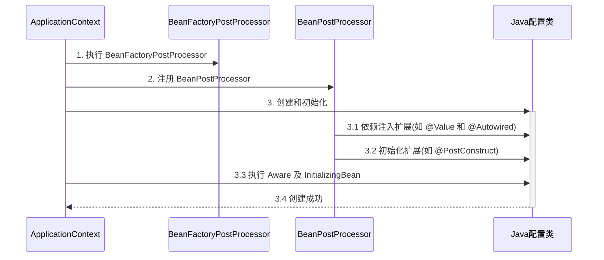
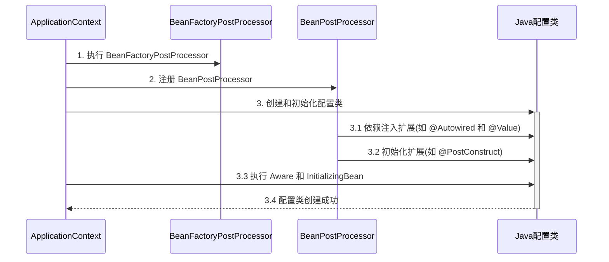
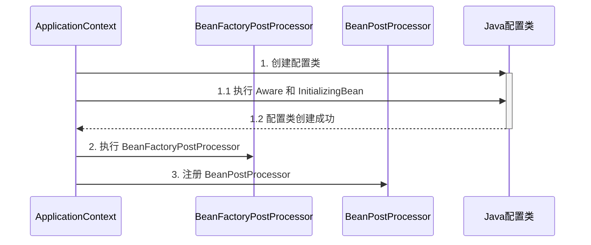

# Bean生命周期


**`BeanPostProcessor` 和 `InstantiationAwareBeanPostProcessor` 是两种重要的接口，它们允许开发者在 Bean 的生命周期中不同的阶段插入自定义逻辑，从而增强或修改 Bean 的行为。**

### 3) Bean 的生命周期

一个受 Spring 管理的 bean，生命周期主要阶段有

1. **创建：根据 bean 的构造方法或者工厂方法来创建 bean 实例对象**
2. **依赖注入：根据 @Autowired，@Value 或其它一些手段，为 bean 的成员变量填充值、建立关系**
3. **初始化：回调各种 Aware 接口，调用对象的各种初始化方法**
4. **销毁：在容器关闭时，会销毁所有单例对象（即调用它们的销毁方法）**
   * prototype 对象也能够销毁，不过需要容器这边主动调用

一些资料会提到，生命周期中还有一类 bean 后处理器：BeanPostProcessor，会在 bean 的初始化的前后，提供一些扩展逻辑。但这种说法是不完整的，见下面的演示1

```java
@FunctionalInterface
public interface BeanFactoryPostProcessor {
    void postProcessBeanFactory(ConfigurableListableBeanFactory var1) throws BeansException;
}
public interface BeanPostProcessor {
    @Nullable
    default Object postProcessBeforeInitialization(Object bean, String beanName) throws BeansException {
        return bean;
    }
    @Nullable
    default Object postProcessAfterInitialization(Object bean, String beanName) throws BeansException {
        return bean;
    } 
}
public interface InstantiationAwareBeanPostProcessor extends BeanPostProcessor {
    @Nullable
    default Object postProcessBeforeInstantiation(Class<?> beanClass, String beanName) throws BeansException {
        return null;
    }
    default boolean postProcessAfterInstantiation(Object bean, String beanName) throws BeansException {
        return true;
    }
    @Nullable
    default PropertyValues postProcessProperties(PropertyValues pvs, Object bean, String beanName) throws BeansException {
        return null;
    }
    /** @deprecated */
    @Deprecated
    @Nullable
    default PropertyValues postProcessPropertyValues(PropertyValues pvs, PropertyDescriptor[] pds, Object bean, String beanName) throws BeansException {
        return pvs;
    }
}

```

【beanfactory创建，创建beanfactoryProcessor，创建类的beandefination，执行beanfactoryProcessor的postProceesFactory（**ConfigurationClassPostProcessor** 实现@componentscan扫描的逻辑：CachingMetadataReaderFactory、读取Anotaionmetadata、读取ClassMetadata）、执行InstantiationAwareBeanPostProcessor的postProcessBeforeInstantiation方法、实例化bean、执行InstantiationAwareBeanPostProcessor的postProcessAfterInstantiation，执行postProcessProperties（@atuwired）、执行依赖注入，执行BeanPostProcessor的postProcessBeforeInitialization、执行aware和InitializingBean，执行init-method，@postconstuct方法进行初始化、执行BeanPostProcessor的postProcessAfterInstantiation【动态代理】】


```
这个流程描述的是 Spring 框架中从 `BeanFactory` 的创建、Bean 的实例化、依赖注入、初始化以及后处理器执行的完整过程。它涵盖了 `BeanFactoryPostProcessor`、`BeanPostProcessor`、`InstantiationAwareBeanPostProcessor`、`@Autowired` 依赖注入、`@PostConstruct` 初始化等关键步骤。不过，在此流程描述中有一些小问题或不清晰的地方，我将进行详细的检查并做出正确的解释。

### 1. **BeanFactory 创建**

`BeanFactory` 是 Spring 中最核心的接口，负责 Bean 的实例化、管理、依赖注入等操作。它是 `ApplicationContext` 的一部分。

- **问题**：描述中提到“创建 `BeanFactory`”。通常情况下，我们不会手动创建 `BeanFactory`，而是通过 `ApplicationContext`（例如 `AnnotationConfigApplicationContext` 或 `ClassPathXmlApplicationContext`）自动创建和管理它。
- **改正**：流程应为 “`ApplicationContext` 初始化 `BeanFactory`”。

### 2. **BeanFactoryPostProcessor 的创建与执行**

`BeanFactoryPostProcessor` 在 `BeanFactory` 完成初始化后、但在 Bean 实例化之前执行。它的作用是修改 Bean 的定义（`BeanDefinition`），例如添加 Bean 定义、修改 Bean 的属性等。

- **问题**：没有明确说明 `BeanFactoryPostProcessor` 是在所有 Bean 实例化之前执行的。
- **改正**：流程应强调 `BeanFactoryPostProcessor` 修改 Bean 定义，是在所有 Bean 实例化之前执行的。`BeanFactoryPostProcessor` 不直接创建 Bean 实例，而是操作 `BeanDefinition`。

### 3. **`BeanDefinition` 创建**

`BeanDefinition` 是 Spring 对 Bean 的抽象描述，包含了 Bean 的类、作用域、依赖关系、初始化方法、销毁方法等信息。`ConfigurationClassPostProcessor` 会解析 `@ComponentScan` 注解，扫描指定包中的组件，将其类解析为 `BeanDefinition`，并注册到 `BeanFactory` 中。

- **问题**：流程中提到“创建类的 `BeanDefinition`”，这里其实是指将类的元数据解析为 `BeanDefinition`，并注册到 `BeanFactory`。
- **改正**：应当说是“通过 `ConfigurationClassPostProcessor` 将类解析为 `BeanDefinition` 并注册到 `BeanFactory` 中”。

### 4. **`BeanFactoryPostProcessor` 的 `postProcessBeanFactory` 执行**

`BeanFactoryPostProcessor` 在 `BeanFactory` 初始化之后、Bean 实例化之前执行。在 `ConfigurationClassPostProcessor` 中，`postProcessBeanFactory` 的具体逻辑是解析 `@ComponentScan` 注解，通过 `CachingMetadataReaderFactory` 来高效读取类的元数据，使用 `AnnotationMetadata` 读取类上的注解，使用 `ClassMetadata` 读取类的名称、继承关系等信息。

- **问题**：描述中将 `postProcessBeanFactory` 和元数据读取的步骤略显混乱。
- **改正**：应该明确流程：“`ConfigurationClassPostProcessor` 在 `postProcessBeanFactory` 方法中，使用 `CachingMetadataReaderFactory` 读取类的元数据，通过 `AnnotationMetadata` 读取注解信息，通过 `ClassMetadata` 读取类的基础信息，生成 `BeanDefinition` 并注册到 `BeanFactory` 中”。

### 5. **`InstantiationAwareBeanPostProcessor` 的 `postProcessBeforeInstantiation` 执行**

`InstantiationAwareBeanPostProcessor` 是 `BeanPostProcessor` 的子接口，它在 Bean 实例化之前和之后都可以插入自定义逻辑。`postProcessBeforeInstantiation` 方法会在实例化 Bean 之前调用，允许开发者返回一个替代的 Bean 实例或代理对象。如果返回的对象不为 `null`，Spring 容器会跳过默认的实例化过程，直接使用这个返回的 Bean。

- **问题**：没有清楚表达 `postProcessBeforeInstantiation` 的作用是用于替代默认的实例化过程。
- **改正**：应该指出“`postProcessBeforeInstantiation` 方法的作用是允许返回一个自定义的 Bean 对象，若返回值不为 `null`，Spring 会跳过正常的实例化逻辑，使用返回的对象”。

### 6. **实例化 Bean**

如果 `postProcessBeforeInstantiation` 没有返回自定义的对象，Spring 会使用构造函数实例化 Bean。这一步是利用反射机制来调用构造函数创建 Bean 实例。

- **问题**：描述没有提到反射机制。
- **改正**：应强调“Spring 使用反射机制调用构造函数创建 Bean 实例”。

### 7. **`postProcessAfterInstantiation` 执行**

在 Bean 实例化完成后，`InstantiationAwareBeanPostProcessor` 的 `postProcessAfterInstantiation` 方法被调用。这一步允许开发者控制 Bean 的后续处理逻辑，返回 `false` 时可以跳过属性注入。

- **问题**：未提到 `postProcessAfterInstantiation` 可以通过返回 `false` 来跳过依赖注入。
- **改正**：应明确“`postProcessAfterInstantiation` 方法可以通过返回 `false` 来跳过依赖注入，允许开发者控制属性填充过程”。

### 8. **属性注入**

依赖注入发生在 Bean 实例化之后，Spring 会通过 `postProcessProperties` 来处理 `@Autowired`、`@Value` 等注解，将依赖的 Bean 注入到目标 Bean 中。

- **问题**：`postProcessProperties` 是处理依赖注入的关键步骤，但描述不够清晰。
- **改正**：应说明“`postProcessProperties` 方法负责处理依赖注入，通过读取 `@Autowired`、`@Value` 注解的字段或方法，将对应的依赖 Bean 注入”。

### 9. **执行 `BeanPostProcessor` 的 `postProcessBeforeInitialization`**

`BeanPostProcessor` 的 `postProcessBeforeInitialization` 方法在依赖注入之后、初始化方法（如 `@PostConstruct`）执行之前被调用。此方法允许开发者对 Bean 进行修改或替换。

- **问题**：这一过程未强调是“在初始化方法执行之前”。
- **改正**：应说明“`postProcessBeforeInitialization` 在初始化方法之前调用，可以用于对 Bean 进行进一步的定制”。

### 10. **执行 Aware 接口和 `InitializingBean`**

如果 Bean 实现了 `Aware` 接口，Spring 会通过相应的 `setXXX` 方法将容器的相关信息（如 `ApplicationContext` 或 `BeanFactory`）注入到 Bean 中。然后，Spring 调用 `InitializingBean` 的 `afterPropertiesSet()` 方法执行自定义的初始化逻辑。

- **问题**：这部分描述较为模糊，应该清楚解释 `Aware` 接口与 `InitializingBean` 的作用。
- **改正**：应详细说明“Spring 会在初始化过程中调用 `Aware` 接口的方法（如 `setApplicationContext`），以便 Bean 获取容器信息。随后，如果 Bean 实现了 `InitializingBean` 接口，会调用 `afterPropertiesSet()` 方法执行自定义的初始化逻辑”。

### 11. **执行初始化方法**

Spring 会执行配置的初始化方法，包括通过 `@PostConstruct` 注解标记的方法，或者通过 `init-method` 指定的初始化方法。

- **问题**：这里的描述略显简单。
- **改正**：应说明“Spring 会在依赖注入完成后，执行 `@PostConstruct` 注解标记的方法或 `init-method` 指定的方法，用于 Bean 的初始化逻辑”。

### 12. **执行 `BeanPostProcessor` 的 `postProcessAfterInitialization`**

在初始化方法完成之后，Spring 会调用 `BeanPostProcessor` 的 `postProcessAfterInitialization` 方法。这一步通常用于为 Bean 增加动态代理或者进行其他增强处理。

- **问题**：描述不够详细，特别是动态代理的作用。
- **改正**：应明确说明“`postProcessAfterInitialization` 通常用于为 Bean 增加 AOP 代理或者其他增强处理，这允许开发者在 Bean 完全初始化后添加横切逻辑”。

---

### **详细总结：完整的 Bean 创建与初始化流程**

1. **创建并初始化 `BeanFactory`**：`ApplicationContext` 会自动初始化 `BeanFactory`，容器开始加载配置类和 Bean 定义。
2. **执行 `BeanFactoryPostProcessor` 的 `postProcessBeanFactory`**：在所有 Bean 实例化之前，Spring 会执行 `BeanFactoryPostProcessor`，用于修改或扩展 Bean 的定义（`BeanDefinition`）。例如，`ConfigurationClassPostProcessor` 解析 `@ComponentScan` 注解，使用 `CachingMetadataReaderFactory` 读取类元数据（`AnnotationMetadata` 和 `ClassMetadata`），然后将解析出的 Bean 注册到容器中。
3. **注册 `BeanPostProcessor`**：Spring 注册所有的 `BeanPostProcessor`，这些处理器将在 Bean 实例化和初始化的不同阶段执行自定义逻辑。
4. **实例化 Bean**：在实例化 Bean 之前，Spring 首先调用 `InstantiationAwareBeanPostProcessor` 的 `postProcessBeforeInstantiation`

 方法。如果返回一个对象，Spring 会跳过实例化逻辑，直接使用该对象。否则，Spring 会通过反射机制实例化 Bean。
5. **执行 `InstantiationAwareBeanPostProcessor` 的 `postProcessAfterInstantiation`**：实例化之后，Spring 会调用 `postProcessAfterInstantiation` 方法，允许开发者决定是否继续进行属性注入。
6. **依赖注入**：Spring 通过 `postProcessProperties` 方法执行依赖注入，处理 `@Autowired`、`@Value` 等注解，注入所需的依赖 Bean。
7. **执行 `BeanPostProcessor` 的 `postProcessBeforeInitialization`**：在初始化之前，Spring 调用 `postProcessBeforeInitialization` 方法，对 Bean 进行进一步修改。
8. **执行 Aware 接口和 `InitializingBean`**：如果 Bean 实现了 `Aware` 接口或 `InitializingBean`，Spring 会分别调用相应的方法来注入容器信息并执行初始化逻辑。
9. **执行初始化方法**：Spring 执行 `@PostConstruct` 注解标记的方法或 `init-method`，完成 Bean 的初始化。
10. **执行 `BeanPostProcessor` 的 `postProcessAfterInitialization`**：在初始化完成后，Spring 调用 `postProcessAfterInitialization` 方法，常用于为 Bean 增加动态代理或其他增强功能。

通过这样详细的讨论，确保理解了 Spring 容器中从 `BeanDefinition` 到完全初始化 Bean 的完整流程。
```

### ImportBeanDefinitionRegistrar的执行时机

```
在 Spring 框架中，ImportBeanDefinitionRegistrar 和 ResourceLoaderAware 都属于特定的扩展点或接口，它们在 Spring 容器初始化的不同阶段执行。下面我来详细解释这两个接口的工作原理以及它们在哪一步被使用。

1. ImportBeanDefinitionRegistrar
ImportBeanDefinitionRegistrar 是一个扩展接口，允许用户在运行时向 Spring 容器手动注册额外的 BeanDefinition。它通常与 @Import 注解一起使用，可以在不使用 XML 配置的情况下，通过 Java 代码动态注册 Bean。ImportBeanDefinitionRegistrar 提供了一种非常灵活的方式来控制 Bean 的定义和注册过程。

工作原理：

当使用 @Import 注解导入某个类（通常是一个配置类）时，如果该类实现了 ImportBeanDefinitionRegistrar 接口，Spring 在解析该配置类时，会调用 ImportBeanDefinitionRegistrar 的 registerBeanDefinitions 方法。
registerBeanDefinitions 方法提供了 BeanDefinitionRegistry，允许开发者手动添加或修改 BeanDefinition。
属于哪一步：

ImportBeanDefinitionRegistrar 在 BeanFactoryPostProcessor 的 postProcessBeanFactory 执行之前 被使用。这是因为 ImportBeanDefinitionRegistrar 的目的是在 Spring 完成基础配置扫描和注解处理后，但在 BeanFactoryPostProcessor 进一步修改 BeanDefinition 之前，添加或修改 BeanDefinition。

所以，可以把 ImportBeanDefiniti
```


### 根据beandefinition反射创建bean

````
通过反射的方式将 `BeanDefinition` 对象实例化为具体的 Bean 对象是 Spring 容器创建 Bean 的核心步骤之一。`BeanDefinition` 本质上是一个 Spring 框架中用来描述 Bean 的元数据结构，它包含了关于 Bean 的类、构造函数、作用域、属性等信息。Spring 使用这些元数据，通过反射机制来实例化 Bean。

### 步骤 1: `BeanDefinition` 对象解析
`BeanDefinition` 是 Spring 中 Bean 的描述信息，它包含以下关键内容：
- **Bean Class**: Bean 的全限定类名，用于确定如何实例化 Bean。
- **Scope**: Bean 的作用域，通常为 `singleton` 或 `prototype`。
- **Property Values**: Bean 的属性列表，这些属性会在 Bean 实例化后进行注入。
- **Constructor Arguments**: 构造函数参数，用于调用构造函数时传入。

### 步骤 2: 实例化 Bean
Spring 容器根据 `BeanDefinition` 中提供的类信息，使用反射机制来实例化 Bean。Spring 使用 `Class.forName()` 方法加载 Bean 的类，然后使用 Java 的反射 API 调用构造函数来创建 Bean 实例。

```java
// 假设你有一个 BeanDefinition，其中包含了要实例化的类名
String className = beanDefinition.getBeanClassName();  // 从BeanDefinition中获取Bean的类名

try {
    // 通过反射加载类
    Class<?> beanClass = Class.forName(className);

    // 使用反射实例化类 (默认使用无参构造函数)
    Object beanInstance = beanClass.getDeclaredConstructor().newInstance();

    // Bean 实例化完成，后续可以进行属性注入和初始化等处理
    return beanInstance;
} catch (ClassNotFoundException | InstantiationException | IllegalAccessException | NoSuchMethodException | InvocationTargetException e) {
    throw new RuntimeException("Failed to create bean instance", e);
}
```

#### 详细解析：
1. **`Class.forName(className)`**: 加载给定类的字节码到 JVM 中，将其封装成 `Class` 对象。
2. **`getDeclaredConstructor().newInstance()`**: 通过反射调用类的无参构造函数实例化对象。Spring 会根据 `BeanDefinition` 中提供的构造函数参数（如果有），调用合适的构造函数。

### 步骤 3: 选择合适的构造函数
如果 `BeanDefinition` 中指定了构造函数参数，Spring 会选择适当的构造函数进行调用，而不是默认的无参构造函数。Spring 使用反射 API 查找与参数匹配的构造函数。

```java
Constructor<?> constructor = beanClass.getConstructor(parameterTypes);
Object beanInstance = constructor.newInstance(constructorArgs);
```

在这里，`parameterTypes` 是构造函数的参数类型数组，`constructorArgs` 是调用构造函数时传递的参数数组。

### 步骤 4: 属性注入
实例化 Bean 后，Spring 会根据 `BeanDefinition` 中的属性定义，为 Bean 注入依赖的属性。通常，Spring 使用 Java 反射中的 `Field` 或者 `Method` API 来完成依赖注入。

```java
// 示例: 通过反射为Bean的属性注入依赖
Field field = beanInstance.getClass().getDeclaredField("propertyName");
field.setAccessible(true);  // 允许访问私有字段
field.set(beanInstance, value);  // 为字段赋值
```

### 步骤 5: 初始化回调
当 Bean 实例化和属性注入完成后，Spring 会检查 Bean 是否实现了特定的接口（如 `InitializingBean`），或者是否有 `@PostConstruct` 注解的方法。如果有，Spring 会调用这些方法来完成初始化过程。

```java
// 示例: 调用实现了 InitializingBean 接口的afterPropertiesSet() 方法
if (beanInstance instanceof InitializingBean) {
    ((InitializingBean) beanInstance).afterPropertiesSet();
}
```

或者，Spring 会通过反射调用带有 `@PostConstruct` 注解的方法：
```java
Method postConstructMethod = beanInstance.getClass().getMethod("postConstructMethodName");
postConstructMethod.invoke(beanInstance);
```

### 步骤 6: 返回 Bean 实例
经过以上步骤，Spring 完成了 Bean 的创建、属性注入和初始化。最后，返回该 Bean 实例，供容器使用。

### 总结
通过反射实例化 Bean 的核心流程是：
1. **解析 `BeanDefinition`**：获取类的全限定名和其他相关信息。
2. **实例化 Bean**：使用反射创建类实例，调用合适的构造函数。
3. **注入属性**：通过反射将属性值注入到实例中。
4. **初始化**：调用初始化方法（如 `afterPropertiesSet` 或 `@PostConstruct`）。
5. **返回实例**：最终返回完成初始化的 Bean 实例。

Spring 使用反射的灵活性使其能够支持复杂的 Bean 生命周期管理，并允许开发者通过配置和注解实现解耦和自动化的依赖注入。
````


### afterPropertiesSet()`、`@PostConstruct` 和 `init-method的区别

````
是的，`afterPropertiesSet()`、`@PostConstruct` 和 `init-method` 都属于**初始化方法**，它们的作用都是在 Bean 完成依赖注入后对 Bean 进行一些自定义的初始化操作。但是，这三种初始化方法在实现方式、调用顺序、灵活性和使用场景上有一些区别。下面我会详细解释它们之间的不同。

### 1. **`afterPropertiesSet()` 方法**

- **来源**：`afterPropertiesSet()` 方法是 Spring 提供的 `InitializingBean` 接口中的一个方法。Bean 如果实现了这个接口，Spring 容器在依赖注入完成后会自动调用该方法。
- **调用时机**：在依赖注入完成之后、执行 `@PostConstruct` 之前调用。
- **使用方式**：通过实现 `InitializingBean` 接口的方式定义，属于一种“接口驱动”的方式。
  
#### **特点**：
- **紧耦合**：Bean 类需要直接实现 `InitializingBean` 接口，导致与 Spring 框架存在耦合。这意味着你的代码依赖于 Spring 的接口，无法在不依赖 Spring 的情况下运行。
- **明确性**：`afterPropertiesSet()` 方法由接口定义，因此很容易查看该类是否需要执行初始化逻辑。
- **优先级较低**：在初始化阶段，这个方法在 `@PostConstruct` 之前执行，但在 `init-method` 之前。

#### 示例：
```java
public class MyBean implements InitializingBean {
    @Override
    public void afterPropertiesSet() throws Exception {
        System.out.println("Initializing using afterPropertiesSet()");
    }
}
```

### 2. **`@PostConstruct` 注解**

- **来源**：`@PostConstruct` 是 JSR-250 标准中的注解，是 Java EE 和 Spring 都支持的一种标准化的初始化方式。
- **调用时机**：在依赖注入完成后调用，比 `afterPropertiesSet()` 更早，比 `init-method` 更晚。
- **使用方式**：只需在一个无参方法上添加 `@PostConstruct` 注解，Spring 会在 Bean 初始化时自动调用该方法。

#### **特点**：
- **解耦**：`@PostConstruct` 是 Java 标准化的注解，它不依赖 Spring，因此 Bean 仍然可以在不使用 Spring 的环境中运行（如 Java EE 容器）。
- **便于维护**：通过注解驱动初始化逻辑，不需要实现任何接口，代码更简洁。
- **优先级较高**：`@PostConstruct` 的方法会在 `afterPropertiesSet()` 之后但在 `init-method` 之前执行。

#### 示例：
```java
@Component
public class MyBean {
    @PostConstruct
    public void init() {
        System.out.println("Initializing using @PostConstruct");
    }
}
```

### 3. **`init-method`**

- **来源**：`init-method` 是 Spring 的 XML 或 Java 配置文件中的一种方式，用于定义初始化方法。它是在 `@Bean` 注解或者 XML 配置中指定的。
- **调用时机**：在 `afterPropertiesSet()` 和 `@PostConstruct` 之后执行。
- **使用方式**：在 Spring 配置文件（XML 或 Java 配置类）中配置的初始化方法。

#### **特点**：
- **灵活性高**：使用 `init-method` 时，你不需要让 Bean 实现任何接口，也不需要在类中添加特定的注解。初始化方法名可以是任意的，不受限制。
- **配置驱动**：可以通过外部配置文件或 Java 配置来定义初始化方法，不需要修改类的代码。
- **优先级最低**：`init-method` 是最后执行的初始化方法，它比 `afterPropertiesSet()` 和 `@PostConstruct` 运行得晚。

#### 示例：
```java
@Configuration
public class AppConfig {
    @Bean(initMethod = "customInit")
    public MyBean myBean() {
        return new MyBean();
    }
}

public class MyBean {
    public void customInit() {
        System.out.println("Initializing using init-method");
    }
}
```

### **调用顺序**
当一个 Bean 依次实现了 `InitializingBean`、使用了 `@PostConstruct`，并在配置文件中定义了 `init-method`，它们的调用顺序如下：

1. **`afterPropertiesSet()`**：通过实现 `InitializingBean` 接口定义的初始化方法。
2. **`@PostConstruct`**：Java 标准注解驱动的初始化方法。
3. **`init-method`**：在 Spring 的配置文件（Java 配置类或 XML 文件）中定义的初始化方法。

### **对比总结**

| **初始化方式**        | **来源**                   | **调用时机**            | **灵活性**              | **耦合度**              |
|-------------------|------------------------|---------------------|---------------------|---------------------|
| `afterPropertiesSet()` | Spring 提供的 `InitializingBean` 接口 | 最早，依赖注入后调用       | 较低，必须实现接口          | 高，与 Spring 耦合         |
| `@PostConstruct`   | Java 标准注解，JSR-250       | 比 `afterPropertiesSet()` 晚，但比 `init-method` 早 | 中，使用注解定义方法        | 低，标准化注解，无需实现接口    |
| `init-method`      | Spring 配置（XML 或 Java 配置）| 最晚，所有初始化方法之后调用   | 高，方法名灵活，通过外部配置指定 | 低，通过配置指定，无需修改类代码  |

### **选择建议**
- **如果你希望解耦 Bean 与 Spring**，建议使用 `@PostConstruct`，因为这是标准化的注解。
- **如果你不想引入注解或修改代码**，而想通过外部配置文件控制初始化逻辑，可以使用 `init-method`。
- **如果你希望使用 Spring 特定的功能，并且愿意让你的类实现 Spring 的接口**，可以使用 `afterPropertiesSet()`。

---

### 总结

虽然 `afterPropertiesSet()`、`@PostConstruct` 和 `init-method` 都用于初始化 Bean，但它们的来源和实现方式不同，调用时机也有所不同。`afterPropertiesSet()` 来自 Spring 的接口，`@PostConstruct` 是 Java 标准注解，而 `init-method` 则是 Spring 配置文件中的一个选项。根据需求的不同，你可以选择最适合的初始化方法。
````


#### 演示1 - bean 生命周期

##### 代码参考 

**com.itheima.a03** 包


**【创建前后的增强】**

* postProcessBeforeInstantiation
  * **这里返回的对象若不为 null 会替换掉原本的 bean，并且仅会走 postProcessAfterInitialization 流程**
* postProcessAfterInstantiation
  * 这里如果**返回 false 会跳过依赖注入阶段**

**【依赖注入前的增强】**

* postProcessProperties
  * 如 @Autowired、@Value、@Resource 

**[初始化前后的增强]**

* postProcessBeforeInitialization
  * 这里返回的对象会替换掉原本的 bean
  * 如 @PostConstruct、@ConfigurationProperties
* postProcessAfterInitialization 
  * 这里返回的对象会替换掉原本的 bean
  * 如代理增强

**[销毁之前的增强]**

* postProcessBeforeDestruction
  * 如 @PreDestroy 

#### 收获💡

1. Spring bean 生命周期各个阶段
2. 模板设计模式, 指大流程已经固定好了, 通过接口回调（bean 后处理器）在一些关键点前后提供扩展

```
在 Spring 框架中，`BeanPostProcessor` 和 `InstantiationAwareBeanPostProcessor` 是两种重要的接口，它们允许开发者在 Bean 的生命周期中不同的阶段插入自定义逻辑，从而增强或修改 Bean 的行为。

接下来，我将详细解释这些增强方法的工作原理、执行时机及其用途，并结合你列出的增强点进行详细说明。

### 1. **创建前后的增强**

#### `postProcessBeforeInstantiation`
- **方法签名**：
  ```java
  Object postProcessBeforeInstantiation(Class<?> beanClass, String beanName) throws BeansException;
```

- **执行时机**：[在 Bean 实例化（即通过构造函数创建 Bean 实例）之前调用，提供一个机会来返回一个替代的 Bean 实例。]

- **核心功能**：

  - 如果这个方法返回的对象不为 `null`，这个返回的对象将**直接替换掉原来的 Bean**。即，Spring 容器不会继续创建原来的 Bean 实例。
  - 此时，Spring 仅会执行 `postProcessAfterInitialization` 方法，而不会执行其他生命周期方法（如属性注入、初始化方法等），这可以让开发者完全掌控 Bean 的创建逻辑。

- **应用场景**：
  你可以在这里直接返回一个已经存在的单例对象，或者返回一个代理对象来替代原来的 Bean，从而完全改变 Bean 的创建逻辑。

  ```java
  @Override
  public Object postProcessBeforeInstantiation(Class<?> beanClass, String beanName) throws BeansException {
      if (beanClass == SomeClass.class) {
          // 返回一个代理对象或完全不同的对象，替代原来的 Bean
          return Proxy.newProxyInstance(beanClass.getClassLoader(), beanClass.getInterfaces(), new CustomInvocationHandler());
      }
      return null;  // 返回 null 表示不替换 Bean，继续走正常创建流程
  }
  ```

#### `postProcessAfterInstantiation`

- **方法签名**：

  ```java
  boolean postProcessAfterInstantiation(Object bean, String beanName) throws BeansException;
  ```

- **执行时机**：在 Bean 实例化之后、依赖注入之前执行。此时，Bean 已经被创建，但是还没有进行属性的填充。

- **核心功能**：

  - 如果该方法返回 `false`，Spring 将跳过该 Bean 的依赖注入阶段（包括注入通过 `@Autowired`、`@Value`、`@Resource` 等注解的属性）。
  - 【这个方法可以用来控制是否允许 Spring 进行依赖注入，从而提供对 Bean 更加精细的控制。】

- **应用场景**：
  如果你需要跳过某些特殊 Bean 的依赖注入过程，可以在此处返回 `false`。例如，对于某些 Bean，你可能希望手动进行依赖注入，而不是让 Spring 自动完成。

  ```java
  @Override
  public boolean postProcessAfterInstantiation(Object bean, String beanName) throws BeansException {
      if (bean instanceof CustomBean) {
          // 跳过依赖注入
          return false;
      }
      return true;  // 允许正常的依赖注入流程
  }
  ```

### 2. **依赖注入前的增强**

#### `postProcessProperties`

- **方法签名**：

  ```java
  PropertyValues postProcessProperties(PropertyValues pvs, Object bean, String beanName) throws BeansException;
  ```

- **执行时机**：在依赖注入之前执行。此时，Bean 已经被实例化，Spring 正准备将配置的属性值注入到该 Bean 中。

- **核心功能**：

  - 该方法允许开发者在依赖注入之前对 Bean 的属性进行增强和修改，例如为某些属性手动注入值，或者拦截 `@Autowired`、`@Value` 等注解的处理过程。
  - 典型的处理器如 `AutowiredAnnotationBeanPostProcessor` 就是在这个阶段对 `@Autowired` 注解进行处理的。

- **应用场景**：
  你可以通过这个方法实现类似于依赖注入的控制。例如，你可以在这个方法中为 Bean 的某些字段手动设置值，而不依赖 Spring 自动的依赖注入逻辑。

  ```java
  @Override
  public PropertyValues postProcessProperties(PropertyValues pvs, Object bean, String beanName) throws BeansException {
      if (bean instanceof CustomBean) {
          // 手动为某个属性注入值
          MutablePropertyValues mpvs = (MutablePropertyValues) pvs;
          mpvs.add("customProperty", "customValue");
      }
      return pvs;  // 返回修改后的属性值
  }
  ```

### 3. **初始化前后的增强**

#### `postProcessBeforeInitialization`

- **方法签名**：

  ```java
  Object postProcessBeforeInitialization(Object bean, String beanName) throws BeansException;
  ```

- **执行时机**：在 Bean 完成属性注入后、调用初始化方法之前执行。

- **核心功能**：

  - 你可以在这个阶段对 Bean 进行任何额外的修改，比如对某些属性进行校验，或者为某些属性设置默认值。
  - 【如果该方法返回的对象不为 `null`，则这个返回的对象将替换原本的 Bean。】

- **应用场景**：
  【 典型的场景包括初始化前对某些 Bean 进行增强、添加初始化前的校验逻辑、处理 `@PostConstruct` 注解等。】

  ```java
  @Override
  public Object postProcessBeforeInitialization(Object bean, String beanName) throws BeansException {
      if (bean instanceof CustomBean) {
          System.out.println("Initializing CustomBean");
          // 你可以在此处为 CustomBean 设置一些默认属性
      }
      return bean;  // 返回修改后的 Bean 实例，或者替换整个 Bean
  }
  ```

#### `postProcessAfterInitialization`

- **方法签名**：

  ```java
  Object postProcessAfterInitialization(Object bean, String beanName) throws BeansException;
  ```

- **执行时机**：在 Bean 完成初始化方法（如 `afterPropertiesSet` 或 `init-method`）之后执行。

- **核心功能**：

  - 这个方法是动态代理、AOP 等增强功能的核心。它允许你在 Bean 完成初始化之后为其创建代理对象、增强其功能。
  - 【返回的对象可以是一个代理对象，或者任何其他增强后的对象，如果返回的对象不为 `null`，它将替换原本的 Bean。】

- **应用场景**：
  通常用来为 Bean 添加 AOP 代理或其他增强功能。例如，可以通过动态代理为 Bean 增加方法调用的日志记录、性能监控等。

  ```java
  @Override
  public Object postProcessAfterInitialization(Object bean, String beanName) throws BeansException {
      if (bean instanceof CustomService) {
          return Proxy.newProxyInstance(
              bean.getClass().getClassLoader(),
              bean.getClass().getInterfaces(),
              (proxy, method, args) -> {
                  System.out.println("Logging before method: " + method.getName());
                  Object result = method.invoke(bean, args);
                  System.out.println("Logging after method: " + method.getName());
                  return result;
              }
          );
      }
      return bean;  // 如果不需要代理，直接返回原来的 Bean
  }
  ```

### 4. **销毁之前的增强**

#### `postProcessBeforeDestruction`

- **方法签名**：

  ```java
  void postProcessBeforeDestruction(Object bean, String beanName) throws BeansException;
  ```

- **执行时机**：在 Bean 被销毁之前调用。此方法允许你在 Bean 被销毁之前执行一些清理操作。

- **核心功能**：

  - 你可以在这个阶段执行诸如资源释放、关闭连接、保存状态等操作，以确保在 Bean 销毁时能够安全地释放所有外部资源。
  - 处理诸如 `@PreDestroy` 注解的场景。

- **应用场景**：
  典型的场景是为某些 Bean 执行销毁前的清理操作，确保资源得到释放。例如，关闭数据库连接、停止线程池等。

  ```java
  @Override
  public void postProcessBeforeDestruction(Object bean, String beanName) throws BeansException {
      if (bean instanceof CustomResource) {
          ((CustomResource) bean).close();
          System.out.println("Cleaning up resources for bean: " + beanName);
      }
  }
  ```

### 总结

1. **创建前后的增强**：通过 `postProcessBeforeInstantiation` 可以完全替换掉原 Bean，`postProcessAfterInstantiation` 则用于控制是否允许 Spring 进行依赖注入。

2. **依赖注入前的增强**：通过 `postProcessProperties`，你可以修改 Bean 的属性，甚至手动进行依赖注入或阻止 Spring 的自动注入。

3. **初始化前后的增强**：通过 `postProcessBeforeInitialization` 和 `postProcessAfterInitialization`，你可以对 Bean 进行初始化前后的增强，包括添加代理、日志记录、校验逻辑等。

4. **销毁之前的增强**：通过 `postProcess


```


```java
package com.itheima.a03;

import org.slf4j.Logger;
import org.slf4j.LoggerFactory;
import org.springframework.beans.BeansException;
import org.springframework.beans.PropertyValues;
import org.springframework.beans.factory.config.DestructionAwareBeanPostProcessor;
import org.springframework.beans.factory.config.InstantiationAwareBeanPostProcessor;
import org.springframework.stereotype.Component;

@Component
public class MyBeanPostProcessor implements InstantiationAwareBeanPostProcessor, DestructionAwareBeanPostProcessor {

    private static final Logger log = LoggerFactory.getLogger(MyBeanPostProcessor.class);

    @Override
    public void postProcessBeforeDestruction(Object bean, String beanName) throws BeansException {
        if (beanName.equals("lifeCycleBean"))
            log.debug("<<<<<< 销毁之前执行, 如 @PreDestroy");
    }

    @Override
    public Object postProcessBeforeInstantiation(Class<?> beanClass, String beanName) throws BeansException {
        if (beanName.equals("lifeCycleBean"))
            log.debug("<<<<<< 实例化之前执行, 这里返回的对象会替换掉原本的 bean");
        return null;
    }

    @Override
    public boolean postProcessAfterInstantiation(Object bean, String beanName) throws BeansException {
        if (beanName.equals("lifeCycleBean")) {
            log.debug("<<<<<< 实例化之后执行, 这里如果返回 false 会跳过依赖注入阶段");
//            return false;
        }
        return true;
    }

    @Override
    public PropertyValues postProcessProperties(PropertyValues pvs, Object bean, String beanName) throws BeansException {
        if (beanName.equals("lifeCycleBean"))
            log.debug("<<<<<< 依赖注入阶段执行, 如 @Autowired、@Value、@Resource");
        return pvs;
    }

    @Override
    public Object postProcessBeforeInitialization(Object bean, String beanName) throws BeansException {
        if (beanName.equals("lifeCycleBean"))
            log.debug("<<<<<< 初始化之前执行, 这里返回的对象会替换掉原本的 bean, 如 @PostConstruct、@ConfigurationProperties");
        return bean;
    }

    @Override
    public Object postProcessAfterInitialization(Object bean, String beanName) throws BeansException {
        if (beanName.equals("lifeCycleBean"))
            log.debug("<<<<<< 初始化之后执行, 这里返回的对象会替换掉原本的 bean, 如代理增强");
        return bean;
    }
}

```


#### 演示2 - 模板方法设计模式

##### 关键代码

```java
public class TestMethodTemplate {

    public static void main(String[] args) {
        MyBeanFactory beanFactory = new MyBeanFactory();
        beanFactory.addBeanPostProcessor(bean -> System.out.println("解析 @Autowired"));
        beanFactory.addBeanPostProcessor(bean -> System.out.println("解析 @Resource"));
        beanFactory.getBean();
    }

    // 模板方法  Template Method Pattern
    static class MyBeanFactory {
        public Object getBean() {
            Object bean = new Object();
            System.out.println("构造 " + bean);
            System.out.println("依赖注入 " + bean); // @Autowired, @Resource
            for (BeanPostProcessor processor : processors) {
                processor.inject(bean);
            }
            System.out.println("初始化 " + bean);
            return bean;
        }

        private List<BeanPostProcessor> processors = new ArrayList<>();

        public void addBeanPostProcessor(BeanPostProcessor processor) {
            processors.add(processor);
        }
    }
    
    static interface BeanPostProcessor {
        public void inject(Object bean); // 对依赖注入阶段的扩展
    }
}
```


#### 演示3 - bean 后处理器排序

##### 代码参考 

**com.itheima.a03.TestProcessOrder**

#### 收获💡

1. 实现了 PriorityOrdered 接口的优先级最高
2. 实现了 Ordered 接口与加了 @Order 注解的平级, 按数字升序
3. 其它的排在最后


### 4) Bean 后处理器

#### 演示1 - 后处理器作用

##### 代码参考 

**com.itheima.a04** 包

#### 收获💡

1. @Autowired 等注解的解析属于 bean 生命周期阶段（依赖注入, 初始化）的扩展功能，这些扩展功能由 bean 后处理器来完成
2. 每个后处理器各自增强什么功能
   * AutowiredAnnotationBeanPostProcessor **解析 @Autowired 与 @Value**
   * CommonAnnotationBeanPostProcessor 解析 **@Resource、@PostConstruct、@PreDestroy**
   * ConfigurationPropertiesBindingPostProcessor 解析 @ConfigurationProperties
3. 另外 ContextAnnotationAutowireCandidateResolver 负责获取 @Value 的值，解析 @Qualifier、泛型、@Lazy 等


#### 演示2 - @Autowired bean 后处理器运行分析

##### 代码参考 

**com.itheima.a04.DigInAutowired**

#### 收获💡

1. **AutowiredAnnotationBeanPostProcessor.findAutowiringMetadata [用来获取某个 bean 上加了 @Value @Autowired 的成员变量，方法参数的信息，表示为 InjectionMetadata]**
2. InjectionMetadata 可以完成依赖注入
3. InjectionMetadata 内部根据成员变量，方法参数封装为 DependencyDescriptor 类型
4. 有了 DependencyDescriptor，就可以利用 beanFactory.doResolveDependency 方法进行基于类型的查找

````
你提出了一个非常好的问题。乍看之下，`@Autowired` 注解的处理器 `AutowiredAnnotationBeanPostProcessor` 和 `BeanPostProcessor` 的执行时机之间似乎存在矛盾，因为 `BeanPostProcessor` 在 Bean 的初始化过程中被调用，而依赖注入看起来应在此之前完成。

实际上，`AutowiredAnnotationBeanPostProcessor` 的工作机制与 `BeanPostProcessor` 的执行流程并不冲突。原因在于，`AutowiredAnnotationBeanPostProcessor` 并不仅仅依赖 `postProcessAfterInitialization` 或 `postProcessBeforeInitialization` 来进行依赖注入，而是使用了更早的扩展机制，下面我详细解释一下。

### 1. `AutowiredAnnotationBeanPostProcessor` 的作用
`AutowiredAnnotationBeanPostProcessor` 是 Spring 框架中的一个专用处理器，专门用于处理 `@Autowired` 注解。它的任务是查找 Spring 管理的 Bean 中标注了 `@Autowired` 的字段、方法或构造函数，然后通过依赖注入的方式将其他 Bean 注入到这些字段、方法或构造函数中。

但正如你所说，`BeanPostProcessor` 通常在 Bean 初始化阶段调用，而依赖注入应该发生在 Bean 实例化之后、初始化之前，这种依赖注入的顺序与 Bean 初始化时 `BeanPostProcessor` 参与的顺序确实有所不同。

### 2. Spring 的 Bean 生命周期与 `BeanPostProcessor` 的执行顺序

为了理解这个问题，我们需要回顾 Spring 中 Bean 的生命周期：

1. **实例化（Instantiation）**：Spring 通过构造函数或工厂方法创建 Bean 的实例。
2. **属性注入（Property Population / Dependency Injection）**：在实例化之后，Spring 会通过依赖注入的机制为 Bean 的字段、方法等属性赋值。此时，如果 Bean 上标注了 `@Autowired` 注解，Spring 就会根据上下文找到相应的 Bean，并将其注入。
3. **初始化（Initialization）**：在 Bean 属性注入完成之后，Spring 会调用 Bean 的初始化方法，比如 `InitializingBean` 接口的 `afterPropertiesSet` 方法或 XML/注解配置的 `init-method`。
4. **后置处理器的处理（BeanPostProcessor）**：Spring 在初始化方法调用的前后分别会调用 `BeanPostProcessor` 的 `postProcessBeforeInitialization` 和 `postProcessAfterInitialization` 方法。

### 3. `AutowiredAnnotationBeanPostProcessor` 的执行时机

`AutowiredAnnotationBeanPostProcessor` 实现了 `InstantiationAwareBeanPostProcessor` 接口，这是 `BeanPostProcessor` 的子接口，它提供了更多的扩展点，使得它能够在 Bean 的生命周期中更早地介入。
`InstantiationAwareBeanPostProcessor` 中最重要的两个方法是：
- **`postProcessBeforeInstantiation`**：在 Bean 实例化之前调用。
- **`postProcessAfterInstantiation`**：在 Bean 实例化之后、属性赋值之前调用。

而 `AutowiredAnnotationBeanPostProcessor` 正是利用了 `postProcessProperties` 方法，该方法在 Bean 实例化之后、依赖注入之前被调用。Spring 使用这个机制在 Bean 的属性被设置之前处理 `@Autowired` 注解，从而完成依赖注入。

```java
@Override
public PropertyValues postProcessProperties(PropertyValues pvs, Object bean, String beanName) throws BeansException {
    // 解析 @Autowired 注解，并完成依赖注入
    InjectionMetadata metadata = findAutowiringMetadata(beanName, bean.getClass(), pvs);
    try {
        metadata.inject(bean, beanName, pvs);
    } catch (Throwable ex) {
        throw new BeanCreationException(beanName, "Injection of autowired dependencies failed", ex);
    }
    return pvs;
}
```

这个方法会在依赖注入之前执行，确保 `@Autowired` 注解的依赖能够在其他 BeanPostProcessor 处理之前完成注入。因此，依赖注入实际上发生在 `BeanPostProcessor` 的 `postProcessBeforeInitialization` 之前。

### 4. 为什么 `AutowiredAnnotationBeanPostProcessor` 不冲突？
这就解释了为什么 `AutowiredAnnotationBeanPostProcessor` 并不与 `BeanPostProcessor` 的执行时机冲突。总结如下：
- **`AutowiredAnnotationBeanPostProcessor`** 继承了 `InstantiationAwareBeanPostProcessor`，其核心工作是在属性注入阶段之前进行的，即 Bean 实例化后、依赖注入之前。
- 通过 `postProcessProperties` 方法，`AutowiredAnnotationBeanPostProcessor` 可以在 Bean 初始化之前处理 `@Autowired` 注解，并完成依赖注入。
- 依赖注入完成后，Spring 才会调用 `postProcessBeforeInitialization` 和 `postProcessAfterInitialization` 方法，继续对 Bean 进行初始化。
因此，`AutowiredAnnotationBeanPostProcessor` 不会与 `BeanPostProcessor` 的执行顺序产生冲突，因为它的核心功能在依赖注入阶段已经完成，而 `BeanPostProcessor` 主要作用于 Bean 初始化前后。

### 5. `InstantiationAwareBeanPostProcessor` 的作用
为了更好地理解 `AutowiredAnnotationBeanPostProcessor` 的执行时机，了解 `InstantiationAwareBeanPostProcessor` 的作用非常重要。`InstantiationAwareBeanPostProcessor` 扩展了 `BeanPostProcessor`，增加了更多的回调方法，用于在 Bean 实例化和依赖注入的不同阶段进行处理：
- **`postProcessBeforeInstantiation`**：在 Bean 实例化之前调用。
- **`postProcessAfterInstantiation`**：在 Bean 实例化之后调用，但在属性赋值之前。
- **`postProcessProperties`**：在属性赋值之前，用于处理依赖注入（这就是 `AutowiredAnnotationBeanPostProcessor` 主要使用的方法）。
- **`postProcessBeforeInitialization` 和 `postProcessAfterInitialization`**：这两个方法继承自 `BeanPostProcessor`，分别在初始化方法调用的前后被执行。

### 6. 总结
- `BeanPostProcessor` 是在 Bean 初始化前后调用的，它用于为 Bean 提供初始化后的扩展处理。
- `AutowiredAnnotationBeanPostProcessor` 并不单单依赖 `BeanPostProcessor` 的机制，它实现了 `InstantiationAwareBeanPostProcessor`，能够在依赖注入阶段之前完成 `@Autowired` 注解的处理。
- 因此，依赖注入发生在 `postProcessBeforeInitialization` 之前，并不会与 Bean 的初始化顺序产生冲突。

通过这种机制，Spring 能够确保在 Bean 的初始化过程中的各个阶段都能够灵活地插入自定义逻辑，满足各种复杂的依赖管理和生命周期管理需求。
````


### 5) BeanFactory 后处理器

#### 演示1 - BeanFactory 后处理器的作用

##### 代码参考

**com.itheima.a05** 包

* **ConfigurationClassPostProcessor** 可以解析
  * @ComponentScan
  * @Bean
  * @Import
  * @ImportResource
* MapperScannerConfigurer 可以解析
  * Mapper 接口

#### 收获💡

1. @ComponentScan, @Bean, @Mapper 等注解的解析属于核心容器（即 BeanFactory）的扩展功能
2. 这些扩展功能由不同的 BeanFactory 后处理器来完成，其实主要就是补充了一些 bean 定义


#### 演示2 - 模拟解析 @ComponentScan

##### 代码参考 

**com.itheima.a05.ComponentScanPostProcessor**

#### 收获💡

1. Spring 操作元数据的工具类 CachingMetadataReaderFactory
2. 通过注解元数据（AnnotationMetadata）获取直接或间接标注的注解信息
3. 通过类元数据（ClassMetadata）获取类名，AnnotationBeanNameGenerator 生成 bean 名
4. 解析元数据是基于 ASM 技术

```
1. BeanFactory 后处理器（BeanFactoryPostProcessor）的作用
BeanFactoryPostProcessor 是 Spring 中用于修改 BeanFactory 的一个重要接口，它允许开发者在 BeanFactory 完成初始化之后、但在实际创建 Bean 实例之前，对 BeanFactory 中的 Bean 定义进行修改或扩展。BeanFactoryPostProcessor 的核心功能是为 Bean 的定义提供额外的处理逻辑，这种处理通常涉及到 Bean 的元数据。

BeanFactoryPostProcessor 的常见应用场景包括解析注解、动态注册 Bean 定义、修改现有的 Bean 定义属性等。以下是对 BeanFactory 后处理器的具体演示和详细解释。

2. 演示 1 - BeanFactoryPostProcessor 的作用
ConfigurationClassPostProcessor

在 Spring 框架中，ConfigurationClassPostProcessor 是一个典型的 BeanFactoryPostProcessor 实现，它的主要功能是解析 Spring 的核心注解，如：

@ComponentScan：用于扫描指定包中的组件并注册为 Spring Bean。
@Bean：用于在配置类中显式声明 Bean 的创建方法。
@Import：用于引入其他配置类或 Bean 定义。
@ImportResource：用于引入外部 XML 配置文件。
ConfigurationClassPostProcessor 负责在容器初始化时解析这些注解，并将相应的 Bean 定义注册到 BeanFactory 中。例如，通过 @ComponentScan 注解，Spring 会扫描指定包下的类并将标注了 @Component 的类注册为 Bean。

MapperScannerConfigurer

在使用 MyBatis 框架时，MapperScannerConfigurer 是一个用于自动扫描 Mapper 接口的 BeanFactoryPostProcessor。它会解析 Mapper 接口，并为每个 Mapper 创建一个代理对象，将其注册为 Spring Bean，方便与数据库进行交互。

收获💡

@ComponentScan, @Bean, @Mapper 等注解解析是核心容器（BeanFactory）的扩展功能：
Spring 的核心容器可以通过 BeanFactoryPostProcessor 来扩展功能，动态解析和注册 Bean 定义。
这些注解本身并不直接生成 Bean，而是通过后处理器在 BeanFactory 初始化时为容器增加新的 Bean 定义。
这些扩展功能是通过不同的 BeanFactoryPostProcessor 完成的：
ConfigurationClassPostProcessor 负责解析 Spring 框架中的核心注解。
MapperScannerConfigurer 负责解析 MyBatis 的 Mapper 接口并自动生成代理对象。
3. 演示 2 - 模拟解析 @ComponentScan
ComponentScanPostProcessor

为了深入理解 BeanFactoryPostProcessor 的作用，接下来通过 ComponentScanPostProcessor 模拟实现 @ComponentScan 的解析过程。

假设我们通过自定义的 ComponentScanPostProcessor 来实现组件扫描，并注册 Bean。

核心步骤：

CachingMetadataReaderFactory 操作元数据：
Spring 使用 CachingMetadataReaderFactory 来缓存和读取类的元数据。这个工具类能够高效地读取类的字节码信息，并从中提取注解元数据和类元数据。
它通过 ASM（一个操作 Java 字节码的框架）来读取类的字节码文件，从而快速获取类的注解、类名、继承关系等信息，而无需加载类到内存中。
AnnotationMetadata 提取注解信息：
AnnotationMetadata 是 Spring 用来封装类上所有注解信息的对象。它允许开发者访问类直接或间接标注的注解。
通过 AnnotationMetadata，我们可以确定一个类是否标注了 @Component，并根据这个信息将类注册为 Spring Bean。
ClassMetadata 提取类信息：
ClassMetadata 负责提供类的基本信息，如类名、包名、父类、接口等。
ClassMetadata 在 Bean 名称生成时非常有用。Spring 使用 AnnotationBeanNameGenerator 类来基于类元数据生成默认的 Bean 名称。
ASM 技术：
ASM 是一个用于分析和修改 Java 字节码的框架，Spring 通过 ASM 来读取类的元数据，而无需真正加载类到 JVM 中。这极大提高了 Spring 在处理注解、类元数据时的效率。
使用 ASM 使得 Spring 能够在运行时读取类文件中的字节码信息，并提取出类和注解的详细信息。
收获💡

CachingMetadataReaderFactory 的作用：
CachingMetadataReaderFactory 能高效读取类的字节码并提取元数据，这是 Spring 在进行组件扫描、注解解析时的核心工具。
注解元数据的解析：
AnnotationMetadata 提供了对类上注解信息的访问功能，使得 Spring 可以基于注解来动态决定 Bean 的注册。
通过注解元数据，可以访问直接或间接标注的注解，确定类是否需要被注册为 Bean。
类元数据的解析：
ClassMetadata 提供了类的基础信息，用于生成 Bean 的名称和处理类的继承关系。通过 AnnotationBeanNameGenerator，可以为每个类自动生成唯一的 Bean 名称。
ASM 技术的应用：
ASM 提供了操作字节码的能力，帮助 Spring 高效解析类的元数据，而无需将类加载到 JVM 中。它是注解和类信息解析的基础技术。

```


#### 演示3 - 模拟解析 @Bean

##### 代码参考 

**com.itheima.a05.AtBeanPostProcessor**

#### 收获💡

1. 进一步熟悉注解元数据（AnnotationMetadata）获取方法上注解信息


#### 演示4 - 模拟解析 Mapper 接口

##### 代码参考 

**com.itheima.a05.MapperPostProcessor**

#### 收获💡

1. Mapper 接口被 Spring 管理的本质：实际是被作为 MapperFactoryBean 注册到容器中
2. Spring 的诡异做法，根据接口生成的 BeanDefinition 仅为根据接口名生成 bean 名


### 6) Aware 接口

#### 演示 - Aware 接口及 InitializingBean 接口

##### 代码参考 

**com.itheima.a06** 包

#### 收获💡

1. Aware 接口提供了一种【内置】 的注入手段，例如
   * BeanNameAware 注入 bean 的名字
   * BeanFactoryAware 注入 BeanFactory 容器
   * ApplicationContextAware 注入 ApplicationContext 容器
   * EmbeddedValueResolverAware 注入 ${} 解析器
2. InitializingBean 接口提供了一种【内置】的初始化手段
3. 对比
   * 内置的注入和初始化不受扩展功能的影响，总会被执行
   * 而扩展功能受某些情况影响可能会失效
   * 因此 Spring 框架内部的类常用内置注入和初始化

````
### 1. 模拟解析 `@Bean` 注解的处理

#### **`AtBeanPostProcessor`** - 模拟解析 `@Bean`

在 Spring 中，`@Bean` 注解是用于在 `@Configuration` 类中显式定义 Bean 的注解。Spring 会在容器启动时解析带有 `@Bean` 注解的方法，并将方法的返回值注册为 Bean。

为了更深入了解 Spring 是如何解析 `@Bean` 注解的，我们通过 `AtBeanPostProcessor` 自定义实现了一个模拟解析 `@Bean` 注解的处理器。

##### **代码解析：**

```java
public class AtBeanPostProcessor implements BeanFactoryPostProcessor {

    @Override
    public void postProcessBeanFactory(ConfigurableListableBeanFactory beanFactory) throws BeansException {
        // 使用 Spring 的 Metadata 读取工具类
        CachingMetadataReaderFactory metadataReaderFactory = new CachingMetadataReaderFactory();

        // 模拟从配置类中获取所有方法并检查是否标注了 @Bean
        for (String beanName : beanFactory.getBeanDefinitionNames()) {
            BeanDefinition beanDefinition = beanFactory.getBeanDefinition(beanName);
            if (beanDefinition instanceof RootBeanDefinition) {
                try {
                    // 获取注解元数据，解析方法上的注解信息
                    AnnotationMetadata annotationMetadata = metadataReaderFactory.getMetadataReader(beanDefinition.getBeanClassName()).getAnnotationMetadata();
                    // 检查是否存在 @Bean 注解并进行处理
                    if (annotationMetadata.hasAnnotation(Bean.class.getName())) {
                        System.out.println("@Bean annotation found in: " + beanName);
                        // 模拟处理逻辑：将方法返回值注册为 Bean
                    }
                } catch (Exception e) {
                    throw new BeansException("Failed to process @Bean annotation", e) {};
                }
            }
        }
    }
}
```

#### **收获💡**
1. **`AnnotationMetadata` 提供了对方法级别的注解信息的访问**：
   - `AnnotationMetadata` 允许你获取方法上的注解信息，从而判断哪些方法被标注了 `@Bean`。这种方法使得我们能够动态注册方法返回的 Bean。
   - Spring 使用类似的机制在解析 `@Bean` 注解时，将方法的返回值注册到容器中。
   
2. **使用 ASM 高效读取元数据**：
   - 使用 `CachingMetadataReaderFactory` 结合 ASM 技术来读取类和方法的字节码元数据，而无需真正加载类。
   
---

### 2. 模拟解析 Mapper 接口

#### **`MapperPostProcessor`** - 模拟解析 MyBatis Mapper 接口

在 Spring 中，MyBatis 的 Mapper 接口并不是直接创建实例，而是通过生成代理对象来与数据库交互。为了实现这一点，Spring 通过 `MapperScannerConfigurer` 将 Mapper 接口注册为 Bean，并在运行时生成动态代理。

通过 `MapperPostProcessor`，我们可以模拟 Spring 是如何解析 Mapper 接口，并将其作为 BeanFactory 中的 `MapperFactoryBean`。

##### **代码解析：**

```java
public class MapperPostProcessor implements BeanFactoryPostProcessor {

    @Override
    public void postProcessBeanFactory(ConfigurableListableBeanFactory beanFactory) throws BeansException {
        // 模拟解析 Mapper 接口，将其注册为 MapperFactoryBean
        for (String beanName : beanFactory.getBeanDefinitionNames()) {
            BeanDefinition beanDefinition = beanFactory.getBeanDefinition(beanName);
            if (beanDefinition.getBeanClassName().endsWith("Mapper")) {
                System.out.println("Found Mapper interface: " + beanName);
                // 将 Mapper 接口注册为 MapperFactoryBean
                beanDefinition.setBeanClassName("org.mybatis.spring.mapper.MapperFactoryBean");
                // 设置目标接口
                beanDefinition.getPropertyValues().add("mapperInterface", beanDefinition.getBeanClassName());
            }
        }
    }
}
```

#### **收获💡**

1. **Mapper 接口本质上是被注册为 `MapperFactoryBean`**：
   - MyBatis 的 Mapper 接口本质上并不会被直接实例化为普通 Bean，而是通过 `MapperFactoryBean` 生成的代理对象。
   - `MapperFactoryBean` 是 Spring 用来封装 Mapper 接口的工厂类，用于动态创建数据库操作接口的实现类。

2. **Spring 根据接口生成 `BeanDefinition`**：
   - Spring 仅根据 Mapper 接口的类名生成 Bean 名，并且为每个接口定义一个 `MapperFactoryBean`。这意味着每个 Mapper 接口在 Spring 容器中都通过 `MapperFactoryBean` 来生成。
   
---

### 3. Aware 接口及 `InitializingBean` 接口

#### **`Aware` 接口** - Spring 中的内置注入机制

在 Spring 中，`Aware` 接口提供了一种特殊的注入机制，允许 Bean 在初始化过程中获得对 Spring 容器内部资源的访问权限。通过实现 `Aware` 接口，Bean 可以获取到容器的关键信息，比如 `BeanFactory`、`ApplicationContext` 等。

#### 常见的 `Aware` 接口：

- **`BeanNameAware`**：可以通过该接口获取当前 Bean 的名称。
- **`BeanFactoryAware`**：允许 Bean 获取到 `BeanFactory` 实例，从而可以通过编程的方式操作 BeanFactory 中的 Bean。
- **`ApplicationContextAware`**：允许 Bean 获取到 `ApplicationContext` 实例，从而可以访问应用上下文。
- **`EmbeddedValueResolverAware`**：允许 Bean 获取到 `${}` 表达式解析器，用于解析配置中的占位符。

#### **InitializingBean 接口** - 内置的初始化机制

`InitializingBean` 是 Spring 提供的一个接口，允许 Bean 在依赖注入完成后执行自定义的初始化逻辑。该接口的 `afterPropertiesSet()` 方法会在所有的属性都设置完成后自动被调用。

##### **代码参考：**

```java
public class CustomBean implements BeanNameAware, BeanFactoryAware, ApplicationContextAware, InitializingBean {

    private String beanName;
    private BeanFactory beanFactory;
    private ApplicationContext applicationContext;

    @Override
    public void setBeanName(String name) {
        this.beanName = name;
        System.out.println("Bean name set to: " + beanName);
    }

    @Override
    public void setBeanFactory(BeanFactory beanFactory) throws BeansException {
        this.beanFactory = beanFactory;
        System.out.println("BeanFactory injected into: " + beanName);
    }

    @Override
    public void setApplicationContext(ApplicationContext applicationContext) throws BeansException {
        this.applicationContext = applicationContext;
        System.out.println("ApplicationContext injected into: " + beanName);
    }

    @Override
    public void afterPropertiesSet() throws Exception {
        System.out.println("CustomBean " + beanName + " has been initialized");
    }
}
```

#### **收获💡**

1. **`Aware` 接口提供了一种【内置】的注入手段**：
   - `Aware` 接口用于向 Bean 注入一些核心 Spring 资源，如 Bean 名称、`BeanFactory`、`ApplicationContext`，以及表达式解析器。这种注入方式与依赖注入不同，它提供了对 Spring 容器内部组件的访问。
   - 例如 `ApplicationContextAware` 注入 `ApplicationContext`，允许 Bean 在运行时获取到上下文并与其他 Bean 交互。

2. **`InitializingBean` 提供了一种【内置】的初始化手段**：
   - `InitializingBean` 接口的 `afterPropertiesSet()` 方法提供了 Bean 完成依赖注入后进行自定义初始化的机会。
   - 与 `@PostConstruct` 注解类似，`afterPropertiesSet()` 是一种保证初始化逻辑执行的内置机制。

#### 对比：

- **内置注入与初始化 vs 扩展功能**：
  - 内置的注入机制（如 `Aware` 接口）和初始化机制（如 `InitializingBean`）是 Spring 框架的核心特性。它们的执行不受任何扩展功能（如 `BeanPostProcessor`）的影响，始终会执行。
  - 而扩展功能（如通过 `BeanPostProcessor` 扩展的自定义逻辑）可能会受到某些条件或配置的影响而被禁用或忽略。因此，Spring 框架本身的类和核心功能通常依赖于 `Aware` 和 `InitializingBean` 等内置机制来确保可靠性。

- **实际应用**：
  - Spring 内部很多关键类会实现 `Aware` 接口以获取容器的资源。例如，很多自定义 Bean 可能通过实现 `ApplicationContextAware` 来获取 `ApplicationContext`，以便在需要时与容器交互。

---

### 总结

1. **模拟解析 `@Bean` 和 `Mapper` 接口的过程**：通过自定义 `BeanFactoryPostProcessor`，我们可以模拟 Spring 解析 `@Bean` 注解和 Mapper 接口的过程，并动态注册 Bean 定义。这展示了 Spring 灵活的注解解析机制。
   
2. **`Aware` 接口提供了一种内置的注入机制**：Spring 的 `Aware` 接口让 Bean 能够获得容器的关键资源，确保它们能够与容器交互。这种内置机制比扩展功能更加可靠，适用于 Spring


````


#### 配置类 @Autowired 失效分析

Java 配置类不包含 BeanFactoryPostProcessor 的情况

【**先将postprocessor添加到容器，等到执行到相应的地方时候再进行回调**】



**Java 配置类包含 BeanFactoryPostProcessor 的情况，【// 以bean工厂方法的形式调用，前提是必须先创建类
    @Bean //  ⬅️ 注释或添加 beanFactory 后处理器对应上方两种情况
    public BeanFactoryPostProcessor processor1() {
        return beanFactory -> {
            log.debug("执行 processor1");
        };
    }】因此要创建其中的 BeanFactoryPostProcessor 必须提前创建 Java 配置类，而此时的 BeanPostProcessor 还未准备好，导致 @Autowired 等注解失效**


对应代码

```java
/*
    Aware 接口及 InitializingBean 接口
 */
public class A06 {
    private static final Logger log = LoggerFactory.getLogger(A06.class);

    public static void main(String[] args) {
        /*
            1. Aware 接口用于注入一些与容器相关信息, 例如
                a. BeanNameAware 注入 bean 的名字
                b. BeanFactoryAware 注入 BeanFactory 容器
                c. ApplicationContextAware 注入 ApplicationContext 容器
                d. EmbeddedValueResolverAware ${}

         */
        GenericApplicationContext context = new GenericApplicationContext();
//        context.registerBean("myBean", MyBean.class);
//        context.registerBean("myConfig1", MyConfig1.class);
        context.registerBean("myConfig2", MyConfig2.class);
        context.registerBean(AutowiredAnnotationBeanPostProcessor.class);
        context.registerBean(CommonAnnotationBeanPostProcessor.class);
        context.registerBean(ConfigurationClassPostProcessor.class);

        /*
            2. 有同学说: b、c、d 的功能用 @Autowired 就能实现啊, 为啥还要用 Aware 接口呢
            简单地说:
                a. @Autowired 的解析需要用到 bean 后处理器, 属于扩展功能
                b. 而 Aware 接口属于内置功能, 不加任何扩展, Spring 就能识别
            某些情况下, 扩展功能会失效, 而内置功能不会失效

            例1: 你会发现用 Aware 注入 ApplicationContext 成功, 而 @Autowired 注入 ApplicationContext 失败
         */

        /*
            例2: Java 配置类在添加了 bean 工厂后处理器后,
                你会发现用传统接口方式的注入和初始化仍然成功, 而 @Autowired 和 @PostConstruct 的注入和初始化失败
         */
        // 1.将beanFactory 后处理器注册到容器中（beanFactory 后处理器用于添加beandefiation）,
        // 2.添加bean 后处理器
      	// 3.初始化单例
        context.refresh(); // 1. beanFactory 后处理器,  2. 添加 bean 后处理器, 3. 初始化单例
        context.close();

        /*
            学到了什么
                a. Aware 接口提供了一种【内置】 的注入手段, 可以注入 BeanFactory, ApplicationContext
                b. InitializingBean 接口提供了一种【内置】的初始化手段
                c. 内置的注入和初始化不受扩展功能的影响, 总会被执行, 因此 Spring 框架内部的类常用它们
         */
    }
}


@Configuration
public class MyConfig1 {

    private static final Logger log = LoggerFactory.getLogger(MyConfig1.class);

    @Autowired
    public void setApplicationContext(ApplicationContext applicationContext) {
        log.debug("注入 ApplicationContext");
    }

    @PostConstruct
    public void init() {
        log.debug("初始化");
    }
		// 以bean工厂方法的形式调用，前提是必须先创建类
    @Bean //  ⬅️ 注释或添加 beanFactory 后处理器对应上方两种情况
    public BeanFactoryPostProcessor processor1() {
        return beanFactory -> {
            log.debug("执行 processor1");
        };
    }

}
```

> ***注意***
>
> 解决方法：
>
> * 用[内置依赖注入和初始化取代扩展依赖注入和初始化]
> * 用静态工厂方法代替实例工厂方法，避免工厂对象提前被创建

````
### Java 配置类中 `@Autowired` 失效分析

当我们在 Spring 中使用 `@Configuration` 注解创建 Java 配置类时，有时会遇到 `@Autowired` 等依赖注入注解失效的情况。尤其是在配置类中包含了 `BeanFactoryPostProcessor` 的时候，`@Autowired` 和 `@PostConstruct` 可能无法正常工作。这个问题的原因与 Spring 容器的初始化顺序和 Bean 的生命周期管理有关。

我将通过详细的解释，包括依赖注入的机制、配置类创建的流程，以及 Spring 容器的后处理器执行顺序，帮助你理解 `@Autowired` 失效的原因，并介绍如何解决这一问题。

---

### 1. **Spring 中的依赖注入与后处理器机制**

在 Spring 框架中，依赖注入是由 `BeanPostProcessor` 后处理器完成的。`@Autowired` 注解的工作依赖于 `AutowiredAnnotationBeanPostProcessor` 这个后处理器，而 `@PostConstruct` 则由 `CommonAnnotationBeanPostProcessor` 处理。

当 Spring 容器初始化时，它会先执行一系列的 `BeanFactoryPostProcessor`，这些后处理器主要用于修改 Bean 的定义，比如更改 Bean 的作用域、初始化方法等。接着，Spring 会注册 `BeanPostProcessor`，然后才开始创建和初始化 Bean。

因此，**如果配置类在 `BeanPostProcessor` 注册之前被创建了，`@Autowired` 和 `@PostConstruct` 等注解就无法生效**，因为这些注解依赖的处理器还没有被 Spring 注册。
---
### 2. **为什么 `@Autowired` 在包含 `BeanFactoryPostProcessor` 的配置类中失效？**
如果你的配置类中定义了 `BeanFactoryPostProcessor`，Spring 必须提前创建这个配置类实例，以便执行 `BeanFactoryPostProcessor`。然而，此时 `BeanPostProcessor`（如 `AutowiredAnnotationBeanPostProcessor`）还没有注册到容器中，因此依赖注入和初始化方法（如 `@Autowired` 和 `@PostConstruct`）不会被执行。

#### 普通情况的 Bean 初始化流程

在不涉及 `BeanFactoryPostProcessor` 的情况下，Spring 的执行顺序如下：



#### 涉及 `BeanFactoryPostProcessor` 的配置类初始化流程

当配置类包含了 `BeanFactoryPostProcessor` 时，情况就变得不同了。Spring 会在 `BeanPostProcessor` 注册之前提前创建配置类，导致依赖注入机制没有生效。



在这种情况下，配置类 `config` 被提前创建，但由于 `BeanPostProcessor` 还没有注册，`@Autowired` 和 `@PostConstruct` 等注解无法正常工作，导致依赖注入失效。

---

### 3. **示例分析**

假设我们有一个 Java 配置类 `MyConfig1`，其中定义了一个 `BeanFactoryPostProcessor`，并且该配置类依赖 `@Autowired` 注入 `ApplicationContext`，并使用 `@PostConstruct` 进行初始化。

```java
@Configuration
public class MyConfig1 {

    private static final Logger log = LoggerFactory.getLogger(MyConfig1.class);

    @Autowired
    public void setApplicationContext(ApplicationContext applicationContext) {
        log.debug("注入 ApplicationContext");
    }

    @PostConstruct
    public void init() {
        log.debug("初始化");
    }

    @Bean
    public BeanFactoryPostProcessor processor1() {
        return beanFactory -> {
            log.debug("执行 processor1");
        };
    }
}
```

#### 输出结果（问题出现）：
```
执行 processor1
```

在这个例子中，虽然 `BeanFactoryPostProcessor` 正常执行了，但由于 `@Autowired` 和 `@PostConstruct` 依赖 `BeanPostProcessor`，而此时 `BeanPostProcessor` 还没有被注册，所以 `setApplicationContext()` 和 `init()` 方法并没有被调用。

---

### 4. **解决方法**

#### 方法 1：使用内置依赖注入和初始化机制

Spring 提供了一些内置的依赖注入机制和初始化机制，如 `ApplicationContextAware` 和 `InitializingBean`，这些机制不依赖 `BeanPostProcessor`，因此不会受注册顺序的影响。

##### 改进后的代码：

```java
@Configuration
public class MyConfig1 implements ApplicationContextAware, InitializingBean {

    private static final Logger log = LoggerFactory.getLogger(MyConfig1.class);
    
    private ApplicationContext applicationContext;

    @Override
    public void setApplicationContext(ApplicationContext applicationContext) {
        this.applicationContext = applicationContext;
        log.debug("注入 ApplicationContext");
    }

    @Override
    public void afterPropertiesSet() throws Exception {
        log.debug("初始化");
    }

    @Bean
    public BeanFactoryPostProcessor processor1() {
        return beanFactory -> {
            log.debug("执行 processor1");
        };
    }
}
```

#### **解释**：
1. **`ApplicationContextAware`**：通过实现 `ApplicationContextAware` 接口，`MyConfig1` 配置类可以在 Bean 初始化时获取到 `ApplicationContext`，而不依赖 `@Autowired` 注解。
2. **`InitializingBean`**：通过实现 `InitializingBean` 接口的 `afterPropertiesSet()` 方法，替代了 `@PostConstruct` 注解来执行初始化逻辑。

这两种机制是 Spring 的核心部分，它们在 Spring 容器初始化过程中始终会被执行，不依赖于 `BeanPostProcessor` 的注册顺序。

---

#### 方法 2：使用静态工厂方法定义 `BeanFactoryPostProcessor`

另一种解决方法是将 `BeanFactoryPostProcessor` 定义为静态工厂方法。通过将 `processor1()` 方法标记为 `static`，Spring 在创建配置类之前就可以执行 `BeanFactoryPostProcessor`，这样可以避免提前实例化配置类，从而确保 `@Autowired` 和 `@PostConstruct` 等注解能够正常工作。

##### 改进后的代码：

```java
@Configuration
public class MyConfig2 {

    private static final Logger log = LoggerFactory.getLogger(MyConfig2.class);

    @Autowired
    private ApplicationContext applicationContext;

    @PostConstruct
    public void init() {
        log.debug("初始化");
    }

    @Bean
    public static BeanFactoryPostProcessor processor1() {
        return beanFactory -> {
            log.debug("执行 processor1");
        };
    }
}
```

#### **解释**：
1. **静态方法**：`processor1()` 方法被定义为静态方法，Spring 可以在创建 `MyConfig2` 实例之前执行这个方法，避免了对 `MyConfig2` 配置类的提前实例化。
2. **依赖注入恢复正常**：由于配置类的实例化没有提前发生，`@Autowired` 和 `@PostConstruct` 注解现在可以正常工作，依赖注入和初始化过程恢复正常。
---
### 5. **总结**
#### 问题总结：
- 在 Spring 中，如果配置类包含了 `BeanFactoryPostProcessor`，Spring 必须在 `BeanPostProcessor` 注册之前提前实例化配置类，这会导致依赖注入注解（如 `@Autowired`）和初始化注解（如 `@PostConstruct`）失效。
#### 解决方案：
1. **使用内置依赖注入和初始化机制**：通过实现 `ApplicationContextAware` 和 `InitializingBean` 接口，确保依赖注入和初始化逻辑不受 `BeanPostProcessor` 注册顺序的影响。
2. **使用静态工厂方法**：将 `BeanFactoryPostProcessor` 定义为静态工厂方法，避免配置类的提前实例化，确保依赖注入机制能够正常工作。
  通过这两种方式，你可以确保即使在配置类中包含了 `BeanFactoryPostProcessor`，`@Autowired` 和 `@PostConstruct` 等注解依然能够正常工作。
````


## 2.spring事务失效场景

https://blog.csdn.net/qq_42798343/article/details/142797804

1.private、static、final，调用本类中的方法导致事务失效

2.注解属性 rollbackFor 设置错误，事务默认回滚运行时异常，受检异常会失效

3.异常被 catch 捕获导致 @Transactional 失效

4.数据库引擎不支持事务

5.多线程环境下事务失效

6.事务传播级别设置不当

```
@Service
public class OrderService {

    @Transactional
    public void createOrder() {
        // 创建订单
        paymentService.processPayment();
    }

    @Service
    public class PaymentService {

        @Transactional(propagation = Propagation.REQUIRES_NEW)
        public void processPayment() {
            // 处理支付
        }
    }
}

```

在上述示例中，`processPayment` 方法设置为 `Propagation.REQUIRES_NEW`，意味着它在新事务中执行，即使 `createOrder` 回滚，`processPayment` 的事务可能已提交，导致数据不一致。

## 3.spring事务传播级别

- `REQUIRED`：如果当前没有事务，则创建一个新的事务；如果当前已经存在事务，则加入该事务。这是默认的传播行为。
- `SUPPORTS`：如果当前存在事务，则加入该事务；如果当前没有事务，则以非事务的方式执行。
- `MANDATORY`：必须在一个已存在的事务中执行，否则就抛出`TransactionRequiredException`异常。
- `REQUIRES_NEW`：创建一个新的事务，并在该事务中执行；如果当前存在事务，则将当前事务挂起。
- `NOT_SUPPORTED`：以非事务方式执行操作，如果当前存在事务，则将当前事务挂起。
- `NEVER`：以非事务方式执行操作，如果当前存在事务，则抛出`IllegalTransactionStateException`异常。
- `NESTED`：如果当前存在事务，则在嵌套事务中执行；如果当前没有事务，则创建一个新的事务。


类路径扫描:当 Spring 容器启动时，它首先会进行类路径扫描，查找带有特定注解:(如@Repository 和acontroller )的类。@Component@Service注册 Bean 定义:找到的类会被注册到 BeanDefinitionRegistry 中，Spring 容器将为其生成 Bean定义信息。这通常通过 AnnotatedBeanDefinitionReader 类来实现。


## SpringBoot自动配置原理

1.扫描类路径:在应用程序启动时， AutoConfigurationImportSelector 会扫描类路径上的JMETAINF/spring.factories 文件，这个文件中包含了各种 Spring 配置和扩展的定义。在这里，它会查找所有实现了 AutoConfiguration 接口的类,具体的实现为getcandidateconfigurations 方法
2.条件判断: 对于每一个发现的自动配置类, AutoconfigurationImportSelector 会使用条件判断机制.(通常是通过 @conditional0nxxx 注解)来确定是否满足导入条件。这些条件可以是配置属性、类是否存在、Bean是否存在等等
3.根据条件导入自动配置类:满足条件的自动配置类将被导入到应用程序的上下文中。这意味着它们会被实例化并应用于应用程序的配置。


### 约定优于配置

答：Spring Boot Starter、Spring Boot Jpa 都是“约定优于配置“的一种体现。都是通过“约定优于配置“的设计思路来设计的，Spring Boot Starter 在启动的过程中会根据约定的信息对资源进行初始化，约定优于配置（convention over configuration），也称作按约定编程，是一种软件设计范式，旨在减少软件开发人员需做决定的数量，获得简单的好处，而又不失灵活性。

本质是说，开发人员仅需规定应用中不符约定的部分。例如，如果模型中有个名为 User 的类，那么数据库中对应的表就会默认命名为 user。只有在偏离这一约定时，例如将该表命名为”user_info”，才需写有关这个名字的配置。


#### [谈谈 SPI 机制](https://mp.weixin.qq.com/s?__biz=MzU2NjIzNDk5NQ==&mid=2247487217&idx=1&sn=a6428305479760448199d89eecc343f3&scene=21#wechat_redirect)

通过 `SpringFactoriesLoader` 来读取配置文件 `spring.factories` 中的配置文件的这种方式是一种 `SPI` 的思想。那么什么是 `SPI` 呢？

SPI，Service Provider Interface。即：接口服务的提供者。就是说我们应该面向接口（抽象）编程，而不是面向具体的实现来编程，这样一旦我们需要切换到当前接口的其他实现就无需修改代码。

在 `Java` 中，数据库驱动就使用到了 `SPI` 技术，每次我们只需要引入数据库驱动就能被加载的原因就是因为使用了 `SPI` 技术。

打开 `DriverManager` 类，其初始化驱动的代码如下：


进入 `ServiceLoader` 方法，发现其内部定义了一个变量：

```
private static final String PREFIX = "META-INF/services/";
```

这个变量在下面加载驱动的时候有用到，下图中的 `service` 即 `java.sql.Driver`：


所以就是说，在数据库驱动的 `jar` 包下面的 `META-INF/services/` 下有一个文件 `java.sql.Driver`，里面记录了当前需要加载的驱动，我们打开这个文件可以看到里面记录的就是驱动的全限定类名：


#### [@AutoConfigurationPackage 注解](https://mp.weixin.qq.com/s?__biz=MzU2NjIzNDk5NQ==&mid=2247487217&idx=1&sn=a6428305479760448199d89eecc343f3&scene=21#wechat_redirect)

从这个注解继续点进去之后可以发现，它最终还是一个 `@Import` 注解：


这个时候它导入了一个 `AutoConfigurationPackages` 的内部类 `Registrar`， 而这个类其实作用就是读取到我们在最外层的 `@SpringBootApplication` 注解中配置的扫描路径（没有配置则默认当前包下），然后把扫描路径下面的类都加到数组中返回。


## 自定义Starter

1.meta-inf/spring.factories定义EnableAutoConfiguration = myAutoConfig

2.创建myAutoConfig，创建MyProperties，读取application.yml的属性以及conditional注解条件创建bean

3.再建一个空壳starter依赖于当前starter

https://mp.weixin.qq.com/s?__biz=MzAxODcyNjEzNQ%3D%3D&chksm=9bd0b8e2aca731f4bab79c636fabed11b9a22a25fc90bd3808409a3a614189c5ab13d9c067d6&idx=1&mid=2247488890&scene=27&sn=b6fb5b2e67629ee348dd901eb7076e8e&utm_campaign=geek_search&utm_content=geek_search&utm_medium=geek_search&utm_source=geek_search&utm_term=geek_search#wechat_redirect


1.创建autoconfig moudle，底下新建spring.factories文件导入自动配置类，自动配置类中绑定一个configrationProperties类，该类属性绑定application.yaml的配置，自动配置类通过conditional注解选择导入一些bean

2.创建starter moudle，只有pom文件【 **简化依赖管理和模块化**，避免不必要的依赖暴露】，依赖autoconfig moudle

3.业务项目只依赖于starter moudle，application.yaml文件的属性被autoconfig moudle读入