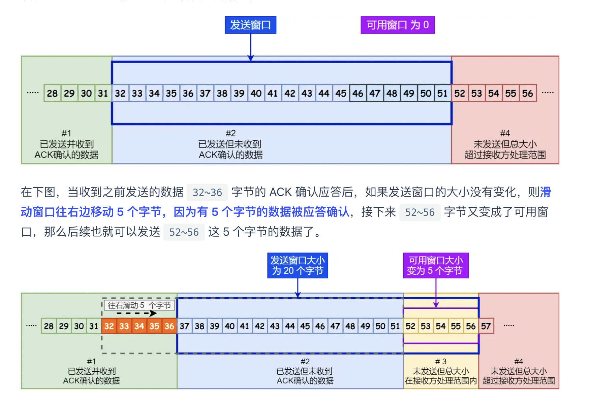

### 内存泄漏（Memory Leak）

#### 定义

内存泄漏是指程序中**不再需要的对象**由于某些原因**仍然被引用**，导致垃圾回收器（GC）无法回收这些对象的内存。

#### 特征

- **持续增长**：随着程序的运行，内存使用不断增加。
- **长期未释放**：某些不再使用的对象长期未被释放，导致可用内存减少。

#### 常见原因

- **静态集合类**：如 `ArrayList`、`HashMap` 等**静态集合类中的对象**没有及时移除。
- **监听器和回调**：**未及时移除的事件监听器或回调函数**。
- **未关闭的资源**：如数据库连接、文件流等资源未正确关闭。
- **自定义缓存**：未正确管理的缓存，导致对象一直被引用。

#### 检测和解决

- **内存分析工具**：使用如 Eclipse Memory Analyzer (MAT) 等内存分析工具分析堆转储文件，找到哪些对象占用了大量内存。
- **检查引用链**：通过工具查看泄漏对象到GC Roots的引用链，找到未释放的引用。
- **代码审查**：检查代码中可能导致内存泄漏的逻辑，确保对象在不需要时及时释放。

#### 示例

```
java
复制代码
public class MemoryLeakExample {
    private static List<Object> list = new ArrayList<>();

    public static void main(String[] args) {
        while (true) {
            Object obj = new Object();
            list.add(obj);
            // 虽然不再需要 obj，但它被 list 引用，导致无法被GC回收
        }
    }
}
```

### 内存溢出（Memory Overflow）

#### 定义

内存溢出是指程序在尝试分配内存时，已用内存达到或超过JVM的最大堆内存限制，导致无法分配内存并抛出 `OutOfMemoryError` 异常。

#### 特征

- **堆内存不足**：程序运行时需要的内存超过了JVM的最大堆内存设置。
- **直接抛异常**：当内存溢出时，程序会直接抛出 `OutOfMemoryError` 异常。

#### 常见原因

- **内存泄漏**：**内存泄漏导致内存持续增长，最终超过堆内存限制**。
- **大数据处理**：**一次性处理大量数据，超过堆内存限制**。
- **不合理的配置**：JVM参数（如 `-Xmx` 和 `-Xms`）设置不合理，堆内存过小。

#### 检测和解决

- **调整JVM参数**：检查并调整JVM的堆内存参数，增加最大堆内存（`-Xmx`）。
- **优化代码**：优化代码逻辑，减少内存占用，避免一次性加载大量数据。
- **分而治之**：将大数据分批处理，避免一次性占用过多内存。

#### 示例

```
java
复制代码
public class MemoryOverflowExample {
    public static void main(String[] args) {
        List<int[]> list = new ArrayList<>();
        while (true) {
            // 尝试分配大量内存，最终导致OutOfMemoryError
            list.add(new int[1000000]);
        }
    }
}
```

### 区别总结

1. **定义**：
   - **内存泄漏**：不再需要的对象仍然被引用，导致无法被GC回收。
   - **内存溢出**：需要的内存超过了JVM的最大堆内存限制，无法分配内存。
2. **特征**：
   - **内存泄漏**：内存使用持续增长，长期未释放。
   - **内存溢出**：内存不足时直接抛出 `OutOfMemoryError` 异常。
3. **原因**：
   - **内存泄漏**：未及时移除的引用、未关闭的资源、自定义缓存等。
   - **内存溢出**：内存泄漏、大数据处理、不合理的JVM参数配置等。
4. **解决方法**：
   - **内存泄漏**：使用内存分析工具找出未释放的引用，优化代码逻辑。
   - **内存溢出**：调整JVM参数，优化代码逻辑，分批处理大数据。

通过上述解释，面试官不仅能看到你对内存管理的理解，还能看到你在实际问题分析和解决中的能力。这展示了你在处理Java内存相关问题时的系统性和专业性。


## StackOverflowError

`StackOverflowError` 是 Java 中常见的错误类型之一，通常在应用程序递归太深或者堆栈使用过多时发生。以下是对 `StackOverflowError` 的详细解释，包括其定义、原因、检测和解决方法。

### 定义

`StackOverflowError` 是一种 `Error`，表示 Java 虚拟机的栈内存不足，通常由递归过深或无限递归导致。

```
java
复制代码
public class StackOverflowExample {
    public static void recursiveMethod() {
        recursiveMethod(); // 无限递归调用
    }

    public static void main(String[] args) {
        recursiveMethod(); // 触发StackOverflowError
    }
}
```

### 栈溢出的原因

#### 1. 递归调用过深

递归是一种常见的编程技术，但如果递归调用没有正确的退出条件，或者递归深度过大，就会导致栈溢出。

```
java
复制代码
public class DeepRecursion {
    public static void recursiveMethod(int depth) {
        if (depth == 0) return;
        recursiveMethod(depth - 1); // 递归调用
    }

    public static void main(String[] args) {
        recursiveMethod(100000); // 递归深度过大，可能导致StackOverflowError
    }
}
```

#### 2. 无限循环或死循环

在递归中，如果没有正确的退出条件，导致函数无限调用自身，也会引起栈溢出。

```
java
复制代码
public class InfiniteRecursion {
    public static void recursiveMethod() {
        recursiveMethod(); // 无限递归调用
    }

    public static void main(String[] args) {
        recursiveMethod(); // 触发StackOverflowError
    }
}
```

#### 3. 全局变量过多

虽然全局变量存储在堆内存中，但如果在栈中创建了**大量局部变量，也会导致栈溢出**。

```
java
复制代码
public class LargeLocalVariables {
    public static void largeMethod() {
        int[] largeArray = new int[1000000]; // 大量局部变量占用栈内存
        largeMethod(); // 无限递归调用
    }

    public static void main(String[] args) {
        largeMethod(); // 触发StackOverflowError
    }
}
```

#### 4. 大型数据结构

在方法内部创建**大型数组、`List` 或 `Map` 等数据结构，也会导致栈内存快速耗尽**。

```
java
复制代码
public class LargeDataStructures {
    public static void methodWithLargeDataStructure() {
        int[][] largeArray = new int[10000][10000]; // 大型数组占用栈内存
    }

    public static void main(String[] args) {
        methodWithLargeDataStructure(); // 可能触发StackOverflowError
    }
}
```

### 检测和解决

#### 1. 使用调试工具

使用 IDE 的调试工具来跟踪方法调用，检查递归调用的深度和局部变量的使用情况。

#### 2. 增加栈大小

可以通过 JVM 参数 `-Xss` 来增加栈的大小。例如，增加栈的大小到 2MB：

```
shell
复制代码
java -Xss2m YourClass
```

#### 3. 优化递归

确保递归有正确的退出条件，避免无限递归。可以尝试将递归转换为迭代。

```
java
复制代码
public class TailRecursion {
    public static void iterativeMethod(int depth) {
        while (depth > 0) {
            depth--; // 使用迭代代替递归
        }
    }

    public static void main(String[] args) {
        iterativeMethod(100000); // 不会导致StackOverflowError
    }
}
```

#### 4. 减少局部变量的大小

避免在方法内部创建大型局部变量，或者将这些数据结构移动到堆中（例如作为类成员变量）。

```
java
复制代码
public class ReduceLocalVariables {
    private int[][] largeArray; // 将大型数组移动到堆中

    public void method() {
        largeArray = new int[10000][10000];
    }

    public static void main(String[] args) {
        ReduceLocalVariables obj = new ReduceLocalVariables();
        obj.method(); // 不会导致StackOverflowError
    }
}
```

在实际应用中，通常会同时设置初始堆大小和最大堆大小，以确保 JVM 在内存使用上的稳定性。例如：

```
sh
复制代码
java -Xms512m -Xmx2g -Xss1m MyClass
```

这将：

- 将初始堆大小设置为 512MB
- 将最大堆大小设置为 2GB
- 将每个线程的堆栈大小设置为 1MB

### 调整这些参数的影响

- **堆栈大小（-Xss）**：设置过小可能会导致 `StackOverflowError`，尤其是在递归深度较大的程序中。设置过大则会浪费内存，并减少可以创建的线程数量。
- **初始堆大小（-Xms）**：设置过小可能导致 JVM 频繁进行垃圾收集。设置过大则可能浪费内存资源。
- **最大堆大小（-Xmx）**：设置过小会导致 `OutOfMemoryError`，设置过大则可能影响系统的整体性能和稳定性，因为 JVM 会占用大量的内存资源。


### 浅拷贝

浅拷贝（Shallow Copy）是指创建一个新对象，这个新对象是原对象的精确副本，但它仅复制对象的“表层”数据，对于对象内部的引用类型成员变量，它们依然指向原来的对象。因此，浅拷贝后的对象与原对象共享引用类型的成员变量。

#### 浅拷贝的实现

在 Java 中，可以通过**实现 `Cloneable` 接口并重写 `clone` 方法**来实现浅拷贝：

```
java
复制代码
class Person implements Cloneable {
    private String name;
    private int age;
    private Address address;

    public Person(String name, int age, Address address) {
        this.name = name;
        this.age = age;
        this.address = address;
    }

    @Override
    protected Object clone() throws CloneNotSupportedException {
        return super.clone();  // 调用 Object 的 clone 方法，进行浅拷贝
    }

    @Override
    public String toString() {
        return "Person{name='" + name + "', age=" + age + ", address=" + address + "}";
    }
}

class Address {
    private String city;

    public Address(String city) {
        this.city = city;
    }

    @Override
    public String toString() {
        return "Address{city='" + city + "'}";
    }
}

public class Main {
    public static void main(String[] args) {
        try {
            Address address = new Address("New York");
            Person original = new Person("Alice", 30, address);
            Person cloned = (Person) original.clone();

            System.out.println("Original: " + original);
            System.out.println("Cloned: " + cloned);

            // 修改克隆对象的地址
            cloned.address.city = "San Francisco";

            System.out.println("After modification:");
            System.out.println("Original: " + original);
            System.out.println("Cloned: " + cloned);
        } catch (CloneNotSupportedException e) {
            e.printStackTrace();
        }
    }
}
```

在这个例子中，`**Person` 类实现了 `Cloneable` 接口并重写了 `clone` 方法。当调用 `clone` 方法时，它会创建一个新的 `Person` 对象，这个新对象的 `name` 和 `age` 是原对象的副本，但是 `address` 字段依然引用原来的 `Address` 对象**。修改 `cloned` 对象的 `address` 会影响到 `original` 对象，因为它们共享同一个 `Address` 对象。

### 深拷贝

深拷贝（Deep Copy）是指创建一个新对象，不仅复制对象的所有基本类型成员变量，还递归地复制所有引用类型的成员变量，确保新对象与原对象完全独立。这样，修改深拷贝后的对象不会影响原对象，反之亦然。

#### 深拷贝的实现

为了实现深拷贝，**需要在 `clone` 方法中手动复制所有引用类型的成员变量**：

```
java
复制代码
class Person implements Cloneable {
    private String name;
    private int age;
    private Address address;

    public Person(String name, int age, Address address) {
        this.name = name;
        this.age = age;
        this.address = address;
    }

    @Override
    protected Object clone() throws CloneNotSupportedException {
        Person cloned = (Person) super.clone();
        cloned.address = (Address) address.clone();  // 手动克隆 address 对象
        return cloned;
    }

    @Override
    public String toString() {
        return "Person{name='" + name + "', age=" + age + ", address=" + address + "}";
    }
}

class Address implements Cloneable {
    private String city;

    public Address(String city) {
        this.city = city;
    }

    @Override
    protected Object clone() throws CloneNotSupportedException {
        return super.clone();  // 调用 Object 的 clone 方法，进行浅拷贝
    }

    @Override
    public String toString() {
        return "Address{city='" + city + "'}";
    }
}

public class Main {
    public static void main(String[] args) {
        try {
            Address address = new Address("New York");
            Person original = new Person("Alice", 30, address);
            Person cloned = (Person) original.clone();

            System.out.println("Original: " + original);
            System.out.println("Cloned: " + cloned);

            // 修改克隆对象的地址
            cloned.address.city = "San Francisco";

            System.out.println("After modification:");
            System.out.println("Original: " + original);
            System.out.println("Cloned: " + cloned);
        } catch (CloneNotSupportedException e) {
            e.printStackTrace();
        }
    }
}
```

在这个例子中，`Address` 类也实现了 `Cloneable` 接口并重写了 `clone` 方法。在 `Person` 类的 `clone` 方法中，不仅调用了 `super.clone()` 进行浅拷贝，还手动克隆了 `address` 对象，确保 `Person` 对象的 `address` 字段是独立的副本。

### 深拷贝和浅拷贝的区别

1. **共享引用**：
   - **浅拷贝**：原对象和克隆对象共享引用类型的成员变量。
   - **深拷贝**：原对象和克隆对象拥有独立的引用类型的成员变量。
2. **性能**：
   - **浅拷贝**：通常比深拷贝更快，因为它只复制对象的顶层结构。
   - **深拷贝**：可能较慢，因为它需要递归地复制所有嵌套的引用类型对象。
3. **适用场景**：
   - **浅拷贝**：适用于对象内部没有引用类型，或者引用类型不需要独立的情况。
   - **深拷贝**：适用于需要完全独立的副本，以避免相互影响的情况。

## `Object`类的`clone`方法默认实现是**浅拷贝**。


## 获取Class对象

```java
    public void fansheTest() {
        // 1.类获取Class
        Class<DataStructure> dataStructureClass = DataStructure.class;
        // 2.对象获取Class
        Class<? extends Class> aClass = dataStructureClass.getClass();
        // 3.工具获取Class
        try {
            Class<?> dataStructure = Class.forName("DataStructure");
        } catch (ClassNotFoundException e) {
            e.printStackTrace();
        }
```


### 创建对象多种方式

#### 1.使用反序列化创建

1. **实现 `Serializable` 接口**：
   - `Person` 类实现了 `Serializable` 接口，使得它的对象可以被序列化和反序列化。
   - `serialVersionUID` 是类的版本控制标识符，推荐显式声明。
2. **序列化对象**：
   - 使用 `FileOutputStream` 创建文件输出流，指向目标文件。
   - 使用 `ObjectOutputStream` 创建对象输出流，将对象写入文件。
   - 调用 `writeObject` 方法将 `Person` 对象写入文件。
3. **反序列化对象**：
   - 使用 `FileInputStream` 创建文件输入流，指向源文件。
   - 使用 `ObjectInputStream` 创建对象输入流，从文件中读取对象。
   - 调用 `readObject` 方法反序列化对象，返回 `Object` 类型，需要进行类型转换。

#### 2.使用new

#### 3.使用clone

#### 4.使用Class.newIntance


### fail-fast 机制

fail-fast 机制是 Java 集合（Collection）中的一种错误机制**。当多个线程对同一个集合的内容进行操作时，就可能会产生 fail-fast 事件**。

例如：当某一个线程 A 通过 iterator 去遍历某集合的过程中，若该集合的内容被其他线程所改变

了，那么线程 A 访问集合时，就会抛出 ConcurrentModificationException 异常，产生 fail-fast 事

件。这里的操作主要是指 add、remove 和 clear，对集合元素个数进行修改


### &(2n - 1)

在 Java 中，`HashMap` 是一种基于哈希表的数据结构。为了提高计算效率，`HashMap` 使用了一些优化技巧，其中之一就是将哈希表的大小固定为 2 的幂次方。这样做的一个主要好处是，**在计算哈希值的索引时，可以用位运算来代替除法运算。位运算比除法运算要快得多，从而提高了性能。**

### 背景知识

- **哈希表**：哈希表是一种数据结构，它使用哈希函数将键映射到一个存储桶数组的索引位置。理想情况下，哈希函数能将键均匀地分布到数组中，以减少碰撞。
- **除法取模运算**：通常情况下，计算键在哈希表中的索引需要用**哈希值对数组的长度取模** (`hash % n`)，其中 `n` 是数组的长度。这是为了确保索引在数组的范围内。

### 取模运算的优化

除法运算相对较慢，而位运算非常快。因此，`HashMap` 通过将哈希表的大小固定为 2 的幂次方来优化这个过程：

- **哈希表大小是 2 的幂次方**：假设哈希表的大小是 `2^k`，其中 `k` 是非负整数。
- **位运算替代取模运算**：使用位运算可以快速计算出哈希值的索引。具体而言，对于大小为 `2^k` 的哈希表，可以使用 `hash & (length - 1)` 代替 `hash % length`。

### 位运算的具体实现

位运算 `hash & (length - 1)` 是一种快速的取模方式。它的原理在于 `2^k` 减 1 会产生一个低位全为 1 的掩码。例如，对于长度为 8 (`2^3`)，掩码为 `0111` (二进制)，对于长度为 16 (`2^4`)，掩码为 `1111` (二进制)。

以下是一个简单的例子：

```
java
复制代码
public class HashMapExample {
    public static void main(String[] args) {
        int hash = 12345;
        int length = 16; // 长度是 2 的幂次方

        int indexUsingModulo = hash % length; // 使用取模运算
        int indexUsingBitwise = hash & (length - 1); // 使用位运算

        System.out.println("Index using modulo: " + indexUsingModulo);
        System.out.println("Index using bitwise: " + indexUsingBitwise);
    }
}
```

在上面的例子中，`length - 1` 生成了一个掩码 `1111` (二进制)，`hash & (length - 1)` 将哈希值的低位部分取出，效果与 `hash % length` 相同，但效率更高。

### 为什么位运算更高效

- **CPU指令集**：**位运算直接映射到 CPU 指令集中的基本操作，通常只需一个 CPU 指令周期**。
- **除法运算开销**：**除法运算涉及更多的计算步骤，通常需要多个指令周期。**

### `HashMap` 源代码分析

在 `HashMap` 的源码中，可以看到这个优化的实现。例如，在计算存储桶索引时：

```
java
复制代码
static final int hash(Object key) {
    int h;
    return (key == null) ? 0 : (h = key.hashCode()) ^ (h >>> 16);
}

static int indexFor(int h, int length) {
    return h & (length-1);
}
```

- `hash` 方法对哈希值进行了额外处理，以减少碰撞。
- `indexFor` 方法使用 `h & (length-1)` 计算索引。


### `hashCode` 和 `equals` 的协同工作

当我们向**哈希表（如 `HashMap`）**中添加一个新的元素时，具体过程如下：

1. **计算哈希码**：
   - 首先，调用新元素的 `hashCode` 方法，计算它的哈希码。
   - 通过**哈希函数将哈希码转换成数组的索引，确定该元素在哈希表中的存储位置**。
2. **检查存储位置**：
   - 如果该位置为空，直接将新元素存储在这个位置上。
   - 如果**该位置已经有元素，说明发生了哈希碰撞（多个对象有相同的哈希码）**。
3. **处理哈希碰撞**：
   - 调用现有元素的 `equals` 方法与新元素进行比较。
   - 如果 `equals` 方法返回 `true`，表示新元素与现有元素相等，则不存储新元素，因为集合中不允许重复元素。
   - 如果 `equals` 方法返回 `false`，表示新元素与现有元素不相等，则需要将新元素存储在其他位置上（链表法或开放地址法）。

### 实际调用 `equals` 方法的次数

由于哈希表在插入新元素时首先使用 `hashCode` 方法进行初步定位，**因此在绝大多数情况下，不同的对象会被分配到不同的位置，从而避免了不必要的 `equals` 方法调用。这显著提高了集合操作的性能。只有在哈希碰撞的情况下，才需要调用 `equals` 方法进行精确比较**。

### `String.hashCode()`

`String`类的`hashCode()`方法是一个非常常用的实现，它计算字符串内容的哈希码。以下是`String.hashCode()`的具体实现：

```java
@Override
public int hashCode() {
    int h = hash;
    if (h == 0 && value.length > 0) {
        char val[] = value;

        for (int i = 0; i < value.length; i++) {
            h = 31 * h + val[i];
        }
        hash = h;
    }
    return h;
}
```

#### 解释

1. **缓存哈希码**：`hash`是一个缓存字段，用于存储已经计算过的哈希码。如果`hash`不为0，直接返回它。这可以避免重复计算，提高性能。
2. **哈希码的计算**：如果`hash`为0，且字符串不为空，则开始计算哈希码。算法遍历字符数组`value`，将每个字符的哈希值按公式 `h = 31 * h + val[i]` 累加。
3. **乘法因子31**：使用31作为乘法因子是因为31是一个小的质数，并且乘法和位移操作可以优化（即 `31 * i == (i << 5) - i`）。

这个哈希函数能够生成一个分布较好的哈希值，用于在哈希表中快速查找字符串。

### `Object.hashCode()`返回对象内存地址

`Object`类的`hashCode()`方法是所有Java对象默认的哈希码实现，**它返回对象的内存地址的某种表示**。

```java
public native int hashCode();
```

#### 解释

1. **本地方法**：`hashCode`方法是一个本地方法（`native`），其实现依赖于JVM。通常情况下，`Object.hashCode()`方法返回对象在内存中的地址的整数表示。
2. **内存地址**：由于不同对象通常有不同的内存地址，因此`Object.hashCode()`返回的值对于不同对象来说一般是唯一的。
3. **一致性**：在一个应用程序的生命周期内，同一个对象的`hashCode`值是不变的，除非对象的状态改变影响了哈希值（默认情况下，内存地址不会改变）。

### 比较

- **`String.hashCode()`**：基于字符串内容计算哈希码，内容相同的字符串有相同的哈希码，内容不同的字符串则可能有不同的哈希码。
- **`Object.hashCode()`**：基于对象的内存地址计算哈希码，不同对象（即使内容相同）的哈希码一般不同。

### 示例

#### `String.hashCode()`示例

```java
public class StringHashCodeExample {
    public static void main(String[] args) {
        String str1 = "hello";
        String str2 = "world";
        String str3 = "hello";

        System.out.println(str1.hashCode()); // 输出相同的哈希码
        System.out.println(str2.hashCode()); // 输出不同的哈希码
        System.out.println(str3.hashCode()); // 输出相同的哈希码，与str1相同
    }
}
```

#### `Object.hashCode()`示例

```java
public class ObjectHashCodeExample {
    public static void main(String[] args) {
        Object obj1 = new Object();
        Object obj2 = new Object();
        Object obj3 = obj1;

        System.out.println(obj1.hashCode()); // 输出对象的哈希码
        System.out.println(obj2.hashCode()); // 输出不同的哈希码
        System.out.println(obj3.hashCode()); // 输出相同的哈希码，与obj1相同
    }
}
```

### 总结

- **`String.hashCode()`**：
  - 计算字符串内容的哈希码。
  - 相同内容的字符串返回相同的哈希码。
  - 使用31作为乘法因子，生成分布较好的哈希值。

- **`Object.hashCode()`**：
  - 默认返回对象内存地址的整数表示。
  - 不同对象通常返回不同的哈希码。
  - 本地方法实现，依赖JVM。

理解`hashCode`方法对于编写高效的哈希表、集合和其他基于哈希的数据结构非常重要。通过合理地覆盖`hashCode`方法，可以确保对象在这些数据结构中的正确行为和高性能。


`Object`类的`equals()`方法是Java对象比较的重要基础，它提供了对象相等性的默认实现。理解`equals()`方法有助于开发更健壮的应用程序，尤其是在集合框架和对象比较中。下面是详细解释：

### `Object.equals()比较的是引用

在`Object`类中，`equals()`方法的默认实现如下：

```java
public boolean equals(Object obj) {
    return (this == obj);
}
```

#### 解释

1. **引用比较**：默认情况下，`equals()`方法使用 `==` 运算符比较两个对象的引用。如果两个对象引用相同的内存地址，则认为它们相等。
2. **对象相等性**：默认实现只会在两个对象是同一个实例时返回`true`。即使两个对象内容相同，只要它们是不同的实例，默认实现的`equals()`方法也会返回`false`。

### 覆盖`equals()`方法

通常，我们需要覆盖`equals()`方法来提供基于对象内容的相等性比较。这在需要根据对象的属性来判断相等性时非常重要，例如在集合中查找对象时。

#### 覆盖`equals()`方法的准则

覆盖`equals()`方法时，需要遵循以下准则（称为`equals`合约）：

1. **自反性（Reflexive）**：对于任何非空引用值`x`，`x.equals(x)`应返回`true`。
2. **对称性（Symmetric）**：对于任何非空引用值`x`和`y`，如果`x.equals(y)`返回`true`，则`y.equals(x)`也应返回`true`。
3. **传递性（Transitive）**：对于任何非空引用值`x`、`y`和`z`，如果`x.equals(y)`返回`true`，且`y.equals(z)`返回`true`，则`x.equals(z)`应返回`true`。
4. **一致性（Consistent）**：对于任何非空引用值`x`和`y`，只要在比较中所用的信息没有被修改，反复调用`x.equals(y)`应始终返回`true`或始终返回`false`。
5. **非空性（Non-nullity）**：对于任何非空引用值`x`，`x.equals(null)`应返回`false`。

#### 示例：覆盖`equals()`方法

以下是一个覆盖`equals()`方法的示例：

```java
public class Person {
    private String name;
    private int age;

    public Person(String name, int age) {
        this.name = name;
        this.age = age;
    }

    @Override
    public boolean equals(Object obj) {
        if (this == obj) {
            return true;
        }
        if (obj == null || getClass() != obj.getClass()) {
            return false;
        }
        Person person = (Person) obj;
        return age == person.age && Objects.equals(name, person.name);
    }

    @Override
    public int hashCode() {
        return Objects.hash(name, age);
    }
}
```

#### 解释

1. **自反性**：首先检查当前对象是否与传入的对象引用相同（`this == obj`），如果是则返回`true`。
2. **非空性和类型检查**：检查传入对象是否为空，或与当前对象类型不同。如果是，则返回`false`。
3. **内容比较**：将传入对象转换为`Person`类型，比较两个对象的属性（`name`和`age`）是否相等。
4. **`hashCode`方法**：当覆盖`equals()`方法时，还需要覆盖`hashCode()`方法，以确保在基于哈希的集合（如`HashMap`、`HashSet`）中能正确工作。

### `equals()`方法的实际应用

1. **集合中的使用**：在`HashSet`、`HashMap`等基于哈希的集合中，`equals()`方法用于检查对象的相等性。如果两个对象`equals()`相等，它们会被视为集合中的同一个元素。
2. **对象比较**：`equals()`方法通常用于需要对象内容比较的场景，如比较两个对象是否具有相同的数据。
3. **业务逻辑**：在实际业务中，常常需要根据对象的实际属性来判断相等性，这就需要合理地覆盖`equals()`方法。

### 注意事项

1. **一致性**：确保`equals()`方法的实现与`hashCode()`方法一致，即如果两个对象根据`equals()`相等，它们的`hashCode()`也应相等。
2. **性能**：在实现`equals()`方法时，应考虑性能，尤其是在涉及大量对象比较时。

### 总结

- `Object.equals()`默认实现比较对象引用，只有引用相同才认为相等。
- 覆盖`equals()`方法需要遵循自反性、对称性、传递性、一致性和非空性原则。
- 实现`equals()`方法时，还需要覆盖`hashCode()`方法以确保在基于哈希的集合中正确工作。
- `equals()`方法广泛应用于集合操作、对象比较和业务逻辑中。


# 3+2

#### 线程独占3：栈+计数器+本地方法栈

### 栈（Stack）

#### 概述

- **栈**（Stack），又称方法栈，是线程私有的内存区域。
- 每个线程在执行方法时都会创建一个栈帧，用来存储方法的**局部变量表【参数+临时变量】、操作数栈、动态链接【调用】、方法出口**等信息。
- 当一个方法被调用时，栈帧被压入栈顶；当方法返回时，栈帧被弹出。

#### 详细内容

- **局部变量表**：用于**存储方法中的局部变量，包括基本数据类型和对象引用**。
- **操作数栈**：用于临时存储计算过程中间结果和**参与操作的操作数**。
- **动态链接**：指向运行时常量池中的引用，用于**支持方法调用**。
- **方法出口**：用于**返回方法调用的位置**。

### 本地方法栈（Native Method Stack）

#### 概述

- 本地方法栈与 Java 栈类似，也是线程私有的内存区域。
- 用于存储调用本地（Native）方法的信息。
- 本地方法栈是为执行 Native 方法服务的，而 Java 栈是为执行 Java 方法服务的。

#### 详细内容

- **Native 方法**：是使用 JNI（Java Native Interface）编写的非 Java 代码，可以是 C 或 C++ 等其他语言编写的代码。
- **存储内容**：本地方法栈存储与本地方法相关的状态信息，包括本地变量和中间结果等。

### 程序计数器（Program Counter Register）

#### 概述

- 程序计数器保存着当前线程执行的字节码位置。
- 每个线程都有一个独立的程序计数器，这是为了支持线程切换后的恢复操作。
- 程序计数器只在执行 Java 方法时有效，**执行 Native 方法时，程序计数器为空**。

#### 详细内容

- **作用**：程序计数器用于记录当前线程正在执行的指令地址。通过程序计数器，线程可以在上下文切换时准确地恢复到正确的执行位置。
- **执行 Java 方法**：保存当前指令的地址。
- **执行 Native 方法**：程序计数器为空，因为此时不需要记录字节码位置。

#### 线程共享2：堆+方法区

### 堆（Heap）

#### 概述

- 堆是 JVM 内存管理中最大的一块，所有线程共享。
- 用于存放对象实例，几乎所有的对象实例都存储在堆中。
- 当堆没有可用空间时，会抛出 `OutOfMemoryError`（OOM）异常。

#### 详细内容

- 分代管理

  ：根据对象的生命周期将**堆分为不同的代（如年轻代和老年代）。垃圾回收器使用分代回收策略，以提高回收效率**。

  - **年轻代**：存储新创建的对象，**分为 Eden 区和两个 Survivor 区（From 和 To）**。
  - **老年代**：存储生命周期较长的对象，通常是经历了多次垃圾回收仍然存活的对象。

- **垃圾回收**：JVM 使用垃圾回收机制来管理堆内存，常见的垃圾回收算法有标记-清除、复制和标记-整理等。

### 方法区的作用

方法区主要存储以下几类数据：

1. **类元数据（Class Metadata）**：
   - 存储已被**虚拟机加载的类和接口的结构信息，包括类的名称、父类、接口、字段、方法、访问修饰符等**。
   - 这些信息在类被加载时从类文件中提取，并存储在方法区中，以便在运行时使用。
2. **运行时常量池（Runtime Constant Pool）**：
   - **每个类或接口都有一个常量池，用于存储编译时生成的各种字面量（如字符串常量）和符号引用（如类名、方法名、字段名等）。**
   - 常量池在类被加载后被放入方法区的运行时常量池中。
3. **静态变量（Static Variables）**：
   - 存储类的**静态变量，即被 `static` 关键字修饰的变量**。
   - 静态变量在类加载时初始化，存在于方法区中，且在类的整个生命周期内都存在。
4. **字节码（Bytecode）**：
   - **存储方法的字节码，即类方法体内的代码，在运行时由虚拟机解释执行或即时编译（JIT）优化**。
5. **即时编译器（Just-In-Time Compiler, JIT）生成的代码**：
   - JIT 编译器在运行时将字节码编译成机器码，并将这些优化后的机器码存储在方法区中。

**作用**：

- 常量池用于保存字面量和符号引用，这些信息在类加载时从类文件的常量池中提取。
- 运行时常量池支持虚拟机在运行时对类的链接和解析，比如动态方法调用、字段访问等。

### 主要区别

1. **作用范围不同**：
   - **类元数据**：描述类的结构和定义，主要供虚拟机在运行时使用，管理类的加载、链接和运行。
   - **运行时常量池**：保存常量和符号引用，支持类的链接、方法调用、字段访问等操作。
2. **内容类型不同**：
   - **类元数据**：包含类的名称、父类、接口、字段、方法、修饰符等。
   - **运行时常量池**：包含字面量（如字符串、数字）和符号引用（如类名、方法名、字段名）。
3. **使用目的不同**：
   - **类元数据**：用于提供类在运行时的结构信息，支持反射、对象创建、方法调用等。
   - **运行时常量池**：用于类的链接、动态方法调用、字段访问等，提供常量和符号引用支持。

### 


### 方法区在不同版本的 JVM 中的实现

#### Java 1.7 及之前版本：永久代（Permanent Generation）

在 Java 1.7 及之前版本中，方法区的实现是**永久代（Permanent Generation），简称永久代。永久代是 Java 堆的一部分，但它有一些独特的特性：**

- **内存大小限制**：永久代有固定的大小上限，容易导致 `OutOfMemoryError`（OOM）异常，特别是在大量动态生成类或加载大量类时。
- **垃圾回收**：永久代的垃圾回收主要集中在**常量池的回收和类型的卸载上，回收效率相对较低**。

#### Java 1.8 及之后版本：元空间（Metaspace）

在 Java 1.8 及之后版本中，永久代被移除，取而代之的是**元空间（Metaspace）。元空间是一个与永久代不同的内存区域，具有以下特性：**

- **本地内存**：元空间使用的是本地内存（Native Memory），而不是堆内存。这意味着它的大小不再受到 Java 堆的限制，默认情况下可以动态扩展，受限于可用的物理内存。
- **自动管理**：元空间的管理更加灵活，减少了 `OutOfMemoryError` 异常的可能性。
- **优化的垃圾回收**：元空间**改进了垃圾回收机制，特别是在类的卸载和常量池的回收方面**。


### 常量的存储位置

**常量**主要分为两类：字面量常量和静态常量。

#### 字面量常量

- **字面量常量**：如字符串常量、基本类型的常量值等，它们被存储在**方法区的运行时常量池**中。
- **运行时常量池**：每个类或接口都有一个运行时常量池，它在类加载时从**类文件的常量池表**中加载。

当字面量常量赋值给局部变量时，这些变量存储在方法栈帧的局部变量表中。

```
java
复制代码
public class LiteralExample {
    public static void main(String[] args) {
        int number = 100; // number 存储在局部变量表中
        String text = "Hello, World!"; // text 存储在局部变量表中，字符串字面量 "Hello, World!" 存储在运行时常量池中
    }
```

### 方法栈帧与局部变量表

当方法被调用时，JVM 会在栈中创建一个栈帧（Stack Frame），每个栈帧包含以下几个部分：

1. **局部变量表（Local Variable Table）**：
   - 用于存储方法的局部变量，包括参数和方法内定义的变量。
   - 每个局部变量都有一个索引，用来在局部变量表中定位它。
2. **操作数栈（Operand Stack）**：
   - 用于执行字节码指令时**存储中间结果**。
3. **动态链接（Dynamic Linking）**：
   - 包含对运行时常量池中方法和字段的引用。
4. **方法返回地址（Return Address）**：
   - 存储调用方法后续需要返回的位置。

### 局部变量存储

在 `main` 方法中定义的局部变量 `number` 和 `text` 存储在局部变量表中。

1. **整数局部变量**：
   - `int number = 100;`
   - `number` 是一个基本数据类型的局部变量，它的值 `100` 直接存储在局部变量表中。
   - 对于基本数据类型，变量值直接存储在局部变量表中。
2. **字符串局部变量**：
   - `String text = "Hello, World!";`
   - `text` 是一个引用类型的局部变量，它存储的是对字符串对象的引用。
   - 字符串字面量 `"Hello, World!"` 存储在运行时常量池中，`text` 存储在局部变量表中，存储的是对该字符串常量的引用。


```java
public class Main {
    public static void main(String[] args) {
        Integer i1 = 100;
        Integer i2 = 100;
        Integer i3 = 200;
        Integer i4 = 200;
        
        System.out.println(i1 == i2); // 比较 i1 和 i2 的引用
        System.out.println(i3 == i4); // 比较 i3 和 i4 的引用
    }
}
```

### 变量存储示意图

```
scss
复制代码
[局部变量表]
+--------------------+
| Index 0 | args     |
| Index 1 | i1       | --> Reference to Integer(100) from constant pool
| Index 2 | i2       | --> Reference to Integer(100) from constant pool
| Index 3 | i3       | --> Reference to new Integer(200)
| Index 4 | i4       | --> Reference to new Integer(200)
+--------------------+

[堆]
+----------------------------+
| Integer(100) (from pool)   |
| Integer(200) (new object)  |
| Integer(200) (new object)  |
+----------------------------+

[方法区的常量池]
+----------------------------+
| Integer(100) (cached)      |
+----------------------------+
```

- **方法区**：
  - `IntegerCache` 类本身及其静态字段（如 `cache` 数组）存储在方法区。
  - `cache` 数组包含对 `Integer` 对象的引用，这些对象是缓存的 `Integer` 对象。
- **堆**：
  - 缓存的 `Integer` 对象实际存储在堆中。
  - 当你请求一个值在 -128 到 127 范围内的 `Integer` 对象时，`Integer.valueOf(int i)` 方法会从 `cache` 数组中返回缓存的对象引用。


### 静态常量的存储位置

**静态常量**是使用 `static final` 关键字修饰的常量。

- **静态常量**：它们在**类加载时被存储在方法区**中。
- 因为它们是静态的，所以被所有类的实例共享，而且由于它们是常量，所以一旦赋值就不能改变。

#### 示例

```
java
复制代码
public class StaticFinalExample {
    public static final int CONSTANT = 100;

    public static void main(String[] args) {
        System.out.println(CONSTANT);
    }
}
```

在这个示例中，`CONSTANT` 是一个静态常量，它在类加载时被放入方法区

### 静态变量的存储位置

**静态变量**是使用 `static` 关键字修饰的变量。

- **静态变量**：这些变量在类加载时被存储在方法区中。
- 因为它们是静态的，所以被所有类的实例共享。

#### 示例

```
java
复制代码
public class StaticVariableExample {
    public static int staticVar = 10;

    public static void main(String[] args) {
        System.out.println(staticVar);
    }
}
```

在这个示例中，`staticVar` 是一个静态变量，它在类加载时被放入方法区。

在Java中，理解缓存池对象和静态变量的存储位置有助于更好地掌握Java内存模型。以下是详细解释：

### 缓存池对象和静态变量的存储位置

1. **缓存池对象**：
   - **堆内存（Heap Memory）**：堆是Java内存区域中用于存储对象实例的区域。所有的对象实例，包括缓存池中的对象实例，都存储在堆内存中。堆内存是线程共享的区域，所有线程都可以访问堆中的对象。
   - 例如，`IntegerCache` 中的缓存池对象 `Integer` 实例存储在堆内存中。
2. **静态变量**：
   - **方法区（Method Area）**：方法区存储类的结构信息，包括类元数据、方法数据、常量池和静态变量等。方法区也是线程共享的区域。在JDK 8之前，方法区通常被称为永久代（PermGen），在JDK 8及之后被称为元空间（Metaspace）。
   - 静态变量是类级别的变量，在类加载时分配存储空间。静态变量在方法区中分配，但其引用的对象仍然存储在堆中。
   - 例如，`IntegerCache.cache` 数组是一个静态变量，其引用存储在方法区，但数组对象本身存储在堆内存中。

- **缓存池对象**：`IntegerCache.cache` 数组中存储的 `Integer` 对象实例，都是存储在堆内存中的。这些对象是在类加载时通过静态代码块初始化的。
- **静态变量**：`IntegerCache.cache` 是一个静态变量，它本身的引用存储在方法区中，但它指向的实际数组对象仍然存储在堆内存中。

### 具体存储过程

1. **类加载**：当 `Integer` 类加载时，`IntegerCache` 静态内部类也会被加载，`IntegerCache.cache` 数组引用会被存储在方法区中。
2. **初始化缓存池**：在静态代码块中，`IntegerCache.cache` 数组中的每个元素都会被初始化为一个新的 `Integer` 对象，这些 `Integer` 对象实例会被分配到堆内存中。
3. **引用关系**：`IntegerCache.cache` **数组引用存储在方法区中，它指向的实际数组对象存储在堆内存中**。数组对象中的每个 `Integer` 对象实例也存储在堆内存中。

总结：

- **缓存池对象实例存储在堆内存中**。
- 静态变量（如 `IntegerCache.cache` 数组）的**引用存储在方法区中，但静态变量引用的对象（如数组对象）仍然存储在堆内存中**。

StringTable存储在堆内存中。具体来说，StringTable是一个用于存储字符串常量的哈希表，这些字符串常量在堆内存中的一部分区域被称为"常量池"。以下是详细解释：

### StringTable和常量池

1. **堆内存**：
   - 堆内存是Java虚拟机（JVM）中用于动态分配内存的区域，所有对象实例和数组都在堆中分配。
   - 字符串常量池（String Pool 或 String Intern Pool）是堆内存中的一个特殊区域，用于存储字符串字面量和通过 `String.intern()` 方法显式加入的字符串。
2. **StringTable**：
   - StringTable 是一个哈希表结构，用于存储字符串常量。它在堆内存中维护。
   - 在JDK 7之前，StringTable 是存储在永久代（PermGen）中的。JDK 8及之后，随着永久代被移除，StringTable 被移到了堆内存中

### 总结

- static `final` 变量的**引用**存储在方法区（JDK 7及之前）或元空间（JDK 8及之后）。
- Static `final` 变量引用的**对象**存储在堆内存中。这包括包装类型对象、字符串对象以及数组对象等。

这种设计确保了方法区或元空间的存储结构相对简单，只需保存静态变量的引用，而实际的对象数据则放在堆内存中，便于垃圾回收和内存管理。


### **编译**         

###### **.java -> .class 转换成jvm能运行的二进制字节码文件**

### 加载

###### 通过类的完全限定名,查找此**类字节码文件,利用字节码文件创建Class对象**.

### **验证**

###### 确保Class文件符合当前虚拟机的要求,不会危害到虚拟机自身安全.

### **准备**

###### 进行内存分配,**为static修饰的类变量分配内存,并设置初始值(0或null).**不包含final修饰的静态变量,因为final变量在编译时分配.

### 解析

###### 将常量池中的**符号引用替换为直接引用的过程.直接引用为直接指向目标的指针或者相对偏移量**等.

### 始化

- **过程**：执行类的初始化方法，主要是执行静态块和静态变量的赋值。初始化是**从父类到子类逐级进行的**。

- 步骤

  ：

  - **初始化父类**【包括执行静态块，为父类的静态变量赋值】
  - 初始化当前类。
  - 执行静态块。
  - 赋值静态变量。

- 触发条件

  ：**类的初始化只有在主动使用时才会进行**。例如：

  - 创建类的实例。
  - 调用类的静态方法。
  - 使用类或接口的静态字段。
  - 反射操作。
  - 初始化某个类的子类。
  - Java虚拟机启动时指定的启动类。

- **目的**：使类的静态部分得到正确初始化。

### 使用

- **过程**：类已经准备好，可以进行实例化、方法调用、字段访问等操作。
- **目的**：通过类加载器将类加载到内存后，可以使用类的功能。

### 卸载

- **过程**：**当类不再被使用且满足一定条件时，JVM的垃圾回收器会将其卸载**。

- 条件

  ：

  - 该类的所有实例都已被回收。
  - 加载该类的类加载器实例已经被回收。
  - 该类的`Class`对象没有在任何地方被引用。

- **目的**：释放类占用的内存，以优化内存使用。


# 字符串常量池

~~~java
`new String("c") + new String("d")` 的表达式会创建一个新的字符串对象，而不是直接使用字符串池中的对象。这涉及到 Java 中字符串的拼接和 `intern` 方法的机制。让我们详细分析代码和各个步骤。

### 代码

```java
String s1 = "a";
String s2 = "b";
String s3 = "a" + "b";
String s4 = s1 + s2;
String s5 = "ab";
String s6 = s4.intern();

System.out.println(s3 == s4); // false
System.out.println(s3 == s5); // true
System.out.println(s3 == s6); // true

String x2 = new String("c") + new String("d");
String x1 = "cd";
x2.intern();
System.out.println(x1 == x2); // false
```

### 解释

#### `s3 == s4`

- `s3` 是编译时优化的常量字符串 `"ab"`，在编译期间直接存储在字符串池中。
- `s4` 是通过变量 `s1` 和 `s2` 的拼接得到的，编译时无法确定，需要在运行时动态创建新的字符串对象。

因此，`s3` 和 `s4` 不相等，因为它们指向不同的对象。

```java
System.out.println(s3 == s4); // false
```

#### `s3 == s5`

- `s3` 和 `s5` 都是编译时确定的常量字符串 `"ab"`，它们指向字符串池中的同一个对象。

```java
System.out.println(s3 == s5); // true
```

#### `s3 == s6`

- `s6` 是 `s4` 调用 `intern` 方法后的返回值。`intern` 方法会检查字符串池中是否存在 `"ab"`，如果存在，则返回池中的引用。因为 `s3` 指向的就是池中的 `"ab"`，所以 `s3` 和 `s6` 相等。

```java
System.out.println(s3 == s6); // true
```

#### `x1 == x2`

- `x2` 是通过 `new String("c") + new String("d")` 创建的新的字符串对象。这个对象不是在编译期确定的，因此不在字符串池中。
- `x1` 是编译期确定的常量字符串 `"cd"`，直接存储在字符串池中。
- `x2.intern()` 方法会尝试将 `x2` 的字符串值放入字符串池中。如果字符串池中已经存在该字符串，则 `intern` 返回池中的引用；否则，将 `x2` 的引用放入池中。

在 JDK 1.7 及以后版本中：

1. `new String("c") + new String("d")` 创建了一个新的字符串对象 `x2`，其值为 `"cd"`。
2. `x2.intern()` 将 `"cd"` 放入字符串池中，但 `x2` 并不会改变其引用，它仍然指向堆中的对象。
3. `x1` 是常量字符串 `"cd"`，它指向字符串池中的对象。

因此，`x1` 和 `x2` 是不同的对象。

```java
System.out.println(x1 == x2); // false
```

### 交换最后两行代码的影响

在交换最后两行代码后：

```java
String x1 = "cd";
String x2 = new String("c") + new String("d");
x2.intern();
System.out.println(x1 == x2); // false
```

在 JDK 1.7 及以后版本中：

1. `x1` 是常量字符串 `"cd"`，它指向字符串池中的对象。
2. `new String("c") + new String("d")` 创建了一个新的字符串对象 `x2`，其值为 `"cd"`。
3. `x2.intern()` 检查字符串池中是否已经存在 `"cd"`。因为 `x1` 已经在字符串池中，所以 `intern` 返回池中的引用，而不是 `x2`。

因此，`x1` 和 `x2` 仍然是不同的对象。

```java
System.out.println(x1 == x2); // false
```

### JDK 1.6 的行为

在 JDK 1.6 中，`intern` 方法会将字符串的副本放入字符串池，并返回池中的引用。因此：

1. `x2.intern()` 将 `x2` 的字符串值 `"cd"` 放入字符串池中，并返回池中的引用。
2. 如果字符串池中已经存在 `"cd"`，则返回池中的引用；否则，将 `x2` 的副本放入池中，并返回池中的引用。

在交换最后两行代码后：

```java
String x1 = "cd";
String x2 = new String("c") + new String("d");
x2.intern();
System.out.println(x1 == x2); // false
```

在 JDK 1.6 中，`x1` 和 `x2` 仍然是不同的对象。

```java
System.out.println(x1 == x2); // false
```

### 总结

- 常量字符串在编译时确定并存储在字符串池中。
- 动态创建的字符串对象在运行时创建，不在字符串池中。
- `intern` 方法可以将字符串放入字符串池中，并返回池中的引用。
- 在 JDK 1.7 及以后版本中，`intern` 方法将字符串放入池中，并返回池中的引用。
- 在 JDK 1.6 中，`intern` 方法将字符串的副本放入池中，并返回池中的引用。
~~~


### 采用实现Runnable、Callable接口的方式创建线程的优缺点

**优点**：线程类只是实现了Runnable或者Callable接口，还可以继承其他类。这种方式下，多个线程

可以共享一个target对象，所以非常适合多个相同线程来处理同一份资源的情况，从而可以将

CPU、代码和数据分开，形成清晰的模型，较好的体现了面向对象的思想。

**缺点**：编程稍微复杂一些，如果需要访问当前线程，则必须使用 Thread.currentThread() 方法

采用继承Thread类的方式创建线程的优缺点优点：编写简单，如果需要访问当前线程，则无需使用 Thread.currentThread() 方法，直接使用

this即可获取当前线程

**缺点**：因为线程类已经继承了Thread类，Java语言是单继承的，所以就不能再继承其他父类了。


### 第一段代码

```
java
复制代码
void test(int a) {
    a++;
}

Integer a;
test(a);
System.out.println(a);
```

#### 分析

1. **变量声明**：
   - `Integer a;` 声明了一个 `Integer` 类型的变量 `a`，但没有初始化，因此 `a` 的值为 `null`。
2. **方法调用**：
   - `test(a);` 试图将 `a` 传递给方法 `test`，但是这里有一个编译错误。因为 `a` 是 `null`，无法自动拆箱为 `int` 类型。这会导致编译错误。

#### 运行结果

- **编译错误**：编译器会报错，因为 `a` 是 `null`，无法拆箱为 `int`。

### 第二段代码

```
java
复制代码
void test(int a) {
    a++;
}

Integer a = 0;
test(a);
System.out.println(a);
```

#### 分析

1. **变量声明和初始化**：
   - `Integer a = 0;` 声明并初始化了一个 `Integer` 类型的变量 `a`，值为 `0`。
2. **方法调用**：
   - `test(a);` 传递 `a` 给方法 `test`，这里会发生自动拆箱，将 `Integer` 类型的 `a` 拆箱为 `int` 类型。
3. **方法执行**：
   - 在方法 `test` 中，`a` 是基本类型 `int`，它在方法内自增，但这不会影响到方法外的 `a`。
4. **打印结果**：
   - 方法 `test` 结束后，方法外的 `a` 仍然是 `Integer` 类型，值为 `0`。

#### 运行结果

- **输出**：`0`

### 总结

- 第一段代码会产生编译错误，因为未初始化的 `Integer` 变量 `a` 是 `null`，无法传递给需要 `int` 参数的方法 `test`。
- 第二段代码会输出 `0`，因为 `Integer` 变量 `a` 被传递给方法 `test` 后被拆箱为 `int`，方法中的自增操作不会影响原来的 `Integer` 变量。


在这段代码中，你将 `Integer` 类型的变量 `a` 传递给方法 `test`，然后在方法中对 `a` 进行了自增操作。让我们详细分析这段代码的运行结果。

### 代码分析

```
java
复制代码
public static void main(String[] args) {
    Integer a = 0;
    test(a);
    System.out.println(a);
}

static void test(Integer a) {
    a++;
}
```

#### 分析步骤

1. **变量声明和初始化**：
   - `Integer a = 0;` 声明并初始化了一个 `Integer` 类型的变量 `a`，值为 `0`。
2. **方法调用**：
   - `test(a);` 将 `a` 传递给方法 `test`。此时，`a` 作为参数传递给方法 `test`，方法内部的 `a` 是一个新的引用，指向同一个 `Integer` 对象（值为 `0`）。
3. **方法内部操作**：
   - 在方法 `test` 中，`a++` 进行自增操作。由于 `Integer` 是不可变对象，自增操作 `a++` 实际上创建了一个新的 `Integer` 对象（值为 `1`），并让方法内部的 `a` 引用指向这个新对象。
   - 但这不会影响到方法外的 `a`，因为方法内部的 `a` 是一个新的引用，与方法外的 `a` 互不影响。
4. **打印结果**：
   - 方法 `test` 执行完毕后，方法外的 `a` 仍然引用原来的 `Integer` 对象，值为 `0`。
   - `System.out.println(a);` 打印方法外的 `a` 的值。

#### 运行结果

- **输出**：`0`

### 解释

在 Java 中，`Integer` 是一个不可变对象。当执行 `a++` 时，会创建一个新的 `Integer` 对象，而不会改变原有的对象。因此，方法内部的操作不会影响方法外的变量。

具体的步骤如下：

1. 在 `main` 方法中，`a` 初始化为 `0`。
2. 调用 `test(a)` 时，传递的是 `a` 的引用，但在 `test` 方法中，`a++` 实际上创建了一个新的 `Integer` 对象。
3. `test` 方法结束后，`main` 方法中的 `a` 仍然是初始值 `0`，没有变化。


# 理解java的值传递

**原始类型的值传递**：传递的是变量的值，方法内部的改变不会影响原始变量。

**对象引用的值传递**：传递的是对象引用的副本，通过这个引用可以修改对象的内部状态，但不能改变引用指向的对象。

**引用本身的值传递**：引用作为值被传递，方法内重新赋值引用不会影响原始引用


### 内存模型（Memory Model, MM）

Java内存模型（Java Memory Model, JMM）定义了多线程程序中变量的访问规则，具体包括变量存储到内存和从内存中读取的细节。JMM的主要目标是解决多线程环境下的可见性、原子性和有序性问题。

#### 可见性

可见性是指一个线程对变量的修改对其他线程是可见的。Java提供了三种机制来确保可见性：

1. `volatile` 关键字

   ：

   - 使用 `volatile` 关键字修饰的变量，保证了对所有线程的可见性。

2. `synchronized` 关键字

   ：

   - 通过同步块或同步方法，保证进入同步块或同步方法的所有线程能够看到之前对变量的修改。

3. `final` 关键字

   ：

   - `final` 关键字修饰的变量在构造函数完成之前，对其他线程是不可见的，一旦构造函数完成，`final`变量对其他线程可见且不能被修改。

#### 有序性

有序性是指代码的执行顺序按程序的顺序执行。JMM对有序性的保证包括：

1. `volatile` 关键字

   ：

   - 禁止指令重排序，确保 `volatile` 变量前后的指令不会被重排序。

2. `synchronized` 关键字

   ：

   - 进入同步块的线程会先读取变量的值，退出同步块的线程会将变量的值刷新到主内存。

#### 原子性

原子性是指一个操作不可中断，即使在多线程环境下，一个操作一旦开始，就不会被其他线程看到中间状态。JMM对原子性的保证包括：

1. 基本数据类型的读写

   ：

   - Java保证对基本数据类型的读写操作是原子的。

2. `volatile` 关键字

   ：

   - 虽然 `volatile` 保证了变量的可见性和有序性，但不保证复合操作的原子性。例如，`volatile` 变量的自增操作（`count++`）不是原子的，需要使用 `AtomicInteger` 或 `synchronized` 来保证原子性。

## Volatile

一旦一个共享变量（类的成员变量、类的静态成员变量）被volatile修饰之后，那么就具备了**两层语义**：

1）保证了不同线程对这个变量进行操作时的可见性，即一个线程修改了某个变量的值，这新值对其他线程来说是立即可见的,volatile关键字会强制将修改的值立即写入主存。

2）禁止进行指令重排序。

volatile 不是原子性操作

什么叫保证部分有序性?

当程序执行到volatile变量的读操作或者写操作时，在其前面的操作的更改肯定全部已经进行，且结果已经对后面的操作可见；在其后面的操作肯定还没有进行；

```java
 public void test() {
        int x = 2; //语句1
        int y = 0; //语句2
        flag = true; //语句3
        int x1 = 4; //语句4
        int y1 = -1; //语句5
    }
```

```
// 编译后，对比有volatile关键字和没有volatile关键字时所生成的汇编代
//码，发现有volatile关键字修饰时，会多出一个lock addl $0x0,(%esp)，
//即多出一个lock前缀指令，【lock指令相当于一个内存屏障】
//lock指令相当于一个内存屏障，它保证以下这几点：
//1.重排序时不能把后面的指令重排序到内存屏障之前的位置
//2.将本处理器的缓存写入内存
//3.如果是写入动作，会导致其他处理器中对应的缓存无效。
//第2点和第3点就是保证volatile保证可见性的体现嘛
```

由于flag变量为volatile变量，那么在进行指令重排序的过程的时候，不会将语句3放到语句1、语句2前面，也不会讲语句3放到语句4、语句5后面。但是要注意语句1和语句2的顺序、语句4和语句5的顺序是不作任何保证的。

使用volatile 一般用于 状态标记量 和 单例模式的双检锁

### 写前读后，考虑一个屏障，读操作和写操作按理应该在屏障前还是后，对于写就应该在前（在后没意义），保证屏障之前的写操作都已完成


## start and run

- 使用 `start()` 方法可以启动一个新线程，并行执行 `run()` 方法中的代码，适用于需要并行处理任务的场景。
- 直接调用 `run()` 方法不会启动新线程，只是在当前线程中执行 `run()` 方法中的代码，相当于普通方法调用


## sleep和wait

对于sleep()方法，我们首先要知道该方法是属于Thread类中的。而wait()方法，则是属于Object类

中的。

sleep()方法导致了程序暂停执行指定的时间，让出cpu该其他线程，但是他的监控状态依然保持

者，当指定的时间到了又会自动恢复运行状态。在调用sleep()方法的过程中，线程不会释放对象

锁。

当调用wait()方法的时候，线程会放弃对象锁，进入等待此对象的等待锁定池，只有针对此对象调用

notify()方法后本线程才进入对象锁定池准备，获取对象锁进入运行状态。


### Java线程池中submit()和execute()方法有什么区别？

两个方法都可以向线程池提交任务，execute()方法的返回类型是void，它定义在Executor接口中,

而submit()方法可以返回持有计算结果的Future对象，它定义在ExecutorService接口中，它扩展了

Executor接口，其它线程池类像ThreadPoolExecutor和ScheduledThreadPoolExecutor都有这些

方法


## 有哪些常见线程池[单线程single+固定大小fixed+缓存cached+定时scheduled+单线程定时singleScheduled]

### 1. `newSingleThreadExecutor`

创建一个**单线程的线程池，此线程池保证所有任务的执行顺序按照任务的提交顺序执行**。

```
java
复制代码
ExecutorService executorService = Executors.newSingleThreadExecutor();
```

- **特性**：

  - 单个工作线程执行任务。
  - 保证任务**按提交顺序执行**。
  - 适用于需要顺序执行任务的场景。

- **示例**：

  ```
  java
  复制代码
  ExecutorService executorService = Executors.newSingleThreadExecutor();
  for (int i = 0; i < 5; i++) {
      final int index = i;
      executorService.execute(() -> {
          System.out.println("Task: " + index + " executed by " + Thread.currentThread().getName());
      });
  }
  executorService.shutdown();
  ```

### 2. `newFixedThreadPool`

创建**固定大小的线程池，每次提交一个任务就创建一个线程，直到线程达到线程池的最大大小**。

```
java
复制代码
ExecutorService executorService = Executors.newFixedThreadPool(int nThreads);
```

- **特性**：

  - 固定数量的工作线程。
  - 线程池中有空闲线程时可以复用。
  - 适用于需要限制最大并发线程数的场景。

- **示例**：

  ```
  java
  复制代码
  ExecutorService executorService = Executors.newFixedThreadPool(3);
  for (int i = 0; i < 5; i++) {
      final int index = i;
      executorService.execute(() -> {
          System.out.println("Task: " + index + " executed by " + Thread.currentThread().getName());
      });
  }
  executorService.shutdown();
  ```

### 3. `newCachedThreadPool`

创建一个可缓存的线程池**，此线程池不会对线程池大小做限制，线程池大小完全依赖于操作系统（或者说JVM）能够创建的最大线程大小。**

```
java
复制代码
ExecutorService executorService = Executors.newCachedThreadPool();
```

- **特性**：

  - 线程数量动态调整。
  - **空闲线程60秒后回收**。
  - 适用于大量短生命周期任务的场景。

- **示例**：

  ```
  java
  复制代码
  ExecutorService executorService = Executors.newCachedThreadPool();
  for (int i = 0; i < 5; i++) {
      final int index = i;
      executorService.execute(() -> {
          System.out.println("Task: " + index + " executed by " + Thread.currentThread().getName());
      });
  }
  executorService.shutdown();
  ```

### 4. `newScheduledThreadPool`

**创建一个大小无限的线程池，此线程池支持定时以及周期性执行任务的需求**。

```
java
复制代码
ScheduledExecutorService scheduledExecutorService = Executors.newScheduledThreadPool(int corePoolSize);
```

- **特性**：

  - 支持定时任务和周期性任务。
  - 适用于需要定时或周期性执行任务的场景。

- **示例**：

  ```
  java
  复制代码
  ScheduledExecutorService scheduledExecutorService = Executors.newScheduledThreadPool(2);
  
  // 定时任务，延迟2秒后执行
  scheduledExecutorService.schedule(() -> {
      System.out.println("Task executed after 2 seconds delay");
  }, 2, TimeUnit.SECONDS);
  
  // 周期性任务，延迟1秒后每3秒执行一次
  scheduledExecutorService.scheduleAtFixedRate(() -> {
      System.out.println("Periodic task executed by " + Thread.currentThread().getName());
  }, 1, 3, TimeUnit.SECONDS);
  
  // 关闭调度程序
  scheduledExecutorService.schedule(() -> {
      scheduledExecutorService.shutdown();
  }, 10, TimeUnit.SECONDS);
  ```

### 5. `newSingleThreadScheduledExecutor`

```
java
复制代码
public static ScheduledExecutorService newSingleThreadScheduledExecutor()
```

#### 特点

- 创建一个单线程执行程序，它可安排在给定延迟后运行命令，或者定期地执行。
- 类似于 `newScheduledThreadPool`，但只有一个线程，确保任务按顺序执行


### 总结

- **`newSingleThreadExecutor`**：
  - 保证任务按顺序执行。
  - 适用于需要顺序执行任务的场景。
- **`newFixedThreadPool`**：
  - 固定数量的线程，复用空闲线程。
  - 适用于需要限制最大并发线程数的场景。
- **`newCachedThreadPool`**：
  - 线程数量动态调整，空闲线程60秒后回收。
  - 适用于大量短生命周期任务的场景。
- **`newScheduledThreadPool`**：
  - 支持定时任务和周期性任务。
  - 适用于需要定时或周期性执行任务的场景。


## 锁的优化机制了解吗

从JDK1.6版本之后，synchronized本身也在不断优化锁的机制，有些情况下他并不会是一个很重量

级的锁了。优化机制包括自适应锁、自旋锁、锁消除、锁粗化、轻量级锁和偏向锁。

锁的状态从低到高依次为**无锁****->****偏向锁****->****轻量级锁****->****重量级锁**，升级的过程就是从低到高，降级在

一定条件也是有可能发生的。

**自旋锁**：由于大部分时候，锁被占用的时间很短，共享变量的锁定时间也很短，所有没有必要挂起

线程，用户态和内核态的来回上下文切换严重影响性能。自旋的概念就是让线程执行一个忙循环，

可以理解为就是啥也不干，防止从用户态转入内核态，自旋锁可以通过设置-XX:+UseSpining来开

启，自旋的默认次数是10次，可以使用-XX:PreBlockSpin设置。

**自适应锁**：自适应锁就是自适应的自旋锁，自旋的时间不是固定时间，而是由前一次在同一个锁上

的自旋时间和锁的持有者状态来决定。

**锁消除**：锁消除指的是JVM检测到一些同步的代码块，完全不存在数据竞争的场景，也就是不需要

加锁，就会进行锁消除。

**锁粗化**：锁粗化指的是有很多操作都是对同一个对象进行加锁，就会把锁的同步范围扩展到整个操

作序列之外


**偏向锁**：当线程访问同步块获取锁时，会在对象头和栈帧中的锁记录里存储偏向锁的线程ID，之后

这个线程再次进入同步块时都不需要CAS来加锁和解锁了，偏向锁会永远偏向第一个获得锁的线

程，如果后续没有其他线程获得过这个锁，持有锁的线程就永远不需要进行同步，反之，当有其他

线程竞争偏向锁时，持有偏向锁的线程就会释放偏向锁。可以用过设置-XX:+UseBiasedLocking开

启偏向锁。

**轻量级锁**：JVM的对象的对象头中包含有一些锁的标志位，代码进入同步块的时候，JVM将会使用

CAS方式来尝试获取锁，如果更新成功则会把对象头中的状态位标记为轻量级锁，如果更新失败，

当前线程就尝试自旋来获得锁。

整个锁升级的过程非常复杂，我尽力去除一些无用的环节，简单来描述整个升级的机制。

简单点说，偏向锁就是通过对象头的偏向线程ID来对比，甚至都不需要CAS了，而轻量级锁主要就

是通过CAS修改对象头锁记录和自旋来实现，重量级锁则是除了拥有锁的线程其他全部阻塞。


## **线程池核心线程数怎么设置**

分为CPU密集型和IO密集型

**CPU**

这种任务消耗的主要是 CPU 资源，可以将线程数设置为 N（CPU 核心数）+1，比 CPU 核心数多出

来的一个线程是为了防止线程偶发的缺页中断，或者其它原因导致的任务暂停而带来的影响。一旦

任务暂停，CPU 就会处于空闲状态，而在这种情况下多出来的一个线程就可以充分利用 CPU 的空

闲时间。

**IO密集型**

这种任务应用起来，系统会用大部分的时间来处理 I/O 交互，而线程在处理 I/O 的时间段内不会占

用 CPU 来处理，这时就可以将 CPU 交出给其它线程使用。因此在 I/O 密集型任务的应用中，我们

可以多配置一些线程，具体的计算方法是 ： 核心线程数=CPU核心数量*2


## Java线程池中队列常用类型有哪些？

ArrayBlockingQueue 是一个基于数组结构的**有界阻塞队列**，此队列按 FIFO（先进先出）原则

对元素进行排序。

LinkedBlockingQueue 一个基于链表结构的**阻塞队列**，此队列按FIFO （先进先出） 排序元

素，吞吐量通常要高于 ArrayBlockingQueue 。

SynchronousQueue 一个不存储元素的**阻塞队列**。

PriorityBlockingQueue 一个具有优先级的**无限阻塞队列**。 PriorityBlockingQueue 也是**基于**

**最小二叉堆实现**

DelayQueue

只有当其指定的延迟时间到了，才能够从队列中获取到该元素。

DelayQueue 是一个没有大小限制的队列，

因此往队列中插入数据的操作（生产者）永远不会被阻塞，而只有获取数据的操作（消费

者）才会被阻塞。


## ThreadLocal

`ThreadLocal` 的工作原理涉及以下几个关键点：

1. **每个线程拥有独立的变量副本**：
   - `ThreadLocal` 为每个线程维护一个独立的变量副本。每个线程都有一个 `ThreadLocalMap`，它将 `ThreadLocal` 对象作为键，变量副本作为值。
2. **`ThreadLocalMap` 数据结构**：
   - `ThreadLocalMap` 是一个特殊的哈希表，设计用于存储线程本地变量。它的键是 `ThreadLocal` 对象，值是变量副本。
   - 每个 `Thread` 对象都有一个 `ThreadLocalMap` 类型的成员变量，用于存储该线程的所有 `ThreadLocal` 变量。
3. **变量隔离**：
   - 由于每个线程都有自己的 `ThreadLocalMap`，所以不同线程中的 `ThreadLocal` 变量互不影响，从而实现了线程间的变量隔离

### 避免内存泄漏

由于 `ThreadLocalMap` 使用弱引用存储键（`ThreadLocal` 对象），当 `ThreadLocal` 对象被垃圾回收时，其对应的键会变为 `null`。但 `ThreadLocalMap` 仍然持有对值的强引用，这可能导致内存泄漏。为了避免这种情况，应在使用完 `ThreadLocal` 变量后调用 `remove` 方法：


````
如果你想将 `ThreadLocal` 中保存的值提交给线程池中的一个线程，并且确保在该线程中能够访问到这个值，有几种方法可以实现这一点。以下是一些常用的方法：

### 方法 1：显式传递 `ThreadLocal` 的值
一种简单的方法是显式地获取 `ThreadLocal` 的值，并将其作为参数传递给线程池中的线程。

```java
import java.util.concurrent.ExecutorService;
import java.util.concurrent.Executors;

public class Main {
    private static ThreadLocal<String> threadLocal = new ThreadLocal<>();

    public static void main(String[] args) {
        threadLocal.set("Value from main thread");

        ExecutorService executorService = Executors.newFixedThreadPool(2);

        // 显式传递ThreadLocal的值
        String value = threadLocal.get();
        executorService.submit(() -> {
            // 在线程池线程中设置ThreadLocal的值
            threadLocal.set(value);
            System.out.println("Thread pool thread: " + threadLocal.get());
        });

        executorService.shutdown();
    }
}
```

### 方法 2：使用 `InheritableThreadLocal`
`InheritableThreadLocal` 是 `ThreadLocal` 的子类，它允许线程池中的线程继承父线程的 `ThreadLocal` 值。

```java
import java.util.concurrent.ExecutorService;
import java.util.concurrent.Executors;

public class Main {
    private static InheritableThreadLocal<String> threadLocal = new InheritableThreadLocal<>();

    public static void main(String[] args) {
        threadLocal.set("Value from main thread");

        ExecutorService executorService = Executors.newFixedThreadPool(2);

        executorService.submit(() -> {
            // 在线程池线程中直接获取ThreadLocal的值
            System.out.println("Thread pool thread: " + threadLocal.get());
        });

        executorService.shutdown();
    }
}
```

### 方法 3：使用 `TransmittableThreadLocal`
`TransmittableThreadLocal` 是阿里巴巴开源的一个工具类，它在 `InheritableThreadLocal` 的基础上，确保 `ThreadLocal` 的值能够正确传递到线程池中的线程，即使线程池线程是重复使用的。

要使用 `TransmittableThreadLocal`，你需要首先引入其依赖。使用Maven或Gradle都可以。

#### Maven 依赖：
```xml
<dependency>
    <groupId>com.alibaba</groupId>
    <artifactId>transmittable-thread-local</artifactId>
    <version>2.12.4</version>
</dependency>
```

#### 使用 `TransmittableThreadLocal` 的代码：
```java
import com.alibaba.ttl.TransmittableThreadLocal;
import com.alibaba.ttl.TtlRunnable;
import com.alibaba.ttl.threadpool.TtlExecutors;

import java.util.concurrent.ExecutorService;
import java.util.concurrent.Executors;

public class Main {
    private static TransmittableThreadLocal<String> threadLocal = new TransmittableThreadLocal<>();

    public static void main(String[] args) {
        threadLocal.set("Value from main thread");

        ExecutorService executorService = TtlExecutors.getTtlExecutorService(Executors.newFixedThreadPool(2));

        executorService.submit(() -> {
            // 在线程池线程中直接获取ThreadLocal的值
            System.out.println("Thread pool thread: " + threadLocal.get());
        });

        executorService.shutdown();
    }
}
```

### 方法 4：自定义 `Runnable` 或 `Callable`
如果不希望引入额外的依赖，另一种方法是自定义 `Runnable` 或 `Callable`，在提交给线程池执行时将 `ThreadLocal` 的值显式传递过去。

```java
import java.util.concurrent.ExecutorService;
import java.util.concurrent.Executors;

public class Main {
    private static ThreadLocal<String> threadLocal = new ThreadLocal<>();

    public static void main(String[] args) {
        threadLocal.set("Value from main thread");

        ExecutorService executorService = Executors.newFixedThreadPool(2);

        executorService.submit(new CustomRunnable(threadLocal.get()));

        executorService.shutdown();
    }

    static class CustomRunnable implements Runnable {
        private String value;

        public CustomRunnable(String value) {
            this.value = value;
        }

        @Override
        public void run() {
            // 在自定义的Runnable中设置ThreadLocal的值
            threadLocal.set(value);
            System.out.println("Thread pool thread: " + threadLocal.get());
        }
    }
}
```

### 总结
- **显式传递**：简单且不依赖额外的库，但需要手动管理 `ThreadLocal` 值的传递。
- **InheritableThreadLocal**：适用于子线程继承父线程 `ThreadLocal` 值的场景，但在线程池中不总是有效。
- **TransmittableThreadLocal**：推荐使用，尤其是在需要传递 `ThreadLocal` 值到线程池中时，能确保值正确传递，即使在线程池中重用线程。
- **自定义 `Runnable` 或 `Callable`**：适合需要高度控制的场景。

推荐使用 **TransmittableThreadLocal**，因为它在处理线程池中的 `ThreadLocal` 传递时最为有效和简便。
````


## **线程池原理知道吗？以及核心参数**

首先线程池有几个核心的参数概念：

\1. 最大线程数maximumPoolSize

\2. 核心线程数corePoolSize

\3. 活跃时间keepAliveTime

\4. 阻塞队列workQueue

\5. 拒绝策略RejectedExecutionHandler

当提交一个新任务到线程池时，具体的执行流程如下：

\1. 当我们提交任务，线程池会根据corePoolSize大小创建若干任务数量线程执行任务

\2. 当任务的数量超过corePoolSize数量，后续的任务将会进入阻塞队列阻塞排队

\3. 当阻塞队列也满了之后，那么将会继续创建(maximumPoolSize-corePoolSize)个数量的线程来

执行任务，如果任务处理完成，maximumPoolSize-corePoolSize额外创建的线程等待

keepAliveTime之后被自动销毁

\4. 如果达到maximumPoolSize，阻塞队列还是满的状态，那么将根据不同的拒绝策略对应处理


## 主内存是主存，工作内存是cpu缓存


## **多线程有什么用？**

一个可能在很多人看来很扯淡的一个问题：我会用多线程就好了，还管它有什么用？在我看来，这

个回答更扯淡。所谓"知其然知其所以然"，"会用"只是"知其然"，"为什么用"才是"知其所以然"，只

有达到"知其然知其所以然"的程度才可以说是把一个知识点运用自如。OK，下面说说我对这个问题

的看法：

#### （1）发挥多核CPU的优势

随着工业的进步，现在的笔记本、台式机乃至商用的应用服务器至少也都是双核的，4核、8核甚至

16核的也都不少见，如果是单线程的程序，那么在双核CPU上就浪费了50%，在4核CPU上就浪费

了75%。**单核****CPU****上所谓的****"****多线程****"****那是假的多线程，同一时间处理器只会处理一段逻辑，只不过**

**线程之间切换得比较快，看着像多个线程****"****同时****"****运行罢了**。多核CPU上的多线程才是真正的多线

程，它能让你的多段逻辑同时工作，多线程，可以真正发挥出多核CPU的优势来，达到充分利用

CPU的目的。

#### （2）防止阻塞

从程序运行效率的角度来看，单核CPU不但不会发挥出多线程的优势，反而会因为在单核CPU上运

行多线程导致线程上下文的切换，而降低程序整体的效率。但是单核CPU我们还是要应用多线程，

就是为了防止阻塞。试想，如果单核CPU使用单线程，那么只要这个线程阻塞了，比方说远程读取

某个数据吧，对端迟迟未返回又没有设置超时时间，那么你的整个程序在数据返回回来之前就停止运行了。多线程可以防止这个问题，多条线程同时运行，哪怕一条线程的代码执行读取数据阻塞，

也不会影响其它任务的执行。

#### （3）便于建模

这是另外一个没有这么明显的优点了。假设有一个大的任务A，单线程编程，那么就要考虑很多，

建立整个程序模型比较麻烦。但是如果把这个大的任务A分解成几个小任务，任务B、任务C、任务

D，分别建立程序模型，并通过多线程分别运行这几个任务，那就简单很多了


### CyclicBarrier和CountDownLatch的区别？

两个看上去有点像的类，都在java.util.concurrent下，都可以用来表示代码运行到某个点上，二者

的区别在于：

（1）CyclicBarrier的某个线程运行到某个点上之后，该线程即停止运行，直到所有的线程都到达了

这个点，所有线程才重新运行；CountDownLatch则不是，某线程运行到某个点上之后，只是给某

个数值-1而已，该线程继续运行

（2）CyclicBarrier只能唤起一个任务，CountDownLatch可以唤起多个任务

（3）CyclicBarrier可重用，CountDownLatch不可重用，计数值为0该CountDownLatch就不可再

用了


### **什么是**AQS？

简单说一下AQS，AQS全称为AbstractQueuedSychronizer，翻译过来应该是抽象队列同步器。

如果说java.util.concurrent的基础是CAS的话，那么AQS就是整个Java并发包的核心了，

ReentrantLock、CountDownLatch、Semaphore等等都用到了它。**AQS实际上以双向队列的形式**

**连接所有的Entry，比方说ReentrantLock，所有等待的线程都被放在一个Entry中并连成双向队**

**列，前面一个线程使用ReentrantLock好了，则双向队列实际上的第一个Entry开始运行。**

AQS定义了对双向队列所有的操作，而只开放了tryLock和tryRelease方法给开发者使用，开发者可

以根据自己的实现重写tryLock和tryRelease方法，以实现自己的并发功能。


### 了解Semaphore吗？

emaphore就是一个信号量，它的作用是**限制某段代码块的并发数**。Semaphore有一个构造函数，

可以传入一个int型整数n，**表示某段代码最多只有n个线程可以访问**，如果超出了n，那么请等待，

等到某个线程执行完毕这段代码块，下一个线程再进入。由此可以看出如果**Semaphore构造函数中**

**传入的int型整数n=1，相当于变成了一个synchronized了**。


### Callable和Future

Callable接口类似于Runnable，从名字就可以看出来了，但是Runnable不会返回结果，并且无法抛

出返回结果的异常，而Callable功能更强大一些，被线程执行后，可以返回值，这个返回值可以被

Future拿到，也就是说，Future可以拿到异步执行任务的返回值。可以认为是带有回调的

Runnable。

Future接口表示异步任务，是还没有完成的任务给出的未来结果。所以说Callable用于产生结果，

Future用于获取结果


**什么是多线程中的上下文切换**

在上下文切换过程中，CPU会停止处理当前运行的程序，并保存当前程序运行的具体位置以便之后

继续运行。从这个角度来看，上下文切换有点像我们同时阅读几本书，在来回切换书本的同时我们

需要记住每本书当前读到的页码。

在程序中，上下文切换过程中的“页码”信息是保存在进程控制块（PCB）中的。PCB还经常被称

作“切换桢”（switchframe）。“页码”信息会一直保存到CPU的内存中，直到他们被再次使用。

上下文切换是存储和恢复CPU状态的过程，它使得线程执行能够从中断点恢复执行。上下文切换是

多任务操作系统和多线程环境的基本特征。


### daemon线程

所谓后台(daemon)线程，也叫守护线程，是指在程序运行的时候在后台提供一种通用服务的线程，

并且这个线程并不属于程序中不可或缺的部分。

因此，当所有的非后台线程结束时，程序也就终止了，同时会杀死进程中的所有后台线程。反过来

说， 只要有任何非后台线程还在运行，程序就不会终止。

必须在线程启动之前调用setDaemon()方法，才能把它设置为后台线程。注意：后台进程在不执行

finally子句的情况下就会终止其run()方法。

比如：JVM的垃圾回收线程就是Daemon线程，Finalizer也是守护线程


那什么是连接点呢？连接点代表一个应用程序的某个位置，在这个位置我们可以插入一个AOP切

面，它实际上是个应用程序执行Spring AOP的位置。


##{}是预编译处理，${}是字符串替换。

\#{}是预编译处理，${}是字符串替换。

Mybatis在处理#{}时，会将sql中的#{}替换为?号，调用PreparedStatement的set方法来赋值；

Mybatis在处理${}时，就是把${}替换成变量的值。

使用#{}可以有效的防止SQL注入，提高系统安全性


## Mybatis是如何进行分页的？分页插件的原理是什么？

Mybatis使用RowBounds对象进行分页，它是针对ResultSet结果集执行的**内存分页**，而非物理分

页。可以在sql内直接拼写带有物理分页的参数来完成物理分页功能，也可以使用分页插件来完成物

理分页，比如：MySQL数据的时候，在原有SQL后面拼写limit。

分页插件的基本原理是使用Mybatis提供的插件接口，实现自定义插件，在**插件的拦截方法内拦截**

**待执行的sql，然后重写sql，根据dialect方言，添加对应的物理分页语句和物理分页参数**。

 

### Mybatis是如何将sql执行结果封装为目标对象并返回的？都有**哪些映射形式？**

第一种是使用标签，逐一定义数据库列名和对象属性名之间的映射关系。

第二种是使用sql列的别名功能，将列的别名书写为对象属性名。

有了列名与属性名的映射关系后，Mybatis通过反射创建对象，同时使用反射给对象的属性逐一赋

值并返回，那些找不到映射关系的属性，是无法完成赋值的。


### MyBatis分页机制

#### 1. 内存分页（RowBounds）

- **RowBounds** 是MyBatis提供的一个分页工具，但它是**内存分页**的实现。
- 使用 `RowBounds` 对象进行分页时，MyBatis会执行完整的查询，获取所有的结果集，然后在内存中根据 `offset`（起始位置）和 `limit`（条目数）来对结果进行分页。
- **优点**：实现简单，不需要修改SQL语句。
- **缺点**：当数据量大时，性能较差，因为需要将所有数据加载到内存中再进行分页，不适合大数据量的场景。

#### 2. 物理分页（Pagination Plugin）

- **物理分页**是通过SQL语句来限制返回结果的范围，通常会在SQL语句中添加`LIMIT`（MySQL）或`OFFSET`（PostgreSQL）等分页关键字来实现。
- **分页插件**：MyBatis支持通过插件来实现物理分页，这种方式更为高效，因为它在数据库层面就限制了查询结果的数量，避免了大量数据的内存处理。

##### 分页插件的原理

1. **插件接口**：
   - MyBatis允许开发者通过实现 `Interceptor` 接口来自定义插件。这个接口中定义了 `intercept` 方法，用于拦截并修改SQL执行过程。
2. **拦截SQL**：
   - 在分页插件的 `intercept` 方法中，可以拦截到即将执行的SQL语句。
   - 插件会分析原始SQL，并根据数据库方言（如MySQL、PostgreSQL等）来生成符合物理分页要求的SQL。例如，对于MySQL，分页插件会在SQL后添加 `LIMIT` 子句。
3. **修改SQL**：
   - 插件会基于请求的分页参数（如当前页码和每页条数）来修改SQL语句。
   - 插件通过在SQL末尾添加适当的分页语句（如 `LIMIT`）来限制返回的记录数，并设置正确的分页参数。
4. **执行修改后的SQL**：
   - 修改后的SQL会被交给MyBatis的执行器执行，从数据库中获取分页后的结果。


### （1）实例化Bean

**BeanFactory容器：**

```
java
复制代码
BeanFactory factory = new ClassPathXmlApplicationContext("beans.xml");
MyService myService = (MyService) factory.getBean("myService");
```

**ApplicationContext容器：**

```
java
复制代码
ApplicationContext context = new ClassPathXmlApplicationContext("beans.xml");
MyService myService = (MyService) context.getBean("myService");
```

在`beans.xml`中定义bean：

```
xml
复制代码
<bean id="myService" class="com.example.MyService" />
```

### （2）设置对象属性（依赖注入）

```
xml
复制代码
<bean id="myService" class="com.example.MyService">
    <property name="dependency" ref="myDependency" />
</bean>
<bean id="myDependency" class="com.example.MyDependency" />
```

在`MyService`类中：

```
java
复制代码
public class MyService {
    private MyDependency dependency;

    public void setDependency(MyDependency dependency) {
        this.dependency = dependency;
    }
}
```

### （3）处理Aware接口

实现`BeanNameAware`接口：

```
java
复制代码
public class MyService implements BeanNameAware {
    private String beanName;

    @Override
    public void setBeanName(String name) {
        this.beanName = name;
        System.out.println("Bean name set to: " + name);
    }
}
```

实现`BeanFactoryAware`接口：

```
java
复制代码
public class MyService implements BeanFactoryAware {
    private BeanFactory beanFactory;

    @Override
    public void setBeanFactory(BeanFactory beanFactory) throws BeansException {
        this.beanFactory = beanFactory;
    }
}
```

实现`ApplicationContextAware`接口：

```
java
复制代码
public class MyService implements ApplicationContextAware {
    private ApplicationContext applicationContext;

    @Override
    public void setApplicationContext(ApplicationContext applicationContext) throws BeansException {
        this.applicationContext = applicationContext;
    }
}
```

### （4）BeanPostProcessor

创建一个自定义的`BeanPostProcessor`：

```
java
复制代码
public class MyBeanPostProcessor implements BeanPostProcessor {
    @Override
    public Object postProcessBeforeInitialization(Object bean, String beanName) throws BeansException {
        if (bean instanceof MyService) {
            System.out.println("Before Initialization: " + beanName);
        }
        return bean;
    }

    @Override
    public Object postProcessAfterInitialization(Object bean, String beanName) throws BeansException {
        if (bean instanceof MyService) {
            System.out.println("After Initialization: " + beanName);
        }
        return bean;
    }
}
```

在`beans.xml`中注册`BeanPostProcessor`：

```
xml
复制代码
<bean class="com.example.MyBeanPostProcessor" />
```

### （5）InitializingBean 与 init-method

实现`InitializingBean`接口：

```
java
复制代码
public class MyService implements InitializingBean {
    @Override
    public void afterPropertiesSet() throws Exception {
        System.out.println("MyService is initialized.");
    }
}
```

在`beans.xml`中配置`init-method`：

```
xml
复制代码
<bean id="myService" class="com.example.MyService" init-method="customInitMethod" />
```

在`MyService`类中定义`customInitMethod`：

```
java
复制代码
public void customInitMethod() {
    System.out.println("Custom initialization method called.");
}
```

### （6）BeanPostProcessor（初始化后）

这部分在步骤（4）中已经展示。

### （7）DisposableBean

实现`DisposableBean`接口：

```
java
复制代码
public class MyService implements DisposableBean {
    @Override
    public void destroy() throws Exception {
        System.out.println("MyService is being destroyed.");
    }
}
```

### （8）destroy-method

在`beans.xml`中配置`destroy-method`：

```
xml
复制代码
<bean id="myService" class="com.example.MyService" destroy-method="customDestroyMethod" />
```

在`MyService`类中定义`customDestroyMethod`：

```
java
复制代码
public void customDestroyMethod() {
    System.out.println("Custom destroy method called.");
}
```

### 结合代码后的完整流程

1. **实例化Bean：** 容器根据配置文件中的`BeanDefinition`信息，通过调用构造器创建bean实例。
2. **设置对象属性（依赖注入）：** 容器将bean封装在`BeanWrapper`中，并通过setter或构造器注入依赖。
3. **处理Aware接口：** 容器检查bean是否实现了`BeanNameAware`、`BeanFactoryAware`或`ApplicationContextAware`接口，并调用相应的方法进行注入。
4. **BeanPostProcessor（初始化前）：** 容器调用所有`BeanPostProcessor`的`postProcessBeforeInitialization`方法，对bean进行自定义处理。
5. **InitializingBean 与 init-method：** 容器调用实现了`InitializingBean`接口的bean的`afterPropertiesSet`方法，或配置的`init-method`方法进行初始化。
6. **BeanPostProcessor（初始化后）：** 容器调用所有`BeanPostProcessor`的`postProcessAfterInitialization`方法，对bean进行进一步的自定义处理。
7. **DisposableBean：** 当bean销毁时，容器调用实现了`DisposableBean`接口的bean的`destroy`方法进行清理。
8. **destroy-method：** 容器调用配置的`destroy-method`方法对bean进行销毁处理。


### 延迟加载的实现原理

MyBatis的延迟加载主要依靠CGLIB库来创建目标对象的代理对象。当调用代理对象的方法时，进入拦截器方法进行处理。以下是延迟加载的具体实现原理：

1. **代理对象的创建**：
   - MyBatis使用CGLIB库创建目标对象的代理对象。
   - 当需要加载一个关联对象时，例如`a.getB()`，MyBatis实际上返回的是一个代理对象。
2. **拦截器的工作机制**：
   - 代理对象内部包含一个拦截器，用于拦截对目标对象方法的调用。
   - 当调用`a.getB().getName()`时，拦截器的`invoke()`方法被触发。
3. **检查关联对象的状态**：
   - 拦截器首先检查关联对象`B`是否已经加载。如果`B`为`null`，说明尚未加载。
4. **加载关联对象**：
   - 拦截器使用事先保存好的SQL语句单独查询关联对象`B`。
   - 执行SQL查询，将结果赋值给`B`，然后调用`a.setB(b)`将查询到的对象赋值给`a`的属性`B`。
5. **返回结果**：
   - 最后，继续执行原始的方法调用`a.getB().getName()`，此时`B`已经被正确加载，可以正常返回结果。

### 延迟加载的基本原理

延迟加载的基本原理是在真正需要关联对象时才执行查询操作，从而避免不必要的数据库查询，提高性能。这个过程主要依赖于代理对象和拦截器的配合，通过动态代理机制实现。


- **SqlSession**：用于执行SQL语句和管理事务的会话接口。
- **MappedStatement**：表示SQL语句及其相关配置信息的对象。
- **Executor**：执行SQL语句并管理缓存的执行器。
- **Namespace**：用于区分不同Mapper文件中SQL语句的命名空间。


`SqlSession`的生命周期通常与一个业务操作周期相关联。一般来说，每个`SqlSession`对象只对应一个线程，且在一个事务内的操作应使用同一个`SqlSession`实例。一个典型的`SqlSession`使用模式如下：

1. 打开`SqlSession`。
2. 获取Mapper并执行数据库操作。
3. 提交或回滚事务。
4. 关闭`SqlSession`


### MyBatis 一级缓存

#### 原理和实现

一级缓存是MyBatis提供的一种缓存机制，用于优化在同一个`SqlSession`中多次执行相同SQL查询的性能。一级缓存的实现原理如下：

1. **缓存生命周期**：一级缓存的生命周期与`SqlSession`一致。即，当一个`SqlSession`对象被创建时，一级缓存也随之创建；当`SqlSession`关闭时，一级缓存也被清空。
2. **缓存机制**：每个`SqlSession`包含一个`Executor`，每个`Executor`持有一个`LocalCache`。当用户发起查询时，MyBatis根据执行的语句生成`MappedStatement`，在`LocalCache`中进行查询。
   - **缓存命中**：如果缓存中存在对应的结果，则直接返回缓存中的结果。
   - **缓存未命中**：如果缓存中不存在对应的结果，则查询数据库，获取结果后将其写入`LocalCache`，并返回结果。
3. **内部实现**：一级缓存的实现非常简单，仅仅是一个没有容量限制的`HashMap`，其键值对由查询的SQL语句和结果集组成。


### MyBatis 二级缓存

#### 原理和实现

二级缓存是MyBatis提供的用于多个`SqlSession`之间共享缓存的一种机制，具体工作流程如下：

1. **开启二级缓存**：在MyBatis配置文件中，通过设置`<cache/>`标签来开启二级缓存。开启二级缓存后，MyBatis会使用`CachingExecutor`装饰`Executor`。
2. **缓存流程**：
   - 查询流程：当执行查询时，首先在`CachingExecutor`中查找二级缓存。如果命中，则直接返回结果；如果未命中，则进入一级缓存查询流程，再到数据库查询。
   - 更新流程：当执行更新操作时，相关的二级缓存会被清空，以保证数据的一致性。
3. **缓存粒度**：二级缓存的粒度为`namespace`级别，即在同一个`namespace`下的所有操作语句共享同一个缓存。
4. **缓存实现**：二级缓存通过`Cache`接口实现，可以使用不同的缓存实现类，比如内存缓存、Redis、Memcached等。


在服务器架构中，主进程（master process）和子进程（worker process）的模型是一种常见的设计，用于处理并发客户端连接。这种模型有其特定的优点和缺点。

#### 优点

1. **独立进程**：
   - 每个客户端连接由一个独立的子进程处理，各个进程之间相互独立，不需要共享资源。这种设计减少了锁机制的使用，避免了由于锁竞争带来的性能瓶颈和编程复杂性。
   - 独立进程之间的隔离性提高了系统的稳定性。如果一个子进程发生崩溃或异常退出，不会影响其他正在运行的子进程。主进程可以迅速检测到崩溃的子进程，并创建新的子进程来替代，从而确保服务的连续性。

**操作系统进程也是互相独立的**

尽管进程间的内存空间是独立的，但在同一个进程内，可以存在多个线程。这些线程共享进程的地址空间，包括代码段、数据段、堆和全局变量。共享内存的访问需要同步，以避免数据竞争和不一致性。这时，锁机制就显得尤为重要。

1. **简化编程**：
   - 由于进程之间不共享内存，各进程的代码和数据完全独立，编程时不需要考虑多线程环境下的共享资源问题，降低了开发复杂度和成本。
2. **稳定性和恢复能力**：
   - 进程模型下，如果某个子进程异常退出，主进程可以快速启动一个新的子进程来继续处理新的客户端请求，从而将服务中断的风险降到最低。

#### 缺点

1. **资源开销**：
   - 生成一个新进程的开销较大，主要包括内存复制（虽然现代操作系统通常使用写时复制技术来减小这一开销，但仍然存在一定的性能损耗）和进程调度的开销。
   - 每个子进程都需要独立的资源（如内存、文件描述符等），当有大量并发请求时，会占用大量系统资源。
2. **性能问题**：
   - 由于进程创建和销毁的开销较大，处理高并发请求时，频繁创建和销毁子进程可能导致系统性能下降。
   - 进程间通信（IPC）的效率较低，因为进程之间不共享内存，需要通过管道、消息队列、共享内存等机制进行通信，这些机制相比于线程间通信要复杂且开销大。


**2、异步非阻塞机制**

每个工作进程 使用 异步非阻塞方式 ，可以处理 多个客户端请求 。

当某个 工作进程 接收到客户端的请求以后，调用 IO 进行处理，如果不能立即得到结果，就去 处理

其他请求 （即为 非阻塞 ）；而 客户端 在此期间也 无需等待响应 ，可以去处理其他事情（即为 异

步 ）。

当 IO 返回时，就会通知此 工作进程 ；该进程得到通知，暂时 挂起 当前处理的事务去 响应客户端

请求 。


**对于每个请求，有且只有一个工作进程 对其处理。首先，每个 worker 进程都是从 master进程**

**fork 过来。在 master 进程里面，先建立好需要 listen 的 socket（listenfd） 之后，然后再 fork 出**

**多个 worker 进程**。所有 worker 进程的 listenfd 会在新连接到来时变得可读 ，为保证只有一个进程处理该连接，所有

worker 进程在注册 listenfd 读事件前抢占 accept_mutex ，抢到互斥锁的那个进程注册 listenfd 读

事件 ，在读事件里调用 accept 接受该连接。

当一个 worker 进程在 accept 这个连接之后，就开始读取请求、解析请求、处理请求，产生数据

后，再返回给客户端 ，最后才断开连接。这样一个完整的请求就是这样的了。**我们可以看到，一个**

**请求，完全由 worker 进程来处理，而且只在一个 worker 进程中处理**。

在 Nginx 服务器的运行过程中， 主进程和工作进程 需要进程交互。交互依赖于 Socket 实现的管道

来实现。

### 请解释Nginx服务器上的Master和Worker进程分别是什么？

主程序 Master process 启动后，通过一个 for 循环来 接收 和 处理外部信号 ；

主进程通过 fork() 函数产生 worker 子进程 ，每个子进程执行一个 for循环来实现Nginx服务器

对事件的接收和处理


### 请解释代理中的正向代理和反向代理

首先，代理服务器一般指局域网内部的机器通过代理服务器发送请求到互联网上的服务器，代理服

务器一般作用在客户端。例如：GoAgent翻墙软件。我们的客户端在进行翻墙操作的时候，我们使

用的正是正向代理，通过正向代理的方式，在我们的客户端运行一个软件，将我们的HTTP请求转发

到其他不同的服务器端，实现请求的分发。

反向代理服务器作用在服务器端，它在服务器端接收客户端的请求，然后将请求分发给具体的服务

器进行处理，然后再将服务器的相应结果反馈给客户端。Nginx就是一个反向代理服务器软件。

从上图可以看出：客户端必须设置正向代理服务器，当然前提是要知道正向代理服务器的IP地址，

还有代理程序的端口。 反向代理正好与正向代理相反，对于客户端而言代理服务器就像是原始服务

器，并且客户端不需要进行任何特别的设置。客户端向反向代理的命名空间（name-space）中的

内容发送普通请求，接着反向代理将判断向何处（原始服务器）转交请求，并将获得的内容返回给

客户端。

https://blog.csdn.net/u014427391/article/details/124470049


### Kafka

Kafka 一个最基本的架构认识：由多个 broker 组成，每个 broker 是一个节点；你创建一个

topic，这个 topic 可以划分为多个 partition，每个 partition 可以存在于不同的 broker 上，每个

partition 就放一部分数据。这就是天然的分布式消息队列，就是说一个 topic 的数据，是**分散放在**

**多个机器上的，每个机器就放一部分数据**。

Kafka 0.8 以后，提供了 HA 机制，就是 replica（复制品） 副本机制。每个 partition 的数据都会同步到其它机器上，形成自己的多个 replica 副本。所有replica 会选举一个 leader 出来，那么生产和消费都跟这个 leader 打交道，然后其他 replica 就是follower。写的时候，leader 会负责把数据同步到所有 follower 上去，读的时候就直接读 leader上的数据即可。只能读写 leader？很简单，要是你可以随意读写每个 follower，那么就要 care 数据一致性的问题，系统复杂度太高，很容易出问题。Kafka 会均匀地将一个 partition 的所有replica 分布在不同的机器上，这样才可以提高容错性。因为如果某个 broker 宕机了，没事儿，那个 broker上面的 partition 在其他机器上都有副本的，如果这上面有某个 partition 的 leader，那么此时会从 follower 中重新选举一个新的 leader 出来，大家继续读写那个新的 leader 即可。这就有所谓的**高可用性**了。写数据的时候，生产者就写 leader，然后 **leader 将数据落地写本地磁盘**，接着其他 follower 自己主动从 leader 来 pull 数据。一旦所有 follower 同步好数据了，就会发送ack 给 leader，**leader 收到所有 follower 的 ack 之后，就会返回写成功的消息给生产者**。（当然，这只是其中一种模式，还可以适当调整这个行为）消费的时候，只会从 leader 去读，**但是只有当一个消息已经被所有 follower 都同步成功返回 ack 的时候，这个消息才会被消费者读到**。


### 设计消息队列

比如说这个消息队列系统，我们从以下几个角度来考虑一下：

**首先这个 mq 得支持可伸缩性吧**，就是需要的时候快速扩容，就可以增加吞吐量和容量，那怎么

搞？设计个分布式的系统呗，参照一下 kafka 的设计理念，broker -> topic -> partition，每个

partition 放一个机器，就存一部分数据。如果现在资源不够了，简单啊，给 topic 增加 partition，

然后做数据迁移，增加机器，不就可以存放更多数据，提供更高的吞吐量了？

**其次你得考虑一下这个 mq 的数据要不要落地磁盘吧**？那肯定要了，落磁盘才能保证别进程挂了数

据就丢了。那落磁盘的时候怎么落啊？顺序写，这样就没有磁盘随机读写的寻址开销，磁盘顺序读

写的性能是很高的，这就是 kafka 的思路。

**其次你考虑一下你的 mq 的可用性啊**？这个事儿，具体参考之前可用性那个环节讲解的 kafka 的高

可用保障机制。多副本 -> leader & follower -> broker 挂了重新选举 leader 即可对外服务。

能不能支持数据 0 丢失啊？可以的，参考我们之前说的那个 kafka 数据零丢失方案。


ZooKeeper 采用的是推拉结合的方式。

\1. 推: 服务端会推给注册了监控节点的客户端 Wathcer 事件通知

\2. 拉: 客户端获得通知后，然后主动到服务端拉取最新的数据


### 统一命名服务的结构

**命名结构的层次化**：

1. **统一命名的必要性**：
   - 在分布式环境下，不同的服务和应用程序可能分布在不同的服务器上。为了便于管理和识别这些服务，需要对它们进行统一命名。
   - 类似于域名和IP地址的关系，IP地址难以记住，而域名相对容易记住。通过域名可以轻松访问对应的IP地址。
2. **层次结构的组织**：
   - 服务和应用的名称按照层次结构进行组织。比如，可以按照服务类型、服务实例等层次进行分类。
   - 例如，一个服务的路径可以是`/services/database/mysql`，其中`/services`表示服务根目录，`/database`表示数据库服务类别，`/mysql`表示具体的MySQL服务实例。

**通过ZooKeeper获取服务信息**：

- 将服务名称和地址信息写入ZooKeeper中。
- 客户端可以通过ZooKeeper获取可用的服务列表和相应的地址信息。例如，客户端需要访问服务A，可以通过查询ZooKeeper中路径`/services/serviceA`获取服务A的地址。

### 示例

假设我们有三个服务：用户服务（User Service）、订单服务（Order Service）、支付服务（Payment Service）。可以将这些服务在ZooKeeper中注册如下：

```
bash
复制代码
/services
    /user
        /instance1 -> 192.168.1.1:8080
        /instance2 -> 192.168.1.2:8080
    /order
        /instance1 -> 192.168.1.3:8080
        /instance2 -> 192.168.1.4:8080
    /payment
        /instance1 -> 192.168.1.5:8080
        /instance2 -> 192.168.1.6:8080
```

在这种结构下：

- 用户服务的路径为`/services/user`，客户端可以通过查询该路径获取用户服务的实例列表和地址。
- 订单服务的路径为`/services/order`，客户端可以通过查询该路径获取订单服务的实例列表和地址。
- 支付服务的路径为`/services/payment`，客户端可以通过查询该路径获取支付服务的实例列表和地址。

通过这种层次结构，分布式命名服务可以有效地管理和访问分布式系统中的各种服务和资源，确保系统的灵活性和可扩展性。


**配置管理**

程序分布式的部署在不同的机器上，将程序的配置信息放在ZooKeeper的znode下，当有配置发生改变时，也就是znode发生变化时，可以通过改变zk中某个目录节点的内容，利用watch通知给各个客户端 从而更改配置。

ZooKeeper配置管理结构图如下所示


1、分布式环境下，配置文件管理和同步是一个常见问题。一个集群中，所有节点的配置信息是一致的，比如 Hadoop 集群。

对配置文件修改后，希望能够快速同步到各个节点上。

2、配置管理可交由ZooKeeper实现。

可将配置信息写入ZooKeeper上的一个Znode。

各个节点监听这个Znode。

一旦Znode中的数据被修改，ZooKeeper将通知各个节点。

### 集群管理的概述

集群管理是分布式系统中重要的一部分，它涉及到对集群中各个节点的状态监控和操作控制。集群管理主要包括以下几个方面：

1. **节点监控**：实时监控集群中各个节点的状态，确保集群的正常运行。
2. **节点控制**：对集群中的节点进行上下线操作，以及选举集群的主节点（Master）。

### 使用ZooKeeper进行集群管理

ZooKeeper是一个高效的分布式协调服务，它提供了一种简便而可靠的机制来管理集群中的节点状态和进行节点控制。下面详细解释如何利用ZooKeeper实现集群管理：

#### 实时掌握节点状态

**节点状态监控**：

- **节点信息写入Znode**：**每个节点在启动时，将自身的状态信息写入ZooKeeper上的一个Znode（例如`/cluster/nodes/{nodeID}`）。**
- **状态监听**：可以通过监听这些Znode来获取节点的实时状态变化。ZooKeeper提供了Watcher机制，客户端可以注册Watcher来监听Znode的变化，当Znode发生变化时，Watcher会被触发，客户端会收到通知。

**代码示例**：

```
java
复制代码
// 创建ZooKeeper客户端
ZooKeeper zooKeeper = new ZooKeeper("localhost:2181", 3000, event -> {
    if (event.getType() == Watcher.Event.EventType.NodeDataChanged) {
        // 节点数据发生变化时的处理逻辑
    }
});

// 创建节点并写入状态信息
String path = "/cluster/nodes/node1";
byte[] data = "RUNNING".getBytes();
zooKeeper.create(path, data, ZooDefs.Ids.OPEN_ACL_UNSAFE, CreateMode.EPHEMERAL);

// 监听节点状态变化
zooKeeper.getData(path, true, null);
```

#### 节点上下线操作

**节点上下线**：

- **上下线操作**：通过ZooKeeper，可以实现对集群中节点的上下线操作。**上线时创建对应的Znode，下线时删除Znode。**
- **实时调整**：根据节点的实时状态，做出相应的调整，例如负载均衡等。

**代码示例**：

```
java
复制代码
// 节点上线
zooKeeper.create("/cluster/nodes/node1", "RUNNING".getBytes(), ZooDefs.Ids.OPEN_ACL_UNSAFE, CreateMode.EPHEMERAL);

// 节点下线
zooKeeper.delete("/cluster/nodes/node1", -1);
```

#### Master节点选举

**选举机制**：

- **全局唯一性**：利用ZooKeeper的强一致性，保证在高并发情况下，节点创建的全局唯一性。例如，当多个客户端同时请求创建`/currentMaster`节点时，最终只有一个客户端能够创建成功，其他客户端会收到节点已存在的错误。

**代码示例**：

```
java
复制代码
try {
    // 尝试创建 /currentMaster 节点
    zooKeeper.create("/currentMaster", "node1".getBytes(), ZooDefs.Ids.OPEN_ACL_UNSAFE, CreateMode.EPHEMERAL);
    System.out.println("Node1 is elected as Master");
} catch (KeeperException.NodeExistsException e) {
    // 节点已存在，其他客户端无法创建
    System.out.println("Node1 failed to become Master");
}
```

### 典型应用

#### HBase中的Master状态监控与选举

在HBase中，Master节点负责管理集群的元数据和协调RegionServer的操作。利用ZooKeeper可以实现对Master节点的状态监控与选举：

- **Master状态监控**：HBase Master将自身的状态信息写入ZooKeeper，其他节点可以通过监听这些状态信息来了解Master的运行情况。
- **Master选举**：多个Master节点竞争成为当前的活跃Master，利用ZooKeeper的节点创建唯一性特性，确保只有一个Master节点被选举成功。

### **应用程序中的 Master 选举**

- **应用层的 Master**：你提到的 "Master" 节点并不是 ZooKeeper 自身的 Leader，而是用户应用程序为了实现高可用性或负载均衡等目的，使用 ZooKeeper 实现的一种选举机制。这个 Master 通常是一个应用实例（如一个服务节点）中的主节点，负责处理关键任务或协调其他节点。
- **选举机制**：
  - 应用程序使用 ZooKeeper 提供的分布式锁机制或临时节点机制来选举 Master。具体来说，多个应用实例（客户端）会尝试创建一个特定的节点（如 `/currentMaster`），ZooKeeper 保证在高并发情况下，只有一个实例能够成功创建这个节点。
  - 成功创建节点的实例被选为 Master，而其他实例则可以通过监听该节点的变化来检测 Master 的状态。当 Master 节点失效（临时节点消失）时，其他实例可以再次竞争成为新的 Master。

### **总结**

- **ZooKeeper 的 Leader**：是 ZooKeeper 内部使用的概念，负责集群的一致性操作，由 ZooKeeper 自身选举产生。
- **应用程序的 Master**：是用户应用程序实现的一种主节点选举机制，利用 ZooKeeper 的分布式协调功能来选出并管理。这个 Master 是应用层的概念，用于确定哪个应用实例负责处理特定任务。

### 分布式通知与协调

#### 服务状态监控

在分布式环境中，一个服务通常需要知道它所管理的子服务的状态。例如：

- **NameNode和Datanode**：在HDFS中，NameNode需要知道各个Datanode的状态，以便进行数据块的管理和分配。
- **JobTracker和TaskTracker**：在MapReduce中，JobTracker需要知道各个TaskTracker的状态，以便分配和调度任务。

**心跳检测**：

- **心跳机制**：通过ZooKeeper实现心跳检测，节点定期发送心跳信息到ZooKeeper，表明自身处于活跃状态。如果ZooKeeper在一段时间内没有收到节点的心跳信息，则认为该节点已失效。

**代码示例**：

```
java
复制代码
// 节点定期发送心跳
ScheduledExecutorService scheduler = Executors.newScheduledThreadPool(1);
scheduler.scheduleAtFixedRate(() -> {
    try {
        zooKeeper.setData("/cluster/nodes/node1", "RUNNING".getBytes(), -1);
    } catch (Exception e) {
        e.printStackTrace();
    }
}, 0, 5, TimeUnit.SECONDS);
```

#### 信息推送

ZooKeeper可以作为一个发布/订阅系统，节点可以订阅某些Znode，当这些Znode发生变化时，ZooKeeper会通知订阅者，从而实现信息推送。例如，某个服务可以订阅它所依赖的其他服务的状态变化，当依赖服务发生故障或恢复时，ZooKeeper会及时通知该服务。

**代码示例**：

```
java
复制代码
// 订阅服务状态变化
zooKeeper.getData("/cluster/services/serviceA", event -> {
    if (event.getType() == Watcher.Event.EventType.NodeDataChanged) {
        // 处理服务状态变化
    }
}, null);
```

### 分布式锁

分布式锁用于控制不同节点上的多个客户端对共享资源的顺序访问。分布式锁主要包括写锁、读锁和时序锁。

#### 写锁

**特点**：

- 写锁是在ZooKeeper上创建一个**临时的无编号节点。**
- 由于无序编号，ZooKeepe**r不会为节点自动编号，只有一个客户端能成功创建节点，获得锁进行写操作**。

**实现**：

```
java
复制代码
// 创建ZooKeeper客户端
ZooKeeper zooKeeper = new ZooKeeper("localhost:2181", 3000, null);

// 尝试获取写锁
String lockPath = "/locks/writeLock";
try {
    zooKeeper.create(lockPath, new byte[0], ZooDefs.Ids.OPEN_ACL_UNSAFE, CreateMode.EPHEMERAL);
    System.out.println("Write lock acquired");
    // 进行写操作
} catch (KeeperException.NodeExistsException e) {
    System.out.println("Failed to acquire write lock");
}
```

### 读锁在ZooKeeper上的实现

在ZooKeeper中，**读锁通过创建临时的有编号节点来实现。这个过程确保多个客户端可以同时获取读锁，并且他们能够知道当前获取到的锁是否为读锁。**

#### 具体解释

1. **创建临时有编号节点**：
   - 当一个客户端请求读锁时，它在ZooKeeper上创建一个有编号的临时节点。例如：`/locks/readLock/lock-0000000000`。
   - 每个创建的节点都会有一个唯一的编号，这个编号是递增的。即使多个客户端同时请求锁，ZooKeeper也会为每个请求分配一个唯一的编号。
2. **获取锁的判断**：
   - 客户端获取读锁后，需要检查当前节点的状态。**如果存在写锁（通常写锁是无编号节点），读锁需要等待写锁释放。**
   - 读锁节点之间是并行的，不会互相等待。因此，只要没有写锁，所有读锁可以同时存在。

#### 代码示例

以下是一个示例，展示如何在ZooKeeper中实现读锁：

```
java
复制代码
import org.apache.zookeeper.*;
import org.apache.zookeeper.data.Stat;

import java.util.Collections;
import java.util.List;

public class ReadLockExample {
    private static final String LOCK_ROOT = "/locks/readLock";
    private ZooKeeper zooKeeper;

    public ReadLockExample(String connectString) throws Exception {
        this.zooKeeper = new ZooKeeper(connectString, 3000, null);
        Stat stat = zooKeeper.exists(LOCK_ROOT, false);
        if (stat == null) {
            zooKeeper.create(LOCK_ROOT, new byte[0], ZooDefs.Ids.OPEN_ACL_UNSAFE, CreateMode.PERSISTENT);
        }
    }

    public String acquireReadLock() throws Exception {
        String lockPath = LOCK_ROOT + "/lock-";
        String createdPath = zooKeeper.create(lockPath, new byte[0], ZooDefs.Ids.OPEN_ACL_UNSAFE, CreateMode.EPHEMERAL_SEQUENTIAL);
        checkReadLock(createdPath);
        return createdPath;
    }

    private void checkReadLock(String path) throws Exception {
        List<String> children = zooKeeper.getChildren(LOCK_ROOT, false);
        Collections.sort(children);

        String createdNodeName = path.substring(LOCK_ROOT.length() + 1);
        int createdNodeIndex = children.indexOf(createdNodeName);

        // Check for any preceding write lock
        for (int i = 0; i < createdNodeIndex; i++) {
            String node = children.get(i);
            if (!node.startsWith("readLock")) {
                // Found a write lock or another type of lock, wait
                synchronized (this) {
                    wait();
                }
            }
        }
        // No preceding write lock, read lock acquired
        System.out.println("Read lock acquired: " + path);
    }

    public static void main(String[] args) throws Exception {
        ReadLockExample readLockExample = new ReadLockExample("localhost:2181");
        String lockPath = readLockExample.acquireReadLock();
        // Perform read operations
        System.out.println("Read operations performed with lock: " + lockPath);
    }
}
```

#### 说明

1. **创建读锁节点**：
   - 在`acquireReadLock`方法中，客户端在`/locks/readLock`路径下创建一个临时的有编号节点。
2. **检查读锁**：
   - 在`checkReadLock`方法中，客户端会检查自己是否可以获得读锁。如果发现有其他类型的锁（例如写锁）在前面，则等待。
3. **多客户端并行读**：
   - 如果没有写锁存在，多个读锁可以同时存在，这意味着多个客户端可以并行地读取资源。

#### 时序锁

**特点**：

- 时序锁是在ZooKeeper上创建一个**临时的有编号节点，根据编号的大小控制锁的获取顺序。**
- 编号越小，越优先获得锁。

**实现**：

```
java
复制代码
// 创建ZooKeeper客户端
ZooKeeper zooKeeper = new ZooKeeper("localhost:2181", 3000, null);

// 创建时序锁节点
String lockPath = "/locks/sequenceLock";
try {
    String createdPath = zooKeeper.create(lockPath + "/lock-", new byte[0], ZooDefs.Ids.OPEN_ACL_UNSAFE, CreateMode.EPHEMERAL_SEQUENTIAL);
    System.out.println("Sequence lock acquired: " + createdPath);

    // 获取所有子节点
    List<String> children = zooKeeper.getChildren(lockPath, false);
    Collections.sort(children);

    // 检查自己是否是最小编号节点
    if (createdPath.equals(lockPath + "/" + children.get(0))) {
        System.out.println("Lock acquired");
        // 进行操作
    } else {
        System.out.println("Waiting for lock");
        // 监听前一个节点的变化
    }
} catch (Exception e) {
    e.printStackTrace();
}
```

### 分布式队列

分布式队列用于管理分布式系统中的任务队列，主要包括同步队列和FIFO队列。

#### 同步队列

**特点**：

- 同步队列中的所有成员都聚齐时，队列才可用，否则一直等待所有成员到达。
- 适用于需要多个任务全部完成后才能继续的场景。

**实现**：

```
java
复制代码
// 创建ZooKeeper客户端
ZooKeeper zooKeeper = new ZooKeeper("localhost:2181", 3000, null);

// 定义任务总数
int taskCount = 5;

// 创建任务完成节点
String jobPath = "/jobs/job1";
try {
    zooKeeper.create(jobPath, new byte[0], ZooDefs.Ids.OPEN_ACL_UNSAFE, CreateMode.PERSISTENT);

    for (int i = 1; i <= taskCount; i++) {
        zooKeeper.create(jobPath + "/task-" + i, new byte[0], ZooDefs.Ids.OPEN_ACL_UNSAFE, CreateMode.EPHEMERAL);
    }

    // 检查任务完成情况
    List<String> tasks = zooKeeper.getChildren(jobPath, false);
    if (tasks.size() == taskCount) {
        System.out.println("All tasks completed, job done");
    } else {
        System.out.println("Waiting for tasks to complete");
    }
} catch (Exception e) {
    e.printStackTrace();
}
```

#### FIFO队列

**特点**：

- 按照FIFO方式进行入队和出队操作，实现生产者和消费者模型。
- 生产者按顺序将任务入队，消费者按顺序取出任务。

**实现**：

```
java
复制代码
// 创建ZooKeeper客户端
ZooKeeper zooKeeper = new ZooKeeper("localhost:2181", 3000, null);

// 生产者入队
String queuePath = "/queue";
try {
    for (int i = 1; i <= 5; i++) {
        zooKeeper.create(queuePath + "/element-", ("Task" + i).getBytes(), ZooDefs.Ids.OPEN_ACL_UNSAFE, CreateMode.PERSISTENT_SEQUENTIAL);
    }
    System.out.println("Tasks enqueued");
} catch (Exception e) {
    e.printStackTrace();
}

// 消费者出队
try {
    List<String> elements = zooKeeper.getChildren(queuePath, false);
    Collections.sort(elements);

    for (String element : elements) {
        byte[] data = zooKeeper.getData(queuePath + "/" + element, false, null);
        System.out.println("Processing " + new String(data));
        zooKeeper.delete(queuePath + "/" + element, -1);
    }
    System.out.println("Tasks dequeued and processed");
} catch (Exception e) {
    e.printStackTrace();
}
```


### ZooKeeper的工作原理

#### 核心机制：原子广播【发现+广播】分为leader和follower去叙述【恢复同步广播】

ZooKeeper通过原子广播机制来保证数据的一致性。原子广播保证了所有的ZooKeeper节点（Server）都能够接收到相同的更新，并且按照相同的顺序应用这些更新。

#### Zab协议

Zab协议是ZooKeeper用来保证分布式事务最终一致性的协议。它有两种模式：恢复模式和广播模式。

1. **恢复模式**：
   - 在服务启动或Leader崩溃后，ZooKeeper会进入恢复模式。
   - 在恢复模式中，ZooKeeper的目标是选举出一个新的Leader，并且让**大多数节点与新的Leader进行状态同步**。
   - 当新的Leader被选举出来，并且**大多数Server完成了与Leader的状态同步后，恢复模式结束**，进入广播模式。
2. **广播模式**：
   - 在**广播模式中，Leader负责接收客户端的请求，并将这些请求转换为提议（Proposal）。**
   - Leader**将提议通过原子广播机制发送给所有Follower。**
   - **当大多数Follower接受并确认了这个提议后，Leader会将提议提交，并通知所有Follower执行提议中的操作。**

#### Zab协议的阶段

每个Leader在Zab协议中都要经历三个阶段：发现（Discovery）、同步（Synchronization）、广播（Broadcast）。

1. **发现阶段（Discovery）**：
   - 在这个阶段，所有Server都不知道当前的Leader是谁，因此他们会进行Leader选举。
   - Server会互相通信，交换各自的最新状态信息，最终选举出一个新的Leader。
2. **同步阶段（Synchronization）**：
   - 新的Leader被选举出来后，需要和**大多数Follower进行状态同步。**
   - 同步的目标是确保Leader和Follower具有相同的系统状态。
   - Leader会将自身的最新状态发送给Follower，Follower会更新自己的状态以与Leader保持一致。
3. **广播阶段（Broadcast）**：
   - 状态同步完成后，ZooKeeper进入广播模式。
   - 在广播模式中，Leader会接收客户端的请求，生成提议，并通过原子广播机制将提议发送给所有Follower。
   - 当大多数Follower确认提议后，Leader提交提议并通知所有Follower执行。

### 事务ID号（zxid）

**为了保证事务的顺序一致性，ZooKeeper使用递增的事务ID号（zxid）来标识每个事务。zxid是一个64位的数字，其中：**

- **高32位是epoch，用来标识Leader关系的改变。每次一个新的Leader被选举出来，它都会有一个新的epoch，标识当前Leader的统治时期。**
- **低32位是递增计数，用于标识在同一个epoch内的事务顺序。**


以下是一个简化的示例流程，展示zxid如何确保所有节点按照相同顺序处理事务：

1. **客户端请求事务**：
   - 客户端发送一个事务请求（例如：写操作）给ZooKeeper集群。
2. **Leader接收请求并分配zxid**：
   - Leader接收到请求后，分配一个唯一的zxid，例如：`0x100000001`（epoch=1，计数=1）。
3. **Leader广播提议**：
   - Leader将包含zxid的提议广播给所有Follower节点。
4. **Follower接收提议并确认**：
   - Follower节点接收到提议后，写入本地日志，并发送确认消息给Leader。
5. **Leader收到多数确认并提交事务**：
   - Leader在收到大多数Follower的确认消息后，将事务标记为已提交，并广播提交消息。
6. **Follower应用事务**：
   - **所有Follower节点接收到提交消息后，按照zxid顺序应用事务。**


#### epoch

epoch可以理解为“皇帝的年号”，当新的Leader产生后，会有一个新的epoch年号。每个epoch唯一标识一个Leader的统治时期。

### Server的状态

每个Server在工作过程中有三种状态：

1. **LOOKING**：
   - 当前Server不知道Leader是谁，正在进行Leader选举。
   - 在这种状态下，Server会与其他Server通信，尝试找到并确认新的Leader。
2. **LEADING**：
   - 当前Server被选举为Leader，负责处理客户端请求并将提议发送给Follower。
   - Leader在这个状态下需要确保所有提议都能被大多数Follower接受并提交。
3. **FOLLOWING**：
   - Leader已经选举出来，当前Server作为Follower与Leader进行同步。
   - Follower在这个状态下会接收Leader的提议，进行确认，并执行已提交的提议。

在分布式系统中，Leader 写入日志和提交事务是两个关键但不同的步骤。这两个步骤的区别在于它们在分布式一致性算法中所扮演的角色，以及它们对系统一致性和容错性的影响。以下是详细的解释：

### **1. Leader 写入日志**

**写入日志** 是指 Leader 在接收到客户端的写请求后，首先将这个请求作为一个事务（Proposal）记录到自己的本地日志中。

- **作用**：
  - **持久化请求**：Leader 在本地日志中记录事务的目的是为了持久化这个请求。即使 Leader 在后续操作中发生崩溃或重启，日志中的事务仍然可以用来恢复状态，确保请求不会丢失。
  - **准备广播**：写入日志是准备向 Follower 节点广播事务的前提。只有将事务持久化到本地日志后，Leader 才能安全地将该事务广播给 Follower。

- **步骤**：
  1. **接收请求**：Leader 接收到客户端的写请求。
  2. **生成事务**：Leader 为该请求生成一个唯一的事务 ID，并将其封装为一个事务（Proposal）。
  3. **写入日志**：Leader 将该事务写入本地的事务日志。这一步确保事务持久化，防止数据丢失。

### **2. 提交事务（Commit Transaction）**

**提交事务** 是指在 Leader 收到足够多的 **Follower 对该事务的确认（ACK）后**，将事务标记为已提交（Committed），并将其状态广播给所有 Follower。

- **作用**：
  - **确保一致性**：提交事务的过程确保了事务在大多数节点上得到了确认，从而保证了集群内的一致性。只有在大多数节点确认事务已经被记录后，Leader 才会将事务提交。
  - **允许应用到状态机**：一旦事务被提交，Leader 和 Follower 节点会将该事务应用到各自的内存状态机中，从而更新系统状态。这确保了集群中所有节点的状态是一致的。

- **步骤**：
  1. **广播事务**：Leader 将已经写入本地日志的事务广播给所有 Follower 节点，要求它们将事务也写入各自的日志中。
  2. **等待确认**：Leader 等待 Follower 对事务的确认（ACK）。当收到超过半数（即 Quorum）节点的确认后，Leader 认为该事务达到了提交条件。
  3. **标记为已提交**：Leader 将该事务标记为“已提交”（Committed），并将这一状态广播给所有 Follower。
  4. **应用到状态机**：Leader 和 Follower 在接收到提交通知后，从各自的日志中读取事务，并将其应用到状态机中，完成状态更新。

### **3. 关键区别**

- **时机**：
  - **写入日志**：这是事务处理的初始阶段，发生在 Leader 接收到请求并准备将其广播给 Follower 时。**写入日志的动作在事务传播之前发生，以确保数据不丢失。**
  - **提交事务**：这是事务处理的最终阶段，发生在 Leader 收到足够的 Follower 确认后。提交意味着该事务已经在集群内达成一致，可以被应用到系统的状态机中。

- **一致性保证**：
  - **写入日志**：此时事务仅在 Leader 节点上持久化，尚未确保分布式一致性。此步骤不保证事务已经在集群的多数节点上持久化。
  - **提交事务**：此步骤保证事务已经被超过半数的节点确认并记录，这意味着集群内的多数节点已经一致接受了该事务，确保了分布式一致性。

- **容错性**：
  - **写入日志**：在 Leader 写入日志后，如果 Leader 崩溃，新的 Leader 可以在其本地日志中查找到未提交的事务并进行重新广播或丢弃，视情况而定。
  - **提交事务**：一旦事务被提交，即使 Leader 崩溃，新的 Leader 也会从日志中恢复该事务，并确保它最终被应用。提交后的事务被认为是永久的，必须在整个集群内生效。

### **总结**

- **写入日志** 是 Leader 接收到事务后首先进行的操作，确保事务被持久化并准备进行广播。这一步是事务处理的初始阶段，目的是持久化和防止数据丢失。
- **提交事务** 是在 Leader 收到足够的确认（即 Quorum）后进行的操作，确保事务在集群内达成一致性后才能被应用到系统状态中。这一步标志着事务的最终一致性得到了保证，并准备应用到状态机。

通过这两个步骤，ZooKeeper 保证了在分布式环境下的事务一致性和数据持久性。


### ZooKeeper的通知机制

ZooKeeper提供了一种Watcher机制，允许客户端向服务器的某个znode注册一个Watcher，当服务器上的znode发生变化时，服务器会通知客户端，从而实现分布式的通知功能。这种机制通常用于数据变化监听、配置管理等场景。下面是详细的实现步骤和原理解释。

### 客户端注册Watcher

1. **调用API**：
   - 客户端调用`getData`、`getChildren`或`exists`方法，并传入一个Watcher对象。
   - 这些方法用于读取数据、获取子节点列表或检查节点是否存在。
2. **标记请求并封装Watcher**：
   - 在客户端，ZooKeeper会标记这个请求（request），并将Watcher封装到`WatchRegistration`对象中。
3. **封装成Packet对象并发送请求**：
   - 将请求封装成Packet对象，发送到服务器端。
4. **注册到ZKWatcherManager**：
   - 客户端收到服务器的响应后，将Watcher注册到客户端的`ZKWatcherManager`中进行管理。
5. **请求返回，完成注册**：
   - 最终，API调用返回结果，Watcher注册完成。

#### 代码示例

```
java
复制代码
ZooKeeper zk = new ZooKeeper("localhost:2181", 3000, null);
Watcher watcher = new Watcher() {
    @Override
    public void process(WatchedEvent event) {
        System.out.println("Event received: " + event);
    }
};

// 注册Watcher
zk.exists("/path/to/znode", watcher);
```

### 服务端处理Watcher

1. **接收并存储Watcher**：
   - 服务器接收到客户端的Watcher注册请求，并存储Watcher信息。
2. **Watcher触发**：
   - 当znode发生变化（如数据变化、子节点变化或节点删除）时，服务器会触发对应的Watcher。
3. **调用process方法触发Watcher**：
   - 服务器调用`process`方法，将Watcher事件传递给客户端。

### 客户端回调Watcher

1. **SendThread接收事件通知**：
   - 客户端的`SendThread`线程负责接收服务器发送的事件通知。
2. **EventThread回调Watcher**：
   - `SendThread`接收到事件后，将事件传递给`EventThread`线程。
   - `EventThread`线程回调注册的Watcher对象的`process`方法，处理事件。
3. **一次性Watcher机制**：
   - ZooKeeper的Watcher机制是一次性的，一旦Watcher被触发，ZooKeeper会将其从相应的存储中移除。

### Watcher一次性机制的设计原因

1. **减轻服务端压力**：
   - 如果Watcher是永久性的，对于频繁更新的节点，服务端会不断向客户端发送事件通知，增加网络和服务端的压力。
   - 一次性机制可以有效减少这种压力。
2. **客户端重新注册**：
   - 客户端在收到Watcher通知后，可以根据需要重新注册Watcher。

### 代码示例

```
java
复制代码
public class ZooKeeperWatcherExample {
    private static ZooKeeper zooKeeper;

    public static void main(String[] args) throws Exception {
        zooKeeper = new ZooKeeper("localhost:2181", 3000, new Watcher() {
            @Override
            public void process(WatchedEvent event) {
                System.out.println("Event received: " + event);
                // 重新注册Watcher
                try {
                    zooKeeper.exists("/path/to/znode", this);
                } catch (Exception e) {
                    e.printStackTrace();
                }
            }
        });

        // 注册Watcher
        zooKeeper.exists("/path/to/znode", true);

        // 模拟业务操作
        Thread.sleep(Long.MAX_VALUE);
    }
}
```

让我们更深入地探讨 ZooKeeper 的 Zab 协议，特别是涉及到本地日志的作用以及在网络分区情况下如何处理的一致性问题。

### **1. Zab 协议中的本地日志作用**

在 ZooKeeper 的 Zab 协议中，本地日志（即每个节点的事务日志）是实现数据持久性和一致性的核心机制之一。以下是本地日志在 Zab 协议中的具体作用：

#### **a. 保证数据持久性**

- **事务日志的写入**：
  - 当 Leader 节点收到一个客户端的写请求时，它会生成一个事务（Proposal），并将这个事务写入自己的本地日志。
  - **本地日志是持久化存储的，即使节点宕机重启后，仍然可以从日志中恢复事务记录。这是分布式系统保证数据不丢失的重要机制。**

#### **b. 确保事务一致性**

- **日志同步与广播**：
  - **Leader 节点在将事务写入自己的日志后，会将该事务广播给所有 Follower 节点，要求它们也将该事务写入到各自的本地日志中。**
  - Follower 节点在将事务成功写入日志后，会向 Leader 发送确认消息（ACK）。Leader 只有在收到大多数 Follower 的确认后，**才会提交该事务。**

- **事务提交**：
  - 一旦一个事务在超过半数的节点上被记录到日志中，Leader 会将该事务标记为“已提交”（Committed），并向所有节点发送提交通知。
  - 每个节点在收到提交通知后，从日志中读取事务并应用到内存状态机，确保系统的一致性。

#### **c. 恢复与重启**

- **崩溃恢复**：
  - 如果一个节点发生故障并重启，它会从自己的本地日志中恢复未完成的事务状态。通过回放这些日志，节点可以恢复到故障前的状态。
  - 这对于确保系统的容错性和数据一致性至关重要。

### **2. 网络分区下的 Zab 协议处理**

网络分区（Network Partition）是分布式系统中常见的故障情况，指的是集群中的一部分节点因网络故障与其他节点失去连接，形成多个隔离的分区。Zab 协议通过以下机制来处理这种情况：

#### **a. Quorum（多数派）机制**

- **Quorum 的定义**：
  - Zab 协议依赖于多数派（Quorum）来确保系统的一致性。Quorum 是指集群中超过半数的节点。例如，在一个有 5 个节点的集群中，Quorum 的大小为 3（即至少 3 个节点）。
  - 只有 Quorum 可以进行事务的提交和数据同步操作，确保即使发生网络分区，也不会产生数据不一致的情况。

#### **b. 分区处理过程**

- **网络分区的发生**：
  - 假设 ZooKeeper 集群分为两个分区：一个包含 3 个节点（S1, S2, S3），另一个包含 2 个节点（S4, S5）。由于 Quorum 大小为 3，只有包含 S1, S2, S3 的分区能够继续工作。

- **Leader 的选举**：
  - 在网络分区发生后，只有包含 Quorum 的分区可以继续进行 Leader 选举。如果 Leader 在较大分区中，它会继续工作；如果 Leader 在较小分区中，由于无法获得 Quorum，它会丧失领导权。
  - 例如，如果 S1 是 Leader，而 S2 和 S3 在与 S1 同一分区中，S1 会继续作为 Leader。S4 和 S5 因为不满足 Quorum 要求，会停止接受新的请求，直到网络恢复。

#### **c. 数据一致性保障**

- **事务提交的保障**：
  - 当网络分区发生时，较小的分区不能达成 Quorum，无法提交新的事务。这防止了数据在多个分区中不一致的可能性。
  - 较大分区中的 Leader 会继续处理请求，并将新的事务提交到日志中。当网络恢复后，较小分区中的节点会从 Leader 处获取最新的事务日志并进行同步。

- **网络恢复后的数据同步**：
  - 当网络分区恢复后，原来较小分区中的节点会重新加入集群，并从 Leader 处获取最新的日志条目。这些节点会将日志中的事务应用到自己的状态机中，确保数据的一致性。
  - 例如，S4 和 S5 在网络恢复后，会从 S1（假设 S1 仍是 Leader）处获取最新的事务日志，并将这些日志中的事务应用到自身的状态中。

### **3. 具体例子：网络分区导致 Leader 变更**

#### **场景描述**

假设 ZooKeeper 集群有 5 个节点（S1, S2, S3, S4, S5），其中 S1 是 Leader。网络分区发生后，节点 S1 与 S4, S5 失去连接，形成了两个分区：

1. **分区 A**：包含 S1, S2, S3
2. **分区 B**：包含 S4, S5

#### **网络分区发生时的处理**

- **Quorum 检查**：
  - 分区 A 仍然具有 3 个节点，满足 Quorum，可以继续处理请求。
  - 分区 B 只有 2 个节点，无法达成 Quorum，因此 S4 和 S5 会停止处理写请求。

- **Leader 保持和日志更新**：
  - 分区 A 中，S1 继续作为 Leader，接收客户端请求，并更新日志。
  - 分区 B 中，由于没有 Quorum，S4 和 S5 会等待网络恢复。

#### **网络恢复后的同步**

- **网络恢复**：
  - 当网络恢复后，S4 和 S5 会重新连接到 S1。
  - S4 和 S5 会从 S1 获取在分区期间产生的日志条目，并将这些日志应用到各自的状态机中。

- **状态一致性**：
  - 通过这种方式，尽管在网络分区期间产生了新的事务，但在网络恢复后，所有节点都会达到相同的状态，确保系统的一致性。

### **总结**

Zab 协议通过本地日志和 Quorum 机制，确保了 ZooKeeper 集群在正常操作和网络分区时的数据一致性和高可用性。具体来说：

- **本地日志** 负责记录每个事务的持久化状态，支持系统在节点故障或重启后从日志中恢复未完成的事务。
- **Quorum 机制** 确保在网络分区情况下，只有拥有 Quorum 的分区才能继续操作，防止数据的不一致。
- **网络恢复后的同步** 通过日志同步机制，将网络分区期间产生的事务同步给所有节点，保证所有节点的数据一致性。

通过这些机制，ZooKeeper 实现了一个强一致性、高可用的分布式协调服务，即使在面对网络分区和节点故障的情况下，也能保持系统的稳定性和可靠性。


### **1. ZooKeeper 的 Quorum 机制**

在 ZooKeeper 中，Quorum 是指集群中超过半数的节点。如果集群中的节点总数是 `N`，那么 Quorum 的大小就是 `floor(N/2) + 1`。这个 Quorum 用来确保集群能够在发生节点故障或网络分区时仍然保持一致性和可用性。

### **2. 分区后的集群视图**

当网络分区发生时，ZooKeeper 的每个节点仍然认为集群的总规模是 `N`，而不是当前分区中的节点数量。原因如下：

1. **集群配置的静态性**：
   - 在分布式系统中，集群的配置（即节点的数量和成员）通常是预先确定的，并且不会因为网络分区而自动改变。
   - ZooKeeper 的每个节点都会基于它启动时的配置认为集群中有 `N` 个节点。在发生网络分区时，节点仍然会按照这个配置进行 Quorum 的判断。
2. **故障检测和心跳机制**：
   - ZooKeeper 的节点之间通过心跳消息互相检测对方的存活状态。当某个节点未能在规定时间内收到其他节点的心跳消息，它并不会立即假设这些节点已经永久下线，而是暂时认为这些节点可能只是暂时不可达（例如由于网络分区）。
   - 因此，即使某个节点因网络分区无法与其他部分节点通信，它仍然会认为这些节点是集群的一部分，直到集群重新合并或发生真正的节点失败（例如宕机）。

### 


在ZooKeeper集群中，Leader和Follower/Observer服务器之间通过TCP连接进行通信。以下是详细的工作机制：

1. **建立TCP连接**：
   - Leader服务器会与每一个Follower和Observer服务器建立TCP连接。每个连接用于数据同步、请求转发和投票等操作。
2. **LearnerHandler实体**：
   - 为每个Follower和Observer服务器，Leader会创建一个`LearnerHandler`实体。
   - `LearnerHandler`负责管理Leader和Follower/Observer之间的通信。
   - 具体职责包括数据同步（将Leader的状态同步到Follower/Observer）、**请求转发（将客户端的请求转发给Leader处理）**和提议（proposal）投票（Follower对Leader的提议进行投票）。
3. **Leader管理LearnerHandler**：
   - Leader服务器维护一个`LearnerHandler`的集合，保存所有Follower和Observer的通信信息。
   - 通过这些`LearnerHandler`，Leader能够与所有Follower和Observer进行有效的通信和协调。

### ZooKeeper分布式锁的实现

ZooKeeper分布式锁通过创建临时有序节点和监听机制来实现。具体过程如下：

1. **创建临时有序节点**：
   - 每个客户端在争抢锁时，会在ZooKeeper的锁节点下创建一个临时有序节点（例如：`/locks/lock-000000001`）。
   - 临时有序节点确保了节点创建的顺序性，并且在客户端宕机或断开连接时，节点会自动删除。
2. **检查锁状态**：
   - 每个客户端在创建节点后，会检查自己是否是最小编号的节点。
   - 如果是最小编号的节点，则表示获取到了锁，可以执行相应操作。
3. **监听前一个节点**：
   - 如果不是最小编号的节点，则客户端会监听前一个节点。
   - 监听机制确保了只有当前一个节点被删除（释放锁）时，当前节点才能获取到锁。
4. **处理锁释放**：
   - 当持有锁的客户端完成操作后，删除自己的节点，释放锁。
   - 监听该节点的下一个节点会收到通知，获取锁。

#### 关键点

1. **死锁问题**：
   - 通过使用临时节点，确保客户端断开连接或宕机时，锁会自动释放，避免死锁。
2. **锁等待问题**：
   - 使用有序节点实现排队机制，保证锁的公平性。
3. **锁管理问题**：
   - 通过监听前一个节点的变化，确保锁释放时，排队的下一个节点能及时获取锁。
4. **监听的羊群效应**：
   - 避免所有节点同时监听同一个锁节点，采用逐个监听前一个节点的策略，减少不必要的通知，减轻服务器压力。

1. **读锁实现**：
   - 创建临时有序节点，并监听比自己小的最后一个写请求节点。
   - 确保在没有写锁时，多个读锁可以同时存在。
2. **写锁实现**：
   - 创建临时有序节点，并监听比自己小的最后一个节点（无论读锁还是写锁）。
   - 确保写锁是独占的，不允许其他读写操作。


在ZooKeeper中，读操作的处理方式取决于具体的实现和配置，但一般情况下，以下是关于读操作由谁执行的详细解释：

### Leader和Follower的职责

1. **Leader**：
   - **主要职责**：处理所有写操作和协调集群中的事务一致性。
   - **写操作**：所有的写请求都被发送到Leader，**Leader会将写请求转换为提议（proposal）【事务】，并通过Zab协议将提议广播给所有Follower。**
   - **事务一致性**：Leader负责确保所有写请求**被大多数Follower确认，并将结果提交。【事务提交】**
2. **Follower**：
   - **主要职责**：接收Leader的提议并进行投票确认，保持数据与Leader一致。
   - **数据同步**：Follower从Leader接收写请求，并在本地应用这些请求，以确保与Leader的数据一致。

### 读操作的处理

在ZooKeeper中，**读操作可以由Leader或Follower处理**，具体的选择取决于客户端的配置和要求。ZooKeeper提供了两种主要的读操作模式：

1. **直接读操作（直接从Leader或Follower读取）**：
   - **默认情况下**：客户端可以直接从任何连接的ZooKeeper服务器（Leader或Follower）读取数据。这样做的好处是可以分散读请求，减少Leader的负载。
   - **数据一致性**：由于ZooKeeper的Zab协议保证了Leader和Follower之间的数据一致性，**从Follower读取的数据一般是最新的。但是，存在极短暂的延迟，Follower可能比Leader稍微滞后**。
2. **同步读操作（确保最新数据）**：
   - **同步读（sync）**：**客户端可以发起同步读请求，要求ZooKeeper确保返回的数据是最新的。这通常涉及到将读请求发送到Leader，并等待Leader确认所有未处理的写请求已经完**成。
   - **实现方式**：**客户端调用`sync()`方法，将其读请求发送到Leader，Leader会确保所有未完成的写请求都已经提交，然后返回最新的数据。**

### 读操作示例代码

以下是一个Java代码示例，展示如何在ZooKeeper中执行直接读操作和同步读操作：

#### 直接读操作

```
java
复制代码
import org.apache.zookeeper.ZooKeeper;
import org.apache.zookeeper.data.Stat;

public class DirectReadExample {
    public static void main(String[] args) throws Exception {
        ZooKeeper zooKeeper = new ZooKeeper("localhost:2181", 3000, null);
        
        // 直接从连接的服务器读取数据
        Stat stat = new Stat();
        byte[] data = zooKeeper.getData("/path/to/znode", false, stat);
        
        System.out.println("Read data: " + new String(data));
    }
}
```

#### 同步读操作

```
java
复制代码
import org.apache.zookeeper.ZooKeeper;
import org.apache.zookeeper.data.Stat;

public class SyncReadExample {
    public static void main(String[] args) throws Exception {
        ZooKeeper zooKeeper = new ZooKeeper("localhost:2181", 3000, null);
        
        // 同步读操作，确保读取最新数据
        zooKeeper.sync("/path/to/znode", (rc, path, ctx) -> {
            try {
                Stat stat = new Stat();
                byte[] data = zooKeeper.getData(path, false, stat);
                
                System.out.println("Read data after sync: " + new String(data));
            } catch (Exception e) {
                e.printStackTrace();
            }
        }, null);

        // 阻塞主线程，等待异步回调执行完成
        Thread.sleep(5000);
    }
}
```


### **Zookeeper**为什么要这么设计？

ZooKeeper设计的目的是提供高性能、高可用、顺序一致性的分布式协调服务、保证数据最终一致

性。

**高性能（简单的数据模型）**

\1. 采用树形结构组织数据节点；

\2. 全量数据节点，都存储在内存中；

\3. Follower 和 Observer 直接处理非事务请求；

**高可用（构建集群）**

\1. 半数以上机器存活，服务就能正常运行

\2. 自动进行 Leader 选举

**顺序一致性（事务操作的顺序）**

\1. 每个事务请求，都会转发给 Leader 处理

\2. 每个事务，会分配全局唯一的递增id（zxid，64位：epoch + 自增 id）

**最终一致性**

\1. 通过提议投票方式，保证事务提交的可靠性

\2. 提议投票方式，只能保证 Client 收到事务提交成功后，半数以上节点能够看到最新数据


创建ZNode时设置顺序标识，ZNode名称后会附加一个值，**顺序号是一个单调递增的计数器，由父节点维护。**


### 为什么ZooKeeper集群的数目一般为奇数个？

在ZooKeeper集群中，通常会选择奇数个节点。这是为了确保高可用性和选举效率。以下是详细的解释：

#### 选举规则与可用性

1. **Leader选举规则**：
   - ZooKeeper的Leader选举要求集群中超过一半的节点同意某个节点成为Leader。这意味着需要大多数（超过50%）的节点达成一致。
   - 比如，在一个N个节点的集群中，必须有至少(N/2)+1个节点正常工作，才能选举出Leader并保持服务的可用性。
2. **写操作的成功条件**：
   - 标记一个写操作成功，要求超过一半节点成功接收并确认写请求。只有这样，写操作才被认为是成功的。
3. **集群可用性**：
   - ZooKeeper集群只要有超过一半的节点正常工作，整个集群对外就是可用的。
   - 这意味着，如果集群中的节点数为N，只要有(N/2)+1个节点是正常的，集群就能继续工作。

#### 容错性与奇数节点的优点

1. **容错性**：
   - 如果集群有奇数个节点，比如3个节点，只要有2个节点正常工作，集群就能继续提供服务。
   - 如果集群有偶数个节点，比如4个节点，同样只需要2个节点正常工作。但是，增加一个额外的节点（从3到4）并不会提高容错能力，依然只能容忍1个节点故障。
2. **投票效率**：
   - 奇数个节点能避免选举时出现平票的情况。例如，在3个节点的集群中，至少需要2票支持才能选出Leader，这避免了2票对2票的平局情况。
   - 在偶数个节点的情况下，可能会出现平票，增加了处理复杂性。

#### 实例分析

1. **2个节点（偶数）**：
   - 需要至少2个节点都正常才能工作。如果有1个节点故障，只有1个节点，无法达到过半的要求，因此集群不可用。
   - 容忍度为0，即不允许任何节点故障。
2. **3个节点（奇数）**：
   - 需要至少2个节点正常才能工作。如果有1个节点故障，仍有2个节点，超过一半，集群依然可用。
   - 容忍度为1，即允许1个节点故障。
3. **4个节点（偶数）**：
   - 需要至少3个节点正常才能工作。如果有2个节点故障，只有2个节点，不到一半，因此集群不可用。
   - 容忍度为1，即允许1个节点故障，与3个节点的容忍度相同。
4. **5个节点（奇数）**：
   - 需要至少3个节点正常才能工作。如果有2个节点故障，仍有3个节点，超过一半，集群依然可用。
   - 容忍度为2，即允许2个节点故障。

#### 为什么选择奇数节点

综上所述，选择奇数个节点有以下几个优势：

1. **提高容错性**：
   - 奇数个节点能够更高效地利用每一个节点，提高容错能力。例如，3个节点能够容忍1个节点故障，而4个节点也只能容忍1个节点故障。
2. **避免平票**：
   - 奇数个节点可以避免选举时的平票情况，简化了Leader选举过程，提高了选举效率。
3. **资源优化**：
   - 使用偶数个节点时，多一个节点不会提高容错能力，反而会增加资源消耗。因此，选择奇数个节点能在资源使用和高可用性之间取得更好的平衡。


### 监听机制


1. **创建Main线程**：
   - 这是程序的主线程，负责启动和管理其他两个线程。
2. **在Main线程中创建两个线程**：
   - **Connect线程**：负责与ZooKeeper服务器建立连接，并注册监听事件。
   - **Listener线程**：负责处理ZooKeeper服务器推送的事件通知。
3. **通过Connect线程将注册的监听事件发送给ZooKeeper**：
   - 在Connect线程中，通过ZooKeeper API注册需要监听的数据节点或路径，并传递监听器对象。
4. **将注册的监听事件添加到ZooKeeper的注册监听器列表中**：
   - ZooKeeper服务器会维护一个监听器列表，将客户端注册的监听器添加到该列表中。
5. **ZooKeeper监听到有数据或路径发生变化时，把这条消息发送给Listener线程**：
   - 当ZooKeeper服务器检测到数据或路径发生变化时，会通知相应的客户端。
   - 消息会被发送到Listener线程进行处理。
6. **Listener线程内部调用process()方法**：
   - Listener线程接收到ZooKeeper的事件通知后，调用监听器对象的process()方法，执行具体的处理逻辑。

### ZooKeeper的部署模式

ZooKeeper支持三种部署模式：

1. **单机部署**：
   - ZooKeeper在一台机器上运行，适用于开发和测试环境。
   - 简单易用，但没有高可用性和容错能力。
2. **集群部署**：
   - ZooKeeper在多台机器上运行，形成一个集群。
   - 具有高可用性和容错能力，可以处理节点故障和网络分区。
3. **伪集群部署**：
   - 在一台机器上启动多个ZooKeeper实例，模拟集群环境。
   - 适用于开发和测试环境，可以测试集群行为而不需要多台机器。

### ZooKeeper集群支持动态添加机器吗？

ZooKeeper集群在3.5版本之前对动态扩容支持不太好，主要有两种方式：

1. **全部重启**：
   - 关闭所有ZooKeeper服务，修改配置之后再启动。
   - 不影响之前客户端的会话，但需要集群整体重启。
2. **逐个重启**：
   - 在确保过半存活原则下，一台机器重启不影响整个集群对外提供服务。
   - 这种方式更常用，因为可以在不影响集群可用性的情况下逐步扩展集群。
3. **3.5版本及以上的动态扩容**：
   - ZooKeeper 3.5版本开始支持动态扩容，允许在运行时动态添加或删除节点。
   - 这种机制简化了集群管理，提高了可用性和灵活性。


### ZooKeeper 的 Session

在ZooKeeper中，Session是指客户端与ZooKeeper服务之间的一次会话连接。Session在ZooKeeper中扮演着非常重要的角色，确保客户端能够可靠地与ZooKeeper服务进行交互，并保持数据的一致性和完整性。以下是对ZooKeeper Session的详细解释。

#### Session的基本概念

1. **Session的创建**：
   - 当客户端第一次连接到ZooKeeper服务器时，服务器会为这个客户端创建一个Session。
   - Session是通过TCP连接建立的，一旦连接成功，ZooKeeper服务器会为该Session分配一个唯一的Session ID。
2. **Session的作用**：
   - **状态保持**：Session保持客户端与ZooKeeper服务器之间的连接状态，包括客户端的会话超时、临时节点的创建等。
   - **客户端识别**：Session ID用于识别和管理客户端的连接，确保客户端在重新连接时能够恢复到之前的会话状态。
   - **会话超时**：ZooKeeper通过Session超时机制来检测客户端是否仍然活跃。当客户端在指定的超时时间内未与服务器进行通信，服务器会认为该客户端已经失效，并清理相关资源。
3. **Session超时**：
   - 会话超时是指在一个指定的时间段内，如果客户端没有与ZooKeeper服务器进行通信，服务器将认为该客户端失效，并关闭会话。
   - 超时时间由客户端在连接时指定，通常在2个tickTime到20个tickTime之间。

#### 分桶策略（Bucket Strategy）

为了高效管理和处理Session，ZooKeeper采用了分桶策略。该策略通过将多个会话的过期时间对齐到相同的时间点，简化了会话管理，减少了服务器的负担。

1. **分桶策略的实现**：

   - ZooKeeper将会话的过期时间对齐到固定的时间间隔（ExpirationInterval）的整数倍。
   - 例如，不同的会话可能会在15秒、15.1秒、15.8秒过期，但ZooKeeper会将这些会话统一到16秒过期。

2. **计算公式**：

   - `ExpirationTime = currentTime + sessionTimeout`
   - `ExpirationTime = (ExpirationTime / ExpirationInterval + 1) * ExpirationInterval`

   这样，所有会话的过期时间都是`ExpirationInterval`的整数倍，便于批量处理过期会话。

#### Session的生命周期

1. **Session的建立**：
   - 客户端与ZooKeeper服务器建立连接，服务器创建一个Session，并分配一个唯一的Session ID。
2. **Session的维护**：
   - 客户端通过定期发送心跳消息来维持会话。心跳消息用于通知服务器客户端仍然活跃，防止会话超时。
   - 如果心跳消息未能在指定时间内发送，服务器会认为客户端失效，并关闭会话。
3. **Session的恢复**：
   - 当客户端断开连接并重新连接到ZooKeeper服务器时，如果在会话超时时间内，客户端可以通过Session ID恢复之前的会话。
4. **Session的结束**：
   - 当客户端显式关闭连接或会话超时后，ZooKeeper服务器会清理与该Session相关的资源，包括删除该Session创建的临时节点。


### ZooKeeper 的持久化机制

持久化是指将数据存储到磁盘或文件中，以确保在机器重启后数据不会丢失。这类似于序列化，但更侧重于将内存数据映射到磁盘存储。

ZooKeeper的持久化机制包括两种主要形式：SnapShot（快照）和TxnLog（增量事务日志）。这两种方式结合使用，以确保数据的完整性和恢复效率。

#### 什么是持久化？

持久化的目标是确保数据在系统故障或重启后依然可用。ZooKeeper通过将内存中的数据定期存储到磁盘来实现持久化。持久化包括两个部分：

1. **SnapShot（快照）**：记录内存中的全量数据。
2. **TxnLog（增量事务日志）**：记录每一条增删改操作。

#### 持久化的必要性

1. **快照（SnapShot）**：
   - **优点**：快照记录了内存中的全部数据结构（DataTree），可以快速恢复数据状态。
   - **缺点**：快照文件较大，生成和加载都需要时间。此外，快照是定期生成的，因此快照文件中的数据不一定是最新的。
2. **增量事务日志（TxnLog）**：
   - **优点**：记录每次数据的增删改操作，可以确保所有操作都被记录。
   - **缺点**：随着时间的推移，日志文件会变得很大，加载时间也会增加。

通过结合使用快照和事务日志，ZooKeeper能够在系统重启后快速恢复数据，同时确保数据的完整性和一致性。

#### 持久化的工作原理

1. **DataTree数据结构**：
   - ZooKeeper使用DataTree数据结构在内存中存储数据。DataTree包含了所有节点的数据和状态。
2. **SnapShot（快照）机制**：
   - ZooKeeper会定期将DataTree的完整数据结构保存到磁盘上，生成快照文件。
   - 快照文件包含了ZooKeeper内存中所有节点的数据和状态。
3. **TxnLog（增量事务日志）机制**：
   - 每次对ZooKeeper节点进行增删改操作时，ZooKeeper会将这些操作记录到事务日志中。
   - 事务日志记录了每个操作的详细信息，包括操作的类型、节点路径和数据等。
4. **恢复机制**：
   - 当ZooKeeper服务器启动时，它会首先加载最新的快照文件，恢复DataTree数据结构。
   - 然后，ZooKeeper会读取快照文件之后的所有事务日志，应用这些日志中的操作，确保DataTree包含最新的数据。

#### 持久化的具体实现

1. **生成快照文件**：
   - ZooKeeper通过调用`takeSnapshot()`方法生成快照文件。这个方法会遍历DataTree数据结构，将其序列化并写入磁盘。
2. **记录事务日志**：
   - 每次进行数据操作时，ZooKeeper会调用`append()`方法，将操作记录到事务日志中。
   - 事务日志文件定期滚动，以避免文件过大。
3. **恢复数据**：
   - 在服务器启动时，ZooKeeper会先加载最新的快照文件，通过反序列化恢复DataTree数据结构。
   - 然后，ZooKeeper会读取快照之后的所有事务日志，依次应用这些操作，确保DataTree是最新的。


### ZooKeeper中的脑裂（Split-Brain）

脑裂（Split-Brain）是分布式系统中的一种严重故障，指的是集群内的多个节点由于网络分区等原因，相互之间的通信断开，导致每个节点都认为自己是主节点（Leader）。在ZooKeeper中，脑裂问题会导致集群中出现多个Leader，从而导致数据不一致和系统混乱。

#### 脑裂的成因

1. **网络分区**：
   - 网络分区是导致脑裂的主要原因。由于网络故障，集群内的节点之间无法通信，从而无法相互确认彼此的状态。
   - 例如，如果一个ZooKeeper集群有三个节点A、B、C，当网络分区导致A与B、C断开连接时，A会认为自己是Leader，B和C也会认为A已经失效，并选举出新的Leader。
2. **心跳机制**：
   - ZooKeeper通过心跳机制来检测节点的存活状态。每个节点定期发送心跳信号，以表明自己仍然活着。
   - 如果心跳信号在一定时间内没有收到，ZooKeeper会认为该节点失效，并进行Leader选举。
   - 网络分区可能导致心跳信号延迟或丢失，进而引发误判。
3. **Leader选举**：
   - 当ZooKeeper检测到Leader失效时，会触发Leader选举过程。如果多个节点因为网络分区无法相互通信，它们可能各自选举出新的Leader。

#### ZooKeeper中的脑裂现象

在ZooKeeper中，脑裂现象主要表现为多个节点同时认为自己是Leader。以下是详细的过程：

1. **假死现象**：
   - 假死是指由于网络原因导致心跳超时，ZooKeeper误认为Leader节点已失效。实际上，Leader节点仍然存活，但与ZooKeeper的通信出现问题。
   - 在这种情况下，ZooKeeper会触发Leader选举，选举出新的Leader。
2. **脑裂过程**：
   - **原本的Leader节点未死，但由于网络分区导致ZooKeeper误认为其已失效，并选举出新的Leader。**
   - **由于网络恢复或延迟问题，原本的Leader节点重新恢复通信，但此时集群中已经有了新的Leader。**
   - **这样，集群中出现了两个Leader，导致客户端连接混乱，有些客户端连接到新的Leader，有些客户端仍然连接到旧的Leader。**
3. **数据一致性问题**：
   - 脑裂会导致数据不一致。如果有两个客户端分别连接到新旧Leader，并同时对数据进行更新，可能会导致数据冲突和一致性问题。

#### 解决脑裂问题的措施

1. **使用Quorum机制**：
   - ZooKeeper采用Quorum机制，即集群中的大多数节点必须达成一致，才能进行Leader选举和数据更新。
   - 通过Quorum机制，可以减少脑裂的概率，因为即使出现网络分区，只有少数节点无法通信，不会导致集群内出现多个Leader。
2. **网络监控和快速恢复**：
   - 实时监控集群网络状况，及时发现和修复网络分区问题，确保集群节点之间的通信畅通。
   - 通过快速恢复网络，避免因心跳超时导致的误判和Leader选举。
3. **Session超时设置**：
   - 合理设置Session超时时间，避免由于网络抖动或短暂的网络故障导致的心跳超时。
   - 在设置超时时间时，需要考虑网络环境和实际应用场景，找到一个平衡点。


### ZooKeeper 如何解决脑裂问题？

ZooKeeper作为一个分布式协调服务，必须处理好脑裂（Split-Brain）问题，以确保数据的一致性和系统的稳定性。脑裂现象会导致多个节点认为自己是主节点（Leader），从而导致数据不一致和系统混乱。为了防止和解决脑裂问题，ZooKeeper采用了多种策略和机制。以下是详细的解释：

#### 1. Quorums（法定人数）机制

**Quorums机制的工作原理**：

- 在ZooKeeper集群中，法定人数（Quorum）是指超过半数的节点。例如，在一个由5个节点组成的集群中，Quorum为3，即需要至少3个节点达成一致，才能进行Leader选举或进行数据操作。
- 通过法定人数机制，ZooKeeper可以确保在网络分区或部分节点故障时，只有一个Leader存在。因为无论如何分区，只有一个分区能够获得超过半数的支持，从而选举出Leader。

**如何防止脑裂

1. **Quorum（法定人数）机制**

ZooKeeper使用Quorum机制确保系统在出现网络分区或部分节点故障时，只有一个Leader存在，从而防止脑裂。具体来说，Quorum机制要求在进行Leader选举或数据写入操作时，必须得到集群中超过半数节点的支持。

**工作原理**：

- 集群中必须有超过半数的节点（即Quorum）达成一致，才能进行Leader选举或数据操作。
- 例如，在一个5节点的ZooKeeper集群中，Quorum为3，即至少需要3个节点达成一致。
- 在网络分区或部分节点故障时，只有一个分区能获得超过半数的支持，确保选举出的Leader是唯一的。

**防止脑裂**：

- 当Leader出现假死现象时（即网络分区导致部分节点无法与Leader通信，但Leader实际上仍在运行），其余节点会重新选举出一个新的Leader。
- **由于Quorum机制，新Leader必须获得超过半数节点的支持。原Leader在网络恢复后会发现自己不再是Leader，因为其无法获得超过半数节点的支持**。

1. **冗余通信机制**

为了进一步减少脑裂的发生，ZooKeeper可以采用冗余通信机制，即在集群中使用多条通信路径来确保节点之间的通信畅通。这样，即使一条通信路径故障，节点之间仍然可以通过其他路径保持通信。

**冗余通信的优点**：

- 提高通信的可靠性，减少单点故障的影响。
- 在出现网络分区时，冗余通信路径可以帮助节点重新建立连接，减少脑裂的发生概率。

1. **Fencing（共享资源锁定）机制**

Fencing机制通过锁定共享资源来防止脑裂。具体来说，只有获得共享资源锁的节点才能成为Leader，无法获得锁的节点不能进行数据操作。

**工作原理**：

- 集群中的每个节点都尝试获得共享资源锁，只有成功获得锁的节点才被认为是Leader。
- 当网络分区发生时，原Leader可能失去与其他节点的通信，但仍持有共享资源锁。新的Leader选举过程中，如果原Leader未释放锁，新的节点无法获得锁，从而防止多个Leader同时存在。

**智能锁定**：

- 正在服务的一方只在检测到心跳线全部断开时才启用磁盘锁。
- 平时不上锁，减少系统的开销和复杂性。

1. **延迟切换机制**

在Leader出现问题时，Follower节点在切换为新Leader前会延迟一段时间。这段时间内，Follower节点确保原Leader已经彻底失效并进行了必要的清理工作，从而避免系统在短时间内出现多个Leader。

**延迟切换的优点**：

- 避免因网络抖动或短暂故障引发的错误切换。
- 确保系统稳定性，减少脑裂的发生概率。

1. **仲裁机制**

在发生网络分区时，ZooKeeper可以使用仲裁机制，通过Ping参考IP（如网关IP）来确定分区的具体位置，从而决定哪个节点应继续运行。

**工作原理**：

- 在心跳线完全断开时，节点Ping参考IP（如网关IP），如果Ping不通，则表示本端网络链路断开，应主动放弃竞争。
- 这样，即使出现网络分区，只有Ping通参考IP的节点会继续运行，避免脑裂。


**ZooKeeper** 在 **CAP 定理** 中做出了特定的取舍，下面是对 **CAP 定理** 和 ZooKeeper 取舍的详细解释：

---

### **1. CAP 定理的基本概念**

**CAP 定理** 是由计算机科学家 Eric Brewer 提出的理论，指出一个分布式系统在遇到网络分区的情况下，不可能同时满足以下三个特性：
- **一致性**（Consistency, C）：所有节点上的数据保持一致性，即每次读请求都能获取到最新的数据。
- **可用性**（Availability, A）：每次**请求都能得到响应，无论成功还是失败。**
- **分区容忍性**（Partition Tolerance, P）：系统能够容忍由于**网络分区导致的一部分节点之间无法通信的情况，系统仍能继续运行。**

在网络分区不可避免的情况下，系统需要在 **一致性** 和 **可用性** 之间做出取舍。

---

### **2. ZooKeeper 在 CAP 问题上的取舍**

ZooKeeper 是一个分布式协调服务，它在 CAP 定理中的取舍更倾向于 **一致性（C）** 和 **分区容忍性（P）**，即 **CP 系统**，而在可用性（A）方面做出了一定的妥协。

#### **一致性（Consistency，C）**
- **ZooKeeper 是一个强一致性的系统**，它确保每次数据的更新都能够保证一致性。ZooKeeper 的 Paxos/Raft 协议要求大多数节点（即半数以上的节点）都确认更新后，才会提交事务。所有的 **写请求** 都必须经过主节点（Leader），并且必须通过多数节点（半数以上的 Follower）来保证强一致性。
- **数据一致性模型**：ZooKeeper 使用了【**线性化一致性（Linearizability）】**，保证每个写操作在系统中是唯一的、并且有明确的顺序。如果某个客户端成功地执行了一个更新操作，所有其他客户端在随后的读取操作中一定会看到这个更新。
  
  **sync() 操作**：由于 ZooKeeper 的强一致性模型可能会导致某些节点暂时不同步，ZooKeeper 提供了 `sync()` 操作，以确保客户端读取的数据是最新的。这种方式让用户在一致性（C）和可用性（A）之间进行选择。如果用户希望读取到绝对最新的数据，调用 `sync()` 会在请求之前进行一次同步操作，这**可能会导致延时增加，从而影响可用性**。

#### **可用性（Availability，A）**
- ZooKeeper 在可用性上做出了部分妥协。**因为它必须等待大多数节点确认写操作成功，少数节点的宕机会导致系统暂时不可用**。例如，在 Leader 节点挂掉时，ZooKeeper 必须通过选举机制选出新的 Leader，这个过程中系统的可用性会受到影响，因为此时系统无法处理写请求。
- 但是，ZooKeeper 仍然可以很好地处理读请求。所有的 Follower 节点都可以处理 **读请求**，因为数据被分布到所有节点中。因此，从读操作的角度来看，ZooKeeper 的可用性依然较高。

#### **分区容忍性（Partition Tolerance，P）**
- **分区容忍性** 是 ZooKeeper 的核心需求。在分布式系统中，网络分区是不可避免的，**ZooKeeper 通过其一致性算法（如 ZAB 协议，类似于 Paxos 或 Raft）确保即使在部分节点失联的情况下，系统仍然能够继续工作**。
- 具体来说，ZooKeeper 通过要求集群中的 **大多数节点**（Quorum）达到一致来保证系统的正确性。**在发生网络分区时，ZooKeeper 保证至少有一个分区拥有大多数节点，从而继续提供服务，其他分区则会暂时失去可用性，直到网络恢复**。

---

### **3. ZooKeeper 的设计取舍**

ZooKeeper 在 CAP 定理中的具体表现如下：

#### **一致性（C）优先**
- ZooKeeper 强调一致性。所有写操作必须经过 **Leader** 节点，并通过大多数节点的确认才能完成。这样可以确保所有客户端看到的数据是一致的，即使系统中某些节点可能暂时不同步，也可以通过 `sync()` 操作来保证读取到最新数据。
- **sync() 操作** 允许客户端显式选择是否需要最新数据。使用 `sync()` 时，ZooKeeper 会强制客户端等待所有节点数据同步，确保一致性，但代价是增加了延迟，从而可能影响可用性。

#### **分区容忍性（P）保障**
- ZooKeeper 能容忍 **网络分区**，并且能够继续提供服务。当某些节点失联或网络出现分区时，ZooKeeper 依然能够通过大多数节点（Quorum）的机制来继续维持系统的运转。但少数节点无法继续提供服务，直到网络恢复。

#### **可用性（A）妥协**
- ZooKeeper 在 **强一致性** 和 **分区容忍性** 的前提下，对可用性做了一定的妥协。特别是在选举新的 Leader 时，集群可能会暂时无法接受写请求。尽管读请求可以由 Follower 节点处理，但如果客户端需要读取最新数据，ZooKeeper 可能会因为同步操作导致延迟，影响可用性。

---

### **4. ZooKeeper 中的优化措施**

为了减少由于 CAP 取舍带来的性能和可用性影响，ZooKeeper 采取了以下优化措施：

#### **Observer 节点**
- **Observer 节点** 是 ZooKeeper 为了解决一致性与可用性之间冲突而引入的一个角色。Observer 节点不参与选举投票，但可以处理客户端的请求。
- **好处**：通过增加 Observer 节点，ZooKeeper 提高了系统的扩展性和可用性，因为客户端可以更多地分散到 Observer 节点进行读请求，而这些 Observer 节点并不会影响写请求的速度和选举过程。

#### **异步通信和批量操作**
- 为了提高响应性能，ZooKeeper 采用了异步通信方式，并支持将多个操作批量处理。这可以减少网络通信的开销和同步延迟，提升系统整体的吞吐量。

---

### **5. 总结**

在 **CAP 定理** 的约束下，ZooKeeper 选择了在 **一致性（C）** 和 **分区容忍性（P）** 之间做出优先取舍，而在 **可用性（A）** 上做了一定的妥协。具体表现为：
- **一致性**：ZooKeeper 保证了强一致性，通过 Quorum 机制确保写操作在大多数节点上成功才能提交，同时允许通过 `sync()` 提供强一致性读操作。
- **分区容忍性**：ZooKeeper 采用了分布式一致性协议，能够容忍部分节点失效，依靠大多数节点继续维持系统的正常运行。
- **可用性**：在保证一致性和分区容忍性的前提下，ZooKeeper 的可用性有所牺牲，尤其是在 Leader 选举期间，系统的可用性会受到影响。

通过引入 **Observer 节点** 和异步通信等机制，ZooKeeper 在一定程度上平衡了 CAP 之间的冲突，提高了系统的可扩展性和读写性能。

**35****、****watch** **监听为什么是一次性的？**

如果服务端变动频繁，而监听的客户端很多情况下，每次变动都要通知到所有的客户端，给网络和

服务器造成很大压力。

一般是客户端执行 getData(节点 A,true) ，如果节点 A 发生了变更或删除，客户端会得到它的

watch 事件，但是在之后节点 A 又发生了变更，而客户端又没有设置 watch 事件，就不再给客户端

发送。

在实际应用中，很多情况下，我们的客户端不需要知道服务端的每一次变动，我只要最新的数据即

可。


### Redis 事件处理机制详细解释

下面是Redis中事件处理机制的详细步骤解释，以客户端发送`set key value`请求为例：

#### 1. 连接建立

- **客户端发起连接请求**：
  - 客户端`Socket01`向Redis服务器的`Server Socket`发起连接请求。
  - Redis服务器的`Server Socket`会生成一个`AE_READABLE`事件。
- **IO多路复用程序监听事件**：
  - IO多路复用程序监听到`Server Socket`产生的`AE_READABLE`事件。
  - 将该事件压入事件队列中。
- **事件分派器处理连接请求**：
  - 文件事件分派器从队列中获取该事件，并交给连接应答处理器。
  - 连接应答处理器处理连接请求，创建一个新的客户端通信Socket，即`Socket01`。
  - 将`Socket01`的`AE_READABLE`事件与命令请求处理器关联，以便后续处理客户端的请求。

#### 2. 处理客户端命令请求

- **客户端发送命令请求**：
  - 客户端通过`Socket01`发送一个`set key value`命令请求。
  - `Socket01`会产生一个`AE_READABLE`事件。
- **IO多路复用程序处理读事件**：
  - IO多路复用程序将`Socket01`的`AE_READABLE`事件压入事件队列中。
- **事件分派器处理命令请求**：
  - 事件分派器从队列中获取到`AE_READABLE`事件。
  - 因为`Socket01`的`AE_READABLE`事件已与命令请求处理器关联，所以事件分派器将事件交给命令请求处理器。
  - 命令请求处理器读取`Socket01`的请求数据，即`set key value`。
  - 在Redis服务器的内存中完成`set key value`操作。
  - 操作完成后，命令请求处理器会将`Socket01`的`AE_WRITABLE`事件与命令回复处理器关联，以便后续处理返回结果。

#### 3. 处理客户端返回结果

- **客户端准备接收返回结果**：
  - 如果此时客户端准备好接收操作结果，Redis中的`Socket01`会产生一个`AE_WRITABLE`事件。
  - `AE_WRITABLE`事件同样会被IO多路复用程序压入事件队列中。
- **事件分派器处理写事件**：
  - 事件分派器从队列中获取到`AE_WRITABLE`事件。
  - 因为`Socket01`的`AE_WRITABLE`事件已与命令回复处理器关联，所以事件分派器将事件交给命令回复处理器。
  - 命令回复处理器对`Socket01`写入操作结果，比如返回`ok`。
  - 操作完成后，命令回复处理器会解除`Socket01`的`AE_WRITABLE`事件与命令回复处理器的关联。

### 总结

- **AE_READABLE事件**：用于读取客户端发送的数据。
- **AE_WRITABLE事件**：用于向客户端写入数据。
- **IO多路复用程序**：负责监听多个Socket的事件，并将事件压入队列。
- **文件事件分派器**：从队列中获取事件，并分派给相应的处理器处理。
- **连接应答处理器**：处理新的客户端连接请求。
- **命令请求处理器**：处理客户端发送的命令。
- **命令回复处理器**：处理向客户端返回的结果。


是的，在 Redis 集群模式下，**对同一个 key 的访问通常会定位到 Redis 集群中的一个确定节点**。这是通过哈希槽（hash slot）机制来实现的。

### Redis 集群的哈希槽机制

- **哈希槽（Hash Slot）**：
  - Redis 集群将整个键空间分为 16384 个哈希槽（Hash Slot）。当你存储一个键时，**Redis 会通过一个哈希函数（CRC16）计算这个键的哈希值，然后对 16384 取模，决定这个键落在哪个哈希槽上。**
  - 每个 Redis 节点负责一部分哈希槽。例如，某个节点可能负责哈希槽 0 到 5000，另一个节点可能负责哈希槽 5001 到 10000。

- **Key 定位**：
  - 当客户端访问某个 key 时，Redis 客户端会计算这个 key 对应的哈希槽，然后根据集群配置确定哪个节点负责该哈希槽。这意味着同一个 key 在多次访问时都会定位到同一个节点，除非集群的槽分配发生了变化（如节点迁移或重新分片）。

### 例外情况

- **Redis 集群的 Rebalancing**：
  - 如果 Redis 集群发生了 rebalancing 操作（如增加或减少节点），哈希槽的分布可能会重新调整，这时同一个 key 可能会被重新分配到不同的节点。
  
- **一致性哈希与虚拟节点**：
  - 与 Redis Cluster 的哈希槽机制不同，一些分布式缓存系统（如使用一致性哈希的系统）可能通过虚拟节点来分配 key，这时不同 key 的访问可能会根据负载情况动态调整。

### 总结

在 Redis 集群模式下，同一个 key 会被定位到集群中一个确定的节点上，基于哈希槽机制。这样做确保了相同的 key 始终由同一个节点处理，除非集群结构发生了变化。


````
好的，下面我们通过一个具体的例子来详细解释 `Filter`、`Interceptor` 和 `Controller AOP` 的执行顺序及其功能。

### 场景描述：
我们有一个用户访问的电商应用，用户请求查看他们的订单信息。我们希望在不同阶段拦截并处理请求：
- `Filter`：记录每个请求的日志。
- `Interceptor`：验证用户是否登录。
- `AOP`：统计每个方法的执行时间。

#### 项目结构：
1. **Filter**：用于记录日志。
2. **Interceptor**：用于用户权限验证，确保用户已登录。
3. **AOP**：用于记录 `Controller` 方法的执行时间。
4. **Controller**：用于处理用户订单查询请求。

### 代码示例：

#### 1. **Filter 示例：**
```java
import javax.servlet.*;
import javax.servlet.http.HttpServletRequest;
import java.io.IOException;

public class LogFilter implements Filter {
    @Override
    public void doFilter(ServletRequest request, ServletResponse response, FilterChain chain) throws IOException, ServletException {
        HttpServletRequest httpRequest = (HttpServletRequest) request;
        System.out.println("LogFilter: 请求路径为 " + httpRequest.getRequestURI());

        // 放行请求，交给下一个过滤器或处理器
        chain.doFilter(request, response);

        System.out.println("LogFilter: 响应生成完成");
    }
}
```
**说明：**
- `LogFilter` 记录每个请求的路径，以及请求处理结束后的日志。它在请求进入 Spring MVC 之前和响应结束后执行。

#### 2. **Interceptor 示例：**
```java
import org.springframework.web.servlet.HandlerInterceptor;
import javax.servlet.http.HttpServletRequest;
import javax.servlet.http.HttpServletResponse;

public class AuthInterceptor implements HandlerInterceptor {
    @Override
    public boolean preHandle(HttpServletRequest request, HttpServletResponse response, Object handler) throws Exception {
        String userToken = request.getHeader("Authorization");

        if (userToken == null || !userToken.equals("valid-token")) {
            System.out.println("AuthInterceptor: 用户未登录，阻止请求");
            response.setStatus(HttpServletResponse.SC_UNAUTHORIZED);
            return false;  // 返回 false，表示拦截请求
        }

        System.out.println("AuthInterceptor: 用户已登录，继续处理请求");
        return true;  // 继续执行下一个处理器
    }
}
```
**说明：**
- `AuthInterceptor` 在用户请求前检查是否带有有效的 `Authorization` 令牌。如果用户未登录或令牌无效，则阻止请求继续。

#### 3. **AOP 示例：**
```java
import org.aspectj.lang.ProceedingJoinPoint;
import org.aspectj.lang.annotation.Around;
import org.aspectj.lang.annotation.Aspect;
import org.springframework.stereotype.Component;

@Aspect
@Component
public class ExecutionTimeAspect {
    @Around("execution(* com.example.controller.OrderController.*(..))")
    public Object calculateExecutionTime(ProceedingJoinPoint joinPoint) throws Throwable {
        long start = System.currentTimeMillis();

        Object result = joinPoint.proceed();  // 执行目标方法（即 Controller 方法）

        long executionTime = System.currentTimeMillis() - start;
        System.out.println("AOP: " + joinPoint.getSignature() + " 方法执行时间: " + executionTime + " ms");

        return result;
    }
}
```
**说明：**
- `ExecutionTimeAspect` 通过 AOP 的 `@Around` 通知，拦截 `OrderController` 中的所有方法，计算其执行时间。它在 `Controller` 方法之前和之后都执行。

#### 4. **Controller 示例：**
```java
import org.springframework.web.bind.annotation.GetMapping;
import org.springframework.web.bind.annotation.RequestMapping;
import org.springframework.web.bind.annotation.RestController;

@RestController
@RequestMapping("/orders")
public class OrderController {

    @GetMapping
    public String getUserOrders() {
        System.out.println("OrderController: 获取用户订单信息");
        // 模拟业务逻辑处理
        return "用户的订单列表";
    }
}
```
**说明：**
- `OrderController` 是用于处理用户订单查询的 `Controller`，返回用户的订单列表。

### 执行顺序示例：
当用户请求访问 `/orders` 接口时，假设请求头中没有带上有效的 `Authorization` 令牌，会按如下顺序执行：

#### 请求流程：
1. **Filter**：
    - `LogFilter` 拦截请求，记录日志：“请求路径为 /orders”。
    - `LogFilter` 调用 `chain.doFilter(request, response)`，继续请求链条的执行。

2. **Interceptor**：
    - `AuthInterceptor` 检查 `Authorization` 令牌，发现令牌无效，阻止请求继续。输出日志：“用户未登录，阻止请求”。
    - 因为 `preHandle` 方法返回 `false`，请求处理流程结束，返回 401 未授权响应。

#### 如果用户登录（假设令牌有效），请求将继续：

3. **Interceptor**：
    - `AuthInterceptor` 检查到用户已登录，输出日志：“用户已登录，继续处理请求”，并继续执行。

4. **AOP (Before advice)**：
    - AOP 拦截器开始计算 `OrderController.getUserOrders()` 方法的执行时间。

5. **Controller**：
    - `OrderController` 开始执行，输出日志：“获取用户订单信息”。

6. **AOP (After advice)**：
    - AOP 计算方法的执行时间，并输出：“方法执行时间: X ms”。

7. **Interceptor (postHandle)**：
    - 处理完 `Controller` 后，`postHandle` 可以执行额外的逻辑（比如修改视图或响应数据，但这个例子没有定义该逻辑）。

8. **Filter**：
    - `LogFilter` 记录响应生成的日志：“响应生成完成”。

### 完整执行顺序总结：
1. `LogFilter`：记录请求日志。
2. `AuthInterceptor (preHandle)`：检查用户登录状态。
3. `ExecutionTimeAspect (Before)`：开始记录方法执行时间。
4. `OrderController`：处理用户订单请求。
5. `ExecutionTimeAspect (After)`：计算方法执行时间。
6. `AuthInterceptor (postHandle)`：在方法执行之后（但视图渲染前）处理逻辑。
7. `LogFilter`：记录响应日志。

通过这个例子，`Filter` 和 `Interceptor` 实现了不同的职责分离，而 `AOP` 可以对特定方法进行精细化处理。
````


### Redis 的同步机制详细解释

Redis 的同步机制主要包括主从同步（Master-Slave Replication）和从从同步（Slave-Slave Replication）。下面详细解释这两种同步机制以及它们的工作原理。

#### 1. 主从同步（Master-Slave Replication）

##### 初次同步过程

1. **从节点发送同步请求**：
   - 当一个从节点（Slave）启动并连接到主节点（Master）时，从节点会发送一个`PSYNC`（Partial Resynchronization）命令请求同步数据。
2. **主节点生成快照（RDB）**：
   - 主节点接收到同步请求后，会执行`BGSAVE`命令，生成一个 RDB 文件（Redis 数据库快照），并将当前所有数据保存到这个文件中。
   - 同时，主节点会开始记录从生成快照开始到同步完成期间所有写操作命令到内存缓冲区中。
3. **发送快照文件**：
   - 主节点将生成的 RDB 文件发送给从节点。从节点接收到 RDB 文件后，将其加载到内存中。
4. **发送增量数据**：
   - 当从节点加载完 RDB 文件后，会向主节点发送一个确认信息，通知主节点可以开始发送从生成快照到现在的所有写操作命令。
   - 主节点将内存缓冲区中记录的所有写操作命令发送给从节点，从节点依次执行这些命令以完成同步。
5. **同步完成**：
   - 当从节点执行完所有增量数据后，初次同步过程完成。从节点将进入与主节点实时同步的状态。

##### 实时同步过程

1. 主节点写操作传播

   ：

   - 在实时同步过程中，主节点会将每次写操作命令（如`SET`、`DEL`等）发送给所有连接的从节点。

2. 从节点执行命令

   ：

   - 从节点接收到主节点的写操作命令后，会立即执行这些命令，保持与主节点数据的一致性。

#### 2. 从从同步（Slave-Slave Replication）

从从同步是指一个从节点可以作为其他从节点的主节点，实现级联复制。以下是具体步骤：

1. **设置级联关系**：
   - 配置从节点 A 连接主节点 M，从节点 B 连接从节点 A。
2. **级联复制过程**：
   - 主节点 M 将写操作传播给从节点 A，从节点 A 在同步数据到自身的同时，也将这些写操作传播给从节点 B。
3. **数据一致性保证**：
   - 从节点 B 的数据与从节点 A 保持一致，从节点 A 的数据与主节点 M 保持一致，从而保证从节点 B 的数据与主节点 M 保持一致。

### 图示解释

```
lua
复制代码
          +-------+
          | Master|
          +-------+
              |
          +-------+
          | Slave1|
          +-------+
              |
          +-------+
          | Slave2|
          +-------+
```

- 主节点（Master）将数据同步到从节点1（Slave1）。
- 从节点1（Slave1）作为主节点同步数据到从节点2（Slave2）。

### 优点与挑战

- **优点**：
  - 提高数据的可用性：通过主从复制，可以实现数据的高可用。
  - 负载均衡：读操作可以在从节点上执行，从而分担主节点的压力。
  - 容灾备份：从节点可以作为主节点的备份，在主节点出现故障时迅速切换。
- **挑战**：
  - 数据一致性：由于网络延迟，主从节点之间可能会有数据延迟。
  - 主从切换：当主节点发生故障时，需要手动或自动切换到从节点，切换过程可能会有数据丢失。


**Redis 提供了两种持久化的方式，分别是RDB(Redis DataBase)和AOF(Append Only File)。**

[RDB](https://so.csdn.net/so/search?q=RDB&spm=1001.2101.3001.7020)，简而言之，就是在不同的时间点，将Redis 存储的数据生成快照并存储到磁盘等介质上。

**AOF，则是换了一个角度来实现持久化，那就是将Redis 执行过的所有写指令记录下来，在下次Redis 重新启动时，只要把这些写指令从前到后再重复执行一遍，就可以实现数据恢复了。**

RDB 和[AOF](https://so.csdn.net/so/search?q=AOF&spm=1001.2101.3001.7020) 两种方式也可以同时使用，在这种情况下，**如果Redis 重启的话，则会优先采用AOF 方式来进行数据恢复，这是因为AOF 方式的数据恢复完整度更高。**

**RDB**

RDB持久化方式，是将Redis某一时刻的数据持久化到磁盘中，是一种快照式的持久化方法。

RDB持久化方式：Redis在进行数据持久化的过程中，会先将数据写入到一个临时文件中，待持久化过程都结束了，才会用这个临时文件替换上次持久化好的文件。正是这种特性，让我们可以随时来进行备份，因为快照文件总是完整可用的。

对于RDB 方式，**Redis 会单独创建一个子进程来进行持久化，而主进程是不会进行任何IO 操作的，这样就确保了Redis 极高的性能**。

**RDB优点**：如果需要进行大规模数据的恢复，且对于[数据恢复](https://so.csdn.net/so/search?q=数据恢复&spm=1001.2101.3001.7020)的完整性不是非常敏感，那RDB 方式要比AOF 方式更加的高效。

**RDB缺点**：如果你对数据的完整性非常敏感，那么RDB 方式就不太适合你，**因为即使你每5 分钟都持久化一次，当Redis 故障时，仍然会有近5 分钟的数据丢失。所以，Redis 还提供了另一种持久化方式，那就是AOF**。

**AOF**

AOF方式是将执行过的写指令记录下来，在数据恢复时按照从前到后的顺序再将指令都执行一遍。

实现方式：我们通过配置Redis.conf 中的appendonly yes 就可以打开AOF功能。如果有写操作(如SET 等)，Redis 就会被追加到AOF 文件的末尾。

AOF 持久化的方式：**默认的AOF 持久化策略是每秒钟fsync 一次(fsync是指把缓存中的写指令记录到磁盘中)，因为在这种情况下，Redis 仍然可以保持很好的处理性能，即使Redis 故障，也只会丢失最近1 秒钟的数据**。

如果在追加日志时，恰**好遇到磁盘空间满或断电等情况导致日志写入不完整，也没有关系，Redis 提供了Redis-check-aof 工具，可以用来进行日志修复。**

因为采用了追加方式，如果不做任何处理的话，AOF 文件会变得越来越大，为此，Redis 提供了AOF 文件重写(rewrite)机制，即当AOF 文件的大小超过所设定的阈值时，Redis 就会启动AOF 文件的内容压缩，只保留可以恢复数据的最小指令集。举个例子或许更形象，假如我们调用了100 次INCR 指令，在AOF 文件中就要存储100 条指令，但这明显是很低效的，完全可以把这100条指令合并成一条SET 指令，这就是重写机制的原理。

**AOF 优点**：我们通过一个场景再现来说明。某同学在操作Redis 时，不小心执行了FLUSHALL，导致Redis 内存中的数据全部被清空了，这是很悲剧的事情。不过这也不是世界末日，只要Redis 配置了AOF 持久化方式，且AOF文件还没有被重写(rewrite)，我们就可以用最快的速度**暂停Redis 并编辑AOF文件，将最后一行的FLUSHALL 命令删除，然后重启Redis，就可以恢复Redis的所有数据到FLUSHALL 之前的状态了。是不是很神奇，这就是AOF 持久化方式的好处之一。但是如果AOF 文件已经被重写了，那就无法通过这种方法来恢复数据了。**

**AOF缺点**：比如在同样数据规模的情况下，AOF文件要比RDB文件的体积大。而且，AOF 方式的恢复速度也要慢于RDB 方式。

如果你直接执行BGREWRITEAOF 命令，那么Redis 会生成一个全新的AOF文件，其中便包括了可以恢复现有数据的最少的命令集。

如果运气比较差，AOF 文件出现了被写坏的情况，也不必过分担忧，Redis并不会贸然加载这个有问题的AOF 文件，而是报错退出。这时可以通过以下步骤来修复出错的文件：

1.备份被写坏的AOF 文件。

2.运行Redis-check-aof –fix 进行修复。

3.用diff -u 来看下两个文件的差异，确认问题点。

4.重启Redis，加载修复后的AOF 文件。


### **持久化有两种，那应该怎么选择呢？**

\1. 不要仅仅使用 RDB ，因为那样会导致你丢失很多数据。

\2. 也不要仅仅使用 AOF ，因为那样有两个问题，第一，**你通过 AOF 做冷备没有 RDB 做冷备的恢复速度更快**; 第二， RDB 每次简单粗暴生成数据快照，更加健壮，可以避免 AOF 这种**复杂的备份和恢复机制的 bug** 。

\3. Redis 支持同时开启开启两种持久化方式，我们可以综合使用 AOF 和 RDB 两种持久化机制，

**用 AOF 来保证数据不丢失，作为数据恢复的第一选择; 【用 RDB 来做不同程度的冷备，在 AOF文件都丢失或损坏不可用的时候，还可以使用 RDB 来进行快速的数据恢复。**】

\4. 如果同时使用 RDB 和 AOF 两种持久化机制，那么在 **Redis 重启的时候，会使用 AOF 来重新构建数据，因为 AOF 中的数据更加完整。**


使用 Redis 实现消息队列以及相关的高级用法，下面详细解释这些方法和相应的 Redis 指令。

### 1. 使用 List 实现简单消息队列

#### 生产消息

使用 `RPUSH` 命令将消息添加到列表的末尾，生产者可以这样生产消息：

```
sh
复制代码
RPUSH queue "message1"
RPUSH queue "message2"
```

#### 消费消息

使用 `LPOP` 命令从列表的开头取出消息，消费者可以这样消费消息：

```
sh
复制代码
LPOP queue
```

#### 处理没有消息的情况

当 `LPOP` 没有消息可供消费时，消费者通常需要适当 `sleep` 一会儿再重试。

#### 阻塞式消费

为了避免 `sleep` 重试，可以使用 `BLPOP` 命令，它在没有消息时会阻塞住，直到消息到来。

```
sh
复制代码
BLPOP queue 0
```

### 2. 实现 1消费模式

#### Pub/Sub 模式

使用 `PUB/SUB` 主题订阅模式，可以实现生产一次，消费多次。

##### 生产者发布消息

使用 `PUBLISH` 命令发布消息：

```
sh
复制代码
PUBLISH channel "message"
```

##### 消费者订阅消息

使用 `SUBSCRIBE` 命令订阅频道：

```
sh
复制代码
SUBSCRIBE channel
```

#### Pub/Sub 模式的缺点

- 如果消费者下线，生产的消息会丢失，因为 Pub/Sub 只是实时传输消息，不保存消息历史。
- 因此，在消费者下线时，消息会丢失，这时需要使用专业的消息队列（如 RabbitMQ）来解决这个问题。

### 延时队列

延时队列（Delayed Queue），顾名思义，就是一种能够将消息延迟一定时间再进行处理的队列。也就是说，当消息被放入延时队列后，并不会立即被消费者消费，而是要经过预设的延迟时间后才会被处理。这种机制在许多场景中非常有用，比如：

- **订单超时取消**：用户下单后，如果在一定时间内没有支付订单，则自动取消订单。
- **定时任务调度**：在特定时间点触发某些任务。
- **消息重试机制**：消息处理失败后，在延迟一段时间后重新进行处理。

### 延时队列的实现方式

#### 1. 使用 Redis 的 Sorted Set 实现

Redis 的 Sorted Set（有序集合）结构可以很好地实现延时队列的功能，因为它允许按照 `score` 进行排序和检索。`score` 可以用来存储消息应该被处理的时间戳。

##### 生产者

将消息插入到 Sorted Set 中，并使用消息的目标处理时间作为 `score`：

```
java
复制代码
// 当前时间戳 + 延迟时间（单位：秒）
long timestamp = System.currentTimeMillis() / 1000 + delayInSeconds;
jedis.zadd("delay_queue", timestamp, "message");
```

##### 消费者

定期轮询 Sorted Set，获取当前时间之前的消息，并处理这些消息：

```
java
复制代码
while (true) {
    long currentTimestamp = System.currentTimeMillis() / 1000;
    Set<String> messages = jedis.zrangeByScore("delay_queue", 0, currentTimestamp);
    
    for (String message : messages) {
        // 处理消息
        System.out.println("Processing message: " + message);
        // 从集合中移除已处理的消息
        jedis.zrem("delay_queue", message);
    }
    
    // 适当 sleep 一会儿再继续轮询
    Thread.sleep(1000);
}
```

#### 2. 使用消息队列系统

一些专业的消息队列系统本身支持延时队列功能，如 RabbitMQ、Kafka 等。

##### RabbitMQ 延时队列

RabbitMQ 提供了一种插件机制来实现延时队列，通过设置消息的 TTL（Time To Live）和死信交换器（Dead-Letter Exchange）来实现消息的延时处理。

1. **定义一个队列，并设置消息的 TTL**：

```
sh
复制代码
rabbitmqadmin declare queue name=my_queue arguments='{"x-message-ttl":60000,"x-dead-letter-exchange":"dlx_exchange"}'
```

1. **定义一个死信交换器和队列**：

```
sh
复制代码
rabbitmqadmin declare exchange name=dlx_exchange type=direct
rabbitmqadmin declare queue name=dlx_queue
rabbitmqadmin declare binding source=dlx_exchange destination=dlx_queue routing_key=dlx_routing_key
```

1. **将消息发送到原队列**，消息在 TTL 时间到达后，会被自动转发到死信交换器，再由死信交换器转发到死信队列，从而实现延时处理。

### 延时队列的应用场景

1. **订单超时取消**：
   - 用户下单后，如果在一定时间内没有支付订单，则自动取消订单。
2. **定时任务调度**：
   - 在特定时间点触发某些任务，比如定时发送提醒邮件、推送通知等。
3. **消息重试机制**：
   - 消息处理失败后，延迟一段时间后重新尝试处理，以避免瞬时故障导致的消息丢失。
4. **流量削峰**：
   - 在流量高峰期，将部分请求延迟处理，以缓解系统压力。


**15****，说说你对****Redis****事务的理解**

**什么是** **Redis** **事务？原理是什么？**

Redis 中的事务是一组命令的集合，是 Redis 的最小执行单位。它可以保证一次执行多个命令，每个事务是一个单独的隔离操作，事务中的所有命令都会序列化、按顺序地执行。服务端在执行事务的过程中，不会被其他客户端发送来的命令请求打断。

它的原理是先将属于一个事务的命令发送给 Redis，然后依次执行这些命令。

**Redis** **事务的注意点有哪些？**

需要注意的点有：

**Redis 事务是不支持回滚的，不像 MySQL 的事务一样，要么都执行要么都不执行；**

Redis 服务端在执行事务的过程中，不会被其他客户端发送来的命令请求打断。直到事务命令全部执行完毕才会执行其他客户端的命令。

**Redis** **事务为什么不支持回滚？**

**Redis 的事务不支持回滚，但是执行的命令有语法错误，Redis 会执行失败，这些问题可以从程序层**

**面捕获并解决。但是如果出现其他问题，则依然会继续执行余下的命令**。这样做的原因是因为回滚

要增加很多工作，而不支持回滚则可以保持简单、快速的特性。

```
在 Redis 中，事务通过 `MULTI` 和 `EXEC` 命令来执行一组操作。在 Redis 事务中，如果一个操作执行失败，默认情况下，后面的操作仍然会继续执行。

### 详细说明

1. **Redis 事务的执行方式**：
   - 当你使用 `MULTI` 命令后，Redis 会将所有后续的命令放入一个队列中，而不会立即执行。
   - 当所有的命令都添加到队列后，执行 `EXEC` 命令，Redis 会依次执行队列中的所有命令。

2. **命令执行失败的情况**：
   - **语法错误**：如果某个命令在加入事务队列时就存在语法错误，Redis 会立即抛出错误，整个事务会被放弃执行，队列中的所有命令都不会被执行。
   - **运行时错误**：如果某个命令在执行时遇到运行时错误（例如操作了一个不存在的键），该命令会返回错误，但不会阻止后续命令的执行。Redis 会继续执行队列中的其他命令。

3. **原子性**：
   - 虽然 Redis 事务保证了命令在事务中的顺序执行，但是它并不能保证事务的原子性。如果一个命令执行失败，不会导致整个事务回滚，已经执行成功的命令依然会生效。

### 总结

在 Redis 事务中，如果一个操作执行失败，后面的操作仍然会继续执行，Redis 并不会因为单个命令的失败而停止执行事务中的其他命令。因此，Redis 事务不具备真正的回滚机制或完全的原子性。如果需要在操作失败时回滚所有的命令，可以使用 Lua 脚本来实现复杂的事务逻辑。
```


### **Redis** **为什么设计成单线程的？**

多线程处理会涉及到锁，并且多线程处理会涉及到线程切···换而消耗 CPU。采用单线程，避免了不必要的上下文切换和竞争条件。其次 CPU 不是 Redis 的瓶颈，**Redis 的瓶颈最有可能是机器内存或者网络带宽。**


#### 一、什么是 Big Key？

**Big Key** 通俗来说，就是某个 key 对应的 value 非常大，占用的 Redis 空间很大，导致在序列化、反序列化过程中花费大量时间，进而导致 Redis 阻塞，降低性能。具体来说，Big Key 可能是以下几种情况：

1. **String 类型的 Big Key**：
   - 一个 String 类型的 key，其值为 5MB。
2. **List 类型的 Big Key**：
   - 一个 List 类型的 key，其列表数量为 20000 个。
3. **ZSet 类型的 Big Key**：
   - 一个 ZSet 类型的 key，其成员数量为 10000 个。
4. **Hash 类型的 Big Key**：
   - 一个 Hash 类型的 key，其成员数量虽然只有 1000 个，但这些成员的 value 总大小为 100MB。

实际业务中，Big Key 的判定需根据 Redis 的使用场景和业务场景来综合判断，通常以**数据大小和成员数量为标准。**

#### 二、Big Key 产生的场景

1. **Redis 数据结构使用不恰当**：
   - 使用 String 类型的 key 存放大体积二进制文件型数据。
2. **未及时清理垃圾数据**：
   - 没有定期清理无效数据，导致如 HASH 类型 key 中的成员持续增加。
3. **对业务预估不准确**：
   - **业务上线前没有对 key 中的成员进行合理拆分，导致个别 key 中的成员数量过多**。
4. **明星、网红的粉丝列表、热点新闻的评论列表**：
   - **使用 List 数据结构保存明星/网红的粉丝，或保存热点新闻的评论列表，因粉丝数量巨大或评论数很多，导致 List 集合中的元素过多**。

#### 三、Big Key 的危害

1. **阻塞请求**：
   - **Big Key 对应的 value 较大，读写操作耗时较长，可能阻塞后续请求处理。Redis 的核心线程是单线程，单线程中请求任务的处理是串行的，前面的任务完不成，后面的任务就处理不了**。
2. **内存增大**：
   - 读取 Big Key 耗费的内存比正常 Key 多，可能引发 OOM（内存溢出），或达到 Redis 的最大内存 maxmemory 设置值，引发写阻塞或重要 Key 被逐出。
3. **阻塞网络**：
   - **读取单 value 较大时会占用服务器网卡较多带宽，自身变慢的同时可能影响该服务器上的其他 Redis 实例或应用**。
4. **影响主从同步、主从切换**：
   - 删除一个大 Key 造成主库较长时间的阻塞，并引发同步中断或主从切换。

#### 四、如何识别 Big Key？

1. **使用 Redis 自带命令识别**：

   - 使用 Redis 官方客户端 redis-cli 加上 --bigkeys 参数，可以找到某个实例 5 种数据类型（String、hash、list、set、zset）的最大 key。

     ```
     sh
     复制代码
     redis-cli --bigkeys
     ```

   - 优点：在线扫描，不阻塞服务。

   - 缺点：信息较少，内容不够精确。

2. **使用 debug object key 命令**：

   - 通过传入对象（Key 的名称）来对 Key 进行分析并返回大量数据，其中 serializedlength 的值为该 Key 的序列化长度。

     ```
     sh
     复制代码
     DEBUG OBJECT mykey
     ```

   - 注意：debug object 属于调试命令，运行代价较大，运行时，进入 Redis 的其余请求将被阻塞直到其执行完毕，每次只能查找单个 key 的信息，官方不推荐使用。

3. **使用 redis-rdb-tools 开源工具**：

   - 在 Redis 实例上执行 bgsave，生成 RDB 持久化文件，然后对 dump 出来的 RDB 文件进行分析，找到其中的大 key。
   - GitHub 地址：[redis-rdb-tools](https://github.com/sripathikrishnan/redis-rdb-tools)
   - 优点：获取的 key 信息详细、可选参数多、支持定制化需求，结果信息可选择 json 或 csv 格式，后续处理方便。
   - 缺点：需要离线操作，获取结果时间较长。

#### 五、如何解决 Big Key 问题？

要解决 Big Key 问题，需要减小 key 对应的 value 值的大小。对于 String 数据结构，减少存储的字符串长度；对于 List、Hash、Set、ZSet 数据结构，减少集合中的元素个数。

1. **对大 Key 进行拆分**：

   - 将一个 Big Key 拆分为多个 key-value 这样的小 Key，确保每个 key 的成员数量或大小在合理范围内，然后再进行存储，通过 get 不同的 key 或使用 mget 批量获取。

2. **对大 Key 进行清理**：

   - 对 Redis 中的大 Key 进行清理，从 Redis 中删除此类数据。Redis 自 4.0 起提供了 UNLINK 命令，**能够以非阻塞方式逐步清理传入的 Key，通过 UNLINK，可以安全地删除大 Key 甚至特大 Key。**

     ```
     sh
     复制代码
     UNLINK mykey
     ```

3. **监控 Redis 的内存、网络带宽、超时等指标**：

   - 通过监控系统设置合理的 Redis 内存报警阈值提醒我们可能有大 Key 产生，如 Redis 内存使用率超过 70%，Redis 内存 1 小时内增长率超过 20% 等。

4. **定期清理失效数据**：

   - 如果**某个 Key 不断以增量方式写入大量数据，且忽略其时效性，导致失效数据堆积，可以通过定时任务清理失效数据。**

5. **压缩 value**：

   - 使用序列化、压缩算法将 key 的大小控制在合理范围内，**但需要注意序列化、反序列化会带来一定消耗。如果压缩后，value 仍很大，可以进一步对 key 进行拆分。**


在后台开发中，选择合适的 Redis 部署模式对于系统的性能和稳定性至关重要。为了更好地理解 Redis 哨兵模式和分片集群模式的区别，下面将通过一个电商平台的订单管理系统的例子来详细说明这两种模式的应用场景、实现方式和它们的不同之处。

### **背景：电商平台订单管理系统**

假设我们正在开发一个电商平台的订单管理系统。订单管理系统需要处理大量用户订单的读写操作，并确保数据的高可用性和扩展性。

- **需求：**
  - **高可用性：** 系统需要在 Redis 服务器出现故障时仍能保持服务的连续性，避免单点故障。
  - **扩展性：** 随着业务的增长，系统需要支持横向扩展，以处理更多的订单数据和更高的并发请求。

### **1. Redis 哨兵模式的应用**

#### **1.1 场景描述**

假设当前订单管理系统的订单量适中，Redis 主要用于缓存订单数据以及保存一些不需要永久存储的数据（例如会话信息、用户购物车等）。我们决定使用 Redis 哨兵模式来实现高可用性。

#### **1.2 架构设计**

- **主从架构：** 部署一个主 Redis 节点用于处理写操作，并部署两个从节点用于数据备份和读操作。
- **哨兵节点：** 部署三个哨兵节点来监控主从节点的状态，并在主节点故障时自动进行主从切换。

#### **1.3 实现步骤**

##### **步骤1：配置 Redis 主从复制**

假设我们有以下 Redis 实例：
- 主节点：`redis-master`，IP 地址为 `192.168.1.1`，端口 `6379`
- 从节点1：`redis-slave1`，IP 地址为 `192.168.1.2`，端口 `6379`
- 从节点2：`redis-slave2`，IP 地址为 `192.168.1.3`，端口 `6379`

在 `redis-slave1` 和 `redis-slave2` 的配置文件中添加：

```bash
replicaof 192.168.1.1 6379
```

##### **步骤2：配置哨兵节点**

配置每个哨兵节点的 `sentinel.conf` 文件：

```bash
sentinel monitor mymaster 192.168.1.1 6379 2
sentinel down-after-milliseconds mymaster 5000
sentinel failover-timeout mymaster 15000
sentinel parallel-syncs mymaster 1
```

##### **步骤3：启动 Redis 实例和哨兵**

启动主节点、从节点和哨兵节点：

```bash
redis-server redis-master.conf
redis-server redis-slave1.conf
redis-server redis-slave2.conf
redis-sentinel sentinel.conf
```

#### **1.4 使用场景**

- **读操作：** 由于 Redis 哨兵模式支持主从架构，可以将读操作分散到从节点上，减轻主节点的压力。例如，订单详情查询可以直接从从节点读取。
- **写操作：** 所有写操作（如创建订单）会直接写入主节点。

#### **1.5 故障场景**

如果 `redis-master` 节点宕机，哨兵将自动提升 `redis-slave1` 为新的主节点，保证写操作的继续进行。系统会自动更新主从关系，客户端可以继续正常工作。

#### **1.6 优缺点总结**

- **优点：**
  - 提供高可用性，主节点故障时可以自动切换。
  - 读操作可以分散到从节点，提升读性能。

- **缺点：**
  - 扩展性有限，所有写操作只能由一个主节点处理，无法通过增加节点来扩展写性能。
  - 配置相对简单，但不适合大规模数据的场景。

### **2. Redis 分片集群模式的应用**

#### **2.1 场景描述**

随着电商平台的快速发展，订单量激增，Redis 需要存储大量的订单数据，并处理高并发的读写操作。我们决定使用 Redis 分片集群模式来实现数据的高可用性和扩展性。

#### **2.2 架构设计**

- **集群节点：** 部署多个主节点，每个主节点负责一部分数据。同时，为每个主节点部署一个从节点，以实现数据备份和故障切换。
- **数据分布：** 使用 Redis 集群的哈希槽机制将订单数据分布在多个节点上，避免单点瓶颈。

#### **2.3 实现步骤**

##### **步骤1：配置 Redis 节点**

假设我们有以下 Redis 节点：
- 节点1：`redis-node1`，IP 地址为 `192.168.1.1`，端口 `6379`
- 节点2：`redis-node2`，IP 地址为 `192.168.1.2`，端口 `6379`
- 节点3：`redis-node3`，IP 地址为 `192.168.1.3`，端口 `6379`
- 节点4（从节点1）：`redis-node4`，IP 地址为 `192.168.1.4`，端口 `6379`
- 节点5（从节点2）：`redis-node5`，IP 地址为 `192.168.1.5`，端口 `6379`
- 节点6（从节点3）：`redis-node6`，IP 地址为 `192.168.1.6`，端口 `6379`

每个 Redis 节点的 `redis.conf` 配置文件中都要启用集群模式：

```bash
cluster-enabled yes
cluster-config-file nodes.conf
cluster-node-timeout 5000
appendonly yes
```

##### **步骤2：启动 Redis 实例**

启动每个 Redis 实例：

```bash
redis-server redis-node1.conf
redis-server redis-node2.conf
redis-server redis-node3.conf
redis-server redis-node4.conf
redis-server redis-node5.conf
redis-server redis-node6.conf
```

##### **步骤3：创建 Redis 集群**

使用 `redis-cli` 创建集群，将所有节点（包括主节点和从节点）加入集群：

```bash
redis-cli --cluster create 192.168.1.1:6379 192.168.1.2:6379 192.168.1.3:6379 192.168.1.4:6379 192.168.1.5:6379 192.168.1.6:6379 --cluster-replicas 1
```

##### **步骤4：数据读写**

- **写操作：** 订单数据将根据键的哈希值被自动分布到不同的主节点上。例如，订单 ID 为键的哈希值可以确保订单数据均匀分布在集群中。
- **读操作：** 同样，读操作会根据键的哈希值路由到相应的节点。

#### **2.4 使用场景**

- **订单创建：** 每个订单数据会根据键的哈希值存储到不同的节点，集群模式下写操作可以横向扩展，避免了写入瓶颈。
- **订单查询：** 通过集群模式，可以快速定位并读取存储在不同节点上的订单数据。

#### **2.5 故障场景**

如果 `redis-node1`（主节点）宕机，集群会自动提升 `redis-node4`（从节点）为新的主节点，继续处理订单数据的读写请求。

#### **2.6 优缺点总结**

- **优点：**
  - 支持水平扩展，可以通过增加节点来扩展存储和处理能力。
  - 多主架构避免了单点瓶颈，适合大规模数据的场景。

- **缺点：**
  - 配置和维护相对复杂，涉及到数据分片、节点通信等。
  - 跨节点的操作（如事务）会变得更加复杂。

### **3. 哨兵模式与分片集群模式的对比总结**

| 特性             | 哨兵模式                       | 分片集群模式                   |
| ---------------- | ------------------------------ | ------------------------------ |
| **高可用性**     | 是，通过主从切换实现           | 是，通过主从切换和多主节点实现 |
| **水平扩展性**   | 否，所有写操作都在单个主节点上 | 是，通过多个主节点实现数据分片 |
| **数据分片**     | 否，所有数据存储在一个主节点上 | 是，将数据分布在多个主节点上   |
| **自动故障转移** | 是，哨兵负责检测并执行主从切换 | 是，集群自动选择新的主节点     |
| **配置复杂性**   | 较低，设置相对简单             | 较高，                         |

涉及到分片和节点通信配置               |
| **单点故障风险**      | 是，主节点有单点故障风险                      | 否，多个主节点避免了单点故障                 |
| **使用场景**          | 适用于中小型应用，要求高可用性                | 适用于大型应用，要求高可用性和扩展性         |

### **总结：**

- **哨兵模式** 适用于中小型应用场景，例如缓存少量订单数据、用户会话等，可以通过主从架构实现高可用性。但它的扩展性有限，所有写操作只能在一个主节点上进行。

- **分片集群模式** 则适用于大型应用场景，特别是需要存储大量订单数据并处理高并发请求的电商平台。集群模式通过数据分片和多主架构，实现了系统的高可用性和水平扩展性，可以轻松应对数据量和请求量的增长。

在具体的后台开发中，选择哪种模式取决于系统的规模和需求。如果是一个快速发展的电商平台，建议使用 Redis 分片集群模式，以便在未来轻松扩展和维护。


### Redis 集群模式详解

Redis 提供两种主要的集群模式：Redis Sentinel 和 Redis Cluster。下面详细解释这两种集群模式以及它们的工作原理和适用场景。

#### 1. Redis Sentinel

Redis Sentinel 是一种用于监控 Redis 实例、实现高可用性的解决方案。主要特点如下：

- **监控**：Sentinel 会监控一个或多个 Redis 主节点和从节点。
- **自动故障转移**：当主节点发生故障时，Sentinel 会自动将其中一个从节点提升为主节点。
- **通知**：Sentinel 会向客户端发送通知，告知故障转移的发生。
- **配置提供者**：客户端可以通过 Sentinel 获取 Redis 集群的配置，包括当前的主从节点信息。

##### 适用场景

- **体量较小**：当 Redis 实例可以单节点承载业务压力时，可以使用 Redis Sentinel 实现高可用。
- **自动故障转移**：需要在主节点故障时自动切换到从节点的场景。

#### 2. Redis Cluster

Redis Cluster 是 Redis 官方提供的集群化方案，旨在解决单节点内存和计算能力的限制。主要特点如下：

- **分片存储**：Redis Cluster 使用分片机制，将数据分布到多个节点上，每个节点存储部分数据。
- **哈希槽**：Redis Cluster 中有 16384 个哈希槽（slots），数据根据哈希槽分布到不同节点。
- **节点间通信**：集群节点通过二进制协议进行通信，使用固定的端口（客户端端口 + 10000）。
- **自动故障转移**：节点故障时，会自动进行故障转移，将数据恢复到其他节点。
- **平滑扩容/缩容**：可以相对平滑地增加或减少节点，调整集群容量。

##### 原理

1. **哈希槽分配**：
   - Redis 集群有 16384 个哈希槽，每个 key 通过 CRC16 算法计算出哈希值，对 16384 取模，得到哈希槽编号。
   - 哈希槽均匀分配到不同节点。例如，三个节点 A、B、C，分别分配 0-5500、5501-11000、11001-16383 的哈希槽。
2. **节点间通信**：
   - 节点间通过集群总线（Cluster Bus）进行通信，使用二进制协议。
   - 客户端和集群节点之间使用文本协议进行通信。
3. **故障转移**：
   - 当某个节点出现故障，集群会自动将数据迁移到其他节点，并更新集群状态。
4. **数据存储**：
   - 数据按照哈希槽分布在多个 Redis 实例上。

### Redis Cluster 集群不可用的情况

#### 哈希槽缺失导致集群不可用

Redis Cluster 使用哈希槽而非一致性哈希算法进行数据分片。当某个节点故障时，如果该节点包含的哈希槽没有被其他节点接管，整个集群将会不可用。下面是详细解释：

1. **哈希槽分配**：
   - 节点 A：0-5500
   - 节点 B：5501-11000
   - 节点 C：11001-16383
2. **节点 B 出现故障**：
   - 节点 B 负责的哈希槽（5501-11000）在故障发生时无法访问。
   - 集群检测到哈希槽缺失（5501-11000），因为这些槽没有其他节点接管。
3. **集群不可用**：
   - 因为哈希槽是固定的，每个 key 都映射到某个特定的哈希槽。如果某个哈希槽对应的节点不可用，所有属于该哈希槽的 key 都无法访问。
   - 集群无法继续提供完整的服务，导致整体不可用。

### 解决方案

1. **主从复制**：
   - 在每个节点设置从节点，当主节点故障时，从节点可以迅速接管哈希槽，避免集群不可用。
2. **节点监控和预警**：
   - 设置监控和预警机制，及时发现节点故障并进行处理，确保集群高可用性。
3. **合理配置节点**：
   - 确保每个节点的容量和性能足够支撑分配的哈希槽，避免单点故障导致大面积哈希槽缺失。
4. **定期检查和维护**：
   - 定期检查集群状态，确保每个节点正常运行，及时进行维护和优化。

### 总结

Redis 提供了 Redis Sentinel 和 Redis Cluster 两种集群模式，分别适用于不同的业务需求。Redis Cluster 通过哈希槽分片和节点间通信，实现数据分布和高可用性。然而，在节点故障导致哈希槽缺失的情况下，整个集群可能不可用。为解决此问题，可以通过设置主从复制、监控预警、合理配置节点和定期维护来确保 Redis 集群的高可用性。


## Ask 和 moved

在 Redis 集群模式下，当客户端请求的键不在当前节点负责的哈希槽范围内时，当前节点会将请求重定向到正确的节点。这种机制依赖于 `MOVED` 和 `ASK` 重定向。然而，Redis 集群本身并不会直接将请求的数据转发，而是告知客户端应该向哪个节点重新发送请求。客户端收到重定向信息后，会自行请求正确的节点。

### 1. **Redis 集群的重定向机制**

Redis 集群通过 `MOVED` 和 `ASK` 响应来实现重定向：

- **MOVED 重定向**：

  - 当客户端请求的键属于其他节点的哈希槽时，当前节点会返回 `MOVED` 响应，告知客户端这个键在哪个节点上。客户端随后会更新缓存中的哈希槽分配信息，并直接向正确的节点发送请求。

  ```
  plaintext
  复制代码
  MOVED 7000 192.168.1.2:6379
  ```

  这个响应告诉客户端，哈希槽 7000 的数据现在由 `192.168.1.2:6379` 负责，客户端应该将请求转发到这个节点。

- **ASK 重定向**：

  - `ASK` 是一种临时性的重定向，用于在哈希槽迁移过程中。当集群正在迁移一个哈希槽的所有权时，源节点会返回 `ASK`，客户端收到 `ASK` 后需要向目标节点发起一次 `ASKING` 命令，然后再发送请求。

### 2. **客户端处理重定向**

客户端收到 `MOVED` 或 `ASK` 响应后，通常会按以下步骤处理：

1. **收到 `MOVED` 响应**：
   - 客户端更新缓存的槽分配信息，以便下次直接向正确的节点发送请求。
   - 客户端重新向指定的正确节点发送请求。
2. **收到 `ASK` 响应**：
   - 客户端首先向目标节点发送 `ASKING` 命令，以通知目标节点该请求是迁移期间的特殊请求。
   - 然后客户端将原始请求重新发送到目标节点。


### 3. **为什么不直接转发数据？**

Redis 采用这种方式，而不是让节点直接转发数据，原因如下：

- **性能考虑**：直接让节点之间转发数据会增加网络延迟和节点负载。通过客户端处理重定向，可以减少网络开销，并且每个请求只经过一个节点。
- **简化设计**：让客户端直接与正确的节点通信，可以简化 Redis 集群的设计，避免节点之间的复杂通信和数据传输。
- **客户端缓存**：客户端通过缓存哈希槽分配信息，可以避免每次请求都需要节点间通信，提高了系统的整体性能。

### 4. **示例：客户端处理重定向**

假设客户端请求 `order:12345`，这个键对应的哈希槽已经从节点 A 迁移到节点 B。

#### 4.1 请求发往错误节点

1. 客户端发送请求到节点 A

   ：

   - `SET order:12345 "some order data"`

2. 节点 A 检查哈希槽

   ：

   - 节点 A 发现 `order:12345` 的哈希槽已经被迁移到节点 B，返回 `MOVED` 响应：

   ```
   plaintext
   复制代码
   MOVED 7000 192.168.1.2:6379
   ```

#### 4.2 客户端重定向请求

1. 客户端收到 `MOVED` 响应

   ：

   - 客户端更新哈希槽分配信息，将哈希槽 7000 指向节点 B (`192.168.1.2:6379`)。

2. 客户端重新发送请求到节点 B

   ：

   - 客户端直接向节点 B 发送 `SET order:12345 "some order data"`，节点 B 处理请求并返回成功结果。


在 Redis 集群模式下，`ASK` 重定向是一种用于处理哈希槽迁移的临时重定向机制。当 Redis 集群正在执行哈希槽迁移时，可能会出现一种情况，即某个哈希槽的部分数据已经迁移到目标节点，但该哈希槽的迁移还未完全完成。在这种情况下，原哈希槽的源节点会对客户端发起的请求返回一个 `ASK` 重定向，指示客户端临时将请求发送到目标节点。

### 1. **`ASK` 重定向的背景**

在 Redis 集群中，哈希槽的迁移（也叫做 re-sharding 或者 slot migration）是指将某个哈希槽从一个节点迁移到另一个节点的过程。这个过程通常在以下几种情况下发生：

- **水平扩展：** 当集群需要增加节点以分担现有节点的负载时，可能需要将部分哈希槽从一个节点迁移到新加入的节点。
- **负载均衡：** 如果某些节点的负载过高，集群可能需要将部分哈希槽迁移到其他节点以均衡负载。
- **节点下线：** 如果某个节点因为故障或维护需要下线，那么该节点上的哈希槽需要迁移到其他节点。

哈希槽迁移是一个逐步进行的过程，而在这个过程中，客户端可能会请求到一个正在迁移的哈希槽的数据。这时候，源节点会返回 `ASK` 重定向，告知客户端应该临时将请求转发到目标节点。

### 2. **`ASK` 重定向的工作原理**

`ASK` 重定向与 `MOVED` 重定向不同：

- **`MOVED` 重定向** 表示哈希槽已经永久迁移到另一个节点，客户端需要更新哈希槽到节点的映射，并在未来的请求中直接请求新的节点。
- **`ASK` 重定向** 表示哈希槽的迁移尚未完成，客户端需要临时请求目标节点，但不会更新哈希槽到节点的映射。

### 3. **`ASK` 重定向的处理流程**

以下是 `ASK` 重定向的详细处理流程：

#### 3.1 客户端请求哈希槽数据

客户端发送一个请求到当前负责哈希槽的源节点。例如，客户端请求键 `order:12345` 的数据，键 `order:12345` 所属的哈希槽正在从源节点 A 迁移到目标节点 B。

```plaintext
GET order:12345
```

#### 3.2 源节点返回 `ASK` 重定向

因为哈希槽正在迁移，源节点 A 可能只完成了部分数据的迁移，还没有完全放弃对哈希槽的控制，因此它返回一个 `ASK` 重定向，告知客户端临时将请求发送到目标节点 B。

```plaintext
ASK 7000 192.168.1.2:6379
```

这个响应的含义是：哈希槽 7000 正在迁移到 `192.168.1.2:6379`，客户端应当临时将请求发送到这个节点。

#### 3.3 客户端发送 `ASKING` 命令

在发送实际的请求之前，客户端需要先向目标节点 B 发送一个特殊的 `ASKING` 命令。`ASKING` 命令的作用是告诉目标节点 B，接下来发来的请求是经过 `ASK` 重定向的，不应当根据正常的哈希槽分配规则来拒绝请求。

```plaintext
ASKING
```

目标节点 B 收到 `ASKING` 命令后，会为下一个请求打开一个临时的窗口，允许处理这个特定哈希槽的数据请求。

#### 3.4 客户端发送实际请求

在发送 `ASKING` 命令后，客户端再向目标节点 B 发送实际的请求，例如获取 `order:12345` 的数据。

```plaintext
GET order:12345
```

目标节点 B 会处理这个请求并返回相应的数据。

#### 3.5 客户端不更新哈希槽映射

与 `MOVED` 重定向不同，客户端在处理 `ASK` 重定向时不会更新其内部缓存的哈希槽到节点的映射信息，因为哈希槽的迁移尚未完成。

### 4. **`ASK` 重定向的示例代码**

假设我们使用 Java 的 Jedis 客户端库，处理 `ASK` 重定向通常是由 Jedis 库自动完成的，但我们也可以手动模拟这种情况来理解其工作原理。

```java
// 初始化 JedisCluster 对象
JedisCluster jedisCluster = new JedisCluster(new HostAndPort("192.168.1.1", 6379));

// 发送 GET 请求，可能遇到 ASK 重定向
try {
    String value = jedisCluster.get("order:12345");
} catch (JedisAskDataException askException) {
    // 手动处理 ASK 重定向（通常 Jedis 会自动处理）
    HostAndPort targetNode = askException.getTargetNode();
    
    try (Jedis jedis = new Jedis(targetNode)) {
        // 先发送 ASKING 命令
        jedis.asking();
        // 然后发送实际的 GET 请求
        String value = jedis.get("order:12345");
        System.out.println("Received value: " + value);
    }
}
```

在这个例子中，如果 Jedis 客户端收到 `ASK` 重定向异常，开发者可以手动处理重定向。在实际场景中，Jedis 通常会自动处理这个过程，开发者不需要手动处理。

### 5. **面试中的考点**

在面试中，关于 `ASK` 重定向的考点可能包括：

1. **理解 `ASK` 的作用和场景**：
   - 为什么 Redis 集群需要 `ASK` 重定向，它的工作场景是什么？

2. **区别 `ASK` 和 `MOVED`**：
   - 你能解释 `ASK` 和 `MOVED` 重定向之间的区别吗？

3. **客户端的处理方式**：
   - 客户端应该如何处理 `ASK` 重定向？为什么需要先发送 `ASKING` 命令？

4. **性能和一致性考虑**：
   - `ASK` 重定向对集群性能和数据一致性有什么影响？如何优化处理这种场景？

### 6. **总结**

`ASK` 重定向是 Redis 集群在哈希槽迁移过程中使用的临时重定向机制。它允许客户端在哈希槽迁移过程中正确地请求数据，而无需等待迁移完成。通过 `ASK` 重定向，Redis 集群能够更好地支持动态扩展和负载均衡，同时保证服务的连续性。在后台开发和面试中，理解 `ASK` 重定向的机制及其与 `MOVED` 重定向的区别，是深入掌握 Redis 集群的关键。


###  Redis 常见性能问题和解决方案

#### 1. 持久化对性能的影响

##### 问题

- 持久化工作（RDB 和 AOF）会占用大量 CPU 和 IO 资源，影响主节点的性能

  。

  - **RDB 内存快照**：在生成快照时会 fork 一个子进程，占用额外的内存和 CPU 资源。
  - **AOF 日志文件**：频繁写入磁盘会增加 IO 压力，尤其是设置为每次写操作都同步到磁盘时。

##### 解决方案

- **Master 不做任何持久化工作**：将持久化操作交给从节点（Slave）。
- **数据比较重要时**：开启从节点的 AOF 备份数据，策略设置为每秒同步一次（`appendfsync everysec`）。

#### 2. 主从复制的网络问题

##### 问题

- **主从复制速度慢，连接不稳定**：如果 Master 和 Slave 分布在不同的网络环境中，网络延迟和不稳定会影响复制效率和连接稳定性。

##### 解决方案

- **在同一个局域网内部署 Master 和 Slave**：减少网络延迟和不稳定性，确保复制速度和连接的稳定性。

#### 3. 增加从库的压力

##### 问题

- **在压力很大的主库上增加从库**：会进一步增加主库的负担，影响性能。

##### 解决方案

- **避免在压力很大的主库上增加从库**：在负载较低或空闲时添加从库，以避免额外的复制开销影响主库性能。

#### 4. 主从复制结构的问题

##### 问题

- **复杂的图状结构主从复制**：会增加维护和管理的复杂性，不稳定，故障恢复困难。

##### 解决方案

- 使用单向链表结构

  ：Master <- Slave1 <- Slave2 <- Slave3…

  - **单向链表结构更稳定**：每个从节点只连接一个上级节点，减少连接复杂性。
  - **便于故障恢复**：如果 Master 挂掉，可以立刻启用 Slave1 做 Master，其他不变。

#### 5. 大 Key 问题

##### 问题

- **操作大 Key（Big Key）时阻塞 Redis**：读取、写入或删除大 Key 会占用大量资源，导致阻塞。

##### 解决方案

- **拆分大 Key**：将大 Key 拆分为多个小 Key 存储。
- **分批处理**：逐步处理大 Key 的数据，避免一次性操作造成阻塞。
- **使用非阻塞删除**：Redis 提供了 UNLINK 命令，可以非阻塞地删除大 Key。

#### 6. 内存使用问题

##### 问题

- **内存使用过多导致 OOM（内存溢出）**：Redis 占用内存过多，达到 maxmemory 限制。

##### 解决方案

- **合理设置 maxmemory**：根据实际需求和服务器内存配置设置合理的 maxmemory。
- **淘汰策略**：配置适当的淘汰策略，如 `allkeys-lru`、`volatile-lru` 等，根据业务需求选择合适的策略。
- **监控和预警**：设置内存使用的监控和预警，及时清理不必要的数据。

#### 7. 网络带宽问题

##### 问题

- **网络带宽占用过多**：大数据量的操作会占用大量网络带宽，影响其他应用的网络性能。

##### 解决方案

- **数据压缩**：对大数据进行压缩，减少网络传输的数据量。
- **分批传输**：对于大数据量的操作，分批次传输，避免一次性占用大量带宽。

#### 8. 热点 Key 问题

##### 问题

- **某些 Key 访问频率过高**：热点 Key 会导致单个节点的负载过高，成为瓶颈。

##### 解决方案

- **Key 分散**：将热点 Key 分散到多个节点上，使用一致性哈希或其他分布策略。
- **缓存层**：在应用层增加缓存层，减少对 Redis 的直接访问。

### 详细解释

#### 1. 持久化配置

为了减少持久化操作对 Redis 主节点的影响，可以让从节点承担持久化任务。

```
conf
复制代码
# 主节点配置
save ""

# 从节点配置
appendonly yes
appendfsync everysec
```

#### 2. 主从复制网络优化

确保 Master 和 Slave 在同一局域网内，减少网络延迟和不稳定性对复制的影响。

#### 3. 合理添加从库

在负载较低或空闲时间段增加从库，减少对主库的压力。例如，晚上业务低峰期进行从库添加操作。

#### 4. 使用单向链表结构

将主从复制结构配置为单向链表结构，方便故障恢复。

```
text
复制代码
Master <- Slave1 <- Slave2 <- Slave3...
```

#### 5. 拆分和非阻塞删除大 Key

拆分大 Key 并使用非阻塞删除命令。

```
java
```


Redis 可能会由于以下内部和外部原因导致阻塞：

#### 内部原因

1. **CPU 负载过高**：
   - **原因**：Redis 主机的 CPU 负载过高会导致系统性能下降，进而影响 Redis 的响应速度。
   - **解决方案**：优化 Redis 配置和查询，减少复杂操作，必要时升级硬件配置。
2. **数据持久化占用资源过多**：
   - **原因**：数据持久化操作（如 RDB 和 AOF）会占用大量 CPU 和 IO 资源，特别是在进行快照或 AOF 重写时，可能导致阻塞。
   - **解决方案**：将持久化操作放在从节点执行，调整持久化策略（如 AOF 每秒同步），使用非阻塞的 UNLINK 命令删除大 Key。
3. **API 或指令使用不合理**：
   - **原因**：使用一些复杂或高开销的 Redis 指令（如 KEYS、SORT 等），会导致阻塞，因为这些指令需要遍历大量数据。
   - **解决方案**：使用低开销的 SCAN 命令代替 KEYS，避免在大数据集上使用复杂指令，优化数据结构设计。

#### 外部原因

1. **服务器资源竞争**：
   - **原因**：服务器的 CPU 线程在切换过程中竞争过大，可能导致 Redis 性能下降。
   - **解决方案**：优化操作系统配置，减少不必要的进程和线程竞争，确保 Redis 有足够的 CPU 资源。
2. **内存问题**：
   - **原因**：服务器内存不足或内存碎片化严重，会影响 Redis 的性能。
   - **解决方案**：增加服务器内存，定期重启 Redis 以清理内存碎片，优化 Redis 内存配置。
3. **网络问题**：
   - **原因**：网络延迟或带宽不足会导致 Redis 客户端和服务器之间通信不畅。
   - **解决方案**：优化网络配置，使用高速网络设备，减少网络延迟和丢包率。

### 查找特定前缀的 Key

在 Redis 中查找特定前缀的 Key，可以使用 KEYS 命令和 SCAN 命令。相比之下，SCAN 命令更适合在生产环境中使用。

#### 使用 KEYS 命令

```
sh
复制代码
KEYS prefix:*
```

- **优点**：直接返回所有匹配的 Key，使用方便。

- 缺点

  ：

  - 查询时间复杂度为 O(n)，会导致线程阻塞，影响 Redis 性能。
  - 没有分页功能，一次性返回所有匹配结果，可能会导致内存占用过高。

#### 使用 SCAN 命令

```
sh
复制代码
SCAN 0 MATCH prefix:* COUNT 1000
```

- 优点

  ：

  - 不会阻塞线程，查询过程是渐进的。
  - 支持游标方式查询，避免一次性返回大量数据。
  - 更适合在生产环境中使用，避免 Redis 假死问题。

- 缺点

  ：

  - 查找的数据可能存在重复，需要客户端去重。
  - 查询过程中被删除的元素不会被返回，但被修改的元素可能无法保证一致性。
  - 相对 KEYS 命令，查询花费的时间较长。


### 缓存使用场景：1.加快访问速度：对于经常访问但不修改的数据；2：减轻数据库压力

### 热点数据和冷数据是什么

热点数据，缓存才有价值 对于冷数据而言，大部分数据可能还没有再次访问到就已经被挤出内存，

不仅占用内存，而且价值不大。频繁修改的数据，看情况考虑使用缓存 对于上面两个例子，寿星列

表、导航信息都存在一个特点，就是信息修改频率不高，读取通常非常高的场景。 对于热点数据，

比如我们的某IM产品，生日祝福模块，当天的寿星列表，缓存以后可能读取数十万次。再举个例

子，某导航产品，我们将导航信息，缓存以后可能读取数百万次。 **数据更新前至少读取两次，**缓存

才有意义。这个是最基本的策略，如果缓存还没有起作用就失效了，那就没有太大价值了。 那存不

存在，修改频率很高，但是又不得不考虑缓存的场景呢？有！比如，这个读取接口对数据库的压力

很大，但是又是热点数据，这个时候就需要考虑通过缓存手段，减少数据库的压力，比如我们的某

助手产品的，点赞数，收藏数，分享数等是非常典型的热点数据，但是又不断变化，此时就需要将

数据同步保存到Redis缓存，减少数据库压力。

### **redis**的数据类型，以及每种数据类型的使用场景

回答：一共五种 (一)String 这个其实没啥好说的，最常规的set/get操作，value可以是String也可以

是数字。一般做一些复杂的计数功能的缓存。 (二)hash 这里value存放的是结构化的对象，比较方

便的就是操作其中的某个字段。博主在做单点登录的时候，就是用这种数据结构存储用户信息，以

cookieId作为key，设置30分钟为缓存过期时间，能很好的模拟出类似session的效果。 (三)list 使用

List的数据结构，可以做简单的消息队列的功能。另外还有一个就是，可以利用lrange命令，做基于

redis的分页功能，性能极佳，用户体验好。本人还用一个场景，很合适—取行情信息。就也是个生

产者和消费者的场景。LIST可以很好的完成排队，先进先出的原则。 (四)set 因为set堆放的是一堆

不重复值的集合。所以可以做全局去重的功能。为什么不用JVM自带的Set进行去重？因为我们的系

统一般都是集群部署，使用JVM自带的Set，比较麻烦，难道为了一个做一个全局去重，再起一个公

共服务，太麻烦了。 另外，就是利用交集、并集、差集等操作，可以计算共同喜好，全部的喜好，

自己独有的喜好等功能。 (五)sorted set sorted set多了一个权重参数score,集合中的元素能够按

score进行排列。可以做排行榜应用，取TOP N操作。


### 缓存降级

在系统出现问题时，缓存降级是一种常用的策略，确保核心服务的可用性，即使是有损的服务。下面是详细解释：

#### 缓存降级的场景

1. **访问量剧增**：
   - 系统在短时间内出现大量访问请求，超出系统的处理能力。
   - 解决方案：对不重要的缓存数据进行降级处理，减少系统负载。
2. **服务出现问题**：
   - 例如响应时间变慢或不响应。
   - 解决方案：配置自动降级策略，及时切换到备用方案。
3. **非核心服务影响核心流程**：
   - 非核心服务出现问题，影响到核心服务的性能。
   - 解决方案：对非核心服务进行降级，确保核心服务的可用性。

#### 缓存降级的级别设置

根据不同情况设置降级策略，例如参考日志级别：

1. **一般**：
   - 网络抖动或服务上线导致的偶尔超时。
   - 自动降级，切换到备用方案。
2. **警告**：
   - 一段时间内成功率有波动（如在95%~100%之间）。
   - 自动或人工降级，并发送告警通知。
3. **错误**：
   - 可用率低于90%，或数据库连接池被打爆，访问量猛增到系统最大阀值。
   - 自动或人工降级，根据情况调整系统负载。
4. **严重错误**：
   - 数据错误等紧急情况。
   - 紧急人工降级，确保系统的基本可用性。


### Redis 的过期策略与内存淘汰机制详解

#### 过期策略

Redis 采用 **定期删除** 和 **惰性删除** 策略来处理过期键，以平衡内存释放及时性和 CPU 资源消耗。

##### 定时删除 vs 定期删除 vs 惰性删除

1. **定时删除**：
   - **机制**：**每个键设置一个定时器，到期自动删除**。
   - **缺点**：高并发下**设置大量定时器会消耗大量 CPU 资源，影响性能。**
2. **定期删除**：
   - **机制**：每**隔一段时间（默认 100ms）随机抽取一部分键进行过期检查，并删除过期键**。
   - **优点**：避免了设置大量定时器带来的 CPU 资源消耗。
   - **缺点**：无法保证所有过期键能及时删除。
3. **惰性删除**：
   - **机制**：在访**问某个键时检查其是否过期，如果过期则删除**。
   - **优点**：在访问过程中删除过期键，减少了内存占用。
   - **缺点**：只有访**问过期键时才会删除，可能会有部分过期键长期存在内存中**。

##### 定期删除 + 惰性删除的工作机制

1. **定期删除**：
   - Redis 默认每隔 100ms 检查一次过期键。这个检查不是全量的，而是随机抽取部分键进行检查，减少了系统资源消耗。
2. **惰性删除**：
   - 在访问某个键时，Redis 会检查该键是否过期，如果过期则删除该键。这保证了即使定期删除未能及时删除的过期键，也能在下次访问时删除。

### 内存淘汰机制

当 Redis 内存使用达到配置的最大内存限制 (`maxmemory`) 时，会触发内存淘汰机制来释放内存。Redis 提供了多种内存淘汰策略，用户可以根据实际需求进行配置。

#### 内存淘汰策略

1. **volatile-lru**（从已设置过期时间的数据集中挑选最近最少使用的数据淘汰）
   - **适用场景**：希望优先淘汰不常用的临时数据。
2. **volatile-ttl**（从已设置过期时间的数据集中挑选将要过期的数据淘汰）
   - **适用场景**：希望优先淘汰即将过期的数据，以保留更有用的数据。
3. **volatile-random**（从已设置过期时间的数据集中**随机选择数据淘汰**）
   - **适用场景**：数据访问模式不固定，随机淘汰可以避免热点数据被淘汰。
4. **allkeys-lru**（从所有数据集中挑选最近最少使用的数据淘汰）
   - **适用场景**：希望统一管理内存，所有数据都可以被淘汰。
5. **allkeys-random**（从所有数据集中随机选择数据淘汰）
   - **适用场景**：数据访问模式不固定且希望均匀分布淘汰负载。
6. **noeviction**（不驱逐数据，当内存不足时，新写入操作会报错）
   - **适用场景**：数据非常重要，不希望被自动淘汰。

### 关键配置项

在 `redis.conf` 文件中设置内存淘汰策略，例如：

```
conf
复制代码
maxmemory 256mb
maxmemory-policy allkeys-lru
```

### 多子系统操作同一个 key 的一致性问题

在多子系统环境下，可能会有多个子系统同时操作同一个 key。以下是一些解决方案：

#### 1. 无需顺序的操作

**使用分布式锁**：

- **机制**：准备一个分布式锁，多个子系统去争抢锁，抢到锁的系统进行 set 操作。
- **优点**：简单有效，避免多个系统同时操作同一个 key。


### 了解 Redis 的事务

Redis 提供了一组简单但强大的事务原语，使得用户可以在一个原子操作中执行一系列命令。Redis 事务功能主要通过 `MULTI`、`EXEC`、`DISCARD` 和 `WATCH` 四个原语来实现。下面是对这些原语及其工作机制的详细解释。

#### 1. Redis 事务的基本原理

- **事务中的所有命令被序列化并按顺序执行**：
  - 事务开始后，所有命令会进入一个队列，直到执行 `EXEC` 命令时，队列中的命令才会按顺序执行。
- **不支持回滚**：
  - Redis 不支持回滚，即使事务中的某个命令失败，其他命令仍会继续执行。这使得 Redis 的内部实现更加简单和高效。
- **命令错误处理**：
  - 如果在事务队列中有命令是语法错误，则整个事务不会执行。
  - 如果命令执行过程中出现运行时错误（如操作不存在的键），则只有正确的命令会被执行，错误的命令会被跳过。

#### 2. 事务的主要命令

##### MULTI

- **作用**：开启一个事务。
- **用法**：当客户端发送 `MULTI` 命令后，接下来的命令将被放入事务队列，而不是立即执行。
- **返回值**：`OK`。

示例：

```
sh
复制代码
MULTI
```

##### EXEC

- **作用**：执行所有事务块内的命令。
- **用法**：`EXEC` 命令执行后，所有在 `MULTI` 之后发送的命令按顺序执行。
- **返回值**：事务块内所有命令的返回值，按命令执行的先后顺序排列。当操作被打断时，返回 `nil`。

示例：

```
sh
复制代码
EXEC
```

##### DISCARD

- **作用**：取消事务，清空事务队列，并退出事务状态。
- **用法**：调用 `DISCARD` 命令，放弃之前在事务块内的所有命令。
- **返回值**：`OK`。

示例：

```
sh
复制代码
DISCARD
```

##### WATCH

- **作用**：监控一个或多个键，提供 check-and-set （CAS）行为。
- **用法**：调用 `WATCH` 命令后，如果监控的键在执行 `EXEC` 之前被修改或删除，事务将不会执行。
- **返回值**：`OK`。

示例：

```
sh
复制代码
WATCH key1 key2
```

#### 3. Redis 事务的工作流程

1. **开启事务**：使用 `MULTI` 命令开始一个事务。
2. **命令入队**：在事务块内添加多个命令，这些命令会被放入事务队列中。
3. **执行事务**：调用 `EXEC` 命令


## 计数器算法详解

### 基本概念

计数器算法是一种简单且常用的流量控制（限流）算法，其主要用于限制单位时间内的请求数量，防止系统过载。其基本原理是通过在固定的时间周期内累加访问次数，当达到预设的限流阈值时，触发限流策略。在下一个时间周期开始时，计数器重置为零，重新开始计数。

### 工作原理

1. **初始化**：
   - 设置一个计数器 `count`，初始值为零。
   - 定义一个时间周期 `T`（如1分钟）。
   - 设定一个限流阈值 `L`（如100次请求）。
2. **累加访问次数**：
   - 每次有访问请求时，计数器 `count` 增加1。
3. **判断限流**：
   - 如果计数器 `count` 达到限流阈值 `L`，则触发限流策略（例如，拒绝请求或返回错误响应）。
4. **重置计数器**：
   - 在下一个时间周期 `T` 开始时，计数器 `count` 清零，重新开始计数。

### 实现方法

#### 单机环境下的实现

在单机环境下，计数器算法可以通过一个简单的变量来实现。例如，可以使用以下伪代码来实现：

```
java
复制代码
public class SimpleRateLimiter {
    private int count = 0;
    private final int LIMIT = 100;  // 限流阈值
    private final long TIME_WINDOW = 60 * 1000;  // 时间窗口（毫秒）
    private long startTime = System.currentTimeMillis();
    
    public synchronized boolean isAllowed() {
        long currentTime = System.currentTimeMillis();
        
        // 检查时间窗口是否已过期
        if (currentTime - startTime > TIME_WINDOW) {
            count = 0;  // 重置计数器
            startTime = currentTime;  // 重置时间窗口起点
        }
        
        count++;
        
        if (count > LIMIT) {
            return false;  // 触发限流
        }
        
        return true;
    }
}
```

#### 分布式环境下的实现

在分布式环境下，需要使用一种能够跨多个节点共享状态的机制。例如，使用 Redis 的 `INCR` 命令来实现原子性的计数器增加。Redis 提供的 `INCR` 命令是原子操作，可以确保在多线程或多进程环境中计数器的一致性和正确性。

```
java
复制代码
import redis.clients.jedis.Jedis;

public class RateLimiter {
    private static final String REDIS_HOST = "localhost";
    private static final int REDIS_PORT = 6379;
    private static final int LIMIT = 100;  // 限流阈值
    private static final int TIME_WINDOW = 60;  // 时间窗口（秒）
    
    private Jedis jedis;
    
    public RateLimiter() {
        jedis = new Jedis(REDIS_HOST, REDIS_PORT);
    }
    
    public boolean isAllowed(String key) {
        long currentTime = System.currentTimeMillis() / 1000;  // 获取当前时间（秒）
        String counterKey = key + ":" + (currentTime / TIME_WINDOW);
        
        long count = jedis.incr(counterKey);
        
        if (count == 1) {
            // 设置计数器的过期时间为时间窗口的长度
            jedis.expire(counterKey, TIME_WINDOW);
        }
        
        return count <= LIMIT;
    }
}
```

### 临界问题

计数器算法在处理较长时间周期（例如1分钟以上）时，存在临界问题。具体来说，假设一个时间窗口是1分钟，限流阈值是100次请求。如果在第一个周期的最后5秒和下一个周期的前5秒内分别涌入100次请求，尽管每个周期内的请求数都没有超过限流阈值，但在总的10秒内已达到了200次请求，这超过了服务器的负载能力。如下图所示：

```
markdown
复制代码
周期1：      |***************************|
周期2：                      |***************************|
时间：   0s                55s      60s           65s

访问量：   100(周期1)         100(周期2)
```

如上图所示，第一个周期的最后5秒内涌入100次请求，第二个周期的前5秒内又涌入100次请求，虽然每个周期内的请求量没有超过限流阈值，但在这10秒内的总请求量达到了200次，远超过系统的负载能力。


### **如何提高系统的并发能力？**

使用分布式系统。

部署多台服务器，并做负载均衡。

使用缓存（Redis）集群。

数据库分库分表 + 读写分离。

引入消息中间件集群。


### HTTP的长连接与短连接的区别

#### 短连接

在HTTP/1.0中，默认使用的是短连接。这意味着每次客户端（如浏览器）与服务器之间进行一次HTTP操作时，会建立一次连接，当请求完成后连接会被断开。

##### 工作流程

1. **建立连接**：客户端发送请求，服务器接受请求，建立TCP连接。
2. **发送请求**：客户端发送HTTP请求数据到服务器。
3. **接收响应**：服务器处理请求并返回HTTP响应数据。
4. **关闭连接**：服务器发送响应后，关闭TCP连接。

##### 特点

- 每次请求都会重新建立和关闭连接。
- 资源消耗较大，因为每次请求都需要三次握手和四次挥手来建立和关闭TCP连接。
- 适用于少量请求或简单的交互。

#### 长连接

从HTTP/1.1起，默认使用的是长连接，这意味着客户端和服务器之间的TCP连接在一次请求响应完成后不会立即关闭，而是保持一段时间，等待可能的后续请求。这种方式也称为HTTP Keep-Alive。

##### 工作流程

1. **建立连接**：客户端发送请求，服务器接受请求，建立TCP连接。
2. **发送请求**：客户端发送HTTP请求数据到服务器。
3. **接收响应**：服务器处理请求并返回HTTP响应数据。
4. **保持连接**：TCP连接保持打开状态，等待后续请求。
5. **后续请求**：客户端可以继续通过已有的连接发送新的请求。
6. **关闭连接**：当超过保持时间或双方明确关闭连接时，TCP连接关闭。

##### 特点

- 减少了建立和关闭连接的开销，提高了请求的处理效率。
- 适用于频繁请求或复杂交互。
- 需要合理设置Keep-Alive的保持时间，以防资源浪费。

### 详细解释

#### 短连接详细解释

在HTTP/1.0中，短连接是默认的连接方式。每次HTTP请求和响应都会涉及一次TCP连接的建立和关闭过程。这种方式的特点是：

- **连接开销大**：每次请求都需要进行三次握手和四次挥手，增加了网络延迟和资源消耗。
- **独立性强**：每个请求的连接都是独立的，不受其他请求的影响。
- **适用场景**：适合少量请求或单次事务，如简单的静态资源访问。

##### 示例流程

1. 客户端与服务器建立TCP连接

   ：

   - 客户端发送TCP SYN包。
   - 服务器接收到SYN包，返回一个SYN-ACK包。
   - 客户端接收到SYN-ACK包，返回一个ACK包，连接建立。

2. 客户端发送HTTP请求

   ：

   - 客户端发送HTTP GET请求获取资源。
   - 服务器接收到请求，处理后返回HTTP响应数据。

3. 服务器关闭连接

   ：

   - 服务器发送FIN包关闭连接。
   - 客户端接收到FIN包，返回一个ACK包确认关闭。
   - 客户端发送FIN包关闭连接。
   - 服务器接收到FIN包，返回一个ACK包确认关闭。

#### 长连接详细解释

在HTTP/1.1及其之后版本中，长连接（Keep-Alive）是默认的连接方式。这种方式的特点是：

- **减少连接开销**：多个HTTP请求可以复用同一个TCP连接，减少了频繁建立和关闭连接的开销。
- **提高效率**：减少了三次握手和四次挥手带来的延迟，提高了数据传输效率。
- **适用场景**：适合频繁请求或复杂交互，如加载一个包含多个资源的网页。

##### 示例流程

1. 客户端与服务器建立TCP连接

   ：

   - 与短连接相同，通过三次握手建立TCP连接。

2. 客户端发送HTTP请求

   ：

   - 客户端发送HTTP GET请求获取资源。
   - 服务器接收到请求，处理后返回HTTP响应数据。

3. 保持连接

   ：

   - 连接保持打开状态，等待后续请求。
   - 在规定的保持时间内，客户端可以继续发送新的HTTP请求，服务器继续响应。

4. 后续请求

   ：

   - 新的请求复用已有的TCP连接，无需重新建立连接。
   - 服务器处理新请求并返回响应数据。

5. 关闭连接

   ：

   - 当超过设定的保持时间或客户端、服务器明确关闭连接时，进行四次挥手关闭TCP连接。

### 实际应用

#### 设置长连接的保持时间

在实际应用中，可以通过服务器配置来设置长连接的保持时间。例如，在Apache服务器中，可以通过配置文件设置Keep-Alive相关参数：

```
apache
复制代码
KeepAlive On
MaxKeepAliveRequests 100  # 设置最大保持请求数
KeepAliveTimeout 5       # 设置保持时间为5秒
```

在Nginx服务器中，可以通过以下配置设置Keep-Alive相关参数：

```
nginx
复制代码
keepalive_timeout 5;
keepalive_requests 100;
```

通过合理配置，可以在提高连接效率的同时，避免过多的资源占用。

### 总结

- **短连接**：适用于少量请求或单次事务，每次请求都会重新建立和关闭连接，连接开销较大，但独立性强。
- **长连接**：适用于频繁请求或复杂交互，通过保持连接来减少连接开销，提高请求处理效率，但需要合理设置保持时间。


##### 四次挥手的状态

1. FIN_WAIT_1:这个状态和FIN_WAIT_2状态都在再等待对方的回复，但是这两种状态是有区别的,**FIN_WAIT_1就是主动方在ESTABLISHED状态的时候，想要主动关闭连接，向对方发送FIN报文，这时候就进入了FIN_WAIT_1状态。当他收到对方回复的ACK报文后，就进入了FIN_WAIT_2状态。** 但是在实际操作中是很难遇到FIN_WAIT_1状态的，因为无论对方是什么情况都应该立刻回应ACK报文，但是FIN_WAIT_2状态还是可以在主动方中用netstat看到的。
2. FIN_WAIT_2：上面已经对FIN_WAIT_2讲解过了，当主动方进入FIN_WAIT_2时，就表示着半连接状态，也就是主动方还有数据要发给对方，这个数据就是之后的ACK，所有他要等一会儿才关闭连接。
3. CLOSE_WAIT：这个状态从表面也可以看出它的作用，就是等待关闭。**当被动方接收到FIN时，会立刻回复一个ACK给对方，接下来就是进入CLOSE_WAIT状态。在这个状态中，被动方需要考虑自己还有没有数据要发送给对方，如果有可以继续发送，如果没有了就可以关闭连接了，发送一个FIN给对方。** 这个状态其实也就是给自己一个缓冲的时间，让自己处理完需要处理的事，然后去关闭连接。
4. TIME_WAIT：这个状态就是一段时间后进行一些操作。当主动方收到了对方发来的FIN报文，并发出ACK报文，接下来就等2MSL就可以进入CLOSED状态了。其实，如果主动方在FIN_WAIT_1状态下，收到了对方的FIN+ACK标志的报文，就可以跳过FIN_WAIT_2状态直接进入TIME_WAIT状态了。
5. LAST_ACK：这个状态从表面不难不理解他的意思，这个状态就是被动方发送了FIN报文后，最后等待对方的ACK报文，收到ACK报文后就可以进入CLOSED状态了。
6. CLOSED：上面提到了几次这个状态，相比也猜出来了，这个状态表示的就是连接中断，已经关闭。

  在上面的TIME_WAIT状态中有提到过2MSL，那么什么是2MSL呢？那么来详细说一下TIME_WAIT状态和里面的2MSL。

###### 为什么需要TIME_WAIT?

  **TIME_WAIT在四次挥手中有着不可替代的位置，如果没有TIME-WAIT，主动方就会直接进入CLOSED状态，（假设主动方时客户端，被动方时服务端）这时候如果立即重启客户端使用相同的端口，如果因为网络中种种原因最后一次ACK丢失了，服务端就会重复FIN请求，这时这个FIN就会被重新启动的客户端接收到，或者新启动的客户端向服务端发起请求的时候，因为服务端正在等待最后一次ACK，因此新连接请求发送的SYN就会被服务端认为时请求码错误，服务端就会回复RET重置连接。所以就需要主动方发送最后一次ACK之后进入TIME_WAIT状态，等待2MSL（两个报文最大生命周期），等待这段时间就是为了如果接收到了重发的FIN请求能够进行最后一次ACK回复，让在网络中延迟的FIN/ACK数据都消失在网络中，不会对后续连接造成影响**

###### 那么为什么TIME_WAIT的时间是2MSL呢？

  **MSL是TCP报文的最大生命周期，因为TIME_WAIT持续在2MSL就可以保证在两个传输方向上的尚未接收到或者迟到的报文段已经消失，否则服务器立即重启，可能会收到来自上一个进程迟到的数据，但是这种数据很可能是错误的，同时也是在理论上保证最后一个报文可靠到达，假设最后一个ACK丢失，那么服务器会再重发一个FIN，这是虽然客户端的进程不在了，但是TCP连接还在，仍然可以重发LAST_ACK。**

### MSL的定义

MSL（Maximum Segment Lifetime）是指TCP报文段在网络中能够存活的最长时间。换句话说，MSL是一个报文段从发送端到达接收端所能经历的最大时间。这一时间限制是为了防止网络中的旧报文段在新连接建立后仍然存在，导致混乱。

### 2MSL的含义

当一个TCP连接关闭时，处于`TIME_WAIT`状态的一方（通常是主动关闭连接的一方）需要等待2MSL时间。这是为了确保所有与该连接相关的报文段在网络中完全消失。这一过程的具体含义如下：

1. **一个方向上的报文段**：
   - 假设有一个报文段（如FIN报文）从客户端发送到服务器，这个报文段在网络中最多会存活MSL时间。如果在这段时间内报文段没有被确认，它会被丢弃。
2. **两个方向上的报文段**：
   - 当客户端发送FIN报文并进入`TIME_WAIT`状态后，服务器可能会发送ACK报文确认FIN报文。这个ACK报文在网络中也可能存活最多MSL时间。
   - 如果服务器的ACK报文丢失，客户端需要能够重新发送FIN报文。这意味着客户端需要在MSL时间内保持连接。

### 为什么需要2MSL时间

为了确保所有报文段在网络中完全消失，`TIME_WAIT`状态需要持续2MSL时间。具体步骤如下：

1. **第一次传输**：
   - 客户端发送FIN报文，服务器接收到FIN报文并发送ACK报文。假设客户端的FIN报文在网络中存活时间为MSL。
   - 服务器的ACK报文也可能在网络中存活MSL时间。
2. **ACK丢失情况**：
   - 如果客户端的ACK报文丢失，服务器会在等待超时后重新发送FIN报文。这个重发的FIN报文在网络中也可能存活MSL时间。
   - 客户端在`TIME_WAIT`状态下需要能够接收到这个重发的FIN报文并重新发送ACK报文。

因此，`TIME_WAIT`状态需要等待2MSL时间，以确保：

- 所有可能存在的FIN和ACK报文在网络中完全消失。
- 如果存在报文丢失情况，重发的报文也能够被正确处理。

### 图示解释

```
rust
复制代码
时间轴：
客户端发送FIN --------> [MSL] --------> 服务器接收FIN
服务器发送ACK --------> [MSL] --------> 客户端接收ACK

ACK丢失：
客户端等待ACK --------> [MSL] --------> 客户端重发FIN
服务器重发FIN --------> [MSL] --------> 客户端接收FIN

总时间：2MSL
```

### 总结

- **MSL**：TCP报文在网络中的最大存活时间。
- **2MSL**：`TIME_WAIT`状态需要等待的时间，确保所有报文段在网络中完全消失，避免旧连接报文影响新连接。

通过等待2MSL时间，TCP连接能够确保在网络中延迟的所有报文段完全消失，从而避免连接混乱和数据混淆，确保连接的可靠性和完整性。

`TIME_WAIT`状态的2MSL时间窗口设计目的是为了确保所有报文段（包括重传的报文段）在网络中完全消失。这种机制能够处理ACK报文丢失和FIN报文重传的情况，确保TCP连接的可靠关闭。如果重传的FIN报文再次丢失，TCP协议的重传机制会继续尝试，直到确认所有报文段都已被成功接收或重传达到一定次数后强制关闭连接。

TCP协议的设计包含了以下机制来处理报文段的丢失：

1. **多次重传**：
   - TCP会根据重传次数和超时时间逐渐增加重传间隔，通常称为“指数退避”。
   - 重传次数达到一定阈值后，TCP连接会被强制关闭，视为连接失败。
2. **资源回收**：
   - 在极端情况下，如果多次重传仍然失败，TCP连接最终会被认为不可恢复，相关资源会被回收。


### 1. TCP的流特性

TCP（Transmission Control Protocol）是一种面向连接的、可靠的、基于字节流的传输层协议。TCP将应用层的数据看作一个连续的字节流，而不是独立的消息，因此在发送和接收时会产生粘包和半包的问题。

### 2. 发送端原因

#### a. 数据发送频率和大小不一致

- **数据发送频率过高**：应用层发送数据的速度比网络传输速度快，会导致多次发送的数据被TCP协议栈一起发送，从而产生粘包。
- **数据大小不一致**：发送的数据包大小不一致，如果发送的数据包小于TCP发送缓冲区的大小，TCP协议栈会将多个小的数据包合并成一个大的数据包发送，产生粘包现象。

#### b. TCP Nagle算法

- **Nagle算法**：为了提高网络传输效率，TCP协议默认启用了Nagle算法，该算法会将小的数据包合并成一个较大的数据包进行发送，以减少网络上的小包数量。Nagle算法的这种行为也会导致粘包。

### 3. 接收端原因

#### a. 接收缓冲区处理

- **缓冲区未及时处理**：接收端没有及时处理接收到的数据，导致多个数据包被缓存到接收缓冲区中，再一起读取时会产生粘包。
- **读取方式不合适**：接收端读取数据的方式不合适，例如使用一次读取多字节或读取过多数据，这会导致多个数据包一起被读取，产生粘包。

#### b. 数据包分割

- **数据包大小超出MTU**：如果发送的数据包大小超过了网络路径上的最大传输单元（MTU），数据包会被分割成多个小包传输，这样接收端在一次读取操作中可能只读取到部分数据，产生半包。

### 4. 网络原因

#### a. 网络延迟和抖动

- **延迟和抖动**：网络延迟和抖动会影响数据包的传输顺序和时间间隔，导致接收端在一次读取操作中可能读取到不完整的包，产生半包问题。

### 5. 操作系统和驱动原因

#### a. 操作系统TCP/IP协议栈

- **协议栈实现差异**：不同操作系统的TCP/IP协议栈实现可能存在差异，这些实现上的差异会影响数据包的发送和接收处理，从而导致粘包和半包问题。

### 粘包和半包问题的详细说明

#### 粘包

粘包问题是指发送的多个数据包在接收端被一次性读取，导致多个数据包的数据粘在一起，接收端无法正确区分各个数据包的边界。

**原因总结**：

1. 发送端数据发送过快或数据包过小。
2. Nagle算法合并小包。
3. 接收端读取数据方式不当。

#### 半包

半包问题是指一个完整的数据包在接收端被分多次读取，导致接收端每次读取到的数据都是不完整的，需要多次读取才能拼凑成一个完整的数据包。

**原因总结**：

1. 数据包大小超过MTU，导致数据包被分割。
2. 网络延迟和抖动导致数据包到达顺序和时间间隔不一致。
3. 接收端读取数据时，每次读取的数据量不足，无法一次性读取完整的数据包。

### 解决粘包和半包问题的常见方法

1. **消息边界标识**：在每个数据包的前面加上固定长度的消息头，消息头中包含数据包的长度信息，这样接收端可以根据消息头中的长度信息来正确读取完整的数据包。
2. **定长消息**：如果每个数据包的长度是固定的，接收端可以按照固定的长度来读取数据。
3. **分隔符**：在每个数据包的末尾添加特殊的分隔符，接收端根据分隔符来区分每个数据包的边界。
4. **关闭Nagle算法**：在发送端关闭Nagle算法，通过设置TCP_NODELAY选项来关闭Nagle算法，避免小包被合并。


### 滑动窗口

- **发送窗口（Send Window）**：发送方允许发送但尚未收到确认的数据量。
- **接收窗口（Receive Window）**：接收方能够接收但尚未接收的数据量




最终窗口大小 = Math.min(拥塞窗口，滑动窗口)


Java 8 是 Java 语言的重要版本，引入了许多新的特性和改进，使得 Java 更加现代化和功能强大。以下是 Java 8 的一些关键新特性：

### 1. **Lambda 表达式**

#### 概述：
Lambda 表达式是 Java 8 中最重要的新增特性之一。它使得函数式编程在 Java 中成为可能，并简化了匿名内部类的使用。Lambda 表达式可以用来替代匿名内部类，从而使代码更加简洁和可读。

#### 示例：
```java
// 传统的匿名内部类写法
Runnable r1 = new Runnable() {
    @Override
    public void run() {
        System.out.println("Hello World");
    }
};

// 使用 Lambda 表达式
Runnable r2 = () -> System.out.println("Hello World");
```

### 2. **函数式接口**

#### 概述：
函数式接口是指仅有一个抽象方法的接口。Java 8 引入了 `@FunctionalInterface` 注解，用来标识函数式接口。Lambda 表达式可以用来实例化这种接口。

#### 示例：
```java
@FunctionalInterface
public interface MyFunctionalInterface {
    void doSomething();
}

// Lambda 表达式实现函数式接口
MyFunctionalInterface myFunc = () -> System.out.println("Doing something");
myFunc.doSomething();
```

### 3. **方法引用**

#### 概述：
方法引用是 Lambda 表达式的一种简洁写法，用于直接引用已有方法的功能。它可以进一步简化 Lambda 表达式的书写。

#### 示例：
```java
// 静态方法引用
Function<String, Integer> parseInt = Integer::parseInt;

// 实例方法引用
String str = "Hello";
Supplier<Integer> lengthSupplier = str::length;
```

### 4. **Stream API**

#### 概述：
Java 8 引入了 Stream API，用于处理数据集合（如集合、数组等）的元素。Stream API 提供了类似 SQL 的操作（如过滤、排序、映射等），支持链式调用，并且支持并行处理，从而提高了代码的简洁性和性能。

#### 示例：
```java
List<String> names = Arrays.asList("John", "Jane", "Jack", "Doe");

// 使用 Stream API 过滤并排序
List<String> sortedNames = names.stream()
    .filter(name -> name.startsWith("J"))
    .sorted()
    .collect(Collectors.toList());

System.out.println(sortedNames); // 输出: [Jack, Jane, John]
```

### 5. **默认方法和静态方法**

#### 概述：
Java 8 允许在接口中定义默认方法（带有方法体的接口方法）和静态方法。这使得接口可以拥有默认的行为，实现类可以选择是否覆盖这些默认方法。

#### 示例：
```java
public interface MyInterface {
    void doSomething();

    // 默认方法
    default void sayHello() {
        System.out.println("Hello from MyInterface");
    }

    // 静态方法
    static void staticMethod() {
        System.out.println("This is a static method in interface");
    }
}

public class MyClass implements MyInterface {
    @Override
    public void doSomething() {
        System.out.println("Doing something in MyClass");
    }

    public static void main(String[] args) {
        MyClass myClass = new MyClass();
        myClass.doSomething();
        myClass.sayHello();
        MyInterface.staticMethod();
    }
}
```

### 6. **Optional 类**

#### 概述：
Java 8 引入了 `Optional` 类，用于防止空指针异常（`NullPointerException`）。`Optional` 提供了一种优雅的方法来处理可能为空的值，并减少显式的空值检查。

#### 示例：
```java
Optional<String> optional = Optional.of("Hello");

// 使用 ifPresent 消费值
optional.ifPresent(System.out::println);

// 使用 orElse 处理空值
String value = optional.orElse("Default Value");
System.out.println(value);
```

### 7. **新日期和时间 API (java.time 包)**

#### 概述：
Java 8 引入了全新的日期和时间 API，位于 `java.time` 包中，解决了旧版 `java.util.Date` 和 `java.util.Calendar` API 的设计缺陷。新的 API 更加直观、易用，并且是不可变类型，线程安全。

#### 示例：
```java
// 获取当前日期
LocalDate today = LocalDate.now();
System.out.println(today);

// 创建指定日期
LocalDate birthday = LocalDate.of(1990, Month.JANUARY, 1);
System.out.println(birthday);

// 日期加减
LocalDate nextWeek = today.plusWeeks(1);
System.out.println(nextWeek);

// 时间操作
LocalTime time = LocalTime.now();
System.out.println(time);
```

### 8. **并行处理**

#### 概述：
Java 8 的 Stream API 提供了并行处理的能力。通过调用 `parallelStream()` 或 `parallel()`，可以将流转换为并行流，利用多核处理器提高性能。

#### 示例：
```java
List<Integer> numbers = Arrays.asList(1, 2, 3, 4, 5, 6, 7, 8, 9, 10);

// 使用并行流计算总和
int sum = numbers.parallelStream()
    .reduce(0, Integer::sum);

System.out.println(sum);
```

### 9. **Nashorn JavaScript 引擎**

#### 概述：
Java 8 引入了 Nashorn，一个新的 JavaScript 引擎，可以让 Java 应用直接执行 JavaScript 代码。这使得 Java 与 JavaScript 的集成更加紧密。

#### 示例：
```java
import javax.script.ScriptEngine;
import javax.script.ScriptEngineManager;
import javax.script.ScriptException;

public class NashornExample {
    public static void main(String[] args) throws ScriptException {
        ScriptEngineManager manager = new ScriptEngineManager();
        ScriptEngine engine = manager.getEngineByName("nashorn");

        String script = "var greeting = 'Hello, Nashorn'; greeting";
        Object result = engine.eval(script);
        System.out.println(result);
    }
}
```

### 10. **Base64 编码和解码**

#### 概述：
Java 8 内置了对 Base64 编码和解码的支持，这在以前需要通过第三方库实现。`java.util.Base64` 提供了静态方法来编码和解码字符串。

#### 示例：
```java
import java.util.Base64;

public class Base64Example {
    public static void main(String[] args) {
        String original = "Hello, Java 8!";
        
        // 编码
        String encoded = Base64.getEncoder().encodeToString(original.getBytes());
        System.out.println(encoded);
        
        // 解码
        byte[] decodedBytes = Base64.getDecoder().decode(encoded);
        String decoded = new String(decodedBytes);
        System.out.println(decoded);
    }
}
```

### 总结

Java 8 的新特性极大地丰富了 Java 语言的功能，特别是引入的 Lambda 表达式和 Stream API，显著提高了代码的简洁性和可读性。新的日期和时间 API 解决了老版本的诸多不足，而函数式接口和方法引用等功能则进一步增强了 Java 的表达能力。这些改进使得 Java 更加现代化，适应了更广泛的编程需求。

### Java 8 Stream API 详细介绍

Java 8 引入的 Stream API 是一个强大的工具，用于处理集合（Collection）和数组等数据结构中的元素。Stream API 提供了一种声明式的方式来处理数据集合，使得代码更加简洁、可读，并且支持并行操作。

#### 1. **什么是 Stream？**

Stream 是 Java 8 中的新抽象，用于处理集合中的数据。它类似于 SQL 语句，通过过滤、映射、排序等操作，最终生成结果。Stream 并不存储数据，而是按照管道化的方式对数据源（如集合、数组）进行操作。

Stream 可以看作是一个数据管道，通过一系列的中间操作（intermediate operations）对数据进行处理，最终通过终端操作（terminal operation）生成结果。

#### 2. **Stream 的特点**

- **不存储数据**：Stream 不会存储数据，它只提供了对数据源的操作视图。
- **不可变性**：Stream 操作会生成一个新的 Stream，不会修改原始数据源。
- **惰性执行**：Stream 操作是惰性执行的，只有在需要结果的时候，才会进行真正的计算。
- **支持并行操作**：Stream 可以轻松地进行并行操作，充分利用多核处理器。

#### 3. **Stream 的基本操作**

Stream 的操作分为两类：中间操作和终端操作。

- **中间操作（Intermediate Operations）**：返回一个新的 Stream，可以链式调用。
- **终端操作（Terminal Operations）**：返回一个具体的结果，比如集合、数字、布尔值等，或者执行副作用操作，如打印。

##### 3.1 中间操作

中间操作用于构建 Stream 的处理管道，它们返回一个新的 Stream，因此可以被链式调用。

- **filter(Predicate)**：用于对元素进行过滤。
  
  示例：
  ```java
  List<String> names = Arrays.asList("John", "Jane", "Jack", "Doe");
  List<String> filteredNames = names.stream()
                                    .filter(name -> name.startsWith("J"))
                                    .collect(Collectors.toList());
  System.out.println(filteredNames);  // 输出: [John, Jane, Jack]
  ```

- **map(Function)**：用于将元素转换为另一种形式，通常用于将数据进行投影。

  示例：
  ```java
  List<String> names = Arrays.asList("John", "Jane", "Jack");
  List<Integer> nameLengths = names.stream()
                                   .map(String::length)
                                   .collect(Collectors.toList());
  System.out.println(nameLengths);  // 输出: [4, 4, 4]
  ```

- **flatMap(Function)**：用于将每个元素转换为一个 Stream，然后将这些 Stream 连接成一个新的 Stream。

  示例：
  ```java
  List<List<String>> nestedList = Arrays.asList(
      Arrays.asList("a", "b"),
      Arrays.asList("c", "d"),
      Arrays.asList("e", "f")
  );

  List<String> flatList = nestedList.stream()
                                    .flatMap(Collection::stream)
                                    .collect(Collectors.toList());
  System.out.println(flatList);  // 输出: [a, b, c, d, e, f]
  ```

- **distinct()**：去除 Stream 中的重复元素。

  示例：
  ```java
  List<Integer> numbers = Arrays.asList(1, 2, 3, 2, 1, 4);
  List<Integer> distinctNumbers = numbers.stream()
                                         .distinct()
                                         .collect(Collectors.toList());
  System.out.println(distinctNumbers);  // 输出: [1, 2, 3, 4]
  ```

- **sorted()**：对 Stream 中的元素进行排序，可以自定义排序规则。

  示例：
  ```java
  List<String> names = Arrays.asList("John", "Jane", "Jack");
  List<String> sortedNames = names.stream()
                                  .sorted()
                                  .collect(Collectors.toList());
  System.out.println(sortedNames);  // 输出: [Jack, Jane, John]
  ```

- **limit(long n)**：截断流，使其只包含前 n 个元素。

  示例：
  ```java
  List<Integer> numbers = Arrays.asList(1, 2, 3, 4, 5);
  List<Integer> limitedNumbers = numbers.stream()
                                        .limit(3)
                                        .collect(Collectors.toList());
  System.out.println(limitedNumbers);  // 输出: [1, 2, 3]
  ```

- **skip(long n)**：跳过流中的前 n 个元素。

  示例：
  ```java
  List<Integer> numbers = Arrays.asList(1, 2, 3, 4, 5);
  List<Integer> skippedNumbers = numbers.stream()
                                        .skip(2)
                                        .collect(Collectors.toList());
  System.out.println(skippedNumbers);  // 输出: [3, 4, 5]
  ```

##### 3.2 终端操作

终端操作触发流的处理，并生成一个结果或执行副作用操作。终端操作的执行会消耗流，流一旦被消耗就无法再使用。

- **forEach(Consumer)**：对流中的每个元素执行操作，通常用于打印或执行其他副作用操作。

  示例：
  ```java
  List<String> names = Arrays.asList("John", "Jane", "Jack");
  names.stream().forEach(System.out::println);
  // 输出:
  // John
  // Jane
  // Jack
  ```

- **collect(Collector)**：将流的元素收集到集合、列表或其他容器中。

  示例：
  ```java
  List<String> names = Arrays.asList("John", "Jane", "Jack");
  List<String> collectedNames = names.stream()
                                     .collect(Collectors.toList());
  System.out.println(collectedNames);  // 输出: [John, Jane, Jack]
  ```

- **reduce(BinaryOperator)**：将流中的元素组合起来，生成一个单一的值（比如求和、求积）。

  示例：
  ```java
  List<Integer> numbers = Arrays.asList(1, 2, 3, 4, 5);
  int sum = numbers.stream()
                   .reduce(0, Integer::sum);
  System.out.println(sum);  // 输出: 15
  ```

- **findFirst()**：返回流中的第一个元素（如果存在）。

  示例：
  ```java
  List<String> names = Arrays.asList("John", "Jane", "Jack");
  Optional<String> first = names.stream()
                                .findFirst();
  System.out.println(first.orElse("No name found"));  // 输出: John
  ```

- **findAny()**：返回流中的任意一个元素（对于并行流，这个元素可能是任意的）。

  示例：
  ```java
  List<String> names = Arrays.asList("John", "Jane", "Jack");
  Optional<String> any = names.stream()
                              .findAny();
  System.out.println(any.orElse("No name found"));
  ```

- **count()**：返回流中元素的个数。

  示例：
  ```java
  List<String> names = Arrays.asList("John", "Jane", "Jack");
  long count = names.stream().count();
  System.out.println(count);  // 输出: 3
  ```

- **allMatch(Predicate)**：检查流中的所有元素是否都满足给定的条件。

  示例：
  ```java
  List<Integer> numbers = Arrays.asList(2, 4, 6, 8);
  boolean allEven = numbers.stream()
                           .allMatch(n -> n % 2 == 0);
  System.out.println(allEven);  // 输出: true
  ```

- **anyMatch(Predicate)**：检查流中是否至少有一个元素满足给定的条件。

  示例：
  ```java
  List<Integer> numbers = Arrays.asList(2, 4, 5, 8);
  boolean anyOdd = numbers.stream()
                          .anyMatch(n -> n % 2 != 0);
  System.out.println(anyOdd);  // 输出: true
  ```

- **noneMatch(Predicate)**：检查流中是否没有元素满足给定的条件。

  示例：
  ```java
  List<Integer> numbers = Arrays.asList(2, 4, 6, 8);
  boolean noneOdd = numbers.stream()
                           .noneMatch(n -> n % 2 != 0);
  System.out.println(noneOdd);  // 输出: true
  ```

### 4. **并行流（Parallel Stream）**

Java 8 提供了并行流的支持，使用并行流可以充分利用多核处理器的优势来提高处理性能。你可以通过 `parallelStream()` 方法或者 `parallel()` 方法将一个普通的流转换为并行流。

示例：
```java
List<Integer> numbers = Arrays.asList(1, 2, 3, 4, 5, 6, 7, 8, 9, 10);

// 使用并行流进行求和
int sum = numbers.parallelStream()
                 .reduce(0, Integer::sum);
System.out.println(sum);  // 输出: 55
```

在并行流中

，流的每个元素可以同时在不同的线程中处理，最终的结果由框架自动合并。

### 5. **流的来源**

Stream 可以从多种数据源生成，包括：

- **集合**：使用 `collection.stream()` 或 `collection.parallelStream()` 生成普通流或并行流。
- **数组**：使用 `Arrays.stream(array)` 生成流。
- **文件**：使用 `Files.lines(path)` 生成一个包含文件行的流。
- **数值范围**：使用 `IntStream.range(start, end)` 生成数值流。
- **其他**：可以通过 `Stream.of()` 方法创建一个包含多个元素的流。

示例：
```java
Stream<String> streamOfStrings = Stream.of("a", "b", "c");

IntStream intStream = IntStream.range(1, 10);

Stream<String> fileStream = Files.lines(Paths.get("file.txt"));
```

### 6. **Collectors 类**

Collectors 类提供了很多有用的方法，用于将流的结果收集到集合中、连接字符串、计算汇总数据等。常见的方法包括：

- **toList()**：将流的结果收集到列表中。
- **toSet()**：将流的结果收集到集合中。
- **toMap()**：将流的结果收集到映射（键值对）中。
- **joining()**：将流的结果连接为一个字符串。
- **groupingBy()**：将流的结果根据某个属性进行分组。
- **partitioningBy()**：将流的结果根据布尔条件进行分区。

示例：
```java
List<String> names = Arrays.asList("John", "Jane", "Jack");

// 连接字符串
String result = names.stream()
                     .collect(Collectors.joining(", "));
System.out.println(result);  // 输出: John, Jane, Jack

// 按名字长度分组
Map<Integer, List<String>> groupedByLength = names.stream()
                                                  .collect(Collectors.groupingBy(String::length));
System.out.println(groupedByLength);  // 输出: {4=[John, Jane, Jack]}
```

### 总结

Java 8 的 Stream API 是一个功能强大的工具，它使得对集合和其他数据源的操作变得更加简洁和声明式。通过流操作，开发者可以轻松实现复杂的数据处理任务，同时代码更加清晰和可维护。Stream API 的设计支持并行处理，也使得在多核环境下优化性能变得更加容易。

理解并熟练使用 Stream API 是掌握 Java 8 的关键，它不仅简化了开发，还引入了函数式编程的理念，提升了代码的表达能力。f