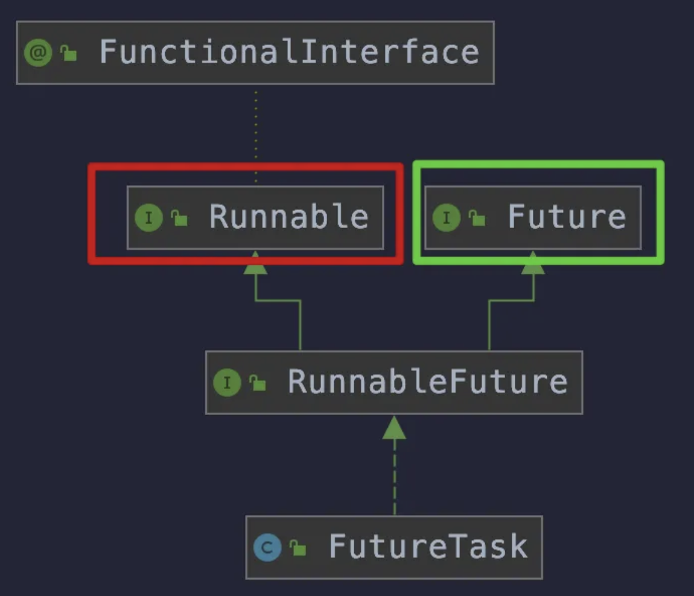

# 观察者模式

```
// 领导[Observer]创建群将相关人员[listener]添加到群，然后向群里面发布一个通知[oberserver.publishEvent]可以是异步。群里面每个人看到这条消息后，做相应的事情【listenner.onEvent】，
```


# 回调

https://www.jb51.net/article/95523.htm

模块之间总是存在这一定的接口，从调用方式上看，可以分为三类：同步调用、回调和异步调用。下面着重详解回调机制。

**1. 概述**

Java 中的回调机制是一个比较常见的机制，只是有可能在你的程序中使用得比较少，在一些大型的框架中回调机制随处可见。本文就通过一些具体的实例，慢慢走近 Java 的回调机制。

**2.回调**

所谓回调：就是**A类中调用B类中的某个方法C，然后B类中反过来调用A类中的方法D，D这个方法就叫回调方法**。实际在使用的时候，也会有不同的回调形式，比如下面的这几种。

**2.1 同步回调**

这里我假设这样的一种情况。

A 公司的总监 B 跟他的下属（项目经理 C）说要做一个调研，不过不用 C 自己亲力亲为。可以让经理 C 去安排他下面的程序员 D 去完成。经理 C 找到了程序员 D，并告诉他，现在要完成一个调研任务。并且把调研的结果告诉经理 C。如果有问题，还是要继续的。 因为这里是 C 让 D 去做一件事情，之后 D 还是要将结果与 C 进行沟通。这样就是回调的模型了。下面是一般回调的类图：


首先我们要有一个回调的接口 CallbackInterface

```
public interface CallbackInterface {
  public boolean check(int result);
}
```

背景里，程序员 D 是要将结果与项目经理 C 进行沟通的，所以这里项目经理需要实现上面的回调接口：

```
public class Manager implements CallbackInterface {

  private Programmer programmer = null;

  public Manager(Programmer _programmer) {
    this.programmer = _programmer;
  }

  /**
   * 用于 Boss 下达的委托
   */
  public void entrust() {
    arrange();
  }

  // 进行安排下属进行 study 工作
  private void arrange() {
    System.out.println("Manager 正在为 Programmer 安排工作");
    programmer.study(Manager.this);
    System.out.println("为 Programmer 安排工作已经完成，Manager 做其他的事情去了。");
  }

  @Override
  public boolean check(int result) {
    if (result == 5) {
      return true;
    }
    return false;
  }

}
```

对于程序员 **D 来说他需要持有一个经理 C 的引用**，以便与他沟通。不过，这里是总监 B 让 经理 C 去安排的任务。也就是说这里也可以让其他的经理，比如说经理 B1， B2等等。因为经理都实现了回调的接口，所以这里就可以直接让程序员 D 持有这个接口就可以了。如下：

```
public class Programmer {

  public void study(CallbackInterface callback) {
    int result = 0;
    do {
      result++;
      System.out.println("第 " + result + " 次研究的结果");
    } while (!callback.check(result));

    System.out.println("调研任务结束");
  }
}


```

对于总监来说就更简单明了了，因为这相当于一个 Client 测试：

```
public class Boss {

  public static void main(String[] args) {
    Manager manager = new Manager(new Programmer());
    manager.entrust();
  }
}

```

运行结果：

Manager 正在为 Programmer 安排工作
第 1 次研究的结果
第 2 次研究的结果
第 3 次研究的结果
第 4 次研究的结果
第 5 次研究的结果
调研任务结束
为 Programmer 安排工作已经完成，Manager 做其他的事情去了。

**2.2 异步回调**

还是上面的例子，你的项目经理不可能要一直等你调研的结果。而是把这个任务交给你之后，他就不管了，他做他的，你做你的。所以，这里需要对回调的函数进行异步处理。
所以，这里我们需要修改 Programmer 类的代码，修改如下：

```java
public class Programmer {

  public Programmer() {
  }

  public void study(CallbackInterface callback) {
    new StudyThread(callback).start();
  }

  // --------------------------- Programmer 正在做的工作 ---------------------------

  class StudyThread extends Thread {

    CallbackInterface callback = null;

    public StudyThread(CallbackInterface _callback) {
      callback = _callback;
    }

    @Override
    public void run() {
      int result = 0;
      do {
        result++;
        System.out.println("第 " + result + " 次研究的结果");
      } while (!callback.check(result));

      System.out.println("调研任务结束");
    }
  }
}
```

运行结果:

Manager 正在为 Programmer 安排工作
为 Programmer 安排工作已经完成，Manager 做其他的事情去了。
第 1 次研究的结果
第 2 次研究的结果
第 3 次研究的结果
第 4 次研究的结果
第 5 次研究的结果
调研任务结束

**2.3 闭包与回调**

闭包（closure）是一个可调用的对象，它记录了一些信息，这些信息来自于创建它的作用域。

**2.3.1 普通调用**

首先，我们可以看看在正常情况下的调用是怎么进行的。
Incrementable.java

这是一个普通的接口（在普通调用里只是普通接口，在回调中就是回调接口，这一点应该很好理解吧）。

Callee1.java

Callbacks.java

Callbacks 是一个测试客户端类，没啥好说的，直接看上面的代码。

**2.3.2 回调初试**

上面的普通调用也没啥好说的，因为这对于一个正常的 Java 程序员来说都应该是想都不用想就可以搞定的事情。

现在如果要构成回调，那么对于程序的结构或是逻辑的思维上都不可能只有一个被调用者（被回调的对象 Callee1），还需要一个调用者对象。调用者可以像下面这样来编写：

Caller.java

这里 Caller 持有一个回调接口的引用 callbackReference，就像在上面说到的程序员需要持有一个项目经理的引用，这样就可以通过这个引用来与项目经理沟通。这里的 callbackReference 也正是起到了这个作用。

现在我们来看看测试类的编写：

Callbacks.java

对于到目前为止的程序代码，完全可以对比上面项目经理安排程序员调研技术难题的代码。有异曲同工之妙。

**2.3.3 闭包回调**

相比于正常的回调，闭包回调的核心自然是在于闭包，也就是对作用域的控制。
现在假设有一个用户（其他程序员）自定义了一个 MyInCrement 类，同时包含了一个 increment 的方法。如下：

另外有一个类 Callee2 继承自上面这个类：

显而易见这里如果要调用 increment() 方法，就变成了一般的函数调用了。所以这里我们需要修改上面的 Callee2 类，修改的目标就是让 Callee2 类可以兼容 MyInCrement 类的 increment() 方法和 Incrementable 的 increment() 方法。修改后：

注意，这里的 Closure 类是一个私有的类，这是一个闭包的要素。因为 Closure 类是私有的，那么就要有一个对外开放的接口，用来对 Closure 对象的操作，这里就是上面的 getCallbackReference() 方法。 Caller 类则没有改变。
对于测试客户端就直接看代码吧：

以上就是本文的全部内容，希望对大家的学习有所帮助，也希望大家多多支持脚本之家。


#### 一、什么是回调：

回调是一种双向的调用模式，程序模块之间通过这样的接口调用完成通信联系，**回调的核心就是回调方将本身即this传递给调用方，这样调用方就可以在调用完毕之后再告诉回调方它想要知道的信息。**

回调函数用于层间协作，上层将本层函数安装在下层，这个函数就是回调，而下层在一定条件下触发回调，例如作为一个驱动，是一个底层，他在收到一个数据时，除了完成本层的处理工作外，还将进行回调，它将这个数据交给上层应用层来做进一步处理，这在分层的数据通信中很普遍。其实回调和API非常接近，他们的共性都是跨层调用的函数。但区别是API是低层提供给高层的调用，一般这个函数对高层都是已知的；而回调正好相反，他是高层提供给底层的调用，对于低层他是未知的，必须由高层进行安装。这个安装函数其实就是一个低层提供的API，安装后低层不知道这个回调的名字，但它通过一个函数指针来保存这个回调，在需要调用时，只需引用这个函数指针和相关的参数指针。

 其实：回调就是该函数写在高层，低层通过一个函数指针保存这个函数，在某个事件的触发下，低层通过该函数指针调用高层那个函数。从调用方式上看，可以分为两类：同步回调、异步回调。

#### 二、同步回调与异步回调：

**1、同步回调：**

同步调用是一种阻塞式调用，是最基本并且最简单的一种调用方式，类A的方法a()调用类B的方法b()，一直等待b()方法执行完毕，a()方法才能继续往下走。这种调用方式适用于方法b()执行时间不长的情况，因为b()方法执行时间一长或者直接阻塞的话，a()方法的余下代码是无法执行下去的，这样会造成整个流程的阻塞。

**2、异步回调：**

（1）异步调用是为了解决同步调用可能出现阻塞，导致整个流程卡住而产生的一种调用方式。类A的方法方法a()通过新起线程的方式调用类B的方法b()，代码接着直接往下执行，这样无论方法b()执行时间多久，都不会阻塞住方法a()的执行。但是这种方式，由于方法a()不等待方法b()的执行完成，在方法a()需要方法b()执行结果的情况下，必须通过一定的方式对方法b()的执行结果进行监听。为了完成这点，就需要另开一个线程了。

（2）异步调用在应用程序框架中具有广泛的应用，并且特指多线程情况下。它同Windows的消息循环机制，消息响应，[消息队列](https://cloud.tencent.com/product/cmq?from_column=20065&from=20065)，事件驱动机制以及设计模式中的观察者模式等都是紧密相关的。 在单线程方式下，计算机是一台严格意义上的冯·诺依曼式机器，一段代码调用另一段代码时，只能采用同步调用，必须等待这段代码执行完返回结果后，调用方才能继续往下执行。有了多线程的支持，可以采用异步调用，调用方和被调方可以属于两个不同的线程，调用方启动被调方线程后，不等对方返回结果就继续执行后续代码。被调方执行完毕后，通过某种手段通知调用方：结果已经出来，请酌情处理。异步回调常见于请求[服务器](https://cloud.tencent.com/act/pro/promotion-cvm?from_column=20065&from=20065)数据，当取到数据时,会进行回调。

#### 三、异步回调例子：

上面讲了那么多，其实所谓回调，就是A类中调用了B类的某个方法C，然后B类反过来调用A类的方法D，D这个方法就叫回调方法。

别人说的比较经典的回调方式：

-  Class A实现接口CallBack callback——背景1
- class A中包含一个class B的引用b ——背景2
- class B有一个参数为callback的方法f(CallBack callback) ——背景3
- A的对象a调用B的方法 f(CallBack callback) ——A类调用B类的某个方法 C
- 然后b就可以在f(CallBack callback)方法中调用A的方法 ——B类调用A类的某个方法D[**回调函数**]

有一天小王遇到一个很难的问题，问题是“1 + 1 = ?”，就打电话问小李，小李一下子也不知道，就跟小王说，等我办完手上的事情，就去想想答案，小王也不会傻傻的拿着电话去等小李的答案吧，于是小王就对小李说，我还要去逛街，你知道了答案就打我电话告诉我，于是挂了电话，自己办自己的事情，过了一个小时，小李打了小王的电话，告诉他答案是2 

```
/**
 * 这是一个回调接口
 */
public interface CallBack {
	/**
	 * 这个是小李知道答案时要调用的函数告诉小王，也就是回调函数
	 * @param result 是答案
	 */
	public void solve(String result);
}
```

```
/**
 * 这个是小王
 * 实现了一个回调接口CallBack，相当于----->背景一
 */
public class Wang implements CallBack {
	/**
	 * 小李对象的引用
	 * 相当于----->背景二
	 */
	private Li li; 
 
	/**
	 * 小王的构造方法，持有小李的引用
	 * @param li
	 */
	public Wang(Li li){
		this.li = li;
	}
	
	/**
	 * 小王通过这个方法去问小李的问题
	 * @param question  就是小王要问的问题,1 + 1 = ?
	 */
	public void askQuestion(final String question){
		//这里用一个线程就是异步
		new Thread(new Runnable() {
			@Override
			public void run() {
				/**
				 * 小王调用小李中的方法，在这里注册回调接口
				 * 这就相当于A类调用B的方法C
				 */
				li.executeMessage(Wang.this, question); 
			}
		}).start();
		
		//小网问完问题挂掉电话就去干其他的事情了，诳街去了
		play();
	}
 
	public void play(){
		System.out.println("我要逛街去了");
	}
 
	/**
	 * 小李知道答案后调用此方法告诉小王，就是所谓的小王的回调方法
	 */
	@Override
	public void solve(String result) {
		System.out.println("小李告诉小王的答案是--->" + result);
	}
}
```

```
/**
 * 这个就是小李
 */
public class Li {
	/**
	 * 相当于B类有参数为CallBack callBack的f()---->背景三
	 * @param callBack  
	 * @param question  小王问的问题
	 */
	public void executeMessage(CallBack callBack, String question){
		System.out.println("小王问的问题--->" + question);
		
		//模拟小李办自己的事情需要很长时间
		for(int i=0; i<10000;i++){
			
		}
		
		/**
		 * 小李办完自己的事情之后想到了答案是2
		 */
		String result = "答案是2";
		
		/**
		 * 于是就打电话告诉小王，调用小王中的方法
		 * 这就相当于B类反过来调用A的方法D
		 */
		callBack.solve(result); 	
	}
}
```

```
/**
 * 测试类
 */
public class Test {
	public static void main(String[]args){
		/**
		 * new 一个小李
		 */
		Li li = new Li();
 
		/**
		 * new 一个小王
		 */
		Wang wang = new Wang(li);
		
		/**
		 * 小王问小李问题
		 */
		wang.askQuestion("1 + 1 = ?");
	}
}
```


通过上面的那个例子你是不是差不多明白了回调机制呢，上面是一个异步回调，我们看看同步回调吧，onClick（）方法

现在来分析分析下Android View的点击方法onclick（）;我们知道onclick()是一个回调方法，当用户点击View就执行这个方法，我们用Button来举例好了

```
//这个是View的一个回调接口
/**

 * Interface definition for a callback to be invoked when a view is clicked.
   */
   public interface OnClickListener {
   /**
    * Called when a view has been clicked.
      *
    * @param v The view that was clicked.
      */
      void onClick(View v);
      }

package com.example.demoactivity;

import android.app.Activity;
import android.os.Bundle;
import android.view.View;
import android.view.View.OnClickListener;
import android.widget.Button;
import android.widget.Toast;

/**

 * 这个就相当于Class A

 * @author xiaanming

 * 实现了 OnClickListener接口---->背景一
   */
   public class MainActivity extends Activity implements OnClickListener{
   /**

    * Class A 包含Class B的引用----->背景二
      */
      private Button button;

   @Override
   public void onCreate(Bundle savedInstanceState) {
   	super.onCreate(savedInstanceState);
   	setContentView(R.layout.activity_main);
   	button = (Button)findViewById(R.id.button1);
   	

   	/**
   	 * Class A 调用View的方法,而Button extends View----->A类调用B类的某个方法 C
   	 */
   	button.setOnClickListener(this);

   }

   /**

    * 用户点击Button时调用的回调函数，你可以做你要做的事
    * 这里我做的是用Toast提示OnClick
      */
      @Override
      public void onClick(View v) {
      Toast.makeText(getApplication(), "OnClick", Toast.LENGTH_LONG).show();
      }

}
```

下面是View类的setOnClickListener方法，就相当于B类咯，只把关键代码贴出来

```
/**

 * 这个View就相当于B类

 * @author xiaanming
   *
    */
   public class View implements Drawable.Callback, KeyEvent.Callback, AccessibilityEventSource {
   /**

    * Listener used to dispatch click events.
    * This field should be made private, so it is hidden from the SDK.
    * {@hide}
      */
      protected OnClickListener mOnClickListener;

   /**

    * setOnClickListener()的参数是OnClickListener接口------>背景三
    * Register a callback to be invoked when this view is clicked. If this view is not
    * clickable, it becomes clickable.
      *
    * @param l The callback that will run
      *
    * @see #setClickable(boolean)
      */

   public void setOnClickListener(OnClickListener l) {
       if (!isClickable()) {
           setClickable(true);
       }
       mOnClickListener = l;
   }


   /**

    * Call this view's OnClickListener, if it is defined.
      *

    * @return True there was an assigned OnClickListener that was called, false

    * otherwise is returned.
      */
      public boolean performClick() {
      sendAccessibilityEvent(AccessibilityEvent.TYPE_VIEW_CLICKED);

      if (mOnClickListener != null) {
          playSoundEffect(SoundEffectConstants.CLICK);
          

          //这个不就是相当于B类调用A类的某个方法D，这个D就是所谓的回调方法咯
          mOnClickListener.onClick(this);
          return true;

      }

      return false;
      }
      }
```

这个例子就是Android典型的回调机制，看完这个你是不是更进一步的理解了回调机制呢？ 线程run()也是一个回调方法，当执行Thread的start（）方法就会回调这个run()方法，还有处理消息都比较经典等等


这也是小弟对回调机制的一点拙见，不懂的请留言，如果有错误希望指出！多谢！


### 子线程如何传递给父线程异常？

````
是的，虽然 Java 的子线程和主线程是独立的，通常不能通过 `throws` 机制将子线程中的异常直接传递给主线程，但有一些方法可以将子线程中的异常传递给主线程并进行处理。常见的方式包括：

### 1. **使用 `Future` 和 `Callable` 处理异常**
通过使用 `ExecutorService`，可以通过 `Callable` 接口启动一个线程，并将其返回值封装在 `Future` 对象中。`Callable` 允许抛出受检异常，而 `Future.get()` 方法会在需要时将子线程的异常抛出到主线程。

#### 示例代码：

```java
import java.util.concurrent.*;

public class AWang {
    private BLi li;

    public void askQuestion(String question) throws Exception {
        ExecutorService executor = Executors.newSingleThreadExecutor();

        // 提交任务并使用 Future 获取结果或异常
        Future<Void> future = executor.submit(() -> {
            li.executeMessage(result -> {
                System.out.println("小李告诉小王的答案是--->" + result);
            }, question);
            return null; // 因为 Callable 必须有返回值，故这里返回 null
        });

        // 阻塞等待子线程完成并处理异常
        try {
            future.get();  // 如果子线程抛出异常，get() 会重新抛出该异常
        } catch (ExecutionException e) {
            // 捕获子线程中的异常
            throw new Exception("子线程中抛出的异常: ", e.getCause());
        } catch (InterruptedException e) {
            Thread.currentThread().interrupt();  // 处理线程被中断的情况
        } finally {
            executor.shutdown();
        }

        // 小王继续去做其他事情
        play();
    }

    public void play() {
        // 小王在玩
    }

    public static void main(String[] args) {
        AWang wang = new AWang();
        wang.li = new BLi();
        try {
            wang.askQuestion("这个问题的答案是什么？");
        } catch (Exception e) {
            System.err.println(e.getMessage());
        }
    }
}
```

### **解释**：
1. **`Callable`**：`Callable` 是可以抛出异常的任务接口，它允许子线程的任务抛出受检异常。
2. **`Future`**：通过 `executor.submit(Callable)`，可以返回一个 `Future` 对象，`future.get()` 会阻塞等待任务完成，并且会捕获子线程中的异常。
3. **`ExecutionException`**：`ExecutionException` 是由 `Future.get()` 抛出的，它封装了子线程的异常，通过 `e.getCause()` 可以获取子线程抛出的原始异常。

### 2. **通过 `UncaughtExceptionHandler` 捕获未捕获的异常**
如果子线程没有捕获异常，Java 提供了 `Thread.UncaughtExceptionHandler` 来处理线程中未捕获的异常。

#### 示例代码：

```java
public class AWang {
    private BLi li;

    public void askQuestion(String question) {
        Thread thread = new Thread(() -> {
            try {
                li.executeMessage(result -> {
                    System.out.println("小李告诉小王的答案是--->" + result);
                }, question);
            } catch (Exception e) {
                throw new RuntimeException(e);  // 将异常包装成 unchecked 异常
            }
        }, "wang");

        // 设置该线程的异常处理器
        thread.setUncaughtExceptionHandler((t, e) -> {
            System.err.println("子线程出现异常：" + e.getMessage());
        });

        thread.start();

        // 小王继续去做其他事情
        play();
    }

    public void play() {
        // 小王在玩
    }

    public static void main(String[] args) {
        AWang wang = new AWang();
        wang.li = new BLi();
        wang.askQuestion("这个问题的答案是什么？");
    }
}
```

### **解释**：
1. **`Thread.UncaughtExceptionHandler`**：这是线程在没有捕获异常时的最后一道防线。你可以为每个线程设置一个异常处理器，处理线程中未捕获的异常。
2. **`setUncaughtExceptionHandler`**：通过调用线程的 `setUncaughtExceptionHandler`，你可以指定当该线程抛出未捕获的异常时如何处理。

### 3. **使用自定义的异常传递机制**
你也可以设计自定义的机制，在子线程中发生异常时，主动通知主线程。比如使用阻塞队列、共享变量或观察者模式等。

#### 使用阻塞队列的简单例子：

```java
import java.util.concurrent.BlockingQueue;
import java.util.concurrent.LinkedBlockingQueue;

public class AWang {
    private BLi li;
    private BlockingQueue<Throwable> exceptionQueue = new LinkedBlockingQueue<>();

    public void askQuestion(String question) {
        Thread thread = new Thread(() -> {
            try {
                li.executeMessage(result -> {
                    System.out.println("小李告诉小王的答案是--->" + result);
                }, question);
            } catch (Exception e) {
                // 将异常放入队列
                exceptionQueue.offer(e);
            }
        }, "wang");

        thread.start();

        // 检查队列中的异常
        try {
            Throwable throwable = exceptionQueue.take();  // 阻塞等待异常
            throw new RuntimeException("子线程抛出的异常", throwable);
        } catch (InterruptedException e) {
            Thread.currentThread().interrupt();
        }

        // 小王继续去做其他事情
        play();
    }

    public void play() {
        // 小王在玩
    }

    public static void main(String[] args) {
        AWang wang = new AWang();
        wang.li = new BLi();
        wang.askQuestion("这个问题的答案是什么？");
    }
}
```

### **总结**：
- 使用 **`Future` 和 `Callable`** 是最直接的方法来传递子线程中的异常到主线程。
- 通过 **`Thread.UncaughtExceptionHandler`** 可以捕获未捕获的异常，但它仅适用于子线程没有自己处理异常的情况。
- 你也可以通过其他机制（如队列、共享变量）设计自定义的异常传递方式。

选择适合的方式取决于你的实际需求。如果子线程的任务需要返回结果或抛出异常，使用 `Future` 会更加自然。如果只是希望在出错时记录异常，`UncaughtExceptionHandler` 可能更加简洁。
````


https://mp.weixin.qq.com/s?__biz=MzAxODcyNjEzNQ%3D%3D&chksm=9bd3595aaca4d04c6d12a922bcc454249f12a367fed4b677daacfa3ee4dd9e669efb6b55584c&idx=4&mid=2247496898&scene=27&sn=1bd1f30fac48b1797a823553c1b4a08e&utm_campaign=geek_search&utm_content=geek_search&utm_medium=geek_search&utm_source=geek_search&utm_term=geek_search#wechat_redirect

### Callable和Future

Callable接口类似于Runnable，从名字就可以看出来了，但是Runnable不会返回结果，并且无法抛

出返回结果的异常，而Callable功能更强大一些，被线程执行后，可以返回值，这个返回值可以被

Future拿到，也就是说，Future可以拿到异步执行任务的返回值。可以认为是带有回调的

Runnable。

Future接口表示异步任务，是还没有完成的任务给出的未来结果。所以说Callable用于产生结果，

Future用于获取结果




很神奇的一个接口，`FutureTask` 实现了 `RunnableFuture` 接口，而  `RunnableFuture` 接口又分别实现了 `Runnable` 和 `Future` 接口，所以可以推断出 `FutureTask` 具有这两种接口的特性：

- 有 `Runnable` 特性，所以可以用在 `ExecutorService` 中配合线程池使用

- 有 `Future` 特性，所以可以从中获取到执行结果

  

阅读 Java 并发工具类源码，我们无非就是要关注以下这三点：

```
- 状态 （代码逻辑的主要控制）
- 队列 （等待排队队列）
- CAS （安全的set 值）
```

知道了 run() 方法是如何保存结果的，以及知道了将正常结果/异常结果保存到了 outcome 变量里，那就需要看一下 FutureTask 是如何通过 get() 方法获取结果的：

```
public V get() throws InterruptedException, ExecutionException {
    int s = state;
   // 如果 state 还没到 set outcome 结果的时候，则调用 awaitDone() 方法阻塞自己
    if (s <= COMPLETING)
        s = awaitDone(false, 0L);
   // 返回结果
    return report(s);
}
```

#### awaitDone方法

第一轮for循环，执行的逻辑是 `q == null`, 这时候会新建一个节点 q, 第一轮循环结束。

第二轮for循环，执行的逻辑是 `!queue`，这个时候会把第一轮循环中生成的节点的 next 指针指向waiters，然后CAS的把节点q 替换waiters, 也就是把新生成的节点添加到waiters 中的首节点。如果替换成功，queued=true。第二轮循环结束。

第三轮for循环，进行阻塞等待。要么阻塞特定时间，要么一直阻塞知道被其他线程唤醒。

#### finishCompletion方法

如果程序运行正常，通常调用 get() 方法，会将当前线程挂起，那谁来唤醒呢？自然是 run() 方法运行完会唤醒，设置返回结果（set方法）/异常的方法(setException方法) 两个方法中都会调用 finishCompletion 方法，该方法就会唤醒等待队列中的线程


```
Java 中这个叫 Future 的东东，你用过嘛？

tan日拱一兵  程序猿DD  2020年07月18日 09:32
前言
创建线程有几种方式？这个问题的答案应该是可以脱口而出的吧
继承 Thread 类
实现 Runnable 接口
但这两种方式创建的线程是属于”三无产品“：
没有参数
没有返回值
没办法抛出异常
class MyThread implements Runnable{
   @Override
   public void run() {
      log.info("my thread");
   }
}
Runnable 接口是 JDK1.0 的核心产物
 /**
 * @since   JDK1.0
 */
@FunctionalInterface
public interface Runnable {
    public abstract void run();
}
用着 “三无产品” 总是有一些弊端，其中没办法拿到返回值是最让人不能忍的，于是 Callable 就诞生了
Callable
又是 Doug Lea 大师，又是 Java 1.5 这个神奇的版本
 /**
 * @see Executor
 * @since 1.5
 * @author Doug Lea
 * @param <V> the result type of method {@code call}
 */
@FunctionalInterface
public interface Callable<V> {
    
    V call() throws Exception;
}
Callable 是一个泛型接口，里面只有一个 call() 方法，该方法可以返回泛型值 V ，使用起来就像这样：
Callable<String> callable = () -> {
    // Perform some computation
    Thread.sleep(2000);
    return "Return some result";
};
图片
二者都是函数式接口，里面都仅有一个方法，使用上又是如此相似，除了有无返回值，Runnable 与 Callable 就点差别吗？
Runnable VS Callable
两个接口都是用于多线程执行任务的，但他们还是有很明显的差别的
图片
执行机制

先从执行机制上来看，Runnable 你太清楚了，它既可以用在 Thread 类中，也可以用在 ExecutorService 类中配合线程池的使用；Bu～～～～t，  Callable 只能在 ExecutorService 中使用，你翻遍 Thread 类，也找不到Callable 的身影
图片
异常处理

Runnable 接口中的 run 方法签名上没有 throws ，自然也就没办法向上传播受检异常；而 Callable 的 call() 方法签名却有 throws，所以它可以处理受检异常；
所以归纳起来看主要有这几处不同点：
图片
整体差别虽然不大，但是这点差别，却具有重大意义
返回值和处理异常很好理解，另外，在实际工作中，我们通常要使用线程池来管理线程（原因已经在 为什么要使用线程池? 中明确说明），所以我们就来看看 ExecutorService 中是如何使用二者的
ExecutorService
先来看一下 ExecutorService 类图
图片
我将上图标记的方法单独放在此处
void execute(Runnable command);

<T> Future<T> submit(Callable<T> task);
<T> Future<T> submit(Runnable task, T result);
Future<?> submit(Runnable task);
可以看到，使用ExecutorService 的 execute() 方法依旧得不到返回值，而 submit()方法清一色的返回 Future 类型的返回值
细心的朋友可能已经发现， submit() 方法已经在 CountDownLatch 和 CyclicBarrier 傻傻的分不清楚？文章中多次使用了，只不过我们没有获取其返回值罢了，那么
Future 到底是什么呢？
怎么通过它获取返回值呢？
我们带着这些疑问一点点来看
Future
Future 又是一个接口，里面只有五个方法：
图片
从方法名称上相信你已经能看出这些方法的作用
// 取消任务
boolean cancel(boolean mayInterruptIfRunning);

// 获取任务执行结果
V get() throws InterruptedException, ExecutionException;

// 获取任务执行结果，带有超时时间限制
V get(long timeout, TimeUnit unit) throws InterruptedException,                             ExecutionException,  TimeoutException;

// 判断任务是否已经取消
boolean isCancelled();

// 判断任务是否已经结束
boolean isDone();

铺垫了这么多，看到这你也许有些乱了，咱们赶紧看一个例子，演示一下几个方法的作用
@Slf4j
public class FutureAndCallableExample {

   public static void main(String[] args) throws InterruptedException, ExecutionException {
      ExecutorService executorService = Executors.newSingleThreadExecutor();

      // 使用 Callable ，可以获取返回值
      Callable<String> callable = () -> {
         log.info("进入 Callable 的 call 方法");
         // 模拟子线程任务，在此睡眠 2s，
         // 小细节：由于 call 方法会抛出 Exception，这里不用像使用 Runnable 的run 方法那样 try/catch 了
         Thread.sleep(5000);
         return "Hello from Callable";
      };

      log.info("提交 Callable 到线程池");
      Future<String> future = executorService.submit(callable);

      log.info("主线程继续执行");

      log.info("主线程等待获取 Future 结果");
      // Future.get() blocks until the result is available
      String result = future.get();
      log.info("主线程获取到 Future 结果: {}", result);

      executorService.shutdown();
   }
}
程序运行结果如下：
图片
如果你运行上述示例代码，主线程调用 future.get() 方法会阻塞自己，直到子任务完成。我们也可以使用 Future 方法提供的 isDone 方法，它可以用来检查 task 是否已经完成了，我们将上面程序做点小修改：
// 如果子线程没有结束，则睡眠 1s 重新检查
while(!future.isDone()) {
   System.out.println("Task is still not done...");
   Thread.sleep(1000);
}
来看运行结果：
图片
如果子程序运行时间过长，或者其他原因，我们想 cancel 子程序的运行，则我们可以使用 Future 提供的 cancel 方法，继续对程序做一些修改
while(!future.isDone()) {
   System.out.println("子线程任务还没有结束...");
   Thread.sleep(1000);

   double elapsedTimeInSec = (System.nanoTime() - startTime)/1000000000.0;

   // 如果程序运行时间大于 1s，则取消子线程的运行
   if(elapsedTimeInSec > 1) {
      future.cancel(true);
   }
}
来看运行结果：
图片
为什么调用 cancel 方法程序会出现 CancellationException 呢？是因为调用 get() 方法时，明确说明了：
调用 get() 方法时，如果计算结果被取消了，则抛出 CancellationException （具体原因，你会在下面的源码分析中看到）
图片
有异常不处理是非常不专业的，所以我们需要进一步修改程序，以更友好的方式处理异常
// 通过 isCancelled 方法判断程序是否被取消，如果被取消，则打印日志，如果没被取消，则正常调用 get() 方法
if (!future.isCancelled()){
   log.info("子线程任务已完成");
   String result = future.get();
   log.info("主线程获取到 Future 结果: {}", result);
}else {
   log.warn("子线程任务被取消");
}
查看程序运行结果：
图片
相信到这里你已经对 Future 的几个方法有了基本的使用印象，但 Future 是接口，其实使用 ExecutorService.submit() 方法返回的一直都是 Future 的实现类 FutureTask
图片
接下来我们就进入这个核心实现类一探究竟
FutureTask
同样先来看类结构
图片
public interface RunnableFuture<V> extends Runnable, Future<V> {
    void run();
}
很神奇的一个接口，FutureTask 实现了 RunnableFuture 接口，而  RunnableFuture  接口又分别实现了 Runnable 和 Future 接口，所以可以推断出 FutureTask 具有这两种接口的特性：
有 Runnable 特性，所以可以用在 ExecutorService 中配合线程池使用
有 Future 特性，所以可以从中获取到执行结果
FutureTask源码分析

如果你完整的看过 AQS 相关分析的文章，你也许会发现，阅读 Java 并发工具类源码，我们无非就是要关注以下这三点：
- 状态 （代码逻辑的主要控制）
- 队列 （等待排队队列）
- CAS （安全的set 值）
脑海中牢记这三点，咱们开始看 FutureTask 源码，看一下它是如何围绕这三点实现相应的逻辑的
文章开头已经提到，实现 Runnable 接口形式创建的线程并不能获取到返回值，而实现 Callable 的才可以，所以 FutureTask 想要获取返回值，必定是和 Callable 有联系的，这个推断一点都没错，从构造方法中就可以看出来：
public FutureTask(Callable<V> callable) {
    if (callable == null)
        throw new NullPointerException();
    this.callable = callable;
    this.state = NEW;       // ensure visibility of callable
}
即便在 FutureTask 构造方法中传入的是 Runnable 形式的线程，该构造方法也会通过 Executors.callable 工厂方法将其转换为 Callable 类型：
public FutureTask(Runnable runnable, V result) {
    this.callable = Executors.callable(runnable, result);
    this.state = NEW;       // ensure visibility of callable
}
图片
但是 FutureTask 实现的是 Runnable 接口，也就是只能重写 run() 方法，run() 方法又没有返回值，那问题来了：
FutureTask 是怎样在 run() 方法中获取返回值的？
它将返回值放到哪里了？
get() 方法又是怎样拿到这个返回值的呢？
我们来看一下 run() 方法（关键代码都已标记注释）
public void run() {
   // 如果状态不是 NEW，说明任务已经执行过或者已经被取消，直接返回
   // 如果状态是 NEW，则尝试把执行线程保存在 runnerOffset（runner字段），如果赋值失败，则直接返回
    if (state != NEW ||
        !UNSAFE.compareAndSwapObject(this, runnerOffset,
                                     null, Thread.currentThread()))
        return;
    try {
       // 获取构造函数传入的 Callable 值
        Callable<V> c = callable;
        if (c != null && state == NEW) {
            V result;
            boolean ran;
            try {
               // 正常调用 Callable 的 call 方法就可以获取到返回值
                result = c.call();
                ran = true;
            } catch (Throwable ex) {
                result = null;
                ran = false;
               // 保存 call 方法抛出的异常
                setException(ex);
            }
            if (ran)
               // 保存 call 方法的执行结果
                set(result);
        }
    } finally {        
        runner = null;       
        int s = state;
       // 如果任务被中断，则执行中断处理
        if (s >= INTERRUPTING)
            handlePossibleCancellationInterrupt(s);
    }
}
run() 方法没有返回值，至于 run() 方法是如何将 call() 方法的返回结果和异常都保存起来的呢？其实非常简单, 就是通过 set(result) 保存正常程序运行结果，或通过 setException(ex) 保存程序异常信息
/** The result to return or exception to throw from get() */
private Object outcome; // non-volatile, protected by state reads/writes

// 保存异常结果
protected void setException(Throwable t) {
    if (UNSAFE.compareAndSwapInt(this, stateOffset, NEW, COMPLETING)) {
        outcome = t;
        UNSAFE.putOrderedInt(this, stateOffset, EXCEPTIONAL); // final state
        finishCompletion();
    }
}

// 保存正常结果
protected void set(V v) {
  if (UNSAFE.compareAndSwapInt(this, stateOffset, NEW, COMPLETING)) {
    outcome = v;
    UNSAFE.putOrderedInt(this, stateOffset, NORMAL); // final state
    finishCompletion();
  }
}
setException 和 set 方法非常相似，都是将异常或者结果保存在 Object 类型的 outcome 变量中，outcome 是成员变量，就要考虑线程安全，所以他们要通过 CAS方式设置 outcome 变量的值，既然是在 CAS 成功后 更改 outcome 的值，这也就是 outcome 没有被 volatile 修饰的原因所在。
图片
保存正常结果值（set方法）与保存异常结果值（setException方法）两个方法代码逻辑，唯一的不同就是 CAS 传入的 state 不同。我们上面提到，state 多数用于控制代码逻辑，FutureTask 也是这样，所以要搞清代码逻辑，我们需要先对 state 的状态变化有所了解
 /*
 *
 * Possible state transitions:
 * NEW -> COMPLETING -> NORMAL  //执行过程顺利完成
 * NEW -> COMPLETING -> EXCEPTIONAL //执行过程出现异常
 * NEW -> CANCELLED // 执行过程中被取消
 * NEW -> INTERRUPTING -> INTERRUPTED //执行过程中，线程被中断
 */
private volatile int state;
private static final int NEW          = 0;
private static final int COMPLETING   = 1;
private static final int NORMAL       = 2;
private static final int EXCEPTIONAL  = 3;
private static final int CANCELLED    = 4;
private static final int INTERRUPTING = 5;
private static final int INTERRUPTED  = 6;
7种状态，千万别慌，整个状态流转其实只有四种线路
图片
FutureTask 对象被创建出来，state 的状态就是 NEW 状态，从上面的构造函数中你应该已经发现了，四个最终状态 NORMAL ，EXCEPTIONAL ， CANCELLED ， INTERRUPTED 也都很好理解，两个中间状态稍稍有点让人困惑:
COMPLETING: outcome 正在被set 值的时候
INTERRUPTING：通过 cancel(true) 方法正在中断线程的时候
总的来说，这两个中间状态都表示一种瞬时状态，我们将几种状态图形化展示一下：
图片
我们知道了 run() 方法是如何保存结果的，以及知道了将正常结果/异常结果保存到了 outcome 变量里，那就需要看一下 FutureTask 是如何通过 get() 方法获取结果的：
public V get() throws InterruptedException, ExecutionException {
    int s = state;
   // 如果 state 还没到 set outcome 结果的时候，则调用 awaitDone() 方法阻塞自己
    if (s <= COMPLETING)
        s = awaitDone(false, 0L);
   // 返回结果
    return report(s);
}
awaitDone 方法是 FutureTask 最核心的一个方法
// get 方法支持超时限制，如果没有传入超时时间，则接受的参数是 false 和 0L
// 有等待就会有队列排队或者可响应中断，从方法签名上看有 InterruptedException，说明该方法这是可以被中断的
private int awaitDone(boolean timed, long nanos)
    throws InterruptedException {
   // 计算等待截止时间
    final long deadline = timed ? System.nanoTime() + nanos : 0L;
    WaitNode q = null;
    boolean queued = false;
    for (;;) {
       // 如果当前线程被中断，如果是，则在等待对立中删除该节点，并抛出 InterruptedException
        if (Thread.interrupted()) {
            removeWaiter(q);
            throw new InterruptedException();
        }

        int s = state;
       // 状态大于 COMPLETING 说明已经达到某个最终状态（正常结束/异常结束/取消）
       // 把 thread 只为空，并返回结果
        if (s > COMPLETING) {
            if (q != null)
                q.thread = null;
            return s;
        }
       // 如果是COMPLETING 状态（中间状态），表示任务已结束，但 outcome 赋值还没结束，这时主动让出执行权，让其他线程优先执行（只是发出这个信号，至于是否别的线程执行一定会执行可是不一定的）
        else if (s == COMPLETING) // cannot time out yet
            Thread.yield();
       // 等待节点为空
        else if (q == null)
           // 将当前线程构造节点
            q = new WaitNode();
       // 如果还没有入队列，则把当前节点加入waiters首节点并替换原来waiters
        else if (!queued)
            queued = UNSAFE.compareAndSwapObject(this, waitersOffset,
                                                 q.next = waiters, q);
       // 如果设置超时时间
        else if (timed) {
            nanos = deadline - System.nanoTime();
           // 时间到，则不再等待结果
            if (nanos <= 0L) {
                removeWaiter(q);
                return state;
            }
           // 阻塞等待特定时间
            LockSupport.parkNanos(this, nanos);
        }
        else
           // 挂起当前线程，知道被其他线程唤醒
            LockSupport.park(this);
    }
}
总的来说，进入这个方法，通常会经历三轮循环
第一轮for循环，执行的逻辑是 q == null, 这时候会新建一个节点 q, 第一轮循环结束。
第二轮for循环，执行的逻辑是 !queue，这个时候会把第一轮循环中生成的节点的 next 指针指向waiters，然后CAS的把节点q 替换waiters, 也就是把新生成的节点添加到waiters 中的首节点。如果替换成功，queued=true。第二轮循环结束。
第三轮for循环，进行阻塞等待。要么阻塞特定时间，要么一直阻塞知道被其他线程唤醒。
对于第二轮循环，大家可能稍稍有点迷糊，我们前面说过，有阻塞，就会排队，有排队自然就有队列，FutureTask 内部同样维护了一个队列
/** Treiber stack of waiting threads */
private volatile WaitNode waiters;
说是等待队列，其实就是一个 Treiber 类型 stack，既然是 stack， 那就像手枪的弹夹一样（脑补一下子弹放入弹夹的情形），后进先出，所以刚刚说的第二轮循环，会把新生成的节点添加到 waiters stack 的首节点
如果程序运行正常，通常调用 get() 方法，会将当前线程挂起，那谁来唤醒呢？自然是 run() 方法运行完会唤醒，设置返回结果（set方法）/异常的方法(setException方法) 两个方法中都会调用 finishCompletion 方法，该方法就会唤醒等待队列中的线程
private void finishCompletion() {
    // assert state > COMPLETING;
    for (WaitNode q; (q = waiters) != null;) {
        if (UNSAFE.compareAndSwapObject(this, waitersOffset, q, null)) {
            for (;;) {
                Thread t = q.thread;
                if (t != null) {
                    q.thread = null;
                   // 唤醒等待队列中的线程
                    LockSupport.unpark(t);
                }
                WaitNode next = q.next;
                if (next == null)
                    break;
                q.next = null; // unlink to help gc
                q = next;
            }
            break;
        }
    }

    done();

    callable = null;        // to reduce footprint
}
将一个任务的状态设置成终止态只有三种方法：
set
setException
cancel
前两种方法已经分析完，接下来我们就看一下 cancel 方法
查看 Future cancel()，该方法注释上明确说明三种 cancel 操作一定失败的情形
任务已经执行完成了
任务已经被取消过了
任务因为某种原因不能被取消
其它情况下，cancel操作将返回true。值得注意的是，cancel操作返回 true 并不代表任务真的就是被取消, 这取决于发动cancel状态时，任务所处的状态
如果发起cancel时任务还没有开始运行，则随后任务就不会被执行；
如果发起cancel时任务已经在运行了，则这时就需要看 mayInterruptIfRunning 参数了：
如果mayInterruptIfRunning 为true, 则当前在执行的任务会被中断
如果mayInterruptIfRunning 为false, 则可以允许正在执行的任务继续运行，直到它执行完
有了这些铺垫，看一下 cancel 代码的逻辑就秒懂了
public boolean cancel(boolean mayInterruptIfRunning) {
  
    if (!(state == NEW &&
          UNSAFE.compareAndSwapInt(this, stateOffset, NEW,
              mayInterruptIfRunning ? INTERRUPTING : CANCELLED)))
        return false;
    try {    // in case call to interrupt throws exception
       // 需要中断任务执行线程
        if (mayInterruptIfRunning) {
            try {
                Thread t = runner;
               // 中断线程
                if (t != null)
                    t.interrupt();
            } finally { // final state
               // 修改为最终状态 INTERRUPTED
                UNSAFE.putOrderedInt(this, stateOffset, INTERRUPTED);
            }
        }
    } finally {
       // 唤醒等待中的线程
        finishCompletion();
    }
    return true;
}
核心方法终于分析完了，到这咱们喝口茶休息一下吧
图片
我是想说，使用 FutureTask 来演练烧水泡茶经典程序
图片
如上图：
洗水壶 1 分钟
烧开水 15 分钟
洗茶壶 1 分钟
洗茶杯 1 分钟
拿茶叶 2 分钟
最终泡茶
让我心算一下，如果串行总共需要 20 分钟，但很显然在烧开水期间，我们可以洗茶壶/洗茶杯/拿茶叶
图片
这样总共需要 16 分钟，节约了 4分钟时间，烧水泡茶尚且如此，在现在高并发的时代，4分钟可以做的事太多了，学会使用 Future 优化程序是必然（其实优化程序就是寻找关键路径，关键路径找到了，非关键路径的任务通常就可以和关键路径的内容并行执行了）
@Slf4j
public class MakeTeaExample {

   public static void main(String[] args) throws ExecutionException, InterruptedException {
      ExecutorService executorService = Executors.newFixedThreadPool(2);

      // 创建线程1的FutureTask
      FutureTask<String> ft1 = new FutureTask<String>(new T1Task());
      // 创建线程2的FutureTask
      FutureTask<String> ft2 = new FutureTask<String>(new T2Task());

      executorService.submit(ft1);
      executorService.submit(ft2);

      log.info(ft1.get() + ft2.get());
      log.info("开始泡茶");

      executorService.shutdown();
   }

   static class T1Task implements Callable<String> {

      @Override
      public String call() throws Exception {
         log.info("T1:洗水壶...");
         TimeUnit.SECONDS.sleep(1);

         log.info("T1:烧开水...");
         TimeUnit.SECONDS.sleep(15);

         return "T1:开水已备好";
      }
   }

   static class T2Task implements Callable<String> {
      @Override
      public String call() throws Exception {
         log.info("T2:洗茶壶...");
         TimeUnit.SECONDS.sleep(1);

         log.info("T2:洗茶杯...");
         TimeUnit.SECONDS.sleep(2);

         log.info("T2:拿茶叶...");
         TimeUnit.SECONDS.sleep(1);
         return "T2:福鼎白茶拿到了";
      }
   }
}
上面的程序是主线程等待两个 FutureTask 的执行结果，线程1 烧开水时间更长，线程1希望在水烧开的那一刹那就可以拿到茶叶直接泡茶，怎么半呢？
图片
那只需要在线程 1 的FutureTask 中获取 线程 2 FutureTask 的返回结果就可以了，我们稍稍修改一下程序：
@Slf4j
public class MakeTeaExample1 {

   public static void main(String[] args) throws ExecutionException, InterruptedException {
      ExecutorService executorService = Executors.newFixedThreadPool(2);

      // 创建线程2的FutureTask
      FutureTask<String> ft2 = new FutureTask<String>(new T2Task());
      // 创建线程1的FutureTask
      FutureTask<String> ft1 = new FutureTask<String>(new T1Task(ft2));
      
      executorService.submit(ft1);
      executorService.submit(ft2);

      executorService.shutdown();
   }

   static class T1Task implements Callable<String> {

      private FutureTask<String> ft2;
      public T1Task(FutureTask<String> ft2) {
         this.ft2 = ft2;
      }

      @Override
      public String call() throws Exception {
         log.info("T1:洗水壶...");
         TimeUnit.SECONDS.sleep(1);

         log.info("T1:烧开水...");
         TimeUnit.SECONDS.sleep(15);

         String t2Result = ft2.get();
         log.info("T1 拿到T2的 {}， 开始泡茶", t2Result);
         return "T1: 上茶！！！";
      }
   }

   static class T2Task implements Callable<String> {
      @Override
      public String call() throws Exception {
         log.info("T2:洗茶壶...");
         TimeUnit.SECONDS.sleep(1);

         log.info("T2:洗茶杯...");
         TimeUnit.SECONDS.sleep(2);

         log.info("T2:拿茶叶...");
         TimeUnit.SECONDS.sleep(1);
         return "福鼎白茶";
      }
   }
}
来看程序运行结果：
图片
知道这个变化后我们再回头看 ExecutorService 的三个 submit 方法：
<T> Future<T> submit(Runnable task, T result);
Future<?> submit(Runnable task);
<T> Future<T> submit(Callable<T> task);
第一种方法，逐层代码查看到这里：
图片
你会发现，和我们改造烧水泡茶的程序思维是相似的，可以传进去一个 result，result 相当于主线程和子线程之间的桥梁，通过它主子线程可以共享数据
第二个方法参数是 Runnable 类型参数，即便调用 get() 方法也是返回 null，所以仅是可以用来断言任务已经结束了，类似 Thread.join()
第三个方法参数是 Callable 类型参数，通过get() 方法可以明确获取 call() 方法的返回值
到这里，关于 Future 的整块讲解就结束了，还是需要简单消化一下的
图片
总结
如果熟悉 Javascript 的朋友，Future 的特性和 Javascript 的 Promise 是类似的，私下开玩笑通常将其比喻成男朋友的承诺
回归到Java，我们从 JDK 的演变历史，谈及 Callable 的诞生，它弥补了 Runnable 没有返回值的空缺，通过简单的 demo 了解 Callable 与 Future 的使用。FutureTask 又是 Future接口的核心实现类，通过阅读源码了解了整个实现逻辑，最后结合FutureTask 和线程池演示烧水泡茶程序，相信到这里，你已经可以轻松获取线程结果了
烧水泡茶是非常简单的，如果更复杂业务逻辑，以这种方式使用 Future 必定会带来很大的会乱（程序结束没办法主动通知，Future 的链接和整合都需要手动操作）为了解决这个短板，没错，又是那个男人 Doug Lea, CompletableFuture 工具类在 Java1.8 的版本出现了，搭配 Lambda 的使用，让我们编写异步程序也像写串行代码那样简单，纵享丝滑
图片
接下来我们就了解一下 CompletableFuture 的使用
我还要啰嗦一句：烧水泡茶只是抛出去的砖，无论生活还是工作都要思考，寻找任务关键路径，提升自己的效率 （文章底部留言区踩一踩？）
灵魂追问
你在日常开发工作中是怎样将整块任务做到分工与协作的呢？有什么基本准则吗？
如何批量的执行异步任务呢？
参考
Java 并发编程实战
Java 并发编程的艺术
Java 并发编程之美


图片
​

微信扫一扫
关注该公众号
```


### **1. Future 的局限性：无法主动通知**

在 Java 的 `Future` 类中，程序的设计是**被动的**。也就是说，`Future` 提供了一个 `get()` 方法来获取任务执行的结果，但如果任务尚未完成，调用 `get()` 会导致调用线程阻塞，直到任务完成并返回结果。

- **问题**：`Future` 并不会主动通知调用方任务完成，调用方必须显式地调用 `get()` 来等待结果。因此，`Future` 无法在任务完成时主动推送结果，只能在调用方主动请求时才返回结果。

### **示例：使用 `Future` 和 `get()` 等待结果**

```java
import java.util.concurrent.*;

public class FutureExample {
    public static void main(String[] args) {
        ExecutorService executor = Executors.newSingleThreadExecutor();

        // 提交一个异步任务
        Future<Integer> future = executor.submit(() -> {
            try {
                Thread.sleep(2000); // 模拟耗时任务
            } catch (InterruptedException e) {
                e.printStackTrace();
            }
            return 42;
        });

        // 调用 get() 阻塞当前线程，等待任务完成
        try {
            Integer result = future.get(); // 阻塞直到任务完成
            System.out.println("任务完成，结果：" + result);
        } catch (InterruptedException | ExecutionException e) {
            e.printStackTrace();
        }

        executor.shutdown();
    }
}
```

**解释**：

- 在上面的代码中，主线程提交了一个异步任务（`submit`）。该任务在执行时会睡眠 2 秒钟，然后返回一个结果 42。
- **主线程调用 `future.get()` 时会阻塞**，直到异步任务执行完毕并返回结果。
- 此时，主线程在等待期间无法执行其他操作，无法主动知道任务什么时候完成，直到调用 `get()` 方法时才会得到结果。

------

### **2. CompletableFuture 的主动通知（回调机制）**

相比之下，`CompletableFuture` 允许在任务完成时**主动通知**调用方。通过使用 `thenApply`、`thenAccept` 或 `thenRun` 等方法，调用方可以为任务的完成定义一个**回调**函数，在任务完成后自动执行，不需要调用 `get()` 阻塞线程。

- **优势**：`CompletableFuture` 可以在任务完成后自动执行回调，不会阻塞当前线程，且允许继续处理其他任务。

### **示例：使用 `CompletableFuture` 和回调机制**

```java
import java.util.concurrent.*;

public class CompletableFutureExample {
    public static void main(String[] args) {
        ExecutorService executor = Executors.newSingleThreadExecutor();

        // 提交一个异步任务
        CompletableFuture<Integer> future = CompletableFuture.supplyAsync(() -> {
            try {
                Thread.sleep(2000); // 模拟耗时任务
            } catch (InterruptedException e) {
                e.printStackTrace();
            }
            return 42;
        }, executor);

        // 注册回调，当任务完成时触发
        future.thenAccept(result -> {
            System.out.println("任务完成，结果：" + result);
        });

        // 主线程可以继续执行其他操作
        System.out.println("主线程继续执行其他任务...");

        // 等待一段时间，确保任务完成后回调被触发
        try {
            Thread.sleep(3000);  // 确保主线程在任务完成后不会提前退出
        } catch (InterruptedException e) {
            e.printStackTrace();
        }

        executor.shutdown();
    }
}
```

**解释**：

- 在这段代码中，`CompletableFuture.supplyAsync()` 提交了一个异步任务，类似于 `Future` 的 `submit()` 方法。
- 任务执行完毕后，通过 `thenAccept` 注册了一个回调函数，当任务完成时，回调函数会自动被执行，输出任务的结果。
- **主线程并不会被阻塞**，它继续执行其他任务（这里是 `System.out.println("主线程继续执行其他任务...");`），直到任务完成并触发回调。

**输出**：

```
主线程继续执行其他任务...
任务完成，结果：42
```

------

### **3. 区别总结**

| **特点**               | **`Future`**                                       | **`CompletableFuture`**                               |
| ---------------------- | -------------------------------------------------- | ----------------------------------------------------- |
| **任务完成的通知方式** | 调用 `get()` 时阻塞线程等待任务完成。              | 任务完成时自动触发回调函数，无需阻塞线程。            |
| **阻塞行为**           | 必须调用 `get()` 来阻塞等待任务完成。              | 支持链式回调，可以在任务完成后异步执行后续操作。      |
| **线程的使用**         | 主线程在等待结果时会被阻塞，无法继续执行其他任务。 | 主线程可以继续执行其他任务，直到回调函数被触发。      |
| **异步任务链接**       | 需要手动链接多个 `Future` 对象（不方便）。         | 通过 `thenApply`、`thenAccept` 等方法链式调用，方便。 |
| **回调机制**           | 不支持回调机制，无法主动通知调用方任务完成。       | 支持回调机制，任务完成时主动通知调用方。              |

#### **具体的区别举例**：

- **主动通知：**
  - `Future` 无法主动通知调用方任务何时完成，调用方只能在调用 `get()` 后得知。
  - `CompletableFuture` 可以在任务完成时，通过回调函数主动通知调用方。
- **阻塞 vs 非阻塞：**
  - `Future` 在等待任务结果时会阻塞当前线程，其他操作需要等到 `get()` 返回后才能执行。
  - `CompletableFuture` 在任务执行期间不会阻塞主线程，可以通过回调机制让程序在等待任务完成的同时继续执行其他操作。
- **任务整合：**
  - 使用 `Future` 进行任务的串联和整合需要手动调用 `get()` 并处理异常，代码较为繁琐。
  - `CompletableFuture` 提供了丰富的链式方法，使得多个异步任务的整合变得简单且清晰。

------

### **4. 总结**

`CompletableFuture` 解决了 `Future` 的一些局限性，特别是在**主动通知**和**任务链式调用**方面。它提供了更加灵活和高效的异步编程模型，特别适用于多任务并发执行的场景。`Future` 虽然简单，但在需要更复杂的异步任务控制和回调时，`CompletableFuture` 是更合适的选择。


### CompletableFuture

#### 3.3.1 CompletableFuture的设计思想

按照类似**“观察者模式”的设计思想**，原理分析可以从“观察者”和“被观察者”两个方面着手。由于回调种类多，但结构差异不大，所以这里单以一元依赖中的thenApply为例，不再枚举全部回调类型。如下图所示：


**3.3.1.1 被观察者**

1. **每个CompletableFuture都可以被看作一个被观察者**，其内部有一个**Completion类型的链表成员变量stack，用来存储注册到其中的所有观察者。当被观察者执行完成后会弹栈stack属性，依次通知注册到其中的观察者**。上面例子中步骤fn2就是作为观察者被封装在UniApply中。
2. 被观察者CF中的result属性，用来存储返回结果数据。这里可能是一次RPC调用的返回值，也可能是任意对象，在上面的例子中对应步骤fn1的执行结果。

**3.3.1.2 观察者**

CompletableFuture支持很多回调方法，例如thenAccept、thenApply、exceptionally等，**这些方法接收一个函数类型的参数f，生成一个Completion类型的对象（即观察者），并将入参函数f赋值给Completion的成员变量fn，然后检查当前CF是否已处于完成状态（即result != null），如果已完成直接触发fn，否则将观察者Completion加入到CF的观察者链stack中，再次尝试触发，如果被观察者未执行完则其执行完毕之后通知触发。**

1. 观察者中的dep属性：指向其**对应的CompletableFuture**，在上面的例子中dep指向CF2。
2. 观察者中的src属性：指向其**依赖的CompletableFuture**，在上面的例子中src指向CF1。
3. **观察者Completion中的fn属性：用来存储具体的等待被回调的函数**。这里需要注意的是不同的回调方法（thenAccept、thenApply、exceptionally等）接收的函数类型也不同，即fn的类型有很多种，在上面的例子中fn指向fn2。

#### 【回调函数就是类似于第一个函数的结果处理完传递给后面进行继续处理的那个函数】

```java
public class ThenApplyExample {
    public static void main(String[] args) {
        // 创建一个异步任务，计算一个数字的平方
        CompletableFuture<Integer> future = CompletableFuture.supplyAsync(() -> {
            System.out.println("Calculating square of 4");
            return 4;
        }).thenApply(number -> {
            // 使用 thenApply 方法对结果进行处理
            int square = number * number;
            System.out.println("Square of 4 is " + square);
            return square;
        });

        // 获取最终结果并输出
        future.thenAccept(result -> System.out.println("Final result: " + result));

        // 让主线程等待一段时间以确保异步任务完成
        future.join();
    }
}
```


#### 3.3.2 整体流程

**3.3.2.1 一元依赖**

这里仍然以thenApply为例来说明一元依赖的流程：

1. 将观察者Completion注册到CF1，此时CF1将Completion压栈。
2. 当CF1的操作运行完成时，会将结果赋值给CF1中的result属性。
3. 依次弹栈，通知观察者尝试运行。


初步流程设计如上图所示，这里有几个关于注册与通知的并发问题，大家可以思考下：

**Q1**：在观察者注册之前，如果CF已经执行完成，并且已经发出通知，那么这时观察者由于错过了通知是不是将永远不会被触发呢 ？ **A1**：不会。在注册时检查依赖的CF是否已经完成。如果未完成（即result == null）则将观察者入栈，如果已完成（result != null）则直接触发观察者操作。

**Q2**：在”入栈“前会有”result == null“的判断，这两个操作为非原子操作，CompletableFufure的实现也没有对两个操作进行加锁，完成时间在这两个操作之间，观察者仍然得不到通知，是不是仍然无法触发？


图14 入栈校验


**A2**：不会。入栈之后再次检查CF是否完成，如果完成则触发。

**Q3**：当依赖多个CF时，观察者会被压入所有依赖的CF的栈中，每个CF完成的时候都会进行，那么会不会导致一个操作被多次执行呢 ？如下图所示，即当CF1、CF2同时完成时，如何避免CF3被多次触发。


图15 多次触发


**A3**：CompletableFuture的实现是这样解决该问题的：观察者在执行之前会先通过CAS操作设置一个状态位，将status由0改为1。如果观察者已经执行过了，那么CAS操作将会失败，取消执行。

通过对以上3个问题的分析可以看出，CompletableFuture在处理并行问题时，全程无加锁操作，极大地提高了程序的执行效率。我们将并行问题考虑纳入之后，可以得到完善的整体流程图如下所示：


````
这段代码展示了如何使用 Guava 的 `ListenableFuture` 来处理异步任务并管理它们之间的依赖关系。具体来说，它展示了如何执行一系列异步操作，其中某些操作依赖于之前操作的结果。以下是对代码的详细解释：

### 代码解析

```java
ExecutorService executor = Executors.newFixedThreadPool(5);
ListeningExecutorService guavaExecutor = MoreExecutors.listeningDecorator(executor);
```
- **`ExecutorService`**: 创建一个固定线程池（`ThreadPoolExecutor`），大小为 5 的线程池。
- **`ListeningExecutorService`**: 使用 Guava 的 `MoreExecutors.listeningDecorator` 将 `ExecutorService` 装饰成 `ListeningExecutorService`，这样可以使用 Guava 的异步处理特性，如 `ListenableFuture` 和回调。

#### Step 1 和 Step 2

```java
ListenableFuture<String> future1 = guavaExecutor.submit(() -> {
    System.out.println("执行step 1");
    return "step1 result";
});

ListenableFuture<String> future2 = guavaExecutor.submit(() -> {
    System.out.println("执行step 2");
    return "step2 result";
});
```
- 提交两个异步任务（`step1` 和 `step2`）到线程池中，返回 `ListenableFuture` 对象。
- `future1` 和 `future2` 分别代表两个异步任务的结果，它们会在不同的线程中执行。

#### Combine results of Step 1 and Step 2

```java
ListenableFuture<List<String>> future1And2 = Futures.allAsList(future1, future2);
```
- **`Futures.allAsList`**: 这个方法将 `future1` 和 `future2` 组合成一个新的 `ListenableFuture`，`future1And2`。这个新的 `ListenableFuture` 会在 `future1` 和 `future2` 都完成时完成，且结果是一个包含两个结果的 `List`。

#### 回调处理

```java
Futures.addCallback(future1And2, new FutureCallback<List<String>>() {
    @Override
    public void onSuccess(List<String> result) {
        System.out.println(result);
        // Step 3
        ListenableFuture<String> future3 = guavaExecutor.submit(() -> {
            System.out.println("执行step 3");
            return "step3 result";
        });
        Futures.addCallback(future3, new FutureCallback<String>() {
            @Override
            public void onSuccess(String result) {
                System.out.println(result);
            }
            @Override
            public void onFailure(Throwable t) {
                t.printStackTrace();
            }
        }, guavaExecutor);
    }

    @Override
    public void onFailure(Throwable t) {
        t.printStackTrace();
    }
}, guavaExecutor);
```
- **`Futures.addCallback`**: 为 `future1And2` 注册一个回调 `FutureCallback`。当 `future1And2` 完成时（即 `future1` 和 `future2` 都完成），回调的 `onSuccess` 方法会被调用，传入 `future1` 和 `future2` 的结果列表 `result`。
  - 在 `onSuccess` 中，打印 `result`。然后提交 `step3` 的异步任务。
  - 对 `future3`（`step3` 的异步任务）注册另一个回调，处理 `step3` 的结果或异常。
  - **`onFailure`**: 如果 `future1And2` 或 `future3` 失败，则调用 `onFailure` 方法来处理异常。

### 总结

这段代码的作用是：
1. **执行 Step 1 和 Step 2**: 这两个任务是独立的，异步执行。
2. **合并结果**: 等待 `step1` 和 `step2` 都完成，并将它们的结果合并成一个 `List`。
3. **执行 Step 3**: 当 `step1` 和 `step2` 完成后，执行 `step3`，并处理其结果。
4. **回调处理**: 使用 `FutureCallback` 来处理成功和失败的情况。

这个代码示例展示了如何在 Guava 的 `ListenableFuture` 中管理多个异步任务之间的依赖关系，并使用回调来处理结果或异常。
````


作为一名Java专家，我会详细解释如何将传统的异步回调机制转换为基于 `CompletableFuture` 的编排方式，并深入分析这个过程的代码实现和应用场景。

### 背景知识

在传统的异步编程中，常常使用回调函数来处理异步操作的结果。这种模式虽然能够处理异步任务，但会导致代码难以阅读和维护，尤其是当多个异步任务需要串行或并行执行时，会产生所谓的“回调地狱”（Callback Hell）。

`CompletableFuture` 是 Java 8 引入的一个类，提供了更简洁和强大的方式来处理异步操作。它支持链式操作、组合多个异步任务、异常处理等功能，使得异步编程更加易读和维护。

### 核心代码解释

```java
@FunctionalInterface
public interface ThriftAsyncCall {
    void invoke() throws TException;
}

public static <T> CompletableFuture<T> toCompletableFuture(final OctoThriftCallback<?, T> callback, ThriftAsyncCall thriftCall) {
    // 新建一个未完成的 CompletableFuture
    CompletableFuture<T> resultFuture = new CompletableFuture<>();
    
    // 监听回调的完成，并且与 CompletableFuture 同步状态
    callback.addObserver(new OctoObserver<T>() {
        @Override
        public void onSuccess(T t) {
            resultFuture.complete(t);
        }

        @Override
        public void onFailure(Throwable throwable) {
            resultFuture.completeExceptionally(throwable);
        }
    });

    // 调用 Thrift 方法
    if (thriftCall != null) {
        try {
            thriftCall.invoke();
        } catch (TException e) {
            resultFuture.completeExceptionally(e);
        }
    }
    
    return resultFuture;
}
```

### 详细解释

#### 1. `ThriftAsyncCall` 接口

```java
@FunctionalInterface
public interface ThriftAsyncCall {
    void invoke() throws TException;
}
```

- **定义**: 这是一个函数式接口，表示一个可以抛出 `TException` 的异步调用。它有一个方法 `invoke()`，负责启动一个异步操作。
- **作用**: `ThriftAsyncCall` 用于将具体的异步操作封装成一个接口，使其可以灵活地在不同场景下调用。

#### 2. `toCompletableFuture` 方法

```java
public static <T> CompletableFuture<T> toCompletableFuture(final OctoThriftCallback<?, T> callback, ThriftAsyncCall thriftCall) {
```

- **目的**: 这个方法的目的是将传统的异步回调机制转换为 `CompletableFuture`，从而可以利用 `CompletableFuture` 的特性来管理异步操作的结果或异常。
- **参数解释**:
  - `callback`: 这是一个传统的回调对象，`OctoThriftCallback`，它在异步操作完成时会调用 `onSuccess` 或 `onFailure` 方法。
  - `thriftCall`: 表示具体的异步调用操作。

#### 3. 创建未完成的 `CompletableFuture`

```java
CompletableFuture<T> resultFuture = new CompletableFuture<>();
```

- **解释**: 这行代码创建了一个 `CompletableFuture` 对象，但它初始时是未完成状态。稍后我们会通过回调函数将它标记为完成状态。
- **作用**: `resultFuture` 将用来封装异步操作的结果或异常，并将其作为 `CompletableFuture` 对象返回给调用者。

#### 4. 监听回调的完成，并且与 `CompletableFuture` 同步状态

```java
callback.addObserver(new OctoObserver<T>() {
    @Override
    public void onSuccess(T t) {
        resultFuture.complete(t);
    }

    @Override
    public void onFailure(Throwable throwable) {
        resultFuture.completeExceptionally(throwable);
    }
});
```

- **目的**: 为 `callback` 注册一个观察者，监听异步操作的完成情况。
- **`onSuccess(T t)`**:
  - 当异步操作成功完成时，`callback` 会调用 `onSuccess` 方法，并传递操作结果 `t`。
  - 在这个方法中，我们通过 `resultFuture.complete(t)` 将结果设置到 `CompletableFuture` 中，并将其标记为已完成状态。
- **`onFailure(Throwable throwable)`**:
  - 当异步操作失败时，`callback` 会调用 `onFailure` 方法，并传递异常信息 `throwable`。
  - 在这个方法中，我们通过 `resultFuture.completeExceptionally(throwable)` 将异常信息传递给 `CompletableFuture`，并将其标记为异常完成状态。

#### 5. 调用 Thrift 方法

```java
if (thriftCall != null) {
    try {
        thriftCall.invoke();
    } catch (TException e) {
        resultFuture.completeExceptionally(e);
    }
}
```

- **目的**: 这里实际执行异步调用的操作，即 `thriftCall.invoke()`。
- **解释**:
  - 通过 `if (thriftCall != null)` 检查 `thriftCall` 是否为 `null`，如果不为 `null`，则调用 `invoke()` 方法启动异步操作。
  - `invoke()` 方法可能会抛出 `TException`，因此我们使用 `try-catch` 块捕获异常。
  - 如果捕获到异常，我们通过 `resultFuture.completeExceptionally(e)` 将异常信息传递给 `CompletableFuture`，并标记其为异常完成。

#### 6. 返回 `CompletableFuture`

```java
return resultFuture;
```

- **解释**: 最终返回这个封装了异步操作的 `CompletableFuture` 对象。调用者可以使用这个对象来处理异步操作的结果，或者进一步组合和处理其他异步任务。

### 应用场景

#### 1. 异步回调的封装

- 在一些老旧的代码库中，异步操作通常是通过回调来实现的，例如网络请求、RPC 调用等。
- 通过将这些传统的回调机制转换为 `CompletableFuture`，可以让这些异步操作与现代的 Java API 集成，提升代码的可读性和可维护性。

#### 2. 异步编排

- 使用 `CompletableFuture` 可以方便地组合多个异步操作。例如：
  - 使用 `thenApply`, `thenCompose`, `thenCombine` 等方法来处理操作结果并组合多个异步任务。
  - 使用 `exceptionally`, `handle` 等方法来处理异常情况。
- 这种方式可以避免传统回调模式中的“回调地狱”问题，使得异步编程变得更加直观和可控。

### 总结

将传统的异步回调机制转换为 `CompletableFuture` 可以带来显著的好处：
- **更好的可读性**: 通过链式调用和丰富的API，代码变得更加简洁和直观。
- **灵活的异常处理**: `CompletableFuture` 提供了多种方法来处理异步操作中的异常。
- **增强的异步编排能力**: 可以轻松地组合多个异步操作，处理结果或异常，提高了代码的可维护性。

通过这种转换，传统的异步编程模式能够充分利用现代编程语言的特性，从而提升代码质量和维护性。


好的，让我们深入到 `CompletableFuture` 的源代码，并结合图示来更详细地解释它的工作原理和内部实现。`CompletableFuture` 是一个复杂且强大的类，理解它的工作原理需要从内部结构、状态管理、任务执行、回调机制等多个方面入手。

### 1. `CompletableFuture` 的内部结构

`CompletableFuture` 由几个关键部分组成：

- **任务状态 (`result`)**：用来表示任务的状态、结果或异常。状态可以是未完成、正常完成或异常完成。
- **回调链 (`stack`)**：所有注册的回调都会以链表的形式存储在 `stack` 中，任务完成后，`CompletableFuture` 会遍历并触发回调链。

让我们看看 `CompletableFuture` 的基本结构：

```java
public class CompletableFuture<T> implements Future<T>, CompletionStage<T> {
    volatile Object result; // 保存任务结果或异常
    volatile Completion stack; // 回调链表
}
```

### 2. 状态管理和 `result`

`CompletableFuture` 的状态是通过 `result` 变量来管理的，这个变量可能的值包括：

- **NULL**：表示任务尚未完成。
- **`CompletableFuture` 对象**：当任务正常完成时，`result` 存储计算结果。
- **`AltResult` 对象**：当任务完成但结果为 `null`，或者当任务异常完成时，`result` 存储一个 `AltResult` 对象，其中包含异常信息。

`AltResult` 的定义：

```java
static final class AltResult {
    final Throwable ex; // 异常对象

    AltResult(Throwable x) { ex = x; }
}
```

### 3. 状态转换和 CAS 操作

为了确保线程安全，`CompletableFuture` 使用 `CAS`（Compare-And-Swap）操作来更新 `result` 的状态。`CAS` 是一种原子操作，可以确保在多线程环境下对 `result` 的更新不会发生竞争。

`CAS` 操作在 `UNSAFE` 类中实现：

```java
private static final sun.misc.Unsafe UNSAFE;
private static final long RESULT;

static {
    try {
        UNSAFE = sun.misc.Unsafe.getUnsafe();
        Class<?> k = CompletableFuture.class;
        RESULT = UNSAFE.objectFieldOffset(k.getDeclaredField("result"));
    } catch (Exception e) {
        throw new Error(e);
    }
}

private boolean casResult(Object expect, Object update) {
    return UNSAFE.compareAndSwapObject(this, RESULT, expect, update);
}
```

### 4. 回调链表 `stack` 和 `Completion`

`stack` 是 `Completion` 对象的链表，每个 `Completion` 对象都包含一个回调函数和一个指向下一个回调的指针。每当任务完成时，`CompletableFuture` 会遍历这个链表并执行所有回调。

`Completion` 的定义如下：

```java
abstract static class Completion extends ForkJoinTask<Void> implements Runnable, AsynchronousCompletionTask {
    volatile Completion next; // 指向下一个回调
    abstract CompletableFuture<?> tryFire(int mode); // 执行回调的方法
    abstract boolean isLive();
}
```

当你调用 `thenApply`, `thenAccept` 这样的方法时，会创建一个 `Completion` 子类（如 `UniApply`）并将其添加到 `stack` 链表中。完成后，这些回调会被依次触发。

### 5. 异步执行机制

`CompletableFuture` 可以通过 `ForkJoinPool` 或自定义的 `Executor` 来执行任务。默认情况下，异步任务会被提交到 `ForkJoinPool.commonPool()` 中：

```java
public static <U> CompletableFuture<U> supplyAsync(Supplier<U> supplier) {
    return asyncSupplyStage(AsyncRun.class, supplier, ForkJoinPool.commonPool());
}

private static <U> CompletableFuture<U> asyncSupplyStage(Object param, Supplier<U> supplier, Executor e) {
    if (e != null) {
        CompletableFuture<U> d = new CompletableFuture<>();
        e.execute(new AsyncSupply<>(d, supplier));
        return d;
    }
    return null;
}
```

在这里，`AsyncSupply` 是一个 `Runnable`，它被提交到 `Executor` 执行：

```java
static final class AsyncSupply<T> extends ForkJoinTask<T> implements Runnable, AsynchronousCompletionTask {
    CompletableFuture<T> dep;
    Supplier<? extends T> fn;

    AsyncSupply(CompletableFuture<T> dep, Supplier<? extends T> fn) {
        this.dep = dep; this.fn = fn;
    }

    public final void run() {
        if (dep.result == null) { 
            try {
                T result = fn.get();
                dep.complete(result);
            } catch (Throwable ex) {
                dep.completeExceptionally(ex);
            }
        }
    }
}
```

### 6. 完成任务和触发回调

当任务执行完毕后，`CompletableFuture` 会调用 `complete()` 或 `completeExceptionally()` 方法来设置 `result`，并遍历 `Completion` 链表来触发回调。

以 `complete()` 为例：

```java
public boolean complete(T value) {
    if (result == null && casResult(null, value)) {
        postComplete();
        return true;
    }
    return false;
}
```

`postComplete()` 是关键，它触发回调链中的所有回调：

```java
final void postComplete() {
    Completion h;
    while ((h = stack) != null) {
        if (casStack(h, null)) {
            for (Completion c = h; c != null; c = c.next) {
                c.tryFire(SYNC);
            }
            break;
        }
    }
    Completion q;
    while ((q = stack) != null) {
        q.tryFire(SYNC);
    }
}
```

### 7. `thenApply`, `thenAccept`, `thenRun` 的内部工作原理

当你调用 `thenApply` 或类似的方法时，`CompletableFuture` 会创建一个对应的 `Completion` 子类并将其添加到 `stack` 中。以 `thenApply` 为例：

```java
public <U> CompletableFuture<U> thenApply(Function<? super T, ? extends U> fn) {
    return uniApplyStage(null, fn);
}

<U> CompletableFuture<U> uniApplyStage(Executor e, Function<? super T, ? extends U> f) {
    if (result == null) {
        UniApply<T, U> c = new UniApply<>(this, f, e);
        push(c); // 添加到回调链表
        if (result != null) c.tryFire(SYNC); // 如果任务已经完成，立即执行回调
        return c.dep;
    }
    return null;
}
```

`UniApply` 是 `Completion` 的子类，执行回调时会调用 `fn.apply`：

```java
static final class UniApply<T, U> extends UniCompletion<T, U> {
    Function<? super T, ? extends U> fn;

    UniApply(CompletableFuture<T> dep, Function<? super T, ? extends U> fn, Executor e) {
        super(e, dep, dep);
        this.fn = fn;
    }

    final CompletableFuture<U> tryFire(int mode) {
        CompletableFuture<U> d = dep;
        if (d.result == null) {
            try {
                U r = fn.apply(d.get());
                d.complete(r);
            } catch (Throwable ex) {
                d.completeExceptionally(ex);
            }
        }
        return d;
    }
}
```

### 8. 图示 `CompletableFuture` 的工作流程

我们可以通过一个图来总结 `CompletableFuture` 的内部工作流程。

```plaintext
+--------------------+
| CompletableFuture  |
|--------------------|        +------------+
| result = null      |        | Supplier   |
| stack = Completion |        | AsyncTask  |
+----|---------------+        |------------|
     |                          |
     | Task Complete             |
     v                           v
+--------------------+   +--------------------+
| Completion Stack   |   |   Executor          |
|--------------------|   |--------------------|
| UniApply -> Null   |   | ForkJoinPool        |
| UniRun -> UniApply |   | (or Custom Executor)|
+--------------------+   +--------------------+
     |                          |
     v                          v
+----------------------------+    +------------------+
| Callbacks Execution Chain  | -> | Task Execution    |
| thenApply, thenRun, etc.   |    | (Async or Sync)   |
+----------------------------+    +------------------+
```

### 9. 优点与局限

#### 优点
- **多任务组合**：`CompletableFuture` 支持将多个异步任务组合在一起，形成复杂的异步任务链。
- **异步编排**：提供丰富的异步编排方法，如 `thenApply`, `thenCompose`, `thenCombine` 等，简化了异步任务的处理。
- **强大的异常处理**：`CompletableFuture` 提供了 `exceptionally`, `handle`, `whenComplete` 等方法来优雅地处理异常。

#### 局限
- **复杂性**：由于支持丰富的异步操作，

`CompletableFuture` 的使用在某些复杂场景中可能变得难以维护和调试。
- **资源管理**：默认的 `ForkJoinPool` 虽然高效，但在某些负载较高的情况下，可能需要使用自定义 `Executor` 来优化资源使用。

### 10. 结论

`CompletableFuture` 是 Java 中一个功能强大且灵活的工具，用于异步编程。它通过内部的 `Completion` 机制实现了任务的组合和回调的触发。通过深入理解其内部结构、状态管理、回调机制以及异步执行模式，开发者可以在实际项目中更加高效地使用 `CompletableFuture`，编写出健壮的异步代码。

理解 `CompletableFuture` 的内部实现，有助于我们更好地利用它进行异步编程，尤其是在复杂的多任务依赖和异步编排中。


理解 `CompletableFuture` 的常用方法及其实现原理需要从多个角度进行深入分析。我们将逐步拆解每一个方法，深入研究它们的实现细节，并通过图示帮助你更好地理解。

### 1. `CompletableFuture` 的基本结构

`CompletableFuture` 是一个可以手动完成、通过回调函数处理结果的异步计算的容器。它的主要结构包括：

- **`result`**：存储任务的结果或异常，表示 `CompletableFuture` 的状态。
- **`stack`**：保存回调函数的链表，当 `CompletableFuture` 完成时，遍历 `stack` 链表来执行回调函数。

### 2. 常用方法的实现原理

#### 2.1 `thenApply` 方法

**功能**：
- `thenApply` 是 `CompletableFuture` 中非常常用的方法，它用于在一个异步任务完成后，将结果传递给一个函数，应用该函数并返回一个新的 `CompletableFuture`。

**实现原理**：
- `thenApply` 的实现基于回调机制。当你调用 `thenApply` 时，实际上是在当前 `CompletableFuture` 上注册了一个回调函数，这个函数将在异步任务完成后被调用。

**源码分析**：

```java
public <U> CompletableFuture<U> thenApply(Function<? super T, ? extends U> fn) {
    return uniApplyStage(null, fn);
}

<U> CompletableFuture<U> uniApplyStage(Executor e, Function<? super T, ? extends U> f) {
    if (result == null) {
        UniApply<T, U> c = new UniApply<>(this, f, e);
        push(c); // 将回调函数包装成 Completion 对象并推入 stack 链表
        if (result != null) c.tryFire(SYNC); // 如果任务已经完成，立即执行回调函数
        return c.dep;
    }
    return null;
}
```

**关键点**：
- `UniApply` 类是 `Completion` 的一个子类，它代表了 `thenApply` 的回调操作。它保存了需要应用的函数 `fn`，并在 `CompletableFuture` 完成后调用该函数。

```java
static final class UniApply<T, U> extends UniCompletion<T, U> {
    Function<? super T, ? extends U> fn;

    UniApply(CompletableFuture<T> dep, Function<? super T, ? extends U> fn, Executor e) {
        super(e, dep, dep);
        this.fn = fn;
    }

    final CompletableFuture<U> tryFire(int mode) {
        CompletableFuture<U> d = dep;
        if (d.result == null) {
            try {
                U r = fn.apply(d.get()); // 获取前一个阶段的结果，并应用函数
                d.complete(r); // 设置新的 CompletableFuture 的结果
            } catch (Throwable ex) {
                d.completeExceptionally(ex); // 如果函数抛出异常，则设置异常
            }
        }
        return d;
    }
}
```

- `UniApply` 的 `tryFire` 方法会在 `CompletableFuture` 完成后被调用。它首先获取当前 `CompletableFuture` 的结果，然后将结果传递给函数 `fn`，并将函数返回的值作为新 `CompletableFuture` 的结果。

**图示**：

```plaintext
CompletableFuture<T> (Initial)
   |
   v
CompletableFuture<U> (After thenApply)
```

- 当第一个 `CompletableFuture<T>` 完成时，`UniApply` 被触发，调用 `fn.apply`，将结果传递给下一个 `CompletableFuture<U>`。

#### 2.2 `thenCompose` 方法

**功能**：
- `thenCompose` 用于在一个异步任务完成后启动另一个异步任务，并返回新的 `CompletableFuture`。它适用于任务之间有依赖关系的场景。

**实现原理**：
- `thenCompose` 需要等第一个 `CompletableFuture` 完成后，再根据第一个任务的结果启动一个新的异步任务。

**源码分析**：

```java
public <U> CompletableFuture<U> thenCompose(Function<? super T, ? extends CompletionStage<U>> fn) {
    return uniComposeStage(null, fn);
}

<U> CompletableFuture<U> uniComposeStage(Executor e, Function<? super T, ? extends CompletionStage<U>> f) {
    if (result == null) {
        UniCompose<T, U> c = new UniCompose<>(this, f, e);
        push(c); // 将回调推入 stack 链表
        if (result != null) c.tryFire(SYNC); // 如果任务已经完成，立即触发回调
        return c.dep;
    }
    return null;
}
```

**关键点**：
- `UniCompose` 类用于实现 `thenCompose` 的逻辑。它负责在第一个 `CompletableFuture` 完成后，调用提供的函数 `fn`，并返回一个新的 `CompletableFuture`。

```java
static final class UniCompose<T, U> extends UniCompletion<T, U> {
    Function<? super T, ? extends CompletionStage<U>> fn;

    UniCompose(CompletableFuture<T> dep, Function<? super T, ? extends CompletionStage<U>> fn, Executor e) {
        super(e, dep, dep);
        this.fn = fn;
    }

    final CompletableFuture<U> tryFire(int mode) {
        CompletableFuture<U> d = dep;
        if (d.result == null) {
            try {
                CompletableFuture<U> nextStage = (CompletableFuture<U>) fn.apply(d.get()); // 获取下一个阶段
                nextStage.whenComplete((r, ex) -> {
                    if (ex == null) {
                        d.complete(r); // 设置最终结果
                    } else {
                        d.completeExceptionally(ex); // 如果下一个阶段失败，传播异常
                    }
                });
            } catch (Throwable ex) {
                d.completeExceptionally(ex); // 处理异常情况
            }
        }
        return d;
    }
}
```

**图示**：

```plaintext
CompletableFuture<T> (Initial)
   |
   v
CompletableFuture<U> (After thenCompose)
   |
   v
CompletableFuture<V> (Next stage)
```

- `thenCompose` 会在第一个 `CompletableFuture<T>` 完成后，调用 `fn` 函数，启动并返回一个新的 `CompletableFuture<U>`。

#### 2.3 `thenAccept` 方法

**功能**：
- `thenAccept` 是一个消费型的回调方法，它在 `CompletableFuture` 完成后执行，并接收任务的结果作为输入，但不返回新的 `CompletableFuture`。

**实现原理**：
- `thenAccept` 实现的核心是在 `CompletableFuture` 完成时，将结果传递给一个 `Consumer`。

**源码分析**：

```java
public CompletableFuture<Void> thenAccept(Consumer<? super T> action) {
    return uniAcceptStage(null, action);
}

CompletableFuture<Void> uniAcceptStage(Executor e, Consumer<? super T> f) {
    if (result == null) {
        UniAccept<T> c = new UniAccept<>(this, f, e);
        push(c); // 将回调推入 stack 链表
        if (result != null) c.tryFire(SYNC); // 如果任务已经完成，立即触发回调
        return c.dep;
    }
    return null;
}
```

**关键点**：
- `UniAccept` 是 `Completion` 的另一个子类，它的作用是在任务完成后调用 `Consumer`，并消费任务结果。

```java
static final class UniAccept<T> extends UniCompletion<T, Void> {
    Consumer<? super T> fn;

    UniAccept(CompletableFuture<T> dep, Consumer<? super T> fn, Executor e) {
        super(e, dep, dep);
        this.fn = fn;
    }

    final CompletableFuture<Void> tryFire(int mode) {
        CompletableFuture<Void> d = dep;
        if (d.result == null) {
            try {
                fn.accept(d.get()); // 消费结果
                d.complete(null); // 完成后返回 void
            } catch (Throwable ex) {
                d.completeExceptionally(ex); // 如果有异常，则传播异常
            }
        }
        return d;
    }
}
```

**图示**：

```plaintext
CompletableFuture<T> (Initial)
   |
   v
CompletableFuture<Void> (After thenAccept)
```

- 当 `CompletableFuture` 完成时，`thenAccept` 中的 `Consumer` 被调用，执行一些副作用操作（如打印日志或保存数据）。

### 3. 图解 `CompletableFuture` 的工作流程

我们通过图示来更直观地理解 `CompletableFuture` 的工作原理：

```plaintext
+----------------------------------------------------------+
| CompletableFuture (未完成)                               |
|                                                          |
| result = null                                            |
| stack = null                                             |
+----------------------------------------------------------+
      |                                     
      | 调用 thenApply / thenCompose / thenAccept 等方法
      v
+----------------------------------------------------------+
| CompletableFuture (未完成)                               |
|                                                          |
| result = null                                            |
| stack = UniApply / UniCompose / UniAccept -> null       |
+----------------------------------------------------------+
      |
      | 异步任务

完成 (result 被设置)
      v
+----------------------------------------------------------+
| CompletableFuture (已完成)                               |
|                                                          |
| result = 任务结果或异常                                    |
| stack = UniApply / UniCompose / UniAccept -> null       |
+----------------------------------------------------------+
      | postComplete() 方法被调用
      |
      v
+----------------------------------------------------------+
| Completion 链表被遍历并触发回调                           |
|                                                          |
| UniApply.tryFire() / UniCompose.tryFire() 等被执行        |
+----------------------------------------------------------+
      |
      | 继续执行下一个任务 (如果有)
      v
+----------------------------------------------------------+
| 下一个 CompletableFuture                                 |
+----------------------------------------------------------+
```

### 4. 详细总结

- **thenApply**：将异步任务的结果传递给一个函数，并返回一个新的 `CompletableFuture`，用于接收函数的结果。
- **thenCompose**：在一个任务完成后，启动另一个依赖于前者结果的任务，并返回一个新的 `CompletableFuture`。
- **thenAccept**：消费任务结果，但不返回新的 `CompletableFuture`。

每个方法都通过回调机制实现，将回调函数（`Function`, `Consumer` 等）包装成 `Completion` 对象，并将其添加到回调链表中。当 `CompletableFuture` 完成时，回调链表中的所有回调函数会被依次触发，从而实现链式的异步任务处理。

理解这些方法的实现原理可以帮助你更好地使用 `CompletableFuture`，尤其是在处理复杂的异步任务链时。希望通过这些深入的解释，你能够掌握 `CompletableFuture` 的内部工作机制，并在实际项目中灵活应用它。

## thenApply、thenCompose、thenAccept

````
下面将通过具体的例子来演示 `thenApply`、`thenCompose` 和 `thenAccept` 的使用方式。这些例子展示了如何在不同的场景下使用这些方法来处理异步任务的结果。

### 1. `thenApply` 示例

`thenApply` 用于在一个 `CompletableFuture` 任务完成后，将结果传递给一个函数，并返回一个新的 `CompletableFuture`。这个函数会对结果进行处理，并返回一个新的结果。

#### 示例：计算平方值

```java
import java.util.concurrent.CompletableFuture;

public class ThenApplyExample {
    public static void main(String[] args) {
        // 创建一个异步任务，计算一个数字的平方
        CompletableFuture<Integer> future = CompletableFuture.supplyAsync(() -> {
            System.out.println("Calculating square of 4");
            return 4;
        }).thenApply(number -> {
            // 使用 thenApply 方法对结果进行处理
            int square = number * number;
            System.out.println("Square of 4 is " + square);
            return square;
        });

        // 获取最终结果并输出
        future.thenAccept(result -> System.out.println("Final result: " + result));

        // 让主线程等待一段时间以确保异步任务完成
        future.join();
    }
}
```

**输出**：

```
Calculating square of 4
Square of 4 is 16
Final result: 16
```

**解释**：
- `CompletableFuture.supplyAsync` 提交了一个异步任务，该任务计算了数字 4。
- `thenApply` 用于处理任务的结果（即数字 4），并计算它的平方。
- 最终，`thenAccept` 用于消费结果，并打印最终结果。

### 2. `thenCompose` 示例

`thenCompose` 用于在一个 `CompletableFuture` 任务完成后，启动另一个依赖于前者结果的新任务，并返回一个新的 `CompletableFuture`。这个方法适用于需要串行执行的异步任务。

#### 示例：异步获取用户数据并处理

```java
import java.util.concurrent.CompletableFuture;

public class ThenComposeExample {
    public static void main(String[] args) {
        // 模拟异步获取用户 ID
        CompletableFuture<Integer> userIdFuture = CompletableFuture.supplyAsync(() -> {
            System.out.println("Fetching user ID...");
            return 123;
        });

        // 模拟异步获取用户的详细信息
        CompletableFuture<String> userDetailFuture = userIdFuture.thenCompose(userId -> {
            return CompletableFuture.supplyAsync(() -> {
                System.out.println("Fetching details for user ID: " + userId);
                return "User details for ID " + userId;
            });
        });

        // 输出最终的用户详细信息
        userDetailFuture.thenAccept(details -> System.out.println(details));

        // 让主线程等待一段时间以确保异步任务完成
        userDetailFuture.join();
    }
}
```

**输出**：

```
Fetching user ID...
Fetching details for user ID: 123
User details for ID 123
```

**解释**：
- 第一个 `CompletableFuture` 异步获取了一个用户 ID（模拟操作）。
- `thenCompose` 使用获取到的用户 ID 启动了另一个异步任务，获取用户的详细信息。
- 最终，`thenAccept` 用于消费结果，并打印用户的详细信息。

### 3. `thenAccept` 示例

`thenAccept` 是一个终端操作，用于在一个 `CompletableFuture` 任务完成后，消费结果。它不会返回新的 `CompletableFuture`。

#### 示例：记录日志

```java
import java.util.concurrent.CompletableFuture;

public class ThenAcceptExample {
    public static void main(String[] args) {
        // 创建一个异步任务，模拟订单处理
        CompletableFuture<String> orderFuture = CompletableFuture.supplyAsync(() -> {
            System.out.println("Processing order...");
            return "Order-123";
        });

        // 使用 thenAccept 方法记录订单日志
        orderFuture.thenAccept(orderId -> {
            System.out.println("Logging order: " + orderId);
        });

        // 最后输出完成消息
        orderFuture.thenRun(() -> {
            System.out.println("Order processing completed.");
        });

        // 让主线程等待一段时间以确保异步任务完成
        orderFuture.join();
    }
}
```

**输出**：

```
Processing order...
Logging order: Order-123
Order processing completed.
```

**解释**：
- `CompletableFuture.supplyAsync` 模拟处理一个订单，并返回订单 ID。
- `thenAccept` 使用订单 ID 记录日志。
- `thenRun` 是一个没有输入参数的终端操作，用于在任务完成后执行某些操作（如打印一条完成消息）。

### 4. 比较和总结

- **`thenApply`**：
  - 用于将 `CompletableFuture` 的结果传递给一个函数，并返回一个新的 `CompletableFuture`。
  - 适用于对结果进行转换、处理或映射。

- **`thenCompose`**：
  - 用于将 `CompletableFuture` 的结果传递给一个返回新的 `CompletableFuture` 的函数，并返回这个新的 `CompletableFuture`。
  - 适用于串行异步操作，特别是在一个任务依赖另一个任务的结果时。

- **`thenAccept`**：
  - 用于消费 `CompletableFuture` 的结果，并执行某些副作用（如记录日志或更新 UI）。
  - 不返回新的 `CompletableFuture`，常用于操作链的终端。

通过这些示例，我们可以看到 `CompletableFuture` 提供了强大的异步编排能力，使得异步操作更加灵活和易于组合。不同的方法适用于不同的场景，可以根据实际需求选择合适的异步处理方式。
````


### forkJoinPool

````
`fork` 和 `join` 是 `ForkJoinPool` 中处理并行任务时的两个关键方法。它们用于管理并行任务的执行和同步，具体含义如下：

### 1. `fork` 方法

**`fork()`** 方法用于将任务提交给 `ForkJoinPool` 中的线程异步执行。调用 `fork()` 后，当前任务会被分配给一个可用的工作线程，这个线程会异步执行任务，而调用 `fork()` 的线程可以继续执行其他工作，而不必等待这个任务的完成。

### 2. `join` 方法

**`join()`** 方法用于等待一个任务的完成，并获取它的执行结果。`join()` 方法是一个同步操作，也就是说，当你调用 `join()` 时，调用线程会被阻塞，直到被等待的任务执行完毕并返回结果。

### 3. `fork` 和 `join` 结合使用的场景

在并行计算中，通常需要将一个大任务拆分成多个小任务，并让这些小任务并行执行。`fork` 和 `join` 提供了一种机制来实现这一点：

1. **拆分任务**：使用 `fork` 将子任务提交给线程池并行执行。
2. **等待结果**：使用 `join` 等待子任务完成，并收集它们的结果。

### 4. `fork` 和 `join` 的例子

让我们通过一个简单的示例来解释 `fork` 和 `join` 的使用：

#### 4.1 计算数组和的递归任务

```java
import java.util.concurrent.RecursiveTask;
import java.util.concurrent.ForkJoinPool;

public class ForkJoinExample {

    // 定义一个递归任务，用于计算数组的一部分的和
    static class SumTask extends RecursiveTask<Integer> {
        private final int[] array;
        private final int start, end;

        public SumTask(int[] array, int start, int end) {
            this.array = array;
            this.start = start;
            this.end = end;
        }

        @Override
        protected Integer compute() {
            // 如果任务足够小，直接计算
            if (end - start <= 10) {
                int sum = 0;
                for (int i = start; i < end; i++) {
                    sum += array[i];
                }
                return sum;
            } else {
                // 否则，将任务拆分成两个子任务
                int mid = (start + end) / 2;
                SumTask leftTask = new SumTask(array, start, mid);
                SumTask rightTask = new SumTask(array, mid, end);

                // 使用 fork 异步执行左边的任务
                leftTask.fork();
                
                // 同步执行右边的任务，并等待左边任务的完成
                int rightResult = rightTask.compute();
                int leftResult = leftTask.join(); // 获取左边任务的结果

                // 合并结果
                return leftResult + rightResult;
            }
        }
    }

    public static void main(String[] args) {
        int[] array = new int[100];
        for (int i = 0; i < array.length; i++) {
            array[i] = i + 1;  // 数组元素为 1 到 100
        }

        // 创建 ForkJoinPool
        ForkJoinPool pool = new ForkJoinPool();

        // 创建并提交 SumTask
        SumTask task = new SumTask(array, 0, array.length);

        // 调用 invoke 方法启动任务，并等待任务完成
        int sum = pool.invoke(task);

        // 输出结果
        System.out.println("Sum: " + sum);  // 输出：Sum: 5050
    }
}
```

### 5. 解释示例中的 `fork` 和 `join`

在上面的例子中，`SumTask` 被定义为一个 `RecursiveTask`，用于递归地计算数组的一部分的和。

- **`fork()`**：
  - 当任务规模较大时（数组的长度大于 10），我们将任务拆分成两个子任务 `leftTask` 和 `rightTask`。
  - 使用 `leftTask.fork()` 将左边的任务异步提交给 `ForkJoinPool` 执行，这意味着 `leftTask` 将被另一个线程处理，调用线程可以继续执行其他任务。

- **`join()`**：
  - 在 `leftTask` 异步执行的同时，当前线程继续执行右边的任务 `rightTask`，并获取其结果 `rightResult`。
  - 当 `rightTask` 完成后，我们通过 `leftTask.join()` 等待 `leftTask` 的执行结果。这是一个同步操作，调用线程会阻塞，直到 `leftTask` 完成并返回结果。

最终，`leftTask` 和 `rightTask` 的结果被合并起来，形成最终的数组和。

### 6. 总结

- **`fork()`**：将一个任务异步提交给 `ForkJoinPool` 执行，调用线程不会被阻塞，可以继续执行其他任务。
- **`join()`**：等待一个任务的完成，并返回其结果。`join()` 会阻塞调用线程，直到等待的任务完成。

通过结合使用 `fork` 和 `join`，我们可以有效地将大任务拆分为多个子任务，并行执行它们，最终合并结果。这种方式在处理大规模数据并行计算时非常有效。
````

### 6. `ForkJoinPool` 的优势与局限

#### 优势：

- **高效的任务执行**：`ForkJoinPool` 使用工作窃取算法，能够高效地执行大量小任务。
- **自动负载均衡**：工作窃取算法允许线程自动平衡负载，从而提高资源利用率。

#### 局限：

- **不适合所有任务**：`ForkJoinPool` 最适合处理小而独立的任务。对于大任务或存在大量 I/O 操作的任务，可能不太适用。
- **默认线程池的大小**：`ForkJoinPool.commonPool()` 的线程数默认等于 CPU 核心数。这对于一些高 I/O 任务可能不足，需要手动调整。