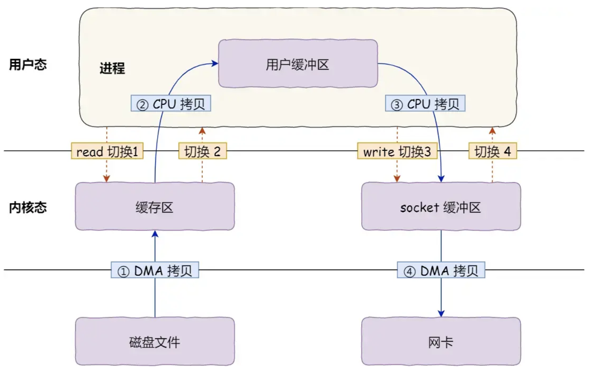
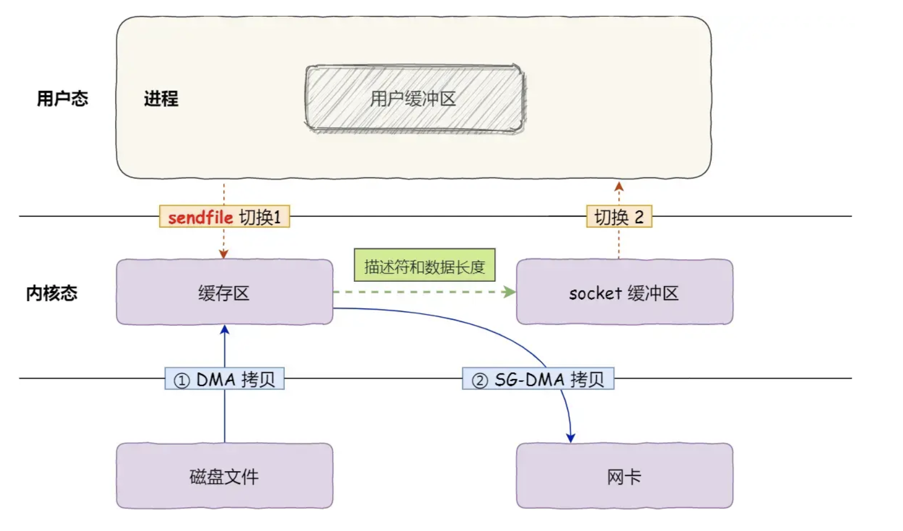

操作系统进程拥有：页表，tlb, 

不同线程执行同一份进程代码，线程其实是程序流。

线程拥有：栈【存放在进程地址空间内】，程序计数器，看到的地址空间是进程的，

进程切换需要切换页表、tlb，线程切换只需要切换上下文（栈）

> **所有线程都是在“同一份代码”上执行的，只是执行的“位置（逻辑）不同”！**

线程（Thread）与进程（Process）的**根本区别**：

| 对比项   | 进程（Process）     | 线程（Thread）     |
| -------- | ------------------- | ------------------ |
| 地址空间 | 每个进程独立        | 同一进程内线程共享 |
| 切换代价 | 高（上下文 + 内存） | 低（上下文而已）   |
| 通信方式 | IPC、Socket         | 共享变量、锁、队列 |
| 创建成本 | 高                  | 低                 |

👉 所以线程更轻量，适合做并发任务，能共享数据，减少开销。

------

## ✅ 四、补充一张内存模型结构图（文字版）

```
css


复制编辑
           ┌────────────────────────────┐
           │        进程地址空间         │
           ├────────────────────────────┤
           │ 代码区（Text Segment）      │ ← 所有线程执行的代码
           ├────────────────────────────┤
           │ 堆（共享对象）              │ ← 多线程共享
           ├────────────────────────────┤
           │ 静态区（类变量）            │ ← 多线程共享
           ├────────────────────────────┤
           │ 线程 A 的栈                 │ ← 局部变量、帧、PC（私有）
           ├────────────────────────────┤
           │ 线程 B 的栈                 │
           └────────────────────────────┘

```


### 你可以把每个进程的虚拟内存想象成下面这样：

```
bash


复制编辑
┌────────────────────────────┐ 高地址
│     栈 Stack（向下增长）     │ ← 函数调用、局部变量
├────────────────────────────┤
│     动态库映射区（.so/.dll）│ ← 共享库，可能共用物理内存但虚拟地址不同
├────────────────────────────┤
│     堆 Heap（向上增长）      │ ← new/malloc 分配的内存
├────────────────────────────┤
│     BSS段（未初始化静态变量）│
├────────────────────────────┤
│     Data段（初始化静态变量）│
├────────────────────────────┤
│     代码段 Text（只读）      │ ← 程序代码
└────────────────────────────┘ 低地址
```

> 📌 每个进程都有一份这样的“独立拷贝”！


```
物理内存布局：
高地址
+-----------------------------+
|   High Memory              | ← 用于 **用户进程的虚拟地址空间**（如代码、堆、栈）
+-----------------------------+
|   Kernel Dynamic Memory     | ← 用于为线程/进程分配结构体，如：
|                             |    • task_struct（进程/线程描述符）
|                             |    • mm_struct、files_struct 等内核对象
|                             |    • slab/kmalloc 等动态分配内核结构
 																 ← ✅ 内核堆分配区
  │                            │ ← ✅ 内核线程的内核栈（8KB）
  │                            │ ← ✅ 内核对象 task_struct 等
+-----------------------------+
|   Kernel Code + Data        | ← 内核本身的代码 + 静态数据
+-----------------------------+
|   Page Tables               | ← 进程的虚拟内存映射结构，所有进程共享物理页框
+-----------------------------+
|   Interrupt Vector Table    | ← CPU 中断服务的入口表
+-----------------------------+
|   BIOS/Boot Reserved        | ← 启动程序用的空间
低地址

```


```
物理内存大致位置（线程/进程相关）：
-----------------------------------------------------
[ High Memory ] ← 进程的用户空间代码/堆/栈映射位置
-----------------------------------------------------
[ Kernel Dynamic Memory ] ← task_struct / thread_info / slab / 文件描述表等
-----------------------------------------------------
[ Page Tables ] ← 每个进程的页表（虚拟地址 ↔ 物理页映射）
-----------------------------------------------------

```

**进程/线程的用户空间内容（代码、堆、栈）**：存在于 High Memory 所映射的物理页中；

**进程/线程的描述符、内核栈、管理结构（如 task_struct）**：存在于内核态，具体分布在 `Kernel Dynamic Memory` 和低地址物理页中。


## 🧩 二、线程切换 vs 进程切换，有什么区别？

| 项目             | 线程切换（同一进程） | 进程切换（不同进程）       |
| ---------------- | -------------------- | -------------------------- |
| 地址空间         | ✅ 不变               | ❌ 需要切换虚拟地址空间     |
| 页表 / 内存映射  | ✅ 保持               | ❌ 切换页表，重新建页表缓存 |
| 缓存（TLB）      | ✅ 保持               | ❌ TLB 缓存失效，需刷新     |
| 文件描述符等资源 | ✅ 共享               | ❌ 不共享，需重新加载       |
| 切换代价         | ✅ 较低（轻量）       | ❌ 较高（沉重）             |


## ✅ 一、Java 的线程是 JVM 的内核线程吗？

### ✅ 是的，Java 的线程是 **操作系统的原生线程（也称为“内核线程”）**！

### 更具体地说：

- Java 线程 ≈ 操作系统线程（如 Linux 的 `pthread`，Windows 的 Thread）
- Java 代码中通过 `new Thread()` 创建的线程，会由 JVM 调用底层操作系统 API 创建一个对应的内核线程。

------

### 🧠 JVM 是怎么做的？

不同 JVM 实现可能略有差异，但主流 HotSpot JVM（OpenJDK）使用的线程模型为：

> **一对一模型（One-to-One Thread Model）**

| Java Thread | OS Thread |
| ----------- | --------- |
| 一个        | 一个      |

当你写下：

```
java


复制编辑
Thread t = new Thread(() -> System.out.println("hi"));
t.start();
```

背后其实是：

➡️ JVM 调用本地方法（JNI）
 ➡️ 操作系统通过 `pthread_create()` 创建真正的线程
 ➡️ Java 线程 ↔ 内核线程一一绑定

------

### 🔍 怎么验证这一点？

在 Linux 下，你可以运行 Java 程序，然后用命令查看线程：

```
bash


复制编辑
ps -L -p <java进程pid>
```

你会看到多个 LWP（轻量级进程）—— 它们就是线程，每一个 Java 线程都会有一个对应的 LWP。

------

## ✅ 二、Java 有几个进程？

Java 程序 **通常只运行在一个进程中**（即：**JVM 是一个进程**）。

当你运行：

```
bash


复制编辑
java MyApp
```

操作系统会启动一个进程：`java`，这个进程会加载 `MyApp.class` 并执行。

### ✅ 进程数：默认只有 1 个

除非你在代码中使用：

- `Runtime.getRuntime().exec(...)`
- `ProcessBuilder`
- 或者 JNI 启动了其他 native 进程

否则，整个 Java 应用程序都运行在**一个 JVM 进程内**。

------

### ✅ 但线程数：可以有很多！

你可以用 `top -H` 或 `jstack` 看到成百上千个线程，如：

- GC 线程
- 编译器线程（JIT）
- Signal 处理线程
- 用户线程（你自己创建的 Thread、线程池）
- Finalizer、Reference Handler 等后台线程

------

## 🧠 小结对比

| 项目             | Java 中体现                             |
| ---------------- | --------------------------------------- |
| 一个 Java 应用   | 启动一个 JVM 进程（除非你手动启动别的） |
| 一个 Java Thread | 映射为一个 OS 线程（内核线程）          |
| Java 线程调度    | 由操作系统调度，不由 JVM 自己调度       |

------

## ✅ 三、为什么重要？

- Java 使用的是 **原生线程模型**，所以它的线程切换效率 ≈ 操作系统线程调度效率
- 它不像 Golang、Erlang 那样用“用户态线程协程模型”
- 优点：利用多核强大、调度可靠
- 缺点：**线程切换开销较大、不能创建太多线程（几千是极限）**

------

## ✅ 四、图解总结

```
markdown


复制编辑
┌─────────────┐
│  Java 应用程序 │  ← 一个进程（JVM）
└─────┬───────┘
      ↓
┌─────────────────────────────────────────────┐
│ 操作系统进程：java                         │
├─────────────────────────────────────────────┤
│ Java 线程 1  ─────────▶ 内核线程 1（LWP 1） │
│ Java 线程 2  ─────────▶ 内核线程 2（LWP 2） │
│ Java 线程 3  ─────────▶ 内核线程 3（LWP 3） │
│ ...                                         │
└─────────────────────────────────────────────┘
```


```
┌──────────────────────────────┐
│        JVM 进程（唯一）        │
├──────────────────────────────┤
│ 代码区（方法字节码）           │ ← 所有线程共享
├──────────────────────────────┤
│ 方法区（类结构、常量池）       │ ← 共享
├──────────────────────────────┤
│ 堆（对象实例）                 │ ← 共享
├──────────────────────────────┤
│ 线程 A                         │
│  ├─ 程序计数器（私有）         │
│  └─ Java 栈（局部变量）        │
├──────────────────────────────┤
│ 线程 B                         │
│  ├─ 程序计数器（私有）         │
│  └─ Java 栈（局部变量）        │
└──────────────────────────────┘

```


## 零拷贝

https://mp.weixin.qq.com/s?__biz=MzI3NzE0NjcwMg%3D%3D&chksm=f36be7f3c41c6ee50b0a775bc20641e1ea005d8f7fa528e6935a5e11b864a1fb3eebdcd1e76d&idx=3&mid=2650143442&scene=27&sn=2ad9410af576450e8b617b5e18c154f7&utm_campaign=geek_search&utm_content=geek_search&utm_medium=geek_search&utm_source=geek_search&utm_term=geek_search#wechat_redirect







### mmap

```
2. mmap 的内核实现流程
当用户调用 mmap 时，操作系统执行以下操作：

（1）参数校验
检查调用者传入的参数是否有效，包括：

地址对齐（通常对齐到页大小，如 4 KB）。
映射区域的权限（PROT_READ, PROT_WRITE, 等）。
文件描述符是否有效（非匿名映射时）。
（2）建立虚拟地址空间
操作系统在进程的虚拟地址空间中为映射区域分配地址。可以通过以下方式：

如果 addr 参数为 NULL，由内核自动分配。
如果 addr 非空，尝试将映射区域放置在用户指定的地址。
（3）建立页表映射
根据映射类型，操作系统将虚拟地址映射到文件或匿名内存：

文件映射：
虚拟地址通过页表指向文件系统缓存的物理页（Page Cache）。
文件的某部分内容加载到内存时，只需要映射相关页，而非整个文件。
匿名映射：
内核分配一块物理内存，用于初始化进程的虚拟地址区域。
（4）延迟加载
mmap 的实际物理内存分配是惰性的（Lazy Allocation）。仅在访问时（如读取或写入）触发缺页中断，内核才会真正分配物理内存。
（5）页表更新
当映射建立后，操作系统将虚拟地址和物理地址的映射关系存入页表。访问映射区域时，CPU 根据页表直接找到对应的物理内存。
```


### **用户进程在内核态有自己的上下文，**

### 分清楚内核进程和用户进程进入内核态

### **内核进程与用户进程的区别**

| 特性         | 内核进程                       | 用户进程                   |
| ------------ | ------------------------------ | -------------------------- |
| **运行模式** | 内核态                         | 用户态                     |
| **权限**     | 拥有最高权限，访问所有资源     | 权限受限，只能访问用户空间 |
| **创建者**   | 操作系统内核创建               | 用户程序或内核创建         |
| **存在性**   | 始终存在（独立于用户进程）     | 当用户启动或创建时存在     |
| **作用**     | 执行系统任务，如调度和内存管理 | 执行用户任务（应用程序）   |

````
为了详细说明 **用户进程如何切换到内核态，以及内核没有独立进程**，我们通过一个具体的例子一步步解释用户态到内核态的切换过程及背后的原理。

---

### 1. **任务：读取文件的内容**
用户程序希望通过系统调用读取一个文件的内容。我们编写一个简单的程序，调用 `read()` 函数（系统调用）读取文件内容，然后打印到终端。

#### 示例代码
```c
#include <fcntl.h>
#include <unistd.h>
#include <stdio.h>

int main() {
    char buffer[128];
    // 打开文件
    int fd = open("example.txt", O_RDONLY);
    if (fd < 0) {
        perror("open failed");
        return 1;
    }

    // 读取文件内容
    ssize_t bytesRead = read(fd, buffer, sizeof(buffer) - 1);
    if (bytesRead < 0) {
        perror("read failed");
        return 1;
    }

    // 添加字符串结束符并打印
    buffer[bytesRead] = '\0';
    printf("Read content: %s\n", buffer);

    // 关闭文件
    close(fd);

    return 0;
}
```

---

### 2. **用户态到内核态的切换过程**
当 `read()` 函数被调用时，用户进程会切换到内核态，由操作系统完成文件读取任务。以下是详细过程：

#### **（1）用户态：程序调用 `read()`**
- 程序调用标准库函数 `read(fd, buffer, sizeof(buffer))`。
- `read()` 是用户态的封装，它内部通过 **系统调用** 指令请求内核服务（具体实现依赖操作系统）。

#### **（2）系统调用：从用户态进入内核态**
1. **系统调用指令**：
   - 在 Linux 上，`read()` 函数会触发 `syscall` 指令（或 `int 0x80` 中断）。
   - 此时，CPU 切换到内核态，执行操作系统定义的系统调用服务。

2. **内核态上下文切换**：
   - CPU 保存当前用户态的寄存器、程序计数器（PC）和栈指针（SP）。
   - 切换到内核栈，加载内核态所需的寄存器和地址空间。

3. **内核查找系统调用入口**：
   - 内核根据系统调用号（`read` 的系统调用号为 `0`）查找对应的内核函数入口，例如 `sys_read()`。

#### **（3）内核态：执行 `sys_read`**
1. **文件描述符验证**：
   - 内核从当前进程的文件描述符表中查找 `fd`，验证是否有效。
2. **文件系统操作**：
   - 如果文件对应一个磁盘文件，内核将请求磁盘驱动加载文件内容到内存（如果尚未加载）。
   - 如果文件已经在内存（页缓存），直接从缓存中读取。
3. **数据拷贝**：
   - 内核将读取的数据拷贝到用户态的缓冲区 `buffer`。

#### **（4）切换回用户态**
- 内核完成 `sys_read` 后，恢复用户态的寄存器和程序计数器，将控制权返回用户态。
- 用户程序获得返回值（如读取的字节数），继续执行。

---

### 3. **内核没有独立进程**
- **同一个用户进程执行用户态和内核态任务**：
  - 当用户进程调用 `read()` 时，CPU 从用户态切换到内核态，但内核代码仍然以当前用户进程的上下文运行。
  - 系统调用是进程的工作之一，不涉及进程切换，也不会创建一个新的“内核进程”。

- **例证**：
  - 如果使用 `ps` 或其他工具查看运行的进程，在调用 `read()` 时，你不会看到任何新的“内核进程”。
  - 进程在切换到内核态后，其 PID 和上下文信息保持不变，只是切换了运行模式。

---

### 4. **例子中的内核态过程**
以下是例子中 `read()` 的具体执行细节，结合 Linux 系统的实现。

#### **调用过程**
1. **用户态调用 `read()`**：
   - 用户程序通过 glibc 标准库调用 `read()`。
   - glibc 底层会使用 `syscall` 指令触发系统调用。

2. **系统调用入口**：
   - `syscall` 指令会切换到内核态，跳转到内核的系统调用处理函数。
   - Linux 中，系统调用入口函数是 `entry_SYSCALL_64()`（64 位系统）。

3. **定位 `sys_read`**：
   - 内核根据系统调用号 `0` 找到 `sys_read` 函数。
   - `sys_read` 是内核实现的文件读取功能。

4. **内核态执行 `sys_read`**：
   - 内核读取文件内容，可能涉及磁盘驱动调用。
   - 将数据放入内核缓冲区后，通过 `copy_to_user` 函数将数据拷贝到用户缓冲区。

5. **返回用户态**：
   - 内核将 `sys_read` 的返回值（读取的字节数）传递给用户态。
   - CPU 恢复用户态上下文，程序继续执行。

---

### 5. **示意图：用户态到内核态的切换**

```plaintext
用户态
+------------------------+
| 用户程序调用 read()    |
| 标准库封装 syscall 指令|
+------------------------+
       ↓ 系统调用 (syscall)
内核态
+------------------------+
| 内核入口: entry_SYSCALL|
| 查找 sys_read          |
| 读取数据，拷贝到用户区 |
+------------------------+
       ↓ 返回用户态
用户态
+------------------------+
| 用户程序获得返回值     |
| 继续执行               |
+------------------------+
```

---

### 6. **验证：使用 `strace` 查看系统调用**
你可以使用 `strace` 工具跟踪上述程序的系统调用过程，验证用户进程在调用 `read` 时切换到内核态。

#### 运行命令
```bash
strace ./a.out
```

#### 输出示例
```plaintext
open("example.txt", O_RDONLY) = 3
read(3, "Hello, kernel!\n", 128) = 15
write(1, "Read content: Hello, kernel!\n", 29) = 29
close(3) = 0
```

- 每一行表示一次系统调用（`open`, `read`, `write`, `close`）。
- 系统调用发生时，进程切换到内核态，完成任务后返回用户态。

---

### 7. **总结**
- 当用户进程调用 `read()` 时，内核不会创建独立的“内核进程”，而是通过系统调用机制切换到内核态。
- 进程在内核态执行的任务属于同一个进程，只是运行在内核地址空间。
- 使用工具如 `strace` 可以验证系统调用的执行过程。
````

