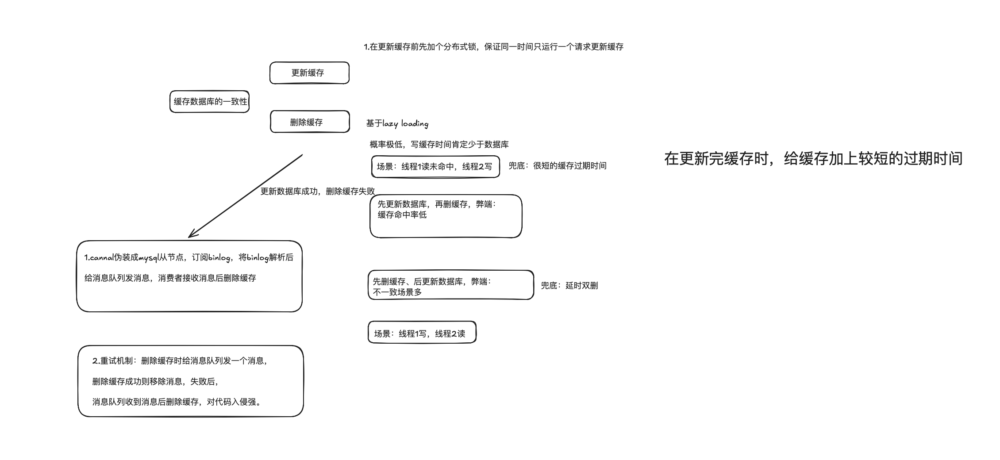

# 六步

**验证码**

**令牌桶、漏桶**

**消息队列**

**redis【集群、分键、pipiline】**

**本地缓存【创建回调函数，进行更新】【秒杀大闸】**

**mysql【分库分表、索引】**

本地缓存和redis有点像mysql的从库


**缓存穿透和缓存击穿是针对商品详情**，采取先更新数据库再删除缓存

秒杀的库存不是采用上面做法





### 可能的面试问题和不足

https://www.nowcoder.com/feed/main/detail/3a9a68162ba14b6f91f498ae05ce8fd8?sourceSSR=search

https://www.nowcoder.com/discuss/465837439208218624?sourceSSR=users

https://huaweicloud.csdn.net/637f78eadacf622b8df8532e.html

https://blog.csdn.net/weixin_43519121/article/details/119736971

首先是进行 **缓存预热**，将代金券信息（开始时间、结束时间、机构id，金额、库存等）存入Redis中，**预减库存**（基于乐观锁防止超卖-当库存大于0就允许购买，同时判断是否存在该用户订单信息防止重复下单）；

然后基于 Redis + Lua  脚本进行资格判断和秒杀业务，当条件成立，**更新缓存**（在Redis层扣减库存并添加用户订单到集合set中），返回true的状态，**流量削峰**（然后后端生成对应的订单信息发送到kafka当中，订单id使用Redis生成唯一id，kafka consumer取出信息进行创建订单，失败后会重试3次，然后回滚、将异常订单落库

在添加订单时，基于Redisson分布式锁，防止重复下单问题，插入数据需要获取锁才能进行操作，并且同时更新数据库中库存信息时使用乐观锁（cas）防止超卖和判断是否存在订单信息防止重复下单；

```
          //这个问题的关键在于理解数据库操作的原子性和事务隔离级别。大多数关系型数据库（如 MySQL）支持行级锁和事务隔离级别，
                    // 这保证了并发更新时不会出现数据不一致的情况。
                    //
                    //行级锁：在执行 UPDATE 语句时，数据库会锁定符合条件的行，确保其他事务不能在这个过程中修改这些行。
                    //原子操作：UPDATE ... SET ... WHERE ... 语句在数据库层面上是原子的，要么全部执行成功，要么全部失败。
                    //总结
                    //gt("stock", 0) 确保了在更新库存时，只操作库存大于 0 的记录，这在数据库层面是一个原子操作，可以有效防止超卖。
                    //去掉 gt("stock", 0) 会导致库存检查和库存更新分离，在高并发情况下，多个线程可能会同时通过库存检查，从而导致超卖。
                    //这解释了为什么 gt("stock", 0) 可以防止超卖，而去掉它会导致超卖。希望这个解释清晰地解答了您的问题。
```


**1.秒杀大闸3-4倍【redissonClient.getSemaphore("seckill:stock:1001_12345");】 + 2.秒杀令牌1.5-2倍 + 3.库存信号量**


```
限流、令牌桶和漏桶都是控制请求流量的策略，但它们的实现方式和应用场景有所不同。下面是它们之间的主要区别：

### 1. **限流**
- **定义**：通常指限制一定时间内的请求次数。
- **实现方式**：可以基于 IP 地址、用户 ID 等来记录请求次数，达到一定次数后拒绝请求。比如你提到的 `@Prevent` 注解实现的限流。
- **使用场景**：适用于简单的请求频率控制，如防止单个用户或 IP 进行频繁请求。

### 2. **令牌桶**
- **定义**：令牌桶算法是一种控制流量的策略，允许一定的突发流量。
- **实现方式：
  - **令牌生成**：在固定时间间隔内生成令牌，并将其放入桶中。
  - **请求处理**：每个请求需要消耗一个令牌，如果桶中有令牌，则允许请求通过；如果没有，则拒绝请求。
  - **突发流量**：由于令牌可以积累，系统可以在短时间内处理更多请求。
- **使用场景**：适合对流量有突发需求的场景，比如 API 接口。

### 3. **漏桶**
- **定义**：漏桶算法用于限制请求的速率，确保请求以恒定速率处理。
- **实现方式**：
  - **固定流入**：请求以固定速率流入漏桶。
  - **流出速率**：请求以恒定速率从漏桶中流出，超出部分则被丢弃或排队。
- **使用场景**：适合需要保证服务稳定性和响应时间的场景，如限流的后端服务。

### 总结
- **限流** 通常较为简单，直接限制请求次数，适合基础的频率控制。
- **令牌桶** 允许突发流量，适合动态流量场景。
- **漏桶** 保证了流量的稳定性，以固定速率处理请求，适合需要持续稳定响应的场景。

根据具体业务需求，选择合适的流量控制策略可以有效保护系统性能。
```


## 防刷限流

https://mp.weixin.qq.com/s?__biz=MzI4MTY5NTk4Ng%3D%3D&chksm=eba4167cdcd39f6aa1d16847e72c3299cc2811e93738d8314f77cc6770ad2555cfa4a276aa18&idx=1&mid=2247488993&scene=27&sn=4b9d5deedd0e626c456744f04b499bbb&utm_campaign=geek_search&utm_content=geek_search&utm_medium=geek_search&utm_source=geek_search&utm_term=geek_search#wechat_redirect

### 1.针对用户名、ip实现的限流

`@Prevent` 注解用于实现防刷限流机制，其执行时机和流程可以分为以下几个步骤：

```
### 1. **请求到达 Controller**

   - 当用户发送一个 POST 请求到 `/seckill/{id}` 端点时，Spring MVC 会将请求映射到 `seckillVoucher` 方法。

### 2. **AOP 拦截**

   - 在调用 `seckillVoucher` 方法之前，Spring AOP 会根据配置的切点（`@Pointcut("@annotation(com.xydp.prevent.Prevent)")`）拦截该方法。此时，会执行与 `@Prevent` 注解相关的切面逻辑。

### 3. **获取方法信息**

   - 切面逻辑中的 `joinPoint` 参数允许访问到当前被拦截的方法的信息，包括方法名、参数等。通过反射获取 `Prevent` 注解的配置，包括限制次数（`count`）和过期时间（`value`）。

### 4. **提取请求信息**

   - 使用 `RequestContextHolder` 获取当前的 HTTP 请求对象，以便提取请求的 IP 地址和用户信息。

### 5. **生成限流键**【【5-9使用lua脚本完成，5秒内ip相同或者用户名相同不能点击超过10次】】

   - 生成用于限流的 Redis 键，例如使用用户的 IP 地址和请求 URI。这些键用于跟踪该 IP 地址或用户在指定时间内的请求次数。

### 6. **获取锁**

   - 通过 Redisson 获取分布式锁，防止多个请求同时修改计数。尝试获取 IP 锁和用户锁，确保在同一时刻只有一个请求可以操作相应的资源。

### 7. **访问计数**

   - 查询 Redis 中的计数值，如果计数超过限制，则抛出异常，拒绝该请求。
   - 如果计数未超过限制，则对计数进行递增操作，并在 Redis 中设置过期时间。

### 8. **执行原方法**

   - 如果请求通过了限流检查，调用 `seckillVoucher` 方法以执行秒杀逻辑。

### 9. **返回结果**

   - 方法执行完毕后，返回响应结果给客户端。

### 总结

`@Prevent` 的执行时机是在请求到达控制器方法之前，通过 AOP 拦截和执行相关的防刷限流逻辑。其目的在于保护系统不被频繁请求压垮，同时确保用户的请求在限流策略内被合理处理。
```


```java

    /**
     * 目标方法执行前的进行的逻辑
     */
    @Before("pointcut()")
    // joinPoint参数允许你访问目标方法的信息，如方法签名和参数
    public void joinPoint(JoinPoint joinPoint) throws NoSuchMethodException {
        // 这里主要限制每一个 IP 和 User 在规定时间内的最大访问次数
        // ip 锁 和 user 锁
        RLock ipLock = null, userLock = null;
        boolean isIp = false, isUser = false;
        try {
            // 得到方法签名
            MethodSignature signature = (MethodSignature) joinPoint.getSignature();
            // 反射获取方法上的@RepeatSubmit注解，进而提取注解中的属性。，得到具体方法
            Method method = joinPoint.getTarget().getClass().getMethod(signature.getName(), signature.getParameterTypes());

            // 得到 Prevent 注解
            Prevent prevent = method.getAnnotation(Prevent.class);

            // 获得过期时间
            long expire = prevent.value();
            // 获得限制次数
            int count = prevent.count();
            // 获得提示消息
            String message = prevent.message();

            // 获得 http 请求
            // 通过RequestContextHolder获取当前请求的ServletRequestAttributes，从中提取HTTP请求和响应对象
            ServletRequestAttributes attributes = ((ServletRequestAttributes) RequestContextHolder.getRequestAttributes());
            assert attributes != null;
            HttpServletRequest request = attributes.getRequest();

            HttpServletResponse response = attributes.getResponse();
            assert response != null;
            response.setContentType("application/json;charset=UTF-8");

            // todo：以下操作可以使用 lua 脚本进行实现，从而保证操作的原子性以及降低网络开销
            // 得到限制 ip 的 key
            String ipKey = ACCESS_LIMIT_IP_KEY + IPUtils.getIpAddr(request) + "-" + request.getRequestURI();
            // 得到限制 user 的 key
            String userKey = ACCESS_LIMIT_USER_KEY + UserHolder.getUser().getId() + "-" + request.getRequestURI();

            // 获取 ip 锁
            ipLock = redissonClient.getLock("lock:" + ipKey);
            isIp = ipLock.tryLock();
            if (!isIp) { // User - 相同用户在 Redis 已经限制了
                throw new BusinessException("相同IP不能在同一时刻下单！");
            }
            // 获取 User 锁
            userLock = redissonClient.getLock("lock:" + userKey);
            isUser = userLock.tryLock();
            if (!isUser) {
                throw new BusinessException("相同用户不能在同一时刻下单！");
            }
            // 取得在限定时间内的访问次数，从Redis中获取当前IP和用户的访问计数。如果计数不存在，则视为0。
            String ipVal = stringRedisTemplate.opsForValue().get(ipKey);
            int ipCount = ipVal == null ? 0 : Integer.parseInt(ipVal);
            String userVal = stringRedisTemplate.opsForValue().get(userKey);
            int userCount = userVal == null ? 0 : Integer.parseInt(userVal);
            // ip和用户的计数必须都没有超过count
            if (ipCount < count && userCount < count) {
                //如果IP或用户的计数为0，则在Redis中设置初始值并指定过期时间。
                //如果已有计数，则通过increment方法递增计数。
                if (ipCount == 0) {
                    stringRedisTemplate.opsForValue().set(ipKey, Integer.toString(1), expire, TimeUnit.SECONDS);
                } else {
                    stringRedisTemplate.opsForValue().increment(ipKey, 1);
                }
                if (userCount == 0) {
                    stringRedisTemplate.opsForValue().set(userKey, Integer.toString(1), expire, TimeUnit.SECONDS);
                } else {
                    stringRedisTemplate.opsForValue().increment(userKey, 1);
                }
            } else {
                message = "".equals(message) ? "相同IP或用户在" + expire + "秒内达到了最大访问次数：" + count : message;
                throw new BusinessException(message);
            }
        } finally {
            // 在finally块中释放获得的锁，以确保即使发生异常也能正确释放锁，避免死锁。
            // 去释放已经拿到的锁
            if (isIp) {
                ipLock.unlock();
            }
            if (isUser) {
                userLock.unlock();
            }
        }
    }

```


### 2.针对方法参数、token进行的限流

加锁5秒用于实现参数形式的防刷限流的主要原因在于以下几个方面：

**1.key：ip+类名+方法+用户id， val ：5秒过期时间的一把锁**

```
### 1. **短暂的独占性**：

- 当一个请求尝试加锁时，它会立即检查锁是否可用。如果锁被其他请求持有，则当前请求会立即失败（因设置了0秒的等待时间）。
- 这样可以确保在5秒内，只有一个请求能持有该锁，其他请求将被拒绝。

### 2. **防止重复请求**：

- 通过限制每个请求的持锁时间为5秒，可以有效阻止在此时间窗口内同样的请求再次被处理。
- 如果在5秒内再次发起相同的请求，由于锁被占用，后续请求将无法成功加锁，从而被视为重复提交。

### 3. **自动释放**：

- 设定锁的自动解锁时间为5秒，意味着即使请求处理时间超过5秒，锁也会在5秒后自动释放。这防止了锁被长时间占用的情况，允许其他合法请求在锁释放后继续处理。

### 4. **自定义灵活性**：

- 该时间可以根据实际业务需求进行调整。例如，对于频繁请求的操作，可能需要设置较短的锁定时间，而对于少量请求的操作，则可以设定更长的锁定时间。


```

**2.令牌形式防重提交，每发一个令牌，在限流处删一次，如果不存在或者删除失败则拦截**

```
在令牌形式的防重提交机制中，使用的是一个独特的令牌（token）来标识每个请求。这种机制的主要思想是利用令牌的存在和有效性来判断请求的合法性和唯一性。

### 令牌形式的工作原理

1. **生成令牌**：
   - 当用户发起请求时，系统会生成一个唯一的令牌（通常是基于用户 ID 和某些请求参数生成）。
   - 这个令牌通常会以某种方式附加到请求中，例如作为 HTTP 头部参数。

2. **存储令牌**：
   - 系统将这个令牌存储在 Redis 中，并设置一个过期时间。这个过期时间可以防止令牌被无限期使用。

3. **检查和删除令牌**：
   - 当后续请求到达时，系统会检查请求中是否包含令牌。
   - 如果请求中包含的令牌存在于 Redis 中，且未过期，那么：
     - **成功删除**：系统会从 Redis 中删除这个令牌，表示该请求已被处理，且该令牌只能被使用一次。此时请求被认为是合法的。
     - **删除失败或令牌不存在**：表示该请求可能是重复的，因为同样的令牌只能被使用一次。如果尝试删除时发现该令牌已经不存在，或者删除失败，则可以认为这是一个重复提交的请求。

### 关键点

- **一次性使用**：通过在成功处理请求后删除令牌，确保每个请求只能被处理一次。这就意味着即使同一个用户短时间内多次发起相同的请求，只有第一次有效，后续的请求将被拒绝。
- **过期机制**：设置令牌的过期时间可以防止恶意用户使用过期的令牌进行攻击，从而提升系统的安全性。

### 总结

通过这种方式，令牌形式的防重提交机制实现了对用户请求的有效管理，确保了系统能够正确处理请求并防止重复提交。这不仅提高了用户体验，也减少了由于重复操作带来的潜在风险。
```


> **【问题】Redis和MySQL数据一致性如何保证？**
>
> **（1）先删除缓存，再写入数据库。****如果先删除Redis缓存数据，然而还没有来得及写入MySQL，另一个线程就来读取；这个时候发现缓存为空，则去Mysql数据库中读取旧数据写入缓存，此时缓存中为脏数据；然后数据库更新后发现Redis和Mysql出现了数据不一致的问题。**
> **（2）先写入数据库，再删除缓存。****如果先写了库，然后再删除缓存，不幸的写库的线程挂了，导致了缓存没有删除；这个时候就会直接读取旧缓存，最终也导致了数据不一致情况；因为写和读是并发的，没法保证顺序,就会出现缓存和数据库的数据不一致的问题。**【可以通过写入数据库后发消息给消息队列，消息队列异步更新缓存】
>
> **（3）延时双删：****在写库前后都进行redis.del(key)操作，并且设定合理的超时时间。**
>
> ```processing
> public void write(String key, Object data){
>  //先删除缓存
>  redis.delKey(key);
>  //再写数据库
>  db.updateData(data); 
>  //休眠500毫秒
>  Thread.sleep(500);
>  //再次删除缓存
>  redis.delKey(key);
> }
> ```
>
> **【问题】****这个500毫秒怎么确定的，具体该休眠多久时间呢？**
>
> - 需要评估自己的项目的读数据业务逻辑的耗时。
> - 这么做的目的，就是确保读请求结束，【[写请求可以删除读请求造成的缓存脏数据]】
> - 当然这种策略还要考虑redis和数据库主从同步的耗时。
> - 最后的的写数据的休眠时间：则在读数据业务逻辑的耗时基础上，加几百ms即可。
>
> **【问题】方案缺点？**
>
> - 在缓存过期时间内发生数据存在不一致。
> - 同时又增加了写请求的耗时。
>
> ```
> 延时双删策略的背景与作用
> 延时双删策略是在分布式缓存系统中用来解决缓存与数据库数据一致性问题的一种方法。在典型的缓存更新场景中，可能会遇到“脏数据”问题：读请求在更新数据库之前或之后，缓存数据可能因为未及时更新而变得不准确。延时双删策略通过在写数据库前后都执行删除缓存操作，来减少这种数据不一致的可能性。
> 
> 延时双删的详细流程
> 删除缓存：在写数据库操作之前，先删除缓存中的旧数据。这样可以防止并发请求在数据库更新之前读取到过期的缓存数据。
> 更新数据库：接下来执行数据库更新操作，将新的数据写入数据库。
> 延时删除缓存：在写数据库操作完成之后，等待一段时间（例如500毫秒），再次删除缓存。这是为了处理写数据库操作完成后，可能仍有读请求已经读取了旧的缓存数据但尚未完成的情况。
> 延时双删中的延时如何确定？
> 评估读操作的耗时：首先需要评估系统中读操作的耗时，特别是在最差情况下（例如并发高峰期）的读请求耗时。这是为了确保缓存的数据不会在读请求进行中被删除。
> 加上合理的延时：为了确保写操作后所有的读请求都已结束，通常会在评估的基础上再加上几百毫秒的延时（如500毫秒）。这个延时的目的是确保在最坏情况下，即使有并发读请求操作正在进行，写操作也能删除那些可能导致数据不一致的缓存。
> 考虑数据库和缓存同步的延迟：在使用主从数据库或缓存集群的情况下，还需要考虑数据库主从同步和缓存同步的延迟时间。确保在二次删除缓存之前，所有的数据变更都已经同步到从库或从缓存节点。
> 延时双删的缺点
> 1. 在缓存过期时间内可能存在数据不一致
> 
> 问题背景：在采用延时双删策略时，存在一个时间窗口，即在缓存第二次删除之前，可能存在缓存与数据库的数据不一致问题。这是因为写请求完成数据库更新后，读请求可能已经开始，且在缓存再次被删除之前读取了旧的缓存数据。
> 为什么是缺点：
> 数据不一致：在这个时间窗口内，读请求可能会读取到旧的缓存数据，而不是数据库中的最新数据，这导致了数据不一致性。如果系统依赖于缓存来提供一致性的数据响应，那么这种情况会影响数据的准确性。
> 影响用户体验：当用户发起数据查询请求时，如果读取到了过期或错误的数据，可能会造成糟糕的用户体验，尤其是在实时性要求较高的系统中，这种不一致会让用户感到困惑或失望。
> 业务逻辑复杂性：开发人员需要考虑和处理这种潜在的不一致性情况，可能需要设计额外的逻辑来检测和纠正不一致，这增加了系统设计的复杂性。
> 2. 缓存滞后效应
> 
> 缓存延迟更新：因为缓存的最终删除发生在延时之后，实际在这个窗口内的缓存更新是滞后的。这意味着，系统在更新操作完成后的一段时间内，缓存中仍然可能存在旧数据，而用户的读操作可能依然命中旧缓存。
> 增加系统负载：如果这种滞后现象在高并发场景下频繁发生，会导致更多的缓存失效和缓存穿透（缓存未命中，直接访问数据库），从而增加数据库的压力。
> 如何缓解这些缺点？
> 缩短缓存过期时间：通过缩短缓存过期时间，减少数据不一致窗口的长度。但是，这也会增加缓存失效的频率，进而增加数据库的压力。
> 更精准的延时设定：基于更准确的读操作时长分析和数据库、缓存同步的实际延迟，设定更合理的延时。虽然完全消除不一致性不太可能，但通过优化延时可以尽量缩短不一致窗口。
> 引入版本号机制：在缓存中引入版本号，读操作时验证缓存版本是否匹配当前数据版本。这样即使发生了延时删除的场景，也可以通过版本号判断缓存数据是否过时，从而避免使用旧数据。
> 利用消息队列异步更新缓存：将更新操作通过消息队列通知到缓存服务，确保缓存更新是在数据库操作完成后立即触发，而不是依赖固定的延时策略。
> 总结
> 延时双删策略是一种用于在缓存与数据库之间保持一致性的技术，但它并不能完全消除数据不一致的问题。需要对系统的读写时延、数据库和缓存的同步机制进行仔细评估，并结合实际场景设定合理的延时。理解其缺点并设计合理的应对策略，对于提升系统的稳定性和一致性至关重要
> ```
>
> **（4）异步更新：****利用Mysql binlog 进行增量订阅消费；将消息发送到消息队列；通过消息队列消费将增量数据更新到Redis上。****其实这种机制，很类似MySQL的主从备份机制，因为MySQL的主备也是通过binlog来实现的数据一致性。**
>
> - 读取Redis缓存：热数据都在Redis上；
> - 写Mysql：增删改都是在Mysql进行操作；
> - 更新Redis数据：Mysql的数据操作都记录到binlog，通过消息队列及时更新到Redis上。

> ```
> （3）MySQL binlog 订阅
> 
> 增量数据捕获：MySQL 的 binlog 记录了所有对数据库进行的增、删、改操作。因此，binlog 可以被订阅和消费，以捕获这些增量数据。
> 订阅 binlog：通常使用工具或中间件（例如 Alibaba 的 Canal、Debezium）来订阅 MySQL 的 binlog。订阅器会解析 binlog，提取出数据变更事件，并将这些事件转换成消息。
> （4）通过消息队列更新 Redis
> 
> 消息发布：将解析后的数据变更事件（如插入、更新、删除操作）发布到消息队列中。消息队列保证了消息的顺序和可靠传递。
> 异步更新 Redis：
> 消费消息：Redis 的更新操作是通过消费消息队列中的消息来触发的。消费者会根据消息中的内容，决定如何更新 Redis 中的数据。
> 增量更新：如果消息是新增数据或数据更新操作，消费者会根据这些操作对 Redis 进行增量更新。比如更新一个缓存中的数据条目，或者删除已经过期或不再使用的数据。
> 数据一致性：通过这种异步更新机制，可以保证 Redis 中的数据尽量与 MySQL 保持一致，虽然存在一定的延迟，但在大多数情况下这种延迟是可接受的。
> 3. MySQL 和 Redis 数据一致性
> 类似 MySQL 主从复制的机制
> 
> 主从复制：在 MySQL 的主从复制机制中，主库将数据变更写入 binlog，从库通过读取 binlog 来应用这些变更，从而保持与主库的数据一致。
> Redis 数据同步：在本例中，MySQL 相当于“主库”，Redis 相当于“从库”。MySQL 记录的 binlog 通过消息队列传播到 Redis 中，Redis 作为缓存的数据通过异步更新与 MySQL 保持一致。
> 4. 优点和挑战
> 优点：
> 
> 高性能：读操作主要从 Redis 获取，减少了对 MySQL 的直接访问，提高了系统的整体响应速度。
> 降低数据库压力：通过将大量的读操作转移到 Redis，减少了对 MySQL 的压力，特别是在高并发场景下表现尤为明显。
> 数据一致性：通过 binlog 和消息队列机制，可以保证 Redis 中的数据尽量与 MySQL 保持一致，减少了数据不一致的问题。
> 挑战：
> 
> 数据一致性延迟：由于 Redis 的更新是异步进行的，因此在数据写入 MySQL 后，Redis 可能需要一定的时间才能完成更新。这种延迟可能导致在短时间内读到的 Redis 数据与 MySQL 数据不一致。
> 消息队列的可靠性：消息队列需要保证消息的可靠传递和消费，如果消息丢失或消费失败，可能会导致 Redis 数据与 MySQL 数据不一致。
> 系统复杂度：引入消息队列和 binlog 订阅机制，增加了系统的复杂性，需要额外的运维和监控来确保各组件的正常运行。
> 
> ```
>
> 


#### Redis哨兵集群搭建

在三台服务器上分别部署了一台Redis节点和一台Sentinel节点，然后通过 slaveof 命令配置好三台Redis节点的主从关系，这里是一主二从模式，启动三台Redis，然后配置三台Sentinel中master节点的地址信息，在项目服务端中配置Sentinel的配置信息，然后创建读写策略的Bean并配置读写策略为 `REPLICA _PREFERRED：优先从slave（replica）节点读取，所有的slave都不可用才读取master`，完成哨兵模式的集群搭建。

提高系统的高可用，高性能以及高并发能力。

### 预减库存

````
**预减库存**是一种在高并发场景下防止超卖的技术手段，通常应用于秒杀、限时抢购等场景中。它通过提前在缓存中减少库存数量，确保库存数量始终准确，并避免在实际下单过程中因多线程或多进程并发操作导致的超卖问题。

### 1. **预减库存的基本原理**

预减库存的核心思想是：在用户提交购买请求时，不直接去数据库中扣减库存，而是在缓存（通常是 Redis）中提前减少库存数量，确保在用户提交订单时，库存已经准确减少，防止超卖的情况发生。

#### **操作流程**：
1. **初始化库存**：在活动开始前，将库存数量从数据库加载到缓存中（如 Redis），这是所谓的“缓存预热”。
2. **预减库存**：
   - 当用户发起购买请求时，系统首先在 Redis 中进行库存的预减操作，即在 Redis 中将库存减1。
   - 如果预减成功（即库存仍大于0），则允许用户继续进行下单操作。
   - 如果预减失败（即库存小于或等于0），则直接返回库存不足的提示，拒绝用户下单。
3. **验证订单**：在预减库存成功后，系统会进一步检查用户是否已经下过订单，以防止重复下单。如果用户已经下过单，则回滚预减的库存，并拒绝重复下单。
4. **下单并最终扣减库存**：
   - 如果用户订单成功创建，最终会在数据库中减去库存，并标记订单已创建。此时，数据库的库存数量才会真正减少。

### 2. **预减库存的优点**

#### **2.1 减少数据库压力**
在高并发场景下，如果每个购买请求都直接访问数据库进行库存扣减，会导致数据库的巨大压力，甚至可能导致数据库的性能瓶颈。通过在缓存中预减库存，大大减少了数据库的访问次数，减轻了数据库的压力。

#### **2.2 提高系统性能**
预减库存主要依赖于缓存（如 Redis）的高性能，缓存操作通常比直接访问数据库快得多。通过将库存操作提前放到缓存中处理，可以显著提高系统的响应速度，减少用户的等待时间。

#### **2.3 防止超卖**
通过在缓存中提前预减库存，可以确保同一时间只有一个用户能够成功预减库存，从而防止了多个用户同时购买时出现的超卖问题。即使出现并发访问，由于缓存（如 Redis）的原子性操作，可以有效防止多个请求同时减去同一库存数量导致的超卖情况。

### 3. **预减库存的实现细节**

#### **3.1 使用乐观锁**
为了防止并发情况下的超卖问题，通常在进行库存操作时会使用乐观锁机制。乐观锁的实现方式之一是使用 Redis 的 `WATCH` 命令或通过 CAS（Compare And Swap）机制。

```java
// Lua脚本实现的库存预减
String luaScript = "if (redis.call('get', KEYS[1]) > '0') then return redis.call('decr', KEYS[1]) else return -1 end";
List<String> keys = Collections.singletonList("stock_count_" + productId);
Object result = redisTemplate.execute(new DefaultRedisScript<>(luaScript, Long.class), keys);
if (result == null || (Long) result < 0) {
    // 库存不足
    return "库存不足";
}
```

在这个示例中，Lua 脚本用于在 Redis 中原子性地减少库存数量，并返回操作结果。如果库存不足，则直接返回 `-1`，表示无法继续下单。

#### **3.2 处理并发下单**
在处理并发下单时，通过 Redis 的原子操作来控制库存数量。因为 Redis 的操作是单线程执行的，这确保了在高并发情况下库存的操作是安全的，不会出现竞态条件。

### 4. **预减库存的缺点与挑战**

#### **4.1 数据不一致性**
预减库存操作是在缓存中进行的，而实际的库存更新操作是在数据库中完成的。这可能会引入数据不一致性的问题，特别是在缓存预减成功但数据库操作失败的情况下，需要对缓存和数据库进行一致性校验和修正。

#### **4.2 库存回滚**
如果用户下单失败（例如，支付未完成、订单超时等），需要将之前预减的库存数量回滚到缓存中。这要求在设计预减库存逻辑时，必须考虑如何处理库存回滚，以保证库存数据的一致性。

### 5. **总结**

预减库存是一种有效的防止超卖的技术，通过在缓存中提前减少库存数量，可以有效应对高并发场景下的库存竞争问题。虽然它能够显著提高系统的性能和稳定性，但在实现时需要特别注意数据一致性问题，以及如何在下单失败时正确地回滚库存。
````


### 24小时热榜

我们用HyperLogLog存储大V的粉丝，可以大概知道一个大V的粉丝量。用SortedSet存储最近关注大V的粉丝，score就用时间戳，然后每次添加的时候淘汰掉那些关注的比较晚的。这样可以保证key的size在可控范围内

**T**

我目前的想法是，redis结合mysql。【制定一个定时任务，每一个小时去数据库里遍历这24小时内的访问记录，并用hashmap记录好每个帖子的访问数量。算出访问量前十的帖子之后，存入redis的sortedSet中，然后把这个结果同步到jvm缓存中。】

**A**


**R**


**Q**

可能存在的问题：1.24小时内的数据量过大，要完成这24小时内的数据清洗会比较麻烦，可能需要用一些大数据处理的组件。2.对于分布式场景，数据同步到caffeine会是一个问题，**【caffeine可以设置一个一小时过期时间，过期之后触发回调函数，过期之后再去redis中获取到最新的十条热点帖子。】**

```
使用 Caffeine 作为本地缓存有几个重要的原因，尤其是在高并发的分布式系统中，结合 Redis 和 MySQL 时，Caffeine 可以显著提升系统的性能和响应速度。以下是为什么在排行榜设计中选择使用 Caffeine 本地缓存的详细解释：

### 1. **降低访问延迟，提高响应速度**

- **本地缓存的优势**：Caffeine 是一个高效的 Java 缓存库，它直接驻留在应用服务器的内存中，这意味着访问 Caffeine 缓存的数据几乎是零延迟的。相比于远程缓存（如 Redis）或者数据库（如 MySQL），从本地内存中获取数据的速度要快得多。
  
- **热点数据的快速访问**：在排行榜设计中，一些帖子可能是热点数据，会被频繁访问。将这些热点数据存放在 Caffeine 本地缓存中，可以极大地提高这些数据的访问速度，减少对远程缓存和数据库的压力。

### 2. **减少对 Redis 的压力**

- **缓存分层**：通过使用 Caffeine 作为本地缓存，可以减少对 Redis 的直接访问次数。每次请求首先查找 Caffeine 缓存，如果命中则直接返回，避免了与 Redis 的网络交互。这种缓存分层机制可以显著降低 Redis 的负载，从而提高系统的整体性能。
  
- **数据同步策略**：当 Caffeine 中的数据过期或被淘汰时，可以回退到 Redis 获取最新数据。这种策略不仅有效利用了本地缓存，还保持了数据的一致性和有效性。

### 3. **处理高并发请求**

- **并发性能**：Caffeine 设计上考虑了高并发场景，采用了先进的数据结构（如 Window TinyLFU）和锁机制来确保在高并发环境下的性能稳定性。相比其他缓存实现，Caffeine 在高并发请求下的命中率和吞吐量更高。

- **分布式环境**：在分布式系统中，多个应用实例可能同时处理相同的请求。通过在每个实例上使用 Caffeine 本地缓存，避免了多个实例同时访问远程 Redis 的情况，减少了网络延迟和 Redis 的压力。

### 4. **灵活的过期和回收策略**

- **过期策略**：Caffeine 提供了非常灵活的缓存过期策略，可以根据访问时间、写入时间、固定时间等设置过期时间。例如，在排行榜的设计中，可以设置 Caffeine 缓存中的数据在一小时后过期，这样可以定期从 Redis 中获取最新的热点帖子。

- **自动回收**：Caffeine 支持基于使用频率（LRU、LFU）的自动回收机制，确保缓存始终保留最常用的数据。这种机制对资源有限的本地内存环境尤为重要，可以有效防止内存溢出。

### 5. **与 Redis 配合使用的适配性**

- **数据同步**：当 Caffeine 中的数据过期或被淘汰时，可以触发回调函数，从 Redis 中获取最新的排行榜数据。这种与 Redis 的配合使用，使得系统既能够享受本地缓存的高性能，又能够保持数据的最新性。

- **冷热数据分离**：通过将最常访问的热点数据保存在 Caffeine 中，而将冷数据保存在 Redis 或 MySQL 中，形成冷热数据分离的架构。这样可以更好地管理和利用系统资源，提升性能。

### 总结

在排行榜设计中使用 Caffeine 本地缓存主要是为了提升系统性能、减少延迟、降低对 Redis 和数据库的依赖，同时能够更好地应对高并发请求和热点数据访问。Caffeine 的高效性、灵活的过期策略以及与 Redis 的良好适配性，使得它成为分布式系统中一个理想的本地缓存解决方案。
```


### 1. 事务管理和一致性

**问题**：

- 如何保证创建订单和扣减库存的原子性？
- 代码中涉及多次数据库操作，如何确保数据的一致性？

**不足**：

- 当前代码中没有显式的事务管理。创建订单和扣减库存应该在一个事务中进行，以保证数据一致性。

**改进**：

```
java
复制代码
@Override
@Transactional
public void createVoucherOrder(VoucherOrder voucherOrder) {
    Long userId = voucherOrder.getUserId();
    Long voucherId = voucherOrder.getVoucherId();

    // 查询订单
    int count = query().eq("user_id", userId).eq("voucher_id", voucherId).count();
    if (count > 0) {
        log.error("不允许重复下单！");
        return;
    }

    // 扣减库存
    boolean success = seckillVoucherService.update()
            .setSql("stock = stock - 1")
            .eq("voucher_id", voucherId).gt("stock", 0)
            .update();
    if (!success) {
        log.error("库存不足！");
        return;
    }

    // 创建订单
    save(voucherOrder);
}
```

### 2. 并发控制

**问题**：

- 你是如何确保同一个用户不会重复下单的？
- Redisson分布式锁的优缺点是什么？在高并发下，如何优化锁的使用？

**不足**：

- 使用分布式锁保证用户不重复下单，但没有考虑锁的超时时间和重入性问题。

**改进**：

```
java
复制代码
public void createVoucherOrder(VoucherOrder voucherOrder) {
    Long userId = voucherOrder.getUserId();
    RLock redisLock = redissonClient.getLock("lock:order:" + userId);
    boolean isLock = redisLock.tryLock(10, TimeUnit.SECONDS); // 设置锁的过期时间
    if (!isLock) {
        log.error("不允许重复下单！");
        return;
    }

    try {
        // 创建订单逻辑
    } finally {
        redisLock.unlock();
    }
}
```

### 3. 异常处理

**问题**：

- 如何处理订单创建过程中可能出现的异常？
- 如果Redis或数据库不可用，会出现什么情况？如何应对？

**不足**：

- 异常处理不够完善，没有考虑到网络抖动、Redis或数据库不可用的情况。

**改进**：

- 增加更多的异常处理逻辑，并在关键位置添加重试机制。

### 4. 消息队列和消息处理

**问题**：

- 你选择了单线程处理消息队列，这样的设计有什么优缺点？
- 如果订单量很大，单线程处理是否会成为瓶颈？如何优化？

**不足**：

- 单线程处理消息队列可能在高并发情况下成为瓶颈，处理速度不够。

**改进**：

- 可以使用多线程池来处理消息队列中的订单，提升处理速度。

```
java
复制代码
private static final ExecutorService SECKILL_ORDER_EXECUTOR = Executors.newFixedThreadPool(10); // 使用多线程池

private class VoucherOrderHandler implements Runnable {
    @Override
    public void run() {
        while (true) {
            try {
                // 消息处理逻辑
            } catch (Exception e) {
                log.error("处理订单异常", e);
                handlePendingList();
            }
        }
    }

    private void handlePendingList() {
        // 异常消息处理逻辑
    }
}
```

### 5. 限流措施

**问题**：

- 如何在高并发情况下确保系统稳定性？你是否考虑过限流措施？
- 在实际项目中，如何实现令牌桶或漏桶算法进行限流？

**不足**：

- 当前实现没有限流措施，在高并发情况下可能导致系统过载。

**改进**：

- 可以引入限流机制，如令牌桶或漏桶算法，控制请求速率，保护系统稳定性。


### 创建订单和扣减库存不是在一个锁内吗？怎么还需要事务？【锁没办法保证都失败】

虽然锁和事务在确保数据一致性方面都有作用，但它们的用途和保护的范围有所不同。为了清晰解释这个问题，我们需要了解锁和事务在并发控制和数据一致性中的不同作用。

### 锁和事务的区别

1. **锁（Lock）**：
   - **作用范围**：主要用于并发控制，确保同一时间只有一个线程或进程能够访问某个临界区（如代码段或资源）。
   - **主要目的**：防止并发执行的代码造成数据冲突或不一致。
   - **保护对象**：在你的代码中，Redisson锁的作用是确保同一用户不能同时发起多个下单请求，防止重复下单。
2. **事务（Transaction）**：
   - **作用范围**：主要用于数据库操作，确保一组数据库操作要么全部成功，要么全部失败，保持数据库的原子性、一致性、隔离性和持久性（ACID）。
   - **主要目的**：确保数据库操作的一致性，即使在出现错误或系统崩溃的情况下，数据库也不会处于不一致的状态。
   - **保护对象**：在你的代码中，事务的作用是确保创建订单和扣减库存的操作在数据库层面上是原子的，即如果任意一个操作失败，数据库状态会回滚到操作之前的状态。

### 为什么需要事务？

即使在一个锁内，创建订单和扣减库存的操作也需要事务的保护。原因如下：

1. **保证原子性**：
   - 锁只保证了同一时间只有一个线程执行这段代码，但不能保证这段代码中的所有数据库操作是原子的。比如，扣减库存成功了，但在创建订单时发生了异常，如果没有事务，库存已经被扣减，而订单没有创建，系统就会处于不一致状态。
2. **防止部分更新**：
   - 如果不使用事务，某个操作失败时不会自动回滚已经成功的操作，这可能导致数据库中的部分更新，即库存已经扣减但订单未创建，这种情况在高并发环境下可能导致严重的数据不一致。

#### 消息队列可以在一定程度上提高系统的可靠性和可用性，但它并不能完全替代事务的作用。以下是详细的解释：

#### 消息队列的作用

消息队列主要用于解耦和削峰填谷，具体作用包括：

1. **解耦**：生产者和消费者可以独立扩展和演化。
2. **削峰填谷**：缓解短时间内大量请求对系统的冲击，平滑流量。
3. **异步处理**：将耗时的操作异步化，提高系统响应速度。

#### 消息队列与事务的关系

虽然消息队列能够保证消息最终被处理，但在实际处理消息时仍然需要保证操作的原子性和一致性，这就是事务的作用。以下是详细解释：

#### 为什么消息队列不能完全保证创建订单一定成功

1. **消息处理的幂等性**：
   - **消息队列不能保证消息只被消费一次，有可能出现重复消费的情况**。因此在处理消息时，需要保证操作的幂等性，即重复处理不会对系统造成不良影响。
2. **最终一致性**：
   - **消息队列能保证消息最终被处理，【但在消息处理过程中，如果没有事务保证，可能会出现部分更新的情况。】例如，扣减库存成功但创建订单失败，系统仍然会处于不一致状态**。
3. **异常处理**：
   - 在消息处理过程中，可能会遇到各种异常情况，如数据库连接超时、数据写入失败等。事务可以保证这些操作要么全部成功，要么全部失败，而不至于留下一半的操作。


## 将消息发送到kafka失败的情况，如何处理？（可靠传输）【回调+重试】

### 处理Kafka消息发送失败的情况

在高并发环境下，将消息发送到Kafka可能会出现失败情况，如网络故障、Kafka服务器不可用等。为了保证消息的可靠传输，我们需要处理这些异常情况。以下是一些常见的处理策略：

#### 1. 异常处理和重试机制
Kafka提供了基于生产者客户端的内置重试机制。我们可以配置生产者参数，使其在发送失败时自动重试。

**配置生产者重试机制**：
```java
import org.apache.kafka.clients.producer.ProducerConfig;
import org.apache.kafka.clients.producer.KafkaProducer;
import org.apache.kafka.clients.producer.ProducerRecord;
import org.apache.kafka.clients.producer.RecordMetadata;
import org.apache.kafka.common.errors.TimeoutException;

import java.util.Properties;
import java.util.concurrent.ExecutionException;
import java.util.concurrent.Future;

public class KafkaProducerExample {
    public static void main(String[] args) {
        Properties props = new Properties();
        props.put(ProducerConfig.BOOTSTRAP_SERVERS_CONFIG, "localhost:9092");
        props.put(ProducerConfig.KEY_SERIALIZER_CLASS_CONFIG, "org.apache.kafka.common.serialization.StringSerializer");
        props.put(ProducerConfig.VALUE_SERIALIZER_CLASS_CONFIG, "org.apache.kafka.common.serialization.StringSerializer");
        props.put(ProducerConfig.RETRIES_CONFIG, 3); // 设置重试次数
        props.put(ProducerConfig.RETRY_BACKOFF_MS_CONFIG, 100); // 设置重试间隔

        KafkaProducer<String, String> producer = new KafkaProducer<>(props);

        ProducerRecord<String, String> record = new ProducerRecord<>("seckill-topic", "key", "value");
        try {
            Future<RecordMetadata> future = producer.send(record);
            RecordMetadata metadata = future.get(); // 阻塞等待结果
            System.out.println("Message sent successfully: " + metadata.toString());
        } catch (ExecutionException | InterruptedException e) {
            if (e.getCause() instanceof TimeoutException) {
                System.err.println("Message send failed due to timeout.");
                // 这里可以进行进一步的处理，例如重试、记录日志等
            } else {
                e.printStackTrace();
            }
        } finally {
            producer.close();
        }
    }
}
```

#### 2. 使用回调函数处理异步发送结果
Kafka生产者支持异步发送消息，并可以通过回调函数处理发送结果。我们可以在回调函数中处理发送失败的情况，例如重试、记录日志或发送到其他存储系统。

**使用回调函数处理发送结果**：
```java
import org.apache.kafka.clients.producer.Callback;
import org.apache.kafka.clients.producer.KafkaProducer;
import org.apache.kafka.clients.producer.ProducerRecord;
import org.apache.kafka.clients.producer.RecordMetadata;

import java.util.Properties;

public class KafkaProducerWithCallback {
    public static void main(String[] args) {
        Properties props = new Properties();
        props.put("bootstrap.servers", "localhost:9092");
        props.put("key.serializer", "org.apache.kafka.common.serialization.StringSerializer");
        props.put("value.serializer", "org.apache.kafka.common.serialization.StringSerializer");
        props.put("retries", 3); // 设置重试次数
        props.put("retry.backoff.ms", 100); // 设置重试间隔

        KafkaProducer<String, String> producer = new KafkaProducer<>(props);

        ProducerRecord<String, String> record = new ProducerRecord<>("seckill-topic", "key", "value");
        producer.send(record, new Callback() {
            @Override
            public void onCompletion(RecordMetadata metadata, Exception exception) {
                if (exception == null) {
                    System.out.println("Message sent successfully: " + metadata.toString());
                } else {
                    System.err.println("Message send failed: " + exception.getMessage());
                    // 这里可以进行进一步的处理，例如重试、记录日志、发送到其他存储系统等
                }
            }
        });

        producer.close();
    }
}
```

#### 3. 本地持久化和定时重试
在极端情况下，如果Kafka长时间不可用，可以将消息持久化到本地存储（如数据库、文件系统），并使用定时任务定期重试发送这些消息。

**本地持久化和定时重试示例**：

首先，将发送失败的消息持久化到数据库：
```java
public void handleFailedMessage(VoucherOrder voucherOrder) {
    // 将发送失败的消息持久化到数据库
    // 这里可以使用任何持久化方法，如JDBC、JPA等
    database.saveFailedMessage(voucherOrder);
}
```

然后，使用定时任务定期重试发送持久化的消息：
```java
import org.springframework.scheduling.annotation.Scheduled;
import org.springframework.stereotype.Component;

import java.util.List;

@Component
public class RetryFailedMessagesTask {

    @Autowired
    private KafkaTemplate<String, VoucherOrder> kafkaTemplate;

    @Autowired
    private DatabaseService databaseService; // 假设存在一个服务类处理数据库操作

    @Scheduled(fixedDelay = 60000) // 每60秒执行一次
    public void retryFailedMessages() {
        List<VoucherOrder> failedMessages = databaseService.getFailedMessages();
        for (VoucherOrder voucherOrder : failedMessages) {
            try {
                kafkaTemplate.send("seckill-topic", voucherOrder);
                databaseService.deleteFailedMessage(voucherOrder); // 发送成功后删除记录
            } catch (Exception e) {
                System.err.println("Retry failed for message: " + voucherOrder);
                // 这里可以记录重试失败的日志，或增加重试计数等
            }
        }
    }
}
```

#### 4. 使用Kafka事务
Kafka事务允许多个消息写入和读取操作作为一个原子操作提交，确保消息的完整性和一致性。可以使用Kafka事务保证消息可靠传输。

**使用Kafka事务的示例**：
```java
import org.apache.kafka.clients.producer.ProducerConfig;
import org.apache.kafka.clients.producer.KafkaProducer;
import org.apache.kafka.clients.producer.ProducerRecord;
import org.apache.kafka.clients.producer.RecordMetadata;
import org.apache.kafka.common.errors.ProducerFencedException;

import java.util.Properties;

public class KafkaProducerWithTransaction {
    public static void main(String[] args) {
        Properties props = new Properties();
        props.put(ProducerConfig.BOOTSTRAP_SERVERS_CONFIG, "localhost:9092");
        props.put(ProducerConfig.KEY_SERIALIZER_CLASS_CONFIG, "org.apache.kafka.common.serialization.StringSerializer");
        props.put(ProducerConfig.VALUE_SERIALIZER_CLASS_CONFIG, "org.apache.kafka.common.serialization.StringSerializer");
        props.put(ProducerConfig.ENABLE_IDEMPOTENCE_CONFIG, "true"); // 启用幂等性
        props.put(ProducerConfig.TRANSACTIONAL_ID_CONFIG, "transactional-id"); // 设置事务ID

        KafkaProducer<String, String> producer = new KafkaProducer<>(props);
        producer.initTransactions();

        try {
            producer.beginTransaction();
            ProducerRecord<String, String> record = new ProducerRecord<>("seckill-topic", "key", "value");
            producer.send(record);
            producer.commitTransaction();
        } catch (ProducerFencedException e) {
            producer.abortTransaction();
            System.err.println("Transaction failed and aborted.");
        } finally {
            producer.close();
        }
    }
}
```

### 总结
1. **异常处理和重试机制**：通过配置Kafka生产者的重试参数，自动重试发送失败的消息。
2. **使用回调函数处理异步发送结果**：在回调函数中处理发送失败的情况，例如重试、记录日志或发送到其他存储系统。
3. **本地持久化和定时重试**：将发送失败的消息持久化到本地存储，并使用定时任务定期重试发送这些消息。
4. **使用Kafka事务**：确保多个消息写入和读取操作作为一个原子操作提交，保证消息的完整性和一致性。

通过这些策略，可以有效处理将消息发送到Kafka失败的情况，确保消息的可靠传输。

`ListenableFuture` 的回调函数是在消息发送完成后由 Kafka 客户端的线程池调用的。这意味着，当我们使用 `KafkaTemplate` 的 `send` 方法发送消息时，它返回一个 `ListenableFuture`，当消息发送成功或失败时，Kafka 客户端会自动调用我们添加的回调函数。

以下是 `ListenableFutureCallback` 回调机制的详细工作原理：

### 1. 发送消息并返回 `ListenableFuture`

当调用 `kafkaTemplate.send` 方法时，它会返回一个 `ListenableFuture` 对象。这个对象表示异步操作的结果。

### 2. 添加回调函数

通过 `ListenableFuture` 的 `addCallback` 方法，可以添加回调函数，用于处理消息发送成功或失败的情况。

### 3. Kafka 客户端的线程池调用回调函数

当消息发送操作完成时（无论成功还是失败），Kafka 客户端会使用内部的线程池执行回调函数。具体地说，Kafka 客户端会在后台线程中监控消息发送的结果，然后根据结果调用相应的回调函数。


## 如何避免重复消费【1.幂等表 2.记录偏移量 3.事务手动确认消费 4.延迟写数据库】

### 1.幂等表

```
幂等性处理的详细解释
1. 概念

幂等性是指一个操作可以重复执行多次而不会改变最终结果。对于相同的请求，无论请求执行多少次，系统的结果都应该是相同的。幂等性在分布式系统中尤为重要，特别是在处理网络抖动、重试机制和消息重复消费等场景时。

在 Kafka 消费者端，幂等性处理确保同一条消息无论被消费多少次，最终系统的状态和效果是一致的。这在避免重复操作（例如重复下单、重复扣款）中起到了关键作用。

2. 实现方法

在 Kafka 消费者处理消息时，可以通过如下步骤实现幂等性：

2.1 检查订单是否已经处理过
当消费者从 Kafka 中读取到一条消息时，【它首先需要检查这条消息是否已经被处理过。这通常通过订单的唯一标识符（如 order_id）来实现。】

幂等表：为了记录哪些订单已经被处理过，【通常会使用一个独立的数据库表（称为幂等表）。这个表的结构通常非常简单，包含订单的唯一标识符和处理状态。】
幂等键：【order_id 可以作为幂等表的主键，或者在处理该订单的表中作为唯一索引的一部分。这样，可以快速查找订单是否已经处理过。】
2.2 判断并更新订单状态
如果检查到该订单已经处理过，则直接忽略这条消息，不再进行任何业务逻辑处理。这保证了即使消息重复消费，系统的最终状态也不会受到影响。

订单处理状态：如果订单尚未处理，消费者会继续处理该订单并进行后续操作（如更新库存、生成发票等）。处理完成后，需要将订单的状态更新为“已处理”。
事务性操作：为确保数据一致性，更新订单状态的操作应当与业务逻辑的执行放在同一个事务中。如果处理消息时出现任何错误，该事务应回滚，以确保幂等表中的记录准确反映订单的处理状态。
2.3 幂等表的设计
表结构：幂等表通常包含以下字段：
order_id（主键或唯一键）：用于标识唯一订单。
status：用于记录订单的处理状态（如 "Pending", "Completed"）。
timestamp：记录订单的处理时间，用于审计和日志记录。
插入策略：当第一次处理订单时，系统会将 order_id 和订单处理状态（例如 "Completed"）插入到幂等表中。如果第二次收到同一个 order_id 的消息，系统在尝试插入时将会因为唯一约束冲突而失败，从而避免了重复处理。
2.4 例子
假设一个电商系统中，Kafka 消费者接收到一个订单生成的消息：

消费者读取到消息，解析出订单的唯一标识符 order_id。
查询幂等表，看该 order_id 是否已经存在。
如果存在，说明该订单已经处理过，直接忽略该消息。
如果不存在，说明这是第一次处理该订单。
开始处理订单逻辑，如扣减库存、生成发票等。
处理完成后，将 order_id 插入到幂等表中，标记该订单已处理。
通过这种方式，即使由于网络抖动或其他原因，Kafka 重复投递了同一条消息，也不会导致订单被重复处理。

2.5 幂等性的挑战
并发性：在高并发的场景下，多个消费者可能同时尝试处理同一个订单。幂等表的设计需要考虑并发写入问题，通常通过数据库的事务和唯一键约束来处理。
数据一致性：幂等处理必须与数据的一致性要求保持一致，特别是在涉及多个数据库或外部系统时。事务性操作和分布式事务可能会增加系统的复杂性。

```

## 2.偏移量检查、事务

```
消息去重机制
概念

在分布式系统中，消息队列（如 Kafka）用于解耦和缓冲生产者与消费者之间的消息传递。消息去重机制的目的是确保每条消息在消费端只被处理一次，避免重复消费可能导致的数据不一致或冗余操作。

实现方法

为了实现消息去重，Kafka 通常结合消息的偏移量（offset）来处理。每条消息在 Kafka 中都有一个唯一的偏移量，标识它在某个分区中的位置。通过记录和检查这个偏移量，消费者可以确保同一条消息不会被重复处理。

步骤1: 记录消息偏移量
获取消息偏移量：每当消费者接收到一条消息时，它会同时获取这条消息的偏移量。这个偏移量在 Kafka 中是唯一的，标识了消息在特定分区中的位置。
存储偏移量：消费者需要将处理过的消息偏移量存储在某个持久化存储中，比如数据库、分布式缓存（如 Redis），或是在 Kafka 自身的存储中（通过提交已处理的偏移量给 Kafka）。这个偏移量通常和消费的业务逻辑结果一起记录。
例如，消费者在处理完一条订单消息后，可以将订单 ID 和该消息的偏移量一同存入数据库中。这样，数据库中的每个偏移量与其对应的订单 ID 形成一对一的关系。
步骤2: 消费消息前检查偏移量
检查偏移量：在消费新的消息之前，消费者会先查询已经存储的偏移量记录，判断当前消息的偏移量是否已经存在于存储中。如果存在，意味着该消息已经被处理过，消费者应该跳过该消息，避免重复消费。
处理未处理的消息：如果偏移量不存在，则说明该消息是新的，消费者可以继续处理，并在处理完成后更新偏移量的记录。
例如：

java
复制代码
if (offsetRepository.exists(voucherOrder.getOffset())) {
    log.info("消息偏移量已存在，跳过处理，offset: {}", voucherOrder.getOffset());
    acknowledgment.acknowledge(); // 手动确认消费，避免再次消费
    return;
}

// 处理消息逻辑
voucherOrderService.processOrder(voucherOrder);

// 更新偏移量记录
offsetRepository.save(voucherOrder.getOffset());
acknowledgment.acknowledge(); // 确认消息消费
步骤3: 偏移量与业务逻辑结合
消费者需要将偏移量与实际业务逻辑紧密结合。通过这样的结合，确保每条消息只在偏移量记录和业务处理完成后被标记为“已处理”，这样可以有效避免在高并发或消费者重启的情况下，出现重复消费的问题。

事务性操作：在某些场景下，将偏移量记录与业务逻辑放在同一个事务中执行，能够更好地确保数据一致性。例如，在处理完订单后再记录偏移量，这样可以避免因为系统崩溃或消费者重启导致的重复消费问题。
幂等性保障：即使在最糟糕的情况下，偏移量机制可能也不能完全防止消息重复消费。因此，消费者的业务逻辑还应设计为幂等的（即多次执行同一个操作不会产生不同的结果），这样即使消息重复消费，也不会影响系统的最终状态。

```

## 3.延迟双写、补偿机制（死信队列）

```
### 延迟双写或消息补偿机制

#### **概念**

在分布式系统中，由于网络抖动、消息丢失或其他不确定因素，可能会导致消息处理出现异常或消息处理失败。为了保证数据一致性，延迟双写和消息补偿机制应运而生。它们的主要目的是确保即使在系统发生故障或意外情况下，最终的数据状态是一致的，避免数据丢失或重复处理。

- **延迟双写**：这是指在消息处理后，【【【【系统不会立即将结果写入数据库或进行其他持久化操作，而是通过延迟或异步的方式进行。这种做法允许系统在消息处理的最终状态确定后，再进行数据持久化操作，从而避免由于网络抖动或系统不稳定导致的数据不一致。】】】】

- **消息补偿**：在某些情况下，如果发现某条消息的处理失败或处理结果异常，系统会通过补偿机制重新处理该消息。这通常包括重新发送或重新消费消息，以确保最终数据的一致性。

#### **实现方法**

为了实现延迟双写或消息补偿机制，可以按照以下步骤进行：

### **1. 延迟双写机制**

##### **1.1 延迟写入数据库**

当消费者处理完消息后，系统并不会立即将处理结果写入数据库。相反，它会等待一定的时间，确保所有相关操作都已经完成，系统状态已经稳定后再进行持久化操作。

- **异步处理**：使用异步任务或延迟任务调度，确保在一定的延迟后才将数据写入数据库。这可以通过使用消息队列、调度服务或分布式锁来控制写入的时间点。

- **示例**：
  假设我们处理一个订单的支付消息，在接收到消息后，我们可能会先检查库存、更新用户余额，然后在一段时间后（例如 10 秒）再将最终的订单状态写入数据库，以确保前面的所有操作都已经成功执行。

##### **1.2 消息确认**

在延迟双写的场景中，消费者需要在确保数据持久化之前，保持对消息的控制权。例如，消费者在 Kafka 中可以先延迟提交偏移量（offset），只有当确认数据持久化成功后，再提交偏移量。

- **偏移量提交**：消费者在成功处理完消息并且持久化成功后，才提交偏移量给 Kafka。这样，即使在延迟期间系统崩溃，消息仍然可以被重新处理。

### **2. 消息补偿机制**

##### **2.1 消息重发**

如果消息处理失败，或者发现消息的处理结果异常，可以通过补偿机制重新处理该消息。消息补偿机制可以通过以下方式实现：

- **重试机制**：对于处理失败的消息，可以自动重试，通常会设置一个最大重试次数，超过最大次数后进入补偿流程。
  
- **补偿队列**：将处理失败的消息放入一个特殊的队列中（补偿队列），这个队列专门用于重新处理这些失败的消息。可以使用 Kafka 的死信队列（DLQ）或其他消息队列来实现。

- **补偿策略**：对于补偿队列中的消息，可以定期触发重新处理任务，或者等待管理员手动触发。

##### **2.2 异常监控与处理**

- **异步校验**：通过对处理结果的异步校验，定期检查系统的状态是否一致。如果发现某些操作没有达到预期结果，可以触发补偿机制重新执行相关操作。

- **示例**：
  比如在电商系统中，如果发现某个订单在处理支付消息后，订单状态仍然是未支付，那么系统可以重新发送支付请求或重新执行支付操作，直到订单状态更新为支付完成。

### **总结**

延迟双写和消息补偿机制是确保分布式系统中数据一致性的有效手段。在延迟双写中，系统延迟持久化操作，确保前置条件全部满足后再进行数据写入。而消息补偿机制则通过检测和重试处理失败的消息，确保即使在出现故障时，系统仍能恢复到一致的状态。这些策略通常结合使用，以提高系统的可靠性和数据一致性，特别是在高并发或复杂的分布式环境中。
```


## kafka死信队列

```
Kafka 的死信队列（Dead Letter Queue，DLQ）是一种用于处理无法正常处理的消息的机制。在 Kafka 中，消息在被消费时，如果消费者遇到一些问题（如消息格式错误、处理逻辑异常、业务限制等），这些消息可能无法被正常消费。为了避免这些“问题消息”影响系统的正常运行，可以将它们发送到一个专门的队列中，这个队列就是死信队列。

### 1. **什么是死信队列？**

死信队列是处理失败消息的最后一站。消息被多次消费失败后，Kafka 通过配置将这些消息转移到一个专门的主题（Topic）中，这个主题就是死信队列。死信队列帮助开发人员分析和处理无法成功消费的消息，而不影响主流程的消息处理。

### 2. **使用场景**

- **消息格式错误**：如果消息的格式与预期不符，无法被正确解析或处理，消息会被转移到死信队列。
  
- **业务逻辑异常**：如果消费者在处理消息时遇到业务逻辑异常，比如超出预期的字段值，导致业务无法继续处理，可以将该消息放入死信队列。
  
- **消费失败重试**：在多次重试消费失败后（比如通过重试机制），消息最终可能会被转移到死信队列，以避免重复消费消耗资源。

### 3. **Kafka 死信队列的工作流程**

1. **消费消息**：Kafka 消费者从指定的主题中读取消息。

2. **处理消息**：消费者处理消息内容。如果处理成功，消费者正常提交偏移量，表示消息已被成功处理。

3. **消费失败**：如果在处理消息时发生异常，消费者可以选择将消息重试处理几次。如果多次处理失败，可以将消息标记为“死信”。

4. **发送到死信队列**：当消息被标记为死信时，Kafka 将该消息转发到预配置的死信队列中（通常是另一个 Kafka 主题）。这些消息不会再尝试处理，除非手动触发。

5. **后续处理**：系统或开发人员可以监控死信队列中的消息，分析问题，修复数据或代码，并决定如何进一步处理这些消息。

### 4. **配置 Kafka 死信队列**

在 Kafka 中，死信队列的配置可以通过以下步骤实现：

- **1. 配置重试次数**：在 Kafka 消费者中，可以配置每条消息的最大重试次数。超过这个次数，消息就会被标记为死信。

  ```yaml
  spring.kafka.consumer.max-attempts: 3
```

- **2. 配置死信队列主题**：指定死信队列的主题名称，通常与原始主题名称相关联。例如，如果原始主题是 `order-topic`，死信队列主题可以配置为 `order-topic.DLQ`。

  ```yaml
  spring.kafka.consumer.properties.dead-letter-topic: order-topic.DLQ
  ```

- **3. 发送死信到 DLQ**：在消费消息失败的处理逻辑中，将消息发送到指定的死信队列主题。

  ```java
  @KafkaListener(topics = "order-topic", groupId = "order-group")
  public void listen(ConsumerRecord<String, String> record) {
      try {
          // 消息处理逻辑
      } catch (Exception e) {
          log.error("Message processing failed, sending to DLQ", e);
          kafkaTemplate.send("order-topic.DLQ", record.key(), record.value());
      }
  }
  ```

### 5. **优点和限制**

**优点**：
- **隔离问题消息**：防止问题消息影响正常消息的消费，确保主流业务逻辑的稳定性。
- **便于分析**：死信队列中的消息可以集中分析，帮助开发人员定位并解决问题。
- **可扩展性**：死信队列机制可以结合其他处理策略，如自动补偿或人工干预，提升系统的健壮性。

**限制**：
- **额外的存储开销**：死信队列需要额外的存储来保存无法处理的消息。
- **复杂性增加**：增加了系统的复杂性，开发人员需要定期监控并处理死信队列中的消息。

### 6. **处理死信队列中的消息**

处理死信队列中的消息通常涉及以下几步：
- **监控和告警**：设置监控和告警系统，当死信队列中的消息超过一定阈值时，通知相关人员。
- **人工干预**：分析死信队列中的消息，找出问题根源，修复代码或数据，然后重新消费这些消息。
- **自动补偿**：根据特定策略，自动重试处理死信队列中的消息，或者将消息发送回原始队列以再次尝试消费。

### **总结**
Kafka 的死信队列是一种处理消费失败消息的机制，确保系统的稳定性和数据一致性。通过配置 Kafka 消费者和死信队列主题，可以有效地隔离和处理无法正常消费的消息，帮助开发人员分析和解决问题。

### 你的处理方式与死信队列的优缺点分析

#### **你的处理方式**

在你的代码中，当 Kafka 消费者处理订单失败时，你采取了以下几种措施：

1. **重试机制**：在订单处理失败时，你尝试重新处理一次订单。如果第二次仍然失败，则执行进一步的错误处理逻辑。
2. **回滚库存**：如果订单处理失败，你将订单相关的信息发送到 `rollback-stock-topic` 主题，通过另一个消费者来执行库存回滚操作。
3. **异常处理队列**：将处理失败的订单信息发送到 `exception-order-topic` 主题，由另一个消费者处理这些异常订单，将其记录到数据库中，并可能通知管理员。

这些处理方式的目标是确保订单处理的幂等性，并在处理失败时及时回滚库存，避免因订单处理失败而导致系统状态不一致。

#### **死信队列的概念与处理方式**

Kafka 的死信队列（DLQ）是处理无法正常消费的消息的机制。当 Kafka 消费者处理消息失败超过设定的重试次数后，这些“死信”消息会被发送到预定义的死信队列主题中，供开发人员分析和后续处理。死信队列的设计目的是确保消息处理流程的稳定性，并为无法处理的消息提供一个集中处理的场所。

##### **死信队列的优点：**

1. **消息隔离**：将处理失败的消息从主流程中隔离，防止这些消息影响正常的消息处理流程。主流程的消费者可以继续处理其他消息，而不必因为某些消息的处理失败而陷入停滞。

2. **集中处理**：死信队列提供了一个集中的位置来存放和分析处理失败的消息。开发人员可以通过监控和分析死信队列中的消息，了解系统中的异常情况，进一步优化和改进系统。

3. **异步处理**：死信队列允许开发人员在系统负载较低的时间段内异步处理这些失败消息，避免在高峰期处理复杂的故障场景。

4. **重试机制**：死信队列中的消息可以根据需要再次进行处理或重试。这通常通过手动触发或者自动化的工具来实现。

##### **死信队列的缺点：**

1. **增加复杂性**：引入死信队列会增加系统的复杂性，需要额外的开发和维护工作，包括设置死信队列、监控死信队列、处理死信消息等。

2. **延迟问题**：死信队列中的消息可能会因为等待处理而造成延迟，尤其是在消息数量较多或者处理速度较慢的情况下。这可能导致系统的最终一致性受到影响。

3. **处理成本**：处理死信队列中的消息通常需要手动干预或者额外的自动化处理工具，这会增加开发和运维的成本。

#### **比较分析**

你的处理方式与 Kafka 的死信队列机制有相似之处，特别是在处理失败消息时通过发送到不同的 Kafka 主题来隔离这些消息。然而，有一些差异和改进点：

1. **重试次数控制**：你的处理方式中，最多重试一次后就进入回滚和异常处理流程。相比之下，死信队列允许更加灵活的重试次数设置，消费者可以根据需求设置重试次数，并在超过设定次数后才将消息发送到死信队列。

2. **集中监控与处理**：使用死信队列可以将所有的失败消息集中在一个或多个主题中，便于统一监控和处理。而你的方式中，回滚和异常处理是分开的，可能增加监控和管理的复杂性。

3. **灵活的异步处理**：死信队列中的消息可以在不同的时间段、不同的策略下进行处理，这给了系统更大的灵活性。而你当前的处理方式虽然简单直接，但在复杂的生产环境中，可能需要引入更多的策略和工具来处理异常消息。

### **总结**

你的当前处理方式和 Kafka 的死信队列机制都在处理失败消息和异常情况下的数据一致性问题上起到了重要作用。然而，引入死信队列可以为你的系统提供更加灵活和集中的异常处理能力，使系统在面对复杂和高并发的场景下更具弹性和可维护性。通过使用死信队列，你可以更加有效地管理和监控那些无法正常处理的消息，并在适当的时候进行补偿或纠正。


## 热点key问题

在秒杀系统中，商品的库存通常存储在 Redis 中，作为一个热点键（Hot Key）。秒杀活动往往伴随着极高的并发请求，导致对该热点键的访问压力非常大。虽然秒杀过程中确实存在大量的读操作，但由于库存的扣减也非常频繁，所以这种场景并不完全是读多写少的情况，而是读写都非常频繁，且操作时间集中。

```
### 秒杀场景中的挑战

1. **高并发访问**：秒杀活动开始后，瞬间会有大量用户请求查询库存、下单、扣减库存等操作。
2. **热点键问题**：所有对库存的读写操作都会集中在一个或几个 Redis 节点上，导致这些节点的压力非常大，可能引发性能瓶颈甚至宕机。
3. **数据一致性**：在高并发的情况下，需要确保库存的准确性，避免超卖或重复扣减的情况。

### 解决热点键问题的策略

针对秒杀场景中的热点键问题，可以采用以下几种策略来减轻 Redis 节点的压力，并确保系统的高可用性和数据一致性：

#### 1. 使用 Redis 的分布式锁

在高并发场景下，可以使用 Redis 分布式锁来控制对库存的写操作，防止并发扣减导致的超卖或库存错误。

**实现方式**：
- 使用 `SETNX` 或者 `Redisson` 提供的分布式锁机制，在扣减库存前先获取锁，确保同一时间只有一个线程能够操作库存。
- 在操作完成后释放锁，让其他请求可以继续操作。

```java
public void processOrder(String productId, int quantity) {
    String lockKey = "lock:product:" + productId;
    boolean lockAcquired = redisTemplate.opsForValue().setIfAbsent(lockKey, "lock", 10, TimeUnit.SECONDS);
    if (lockAcquired) {
        try {
            // 执行库存扣减和订单处理逻辑
        } finally {
            redisTemplate.delete(lockKey); // 释放锁
        }
    } else {
        // 未获取到锁，返回库存不足或秒杀失败信息
    }
}
```

#### 2. 库存分片

将库存分成多个小片段，**分散存储在不同的 Redis 键中。每个片段的库存被分配给不同的 Redis 节点，从而降低单个键的访问压力**。

**实现方式**：
- 将库存数量分成多个小片段，每个片段有自己的 Redis 键。
- 秒杀请求到来时，随机选择一个片段进行扣减，多个片段共同维护商品的总库存。

```java
public void processOrder(String productId, int quantity) {
    int shardId = new Random().nextInt(10);  // 假设分成了10个片段
    String stockKey = "product:stock:" + productId + ":" + shardId;
    Long stock = redisTemplate.opsForValue().get(stockKey);
    if (stock != null && stock >= quantity) {
        redisTemplate.opsForValue().decrement(stockKey, quantity);
        // 执行订单处理逻辑
    } else {
        // 返回库存不足或秒杀失败信息
    }
}
```

#### 3. 提前在缓存中减少库存

秒杀开始前，系统可以预先将部分库存减少，以分散并发操作。例如，将库存分成多个部分，提前在 Redis 中将这些部分的库存减少，这样可以减少秒杀开始时的并发写操作。

**实现方式**：
- 在秒杀开始前，将部分库存提前分片，写入不同的 Redis 键。
- 秒杀开始时，直接使用这些预先分配的库存，减少并发写操作的压力。

#### 4. 缓存层+数据库双写

在高并发的秒杀场景中，可以采用缓存层和数据库双写的策略，将库存数据写入缓存和数据库，同时利用数据库的持久化能力确保数据的最终一致性。

**实现方式**：
- 在 Redis 中存储商品库存，作为热点数据缓存。
- 在扣减库存时，先操作 Redis，再异步写入数据库，以确保数据的持久化。

```java
@Transactional
public void processOrder(String productId, int quantity) {
    String stockKey = "product:stock:" + productId;
    Long stock = redisTemplate.opsForValue().get(stockKey);
    if (stock != null && stock >= quantity) {
        redisTemplate.opsForValue().decrement(stockKey, quantity);
        // 异步更新数据库
        updateStockInDatabase(productId, quantity);
        // 执行订单处理逻辑
    } else {
        // 返回库存不足或秒杀失败信息
    }
}

private void updateStockInDatabase(String productId, int quantity) {
    // 更新数据库中的库存
}
```

#### 5. 限流和队列削峰

**通过限流和队列削峰来控制请求的进入速度，防止瞬时大量请求压垮 Redis 节点。可以使用令牌桶算法、漏桶算法等方式进行限流，或者使用消息队列将请求排队处理。**

**实现方式**：
- 在接收秒杀请求时，先将请求放入消息队列，限速处理。
- 使用消费者从队列中逐个取出请求，进行库存扣减和订单生成操作。

```java
public void processOrder(String productId, int quantity) {
    if (rateLimiter.tryAcquire()) {
        // 将请求放入消息队列
        messageQueue.send(new OrderRequest(productId, quantity));
    } else {
        // 返回秒杀失败信息
    }
}

// 消费者处理请求
@KafkaListener(topics = "order-queue")
public void handleOrderRequest(OrderRequest request) {
    processOrder(request.getProductId(), request.getQuantity());
}
```

### 总结

秒杀场景中的热点键问题是一个经典的挑战。通过分布式锁、库存分片、缓存层与数据库双写、限流和队列削峰等策略，可以有效缓解 Redis 节点的压力，确保秒杀系统在高并发场景下的稳定性和高可用性。这些策略通常需要结合具体的业务场景进行灵活应用，以实现最佳的性能和可靠性。


### 无事务情况下的最终一致性处理

在没有事务的情况下，要保证最终一致性，通常需要引入补偿机制，例如：

1. **消息队列和补偿逻辑**：
   - 使用消息队列记录操作日志，在操作失败时，通过异步补偿逻辑进行修正。例如，将失败的订单重新放入消息队列进行重试。
2. **定时任务**：
   - 使用定时任务扫描系统中的不一致数据，并进行修正。例如，定期检查库存和订单数据，如果发现不一致，执行补偿逻辑。
3. **事件驱动架构**：
   - 使用事件驱动架构，通过事件通知和补偿逻辑确保最终一致性。例如，扣减库存成功但创建订单失败时，发送事件通知进行补偿处理。


## 17.线程池的执行过程？

​    当任务进来后，会先判断线程池中的**核心线程数**是否小于corePoolSize，如果小于的话会直接创建一个核心线程去处理任务；如果大于说明没有核心线程了，就将任务放入**阻塞队列**中等待。如果核心线程和阻塞队列都满了，就创建**非核心线程**，去处理阻塞队列中的任务。当线程数达到了maximumPoolSize并且阻塞队列也满了，就会采用**拒绝策略**来处理任务。


## 26.线程池中阻塞队列的大小设置为多少合适？

​    设置为**（秒杀商品的个数 - 核心线程数）**。这样的话所有秒杀任务最终都可以被处理，而不会说明明有库存，用户秒杀了但是队列满了导致秒杀任务被丢失了。

## 

## 32.如何只使用MySQL保证商品没有超卖？

​	    将**查库存、减库存**两个sql语句作为一个事务进行控制，保证**每一个库存只能被一个用户消费**。两条语句都执行成功进行事务提交，否则回滚。

​	    缺点：低并发。


## 35.定时任务的框架选型？为什么选Quartz？

​	    我了解的实现定时任务的方法有Java自带的，比如Timer和ScheduledExecutor，还有Quartz，我在项目中用的就是Quartz。

- ​			Timer是通过创建一个TimerTask，实现自己的run方法，然后通过Timer调用schedule方法来调度这个任务，可以指定延迟一段时间后再调度。Timer的缺点就是所有的任务都是用一个线程来调度的，也就是说这些任务是串行执行，不适合用在分布式中。
     	
- ​			ScheduledExecutor是基于线程池设计的，每一个调度的任务都由线程池中的一个线程去执行，所以说这些任务时并发执行的。但是ScheduledExecutor只能实现基于开始时间与重复间隔定时任务，像设置每天3点执行一个任务就实现不了了，所以也不满足我的需求。  	
- ​			Quartz支持分布式调度任务，可以通过Cron表达式来实现更复杂的定时任务。
   **怎么使用Quartz？
  ​     使用异步执行定时任务，来保证定时任务不阻塞。默认是阻塞的，需要等待上一次任务执行完才能执行下一个。因为默认情况下，定时任务线程池只设置了一个线程。
  ** 首先要在配置类上@EnableSchedule开启定时任务功能，用@EnableAsync开启异步。然后创建一个调度类，在里面调用定时上架商品的业务逻辑(service)，在方法的上面用@Scheduled注解标注每天3点的cron表达式。


### 减库存成功了，但是生成订单失败了，该怎办？如何用分布式事务实现？

在分布式系统中，处理“减库存成功但生成订单失败”的情况是一种典型的问题。这类问题涉及到分布式事务的管理，以确保系统在各种故障情况下仍能保持数据的一致性。

有几种常见的分布式事务解决方案：

1. **两阶段提交协议（2PC）**
2. **本地消息表**
3. **最大努力通知**
4. **事务消息（TCC - Try, Confirm, Cancel）**

### 两阶段提交协议（2PC）

2PC 是经典的分布式事务协议，通过协调者来管理事务的提交和回滚。2PC 的主要步骤包括：

1. **准备阶段**：协调者向所有参与者发送准备请求，参与者执行事务操作并记录日志，但不提交。
2. **提交阶段**：如果所有参与者都返回可以提交，协调者向所有参与者发送提交请求，参与者提交事务。如果有任何参与者返回不可以提交，协调者向所有参与者发送回滚请求，参与者回滚事务。

2PC 在实际生产环境中使用较少，因为它有以下缺点：

- **性能开销大**：需要两次网络通信，增加了事务处理的延迟。
- **单点故障**：协调者成为单点故障。
- **阻塞问题**：参与者在等待协调者的决策时，可能会一直锁住资源，导致阻塞。

### 本地消息表

本地消息表是一种可靠的分布式事务解决方案，通过将消息和业务数据存储在同一个数据库中来保证操作的一致性。

#### 实现步骤：

1. 在库存服务中，减库存和发送消息（记录到本地消息表）放在同一个数据库事务中执行。
2. 使用定时任务扫描本地消息表，发送未发送的消息到消息队列（MQ）。
3. 订单服务监听MQ消息，创建订单。
4. 创建订单成功后，发送确认消息到消息队列，库存服务接收到确认消息后，删除本地消息表中的对应记录。

### 事务消息（TCC）

TCC是一种分布式事务解决方案，通过对每个事务操作定义三种方法：Try、Confirm和Cancel，来保证事务的最终一致性。

- **Try**：尝试执行业务操作，预留必要资源。
- **Confirm**：确认执行业务操作，真正执行操作。
- **Cancel**：取消业务操作，释放预留资源。

#### 实现步骤：

1. **Try**阶段：减库存服务预留库存，订单服务预留资源。
2. **Confirm**阶段：减库存服务确认减库存，订单服务确认订单创建。
3. **Cancel**阶段：减库存服务回滚预留库存，订单服务取消订单创建。


**【项目难点】**

- **限流、削峰部分的设计：****例如有10W用户来抢购10件商品，我们只放100个用户进来。**采取发放令牌机制（控制流量），根据商品id和一串`uuid`产生一个令牌存入`redis`中同时引入了秒杀大闸，目的是流量控制，比如当前活动商品只有100件，我们就发放500个令牌，秒杀前会先发放令牌，令牌发放完则把后来的用户挡在这一层之外，控制了流量。
- **分布式Session：**做完了分布式扩展之后，发现有时候已经登录过了但是系统仍然会提示去登录，后来经过查资料发现是cookie和session的问题。然后通过设置cookie**跨域分享**以及利用`redis`[存储](https://link.csdn.net/?target=https%3A%2F%2Fauth.huaweicloud.com%2Fauthui%2Fsaml%2Flogin%3FxAccountType%3Dcsdndev_IDP%26isFirstLogin%3Dfalse%26service%3Dhttps%3A%2F%2Factivity.huaweicloud.com%2Ffree_test%2Findex.html%3Futm_source%3Dhwc-csdn%26utm_medium%3Dshare-op%26utm_campaign%3D%26utm_content%3D%26utm_term%3D%26utm_adplace%3DAdPlace070851)token信息得以解决。
- **基于RabbitMQ的削峰处理：**当秒杀请求到来时，控制器的处理方法接收到该秒杀请求后，该控制器并不直接调用Service组件的方法来处理秒杀请求，而是简单地发送一条消息到RabbitMQ消息队列。
- **高并发****：在秒杀活动中，可能需要处理数十万到数百万的请求，而且这些请求通常都是集中在短时间内到达的。通过Jmeter压力测试，系统的QPS从150/s 提升到2000/s ，QPS = (1000 毫秒 / 响应时间) \* 机器数目。**
- **数据库优化：由于秒杀活动中存在大量的读写请求，所以需要对数据库进行优化，包括缓存、分库分表、读写分离等。**
- **分布式部署：为了提高系统的可用性和性能，可以考虑将系统部署在多台[服务器](https://link.csdn.net/?target=https%3A%2F%2Fauth.huaweicloud.com%2Fauthui%2Fsaml%2Flogin%3FxAccountType%3Dcsdndev_IDP%26isFirstLogin%3Dfalse%26service%3Dhttps%3A%2F%2Fdeveloper.huaweicloud.com%2Fdeveloperspace%3Futm_source%3Dhwc-csdn%26utm_medium%3Dshare-op%26utm_campaign%3D%26utm_content%3D%26utm_term%3D%26utm_adplace%3DAdPlace070851)上，实现分布式架构。**
- **第三方集成问题：涉及到很多第三方服务的集成，如支付、短信、物流等。我通过查阅文档、调试接口等方式来解决第三方集成问题，并且编写了相应的异常处理机制来保证系统的稳定性。**


**【问题】10w人抢100件商品，Redis单线程瓶颈如何解决？**

**【解决】**

- **使用Redis集群：Redis集群可以横向扩展，将数据分散到多个节点上，从而提高并发处理能力。因此，可以考虑将Redis部署为集群，以提高处理并发请求的能力。**
- **使用Redis缓存穿透技术：缓存穿透是指查询缓存中不存在的数据，导致每次请求都需要访问数据库。为了避免这种情况的发生，可以采用布隆过滤器或者其他缓存穿透技术，将不可能存在的数据过滤掉，从而减少不必要的数据库访问，降低单线程的压力。**
- **使用Redis Lua脚本：Redis支持Lua脚本，可以编写一些复杂的操作，比如加锁、解锁、扣减库存等。**
- **使用分布式锁：在高并发场景下，多个用户同时操作同一份数据，会导致数据不一致问题。因此，可以使用分布式锁技术，保证同一时刻只有一个用户能够对数据进行修改，从而避免数据冲突问题。**
- **使用Redis Pipeline技术：Redis Pipeline可以将多个请求合并成一个批处理请求，减少单次请求的[网络](https://link.csdn.net/?target=https%3A%2F%2Fauth.huaweicloud.com%2Fauthui%2Fsaml%2Flogin%3FxAccountType%3Dcsdndev_IDP%26isFirstLogin%3Dfalse%26service%3Dhttps%3A%2F%2Factivity.huaweicloud.com%2Ffree_test%2Findex.html%3Futm_source%3Dhwc-csdn%26utm_medium%3Dshare-op%26utm_campaign%3D%26utm_content%3D%26utm_term%3D%26utm_adplace%3DAdPlace070851)开销和响应时间。**


**Redis宕机怎么办？**

- **首先，Redis 支持主从复制（replication）模式，即将一个 Redis 服务器（即主节点）的数据复制到多个 Redis [服务器](https://link.csdn.net/?target=https%3A%2F%2Fauth.huaweicloud.com%2Fauthui%2Fsaml%2Flogin%3FxAccountType%3Dcsdndev_IDP%26isFirstLogin%3Dfalse%26service%3Dhttps%3A%2F%2Fdeveloper.huaweicloud.com%2Fdeveloperspace%3Futm_source%3Dhwc-csdn%26utm_medium%3Dshare-op%26utm_campaign%3D%26utm_content%3D%26utm_term%3D%26utm_adplace%3DAdPlace070851)（即从节点）中，从而提高系统的可用性和可靠性。当主节点出现宕机时，从节点可以接替主节点的工作，保证系统的正常运行。**
- **此外，Redis 还支持 Sentinel（哨兵）模式，Sentinel 会监控主节点的健康状态，并在主节点宕机时自动将从节点升级为主节点，从而实现 Redis 的自动故障切换。**
- **其次，Redis 还支持持久化（persistence）功能，可以将数据保存到磁盘上，防止数据丢失。Redis 提供两种持久化方式：RDB 和 AOF。RDB 是一种快照方式，可以定期将内存中的数据保存到磁盘中，并生成一个 RDB 文件；AOF（Append Only File）则是一种日志方式，可以将每个写操作记录到日志文件中，以便在 Redis 重启时进行恢复。通过使用持久化功能，即使 Redis 出现宕机等异常情况，也可以通过重新加载磁盘中的数据进行恢复。**
- **另外，Redis 还提供了 Cluster 集群模式，该模式将多个 Redis 节点组成一个集群，实现了数据的分片和自动故障转移功能，从而提高了 Redis 的可用性和可靠性。当某个节点宕机时，Redis 会自动将该节点的数据迁移到其他节点上，从而保证系统的正常运行。**

> 


**【问题】减库存成功了，但是生成订单失败了，该怎办？**

**【解决】使用Spring提供的事务功能即可；分布式事务：将减库存与生成订单操作组合为一个事务。要么一起成功，要么一起失败。**

**【问题】订单取消怎么回滚?**

**【解决】如果订单被取消，您需要在数据库中删除该订单信息，并且需要回滚Redis中的库存。为了回滚Redis中的库存，您可以使用Redis的事务机制来实现。**

- **使用MULTI开启一个事务。**
- **然后使用INCRBY命令将扣减的库存数量加回去。**
- **EXEC命令进行提交事务。**

**【问题】如果项目中的Mysql挂掉，如何解决？**

**【解决】Redis持久化；主从模式；将Redis降级为只读缓存；使用Redis的发布-订阅模式将Redis中的数据推送到其他系统中；**


# 限流

### 信号量当做库存

使用信号量（Semaphore）实现秒杀减库存的基本思路是，通过信号量来控制并发请求的数量，以防止超卖和流量激增。具体步骤包括：

1. **初始化信号量**：在秒杀开始前，根据库存数量初始化信号量。
2. **获取信号量许可**：在每个请求到来时，尝试获取信号量的许可，如果获取成功则继续执行后续操作，否则拒绝请求。
3. **扣减库存**：在成功获取信号量许可后，进行库存扣减操作。
4. 【可选】**释放信号量**：请求处理完毕后，释放信号量的许可。

```java
import org.redisson.api.RSemaphore;
import org.redisson.api.RedissonClient;
import org.springframework.beans.factory.annotation.Autowired;
import org.springframework.data.redis.core.StringRedisTemplate;
import org.springframework.stereotype.Service;

@Service
public class SeckillService {

    @Autowired
    private RedissonClient redissonClient;

    @Autowired
    private StringRedisTemplate redisTemplate;

    public void initSeckill(Long productId, int initialStockQuantity) {
        // 初始化信号量，设定许可数量为库存数量
        RSemaphore semaphore = redissonClient.getSemaphore("semaphore-key:" + productId);
        semaphore.trySetPermits(initialStockQuantity);

        // 将库存数量存储到Redis中
        redisTemplate.opsForValue().set("product-stock:" + productId, String.valueOf(initialStockQuantity));
    }

    public boolean seckill(Long productId, int quantity) {
        String semaphoreKey = "semaphore-key:" + productId;
        String stockKey = "product-stock:" + productId;

        // 获取库存信号量
        RSemaphore semaphore = redissonClient.getSemaphore(semaphoreKey);
        boolean acquired = semaphore.tryAcquire(quantity);
        if (!acquired) {
            return false; // 库存不足，返回失败
        }

        try {
            // 扣减库存
            Long stock = redisTemplate.opsForValue().decrement(stockKey, quantity);
            if (stock != null && stock >= 0) {
                // 库存扣减成功
                // 生成订单等后续操作
                return true;
            } else {
                // 库存不足，回滚操作
                redisTemplate.opsForValue().increment(stockKey, quantity);
                semaphore.release(quantity); // 回滚信号量
                return false;
            }
        } catch (Exception e) {
            // 处理异常，回滚信号量和库存
            redisTemplate.opsForValue().increment(stockKey, quantity);
            semaphore.release(quantity);
            throw e;
        }
    }
}

```

### 代码详解

1. **初始化信号量**：
   - 在秒杀活动开始前，调用 `initSeckill` 方法，根据初始库存数量初始化信号量 `semaphore`，设定许可数量为库存数量。
   - 将初始库存数量存储到Redis中。
2. **处理秒杀请求**：
   - 每个秒杀请求到来时，调用 `seckill` 方法。
   - 尝试通过 `semaphore.tryAcquire()` 获取库存信号量的许可。如果获取成功，则继续执行库存扣减操作；如果获取许可失败，则库存不足，返回失败。
   - 使用Redis的 `decrement` 方法进行库存扣减操作。如果扣减成功，则继续执行生成订单等后续操作；如果库存不足，则回滚操作，包括回滚信号量和库存数量。
   - 在操作过程中，如果发生异常，确保回滚信号量和库存数量，保证系统的一致性。


##### 1. 秒杀原则

- 秒杀下单前，需要先获得秒杀令牌才能进行秒杀下单
- 秒杀接口需要依靠令牌才能进入，令牌合法之后，才能进入秒杀下单的逻辑；
- 秒杀活动模块全权负责秒杀令牌的生成周期以及生成方式；

##### 2. 秒杀令牌实现

###### 2.1. 秒杀令牌创建

 生成秒杀令牌，并存入 Redis 中，针对一个活动、一个商品，每个用户只能获得一个令牌；如果用户多次下单，每次下单，该用户对应的秒杀令牌都会更新；

生成流程：

- 获取活动信息
- 判断活动是否正在进行
- 校验商品信息和用户信息
- 生成秒杀令牌并存储返回。生成令牌的方式可参考：
  - 活动id+用户id+商品id 作为key
  - 创建一个UUID 作为value 【将此返回】
  - 存储到缓存如redis，设置过期时间

> 以上逻辑尽量在秒杀模块编写

###### 2.2. 下单接口

 秒杀商品需增加对秒杀令牌的校验，此后进行创建订单。接口参数包括商品id,活动id，数量，令牌token

- 从请求参数中创建key值来获取redis中存储的令牌token
- 验证token是否与redis存储的是否相同
- 验证秒杀商品的限制：比如是否买过，数量是否正确
- 是否有库存【可提前加载到缓存中】
- 减库存【与上一步原子性操作】
- 创建订单

##### 3. 秒杀令牌的缺陷

 秒杀令牌的生成是耗性能的。比如有 1亿个用户下单，就会生成 1 亿个秒杀令牌；即便 1 亿个用户都得到了秒杀令牌，也不是 1 亿个用户都能秒杀成功，因此可以使用 **秒杀大闸** 技术优化系统性能；


在秒杀系统中，使用信号量（Semaphore）控制库存已经可以有效防止超卖现象，但是在高并发的情况下，仅仅依靠库存信号量可能还不足以应对流量激增的情况。这时，引入秒杀大闸信号量是一个更好的实践，可以进一步优化系统的性能和稳定性。

### 为什么要在信号量库存之前加一个秒杀大闸信号量？

1. **流量削峰**：在秒杀活动刚开始时，会有大量请求涌入系统，如果直接进入库存信号量的竞争，可能会导致系统瞬间过载。秒杀大闸信号量可以在最前面进行流量削峰，限制瞬时并发量，减轻系统的负载压力。
2. **前置库存判断**：在用户获取秒杀令牌之前，通过大闸信号量可以提前判断库存情况，避免用户在库存不足的情况下继续参与秒杀操作，从而提高系统效率。
3. **分布式控制**：在分布式系统中，秒杀大闸信号量可以放入缓存中进行分布式控制，确保多个节点上的请求都能被统一管理，防止个别节点因流量过大而崩溃。
4. **风控策略前置**：通过大闸信号量，可以将一些风控策略（如用户限流、黑名单用户过滤等）前置到令牌发放之前，进一步提高系统的安全性和稳定性。


### 二、秒杀大闸

> 依靠秒杀令牌的授权原理，定制化发牌逻辑，实现大闸功能；
> 根据秒杀商品初始库存，颁发对应数量的令牌，控制大闸流量。
> **将用户的风控策略，前置到秒杀令牌的发放中（之前的令牌发放中已经完成了）；**
> 将库存售罄判断前置到秒杀令牌的发放中

##### 1. 秒杀大闸原则

- 通常设置大闸阈值在**【秒杀库存的3~4倍数左右，根据机器性能而定】**
- 大闸与令牌获取机制联动
- 在创建该秒杀活动时随秒杀商品信息一同做热备。分布式情况下考虑放入缓存

让我们通过一个具体的场景来说明上述秒杀大闸代码的运行过程。

### 场景说明

假设我们有一个秒杀活动，活动的商品是某款限量版手机，商品的 SKU 是 `12345`。活动 ID 为 `1001`。这个商品的秒杀数量是 100 台，并且系统设定的负载因子是 0.5，这意味着我们允许 150 个用户同时发起秒杀请求（150 是秒杀数量 100 的 1.5 倍）。

### 步骤 1：秒杀大闸的创建【redissonClient.getSemaphore("seckill:stock:1001_12345");】

在秒杀活动开始前，系统会预先在 Redis 中创建和配置好信号量和秒杀信息。

```java
// 创建秒杀信息缓存
BoundHashOperations boundHashOperations = redisTemplate.boundHashOps("seckill:products");
String seckillSkuRedisTo = JSON.toJSONString(new SeckillSkuRedisTo(1001, 12345, ...));  // 秒杀活动的详细信息
boundHashOperations.put("1001_12345", seckillSkuRedisTo);

// 创建控制库存的信号量
RSemaphore semaphore = redissonClient.getSemaphore("seckill:stock:1001_12345");
semaphore.trySetPermits(100);  // 设置库存信号量为 100

// 创建控制流量的信号量
RSemaphore thresholdSemaphore = redissonClient.getSemaphore("seckill:threshold:1001_12345");
thresholdSemaphore.trySetPermits(150);  // 设置流量信号量为 150（库存量的 1.5 倍）
```

- **作用**：在 Redis 中缓存了秒杀活动的详细信息（如商品 SKU、活动 ID、秒杀数量等），并设置了两个信号量：
  - 一个信号量控制商品的库存量，确保只能有 100 个用户最终购买成功。
  - 另一个信号量控制流量，允许最多 150 个用户同时进入抢购流程，以防止系统因过载崩溃。

### 步骤 2：用户参与秒杀

秒杀活动开始后，用户 `user01` 想要秒杀商品 SKU 为 `12345` 的手机。用户点击“秒杀”按钮，系统会调用如下代码来获取秒杀令牌：

```java
public String getToken(String userId, String activityId, long skuId) {
    // 获取控制流量的信号量
    RSemaphore semaphore = redissonClient.getSemaphore("seckill:threshold:1001_12345");
    
    // 尝试获取一个信号量
    boolean success = semaphore.tryAcquire();
    
    if (success) {
        // 成功获取到信号量，生成令牌
        String token = UUID.randomUUID().toString();
        
        // 将令牌存储到 Redis 中，供后续支付时验证
        BoundHashOperations<String, String, String> operations = redisTemplate.boundHashOps("seckill:tokens");
        operations.put("1001_user01_12345", token);
        
        return token;
    } else {
        // 如果没有获取到信号量，说明流量过大，用户无法参与秒杀
        return null;
    }
}
```

- **作用**：用户 `user01` 请求获取秒杀令牌，系统首先检查当前流量是否超过限制。如果信号量未被耗尽，则为用户生成一个秒杀令牌并返回给用户，用户可以使用这个令牌继续秒杀流程；如果流量已经超过限制，则返回 `null` 表示用户无法参与秒杀。

### 运行结果分析

1. **信号量成功获取**：
   - 当 `user01` 成功获取到**流量信号量时，系统会为其生成一个秒杀令牌，并将该令牌存储到 Redis 中**。用户可以继续秒杀流程，直到最终支付。

2. **信号量获取失败**：
   - 如果流量过大（例如已经有 150 个用户同时在参与秒杀），用户将无法获取到信号量，系统会直接返回 `null`，表示用户无法参与此次秒杀。

### 优点分析

1. **流量控制**：通过流量信号量的控制，系统能够限制同时参与秒杀的用户数量，防止瞬间的大量请求导致系统崩溃。
2. **库存控制**：通过库存信号量，系统能确保不会超卖商品，保证最终的购买人数与库存一致。
3. **分布式锁的使用**：通过 Redisson 实现的信号量，系统能够在分布式环境下准确地控制请求量，并发访问下仍能保证数据一致性。

这种机制保证了在高并发的秒杀活动中，系统可以稳健地处理请求，避免因过载导致服务不可用的情况。

1. **初始化大闸信号量**：
   - 在秒杀活动开始前，**初始化大闸信号量 `thresholdSemaphore`，许可数量为库存数量的3~4倍**。
   - 这个信号量用于控制瞬时并发请求数量，削减流量峰值。
2. **获取秒杀令牌**：
   - 在每个请求到来时，首先通过 `thresholdSemaphore.tryAcquire()` 获取大闸信号量许可。
   - 如果获取成功，**生成并返回秒杀令牌**；否则，拒绝请求。
3. **处理秒杀请求**：
   - 成功获取秒杀令牌后，**尝试获取库存信号量 `semaphore.tryAcquire()`。**
   - 如果获取成功，进行库存扣减操作；如果失败，回滚操作，并返回失败。

通过这种方式，可以在秒杀系统中有效控制瞬时并发请求数量，防止系统过载，确保库存管理的准确性和系统的稳定性。


## 为什么选用kafka当消息队列

我理解您需要更深入的解释。那让我们更详细地剖析Kafka的高吞吐量设计：

1. 顺序写入磁盘：
   - 实现细节：Kafka使用追加写入（append-only）的日志结构。
   - 性能提升：顺序写比随机写快约600倍。
   - 原理：现代操作系统会将连续的小块写操作优化成大块的顺序写，充分利用了磁盘的吞吐能力。
   - 具体数据：在普通机械硬盘上，顺序写速度可达600MB/s，而随机写仅1MB/s左右。

2. 零拷贝技术：
   - 实现方式：使用 `sendfile()` 系统调用。
   - 传统方法：磁盘 -> 内核缓冲区 -> 用户缓冲区 -> socket缓冲区 -> 网卡
   - 零拷贝：磁盘 -> 内核缓冲区 -> 网卡
   - 性能提升：减少了2次内存拷贝，2次上下文切换。
   - 实际效果：可以将传输速度提高到原来的2-3倍。

3. 分区并行处理：
   - 实现：一个主题可以有多个分区，分布在不同的broker上。
   - 并行度：理论上，分区数就是最大的并行度。
   - 性能提升：线性增长，10个分区理论上可以提供10倍于单分区的吞吐量。

4. 批量处理：
   - 生产者批量：默认情况下，ProducerBatch大小为16KB。
   - 消费者批量：默认fetch.min.bytes为1，可以调大来增加吞吐量。
   - 性能提升：可以将吞吐量提高5-10倍。

5. 压缩传输：
   - 支持算法：GZIP, Snappy, LZ4, ZSTD
   - 压缩率vs速度：GZIP压缩率高但速度慢，Snappy和LZ4速度快但压缩率低。
   - 性能提升：在网络带宽受限的情况下，可以提升2-3倍吞吐量。

6. 页缓存技术：
   - 原理：Kafka重度使用操作系统的页缓存，而不是JVM堆内存。
   - 好处：避免了GC问题，利用操作系统的预读和缓写机制。
   - 性能提升：读操作可以接近内存速度，比直接磁盘I/O快100-1000倍。

7. 高效的数据格式：
   - 消息格式：简单的二进制格式，包含长度前缀、版本信息、校验和等。
   - 索引机制：使用稀疏索引，每隔一定字节数建立一个索引项。
   - 性能提升：解析开销小，查找速度快，可以提升20-30%的处理速度。

8. 异步发送：
   - 实现：生产者的send方法返回一个Future对象。
   - 缓冲区：消息先写入内存缓冲区，满足条件后批量发送。
   - 性能提升：可以将吞吐量提高2-3倍。

9. 消费者组机制：
   - 原理：同一组的消费者平均分配分区。
   - 再平衡：当组成员变化时自动重新分配分区。
   - 性能提升：理想情况下，吞吐量可以随消费者数量线性增长。

10. 高效的网络通信：
    - 实现：使用Java NIO的 `Selector`。
    - 好处：一个线程可以处理多个网络连接，减少线程切换开销。
    - 性能提升：在高并发情况下，可以比传统的阻塞I/O提升5-10倍性能。

11. 日志段技术：
    - 实现：将一个分区的日志分成多个段文件，默认每个1GB。
    - 好处：方便删除旧数据，加快启动速度。
    - 性能提升：清理过期数据的速度可以提高10倍以上。

12. 内存映射文件：
    - 实现：使用 `MappedByteBuffer`。
    - 原理：将文件映射到内存，对内存的操作直接反映到文件。
    - 性能提升：大文件的读写速度可以提升2-3倍。

这些优化措施综合作用，使得Kafka在单机上可以轻松处理每秒数十万消息，集群可以达到每秒数百万的吞吐量。例如，LinkedIn报告他们的Kafka集群在高峰时期每秒可以处理超过700万条消息。

此外，Kafka的性能还与硬件配置密切相关。例如：
- 使用SSD可以比HDD提供2-3倍的性能提升。
- 增加内存可以提高页缓存命中率，10GB内存的服务器可能比4GB内存的服务器提供2倍以上的吞吐量。
- 使用高性能网卡（如10Gbps）可以显著提升网络吞吐量。

在实际应用中，您可能需要根据具体的使用场景和硬件配置进行调优，以充分发挥Kafka的性能潜力。

这个解释是否足够详细？您是否对某个具体的优化点更感兴趣，需要我进一步展开？

### 三、[队列](https://so.csdn.net/so/search?q=队列&spm=1001.2101.3001.7020)泄洪

队列化泄洪就是把访问的用户分成批次，来减轻同时巨大的访问量造成的压力，

队列化泄洪

- **ExecutorService线程池**， 通过这个可以从队列中每次获取一定数据量的请求进行处理，处理的速度取决于下游的窗口的处理速度。这个方法应注意线程数

泄洪的方法还有令牌桶算法和漏桶算法

上篇的线程池的技术就是类似于令牌桶算法


**请求处理**：

- **`RequestProcessor` 从队列中获取请求后，尝试从 `TokenBucket` 获取令牌。**
- **如果获取到令牌则处理请求，否则将请求重新放回队列或等待一段时间后再尝试处理**


##### 1. 令牌桶算法

令牌桶算法可以达到限流的目的。**它注重于一段时间内的处理流量**。

请求必须拿到令牌才可以继续进行请求。而令牌的数量是一个均衡增长的过程。

假设我们设置平均流速为r/s，则我们会每1/r秒创建一个令牌放到桶中，当请求到达时如果有令牌空余，则拿到令牌继续处理，如果没有则执行其他对应的处理逻辑，比如快速拒绝

适应场景：**令牌桶算法能够处理突然的一个高并发流量，因为在高流量之前一段时间可能存在很多的令牌剩余**，这样当请求到达时就能够获取更多的令牌来处理更多的请求

##### 2. 漏桶

漏桶容量是有一定固定容量的，出口存在流量限制。就跟一个存在一个洞的漏桶，从洞流出来的水是匀速的，我们的请求被当作水，请求到达时水就到了桶中，如果桶中存在剩余的空间，我们就会将其放到桶中表示正在执行；否则则拒绝该请求。另外水的流出是按照规定的流速进行流出的。**比如计算这次请求与上次请求的间隔时间，然后通过流出速率*间隔时间求出 这段时间内流出的水的量，再来判断桶是否已满。** **漏桶算法能够强行限制数据的传输速率**

##### 区别

> - **令牌桶算法在能够限制数据的平均传输速率外，还允许某种程度的突发传输**
> - **漏桶算法能够强行限制数据的传输速率**

### 其他

- 限流的方式很多，可以在nginx层面进行限流，也可以在网关中进行限流，或者在实际的服务上进行限流。另外我们也可以通过在页面中增加验证码以时间分担压力
- 秒杀接口应该与下单接口分开
  - 秒杀请求处理时将验证后的秒杀信息交给下单接口进行
  - 可以在验证之后创建一个订单号，将信息发送给MQ，同时快速返回；下单接口监听MQ消息


### 什么是 JWT（JSON Web Token）？

JWT（JSON Web Token）是一种用于在客户端和服务器之间安全地传输信息的开放标准（RFC 7519）。它通过使用 JSON 对象来封装信息，并使用加密签名来确保数据的完整性和可信性。JWT 的主要应用场景包括用户认证、授权和信息交换。

### JWT 的结构

一个 JWT 由三个部分组成，这三个部分之间用点（`.`）分隔：

1. **Header（头部）**：
   - 头部通常包括两部分信息：**签名算法（例如 HMAC SHA256 或 RSA）**。
   - 示例：
     ```json
     {
       "alg": "HS256",
       "typ": "JWT"
     }
     ```
   - 这个 JSON 对象被 Base64Url 编码，形成 JWT 的第一部分。

2. **Payload（载荷）**：
   - 载荷部分包含了声明（claims），即传递的信息。常见的声明类型包括：
     - **注册声明**：如 `iss`（发行人）、`exp`（过期时间）、`sub`（主题）、`aud`（受众）等。
     - **公开声明**：可以自由定义的声明。
     - **私有声明**：自定义的声明，用于在应用程序之间交换信息。
   - 例如：
     ```json
     {
       "sub": "1234567890",
       "name": "John Doe",
       "admin": true
     }
     ```
   - 载荷**同样被 Base64Url 编码，形成 JWT 的第二部分**。

3. **Signature（签名）**：
   - **签名部分是由编码后的头部、载荷，以及一个密钥生成的哈希值。用于验证消息的发送者是合法的，并且消息没有被篡改**。
   - 生成签名的方式：
     ```
     HMACSHA256(
       base64UrlEncode(header) + "." +
       base64UrlEncode(payload),
       secret)
     ```

**连接头部和载荷**：

- 将编码后的头部和载荷用点 `.` 拼接起来，形成一个新的字符串。这个字符串是签名计算的输入数据。

- 例如：

  ```
  复制代码
  eyJhbGciOiJIUzI1NiIsInR5cCI6IkpXVCJ9.eyJzdWIiOiIxMjM0NTY3ODkwIiwibmFtZSI6IkpvaG4gRG9lIiwicm9sZSI6ImFkbWluIn0
  ```

**生成签名**：

- **使用指定的算法对上述拼接后的字符串和一个密钥进行加密哈希运算。JWT 通常使用 HMAC SHA256 算法（HS256）**。

- 签名的公式如下：

  ```
  scss
  复制代码
  HMACSHA256(
    base64UrlEncode(header) + "." + base64UrlEncode(payload),
    secret)
  ```

- **HMACSHA256** 是一种基于密钥的哈希算法，它利用 SHA256 作为哈希函数，并结合一个密钥来生成消息的哈希值。

- `secret` 是用来签名的密钥，只有 JWT 的生成方和验证方知道。

### 签名的作用

1. **验证消息来源**：签名是基于一个密钥生成的，只有持有该密钥的双方（通常是服务器和客户端）才能生成有效的签名。因此，接收方可以通过验证签名来确定 JWT 是否是由合法的发送方生成的。
2. **确保数据完整性**：签名同时也保证了 JWT 中的数据（头部和载荷）没有被篡改。如果 JWT 在传输过程中被篡改，那么在验证签名时就会失败，从而使 JWT 被识别为无效。

JWT 的完整结构示例：

```
eyJhbGciOiJIUzI1NiIsInR5cCI6IkpXVCJ9
.
eyJzdWIiOiIxMjM0NTY3ODkwIiwibmFtZSI6IkpvaG4gRG9lIiwiaWF0IjoxNTE2MjM5MDIyfQ
.
SflKxwRJSMeKKF2QT4fwpMeJf36POk6yJV_adQssw5c
```

### JWT 的使用场景

1. **用户认证**：
   - JWT 常用于用户认证的过程。用户在成功登录后，服务器会生成一个 JWT，并将其返回给客户端。客户端在后续的请求中将该 **JWT 放入 HTTP 请求头的 `Authorization` 字段中（通常以 `Bearer` 开头），服务器通过验证 JWT 来确认用户的身份**。
   - 例子：
     ```http
     Authorization: Bearer <JWT>
     ```

2. **信息交换**：
   - JWT 也可以用于在不同的服务之间安全地传递信息。由于 JWT 是自包含的，因此它可以包含足够的信息来减少在多个服务之间传递时对数据库的依赖。

### JWT 的优点

1. **无状态**：JWT 是自包含的，不需要服务器保存会话信息，减轻了服务器的压力。
2. **可扩展**：JWT 的声明部分是可以自定义的，可以根据业务需求扩展。
3. **安全**：JWT 使用加密签名（如 HMAC SHA256 或 RSA），可以确保数据的完整性和合法性。

### JWT 的安全性

尽管 JWT 具有许多优点，但在使用时需要注意以下安全问题：

1. **签名密钥的保护**：**JWT 的安全性依赖于密钥的保密性。如果密钥泄露，攻击者可以伪造 JWT**。
2. **不过度暴露敏感信息**：虽然 JWT 经过编码，但不是加密的，**任何人都可以解码 JWT 并查看其内容。因此，不应在 JWT 中包含敏感信息（如密码）。**
3. **适当设置过期时间**：**JWT 应该设置一个合理的过期时间（`exp` 声明）**，以减少被盗用的风险。

### 总结

JWT 是一种非常灵活的认证和信息交换机制，特别适合微服务架构和无状态的分布式系统。在使用 JWT 时，务必要注意安全问题，如保护签名密钥、设置合理的过期时间，并避免在 JWT 中传递敏感信息。


**Base64Url 编码**是一种基于 Base64 编码的变体，主要用于在 URL 和文件名中安全地传输数据。它与标准的 Base64 编码类似，但进行了几个关键修改，使其适合在 URL 和文件名中使用。

### Base64 和 Base64Url 编码的主要区别

1. **字符替换**：
   - 标准 Base64 编码使用 `+` 和 `/` 作为字符，而在 URL 中，这些字符具有特殊意义，可能会导致解析问题。
   - **Base64Url 编码**将 `+` 替换为 `-`（减号），将 `/` 替换为 `_`（下划线），从而避免了在 URL 中的特殊字符问题。

2. **去掉填充字符 `=`**：
   - 标准 Base64 编码使用 `=` 作为填充字符，确保编码后的字符串长度是 4 的倍数。
   - **Base64Url 编码**则通常去掉了填充字符 `=`，以便更简洁且避免在 URL 中出现可能有特殊意义的符号。

### 为什么使用 Base64Url 编码？

Base64Url 编码主要用于在 URL 中嵌入数据，比如在 JWT（JSON Web Token）中，它的应用非常广泛。由于它避免了标准 Base64 编码中的特殊字符和填充字符，确保了在 URL 和文件名中的安全性。

### 示例

假设有一个二进制数据 `Man`，Base64 编码的结果为 `TWFu`。如果这个字符串在 URL 中使用，Base64 编码不会造成问题。但如果原数据包含字符 `+` 或 `/`，例如 `abc123+/`，标准 Base64 编码的结果可能包含 `+/`，这在 URL 中会引发问题。Base64Url 编码将结果中的 `+` 和 `/` 替换为 `-` 和 `_`，从而避免这些问题。

**示例转换**：
- 标准 Base64: `abc123+/` → `YWJjMTIzKy8=`
- Base64Url: `abc123+/` → `YWJjMTIzKy8`

去掉 `=` 之后，Base64Url 编码结果为 `YWJjMTIzKy8`，这不会引起 URL 解析问题。

### 总结

Base64Url 编码是一种适用于 URL 和文件名的 Base64 编码变体，**解决了标准 Base64 编码在这些场景中可能引发的字符冲突问题。它通过字符替换和去掉填充字符，使得编码后的数据更安全地在 URL 中传输。**


## 验证jwt

### 2. **验证签名**

JWT 的核心验证在于签名部分。签名是通过对 Header 和 Payload 进行加密哈希计算生成的，因此验证的步骤包括：

1. **获取签名算法**：从 JWT 的 Header 部分读取使用的签名算法（例如 `HS256`，即 HMAC SHA256）。

2. **重新计算签名**：使用相同的算法和服务器保存的密钥，基于接收到的 Header 和 Payload 重新计算签名。签名的计算方式如下：

   ```
   scss
   复制代码
   Signature = HMACSHA256(
       base64UrlEncode(header) + "." + 
       base64UrlEncode(payload),
       secret)
   ```

3. **对比签名**：将重新计算的签名与 JWT 中的签名部分进行对比。如果两者相同，说明 JWT 的数据未被篡改，且由可信任的发送方生成。

### 3. **验证 Payload（载荷）**

除了验证签名，Payload 中通常还包含一些与安全性相关的声明，例如：

- **exp（过期时间）**：验证 JWT 是否已过期。`exp` 声明表示 JWT 的有效期，验证时需要检查当前时间是否超过了 `exp` 时间。
- **nbf（Not Before）**：验证 JWT 是否在指定的时间之前无效。
- **iss（发行者）**：验证 JWT 的发行者是否是预期的。
- **aud（受众）**：验证 JWT 是否是为当前的系统或用户准备的。

这些声明的验证是为了确保 JWT 在特定的上下文中仍然有效。


用户登录jwt 1.head：签名算法 2.palyload【用户id，过期时间】 3.签名【head+palyload】


jwt优点：

1.不需要考虑分布式多机共享

2.无状态【优点：不在服务端存储】

3.可以避免csrf攻击

jwt缺点：

1.安全性

2.性能【每次都得加密】

3.重新签发jwt，旧的过期时间前无法废弃 

4.无法续签


## csrf攻击

攻击者能够执行恶意请求的主要原因是因为 CSRF（跨站请求伪造）攻击利用了浏览器的特性，即浏览器会自动在跨站请求中携带用户的会话 Cookie 或其他认证信息。

### 攻击者如何执行恶意请求？

1. **用户已登录**：
   - 首先，用户在受信任的网站上已经登录，并且在浏览器中保存了会话 Cookie 或其他认证信息。

2. **攻击者构造恶意请求**：
   - 攻击者构造一个指向受信任网站的恶意请求，这个请求可能是一个普通的 GET 请求或 POST 请求，通常包含了攻击者想要执行的操作，例如转账、修改用户信息等。
   - 这个恶意请求可能被隐藏在恶意网站、电子邮件或广告中。例如：
     ```html
     
     ```
   - 上述代码看起来像是一张图片的加载请求，但实际上它会触发一个向银行网站发起的转账请求。

3. **诱导用户点击或访问恶意链接**：
   - 攻击者通过多种方式诱导用户点击或加载这个恶意链接。可能是通过钓鱼邮件、社交媒体、在线广告，或者攻击者在一个网站上发布了一个恶意链接。
   - 当用户点击了这个链接，或者仅仅是访问了包含该链接的页面，浏览器会自动加载所有包含的资源（如图片），这就会触发恶意请求。

4. **浏览器自动携带认证信息**：
   - 因为用户已经登录过受信任的网站，浏览器会自动携带与该网站关联的所有 Cookie，包括会话 Cookie。
   - 受信任的网站无法区分这个请求是用户主动发起的还是恶意请求，因为请求中包含的认证信息是合法的。

5. **受信任的网站执行请求**：
   - 由于请求中包含合法的认证信息，受信任的网站会执行该请求中的操作，例如转账或修改账户信息。攻击者因此成功地利用用户的身份完成了恶意操作。

### 具体例子

- **电子邮件钓鱼**：攻击者发送一个电子邮件，里面包含一个恶意链接。当用户点击该链接时，浏览器会向受信任的网站发送一个包含认证信息的请求，执行攻击者希望的操作。

- **嵌入式资源**：攻击者在一个论坛、博客或其他公共网页上发布一张“图片”，实际上是一个指向受信任网站的恶意请求。当用户访问该网页时，浏览器会自动加载该“图片”，导致恶意请求被执行。

### 关键点总结

- **自动化**：浏览器会自动携带与域相关的 Cookie，因此攻击者能够利用这一点，诱导用户发起合法的请求。
- **诱导点击**：攻击者通常通过社会工程手段（如钓鱼邮件或诱骗链接）诱导用户点击或访问恶意页面。
- **请求伪造**：攻击者的请求看起来是合法的，因为它包含用户的认证信息，而受信任的网站无法区分这是恶意请求。

通过理解这些攻击机制，开发者可以采取防御措施，如使用 CSRF Token、设置 `SameSite` Cookie、检查 `Referer` 头部等，来防止 CSRF 攻击。


当 SQL 查询的并发非常高时，可以采取以下优化措施来提升性能，尤其是在存储层面上改进表结构，以应对高并发的挑战：

### 1. **索引优化**

- **创建合适的索引**：确保查询中使用的字段有合适的索引，尤其是主键、外键、常用于 WHERE 子句、JOIN 操作、ORDER BY 和 GROUP BY 的字段。
- **覆盖索引**：尽可能使用覆盖索引，使查询只从索引中获取所需的数据，而无需访问表本身，减少 I/O 操作。

### 2. **分区表**

- **水平分区（Sharding）**：将大表按某个规则（如日期、ID 范围）分割成多个小表，分布在不同的物理服务器上，降低单个表的并发压力。
- **垂直分区**：将表中不常用的字段分离到另外的表中，减少单表的宽度，优化查询性能。

### 3. **表结构调整**

- **适当的列类型**：使用适合的列类型，如避免使用 TEXT 或 BLOB 类型，尽量使用 VARCHAR 替代 TEXT，选择适当的整数类型存储数据。
- **去除冗余数据**：减少表中的冗余字段，避免重复的数据存储，优化表结构，使表变得更加精简。

### 4. **优化锁机制**

- **减少锁争用**：对于高并发场景，使用行级锁代替表级锁，减少锁冲突。例如，在 InnoDB 中，使用较少的范围锁定和行锁定。
- **分离读写**：对于有大量读写操作的系统，采用主从复制（Master-Slave Replication）架构，主库负责写操作，从库负责读操作，减少锁争用。

### 5. **优化查询和事务**

- **尽量减少长事务**：长事务会导致锁时间过长，影响并发性能。尽量减少事务的执行时间，避免不必要的长事务。
- **使用批量操作**：对于大量插入、更新操作，使用批量处理，减少每次操作的开销。
- **减少回表操作**：在查询中避免不必要的回表操作，如 SELECT *，而是仅选择需要的字段。

### 6. **缓存机制**

- **查询缓存**：对于频繁访问的数据，可以使用查询缓存，如 Redis 等，将热点数据缓存到内存中，减少数据库查询的压力。
- **结果缓存**：对于复杂且不常变化的查询，可以将查询结果缓存，减少数据库负载。

### 7. **分布式数据库和 NoSQL**

- **分布式数据库**：对于极高并发的场景，考虑使用分布式数据库，如 MySQL 的分布式版本（TiDB 等），来分担负载。
- **NoSQL 数据库**：对于非关系型数据，考虑使用 NoSQL 数据库，如 MongoDB、Cassandra 等，以支持更高的并发和可扩展性。

### 8. **调整表的存储引擎**

- **选择合适的存储引擎**：MySQL 提供了多个存储引擎，如 InnoDB、MyISAM 等。InnoDB 支持事务和行级锁，更适合高并发场景。选择合适的存储引擎可以显著提升性能。

### 总结

提升 SQL 查询并发性能需要综合考虑索引优化、分区表设计、锁机制、缓存策略和存储引擎选择等多个方面。通过合理地设计和调整数据库结构，可以大大提升高并发环境下的查询性能。
